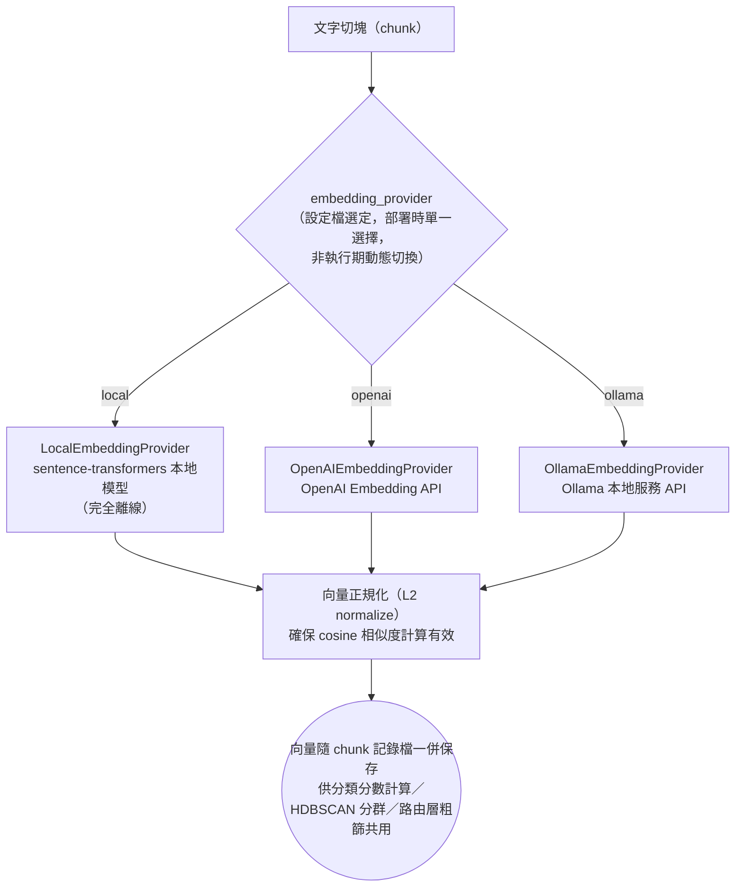

# 向量化模組 (Embedding Provider)

本模組負責將文字切塊（chunk）轉換為向量表示，供暫存區分類（文件↔KG 相似度）、AI 自動分群（HDBSCAN）、路由層向量粗篩（ConceptNode KNN）三處下游機制共用。向量化本身**不是本論文的研究問題**，而是直接沿用 v1 已驗證、屬於通用基礎設施的 provider 實作（見專案 `CLAUDE.md`：「`core/`...已可運作，直接沿用 v1 驗證過的實作，屬於通用基礎設施、非本次重整範圍」）；本文件的目的是為消費此向量的下游機制，補齊「向量從哪裡來、為何 cosine 相似度在此有效」的實作對應與文獻依據。

---

## 🎓 學術文獻支撐 (Literature Support)

1. **句子/段落級語意向量與 Cosine 相似度的有效性 (Sentence Embeddings)**：
   * **APA 引用**：*Reimers, N., & Gurevych, I. (2019). Sentence-BERT: Sentence embeddings using Siamese BERT-networks. In Proceedings of the 2019 Conference on Empirical Methods in Natural Language Processing and the 9th International Joint Conference on Natural Language Processing (EMNLP-IJCNLP) (pp. 3982-3992). Association for Computational Linguistics.*
   * **論文定位**：`LocalEmbeddingProvider`（`local.py`）以 `sentence-transformers` 函式庫實作，其底層技術可追溯至本文獻提出的雙塔式（Siamese）BERT 架構。該文獻的核心貢獻是證明「句子向量之間的 cosine 相似度可作為有意義的語意距離度量」，直接支撐本專案將文件/KG 表示為 chunk 向量平均值、再以 cosine／歐氏距離做語意比對（分類分數計算、HDBSCAN 分群、路由層向量粗篩）的合理性。程式碼中 `encode()`／`encode_batch()` 皆設定 `normalize_embeddings=True`，讓向量落在單位球面上、使 cosine 相似度計算數值穩定，與本文獻的向量正規化實務一致。**本專案「取多個 chunk 向量的平均值代表一個更大單位（文件／KG）」的做法，是本文獻「取多個 token 向量的平均值代表一個句子」同一數學技巧，往上推一層的自然延伸。**

2. **切塊粒度：多細才夠精準 (Retrieval Granularity)**：
   * **APA 引用**：*Chen, T., Wang, H., Chen, S., Yu, W., Ma, K., Zhao, X., Zhang, H., & Yu, D. (2024). Dense X retrieval: What retrieval granularity should we use? In Proceedings of the 2024 Conference on Empirical Methods in Natural Language Processing (pp. 15159-15177). Association for Computational Linguistics.*
   * **論文定位**：實證比較以固定長度段落、句子、與細粒度 proposition（每個 proposition 是一個獨立、自足的事實敘述）作為檢索單位的效果，發現**細粒度單位在檢索準確率與下游問答表現上都優於粗粒度段落**。本專案目前的切塊策略（`sentence_aware_chunking`，見 3.1.2 節）已採句子感知而非任意固定字數截斷，方向與本文獻一致，但尚未評估是否該進一步收斂到更細的 proposition 級別——這是第五章可以做的消融實驗，而非本文獻直接告訴我們「該切多大」的固定答案。
3. **切塊大小：任務依賴、無單一正確答案 (Chunk Size Sensitivity)**：
   * **APA 引用**：*Bhat, S. R., Rudat, M., Spiekermann, J., & Flores-Herr, N. (2025). Rethinking chunk size for long-document retrieval: A multi-dataset analysis. arXiv preprint arXiv:2505.21700.*
   * **論文定位**：多資料集實證顯示，**事實型問答適合小塊（64-128 tokens）、需要廣泛脈絡理解的任務適合大塊（512-1024 tokens）**，且不同 embedding 模型對切塊粒度的敏感度不同（例如某些模型在大塊下表現更好、某些模型偏好小塊）。這直接回應「切塊要切多大」的問題：**沒有放諸四海皆準的固定數值**，最佳大小取決於任務類型與所選 embedding 模型，需要針對本專案的查詢任務類型（事實檢索 vs. 多跳推理 vs. 摘要）與最終選定的 provider 做實際測試，不能只憑經驗值假設。
4. **不同模型的向量空間互不相容 (Model Inconsistency)**：
   * **APA 引用**：*Muennighoff, N., Tazi, N., Magne, L., & Reimers, N. (2023). MTEB: Massive text embedding benchmark. In Proceedings of the 17th Conference of the European Chapter of the Association for Computational Linguistics (pp. 2014-2037). Association for Computational Linguistics.*
   * **論文定位**：橫跨 8 類任務、58 個資料集、33 個模型的系統性評測，核心發現是**沒有任何一個 embedding 模型在所有任務上都是最佳選擇**——不同模型的訓練資料、目標函式、向量維度都不同，其向量空間彼此不保證對齊，直接比較（或混用）來自不同模型的向量在數學上沒有意義。這正式佐證本模組「三種 provider 部署時單一選擇、系統執行期不切換」的設計約束（見下方 Behavior Tree 注意事項），也說明為何本專案把 embedding provider 做成可設定、但不做成「自動挑選當下最佳模型」——因為「最佳模型」本身就是任務依賴、無普適解的問題，動態切換只會製造向量空間不一致的風險，不會換來效能提升。
5. **平均池化之外的替代方案：多向量表示 (Multi-Vector Retrieval，未採用，列為未來優化方向)**：
   * **APA 引用**：*Khattab, O., & Zaharia, M. (2020). ColBERT: Efficient and effective passage search via contextualized late interaction over BERT. In Proceedings of the 43rd International ACM SIGIR Conference on Research and Development in Information Retrieval (pp. 39-48).*
   * **論文定位**：本專案將一份文件的所有 chunk 向量**平均成單一向量**（見下方 Behavior Tree），這是資訊有損的簡化——多個 chunk 各自的細節在平均後會被稀釋，文件越長、chunk 數越多，這個問題可能越明顯。ColBERT 提出的「後期互動」（late interaction）機制保留每個 chunk／token 的獨立向量，查詢時逐一比對再聚合分數，精度更高但儲存與計算成本也顯著提升。本專案**現行設計是刻意的簡化取捨**（單一 prototype 向量換取儲存與計算的簡單性），非未曾意識到此替代方案；若第五章消融實驗顯示平均池化導致分類/分群準確率明顯受限，ColBERT 式多向量表示是有文獻基礎的下一步優化方向，可列入第七章未來工作。

**範圍聲明**：OpenAI／Ollama 兩個 provider（`openai.py`／`ollama.py`）為封閉或第三方維護的商用/開源服務，其底層模型細節不在本專案查證範圍內，本專案僅將其視為可替換的向量化後端，不對其內部技術做文獻層級的佐證主張。向量化 provider 本身的選型、訓練、微調不是本論文的研究問題。

---

## 🛠️ 架構與選型決策流程 (Behavior Tree)

文件解析完成後，系統對每個 chunk 各自計算一個向量，而非整份文件只算一個向量——這是暫存區分類「文件代表向量＝該文件所有 chunk 向量的平均」、AI 自動分群「以文件代表向量做距離計算」的必要前提，也是路由層向量粗篩（KNN Top-K=100）比對的基本單位。

**注意**：三種 provider 由 `core/providers/factory.py` 的 `init_providers()` 依設定檔 `settings.embedding_provider` 在系統啟動時擇一初始化（`match/case` 選型，非執行期 fallback 或多 provider 併用）。三者的向量空間彼此不相容——切換 provider 等同切換整個系統的語意空間，既有向量索引需要全部重新計算；系統/實驗環境需固定使用單一 provider，不可中途切換。

---

## 📐 可行性驗證與優化建議 (Feasibility & Optimization Notes)

以下三點回應「切塊要多大、不同模型會不會不一致、怎麼保證穩定度」三個具體疑慮，區分**現行已具備的保證**與**尚待第五章實驗驗證的開放問題**，不誇大現況：

1. **切塊粒度（🟡 實驗設計已完成，尚未執行，2026-07-17）**——`parser` 模組的 `sentence_aware_chunking` 已避免任意字數截斷造成語句攔腰截斷，方向與 Chen et al.（2024）「細粒度單位優於粗粒度段落」的結論一致；但具體切多大（`chunk_size` 現行預設 500 **字元**，注意單位是字元不是文獻的 token）目前沿用 v1 經驗值，未針對本專案的任務類型與最終選定的 embedding 模型做過敏感度測試。Bhat et al.（2025）已證明「最佳 chunk size 因任務與模型而異」，**沒有一個放諸四海皆準的數字**——完整前置消融實驗設計（5 組字元數掃描、文獻單位落差的誠實處理、三層評估指標、與後續章節的依賴順序）已寫入第五章 **5.3「前置參數校準實驗：Chunk Size 敏感度」**，待該實驗執行完成後，結果將回填本文件並鎖定 `core/constants.py` 的正式參數。
2. **模型一致性（✅ 已實作：啟動時強制一致性檢查，2026-07-17）**——三個 provider 由設定檔在啟動時擇一初始化，程式碼架構上已排除「同一系統同時混用兩個模型」的可能性，這與 MTEB（Muennighoff et al., 2023）「沒有普適最佳模型、必須依任務挑選並固定」的發現一致。原本的缺口是**沒有執行期防呆機制**：若使用者在系統運行一段時間後修改 `.env` 的 `embedding_provider` 並重啟，現有的 Neo4j 向量索引不會自動失效或重新計算，會產生新舊向量混雜、cosine 相似度不再有意義的靜默錯誤。**已修復**：新增 `core/embedding_guard.py`，`main.py` lifespan 在 `init_providers()` 之後、`create_vector_index()` 之前呼叫 `check_and_register()`——把目前使用的 provider／model 名稱／向量維度寫入 Neo4j 的 `_EmbeddingMeta` 系統節點；首次啟動視為合法初始化並寫入記錄，之後每次啟動皆與既有記錄比對，不一致就拋出 `EmbeddingProviderMismatchError` 直接擋下啟動（而非靜默繼續、留下無人發現的髒資料），錯誤訊息明確列出新舊差異與兩種處理方式（改回原設定，或重新向量化後手動更新記錄）。`EmbeddingProvider` 介面（`core/providers/base.py`）也新增 `model_name` 抽象屬性，三個 provider 皆已補齊實作，供此檢查機制統一呼叫。已補 6 項單元測試（`tests/core/test_embedding_guard.py`，涵蓋首次啟動、一致放行、provider 不同／model 不同／dim 不同三種不一致情境、不一致時不覆寫既有記錄），與既有 128 項測試一併通過。
3. **穩定度（現行：數值層面已有正規化保證，跨 provider／跨版本的再現性未驗證）**——`encode()`／`encode_batch()` 皆設定 `normalize_embeddings=True`，確保同一次呼叫內向量落在單位球面、cosine 計算數值穩定；`sentence-transformers` 在同一模型、同一硬體精度下對同一輸入通常具確定性（無隨機性算子）。但**業界已有實例顯示，同一模型換一個推理框架/精度設定，向量可能出現顯著漂移**（例如 Qwen3-Embedding 系列模型曾出現不同框架實作間 cosine 相似度低於 0.2 的落差，見 `huggingface/text-embeddings-inference` GitHub Issue #642，屬工程實例證據非同儕審查文獻，僅供佐證問題真實存在，不作為正式引用）。**建議**：第五章實驗設計需明確記錄 embedding provider 的模型名稱、版本、推理框架與精度設定（比照 3.6 節「實驗可追溯性承諾」的四項資訊），確保實驗結果的向量來源可完整追溯與重現，而不是只記錄「使用了哪個 provider」這種粗粒度資訊。

上述三點皆屬工程實作精修範疇，供第四章實作或第五章實驗設計參考，非本論文正式研究問題（RQ）。

---

## 對應論文章節

`docs/論文/03_系統設計與方法論.md` 3.1 總覽圖的 `VEC` 節點（`[[ 雙框 ]]`）指向本文件，作法與 `parser/README.md` 被 `PARSE` 節點引用的方式一致——本模組的實作細節與文獻佐證只在此處維護一份，論文正文不重複展開，避免兩份文件各自簡化、彼此表述不一致。
