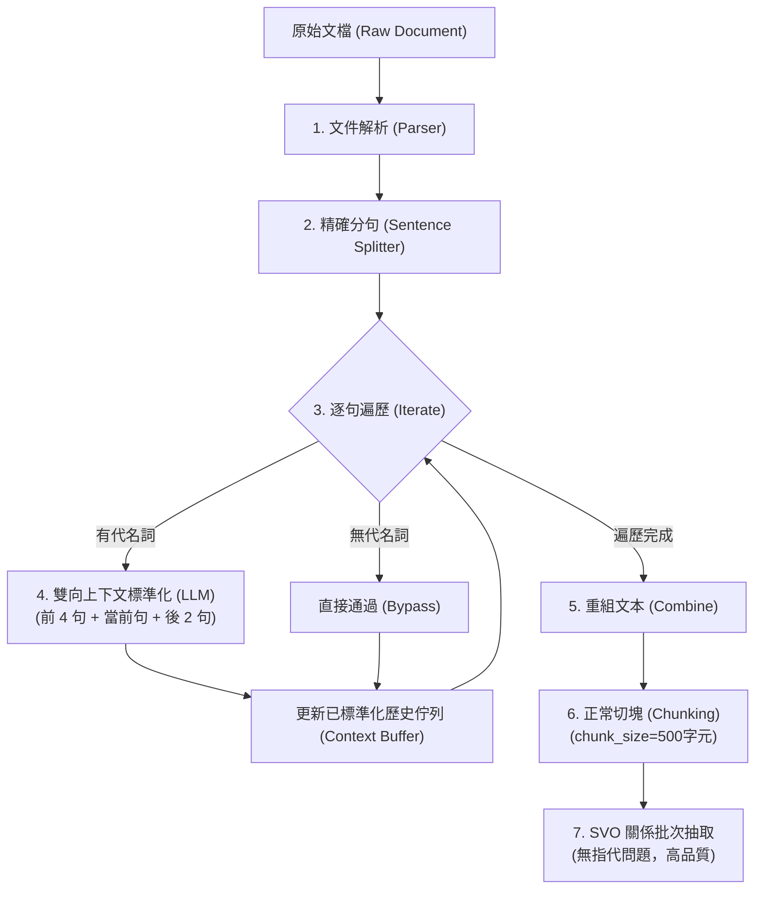

# 05：指代消解與文本標準化前處理任務書

> 狀態：🟡 設計提案（2026-07-20 初稿 → 2026-07-21 補上實作，偵測機制改用雙軌方案）——機制合理，但關鍵參數（「前 4 後 2」視窗大小）與涵蓋範圍尚未經驗證，第五章消融實驗前不可視為已驗證設計。
> 本任務書基於 CORE-KG (KDD '25) 理念，將「指代消解」與「人事時地物標準化」從 SVO 關係抽取中剝離，移至 Ingestion 流程最前端作為獨立前處理，以簡化 downstream 的切塊與關係抽取架構。
>
> **範圍界定（2026-07-20 補充）**：本任務書**只涵蓋代名詞消解**（他/她/它/其/該...），**不涵蓋實體別名消解**（全稱/簡稱/縮寫，如「I-35」對「Interstate Highway 35」）——這是刻意的範圍切割，兩者是不同機制，實體別名消解另有獨立設計，完整分工見 `docs/論文/03_系統設計與方法論.md` § 3.4（實體指代與別名消解，RQ4b）。**已知限制已於實作時修正**：原「單字元 substring match」會誤觸發於「其他／其中／其實／應該」等常見詞、且未涵蓋複數代名詞——2026-07-21 已改採 `docs/報告/10_代名詞雙軌檢測與正則詞庫自動進化機制設計報告.md` 的 POS＋正則雙軌偵測（使用者決策採用），並補上複數代名詞（他們/她們/它們）；本任務書的雙向上下文視窗設計（前 4 後 2）與 LLM prompt 本身維持不變，僅偵測層改用雙軌方案。**✅ 實作**：`services/pronoun_resolution_service.py::resolve_coreference_pipeline()`，測試見 `tests/services/test_pronoun_resolution_service.py`（18 項）。

---

## 1. 背景與動機 (Background & Motivation)

在建構雙層知識圖譜的建圖流程中，跨句指代與代名詞（如：「他」、「它」、「該公司」）是導致關係抽取召回率下降、圖譜產生冗餘/孤立節點（如單獨的 `(he)` 節點）的核心痛點。

先前探討過「滑動視窗」或「多粒度關聯」等機制，但其會大幅增加 Ingestion 任務佇列（3.1.2 節）的狀態維護與重assign時的複雜度。

本任務書引進 **CORE-KG (KDD '25)** 的核心思想，將指代消解與標準化改為**「切塊前的獨立前處理」**。
透過**「前 4 句已標準化接力 + 後 2 句原始文獻預覽」**的雙向上下文視窗，交由小 LLM 完成就地替換（In-place Replacement），產生語意自足的標準化文本後，再進行常規切塊與批次 SVO 抽取。

---

## 2. 系統架構與管線流程 (System Pipeline)



---

## 3. 雙向上下文消解機制 (Bidirectional Context Window)

### 3.1 「前 4 後 2」設計原理
1. **前文 (Past Context, Max=4 句)**：
   包含當前句之前、已經過 LLM 標準化處理的句子。由於前面的代名詞已被替換為真實實體，實體會像接力棒一樣向下傳遞（實體接力效應），因此前 4 句已足夠提供完整歷史脈絡。
2. **後文 (Future Context, Max=2 句)**：
   包含當前句之後的原始句子。專門用來處理**「後指（Cataphora）」**情況（即代名詞在前，具體實體在後）。在寫作習慣中，後指的實體通常會在接下來的 1~2 句內揭曉，因此後文只需 2 句，以節省 Token。

### 3.2 「實體接力」運作實證範例
* **原始輸入**：
  * `S1`：馬斯克創立了 SpaceX。 (無代名詞)
  * `S2`：**他**隨後研發了獵鷹火箭。 (有代名詞)
  * `S3`：**它**是一枚可回收火箭。 (有代名詞)
* **處理過程**：
  * `S1` 直接通過。佇列儲存：`[S1]`
  * `S2` 偵測到「他」。LLM 參考 `[S1]`，輸出 `S2'`：`馬斯克隨後研發了獵鷹火箭。`。佇列儲存：`[S1, S2']`
  * `S3` 偵測到「它」。LLM 參考 `[S1, S2']`。雖然 `S1` 離 `S3` 較遠，但因為 `S2'` 已經將「他」置換為「馬斯克」並引入了新實體「獵鷹火箭」，LLM 能輕易將 `S3` 中的「它」接力置換為「獵鷹火箭」，輸出 `S3'`：`獵鷹火箭是一枚可回收火箭。`。

### 3.3 邊界條件與代碼安全防禦說明
「前 4 後 2」代表的是**上下文的最大可能範圍**。當處理文章「最前端」或「最後端」的句子時，視窗會自動且安全地縮減，不會有語意或代碼崩潰的問題：
1. **文章首部（前文不足 4 句）**：
   * 當處理 $i < 4$ 的句子時，前文只會包含前 $i$ 句（例如第一句的前文為 0 句，第二句的前文為 1 句）。
   * **語意合理性**：文章剛開頭時，指代對象不可能存在於更前面（因為不存在前文），因此前文不足並不會影響消解，LLM 將專注於從後文尋找答案。
2. **文章尾部（後文不足 2 句）**：
   * 當處理最後兩句時，後文會自動縮減為 1 句或 0 句。
   * **語意合理性**：文章即將結束，若有代名詞，其指代對象幾乎必定存在於前文歷史中。
3. **代碼防禦（Slicing 安全性）**：
   * Python 的切片語法 `list[start:end]` 天生具備邊界安全防禦。即使 `i - 4 < 0` 或 `i + 3 > total_len`，切片只會返回邊界內的所有元素，**絕對不會拋出 `IndexError`**，保證了管線的運行穩定性。

---

## 4. 詳細設計與代碼規範 (Specification & Code)

### 4.1 核心處理模組實作

> ✅ **2026-07-21 校正**：句子切分已重構為共用元件——`parser/core.py::split_into_sentences()`（連同其 `SENTENCE_ENDINGS` 正則）現為全專案唯一的句子邊界判定來源，`sentence_aware_chunking()`（RAG 向量檢索切塊）本身已改為呼叫它。原因：本任務書原本自己另外維護一份 `SENTENCE_SPLITTER` 正則，與 `parser/core.py` 當時內嵌在 `sentence_aware_chunking()` 裡的版本不一致（少了排除縮寫/小數點誤判的負向前瞻），造成兩處各自維護、規則會漂移的風險。本次已將本任務書當初設計的負向前瞻規則（排除 e.g./i.e./vs./縮寫/小數點）併入 `parser/core.py` 的正式版本，本任務書之後實作時**應直接 `from parser.core import split_into_sentences` 呼叫，不要再另外定義 `SENTENCE_SPLITTER`**。下方程式碼範例已同步更新；唯一差異是 `parser.core.split_into_sentences()` 刻意不 strip 個別句子（因為 RAG 切塊需要保留原始間距才能精確重組），呼叫端（本管線）仍需自行 strip／過濾空字串，下方範例已反映此差異。

```python
import re

from parser.core import split_into_sentences

# 本地代名詞粗篩正則（僅對有代名詞的句子呼叫 LLM，節省 80% Token）
PRONOUN_PATTERN = re.compile(r'(他|她|它|其|該|這家|這名|那名|前者|後者|上述)')

def split_and_clean_sentences(text: str) -> list[str]:
    """呼叫共用的 split_into_sentences() 後，strip 並過濾空字串（本管線專用需求）"""
    return [s.strip() for s in split_into_sentences(text) if s.strip()]

def has_pronoun(sentence: str) -> bool:
    """本地正則快速篩選是否有代名詞"""
    return bool(PRONOUN_PATTERN.search(sentence))

def call_small_llm_bidirectional(past_context: str, future_context: str, target: str, client) -> str:
    """建構 Prompt 並呼叫小 LLM (如 Gemini 3.5 Flash) 進行指代消解"""
    prompt = f"""你是一個文字標準化助手。
任務：參考【前文】或【後文】的實體資訊，將【目標句子】中模糊的代名詞（如：他、她、它、該、這、其）替換為明確的實體名稱。

規則：
1. 優先從【前文】尋找指代對象。若【前文】找不到，請從【後文】尋找首次出現的具體名稱（如：後文若有「SpaceX」，目標句的「這家公司」應替換為「SpaceX」）。
2. 只修改【目標句子】中的指代詞，不要修改其他文字，亦不要合併或拆分句子。
3. 不要輸出任何解釋或多餘的引言。只輸出修改後的句子本身。

【前文（歷史資訊）】
{past_context if past_context else "(無)"}

【目標句子】
{target}

【後文（後續資訊）】
{future_context if future_context else "(無)"}

【修改後句子】"""

    # client 必須實作 generate(prompt: str) -> str
    response = client.generate(prompt)
    return response.strip()

def resolve_coreference_pipeline(text: str, llm_client) -> str:
    """指代消解標準化前處理管線"""
    raw_sentences = split_and_clean_sentences(text)
    total_len = len(raw_sentences)
    final_sentences = []
    
    for i, sent in enumerate(raw_sentences):
        if has_pronoun(sent):
            # 取得前 4 句已處理好的句子
            past_context = final_sentences[max(0, i-4) : i]
            # 取得後 2 句未處理的句子
            future_context = raw_sentences[i+1 : min(total_len, i+3)]
            
            past_text = "\n".join(f"- {s}" for s in past_context)
            future_text = "\n".join(f"- {s}" for s in future_context)
            
            normalized_sent = call_small_llm_bidirectional(
                past_context=past_text,
                future_context=future_text,
                target=sent,
                client=llm_client
            )
            final_sentences.append(normalized_sent)
        else:
            # 無代名詞，直接 bypass 納入結果
            final_sentences.append(sent)
            
    # 合併回完整文字，進入後續 chunking 流程
    return " ".join(final_sentences)
```

---

## 5. 後續驗證與評估指標 (Verification & Metrics)

本機制實施後，應在第五章進行消融實驗（Ablation Study）校準，並量化評估以下指標：

1. **實體冗餘度 (Entity Redundancy Rate)**：
   比對不啟用前處理與啟用前處理後，知識圖譜中如 `(he)`、`(the company)` 等無效/重複節點的減少比例。預期重合與雜訊節點應下降 **20% 以上**。
2. **SVO 抽取精準度 (SVO Extraction Recall)**：
   檢查因代名詞被成功替換後，原先被漏抽的跨句關係（例如：因果、比較關係）的召回表現。
3. **Token 消耗效率 (Token Efficiency)**：
   與「整篇文本指代消解」及「滑動視窗法」相比，本機制透過正則篩選（預期過濾 70%-80% 的句子）與僅 7 句的 Context Window，應能**節省 60% 以上的 API Token 消耗**。
