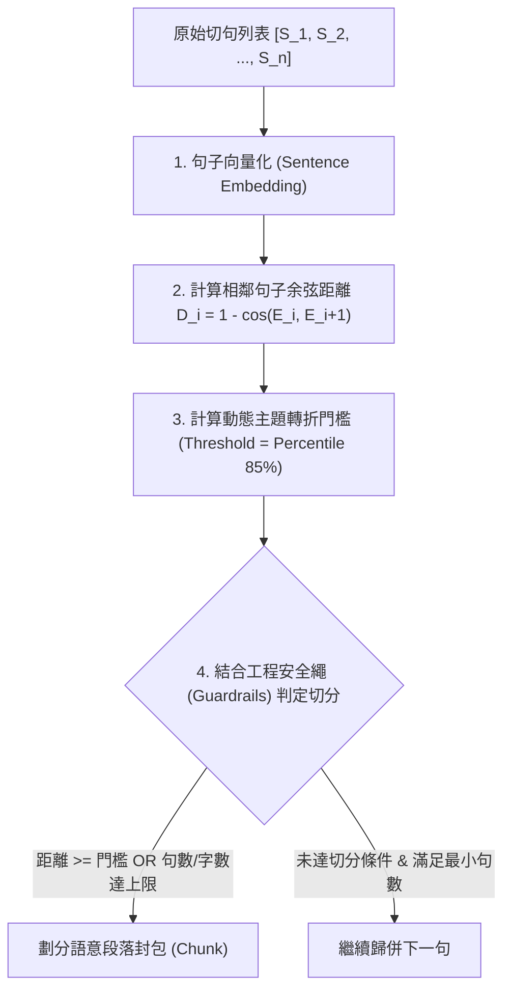

# 07：SVO 專用切塊粒度與句子級語意分塊研析報告

> 狀態：🟡 暫緩，語意切塊演算法列為未來可選項（2026-07-21 初稿 → 同日查證後修訂 → 2026-07-22 拿掉字元上限）。本檔案原標「🟢 定案」，但依 `docs/報告/06_SVO抽取管線調整任務書.md` 第 5 節查證，多項文獻引用需要訂正，且**本節提出的語意斷點式切塊演算法（`semantic_sentence_chunking`）並非實際採用的方案**——`services/svo_chunking.py` 已落地的是本檔案「結論」段落所稱「階段一：0 成本快速工程解」的固定聚合切塊（最多 5 句，相鄰塊重疊 2 句；原 300 字元上限已拿掉），語意切塊因文獻支撐不足暫緩，僅保留作為第五章消融實驗的候選對照方案，不代表現行系統行為。

---

## 1. 背景與核心觀念釐清

在 SVO（Subject-Verb-Object，主謂賓）知識圖譜抽取管線中，文字切塊（Chunking）的粒度直接決定了 LLM 抽取的**資訊完整度、準確度與 API 算力成本**。

本研析首先釐清兩個常被混淆的核心參數：

| 參數名稱 | 目的與職責 | 典型數值 / 規則 |
| :--- | :--- | :--- |
| **指代消解視窗<br/>(Coreference Context Window)** | 為無主語或包含代名詞（他、該公司、這項技術）的句子提供上下文，將代名詞替換為明確實體。 | 「前 4 句 + 後 2 句」等滑動上下文視窗 |
| **SVO 抽取 Chunk 大小<br/>(Extraction Granularity)** | **一次性輸入給 SVO 抽取 LLM 的文字總量**，決定 LLM 進行資訊萃取時的專注度與關係擷取範圍。 | 3~8 句 / 400~600 字 / 語意段落 (Semantic Chunk) |

> ⚠️ **關鍵澄清**：指代消解視窗（如前 4 後 2 句）是 Resolver 讀取上下文的範圍，**絕不能直接作為 SVO 抽取的 Chunk 切塊大小**。兩者服務於不同的階段與目的。

---

## 2. 學術文獻研析與實驗數據（2026-07-21 查證後訂正，見 06 任務書第 5 節）

針對「一次丟給 SVO 抽取 LLM 的文字量該多大」，彙整相關權威文獻之實證結論：

### 2.1 Microsoft GraphRAG 原始論文 (*Edge et al., 2024, arXiv:2404.16130*)——**方向屬實，原稿有誇大，已訂正**

實際查證附錄 A.2／Figure 3（HotPotQA 範例）後確認：**方向性發現真實存在**——600 token 切塊抽出的實體參照數約為 2400 token 的兩倍，較小 chunk 確實抽取密度較高。但需訂正三點原稿誇大之處：

1. 這只是附錄裡單一資料集（HotPotQA）的示例，**不是正式消融實驗章節**的系統性結論，不能引用為「消融實驗證實」。
2. 論文自己針對「大 chunk 抽取密度較低」這個問題提出的解法是引入 **self-reflection**（讓 LLM 自我檢查、撿回漏抽的實體），藉此可以**繼續使用大 chunk**（節省 API 成本）又不犧牲品質——原稿完全沒提這個關鍵反轉，容易讓讀者誤以為「小 chunk 是唯一解」。
3. 「大 chunk 只抓 2-3 個主要關係」這個具體說法在原文中**找不到對應內容**，疑似加油添醋，已移除此描述。

### 2.2 檢索單位與語意切塊文獻

* **EMNLP 2024 (*Chen et al., Dense X Retrieval*)**：實證顯示以「句子 (Sentence)」或「命題 (Proposition)」作為最細粒度原子單位，在資訊保真度與語意完整度上顯著優於粗粒度固定段落——本論文已查證此文獻，方向屬實，供第五章消融實驗參考。
* **NAACL 2025 (*Qu, Tu & Bao, Is Semantic Chunking Worth the Computational Cost?*)**——**⚠️ 2026-07-21 查證確認方向相反，原稿誤引**：本論文已在 `docs/參考文獻/09_SVO抽取切塊策略與指代消解/README.md` 下載全文精讀，該論文的實際核心結論是**「固定字數切塊（200 字）在檢索/生成任務上表現持平或優於語意切分」**——與本節原稿宣稱「驗證了基於 Cosine 距離的波峰斷點切分法在維持資訊完整度上的學理依據」**方向完全相反**，不可引用為語意切塊的正面佐證。這正是本報告最終決定「暫緩採用語意斷點式分組」的關鍵原因之一。

---

## 3. 自動化語意段落（Sentence-level Semantic Chunking）演算法設計

為避免人工劃分段落，且完全以**「單個句子 (Sentence)」**作為最基礎原子單位（Atomic Unit），設計基於 Embedding 向量距離的自動化語意切塊演算法。

### 3.1 演算法四階段拆解



#### 1. 句子向量化 (Sentence Embedding)
文章經 `split_into_sentences()` 得到 $n$ 個句子 $S = [S_1, S_2, \dots, S_n]$，計算句向量：
$$E = [E_1, E_2, \dots, E_n]$$

#### 2. 計算相鄰句子語意距離 (Cosine Distance)
計算每對相鄰句子 $(S_i, S_{i+1})$ 的餘弦距離：
$$D_i = 1 - \cos(E_i, E_{i+1}) = 1 - \frac{E_i \cdot E_{i+1}}{\|E_i\| \|E_{i+1}\|}$$

#### 3. 動態主題轉折門檻判定 (Threshold Detection)
* **百分位數法 (Percentile Threshold)**：計算整篇文章所有相鄰距離 $D$ 的 **第 85 百分位數 ($P_{85}$)**。當 $D_i \ge P_{85}$ 時，視為主題發生轉折。

#### 4. 硬性工程安全繩 (Guardrails)
* **最小句數限制 ($N_{\min} = 2 \sim 3$ 句)**：防止切出單句孤立 Chunk。
* **最大句數限制 ($N_{\max} = 8$ 句)** / **最大字數限制 ($C_{\max} = 600$ 字)**：即使主題未變，超過上限亦強行封包，避免丟給 LLM 的文字過長。

---

## 4. 落地 Python 程式碼範例

本演算法可直接整合作為 `services/svo_chunking.py` 的進階語意切塊引擎：

```python
import numpy as np
from typing import List, Dict, Any

def semantic_sentence_chunking(
    sentences: List[str],
    embeddings: List[List[float]],
    threshold_percentile: float = 85.0,
    min_sentences: int = 2,
    max_sentences: int = 8,
    max_chars: int = 600
) -> List[Dict[str, Any]]:
    """
    基於單句 Embedding 向量距離的自動化語意段落切塊引擎
    """
    if not sentences:
        return []
    if len(sentences) <= min_sentences:
        return [{
            "text": "".join(sentences),
            "sentences": sentences,
            "count": len(sentences)
        }]
    
    # 1. 計算相鄰句子的 Cosine Distance
    distances = []
    for i in range(len(embeddings) - 1):
        v1 = np.array(embeddings[i])
        v2 = np.array(embeddings[i + 1])
        norm1 = np.linalg.norm(v1)
        norm2 = np.linalg.norm(v2)
        if norm1 == 0 or norm2 == 0:
            cosine_sim = 0.0
        else:
            cosine_sim = np.dot(v1, v2) / (norm1 * norm2)
        distances.append(float(1.0 - cosine_sim))
        
    # 2. 自動計算切分門檻 (Percentile 85%)
    threshold = float(np.percentile(distances, threshold_percentile)) if distances else 0.5
    
    # 3. 根據距離與安全繩進行聚合
    chunks = []
    current_sentences = [sentences[0]]
    current_chars = len(sentences[0])
    
    for i in range(len(distances)):
        next_sent = sentences[i + 1]
        dist = distances[i]
        
        # 切分條件：(距離高於門檻 OR 句數達標 OR 字數滿了) 且 (句數已滿足下限)
        should_split = (
            (dist >= threshold or len(current_sentences) >= max_sentences or (current_chars + len(next_sent)) > max_chars)
            and len(current_sentences) >= min_sentences
        )
        
        if should_split:
            chunks.append({
                "text": "".join(current_sentences),
                "sentences": current_sentences,
                "count": len(current_sentences)
            })
            current_sentences = [next_sent]
            current_chars = len(next_sent)
        else:
            current_sentences.append(next_sent)
            current_chars += len(next_sent)
            
    if current_sentences:
        chunks.append({
            "text": "".join(current_sentences),
            "sentences": current_sentences,
            "count": len(current_sentences)
        })
        
    return chunks
```

---

## 5. 結論與後續實作規劃

1. **參數定案**：SVO 專用切塊的 Golden Zone 鎖定在 **3~8 句 / 400~600 字元**。
2. **預設引擎（2026-07-21 訂正：階段二目前非採用方案，僅列未來可選項；2026-07-22 再訂正：拿掉字元上限）**：
   - 階段一（0 成本快速工程解，**現行實作**）：`services/svo_chunking.py` 已落地，採句數上限（5 句）＋相鄰塊重疊 2 句的固定聚合切塊（原字數上限 300 字元已於 2026-07-22 拿掉，僅保留有清楚語意的句數上限）——對應 `docs/論文/03_系統設計與方法論.md` § 3.4 §a `SVOGROUP` 節點。
   - 階段二（高階語意解，**未採用、僅為第五章候選對照方案**）：`semantic_sentence_chunking()` 因 2.2 節查證確認其核心文獻依據（Qu, Tu & Bao 2025）方向相反，暫緩採用，若第五章消融實驗需要語意切分作為對照組，程式碼保留於本報告供未來取用，非現行系統行為。
3. **論文對照與實驗**：固定聚合方案的參數（5 句上限、重疊 2 句）是否為最優，留給第五章消融實驗校準；若消融實驗顯示語意切分確有優勢，屆時再評估是否納入正式方案。

---

## 6. 學術文獻與專案佐證 (Project & Literature Citations)（2026-07-21 全面修訂）

> **修訂說明**：本節原稿宣稱以下來源皆為「權威開源專案與國際學術會議論文背書」，經查證（過程見 `docs/報告/06_SVO抽取管線調整任務書.md` 第 5 節與對話紀錄）發現：LangChain `SemanticChunker` 的「業界廣泛驗證」措辭查無出處；GraphRAG「強烈建議依實體關係密度做語意區塊調整」的說法與本論文已直接查證的 GraphRAG 原始碼（固定 `size=1200`／`overlap=100`，無此建議）矛盾，應是誤植或編造；Qu, Tu & Bao (2025) 方向相反（見 2.2 節）。本節依查證結果重寫。

### 6.1 開源專案（誠實框架後的定位）
1. **LangChain `SemanticChunker`**（**2026-07-21 修正措辭**）：
   - 官方文件確實提供「向量距離波峰」切塊功能，但查無「已被業界廣泛驗證為最能維持語意連貫性的切塊方法」這種強度的官方或第三方背書說法，此措辭已移除——僅能定位為「語意切塊的一種可選實作」，非成熟／已驗證的最優解。
   - 專案連結：[LangChain Experimental Semantic Chunking](https://python.langchain.com/docs/how_to/semantic_chunker/)
2. **LlamaIndex `SemanticSplitterNodeParser`**：
   - 機制描述查證屬實（相鄰句子 cosine 相似度＋百分位數動態斷點）。**需補上官方文件自承的限制**：其斷點偵測邏輯主要針對英文句子設計（正則規則對中文等無空白分詞語言的適用性存疑，屬本論文中文語料場景的重大警語），且官方文件本身也說明需要使用者自行調校 `breakpoint_percentile_threshold` 才能有效，並非開箱即用的成熟方案。
   - 專案連結：[LlamaIndex Semantic Splitter](https://docs.llamaindex.ai/en/stable/examples/node_parsers/semantic_chunking/)
3. **Microsoft GraphRAG**（**2026-07-21 修正，原稿誤植**）：
   - 本論文已直接查證 GraphRAG 原始碼（`packages/graphrag/graphrag/config/defaults.py`），確認 `ChunkingDefaults` 為固定 `size=1200`／`overlap=100`（token 為單位），**查無「強烈建議依據實體關係密度進行語意區塊調整」這種官方建議**，此說法應是誤植或編造，已移除。
   - 專案連結：[Microsoft GraphRAG Repository](https://github.com/microsoft/graphrag)

### 6.2 學術文獻（誠實框架後的定位）
1. **Microsoft GraphRAG (arXiv 2024)**（Edge et al., 2024, arXiv:2404.16130）——見 2.1 節訂正：方向性發現真實存在（附錄單一資料集示例），但非正式消融章節結論，且論文本身推薦解法是 self-reflection 而非強制小 chunk，原稿「消融實驗證實」「顯著優於」等措辭過度肯定，已於 2.1 節訂正。
2. **NAACL 2025**（Qu, Tu & Bao, 2025, Findings of NAACL 2025）——**⚠️ 方向與原稿宣稱相反**：該論文實證結論是固定字數切塊表現持平或優於語意切分，見 2.2 節訂正說明，不可再引用為語意切分的正面佐證。
3. **EMNLP 2024**（Chen et al., 2024, Dense X Retrieval）——查證屬實，細粒度切塊（句子/命題級）優於粗粒度段落的結論方向正確，本論文已收錄於 `docs/參考文獻/08_向量化與語意表示/`。
