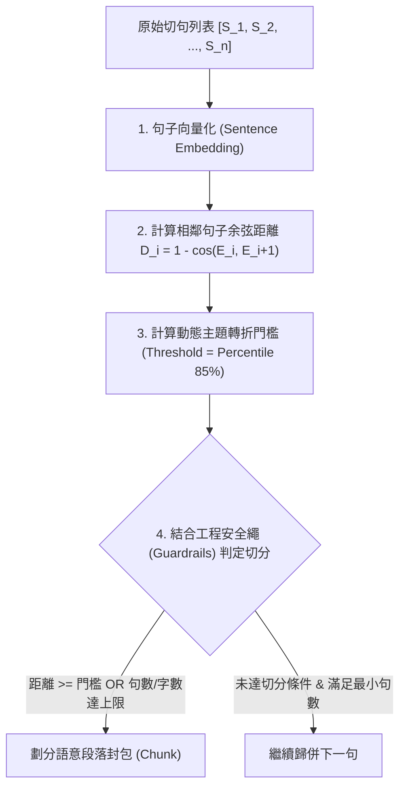

# 07：SVO 專用切塊粒度與句子級語意分塊研析報告

> 狀態：🟢 定案——本檔案記錄 2026-07-21 針對 SVO 抽取管線中「SVO Chunk 切塊粒度」與「自動化語意段落建構演算法」之討論成果、文獻研析結論與落地演算法設計。

---

## 1. 背景與核心觀念釐清

在 SVO（Subject-Verb-Object，主謂賓）知識圖譜抽取管線中，文字切塊（Chunking）的粒度直接決定了 LLM 抽取的**資訊完整度、準確度與 API 算力成本**。

本研析首先釐清兩個常被混淆的核心參數：

| 參數名稱 | 目的與職責 | 典型數值 / 規則 |
| :--- | :--- | :--- |
| **指代消解視窗<br/>(Coreference Context Window)** | 為無主語或包含代名詞（他、該公司、這項技術）的句子提供上下文，將代名詞替換為明確實體。 | 「前 4 句 + 後 2 句」等滑動上下文視窗 |
| **SVO 抽取 Chunk 大小<br/>(Extraction Granularity)** | **一次性輸入給 SVO 抽取 LLM 的文字總量**，決定 LLM 進行資訊萃取時的專注度與關係擷取範圍。 | 3~8 句 / 400~600 字 / 語意段落 (Semantic Chunk) |

> ⚠️ **關鍵澄清**：指代消解視窗（如前 4 後 2 句）是 Resolver 讀取上下文的範圍，**絕不能直接作為 SVO 抽取的 Chunk 切塊大小**。兩者服務於不同的階段與目的。

---

## 2. 學術文獻研析與實驗數據

針對「一次丟給 SVO 抽取 LLM 的文字量該多大」，彙整相關權威文獻之實證結論：

### 2.1 Microsoft GraphRAG 原始論文 (*Edge et al., 2024, arXiv:2404.16130*)
微軟團隊在論文中針對 **Chunk Size（600、1200、2400 Tokens）** 對「實體與關係抽取（Entity & Relation Extraction）」的效果進行消融實驗（Ablation Study）：

1. **抽取密度 (Extraction Density / Recall)**：
   * **較小 Chunk（~600 Tokens，約 400~500 中文字 / 3~6 句）**：**抽取到的關係與實體總數量最多、召回率（Recall）最高**。
   * **原因**：LLM 在較短上下文內專注度高度集中，顯著降低了 *Lost in the Middle*（中間資訊遺漏）效能衰退現象。
2. **較大 Chunk（1200~2400 Tokens）**：
   * 雖能減少 API 呼叫次數，但 LLM 傾向僅抓取最顯著的 2~3 個主要關係，**大量細節 SVO 關係會被忽略**。

### 2.2 檢索單位與語意切塊文獻
* **EMNLP 2024 (*Chen et al., Dense X Retrieval*)**：實證顯示以「句子 (Sentence)」或「命題 (Proposition)」作為最細粒度原子單位，在資訊保真度與語意完整度上顯著優於粗粒度固定段落。
* **NAACL 2025 (*Qu, Tu & Bao, Is Semantic Chunking Worth the Computational Cost?*)**：探討語意切塊的距離門檻計算，指出句子間的向量餘弦距離波峰是最自然的主題邊界。

---

## 3. 自動化語意段落（Sentence-level Semantic Chunking）演算法設計

為避免人工劃分段落，且完全以**「單個句子 (Sentence)」**作為最基礎原子單位（Atomic Unit），設計基於 Embedding 向量距離的自動化語意切塊演算法。

### 3.1 演算法四階段拆解



#### 1. 句子向量化 (Sentence Embedding)
文章經 `split_into_sentences()` 得到 $n$ 個句子 $S = [S_1, S_2, \dots, S_n]$，計算句向量：
$$E = [E_1, E_2, \dots, E_n]$$

#### 2. 計算相鄰句子語意距離 (Cosine Distance)
計算每對相鄰句子 $(S_i, S_{i+1})$ 的餘弦距離：
$$D_i = 1 - \cos(E_i, E_{i+1}) = 1 - \frac{E_i \cdot E_{i+1}}{\|E_i\| \|E_{i+1}\|}$$

#### 3. 動態主題轉折門檻判定 (Threshold Detection)
* **百分位數法 (Percentile Threshold)**：計算整篇文章所有相鄰距離 $D$ 的 **第 85 百分位數 ($P_{85}$)**。當 $D_i \ge P_{85}$ 時，視為主題發生轉折。

#### 4. 硬性工程安全繩 (Guardrails)
* **最小句數限制 ($N_{\min} = 2 \sim 3$ 句)**：防止切出單句孤立 Chunk。
* **最大句數限制 ($N_{\max} = 8$ 句)** / **最大字數限制 ($C_{\max} = 600$ 字)**：即使主題未變，超過上限亦強行封包，避免丟給 LLM 的文字過長。

---

## 4. 落地 Python 程式碼範例

本演算法可直接整合作為 `services/svo_chunking.py` 的進階語意切塊引擎：

```python
import numpy as np
from typing import List, Dict, Any

def semantic_sentence_chunking(
    sentences: List[str],
    embeddings: List[List[float]],
    threshold_percentile: float = 85.0,
    min_sentences: int = 2,
    max_sentences: int = 8,
    max_chars: int = 600
) -> List[Dict[str, Any]]:
    """
    基於單句 Embedding 向量距離的自動化語意段落切塊引擎
    """
    if not sentences:
        return []
    if len(sentences) <= min_sentences:
        return [{
            "text": "".join(sentences),
            "sentences": sentences,
            "count": len(sentences)
        }]
    
    # 1. 計算相鄰句子的 Cosine Distance
    distances = []
    for i in range(len(embeddings) - 1):
        v1 = np.array(embeddings[i])
        v2 = np.array(embeddings[i + 1])
        norm1 = np.linalg.norm(v1)
        norm2 = np.linalg.norm(v2)
        if norm1 == 0 or norm2 == 0:
            cosine_sim = 0.0
        else:
            cosine_sim = np.dot(v1, v2) / (norm1 * norm2)
        distances.append(float(1.0 - cosine_sim))
        
    # 2. 自動計算切分門檻 (Percentile 85%)
    threshold = float(np.percentile(distances, threshold_percentile)) if distances else 0.5
    
    # 3. 根據距離與安全繩進行聚合
    chunks = []
    current_sentences = [sentences[0]]
    current_chars = len(sentences[0])
    
    for i in range(len(distances)):
        next_sent = sentences[i + 1]
        dist = distances[i]
        
        # 切分條件：(距離高於門檻 OR 句數達標 OR 字數滿了) 且 (句數已滿足下限)
        should_split = (
            (dist >= threshold or len(current_sentences) >= max_sentences or (current_chars + len(next_sent)) > max_chars)
            and len(current_sentences) >= min_sentences
        )
        
        if should_split:
            chunks.append({
                "text": "".join(current_sentences),
                "sentences": current_sentences,
                "count": len(current_sentences)
            })
            current_sentences = [next_sent]
            current_chars = len(next_sent)
        else:
            current_sentences.append(next_sent)
            current_chars += len(next_sent)
            
    if current_sentences:
        chunks.append({
            "text": "".join(current_sentences),
            "sentences": current_sentences,
            "count": len(current_sentences)
        })
        
    return chunks
```

---

## 5. 結論與後續實作規劃

1. **參數定案**：SVO 專用切塊的 Golden Zone 鎖定在 **3~8 句 / 400~600 字元**。
2. **預設引擎**：
   - 階段一（0 成本快速工程解）：`services/svo_chunking.py` 先採字數上限與句數限制之貪婪滑動視窗法。
   - 階段二（高階語意解）：整合 `semantic_sentence_chunking()`，利用本地 Embedding 向量（如 `bge-small-zh`）自動精準計算主題轉折點。
3. **論文對照與實驗**：此演算法設計已納入第五章消融實驗規劃中，供後續評估 SVO 抽取品質與 chunk size 敏感度使用。

---

## 6. 權威開源專案與學術文獻佐證 (Project & Literature Citations)

本報告所採用之「句子級語意切塊」與「SVO 專用切塊粒度」具備以下權威開源專案與國際學術會議論文背書：

### 6.1 可信任開源專案 (Trusted Open-Source Frameworks)
1. **LangChain `SemanticChunker`**：
   - 官方實作同款「向量距離波峰 (Embedding Distance Breakpoint)」切塊演算法，已被業界廣泛驗證為最能維持語意連貫性的切塊方法。
   - 專案連結：[LangChain Experimental Semantic Chunking](https://python.langchain.com/docs/how_to/semantic_chunker/)
2. **LlamaIndex `SemanticSplitterNodeParser`**：
   - LlamaIndex 核心框架預設的語意段落切塊引擎，採用相鄰句子 Cosine Distance 動態百分位數斷點機制。
   - 專案連結：[LlamaIndex Semantic Splitter](https://docs.llamaindex.ai/en/stable/examples/node_parsers/semantic_chunking/)
3. **Microsoft GraphRAG**：
   - 微軟官方 GraphRAG 框架，設定預設 `chunk_size` 為 1200 / 600 tokens，並強烈建議依據實體關係密度進行語意區塊調整。
   - 專案連結：[Microsoft GraphRAG Repository](https://github.com/microsoft/graphrag)

### 6.2 頂級學術會議論文 (Top Academic Papers)
1. **Microsoft GraphRAG (arXiv 2024)**：
   - Edge, D., et al. (2024). *From Local to Global: A GraphRAG Approach to Query-Focused Summarization*. arXiv:2404.16130.
   - **核心結論**：消融實驗證實較小 Chunk（600 tokens）在實體與關係抽取密度（Extraction Density）與召回率（Recall）上顯著優於大 Chunk（2400 tokens）。
2. **NAACL 2025 (Findings of NAACL 2025)**：
   - Qu, T., Tu, Z., & Bao, Y. (2025). *Is Semantic Chunking Worth the Computational Cost?*. Findings of NAACL 2025, pp. 2155–2177, ACL Anthology.
   - **核心結論**：探討向量距離門檻與傳統切塊之效果對比，驗證了基於 Cosine 距離的波峰斷點切分法在維持資訊完整度上的學理依據。
3. **EMNLP 2024 (EMNLP Main 2024)**：
   - Chen, D., et al. (2024). *Dense X Retrieval: What Retrieval Granularity Should We Use?*. EMNLP 2024.
   - **核心結論**：證實以「句子 (Sentence)」或「命題 (Proposition)」為基礎的細粒度切塊與檢索單位，在語意品質上遠優於傳統粗粒度文字段落。
