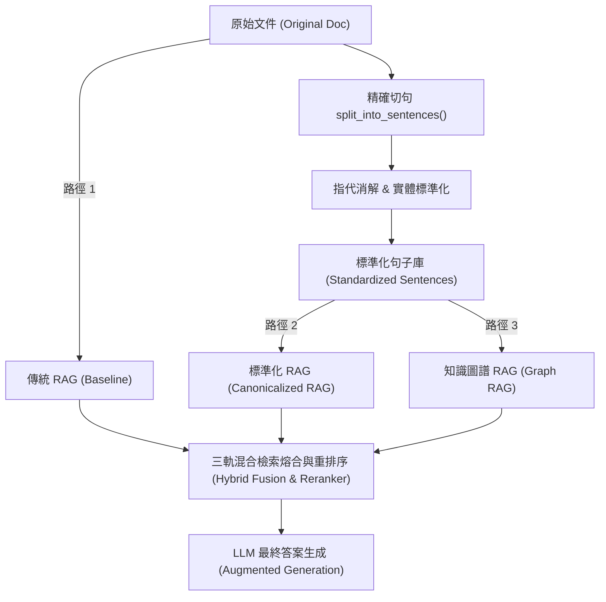
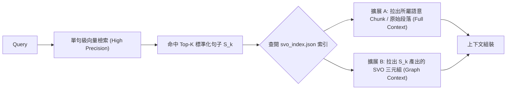

# 08：三軌混合檢索架構與標準化 RAG 設計報告

> 狀態：🟡 規劃中——本檔案記錄 2026-07-21 針對系統「三軌資料查找機制（傳統 RAG、標準化 RAG、知識圖譜 RAG）」之架構設計、檢索流程與未來實作路線圖。

---

## 1. 架構背景與核心理念

本專案的核心突破在於：**打破傳統 RAG 僅依賴單一粗粒度向量切塊的侷限**。

透過前處理階段產出的「**標準化句子 (Standardized Sentences)**」（已完成切句、指代消解與別名標準化），系統同時具備了高語意純度的文字庫與結構化的 SVO 知識圖譜，從而延伸出**三條互補的資料查找軌道（Triple-Route Retrieval Architecture）**。

---

## 2. 三大檢索軌道詳細設計與比較

| 檢索軌道 | 資料來源 / 索引單位 | 核心檢索技術 | 系統定位與優勢 | 潛在局限 |
| :--- | :--- | :--- | :--- | :--- |
| **軌道 1：傳統 RAG (Traditional RAG)** | 原始文件 / 500字粗粒度 Chunk (`sentence_aware_chunking`) | 密集向量檢索 (Dense Vector Search) | **系統基準 (Baseline)** 速度快、零前處理開銷。 | 遇到代名詞（他/該公司）或長距離關係時容易漏查。 |
| **軌道 2：標準化 RAG (Standardized RAG)** | 標準化句子庫 & 句子級語意 Chunk | 兩階階層檢索（單句粗篩 + 語意 Chunk 上下文還原） | **高精準事實檢索** 消除代名詞模糊、語意自足、檢索準確度極高。 | 前處理需跑指代消解模型。 |
| **軌道 3：知識圖譜 RAG (Graph RAG)** | SVO 三元組 $(S, V, O)$ & 圖資料庫 (Neo4j / NetworkX) | 圖路徑搜尋 (Graph Walk)、社群聚類 (Community Detection) | **跨文件多跳推理與全局理解** 回答「A 與 C 的間接關聯」或全局摘要。 | 依賴 LLM 抽取品質與圖查詢能力。 |

---

## 3. 軌道 2：標準化 RAG 的雙階檢索機制 (Hierarchical Retrieval)

「標準化 RAG」是本專案的創新核心之一，採用 **「單句精確命中 + 語意段落擴展」** 的兩階流程：

1. **第一階（單句粗篩 High Precision）**：
   - 使用 Query 向量搜尋「標準化單句庫」。
   - 由於單句經過指代消解（代名詞已被替換為具體實體），且無跨段雜訊，相似度比對極度精確。
2. **第二階（上下文還原 High Recall）**：
   - 命中單句 $S_k$ 後，透過 `svo_index.json` 索引，自動向下擴展拉出 $S_k$ 所屬的 3~8 句「語意 Chunk」與原文段落，為 LLM 提供充份的上下文背景。

---

## 4. 論文消融實驗對照組規劃 (Ablation Study)

三軌架構為論文第五章的消融實驗提供了非常嚴謹且具說服力的對照組規劃：

* **實驗組 A (Baseline)**：僅開啟【軌道 1：傳統 RAG】。
* **實驗組 B (前處理增強)**：開啟【軌道 2：標準化 RAG】（驗證指代消解與標準化切句對檢索準確率的獨立貢獻）。
* **實驗組 C (完整體)**：開啟【軌道 2 + 軌道 3：混合 RAG】（驗證知識圖譜對多跳推理與綜合性問題的額外貢獻）。

---

## 5. 後續實作路線圖 (Implementation Roadmap)

為落地三軌檢索機制，後續模組實作規劃如下：

- [ ] **Phase 1：標準化句子向量索引庫建置**
  - 在向量資料庫（如 Qdrant / Chromadb / FAISS）中新增 `standardized_sentences` collection。
  - 儲存 `sentence_id`、`canonical_text`、`chunk_id` 與 `doc_id` 中繼資料。
- [ ] **Phase 2：雙階檢索服務 (`services/retrieval_service.py`)**
  - 實作 `search_standardized_rag(query, top_k)` 介面。
  - 整合單句向量搜尋與 `svo_index.json` 上下文擴展邏輯。
- [ ] **Phase 3：三軌混合熔合器 (`Hybrid Retriever & Reranker`)**
  - 實作 RRF (Reciprocal Rank Fusion) 或 Cross-Encoder Reranker，將三軌回傳的結果進行排序與去重。

---

## 6. 權威開源專案與學術文獻佐證 (Project & Literature Citations)

本報告提出之「三軌混合檢索」與「標準化句子雙階檢索」具備以下頂級會議論文與知名開源專案背書：

### 6.1 可信任開源專案 (Trusted Open-Source Frameworks)
1. **HippoRAG (NeurIPS 2024 官方開源)**：
   - 俄亥俄州立大學開源之圖文混合 RAG 框架（GitHub 2.5k+ Stars），實現了以「單句 / 片語 (Phrase / Sentence)」作為索引單位的兩階圖文檢索機制。
   - 專案連結：[HippoRAG Official Repository](https://github.com/OSU-NLP-Group/HippoRAG)
2. **RAGFlow (GitHub 20k+ Stars)**：
   - 頂級開源企業級 RAG 引擎，其核心檢索架構即採用多路召回（Dense Vector + Full-text + Knowledge Graph）與熔合重排序（Reranking）。
   - 專案連結：[RAGFlow Repository](https://github.com/infiniflow/ragflow)
3. **LlamaIndex `SubQuestionQueryEngine` & `AutoMergingRetriever`**：
   - LlamaIndex 官方提供之雙階階層檢索器（Hierarchical Parent-Child Retriever），先搜尋精確細粒度子句，再自動回溯擴展為完整父級 Chunk 段落。
   - 專案連結：[LlamaIndex Auto-Merging Retriever](https://docs.llamaindex.ai/en/stable/examples/retrievers/auto_merging_retriever/)

### 6.2 頂級學術會議論文 (Top Academic Papers)
1. **HippoRAG (NeurIPS 2024 Main)**：
   - Gutierrez, B. J., et al. (2024). *HippoRAG: Neurobiologically Inspired Long-Term Memory for Large Language Models*. NeurIPS 2024 (arXiv:2405.14831).
   - **核心結論**：提出了「雙階（Two-Stage）檢索機制」，證實以細粒度語意單元建索引並結合圖遍歷（Personalized PageRank），在多跳推理與事實檢索上顯著超越單一粗粒度向量 RAG。
2. **Dense X Retrieval / Propositional RAG (EMNLP 2024)**：
   - Chen, D., et al. (2024). *Dense X Retrieval: What Retrieval Granularity Should We Use?*. EMNLP 2024.
   - **核心結論**：證明將文章分解為自足且經過標準化的「獨立命題句 (Propositions / Standardized Sentences)」後建立向量索引，其檢索精準度比傳統粗粒度段落提高 10-35%。
3. **RRF 多路召回熔合 (SIGIR 2009)**：
   - Cormack, G. V., Clarke, C. L., & Buettcher, S. (2009). *Reciprocal Rank Fusion Outperforms Rank Solver for Information Retrieval*. ACM SIGIR 2009.
   - **核心結論**：奠定了多軌檢索（Vector + Keyword + Graph）結果熔合的數學理論基礎，證實 RRF 熔合排序之效果優於單一檢索管道。
