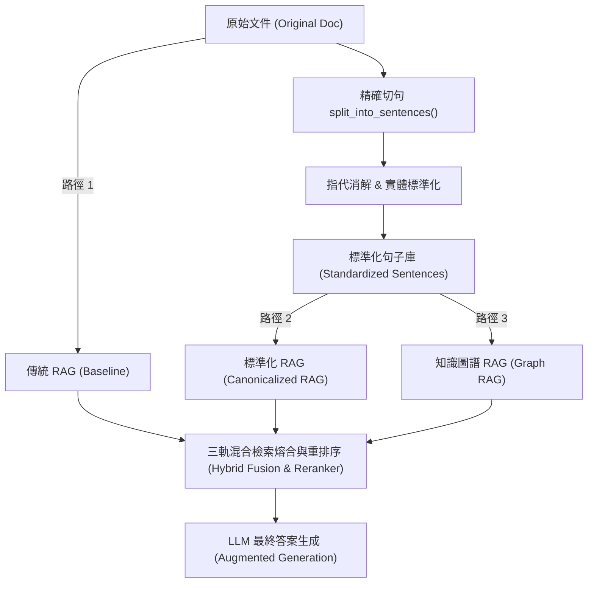
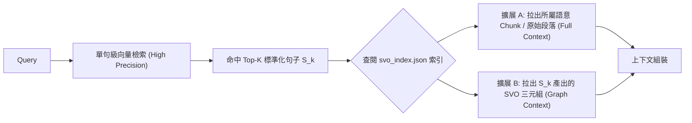

# 08：三軌混合檢索架構與標準化 RAG 設計報告

> 狀態：🟡 規劃中，2026-08-20 補上實作前提缺口與修訂路線圖——本檔案記錄 2026-07-21 針對系統「三軌資料查找機制（傳統 RAG、標準化 RAG、知識圖譜 RAG）」之架構設計、檢索流程與未來實作路線圖；架構本身（§1-§4）維持原設計不變，§5 實作路線圖因 2026-08-20 發現的前提缺口大幅修訂，§6 文獻佐證同日補上即時查證與訂正。

---

## 0. 實作前提：一份 2026-08-20 發現的關鍵缺口（決定整個路線圖的順序）

在規劃 Phase 1-3 之前，必須先處理一個比「還沒蓋檢索服務」更根本的問題：**指代消解目前在正式抽取路徑上，從未真的被 LLM 執行過。**

**問題鏈**：

1. `services/svo_service.py::trigger_extraction()`（正式抽取路徑唯一的呼叫點）呼叫 `prepare_svo_ready_chunks()` 時，從未帶入 `pronoun_llm_provider`。
2. `services/pronoun_resolution_service.py::resolve_coreference_pipeline()` 的既有設計（docstring 明載）：`llm_provider` 為 `None` 時，含代名詞的句子**直接原樣通過，不強行消解**——這是刻意設計的優雅降級（讓離線管線/測試可以安全呼叫），但也代表正式環境從未真正執行過指代消解。
3. 因此 `prepare_svo_ready_chunks()` 回傳的 `normalized_sentences` 實際上**恆等於** `original_sentences`。
4. **這不只影響一份額外的句子級索引**：`services/svo_chunking.py::build_svo_chunks()` 把 `chunk.text = "\n".join(normalized_slice)`——`normalized_sentences` 直接就是 SVO chunk 本身送進 `LLM_SVO` 做三元組抽取的原文。指代消解一旦真的接上 LLM，改變的不只是「標準化句子索引」，連現有 SVO 三元組抽取的輸入文字本身都會不同（代名詞換成具體實體，理論上抽取品質也會提升，這是附帶的正面效果，但也代表舊資料不會自動受益）。

**已驗證的既有折衷版本**：`build_standardized_rag_index.py`／`standardized_rag.py`／`run_rag_comparison.py`（供 12/13 號報告使用）已誠實記錄同一件事——沿用既有 `sentence_embeddings.json`（`write_sentence_embeddings()` 存的正是未經消解的 `normalized_sentences`＝`original_sentences`），因此嚴格來說是「軌道 1＋上下文擴展」的折衷版，不是本報告設計的軌道 2。

**時機決策（影響是否需要重跑既有資料）**：`get_llm_provider()` 已存在（`core/providers/factory.py`），程式碼上要接線很簡單；真正的決策是**時機**——一旦接上，任何呼叫 `trigger_extraction()` 產生的 SVO chunk 內容都會改變，已完成抽取的既有 KG（含 2026-08-20 正在匯入的「請假與排班法規遵循」461 筆）**不會自動受益**，需要 `knowledge_graph_service.build_graph(force_rebuild=True)` 重新觸發才能拿到指代消解後的版本。兩個選項：

- **選項 A**：先暫停正在進行的匯入，把 §5 Phase 0 做完，再繼續/重跑匯入——避免這批資料之後要整批重抽一次。
- **選項 B**：先讓目前的匯入跑完（可作為「未接指代消解」的基準資料），Phase 0 完成後再一次性對這個 KG 執行 `force_rebuild=True`。

兩者皆可行，純粹是排程選擇，不影響最終正確性——本報告不代為決定，留待使用者確認。

---

## 1. 架構背景與核心理念

本專案的核心突破在於：**打破傳統 RAG 僅依賴單一粗粒度向量切塊的侷限**。

透過前處理階段產出的「**標準化句子 (Standardized Sentences)**」（已完成切句、指代消解與別名標準化），系統同時具備了高語意純度的文字庫與結構化的 SVO 知識圖譜，從而延伸出**三條互補的資料查找軌道（Triple-Route Retrieval Architecture）**。

```mermaid
flowchart TD
    Doc["原始文件 (Original Doc)"] --> Split["精確切句 split_into_sentences()"]
    Split --> Preproc["指代消解 & 實體標準化"]
    Preproc --> StdSent["標準化句子庫 (Standardized Sentences)"]
    
    Doc -- "路徑 1" --> RAG1["傳統 RAG (Baseline)"]
    StdSent -- "路徑 2" --> RAG2["標準化 RAG (Canonicalized RAG)"]
    StdSent -- "路徑 3" --> RAG3["知識圖譜 RAG (Graph RAG)"]
    
    RAG1 --> Merger["三軌混合檢索熔合與重排序 (Hybrid Fusion & Reranker)"]
    RAG2 --> Merger
    RAG3 --> Merger
    
    Merger --> LLM["LLM 最終答案生成 (Augmented Generation)"]
```

---

## 2. 三大檢索軌道詳細設計與比較

| 檢索軌道 | 資料來源 / 索引單位 | 核心檢索技術 | 系統定位與優勢 | 潛在局限 |
| :--- | :--- | :--- | :--- | :--- |
| **軌道 1：傳統 RAG (Traditional RAG)** | 原始文件 / 500字粗粒度 Chunk (`sentence_aware_chunking`) | 密集向量檢索 (Dense Vector Search) | **系統基準 (Baseline)** 速度快、零前處理開銷。 | 遇到代名詞（他/該公司）或長距離關係時容易漏查。 |
| **軌道 2：標準化 RAG (Standardized RAG)** | 標準化句子庫 & 句子級語意 Chunk | 兩階階層檢索（單句粗篩 + 語意 Chunk 上下文還原） | **高精準事實檢索** 消除代名詞模糊、語意自足、檢索準確度極高。 | 前處理需跑指代消解模型。 |
| **軌道 3：知識圖譜 RAG (Graph RAG)** | SVO 三元組 $(S, V, O)$ & 圖資料庫 (Neo4j / NetworkX) | 圖路徑搜尋 (Graph Walk)、社群聚類 (Community Detection) | **跨文件多跳推理與全局理解** 回答「A 與 C 的間接關聯」或全局摘要。 | 依賴 LLM 抽取品質與圖查詢能力。 |

---

## 3. 軌道 2：標準化 RAG 的雙階檢索機制 (Hierarchical Retrieval)

「標準化 RAG」是本專案的創新核心之一，採用 **「單句精確命中 + 語意段落擴展」** 的兩階流程：

```mermaid
flowchart LR
    Q["Query"] --> S1["單句級向量檢索 (High Precision)"]
    S1 --> S2["命中 Top-K 標準化句子 S_k"]
    S2 --> S3{"查閱 svo_index.json 索引"}
    S3 --> S4["擴展 A: 拉出所屬語意 Chunk / 原始段落 (Full Context)"]
    S3 --> S5["擴展 B: 拉出 S_k 產出的 SVO 三元組 (Graph Context)"]
    S4 --> Fusion["上下文組裝"]
    S5 --> Fusion
```

1. **第一階（單句粗篩 High Precision）**：
   - 使用 Query 向量搜尋「標準化單句庫」。
   - 由於單句經過指代消解（代名詞已被替換為具體實體），且無跨段雜訊，相似度比對極度精確。
2. **第二階（上下文還原 High Recall）**：
   - 命中單句 $S_k$ 後，透過 `svo_index.json` 索引，自動向下擴展拉出 $S_k$ 所屬的 3~8 句「語意 Chunk」與原文段落，為 LLM 提供充份的上下文背景。

---

## 4. 論文消融實驗對照組規劃 (Ablation Study)

三軌架構為論文第五章的消融實驗提供了非常嚴謹且具說服力的對照組規劃：

- **實驗組 A (Baseline)**：僅開啟【軌道 1：傳統 RAG】。
- **實驗組 B (前處理增強)**：開啟【軌道 2：標準化 RAG】（驗證指代消解與標準化切句對檢索準確率的獨立貢獻）。
- **實驗組 C (完整體)**：開啟【軌道 2 + 軌道 3：混合 RAG】（驗證知識圖譜對多跳推理與綜合性問題的額外貢獻）。

---

## 5. 後續實作路線圖 (Implementation Roadmap)（2026-08-20 修訂）

為落地三軌檢索機制，後續模組實作規劃如下——**Phase 0 是 2026-08-20 新增的必要前提**，Phase 1 的索引策略也一併修訂（見下方理由）：

- [x] **Phase 0：把 LLM 接進指代消解（本報告 §0 的前提缺口，2026-08-20 已實作並用真實 Ollama LLM 驗證）**
  - `trigger_extraction()` 呼叫 `prepare_svo_ready_chunks()` 時帶入 `pronoun_llm_provider=get_llm_provider()`（`services/svo_service.py`），未初始化時優雅降級為 `None`（與既有 `embedding_provider` 降級行為對稱）。測試見 `tests/services/test_svo_service.py::test_trigger_extraction_resolves_pronouns_when_llm_available`／`test_trigger_extraction_skips_pronoun_resolution_when_llm_not_initialized`。
  - **真實 LLM 端到端驗證**（非僅 mock 測試）：對「馬斯克創立了太空公司。他隨後研發了獵鷹火箭。」呼叫真實 Ollama（`qwen2.5:7b`），確認 SVO chunk 文字正確變成「馬斯克創立了太空公司。馬斯克隨後研發了獵鷹火箭。」，耗時 34.8 秒（模型已預熱；冷啟動首次呼叫實測需 90 秒以上，屬 Ollama 模型載入成本，非本次改動引入的問題）。
  - **時機決策已選定選項 A**：暫停「請假與排班法規遵循」KG 的匯入（189/461 已完成），待 Phase 0 落地後再繼續／重跑——避免這批之後要整批重抽一次。
  - **不是本報告的範圍擴張**：這件事即使不做標準化 RAG 也該做（現有 SVO 三元組抽取的品質本身就因為代名詞未消解而打折扣），只是標準化 RAG 的存在讓這個既有缺口變得無法再繞過。
- [ ] **Phase 1：標準化句子向量索引**（**索引策略修訂**：改用 Neo4j 原生向量索引，取代原設計的 Qdrant/Chromadb/FAISS）
  - 理由：本專案目前所有向量索引（`concept_q_vector`／`chunk_embedding_vector`／`fact_embedding_vector`／`related_to_verb_embedding`）皆為 Neo4j 原生 `CREATE VECTOR INDEX`，沒有任何外部向量資料庫依賴；`fact_embedding_vector` 已於 2026-08-19 改為每個 KG 各自一個索引（見 `docs/論文/03_系統設計與方法論.md` § 3.1.4 §a），標準化句子索引比照同一套「per-KG label＋per-KG 索引」模式即可，不需要引入新元件、新的維運負擔（部署/備份/多一套連線設定）。
  - 新增 `Sentence` 節點（或複用既有 `Chunk` 節點加上 `sentence_index` 屬性，兩案取捨留待實作時依 `svo_index.json` 既有結構決定），存 `sentence_text`（已消解）、`sentence_embedding`、`source_doc_id`、`chunk_index`、`sentence_index`。
- [ ] **Phase 2：雙階檢索服務 (`services/retrieval_service.py`)**
  - 實作 `search_standardized_rag(query, top_k)` 介面：單句向量 KNN 查詢（Phase 1 索引）→ 依 `svo_index.json` 既有結構找出所屬 chunk → 回傳去重後的 chunk 原文（比照既有 MVP `standardized_rag.py::search()` 的去重/上下文擴展邏輯，重寫為查真正的索引而非 numpy brute-force）。
- [ ] **Phase 3：三軌混合熔合器 (`Hybrid Retriever & Reranker`)**（優先度最低，可獨立於 Phase 0-2 排期）
  - 實作 RRF (Reciprocal Rank Fusion)，將三軌回傳的結果進行排序與去重；置於 `routers/agent.py` 既有問答路徑之外，先讓三軌各自可獨立呼叫/比較（呼應 §4 消融實驗規劃），熔合器留待三軌個別驗證過再接上。

---

## 6. 權威開源專案與學術文獻佐證 (Project & Literature Citations)（2026-08-20 即時查證重寫）

> ⚠️ **本節原始版本（2026-07-21）多處描述不準確，2026-08-20 逐篇重新查證後全部訂正**——原版星數已過期、部分文獻的核心主張被誤述（尤其 HippoRAG）。查證方式：GitHub 專案一律用 `gh api` 即時查星數與 `archived` 狀態；HippoRAG／Dense X Retrieval 兩篇皆已下載全文（`docs/參考文獻/12_三元組事實層級向量化與檢索/gutierrez-et-al-2024-hipporag.pdf`／`docs/參考文獻/08_向量化與語意表示/chen-et-al-2023-dense-x-retrieval.pdf`）並精讀方法論與實驗章節，非僅讀摘要。

### 6.1 HippoRAG——⚠️ 原版描述有誤，已訂正

**原版聲稱**「以單句/片語為索引單位的兩階圖文檢索機制」——**不準確**。全文精讀（§2.2-2.3）確認真實機制：用 LLM 做 OpenIE 抽取「名詞片語節點＋關係邊」建圖；embedding（Contriever/ColBERTv2）**只用在兩處**——① 節點間同義詞邊（cosine similarity > 0.8 才連邊）、② 查詢時把問題實體連結到圖節點；檢索靠 **Personalized PageRank** 在圖上傳播機率算段落分數，論文自己明確定位為 **single-step**（單步）檢索，還特別拿來跟 IRCoT 這類 iterative multi-step 方法對比、強調自己更快更省成本——這與「兩階句子檢索」是相反的主張，不能引用來佐證本報告的雙階句子檢索設計。此結論與本專案 § 3.1.4 §a（`docs/論文/03_系統設計與方法論.md`）稍早全文精讀同一篇論文的結論完全一致，非新發現的矛盾。

- **正式引用**（可保留，僅供「圖結構＋部分節點向量化」這個大方向的旁證，不可再稱其佐證雙階句子檢索）：Gutierrez, Shu, Gu, Yasunaga & Su（2024，🟢 NeurIPS 2024）《HippoRAG: Neurobiologically Inspired Long-Term Memory for Large Language Models》，arXiv:2405.14831。
- **專案**：`OSU-NLP-Group/HippoRAG`，即時查證 **3,954★**（`gh api`，2026-08-20，`archived: false`，最後 push 2026-07-29）——原版「2.5k+」已過期，訂正。

### 6.2 RAGFlow——星數已訂正；技術宣稱部分驗證

`infiniflow/ragflow` 即時查證 **88,874★**（`gh api`，2026-08-20，`archived: false`）——原版「20k+」嚴重過期。官方 README 直接列出「**Multiple recall paired with fused re-ranking**」為官方 Key Feature，此點屬實可引用；但「Dense Vector + Full-text + Knowledge Graph」三路召回的具體拆解，README 全文（17,461 字元）查無逐字對應描述，需另查官方文件站（`ragflow.io/docs`）才能確認，本次未查到，**不列為已驗證**，僅保留「多路召回＋熔合重排序」這個較粗的主張。

- **專案連結**：[RAGFlow Repository](https://github.com/infiniflow/ragflow)

### 6.3 LlamaIndex `AutoMergingRetriever`——⚠️ 與本報告設計有實質機制差異，訂正為「精神類似、機制不同」

`run-llama/llama_index` 即時查證 **51,752★**（`gh api`，2026-08-20，`archived: false`）。查證官方文件（`developers.llamaindex.ai`）確認真實機制：先用 `HierarchicalNodeParser` 預先建立**三層**固定大小 chunk 樹（2048/512/128 tokens），檢索時葉節點（最小 chunk）先做向量搜尋，命中足夠比例的同一父節點子節點後才**遞迴合併**成父層 chunk（合併比例門檻官方文件未揭露具體數值）。

**與本報告設計的差異是實質的，非用詞問題**：本報告設計是「單句精確命中 → 查 `svo_index.json` → 拉出這句話所屬的**單一**語意 chunk」，單層、直接查表；AutoMergingRetriever 是「多層固定大小 chunk 樹＋多個葉節點命中才觸發合併」，結構性遞迴合併。兩者共享「細粒度檢索＋粗粒度擴展」的精神方向，但具體機制不同，**訂正為「精神類似但機制不同的旁證」，不宣稱兩者對應**。

- **專案連結**：[LlamaIndex Auto-Merging Retriever](https://docs.llamaindex.ai/en/stable/examples/retrievers/auto_merging_retriever/)

### 6.4 Dense X Retrieval / Propositional RAG——⚠️「10-35%」數字情境不當；proposition 與本報告「標準化句子」不等價

全文精讀（§1、§2、§5、§6、Table 3-5）確認兩項需要訂正：

- **概念落差**：論文定義的 proposition 除了要求「self-contained（含指代消解）」，還要求「minimal」且「每個 proposition 對應一個獨立事實」——**一個句子可能被拆成好幾個 proposition**（論文 Figure 2 範例：一句話拆成 3 個獨立命題），需要額外的分解/改寫模型（Propositionizer）。本報告的「標準化句子」只做代名詞替換（見 §0），不做語意分解，**兩者是不同層級的前處理，proposition ≠ 標準化句子**，不應混用。
- **數字情境不當**：原版引用「10-35%」出自論文 Table 3 的 **Passage vs Proposition** 比較（SimCSE R@5 提升 43%、Contriever R@20 提升 9.7%，範圍其實比「10-35%」更寬，原版數字本身也不準）——但本報告設計已經是句子級檢索，正確的比較基準應為 **Sentence vs Proposition**，這組數字小很多且不穩定：SimCSE R@5 僅 +15.8%、Contriever R@5 僅 +8%，監督式檢索器（DPR）在部分指標上 proposition 反而**下降**（R@5 從 66.0→65.4）。**訂正**：若要引用漲幅數字，應採 Sentence-vs-Proposition 這組更貼切但較保守的數字，並誠實註記監督式檢索器上效果不穩定，不採 Passage-vs-Proposition 這組看似更亮眼、但情境不對應的數字。

- **正式引用**：Chen, D., et al.（2024，🟢 EMNLP 2024）《Dense X Retrieval: What Retrieval Granularity Should We Use?》。此文獻仍可引用作為「檢索粒度影響準確度」這個大方向的佐證，但不可再用「10-35%」這個數字，也不可宣稱 proposition 與本報告的標準化句子等價。

### 6.5 RRF（Reciprocal Rank Fusion）——確認存在，標題已訂正

已下載全文確認：作者 Cormack, Clarke & Büttcher，SIGIR'09，核心公式 `RRFscore(d) = Σ 1/(k+r(d))`，k=60 固定——核心主張與原版描述一致，可保留引用。**正確標題訂正**：原版寫「Reciprocal Rank Fusion Outperforms Rank Solver for Information Retrieval」，查證後論文正確標題是**《Reciprocal Rank Fusion outperforms Condorcet and individual Rank Learning Methods》**（比較基準是 Condorcet Fuse，非「Rank Solver」）。

- Cormack, G. V., Clarke, C. L., & Büttcher, S.（2009，🟢 ACM SIGIR 2009）。

### 6.6 待辦

- [ ] 若要正式引用 RAGFlow 的三路召回具體拆解，需另查 `ragflow.io/docs` 官方文件站補齊查證，本次未完成。
- [ ] `docs/參考文獻/` 目前無對應本主題的資料夾（最高編號到 14）；建議新增 `15_三軌混合檢索與標準化RAG`，沿用既有「數字_主題」命名慣例；HippoRAG／Dense X Retrieval 兩份 PDF 已存在其他資料夾（12、08），正式收錄時建議交叉引用而非重複下載。
