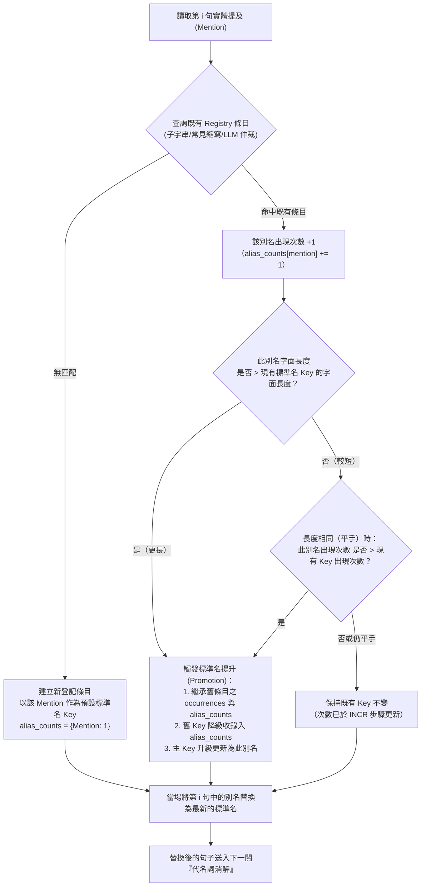

# 09：實體別名登記與動態標準名提升機制設計報告

> 狀態：🟡 設計提案（2026-07-21 初稿定案 → 同日查證後修訂 → 同日再修訂「頻率範圍」）。原稿的「三規則 PK 比試」演算法經查證，7 項原引用佐證（spaCy／fastcoref／Microsoft GraphRAG／CORE-KG／Text2KGBench／CESI／Wikidata）皆不支持該具體演算法組合，其中 4 項是明確採用不同方法（詳見 `docs/參考文獻/10_跨文件實體別名消解與增量聚類/README.md`「已查證但確認不適用的來源」）。本檔案已依查證結果修訂第 3 節演算法（改為「出現頻率優先，長度僅作平手時的次要規則」）與第 6 節文獻佐證（改為誠實的兩層框架）。
>
> **2026-07-21 再修訂（頻率衡量範圍）**：使用者進一步指出「單一文件內頻率高」不等於「是被廣泛認可的通用標準名」——一份文件內大量使用某個簡稱，可能只是這份文件/這位作者自己的行文習慣（範圍內簡稱），不代表這是實體真正的通用標準名稱。因此本機制拆成兩個不同權威層級的頻率衡量：**第 3 節的頻率優先僅在單一文件範圍內運作，產出的是「文件內暫定標準名」**，服務於這份文件自身的一致性（代名詞消解、SVO 切塊分組），**不直接等同於最終寫入知識圖譜的 `Entity.name`**；真正的標準名權威來自**跨文件累積的 `surface_form` 出現次數**（第 4 節），隨語料持續擴增可能修正，完整分工見第 4 節與 `03_系統設計與方法論.md` § 3.4 §b。
>
> **2026-07-21 三度修訂（主規則依範圍而異，使用者提出）**：單一文件內，實體通常是「先給完整名稱、後續才為精簡改用簡稱/代名詞式簡稱」——若沿用頻率優先，幾乎必然選到「後面反覆使用的簡稱」為標準名，反而犧牲完整性，也讓下游代名詞消解的實體接力上下文不夠清楚。因此**第 3 節（§a，文件內範圍）改採「長度優先為主規則，出現次數僅作平手時的次要規則」**；**第 4 節（§b，跨文件範圍）維持「頻率優先為主規則」不變**，但頻率的計數單位同步修訂為**獨立文件數**（一份文件不論切成多少 chunk，只算一票），避免單一文件因 chunk 數量多而灌票。這樣劃分也讓頻率優先規則更精準對應其文獻依據——Wikidata「社群共識最常用名稱」、CESI「頻率加權質心」本來就是跨文件/跨編者尺度的頻率概念，套用在單一文件內本屬勉強延伸；長度優先本身仍查無文獻先例，維持標註為本論文自行設計。

---

## 1. 核心目標與痛點

在前處理與 SVO 知識圖譜建構管線中，同一真實世界實體常以多種字面型態出現（如：`I-35`、`Interstate Highway 35`、`35號州際公路`；`Stone`、`Richard Stone`、`Mr. Stone`）。

若直接抽取，會造成知識圖譜產生大量**重複與孤立節點**。本設計旨在建立一套**線上流式處理（Online Streaming）**的實體別名登記與標準化機制，達成以下三大目標：

1. **消除實體碎片化**：將同義別名收斂至單一權威實體節點。
2. **即時輔助代名詞消解**：在處理後續句子的代名詞（他/該公司）時，前 4 句上下文已包含最新、最高品質的標準化實體全稱。
3. **保留完整別名與可追溯性**：別名庫不拋棄，永久寫入知識圖譜以支援靈活查詢與原文字面追溯。

---

## 2. 登記表 (Registry) 資料結構設計

在單一文件前處理過程中，系統於記憶體中維護一份流式更新的字典（`dict`）：

```python
registry = {
    # Key: 目前獲勝的最高品質標準名 (Canonical Name)
    "Interstate Highway 35": {
        "alias_counts": {"Interstate Highway 35": 1, "I-35": 5, "35號州際公路": 2},  # 2026-07-21 修訂：別名 → 出現次數，取代原本單純的別名集合
        "entity_type": "LOCATION",                                    # 實體類型
        "first_seen_idx": 0,                                          # 首次出現的句子 ID
        "occurrences": [0, 3, 7]                                      # 出現過的句子 ID 列表
    },
    "Richard Stone": {
        "alias_counts": {"Richard Stone": 1, "Stone": 6, "Dick Stone": 1},
        "entity_type": "PERSON",
        "first_seen_idx": 1,
        "occurrences": [1, 4, 8]
    }
}
```

> **2026-07-21 修訂說明**：原設計的 `aliases` 為單純集合（Set），只記錄「出現過哪些別名」；修訂後改為 `alias_counts` 字典，額外記錄**每個別名各自的出現次數**——這是「出現頻率優先」規則（見下方第 3 節）能運作的必要資料基礎，成本極低（每次比對命中時對應計數 +1，O(1)）。

---

## 3. 線上動態勝負與標準名提升機制 (Dynamic Promotion)——文件內範圍（§a）

> **2026-07-21 修訂**：原稿以「長度與資訊量」為主規則，經查證發現此規則會誤選「字面較長但實際罕用」的形式為標準名（例如泰國若寫成不常用的正式全名，長度更長但明顯不是使用者期待的標準稱呼）。改採 **「出現頻率優先 (Frequency-Priority Promotion)」**：文件內目前出現次數最多的字面形式勝出，長度只在頻率打平時作為次要判準——此規則呼應 Wikidata（Vrandečić & Krötzsch, 2014）「社群共識最常用名稱」與 CESI（Vashishth et al., 2018）「頻率加權質心」兩篇已查證文獻的方向（詳見第 6 節），比原本的長度優先規則更有文獻基礎。
>
> ⚠️ **2026-07-21 再修訂（重要，範圍限定）**：本節的頻率優先機制**衡量範圍僅限於單一文件內**，其輸出是**「文件內暫定標準名」**，不是最終寫入知識圖譜的權威標準名。原因：單一文件內某個別名出現次數多，可能只反映「這份文件/這位作者剛好偏好這樣稱呼」（範圍內簡稱），不代表這是實體在整個語料庫中被廣泛認可的通用名稱——把單一文件的局部習慣直接當成跨文件圖譜的權威標準名，會讓標準名隨文件來源飄移，破壞跨文件語意一致性（RQ4b 的核心目標）。真正的權威標準名判斷交給第 4 節「跨文件別名頻率聚合」，以整個知識圖譜累積的 `surface_form` 邊統計為準，且隨新文件持續加入可能修正（見 `03_系統設計與方法論.md` § 3.4 §b）。
>
> 🔁 **2026-07-21 三度修訂（主規則改為長度優先，使用者提出）**：單一文件內，實體通常是「先給完整名稱、後續才為精簡改用簡稱/代名詞式簡稱」——若沿用頻率優先，幾乎必然選到「後面反覆使用的簡稱」為標準名，反而犧牲完整性，也讓下游代名詞消解的實體接力上下文不夠清楚。**本節改採「長度優先為主規則，出現次數僅作平手時的次要規則」**——「泰國 vs. 罕用正式全名」這類跨文件共識問題，改由第 4 節（§b，跨文件範圍）處理，不再是本節（§a，單一文件範圍）的責任；長度優先本身仍查無文獻先例，維持標註為本論文自行設計的工程決策。

由於文章最早出現的名稱往往是簡稱或縮寫（如首句出現 `I-35`，第 4 句才出現全稱 `Interstate Highway 35`），**文件內暫定標準名**不能死板固定於首次出現者，必須具備 **「動態優勝提升 (Length-Priority Promotion)」** 機制——但這只解決「這份文件自己內部怎麼稱呼才一致」，不解決「整個知識圖譜該用哪個名稱」。

### 3.1 演算法流程與規則



### 3.2 勝負比試規則（2026-07-21 三度修訂：長度優先 + 頻率次要）

1. **字面長度優先 (Length Priority，主規則)**：
   - 範例：先出現「Stone」（短），後出現「Richard Stone」（長，即使只出現一次）$\rightarrow$ **較長者勝**，確保文件內暫定標準名維持最完整的稱呼，服務下游代名詞消解的實體接力品質。
   - **此規則本身查無直接文獻先例**，僅呼應學界零散提及的「取最長 mention」啟發式（詳見第 6 節誠實聲明），性質上屬本論文自行設計的工程決策，非文獻既有方法。
2. **平手時出現頻率優先 (Frequency as Tie-breaker，次規則，僅長度相同時觸發)**：
   - 範例：`"Apple Inc."` 與 `"Apple LLC."` 長度恰好相同 $\rightarrow$ 取文件內出現次數較多者。
3. **仍平手則保留既有 Key (最終 Tie-Breaker)**：
   - 範例：`"Apple Inc."` ⚔️ `"Apple LLC."` 若長度與次數皆相同 $\rightarrow$ **維持既有 Key 不變**，新名稱納入 `alias_counts`。

---

## 4. 知識圖譜持久化與查詢應用 (Neo4j Persistence)

> **2026-07-21 修訂（權威層級）**：第 3 節的「文件內暫定標準名」只是這份文件處理時的工作用名稱，寫入 Neo4j 時**不直接照搬**——真正的 `Entity.name` 由本節「跨文件別名頻率聚合」決定，且隨新文件持續加入可能修正，這是本機制真正的權威層。

文件處理完畢後，別名庫將持久化寫入 Neo4j，第一次寫入與後續每次合併（MERGE）皆遵循以下三個步驟：

### 4.1 首次寫入：以文件內暫定標準名起始
第一次建立節點時，暫以該文件的「文件內暫定標準名」（第 3 節輸出）作為初始 `name`，並寫入完整的 `aliases` 陣列：
```cypher
CREATE (e:Entity {
    name: "Interstate Highway 35",
    aliases: ["Interstate Highway 35", "I-35", "35號州際公路"],
    entity_type: "LOCATION"
})
```
* **查詢優勢**：未來使用者無論搜尋 `I-35` 或 `35號州際公路`，透過 `WHERE "I-35" IN e.aliases` 均能 **100% 精確命中** 同一節點。
* **誠實聲明**：此時的 `name` 僅是「目前唯一一份文件貢獻的暫定值」，尚不具跨文件權威性，後續文件加入後可能被 4.3 節的機制覆寫。

### 4.2 關係邊原文字面記錄 (`surface_form`)
在 `(:Chunk)-[:HAS_ENTITY]->(:Entity)` 的關係邊上記錄 `surface_form`：
```cypher
(c1:Chunk)-[:HAS_ENTITY {surface_form: "I-35"}]->(e:Entity {name: "Interstate Highway 35"})
(c4:Chunk)-[:HAS_ENTITY {surface_form: "Interstate Highway 35"}]->(e)
```
* **追溯優勢**：完整保留原文字面，支援 100% 可追溯與精確引用（AIS）。
* **權威依據**：這份逐邊記錄的 `surface_form`，正是 4.3 節重新計算「跨文件真正標準名」的資料來源。

### 4.3 跨文件標準名更新（真正的權威層）
每次有新三元組合併進既有實體（無論是新文件、還是同一文件內的後續提及）之後，重新聚合該實體目前所有 `HAS_ENTITY` 邊的 `surface_form` 出現次數：
```cypher
MATCH (c:Chunk)-[r:HAS_ENTITY]->(e:Entity {name: "Interstate Highway 35"})
RETURN r.surface_form AS alias, count(DISTINCT c.source_doc_id) AS freq
ORDER BY freq DESC
```
**2026-07-21 修訂（計數單位）**：計數單位是**獨立文件數**（`count(DISTINCT c.source_doc_id)`），不是邊的總數——第 3 節（§a）已把單一文件內的所有變體收斂成一個「文件內暫定標準名」，若按邊數計，單一文件只要 chunk 數量多，就會讓它選中的別名在跨文件頻率上被灌票，不代表真正有更多文件認同這個稱呼；改成數獨立文件數，才是「一份文件一票」的跨文件共識。

若聚合結果顯示某個別名的**跨文件累積次數（獨立文件數）**已超過目前 `Entity.name` 的累積次數，就把 `Entity.name` 更新為該別名（規則見 `should_promote_by_frequency()`：頻率優先，次數相同才比長度，再相同保留現狀——**與第 3 節的長度優先規則不同**，兩者主規則刻意分開），原名稱降級收錄進 `aliases`。**這才是本機制的真正權威判斷**——同一實體在夠多不同文件中都被稱為某個名稱，才會讓它成為標準名；單一文件的局部偏好（無論是內容偏好或 chunk 數量）都不會直接污染整個圖譜。

* **與跨文件增量聚類架構文獻的呼應**：此「隨新文件持續加入、標準名可能修正」的行為，正是 Rao, McNamee & Dredze (2010)／Saeedi, Peukert & Rahm (2020) 描述的增量式聚類精神（見第 6.1 節），比原本套用在單一文件內的版本更貼合這些文獻的實際場景（它們描述的本來就是跨文件/跨資料源的增量決策，不是單一文件內部的決策）。
* ⚠️ **效能待決策**：每次合併都重新聚合全部邊的做法在圖譜規模變大後可能有效能疑慮，是否需要改成批次/週期性重算（而非每次寫入同步觸發），留待第四章實作與第五章消融實驗評估，非本設計階段的阻斷性問題。

---

## 5. 後續實作模組規劃

未來實作時，預計建立以下模組與服務介面：

- [x] **`services/entity_registry_service.py`**（**文件內範圍**，第 3 節，✅ 已實作）
  - `EntityRegistry`: 負責維護文件內 `registry` 狀態與 $O(1)$ 字典 key 升級。
  - `should_promote_by_length(candidate_count, current_count, candidate, current) -> bool`（2026-07-21 三度修訂，取代原 `should_promote()`）: 長度優先＋出現次數次要的比對邏輯。**此函式只產生「文件內暫定標準名」，不直接寫入 Entity.name。**
  - `should_promote_by_frequency(candidate_count, current_count, candidate, current) -> bool`（原 `should_promote()` 更名）: 頻率優先＋長度次要，供 `services/svo_service.py`（§b）使用，與 `should_promote_by_length()` 是兩個獨立函式，不互相影響。
  - `resolve_mention(...)`／`apply_registry(...)`：整合入口，測試見 `tests/services/test_entity_registry_service.py`（21 項）。
- [x] **`services/svo_service.py` 跨文件標準名重算**（**跨文件範圍，第 4.3 節，真正權威層，✅ 已實作**）
  - `_aggregate_alias_counts(driver, kg_id, entity_name) -> dict[str, int]`：查詢該實體所有 `HAS_ENTITY` 邊，以 `count(DISTINCT c.source_doc_id)` 聚合出獨立文件數（2026-07-21 修訂，取代原 `count(*)`）。
  - `merge_entity(...)`：套用 `should_promote_by_frequency()` 決定是否更新 `Entity.name`，測試見 `tests/services/test_svo_service.py`（17 項，含跨文件計數測試）。
- [x] **與 `services/svo_service.py` 寫入銜接**（✅ 已實作）
  - `_merge_chunk_mention()` 建立 `(Chunk)-[:HAS_ENTITY {surface_form}]->(Entity)` 邊，取代原提案的 `alias_counts` JSON 屬性做法。

---

## 6. 學術文獻與專案佐證 (Project & Literature Citations)（2026-07-21 全面修訂）

> **修訂說明**：本節原稿宣稱 spaCy／fastcoref／Microsoft GraphRAG／CORE-KG／Text2KGBench／CESI／Wikidata 共 7 項來源「背書」本報告的動態標準名提升機制，經 2026-07-21 查證（過程見對話紀錄，結論存放於 `docs/參考文獻/10_跨文件實體別名消解與增量聚類/README.md`），**沒有一項描述本報告原本的三規則 PK 比試演算法**，其中 3 項（spaCy、Microsoft GraphRAG、CESI）與 1 項（Wikidata）是**明確採用不同方法**。本節依查證結果重寫，拆成「架構層」與「規則層」兩層佐證，不再籠統宣稱「頂級文獻背書」。

### 6.1 架構層佐證：跨文件持續擴增的別名聚類

本機制的核心架構主張——「別名登記表隨處理進度累積，且未來應擴展為跨文件、隨新文件持續擴增的持久化別名圖譜」——有以下真實先例，皆公開取得，已下載存放於 `docs/參考文獻/10_跨文件實體別名消解與增量聚類/`：

1. **Rao, McNamee & Dredze (2010)**，*Streaming Cross Document Entity Coreference Resolution*，COLING 2010: Posters——串流式跨文件實體指代消解的先驅論文，明確對照傳統離線聚合式聚類（O(n²)）與串流增量場景。
2. **Ji, Grishman & Dang (2011)**，TAC-KBP 2011 track overview——TAC-KBP Entity Linking track 自此年度起要求對「連結不到既有知識庫」的提及建立 NIL 聚類，後續文件持續併入同一聚類，是產業/學界公認的標準評測任務。
3. **Saeedi, Peukert & Rahm (2020)**，*Incremental Multi-source Entity Resolution for Knowledge Graph Completion*，ESWC 2020——知識圖譜場景下最貼近本報告目標的先例，處理多來源資料持續加入 KG 時既有聚類的增量更新。

**誠實侷限**：這 3 篇皆只佐證「跨文件持續擴增聚類」的**架構**，皆未描述本報告需要的「標準名選取規則」，該部分見下方 6.2。

### 6.2 規則層佐證：出現頻率優先的標準名選取（2026-07-21 修訂：對應第 4 節§b，非第 3 節§a）

> **修訂說明**：本節文獻原本用來佐證「第 3 節的頻率優先規則」，但第 3 節（§a，文件內範圍）已改為長度優先為主規則（見上方三度修訂），這兩篇文獻現在對應到**第 4 節（§b，跨文件範圍）的頻率優先規則**——這樣的對應其實更精確：Wikidata／CESI 描述的本來就是跨文件/跨編者尺度的頻率概念，用來佐證單一文件內的規則反而是勉強延伸。

第 4 節「出現頻率優先」規則的文獻依據——這兩篇已收錄於 `docs/參考文獻/03_資訊抽取與本體設計/`，本報告直接沿用，非新增下載：

1. **Vrandečić & Krötzsch (2014)**，*Wikidata: A Free Collaborative Knowledgebase*，CACM 57(10)——label（權威標準名）的選取依據明確是「社群共識中最常用的名稱」，與第 4 節「頻率優先」規則方向一致。
2. **Vashishth et al. (2018)**，*CESI: Canonicalizing Open Knowledge Bases using Embeddings and Side Information*，WWW 2018——以「頻率加權的 cluster 質心」選代表字串，同樣是頻率導向。

**誠實侷限**：兩篇皆非「頻率優先、長度僅作平手次要規則」這個完整組合的直接出處，只確認「頻率導向選代表名稱」這個大方向站得住腳；「長度作為平手 tie-breaker」這一條細則本身仍查無直接文獻先例，屬本論文自行設計的簡化規則。第 3 節（§a）的長度優先規則本身、以及「以獨立文件數計頻率」這個計數單位的選擇，皆查無文獻先例，屬本論文自行設計。

### 6.3 已查證但確認不適用的來源（供追溯，避免重複查證）

以下為原稿引用、經查證後發現**明確採用不同方法**或**未描述相關機制**的來源：

| 來源 | 查證結果 | 實際做法 |
|---|---|---|
| spaCy `EntityLinker` | CONTRADICTS | 精確字串比對連結至預建靜態知識庫，非動態比較 |
| fastcoref | CANNOT_VERIFY | 僅輸出 coreference clusters，未描述代表字串選取邏輯 |
| Microsoft GraphRAG Entity Dictionary | CONTRADICTS | title/type 完全相同才合併，描述交由 LLM 摘要，title 本身不換 |
| CORE-KG (2025)（Meher, Domeniconi & Correa-Cabrera） | PARTIAL | 用「逐實體類型循序」的 LLM 判斷做指代消解，非規則式比試；其 -28.25% 節點冗餘降低數據支持「指代消解該前置於切塊之前」這個大方向（已用於 3.1.2 §a），不支持本報告的標準名選取演算法本身 |
| Text2KGBench (ISWC 2023)（Mihindukulasooriya et al.） | PARTIAL/CANNOT_VERIFY | 本質是評測基準，非提出 canonicalization 演算法的方法論文 |

CORE-KG／Text2KGBench 兩篇文獻本身並未被誤引——它們在 3.1.2 §a／3.4 §a 開頭段落的角色（「指代消解不做會漏抽/產生冗餘節點」的整體論證）依然成立，只是**不能**同時拿來背書本報告的標準名選取演算法，這是本次修訂要拆清楚的地方。
