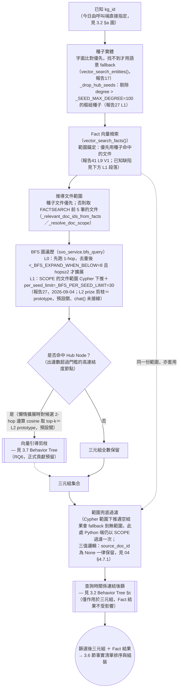

# 報告100：論文對齊批次3——03 §3.2 §b 檢索流程 BT 圖改寫＋04 §4.7.1–4.7.2 檢索順序修正 SDD 任務書

> **日期**：2026-09-29
> **執行者**：Codex｜**設計、撰寫與審核**：Claude Code
> **基準 commit**：`7a66170`（`worktree-sdd-retrieval-comparison`；本任務書 push 後的 commit 才是實際基準，見 §7 開頭提醒）
> **工作目錄**：`D:\Users\666\Desktop\world knowledge graph rag\.claude\worktrees\sdd-retrieval-comparison`
> **上位文件**：[報告97](97_專案目標與BT_SM工作流設計.md) §5.3 第 3 項；[報告95](95_專案節點流程總覽與設計說明.md) §11（N9 KG內檢索，本任務的事實依據）；[報告98](98_論文對齊批次1與5_B2現況與過時狀態修正SDD任務書.md)／[報告99](99_論文對齊批次2_BTSM表示法約定與總覽圖SDD任務書.md)（已完成並push的前兩批）
> **性質**：**只改論文文字，兩份檔案**。不改程式碼、不改資料、不跑評測、不需要理解程式碼。

---

## 0. 給 Codex 的重點

本任務與報告99同型——**設計判斷已由 Claude Code 做完**，§2 給的所有文字與 Mermaid 圖都是**最終版本**，請**逐字複製貼上**，不要自行改寫用詞、不要調整 Mermaid 節點順序或連線方式。

1. 這次動兩個檔案：`docs/論文/03_系統設計與方法論.md`（一段新增說明＋整張圖替換）與 `docs/論文/04_系統實作.md`（一段文字改寫）。另加 03 變更紀錄一筆。
2. **背景（供理解，不影響貼上內容）**：04 §4.7.2 目前寫「系統先找 seed，再做 BFS，接著執行查詢關係型別連結與 Fact 語意檢索」——這個順序是**錯的**。已查證的實際順序是：種子實體 → Fact 向量檢索（範圍錨定在種子命中的文件）→ 推導文件範圍 → BFS（範圍下推）→ 關係型別後篩 → 範圍兜底過濾。03 §3.2 §b 的圖只畫了 BFS 部分、完全沒有 Fact 檢索與範圍推導兩個步驟，也需要一併補上。
3. Mermaid 語法**未經 mmdc 實際渲染驗證**；貼上後請**目視檢查**（括號、引號、箭頭是否配對）。若有明顯語法錯誤可修語法本身，但**不得改節點文字或連線邏輯**，並在 §6 回填區列出改了什麼。
4. 完成後在本機 commit（一個 commit），**不要 push**。

---

## 1. 背景

[報告95](95_專案節點流程總覽與設計說明.md) §11「N9 KG內檢索」是 Claude Code 直接讀 `routers/agent.py`／`services/svo_service.py` 程式碼核對過的現況：

```
N9.3 種子實體 → N9.4 Fact向量檢索 → N9.5 推導文件範圍 → N9.6 BFS（L0/L1）→ N9.7 關係型別後篩 → N9.8 範圍兜底過濾
```

但論文兩處與此不一致：

1. **04 §4.7.2** 用一句話概述整個 `chat()` 流程，寫成「先找 seed，再做 BFS，接著執行查詢關係型別連結與 Fact 語意檢索」——把 Fact 檢索放在 BFS **之後**，且完全沒提到文件範圍推導與範圍下推這兩個關鍵步驟。
2. **03 §3.2 §b 的 Mermaid 圖**（`### §b：BFS 圖遍歷 Behavior Tree（RQ1）`）只畫了 `KGS → SEED → BFS2 → HUB → …`，完全沒有 Fact 檢索、範圍推導、範圍兜底過濾這些節點——即使§b 底下的文字說明（`L1（範圍下推＋樞紐種子剔除）`那一段）其實已經正確描述了「`vector_search_facts()`＋`_relevant_doc_ids_from_facts()` 提前到 `bfs_query()` 之前」，圖本身卻沒有畫出來，圖文不一致。

批次3把這兩處都改正，並移除圖尾端與 3.6 節重複/不準確的 `CTX`／`SORT` 節點（這兩個節點只以三元組為輸入，但實際的事實清單組裝同時需要三元組與 Fact 結果，兩者不一致；完整的組裝流程圖留待後續批次補進 3.6 節，本次先移除避免誤導）。

---

## 2. 已定案的內容（Claude Code 設計，請逐字採用）

### 2.1 03 §3.2 §b：新增說明段落

插入位置見 §3 T1。這是**新增的 blockquote**，緊接在 `### §b：BFS 圖遍歷 Behavior Tree（RQ1）` 標題之後、Mermaid 圖之前：

```markdown
> ✅ **本圖已更新為含 Fact 語意檢索與文件範圍推導的完整檢索順序（2026-09-29，報告97／100；取代先前 `KGS→SEED→BFS2→…` 只畫 BFS 部分的版本）**：先前版本的圖只畫出 BFS 路徑本身，容易讓讀者誤以為 Fact 語意檢索（`vector_search_facts()`）與 BFS 是互相獨立、事後才合併的兩條路徑——但報告41 L9 V1（2026-09-08）之後，實際執行順序是 Fact 檢索先跑、其命中文件反過來錨定並下推進 BFS 的 Cypher 範圍（見下方 L1 段落）。本圖與 04 §4.7.1／§4.7.2 已同步訂正這個順序。原本圖尾端的 `CTX`／`SORT` 節點已移除——這兩個節點原本只以三元組為輸入，但事實清單的排序與組裝（`_arrange_fact_lines()`）實際上同時需要三元組與 Fact 結果，用只含三元組的節點呈現會誤導讀者；完整的事實清單排序與組裝流程圖留待後續批次補入 3.6 節，目前該機制的文字說明見 04 §4.7.3。
```

### 2.2 03 §3.2 §b：新 Mermaid 圖（取代現有整段）

以下是**完整替換版**，取代現有 `### §b：BFS 圖遍歷 Behavior Tree（RQ1）` 標題之後的整個 ```` ```mermaid …``` ```` 區塊（目前檔案中，`flowchart TD` 開頭、以 `CTX --> SORT[...]` 那一行後的 ```` ``` ```` 結尾）。**逐字採用**，包含縮排：



### 2.3 04 §4.7.2：修正檢索順序敘述

**位置**：`docs/論文/04_系統實作.md` §4.7.2「目前問答路徑與未完成元件」第一段。

**現有文字（要被取代的整段）**：

```
目前 `routers/agent.py::chat()` 是可執行的暫時路徑：使用者必須指定單一 `kg_id`；系統先以 Entity 名稱在問題中的字面出現情形找 seed，再做 BFS，接著執行查詢關係型別連結與 Fact 語意檢索，最後以 SSE 串流 LLM 回答並送出 `sources` 事件。
```

**新文字（逐字取代）**：

```
目前 `routers/agent.py::chat()` 是可執行的暫時路徑：使用者必須指定單一 `kg_id`；系統先以 Entity 名稱在問題中的字面出現情形找 seed（找不到才用語意 fallback），再以問題向量做 Fact 語意檢索並以種子命中的文件錨定範圍，據此推導出的文件範圍下推進 BFS 圖遍歷，最後對 BFS 結果做查詢關係型別後篩、並對三元組與 Fact 結果做範圍兜底過濾，才以 SSE 串流 LLM 回答並送出 `sources` 事件。完整流程與節點對照見 3.2 §b Behavior Tree（2026-09-29 已更新，報告100）。
```

---

## 3. 任務清單

### T1　03 §3.2 §b 插入新說明段落

- **檔案**：`docs/論文/03_系統設計與方法論.md`
- **定位**：找到標題 `### §b：BFS 圖遍歷 Behavior Tree（RQ1）`（目前檔案第 818 行）。
- **動作**：在這個標題**正下方**、現有 Mermaid 圖區塊**之前**，插入 §2.1 給定的新 blockquote，逐字複製，包含開頭的 `> `。
- **驗證**：插入後，標題與 Mermaid 圖之間應只有這一段新增的 blockquote，中間沒有空白標題或其他內容。

### T2　03 §3.2 §b 替換 Mermaid 圖

- **檔案**：同上
- **定位**：緊接在 T1 插入段落之後的 ```` ```mermaid ```` 到對應 ```` ``` ```` 結尾（目前檔案第 820–831 行，`flowchart TD` 開頭，以 `CTX --> SORT[...]` 那行後的 ```` ``` ```` 結尾）。
- **動作**：整段（含首尾反引號）替換成 §2.2 給定的完整版本。
- **驗證**：替換後的圖不應再出現 `CTX` 或 `SORT` 字樣；應出現 `FACTSEARCH`、`SCOPE`、`FILTER`、`RELLINK` 四個新節點。圖後方緊接的既有 `> **⚠️ 文件更正（2026-09-01）**…` 等段落**維持不動**，不需要修改。

### T3　04 §4.7.2 替換段落

- **檔案**：`docs/論文/04_系統實作.md`
- **定位**：§4.7.2「目前問答路徑與未完成元件」小節的第一段（見 §2.3「現有文字」）。
- **動作**：整段替換成 §2.3 給定的「新文字」。
- **驗證**：替換後該段應以「目前 `routers/agent.py::chat()` 是可執行的暫時路徑」開頭、以「（2026-09-29 已更新，報告100）。」結尾；§4.7.2 該段之後的其餘段落（「這條路徑尚未等同於第三章的正式雙層 GraphRAG…」開始）**維持不動**。

### T4　03 變更紀錄

- **檔案**：`docs/論文/03_變更紀錄.md`
- **動作**：依既有格式（參照 2026-09-29 報告99 那筆的寫法）新增一筆 2026-09-29 條目，內容約：「依報告100修正 03 §3.2 §b 檢索流程圖（補上 Fact 語意檢索與文件範圍推導兩個先前缺漏的節點，移除與3.6節不一致的CTX/SORT尾端節點）與 04 §4.7.2 檢索順序敘述（原文把Fact檢索誤植在BFS之後）；純文件與圖表修正，不影響任何已完成章節的結論或數字。」

---

## 4. 全域禁止事項

- 不修改任何 `.py`、`.json`、`data/` 檔案；不執行 pytest 或評測。
- 不修改本任務未列出的章節段落（例如 §a、§c、§d、§e 本身內容、3.6 節、04 §4.7.1、§4.7.3 一律不動）。
- **不得**改寫 §2.1、§2.2、§2.3 給定文字的用詞或語氣；Mermaid 語法問題只能修語法本身（括號/引號配對、箭頭符號），不能改節點文字內容或連線邏輯，且要在 §6 回填區列出。
- 不新增額外的 Mermaid 圖、不新增其他小節。
- 使用繁體中文；沿用既有 blockquote／粗體風格。
- 不 push。

---

## 5. 驗收標準（Claude Code 審核時逐項檢查）

| # | 檢查 | 方法 |
|---|---|---|
| A1 | 03 §3.2 §b 新 blockquote 逐字插入、位置正確 | 人工核對 §2.1 文字與插入點 |
| A2 | 03 §3.2 §b 新 Mermaid 圖逐字替換，`CTX`／`SORT` 已移除，`FACTSEARCH`／`SCOPE`／`FILTER`／`RELLINK` 皆存在 | 人工核對 diff |
| A3 | 03 §3.2 §b 圖後方既有的「⚠️ 文件更正」等段落未被改動 | `git diff` 核對 |
| A4 | 04 §4.7.2 第一段逐字替換為新文字，其後段落未被改動 | 人工核對 |
| A5 | T4 變更紀錄新增一筆，位置正確 | 人工核對 |
| A6 | `git diff --stat` 只包含 `03_系統設計與方法論.md` 與 `04_系統實作.md` 與 `03_變更紀錄.md` 三個檔案 | `git diff --stat` |
| A7 | 沒有改到本任務未列出的其他段落（3.1.1–3.1.4、§a／§c／§d／§e、04 §4.7.1／§4.7.3 等） | 逐檔 `git diff` 人工審閱 |

---

## 6. 回填區（Codex 填寫）

> 完成後請在這裡填寫，然後 commit。

- **commit SHA**：
- **T1–T4 完成情況**：
- **若修正過 Mermaid 語法本身，逐項列出改了什麼、為什麼**（沒有的話填「無」）：
- **發現但未處理的其他問題**：

---

## 7. 給 Codex 的指令（使用者可直接貼上）

```text
請在 D:\Users\666\Desktop\world knowledge graph rag\.claude\worktrees\sdd-retrieval-comparison
（分支 worktree-sdd-retrieval-comparison）執行
docs/報告/100_論文對齊批次3_檢索流程BT圖與04檢索順序修正SDD任務書.md。

開始前：
- 先執行 git status 與 git log -1 --oneline，確認 HEAD 為本任務書檔案被加入版控時的那個
  commit（即你現在讀到的這份任務書檔案的來源 commit），且工作區乾淨；
  若工作區不乾淨、或 HEAD 明顯早於這個任務書 commit（例如還停在 7a66170），
  先 git pull 或回報實際 HEAD 後再確認是否繼續，不要用舊版任務書內容做事。

規則：
1. 先完整讀完任務書 §0-§5。§2 給的所有文字與 Mermaid 圖是最終版本，
   請逐字複製貼上到 §3 指定的位置，不要自行改寫用詞、不要調整 Mermaid 節點順序或連線方式。
2. 只改 docs/論文/03_系統設計與方法論.md（T1-T2）、docs/論文/04_系統實作.md（T3）、
   docs/論文/03_變更紀錄.md（T4）。不改任何程式碼、.json、data/ 檔案，不跑 pytest 或評測。
3. Mermaid 圖若發現明顯語法錯誤（括號/引號沒配對、箭頭符號打錯），
   可以修正語法本身，但不能改節點文字內容或連線邏輯，且要在任務書 §6 回填區逐項說明改了什麼。
4. 遇到任務書沒涵蓋的情況，記在任務書 §6 回填區，不要自行擴大修改範圍。

完成後：
- 填寫任務書 §6 回填區。
- 自行跑一次 git diff --stat，貼在回報中（應只有三個檔案）。
- 全部變更做成一個本機 commit，訊息開頭：docs(論文): 報告100 批次3
- 不要 push。
- 回報內容：commit SHA、T1-T4 各自完成情況、git diff --stat 的輸出、
  是否有修正 Mermaid 語法本身（若有請列出）、回填區摘要。
```
