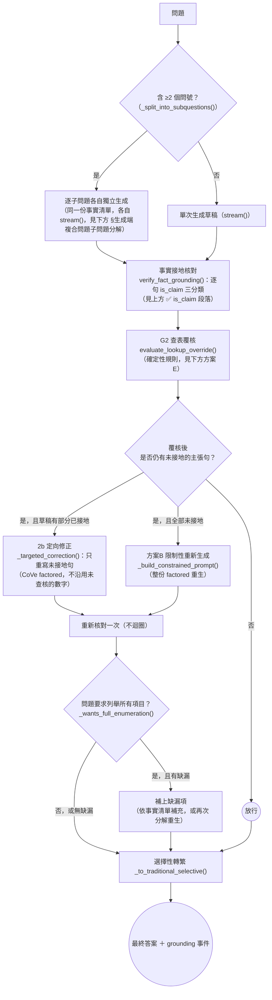

# 報告101：論文對齊批次4——03 §3.6 補上「目前實際運作的生成流程」BT 圖 SDD 任務書

> **日期**：2026-09-29
> **執行者**：Codex｜**設計、撰寫與審核**：Claude Code
> **基準 commit**：本任務書檔案被加入版控時的那個 commit（見 §7 開頭指示，不寫死 hash）
> **工作目錄**：`D:\Users\666\Desktop\world knowledge graph rag\.claude\worktrees\sdd-retrieval-comparison`
> **上位文件**：[報告97](97_專案目標與BT_SM工作流設計.md) §5.3 第 3 項；[報告95](95_專案節點流程總覽與設計說明.md) §13（N11 生成與接地核對，本任務的事實依據）；[報告98](98_論文對齊批次1與5_B2現況與過時狀態修正SDD任務書.md)／[報告99](99_論文對齊批次2_BTSM表示法約定與總覽圖SDD任務書.md)／[報告100](100_論文對齊批次3_檢索流程BT圖與04檢索順序修正SDD任務書.md)（已完成並push的前三批）
> **性質**：**只改一份論文檔案，插入一段說明＋一張新圖**。不改程式碼、不改資料、不跑評測、不需要理解程式碼。

---

## 0. 給 Codex 的重點

本任務與報告99／100同型——**設計判斷已由 Claude Code 做完**，§2 給的文字與 Mermaid 圖是**最終版本**，請**逐字複製貼上**，不要自行改寫用詞、不要調整 Mermaid 節點順序或連線方式。

1. 這次只動一個檔案：`docs/論文/03_系統設計與方法論.md`，在 3.6 節內插入一段新內容（不替換任何既有內容）。另加 03 變更紀錄一筆（共兩個檔案）。
2. **背景（供理解，不影響貼上內容）**：03 §3.6 目前只有一張圖——描繪 RQ3「自我精煉迴圈」**目標設計**（信心評分→回補檢索→多輪收斂），且圖旁已用 ⚠️ 明確標註「這是目標，不是現行行為」。但**目前實際在跑的生成流程**（分解、接地核對、定向修正、列舉完整性檢查）只有大段文字說明，完全沒有圖示。批次4補上這張缺漏的圖，插入位置在既有 ⚠️ 說明之後、不改動、不刪除任何既有文字。
3. Mermaid 語法**未經 mmdc 實際渲染驗證**；貼上後請**目視檢查**（括號、引號、箭頭是否配對）。若有明顯語法錯誤可修語法本身，但**不得改節點文字或連線邏輯**，並在 §6 回填區列出改了什麼。
4. 完成後在本機 commit（一個 commit），**不要 push**。

---

## 1. 背景

[報告95](95_專案節點流程總覽與設計說明.md) §13「N11 生成與接地核對」是 Claude Code 直接讀 `routers/agent.py::_generate_from_context_lines()` 程式碼核對過的現況，順序為：

```
問題分解（多問號才走）或單次生成草稿 → 接地核對（is_claim三分類）→ G2查表覆核
→（若仍有未接地主張：部分有依據走定向修正／全無依據走限制性重生成 → 重新核對一次，不迴圈）
→ 列舉完整性檢查 → 選擇性轉繁 → 輸出
```

03 §3.6 目前的內容分兩部分：

1. 開頭的 Mermaid 圖與其後 ⚠️ 說明——圖是 RQ3 的**目標設計**（多輪回補檢索），⚠️ 說明已正確標註「現行只有生成端一次性糾正，沒有任何檢索端迴圈」。**這張圖與其說明本身沒有錯誤，不需要修改。**
2. 之後一長串 ✅ 開頭的 blockquote 段落（`is_claim` 三分類、2a/2b 定向修訂、G2 查表覆核方案E），以及兩個子小節（`§生成端複合問題子問題分解`、`§確定性接地守衛`）——這些文字都正確描述了現況，但**目前實際運作的完整流程本身沒有一張圖**，讀者必須自己在長篇文字裡拼湊順序。

批次4就是補上這一張圖，不改動任何既有文字。

---

## 2. 已定案的內容（Claude Code 設計，請逐字採用）

以下是**完整的插入內容**（含標題、blockquote、Mermaid 圖、圖後說明），插入位置見 §3 T1：

```markdown
> ✅ **目前實際運作的生成流程（2026-09-29 新增，報告97／101）**：上方 ⚠️ 已列出「已實作」與「未實作」的邊界，以下用一張圖具體畫出目前 `_generate_from_context_lines()` 實際執行的流程（`routers/agent.py`，與 harness 的 B0/B1/B2 臂共用同一套堆疊，見 §3.8）——這是本節唯一對應「現行系統行為」的圖，與上方描繪 RQ3 目標設計的圖分開看，兩張圖不可混為一談。



> 圖中各節點對應：`GROUND`＝上方 ✅ `is_claim` 三分類段落；`LOOKUP`＝下方「G2：『數值區間 → 對應值』查表例外＋方案E」段落；`TARGETED`／`REGEN`＝上方 2b 定向修訂／方案B 限制性重新生成段落；`SPLIT2`／`DECOMP`＝下方「§生成端複合問題子問題分解」小節；`ENUMCHECK`／`SUPPLEMENT` 為列舉完整性 guard（`_wants_full_enumeration()`／`_detect_tier_families()`／`_missing_tier_members()`），04 §4.7.3 已有文字說明，本圖首次以圖示呈現。**確定性接地守衛（下方「§確定性接地守衛」小節的四道守衛）尚未接線進本流程**，圖中不含這一步。
```

---

## 3. 任務清單

### T1　03 §3.6 插入新段落與新圖

- **檔案**：`docs/論文/03_系統設計與方法論.md`
- **定位**：找到現有段落「> **⚠️ 本圖為 RQ3 的完整設計目標，非現行系統行為（2026-09-08 明確標註）**……」這個 blockquote 的**結尾**（結尾句是「§4.7.2／§4.9 已聲明『不等同於 RQ3 正式自我精煉迴圈』。」再下一行「因此本節現況＝『RQ3 的生成端補救半套已實作、檢索端迴圈全缺』；RQ1 基準線與第六章 RQ3 討論須以此現況為準，不得以本圖的完整流程當作既成能力。」）；再往下是空行，接著是「> **注意**：本設計借用 Self-RAG（Asai et al., 2023）……」這個新 blockquote 的開頭。
- **動作**：在這兩個 blockquote **之間**（即 ⚠️ 段落結束之後、注意段落開始之前）插入 §2 給定的完整內容（含標題句、Mermaid 圖、圖後說明），逐字複製。
- **驗證**：插入後，原本相鄰的「⚠️ 本圖為 RQ3…」段落與「注意：本設計借用 Self-RAG…」段落之間，應該多出一段新內容，且**兩個既有段落本身一字不動**。

### T2　03 變更紀錄

- **檔案**：`docs/論文/03_變更紀錄.md`
- **動作**：依既有格式（參照 2026-09-29 報告100 那筆的寫法）新增一筆 2026-09-29 條目，內容約：「依報告101在 03 §3.6 補上『目前實際運作的生成流程』BT 圖（分解／接地核對／G2查表覆核／定向修正或限制性重生成／列舉完整性檢查），與既有的 RQ3 目標設計圖（多輪回補檢索）明確區分；純新增，未改動任何既有文字。」

---

## 4. 全域禁止事項

- 不修改任何 `.py`、`.json`、`data/` 檔案；不執行 pytest 或評測。
- 不修改本任務未列出的任何既有文字——本任務是**純插入**，不刪除、不改寫 3.6 節任何一個字的既有內容（含開頭的 RQ3 目標圖、`is_claim`／2a/2b／G2 方案E 的長篇說明、兩個子小節）。
- **不得**改寫 §2 給定文字的用詞或語氣；Mermaid 語法問題只能修語法本身（括號/引號配對、箭頭符號），不能改節點文字內容或連線邏輯，且要在 §6 回填區列出。
- 不新增其他小節、不新增第二張圖。
- 使用繁體中文；沿用既有 blockquote／粗體風格。
- 不 push。

---

## 5. 驗收標準（Claude Code 審核時逐項檢查）

| # | 檢查 | 方法 |
|---|---|---|
| A1 | 新內容逐字插入，位置在「⚠️ 本圖為RQ3的完整設計目標」段落之後、「注意：本設計借用Self-RAG」段落之前 | 人工核對 §2 文字與插入點 |
| A2 | 新 Mermaid 圖逐字插入，`GROUND`／`LOOKUP`／`TARGETED`／`REGEN`／`SPLIT2`／`DECOMP`／`ENUMCHECK`／`SUPPLEMENT`／`TRAD` 皆存在 | 人工核對 diff |
| A3 | 「⚠️ 本圖為RQ3的完整設計目標…」段落一字未動 | `git diff` 核對（不應出現在 diff 的刪除行） |
| A4 | 「注意：本設計借用Self-RAG…」段落一字未動 | 同上 |
| A5 | 3.6 節其餘所有既有內容（`is_claim`、2a/2b、G2方案E、兩個子小節、§3.7 之前的所有段落）一字未動 | 逐段核對，diff 中不應有任何刪除行 |
| A6 | T2 變更紀錄新增一筆，位置正確 | 人工核對 |
| A7 | `git diff --stat` 只包含 `03_系統設計與方法論.md` 與 `03_變更紀錄.md`，且 `03_系統設計與方法論.md` 只有新增行、沒有刪除行 | `git diff --stat` 與 `git diff` |

---

## 6. 回填區（Codex 填寫）

> 完成後請在這裡填寫，然後 commit。

- **commit SHA**：
- **T1–T2 完成情況**：
- **若修正過 Mermaid 語法本身，逐項列出改了什麼、為什麼**（沒有的話填「無」）：
- **發現但未處理的其他問題**：

---

## 7. 給 Codex 的指令（使用者可直接貼上）

```text
請在 D:\Users\666\Desktop\world knowledge graph rag\.claude\worktrees\sdd-retrieval-comparison
（分支 worktree-sdd-retrieval-comparison）執行
docs/報告/101_論文對齊批次4_生成流程現況BT圖SDD任務書.md。

開始前：
- 先執行 git status 與 git log -1 --oneline，確認 HEAD 為本任務書檔案被加入版控時的那個
  commit（即你現在讀到的這份任務書檔案的來源 commit），且工作區乾淨；
  若工作區不乾淨，或 HEAD 明顯早於這個任務書 commit，先 git pull 或回報實際 HEAD
  後再確認是否繼續，不要用舊版任務書內容做事。

規則：
1. 先完整讀完任務書 §0-§5。§2 給的文字與 Mermaid 圖是最終版本，
   請逐字複製貼上到 §3 指定的位置，不要自行改寫用詞、不要調整 Mermaid 節點順序或連線方式。
2. 本任務是純插入，不刪除、不改寫 03_系統設計與方法論.md 中任何既有文字——
   git diff 裡這個檔案應該只有新增行（+），不應該有刪除行（-）。
3. 只改 docs/論文/03_系統設計與方法論.md（T1）與 docs/論文/03_變更紀錄.md（T2）。
   不改任何程式碼、.json、data/ 檔案，不跑 pytest 或評測。
4. Mermaid 圖若發現明顯語法錯誤（括號/引號沒配對、箭頭符號打錯），
   可以修正語法本身，但不能改節點文字內容或連線邏輯，且要在任務書 §6 回填區逐項說明改了什麼。
5. 遇到任務書沒涵蓋的情況，記在任務書 §6 回填區，不要自行擴大修改範圍。

完成後：
- 填寫任務書 §6 回填區。
- 自行跑一次 git diff --stat 與 git diff（確認 03_系統設計與方法論.md 只有新增行），
  貼在回報中。
- 全部變更做成一個本機 commit，訊息開頭：docs(論文): 報告101 批次4
- 不要 push。
- 回報內容：commit SHA、T1-T2 各自完成情況、git diff --stat 的輸出、
  是否有修正 Mermaid 語法本身（若有請列出）、回填區摘要。
```
