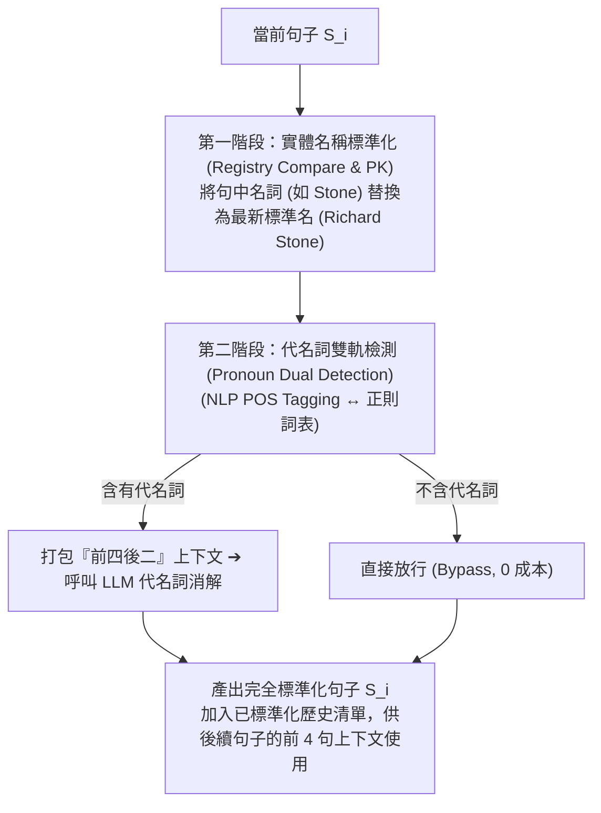
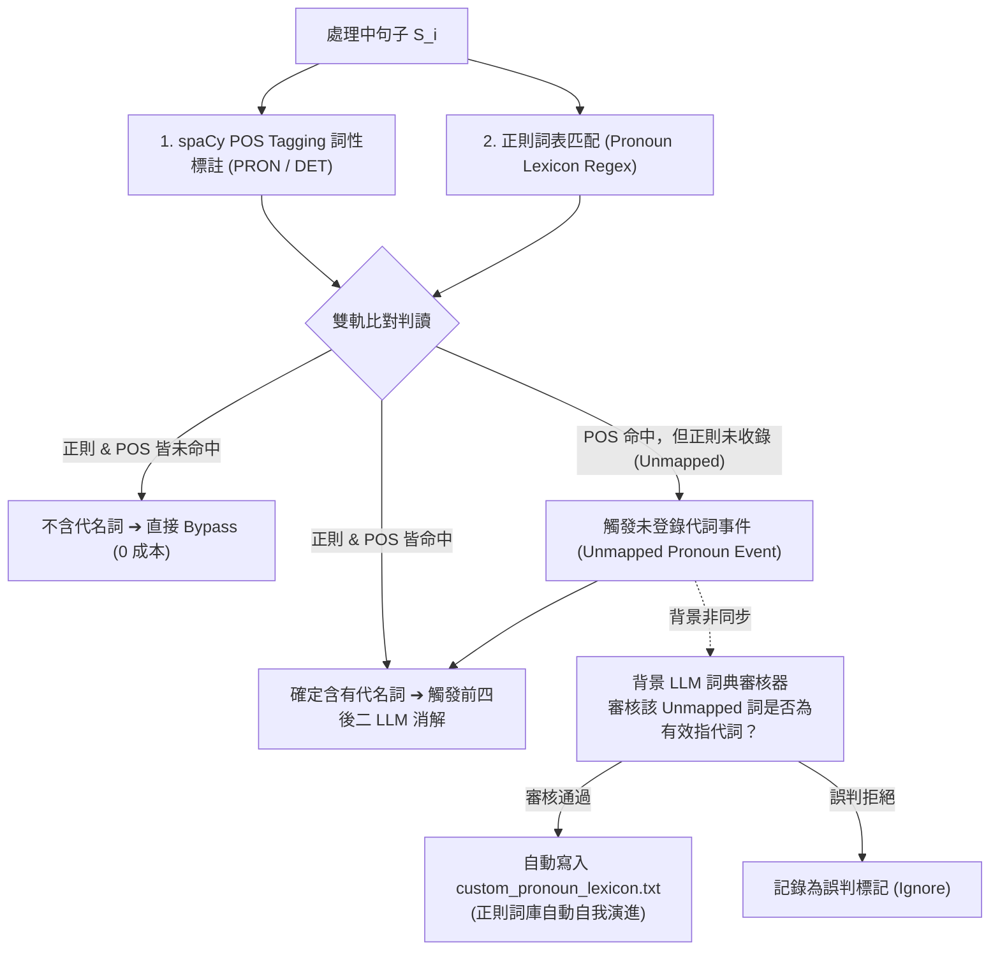

# 10：代名詞雙軌檢測與正則詞庫自動進化機制設計報告

> 狀態：🟢 定案——本檔案記錄 2026-07-21 針對「代名詞雙軌檢測（NLP POS 標註 ↔ 正則詞表）」、「非同步 LLM 審核詞庫自動進化（Async LLM Lexicon Auditor）」與「前四後二上下文消解（4+1+2 Coreference Window）」之完整架構設計與文獻背書。

---

## 1. 核心目標與痛點

前處理管線中，實體處理分為兩個本質不同的領域：

1. **實體登記表 (Registry PK)**：處理「具名名詞 / 別名 / 簡稱」（如 `Stone` ➔ `Richard Stone`）。
2. **代名詞消解 (Coreference Resolution)**：處理「無具名指代詞」（如 `他`、`它`、`該公司`、`此技術`）。

由於代名詞無法在登記表中進行名詞 PK，若對每句話盲目呼叫 LLM 進行消解將產生昂貴的 API 費用。本設計建立一套**雙軌預檢、高召回率（High Recall）、自適應進化（Self-Learning）**的代名詞檢測機制，確保僅對真正含有指代詞的句子觸發「前四後二」LLM 消解。

---

## 2. 單句兩階段前處理流水線 (Two-Stage Pipeline)

對每一句句子 $S_i$，執行嚴格的兩階段單句流水線：

> **順序保護**：第一階段（名詞標準化）必須先於第二階段（代名詞消解）執行。如此可確保第二階段提供給 LLM 的前 4 句歷史上下文已包含最清晰的權威實體全稱。

---

## 3. 代名詞雙軌檢測與非同步 LLM 詞庫自動進化機制

為避免單一檢測方法的缺陷（正則可能漏報未收錄代詞、POS Tagging 偶有誤判），設計 **POS 標註與正則雙軌對照**，並引入 **背景非同步 LLM 詞庫審核器**：

### 3.1 雙軌比對三路分流 (Three-Way Dispatch)
1. **確定命中 (Pass)**：正則或 POS 任一命中即認定含有代名詞，確保**零漏報 (High Recall)**。
2. **完全過濾 (Bypass)**：兩者皆未命中，直接放行，節省 70%~80% LLM API 呼叫。
3. **未登錄詞發現 (Unmapped Trigger)**：POS 抓到 `PRON`/`DET` 但正則未登錄時，主流程仍進入消解，同時觸發背景非同步審核。

### 3.2 防污染 LLM 詞庫審核器 (Async LLM Lexicon Auditor)
* 背景 LLM 對 Unmapped 詞進行語意審核，確認其為有效指代詞後，動態追加至正則清單。
* 隨系統運作，正則詞庫越趨完善，未來的代名詞檢測將逐步收斂至純免費正則運算。

---

## 4. 「前四後二」上下文消解機制細節 (4+1+2 Context Window)

當觸發代名詞消解時，系統打包以下 7 句上下文傳送至 LLM：

* **前 4 句已標準化歷史 (Past Context)**：提供已洗乾淨、實體全稱極度清晰的歷史背景。
* **當前第 $i$ 句 (Target)**：含有待消解代名詞（他/該公司）的目標句子。
* **後 2 句原始預覽 (Future Context)**：提供後續語意脈絡，輔助精確判定指代對象。

---

## 5. 權威開源專案與學術文獻佐證 (Project & Literature Citations)

本報告提出之雙軌代名詞檢測、正則自動進化與前四後二消解機制，具備以下國際標準與頂級會議論文背書：

### 5.1 可信任開源專案 (Trusted Open-Source Frameworks)
1. **spaCy `zh_core_web_sm` / POS Tagging Architecture**：
   - 採納 Universal Dependencies 國際標準，以 `PRON` (Pronoun) 與 `DET` (Determiner) 作為權威詞性標註依據。
   - 專案連結：[spaCy POS Tagging Architecture](https://spacy.io/api/annotation#pos-tagging)
2. **fastcoref / AllenNLP Coreference Pipeline**：
   - 工業級 Coreference 框架於第一階段廣泛採用 Pronoun Candidate Filter 作為高召回率預篩機制。
   - 專案連結：[fastcoref Repository](https://github.com/shon-otmazgin/fastcoref)
3. **LangChain Guardrails & Lexicon Filtering**：
   - 採用預檢防護閘門（Guardrail Classifier），避免非代名詞句子無效調用 LLM。
   - 專案連結：[LangChain Guardrails Concept](https://python.langchain.com/docs/concepts/guardrails/)

### 5.2 頂級學術會議論文 (Top Academic Papers)
1. **Universal Dependencies (UD Standard)**：
   - Nivre, J., et al. (2016). *Universal Dependencies v1: A Multilingual Treebank Collection*. LREC 2016.
   - **語言學標準**：定義了跨語言的 17 種 Universal POS Tags，確立了代名詞 (`PRON`) 與限定指代詞 (`DET`) 的語法標準。
2. **Stanford CoreNLP (ACL 2014)**：
   - Manning, C. D., et al. (2014). *The Stanford CoreNLP Natural Language Processing Toolkit*. ACL 2014.
   - **論文驗證**：證實 Pronoun Lexicon / Rule Filter 能過濾掉 80% 以上無代詞句子，在不損害召回率的前提下顯著降低消解計算成本。
3. **CORE-KG (2025)**：
   - Meher, P., et al. (2025). *CORE-KG: Coreference-aware Knowledge Graph Construction*.
   - **實務驗證**：採用前置 Pronoun 掃描器搭配雙向 Context-window（上下文視窗），實證圖譜節點冗餘度降低 **-28.25%**。
4. **Text2KGBench (ISWC 2023)**：
   - Mihindukulasooriya, N., et al. (2023). *Text2KGBench: A Benchmark for Ontology-Driven Knowledge Graph Generation*. ISWC 2023.
   - **論文結論**：證明指代消解為消除生成圖譜中孤立與重複節點的必要前處理步驟。
