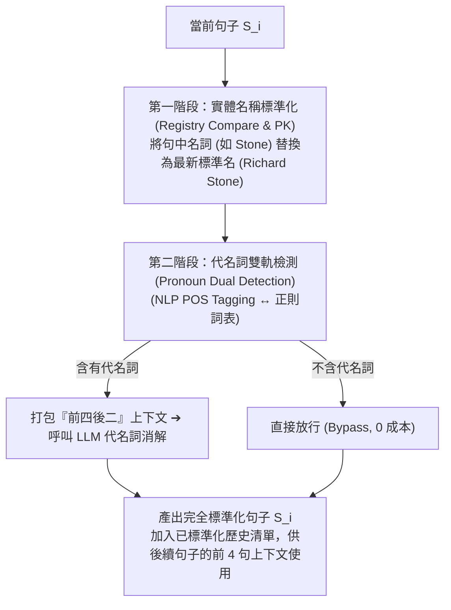
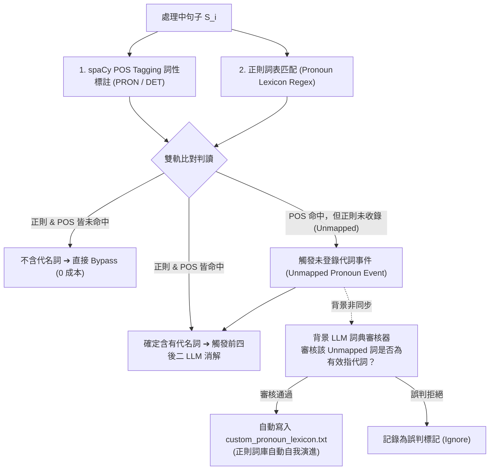

# 10：代名詞雙軌檢測與正則詞庫自動進化機制設計報告

> 狀態：🟡 設計提案 → ✅ 核心機制已實作（2026-07-21 初稿 → 同日查證後修訂 → 同日補上實作）。本檔案原標「🟢 定案」，但依 `docs/報告/06_SVO抽取管線調整任務書.md` 第 5 節查證，多項文獻引用需要訂正（見下方第 5 節），已降級為設計提案。**2026-07-21 使用者決策採用本報告的雙軌偵測方案**（取代 05 任務書單一正則設計已知的誤觸發限制），核心機制（`detect_pronoun()` 三路分流、`resolve_coreference_pipeline()`）已實作於 `services/pronoun_resolution_service.py`，測試見 `tests/services/test_pronoun_resolution_service.py`（18 項）。**尚未實測的部分**：本報告依賴的 spaCy POS 標註本身（`SpacyPosTagger`）——本專案環境尚未安裝 spaCy／`zh_core_web_sm`，僅測試過其依賴注入的 `PosTagger` 介面邏輯（以 Fake 實作驗證），真實 spaCy 整合待環境就緒後才能實際驗證；非同步背景詞庫審核（`audit_unmapped_pronoun()`／詞庫持久化）已實作並測試，但尚未接上真正的背景排程機制（目前是同步呼叫，「非同步」只是設計上的定位，非同步排程本身留待第四章實作）。

---

## 1. 核心目標與痛點

前處理管線中，實體處理分為兩個本質不同的領域：

1. **實體登記表 (Registry PK)**：處理「具名名詞 / 別名 / 簡稱」（如 `Stone` ➔ `Richard Stone`）。
2. **代名詞消解 (Coreference Resolution)**：處理「無具名指代詞」（如 `他`、`它`、`該公司`、`此技術`）。

由於代名詞無法在登記表中進行名詞 PK，若對每句話盲目呼叫 LLM 進行消解將產生昂貴的 API 費用。本設計建立一套**雙軌預檢、高召回率（High Recall）、自適應進化（Self-Learning）**的代名詞檢測機制，確保僅對真正含有指代詞的句子觸發「前四後二」LLM 消解。

---

## 2. 單句兩階段前處理流水線 (Two-Stage Pipeline)

對每一句句子 $S_i$，執行嚴格的兩階段單句流水線：

> **順序保護**：第一階段（名詞標準化）必須先於第二階段（代名詞消解）執行。如此可確保第二階段提供給 LLM 的前 4 句歷史上下文已包含最清晰的權威實體全稱。

---

## 3. 代名詞雙軌檢測與非同步 LLM 詞庫自動進化機制

為避免單一檢測方法的缺陷（正則可能漏報未收錄代詞、POS Tagging 偶有誤判），設計 **POS 標註與正則雙軌對照**，並引入 **背景非同步 LLM 詞庫審核器**：

### 3.1 雙軌比對三路分流 (Three-Way Dispatch)
1. **確定命中 (Pass)**：正則或 POS 任一命中即認定含有代名詞，確保**零漏報 (High Recall)**。
2. **完全過濾 (Bypass)**：兩者皆未命中，直接放行，節省 70%~80% LLM API 呼叫。
3. **未登錄詞發現 (Unmapped Trigger)**：POS 抓到 `PRON`/`DET` 但正則未登錄時，主流程仍進入消解，同時觸發背景非同步審核。

### 3.2 防污染 LLM 詞庫審核器 (Async LLM Lexicon Auditor)
* 背景 LLM 對 Unmapped 詞進行語意審核，確認其為有效指代詞後，動態追加至正則清單。
* 隨系統運作，正則詞庫越趨完善，未來的代名詞檢測將逐步收斂至純免費正則運算。

---

## 4. 「前四後二」上下文消解機制細節 (4+1+2 Context Window)

當觸發代名詞消解時，系統打包以下 7 句上下文傳送至 LLM：

* **前 4 句已標準化歷史 (Past Context)**：提供已洗乾淨、實體全稱極度清晰的歷史背景。
* **當前第 $i$ 句 (Target)**：含有待消解代名詞（他/該公司）的目標句子。
* **後 2 句原始預覽 (Future Context)**：提供後續語意脈絡，輔助精確判定指代對象。

---

## 5. 學術文獻與專案佐證 (Project & Literature Citations)（2026-07-21 全面修訂）

> **修訂說明**：本節原稿宣稱以下來源皆為「國際標準與頂級會議論文背書」，經 2026-07-21 查證（過程見對話紀錄），發現嚴重程度不一的問題：**Stanford CoreNLP 一條的具體量化宣稱查無出處、且 2014 年的論文語境不可能討論「降低 LLM 計算成本」這個當時不存在的應用場景，已整條移除，不可用改寫方式保留**；CORE-KG 一條的機制描述與其實際方法（逐實體類型循序 LLM prompt）對不上、且引用數字疑似跟另一篇後續消融論文混用，已修正；fastcoref／LangChain 兩條開源專案佐證找不到「業界廣泛驗證」等強度的官方說法，已降級措辭。UD 標準與 Text2KGBench 兩條查證後方向正確，保留。

### 5.1 可信任開源專案 (Trusted Open-Source Frameworks)
1. **spaCy `zh_core_web_sm` / POS Tagging Architecture**：
   - 採納 Universal Dependencies 國際標準，以 `PRON` (Pronoun) 與 `DET` (Determiner) 作為權威詞性標註依據——此為 spaCy 官方文件明確記載的標籤體系，查證屬實。
   - 專案連結：[spaCy POS Tagging Architecture](https://spacy.io/api/annotation#pos-tagging)
2. **fastcoref**（**2026-07-21 修正措辭**）：
   - 查證後發現：fastcoref 官方文件只描述其輸出 coreference clusters（字串/字元索引），**未見**「廣泛採用 Pronoun Candidate Filter 作為高召回率預篩機制」這種具體設計說明。本報告「正則/POS 雙軌預篩、僅在偵測到代名詞才觸發 LLM」的省錢設計，**查無 fastcoref 或同類開源專案的直接先例**，應誠實標註為本論文自行設計的工程決策，fastcoref 僅供「指代消解需要候選提及偵測」這個大方向的參考，不宣稱其設計等價。
   - 專案連結：[fastcoref Repository](https://github.com/shon-otmazgin/fastcoref)
3. **LangChain Guardrails**（**2026-07-21 修正措辭**）：
   - 官方文件描述的是通用型「防護閘門」概念（過濾不當輸入/輸出），與本報告「正則/POS 雙軌判斷是否含代名詞」的具體用途不同、更狹窄，僅可作為「預檢閘門可降低無效 LLM 呼叫」這個泛用設計模式的旁證，不構成本報告具體機制的直接背書。
   - 專案連結：[LangChain Guardrails Concept](https://python.langchain.com/docs/concepts/guardrails/)

### 5.2 學術文獻

1. **Universal Dependencies (UD Standard)**：
   - Nivre, J., et al. (2016). *Universal Dependencies v1: A Multilingual Treebank Collection*. LREC 2016.
   - **語言學標準**：定義了跨語言的 17 種 Universal POS Tags，確立了代名詞 (`PRON`) 與限定指代詞 (`DET`) 的語法標準——查證屬實，為廣泛採用的語言學標準。
2. **Text2KGBench (ISWC 2023)**：
   - Mihindukulasooriya, N., et al. (2023). *Text2KGBench: A Benchmark for Ontology-Driven Knowledge Graph Generation*. ISWC 2023.
   - **論文結論**：句子級抽取若不處理指代消解會導致漏抽/孤立節點——本論文已在 `docs/參考文獻/09_SVO抽取切塊策略與指代消解/README.md` 精讀全文查證此結論，**但該論文並未如本條原稿宣稱「證明指代消解為必要前處理步驟」這麼強——論文本身是透過排除無法單句解析的句子來迴避此問題，而非驗證解決方案**，措辭需更保守。
3. **CORE-KG (2025)**（**2026-07-21 修正**）：
   - Meher, P., Domeniconi, C., & Correa-Cabrera, G. (2025). *CORE-KG: An LLM-Driven Knowledge Graph Construction Framework for Human Smuggling Networks*. KDD '25 Workshop SKnow-LLM（本論文已查證正確發表資訊，見 `docs/參考文獻/09_SVO抽取切塊策略與指代消解/README.md`；原稿誤植期刊/會議名稱）。
   - **誠實訂正**：CORE-KG 實際方法是**逐實體類型循序（Person→Location→Route...）的結構化 LLM prompt**，**不是**本報告描述的「前置 Pronoun 掃描器搭配雙向 Context-window」正則/POS 預篩機制——兩者是不同的技術路線，本條原稿的機制描述張冠李戴，予以訂正。節點冗餘度降低 -28.25% 的數字出自 CORE-KG 消融後續論文（Meher & Domeniconi, 2025, arXiv:2510.26512），非主論文本身，兩篇文獻的角色需區分清楚，見 `docs/參考文獻/09_SVO抽取切塊策略與指代消解/README.md` 完整說明。CORE-KG 只能佐證「指代消解前置於切塊之前，可量化降低節點冗餘」這個大方向，**不佐證本報告雙軌代名詞檢測的具體設計**。

**已移除的引用（供追溯，避免重複查證）**：原稿引用「Stanford CoreNLP（Manning et al., 2014, ACL 2014）證實 Pronoun Lexicon/Rule Filter 能過濾掉 80% 以上無代詞句子，顯著降低 LLM 消解計算成本」——查證後確認這是一篇 CoreNLP 工具包架構展示論文（分詞、詞性標註、NER、剖析等功能介紹），查無此量化結果，且 2014 年語境不可能討論「LLM API 成本」這個 2020 年後才存在的應用場景，高度懷疑為編造或張冠李戴，**整條移除，不採用改寫方式保留**。本報告「正則/POS 雙軌預篩可降低 LLM 呼叫成本」的設計動機，應誠實標註為本論文自行提出的工程決策（省成本的直覺合理，但無直接文獻先例），而非既有文獻驗證過的方法。
