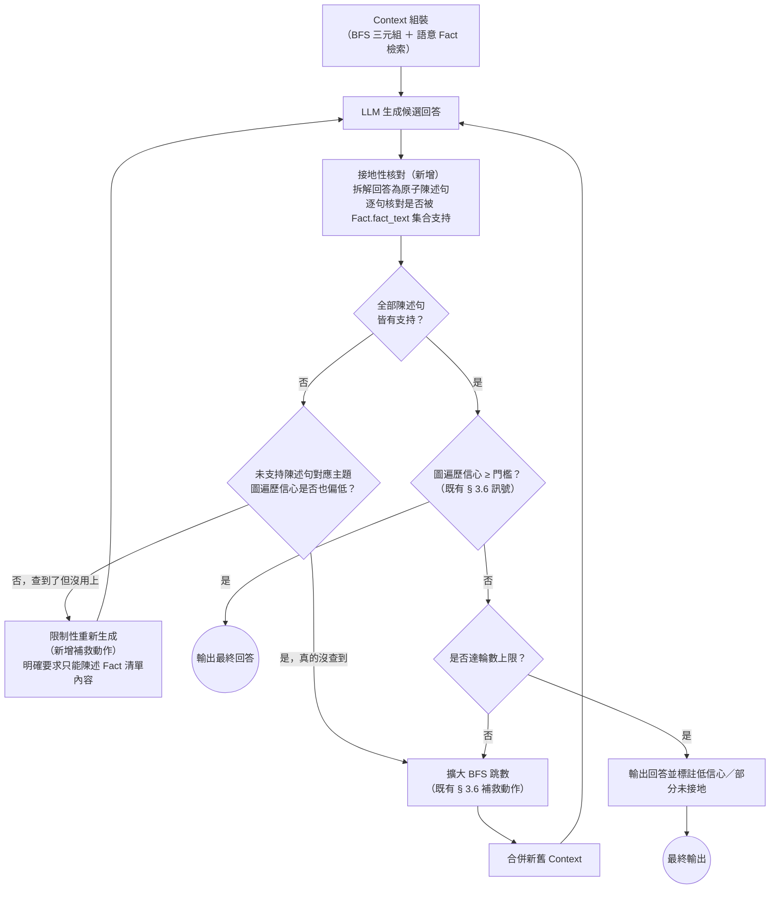

# 16：事實接地性核對（Fact-Grounded Verification）機制設計報告

> 狀態：🟡 設計提案，尚未實作。本報告僅完成文獻與專案佐證查證、機制設計、實作規劃，程式碼尚未動手，待使用者確認可行後才進入實作階段（見第 6 節）。

## 1. 起點：真實失效案例

2026-08-24，對 `Document`／`LawArticle` 節點與 `Fact.SUPPORTED_BY` 改指向 `LawArticle`（見 `docs/論文/03_變更紀錄.md` 第四十六～四十八次調整）完成真實 Neo4j／Ollama 端到端驗證後，額外挑了 8 筆真實法規記錄（KG，共 50 條條文、149 個 Fact 節點）做真實問答測試，發現兩個既有 § 3.6 自我精煉設計拓不到的失效模式：

### 案例一：證據正確、生成階段仍捏造數字

問題：「考試院所屬公務員每日辦公時數是幾小時？每週辦公總時數呢？加班每日不得超過幾小時？」

- 檢索到的語意 Fact（`vector_search_facts()`，score=0.90）**正確**包含：「延長辦公時數 每日不得超過十二小時 每月總計不得超過六十小時」。
- 但 LLM 最終生成的回答加了一句「每三個月總計不得超過二百四十小時」——經核對，**這個數字在整個 469 筆資料集的原始 JSONL 裡完全不存在**（`grep` 全文檢索確認），是純粹的生成階段捏造，不是檢索到了別份文件的數字被誤用。

### 案例二：檢索到片段證據、生成階段給出錯誤結論

問題：「受聘僱從事就業服務法第46條第1項第8到10款工作的外國人，可以用特別休假請假返國嗎？誰來決定返國日期？」

- 該法規（`N0090051`）第 3 條原文明確規定：「得向雇主請求以特別休假返國，並自行排定請假返國期日，雇主應予同意」——即答案應為「可以，員工自行排定，雇主原則上應同意」。
- 但 LLM 回答「無法確定這些工作是否可以使用特別休假請假返國」，並額外引用了《特種勤務條例》《國家情報工作法》《法官法》等與此問題完全無關的法規（來自同一 KG 內其他 7 筆不相關法規的實體碰撞污染，屬另一個獨立問題，見第 7 節「範圍排除」）。

## 2. 為何既有 § 3.6 設計拓不到

現行 § 3.6 自我精煉迴圈的信心訊號是**圖遍歷本身的信心**（種子實體命中數、BFS 路徑長度）：信心不足 → 擴大 BFS 跳數 → 重新生成。這個訊號回答的是「查得夠不夠多」，不是「生成的內容有沒有被查到的東西支持」——案例一裡，正確證據已經確實被查到、且排進了 Top-5 語意 Fact，圖遍歷信心訊號不會偵測到任何異常，因為它本來就不是為了偵測「生成內容脫離檢索證據」這件事設計的。這是兩個獨立的失效模式，需要獨立的偵測訊號，不能靠擴大既有機制的門檻覆蓋。

## 3. 機制設計提案

在既有 § 3.6 的圖遍歷信心訊號之外，新增第二個獨立訊號——**接地性核對（Grounding Check）**：生成候選回答後，逐句核對其中的事實陳述是否被本次實際使用的 `Fact.fact_text` 集合支持。

**核心設計判斷**：兩種「未接地」的成因需要不同的補救動作，不能都用「擴大檢索」處理——案例一如果套用擴大 BFS 跳數，不會有任何幫助（正確答案早就在 Top-5 裡了），真正需要的是約束生成本身（例如明確要求「只能陳述以下 Fact 清單裡出現過的內容，清單沒提到就回答『資料未明確記載』，不可自行推算或補充數字」）。

## 4. 與 Self-RAG／FLARE／IRCoT 既有差異化論述的延伸

第二章 2.4.7、第三章 3.6 已明確宣稱本論文的自我精煉迴圈與 Self-RAG／FLARE／IRCoT「機制上有明確差異」——三者作用於**自由文字段落**，本論文作用於**結構化三元組**。本次新增的接地性核對機制**不違反、且進一步強化**這個既有差異化論述，理由有兩層：

1. **對象層面（既有論述）**：核對對象是 `Fact.fact_text`（結構化三元組的文字化表示），不是原始段落。
2. **機制層面（本次新增的區隔點）**：Self-RAG 的反思標記（`ISREL`／`ISSUP`／`ISUSE`）是**訓練出來**的（模型微調時學會輸出這些標記），本論文提案的接地性核對是**純 prompting、不訓練**——這是額外一層獨立的技術路線差異，不只是「三元組 vs 段落」。

第二章 2.4.7 段落建議追加一句話說明這個新區隔點，待本報告確認可行後再一併修訂（見第 6 節）。

## 5. 學術文獻與專案佐證

### 5.1 主要佐證：RAGAS Faithfulness 指標（🟢 已下載，本論文既有引用）

**Es et al. (2023/2024)，🟢 EACL 2024《RAGAS: Automated Evaluation of Retrieval Augmented Generation》**——已於第二章 2.5 節引用為第五章離線評估指標（`docs/參考文獻/05_評估方法論/es-et-al-2023-ragas.pdf`，✅ 已下載，見 2026-08-20 補齊記錄）。2026-08-24 查證確認其 Faithfulness 指標的具體演算法：

> 拆解生成回答為原子陳述句（claim decomposition）→ 逐句以 NLI 式判斷（supported／unsupported）核對是否被檢索到的 context 支持 → Faithfulness Score = 支持陳述句數 ／ 總陳述句數。

這與本報告第 3 節提案的「接地性核對」演算法**幾乎一一對應**——本次提案的貢獻不是發明新演算法，而是**把 RAGAS 原本設計為離線評估指標的演算法，重新定位為線上執行期核對機制**，同一套演算法服務兩種用途（線上防護 ＋ 第五章離線評估），不需要另外設計一套獨立機制。**參考專案**：官方倉庫 [`explodinggradients/ragas`](https://github.com/explodinggradients/ragas)，2026-08-24 `gh api` 查證 **15,450★**、非封存、最後 push 2026-02，是本論文目前所有專案佐證裡星數最高、最活躍的一個，可信度充分。

### 5.2 理論框架：AIS 可歸因性（🟢 已下載，本論文既有引用）

**Rashkin et al. (2021/2023)，🟢 *Computational Linguistics* 49 (2023)，AIS**——已於第二章 2.5 節引用為可追溯性評估框架（`docs/參考文獻/`已下載）。AIS 回答的核心問題「這段生成內容是否可歸因於明確標識的來源」，正是接地性核對機制要在**線上、即時**回答的問題——本報告將 AIS 的理論框架從「離線評估的理論依據」延伸為「線上核對機制的理論框架」，用途延伸但理論本身不變，不需要另外查證新文獻。

### 5.3 次要佐證：Chain-of-Verification（🟢 ACL 2024 Findings，尚未下載）

**Dhuliawala et al. (2023)，🟢 *Findings of ACL 2024*《Chain-of-Verification Reduces Hallucination in Large Language Models》**（arXiv:2309.11495）——2026-08-24 查證確認正式發表於 ACL 2024 Findings（非僅 arXiv 預印本）。核心主張：**不需訓練、純 prompting** 即可讓 LLM 產生驗證問題、自行回答、據以修正初稿，四步流程（草稿→生成驗證問題→回答→精修）比本報告提案的「單次核對」更複雜，但提供了獨立於 RAGAS 之外的第二個佐證：「prompt-only、不訓練的驗證機制」是一個獨立確立的技術路線，非本論文自創。

⚠️ **誠實侷限**：2026-08-24 查證未找到 Meta AI 官方釋出的程式碼；僅查到社群非官方重現（[`ritun16/chain-of-verification`](https://github.com/ritun16/chain-of-verification)，**204★**，最後 push 2023-10，近三年未更新），信任等級遠低於 RAGAS 官方倉庫，**僅作存在性佐證，不作為可信賴的實作參考**，比照本論文對 FrugalGPT 參考專案 4★ 降級處理的既有慣例（見 `docs/參考文獻/03_資訊抽取與本體設計/README.md`）。全文尚未下載，僅查證摘要與發表場合，論文正式引用前需比照既有慣例補齊全文精讀。

### 5.4 與既有 Self-RAG／FLARE／IRCoT 佐證的分工

不重複查證——沿用第二章 2.4.7、第三章 3.6 已完成的查證（官方倉庫星數、機制差異），本報告只新增「接地性核對」這個新機制本身的佐證，不重新評估 Self-RAG 等三篇既有引用的信任等級。

## 6. 實作規劃（尚未執行，待確認後才動手）

**確認後的實作順序建議**（比照既有「先切最小可行版」慣例，不一次做完整四輪迭代）：

1. **接地性核對函式**（暫名 `verify_fact_grounding()`，落點待定：`routers/agent.py` 或新模組 `services/verification_service.py`）：輸入生成的回答文字＋本次使用的 `Fact.fact_text` 清單，輸出「陳述句清單＋各自 supported/unsupported 判斷」，第一版直接呼叫 LLM 做 NLI 式判斷（比照 RAGAS 官方實作的 prompt 設計，非重新發明），不做效能優化。
2. **兩種補救動作分流**：`unsupported` 陳述句對應的實體/主題，查其在本輪 BFS 的種子命中數／路徑長度（既有 § 3.6 訊號）決定走「擴大 BFS」或「限制性重新生成」。
3. **與 SSE 串流架構的相容性問題（待確認，架構層級的開放問題）**：現行 `routers/agent.py::chat()` 是逐 token SSE 串流輸出，接地性核對需要**完整回答生成完畢後**才能執行——這代表核對本身無法即時串流呈現，需要決定：(a) 核對只在背景做，串流照舊直接輸出，核對結果另外附加或記錄（不阻擋使用者體感）；(b) 或核對通過前不開始串流（使用者需多等一輪 LLM 呼叫的時間）。兩者各有取捨，需要使用者決定產品行為後才能定案，非本報告能單方面決定。
4. **測試計畫**：至少涵蓋——全部陳述句皆接地（不觸發補救）、部分陳述句未接地且圖遍歷信心低（觸發擴大 BFS）、部分陳述句未接地但圖遍歷信心足夠（觸發限制性重新生成，對應本報告案例一的真實情境）、陳述句拆解在中文語境下的邊界案例。

## 7. 明確排除本報告範圍

- **實體碰撞跨文件污染問題**（案例二裡「主管機關」「本辦法」等通用詞跨無關法規碰撞的雜訊）是獨立問題，不在本報告討論範圍，需另外評估（可能方向：切塊/抽取階段排除「本辦法」「本法」「本標準」等自我指涉詞不建 Entity，或限縮 BFS 優先走同 `Document` 來源的路徑）。
- **信心門檻／輪數上限的具體數值**沿用既有 § 3.6 慣例——工程參數，留待第五章消融實驗校準，本報告不預設數值。
- **本報告不修改任何程式碼**——依使用者要求，需先確認本報告的設計與文獻查證可行後，才進入實作階段。
