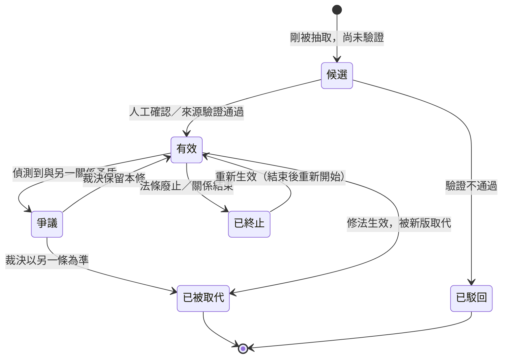

# 報告229：關係狀態機設計說明與待決事項（白話版，供使用者選擇）

> **日期**：2026-10-01
> **性質**：規劃對話撰寫的設計說明，**只有文件，沒有任何程式或資料變更**。依據：使用者設計原則（v0.2 §1.4 第 05 步：每個關係建成狀態機，起訖由狀態轉換定義，不強制綁時間，可由條件或監測到的狀態變化觸發）、報告203–206（依據蒐集，此項為 D 級＝查無直接先例）、使用者自己的 `本體論設計/Round3_Event_StateMachine_Correction_Model_v1.0.txt`。
> **目的**：把「關係狀態機」講到使用者能直接選擇的程度。**所有狀態與轉換都是「提案」，不是已決定。**

---

## 1. 要解決什麼問題（用一個例子講）

目前圖譜裡，「雇主／應給／特別休假十五日」這種關係只是一條線；同一組（主詞、關係、受詞）出現多次會**合併成一條**並累積引用（讀碼：`services/svo_service.py:1222`）。所以：

- **看不出這條規定現在還有效嗎？**——法規修過、舊條文失效，圖裡兩者並存，檢索可能混用（報告 `HANDOVER` 實測的 57-AGGR18「新舊法認定機構寫反時評分仍 100%」就是這類）。
- **無法表示「結束後又重新開始」**——例如某規定停止適用後又恢復，只會被併成同一條。
- 所以缺的不只是「時間欄位」，而是**整個「這條關係現在處於什麼狀態、什麼事情讓它改變」的機制**。這正是你說的「關係是狀態機」。

## 2. 狀態機是什麼（白話）

把每一條關係想成一張「有生命週期的卡片」：
- **狀態**＝卡片現在的樣子（例如「有效」「已被取代」）。
- **事件／觸發**＝讓卡片換狀態的原因（例如「修法生效」「發現兩個來源互相矛盾」「人工確認」）。
- **規則**＝哪些換法被允許、哪些狀態不能同時存在。
- **時間只是事件可能帶的資訊之一**，不是必須的——這就是你說的「不強制綁時間」。

## 3. 我提案的狀態與轉換（**提案，待你選**）

| 狀態 | 意思 | 可由什麼觸發 |
| --- | --- | --- |
| 候選 | 剛抽出來、還沒驗證（對應簡報的「候選→未決→接納」前段） | 抽取完成 |
| 有效 | 目前採信 | 人工確認、來源驗證 |
| 已被取代 | 被新版本取代（舊法） | 修法生效日（時間）或新版出現（事件） |
| 已終止 | 關係結束（法條廢止等），之後可能重新開始 | 廢止公告（事件）、期間屆滿（時間） |
| 爭議 | 兩條來源互相矛盾，待裁決 | 偵測到矛盾（監測到的狀態變化） |
| 已駁回 | 驗證不通過 | 人工或規則判定 |

**互斥規則（提案）**：同一組（主詞、關係型別、受詞）在同一時刻只能有一個「有效」；「已被取代」不可直接回到「有效」（要透過新的一條）；「已終止」可以重新生效（這就是「結束後重新開始」）。

## 4. 依據與限制（誠實說明）

- **查無先例（D 級）**：報告204–206 查證，近似做法是 Zep「偵測矛盾後讓舊關係失效」、Wikidata 的「結束原因」欄位，但它們的有效性**都附掛在時間記錄上**；**沒有任何已讀專案把關係做成顯式狀態機**。你的設計在查證範圍內沒有直接對應物，我不評對錯。
- **你自己的 Round 3 提供了可借用的觀念**：事件是已發生且不可改的事實（2.2）、狀態是事件重播得出的結果（2.3）、更正不等於刪除或改寫原事實（AC-010）、暫停／恢復不等於終止／重新入職（AC-009）。這些與上面提案完全相容，也解釋了「已終止→重新生效」為什麼合理。
- **但 Round 3 是為「台灣中小企業數位人資長」產品設計的**（針對 Employment、LeaveRequest 等業務物件），**不是針對知識圖譜的關係邊**；HANDOVER 也把該產品線列為「不建議近期混入」。所以只借觀念，**不整份搬**。
- **現況限制**：目前邊的鍵是（主詞、關係型別、受詞），同組只會有一條。要真正表示多段生命週期，需要「關係實例」這種結構變更，**影響儲存與抽取，成本高，本說明不提議立刻做**。
- **驗證資料缺口**：要用真實案例驗證（例如勞基法修法前後），需要**多版本法規資料**（對接清單 D1–D5，使用者尚未提供）。沒有它，只能用虛構的玩具案例驗證規則本身。

## 5. 需要你選的事（每項附我的建議與理由）

| # | 問題 | 選項 | 我的建議 |
| --- | --- | --- | --- |
| Q1 | 狀態要不要全圖一套通用？ | ①一套通用狀態 ②每種關係型別各自定義 ③**通用核心＋允許個別關係擴充** | **③**。與專案既有的「通用優先、可插拔、per-KG 設定」架構一致：先定義 6 個通用狀態，特殊關係需要時再加。 |
| Q2 | 「候選／已接納」要併入狀態機前段嗎？ | ①併入（候選是第一個狀態）②另立一套機制 | **①**。少一套機制；簡報的「候選→未決→接納」本來就是狀態轉換。 |
| Q3 | 觸發以什麼為主？ | ①以時間為主 ②以事件為主、時間當事件的屬性 ③全部平等 | **②**。符合你「不強制綁時間」；法規世界本來就是「修法生效」「廢止」這類事件，時間（生效日）只是事件帶的資訊。 |
| Q4 | 第一步怎麼驗證？ | ①直接改 KG#4 ②**只做「純運算規則＋玩具圖譜」驗證，不碰任何真實資料與儲存** ③先等你提供多版本法規資料再做 | **②**。零風險、可逆；把「允許轉換、互斥、結束後重新開始」寫成可測試的純函式，用虛構的 10 條左右關係驗證。等你提供多版本法規資料後再用真實案例驗證。 |

## 6. 若你同意建議，我接下來會做什麼／不會做什麼

**會做**：把 §3 的狀態與轉換寫成純運算模組（只在 `services/` 內新增、不接線）＋完整單元測試＋用虛構玩具案例的示範報告；全程不連 Neo4j、不改儲存、不改抽取、不改檢索與 prompt。
**不會做**：新增儲存欄位、關係實例結構、改 KG#4、改抽取提示詞、接進任何現有路徑、用真實資料回填狀態。這些都要你另外同意。

## 7. 狀態

⏳ 待使用者對 §5 的 Q1–Q4 裁示。**目前無進行中的派工。**
