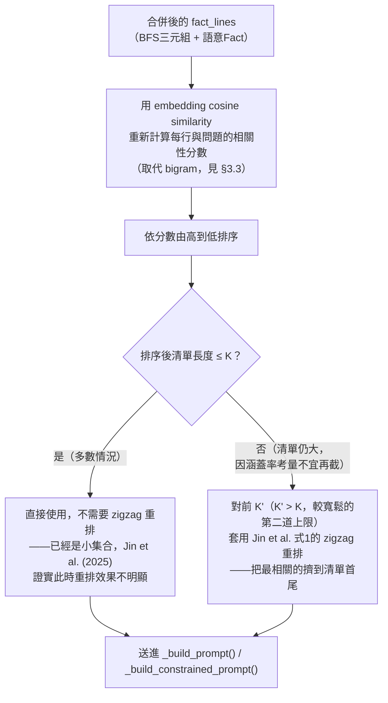

# 23．生成端事實清單排序機制優化設計報告

**日期**：2026-09-01
**狀態**：🟡 設計已定案，**尚未實作**——依本專案「先整理資料、定案設計，待使用者確認後才動工」的既有工作慣例（見報告19、20的先例）。

## 1. 背景

[報告22](22_乾淨重跑新舊KG問答品質比對報告.md) §5、§5.1 真實線上驗證發現：一筆完全正確、且確實出現在送給LLM的28行事實清單裡的三元組（「事假 得以 小時為請假單位」），連續兩次真實重跑都未被生成模型引用。追查排除了抽取與檢索管線的問題——三元組正確抽取、正確通過型別/文件範圍篩選、確實在最終 `_merge_fact_lines()` 輸出裡。

低成本第一版緩解（`_sort_lines_by_relevance()`，bigram重疊度排序＋prompt明確要求逐條核對，commit `e4e49a8`）把目標事實從第16名（28筆中）推到第11名，但兩次真實重跑仍未解決。文獻查證（[docs/參考文獻/19_生成端長清單事實遺漏與位置偏誤](../參考文獻/19_生成端長清單事實遺漏與位置偏誤/README.md)）確認這對應 Liu et al. (2023/2024) *Lost in the Middle* 的 U 形長上下文效能曲線——第11/28名恰好落在效能低谷。

本報告制定修正後的正式優化設計，取代原先「三項無條件疊加」的草案。

## 2. 現況分析

### 2.1 現有訊號來源與典型清單長度

`_merge_fact_lines(triples, fact_results)` 合併兩種來源：

- **BFS 三元組**（`bfs_query()`，經 `_filter_triples_by_relation_type()`／`_filter_triples_by_source_doc_ids()` 後篩選）——數量不固定，報告22真實測試觀察到 5～54 筆不等，取決於種子實體命中數與圖遍歷跳數。
- **語意 Fact 檢索**（`vector_search_facts()`，固定 `top_k=5`）——已是依 cosine 相似度排序的結果，數量固定為 5。

兩者合併去重後，典型合併清單長度落在 **10～60 行**之間，BFS 三元組是長度不穩定的主要來源。

### 2.2 現有排序訊號的弱點

`_sort_lines_by_relevance()` 目前用**字元二元組（bigram）Jaccard 重疊度**排序，純字串比對、零額外呼叫，但訊號強度弱——報告22真實案例中只把目標事實推進5個名次（16→11），對中文語意（同義詞、指代、語序調換）完全不敏感（例如「事假」與「請假事由為事故」語意相關但bigram重疊為零）。

## 3. 文獻依據與設計決策

### 3.1 核心文獻（完整查證見 `docs/參考文獻/19_.../README.md`）

| 文獻 | 貢獻 | 對本設計的影響 |
|---|---|---|
| Liu et al. (2023/2024, TACL) *Lost in the Middle* | 診斷：LLM對長輸入效能呈U形曲線，中段效能顯著下降 | 解釋了報告22「排序方向正確但沒解決」的根因——中段位置本身就是低谷 |
| Jin et al. (2025, ICLR) *Long-Context LLMs Meet RAG* | 正式zigzag重排公式（式1）；**關鍵邊界條件**：重排在檢索集合較小時效果不明顯，只有集合較大時才顯著 | 修正原設計——「截斷」與「重排」是同一根因（清單過長稀釋注意力）的兩種替代解法，不是必須疊加的獨立步驟 |
| Nogueira & Cho (2019) *Passage Re-ranking with BERT* | cross-encoder rerank 業界標準，成本較高 | 列為相關性訊號的**進階選項**，非本次優先實作 |

### 3.2 設計決策：以截斷為主、重排為條件式後備

依 Jin et al. (2025) 的邊界條件，**修正後的核心邏輯不是「排序+截斷+重排」三件事無條件疊加**，而是：

**理由**：與其把「截斷」與「重排」當成兩個獨立要素無條件疊加（原先草案），不如認清兩者處理的是同一個根因（清單過長 → 稀釋注意力／落入U形曲線低谷）。多數情況下把清單直接截斷到一個夠小的 K，問題就已經解決，不需要再疊加 zigzag 重排的複雜度；zigzag 重排只在「因為涵蓋率考量、不願意把清單截得太短」的情境下才有必要介入。這也直接呼應 Jin et al. 自己的實證結論。

### 3.3 相關性訊號升級：embedding cosine similarity

**技術可行性確認**：`EmbeddingProvider` 介面已有 `encode_batch(texts: list[str]) -> list[list[float]]`（`core/providers/base.py`），可一次呼叫算出全部 fact_lines 的向量，不需要逐行呼叫——先前報告22 §5 誤估「每次問答多一輪批次encode」的成本，實際上就是**一次**批次呼叫，成本遠低於原先估計。且 `chat()` 已經計算過 `question_vector`（供 `_find_seed_entities()`／`vector_search_facts()` 共用），可直接複用，不需要重算問題向量。

**具體作法**：
1. 對 `fact_lines`（`_merge_fact_lines()` 輸出）呼叫一次 `embedding_provider.encode_batch(fact_lines)`。
2. 對每行計算與已有的 `question_vector` 的 cosine similarity。
3. 依分數由高到低排序。

比起現有的 bigram 方案，這個訊號能捕捉語意相似（同義詞、指代），預期比報告22「只推進5個名次」有更顯著的改善——但**這是預期，需要真實重跑驗證，不能只憑理論假設就宣稱已解決**（見 §5 誠實侷限）。

### 3.4 截斷門檻 K 的選擇——尚待校準

**現況**：沒有足夠資料直接定案 K 的精確數值，這裡先給出設計依據與初始建議值，實作後需要真實測試校準：

- Rerank 文獻慣例（Nogueira & Cho 路線、業界二段式檢索常見做法）建議 K=3～7，但那是針對**完整段落**（每筆數百 token）；本專案的「事實」是**單行三元組**（每行約20～60個中文字），資訊密度遠低於完整段落，同樣的 K 值會犧牲太多涵蓋率。
- **初始建議**：K=15～20（BFS三元組+語意Fact合併後的總行數上限），大約是報告22真實案例（28行）的一半到七成，預期能把目前排名10～16名附近的正確事實推進到清單前半段，同時保留足夠涵蓋率。
- **K' （zigzag重排啟動門檻）**：建議設在原始清單長度明顯大於K的情境，例如原始行數 > 30 才啟動 zigzag（此時單純截斷到K可能損失过多涵蓋率，需要用重排保留更多原始筆數同時緩解中段低谷）。

**誠實聲明**：以上數值屬工程參數初始值，比照 `docs/論文/03_系統設計與方法論.md` § 3.6「信心門檻」「輪數上限」的既有慣例，需要在校準測試（見 §4）中做敏感度分析，本報告不預設為最終定案數值。

## 4. 測試計畫

實作後需完成：

1. **單元測試**：`_score_lines_by_embedding()`（或類似命名）的排序正確性；截斷邏輯（K 值邊界、清單長度剛好等於/小於/大於K的行為）；zigzag 重排邏輯（比照 `docs/參考文獻/19_.../README.md` 記錄的公式，驗證位置分佈符合式1）。
2. **真實回歸測試**：重跑報告22題3（「事假得以小時為請假單位」案例）至少3次，確認目標事實在多數重跑中被正確引用——不能只跑1次就宣稱解決（報告22已有「效果有限」的前車之鑑，需要多次重跑排除單次LLM隨機性造成的誤判）。
3. **K 值敏感度**：至少對比 K=10／15／20／不截斷（僅重排）四種設定，觀察目標案例與另外幾題既有案例（報告18-22已用過的題目）的表現差異，選出實際校準後的 K 值，而非只用 §3.4 的初始建議值定案。

## 5. 誠實侷限

- 本報告是**設計文件**，截斷K值、zigzag啟動門檻K'皆為理論推導的初始建議，非實測校準值。
- embedding cosine similarity 比 bigram 訊號更準是文獻與直覺支持的合理預期，但沒有在本專案的真實資料上驗證過效果幅度，需要 §4 測試計畫完整跑完才能確認。
- 截斷清單存在犧牲召回率的風險——若某個問題真的需要圖遍歷撈到的第25筆三元組才能完整回答，截斷到K=15會直接漏掉，這個權衡目前只有理論分析，沒有實測資料支撐K值選擇是否恰當。
- 本設計沒有涵蓋 Nogueira & Cho (2019) cross-encoder rerank 路線——列為進階選項，若embedding方案的改善幅度仍不足，才需要評估導入額外的rerank模型服務。

## 6. 待辦（實作前需使用者確認）

- [ ] 確認是否依本報告設計動工實作（`routers/agent.py` 新增 embedding 排序函式＋截斷邏輯＋條件式 zigzag 重排，取代/擴充現有 `_sort_lines_by_relevance()`）。
- [ ] 實作後執行 §4 測試計畫，依真實結果校準 K／K' 數值，更新本報告與 `docs/論文/03_系統設計與方法論.md` § 3.6 的對應紀錄。
