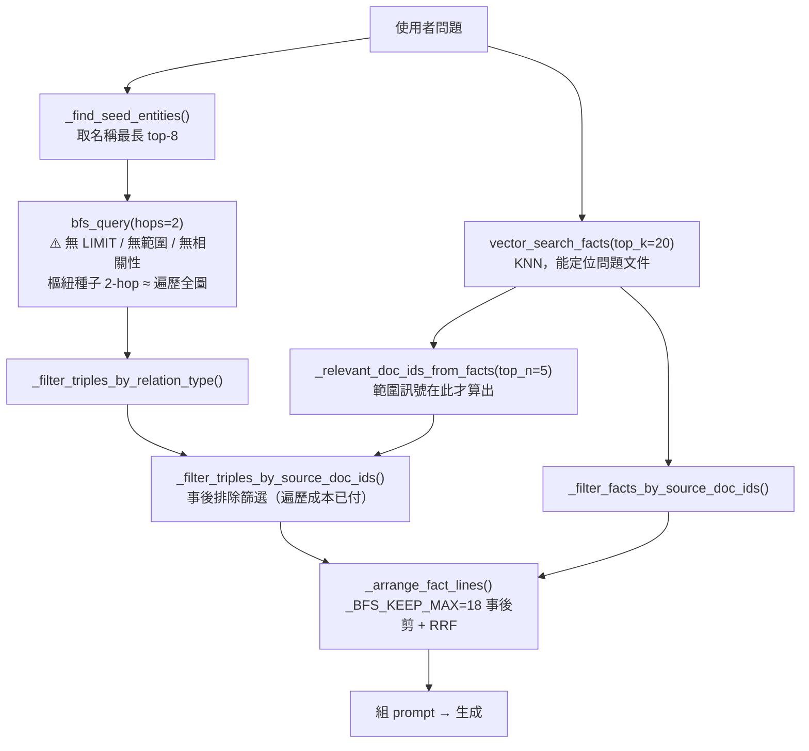
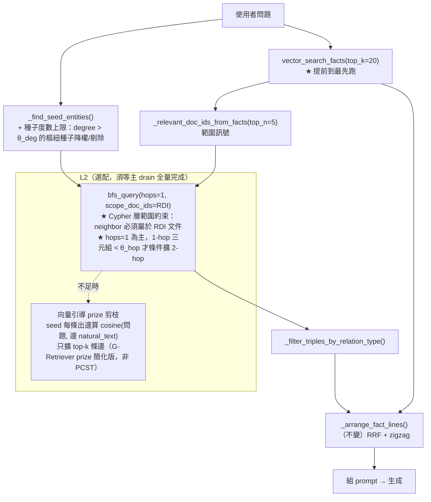

# 27．圖遍歷向量引導剪枝機制設計報告

**日期**：2026-09-04
**狀態**：設計提案，**尚未實作**，待確認
**對應**：`docs/報告/26_修正後瓶頸探測問答比對報告.md` § 4 #4（檢索灌爆＋延遲）；
`docs/論文/02_文獻探討.md` § 2.4.8（RQ6）／§ 3.7（向量引導圖剪枝，目前「預留」）；
`docs/參考文獻/04_圖遍歷與大節點問題/`、`docs/參考文獻/21_圖遍歷與向量檢索結果融合/`

---

## 1. 背景與觸發

報告26 用 8 道新題探測修正後的 c15949bf，§ 4 依影響排序列出 6 個殘留瓶頸，
其中 **#4「檢索灌爆＋延遲」**：

> 共用高頻實體（雇主／被保險人）當種子時 BFS 無 `LIMIT`／無評分，撈 80–100 條
> 大多離題，單題 5–7 分鐘（Q5 / Q6 / Q7 各 330–440 秒，BFS 79–100 條三元組）。

這是報告26 §4 六項裡**唯一的基礎設施問題**（其餘 #2/#3/#5/#6 屬 prompt 層級），
且它同時：

- 造成 5–7 分鐘延遲——可用性阻礙；
- 把離題事實灌進下游，惡化 #2（多事實組裝糊）與 #3（多跳推理）；
- 對應論文 **RQ6**，§ 3.7 已規劃「向量引導圖剪枝」但標記「預留」——本報告把它
  從預留轉為實作設計。

### 1.1 與報告25 發現6 的關係（已做了什麼、還缺什麼）

報告25 §4 發現6 已在**事實清單組裝階段**（`routers/agent.py::_arrange_fact_lines()`）
加了事後補救：BFS 三元組行先用 `_score_lines_by_embedding()` 對問題 cosine 排序、
剪到 `_BFS_KEEP_MAX=18`，再與語意 Fact 做 RRF 融合（報告25 §6 ⑤）。

**但那是「三元組已經全部撈回來、在 Python 端事後剪 prompt 行」**。`bfs_query()` 的
Cypher 遍歷本身仍無界——昂貴的路徑枚舉、Neo4j↔driver 的資料搬運、`SVOTriple`
建構全都先發生了，延遲成本無法靠下游剪枝回收。本報告處理的是**遍歷階段**。

---

## 2. 根因分析（讀碼確認，2026-09-04）

### 2.1 `bfs_query()` 遍歷無界

`services/svo_service.py:2823` `bfs_query(driver, kg_id, seed_entities, hops=2)`：

```cypher
MATCH (seed:Entity {kg_id: $kg_id}) WHERE seed.name IN $seed_entities
MATCH path = (seed)-[:<SVO_REL_TYPES>*1..$hops]-(neighbor:Entity {kg_id: $kg_id})
UNWIND relationships(path) AS rel
WITH DISTINCT startNode(rel) AS s, rel, endNode(rel) AS o
RETURN s.name, ..., rel.natural_text, o.name, ...
```

- `hops` 來自 `ChatRequest.svo_hops`，**預設 2**（`models/document.py:57`，`ge=1, le=3`）。
- **無 `LIMIT`、無問題相關性、無文件範圍。** 變長路徑 `*1..2` 從樞紐種子（雇主在
  勞動法語料裡出邊數可達數百）出發，2-hop 幾乎覆蓋整個 KG 的知識層邊。
- `WITH DISTINCT` 只在邊層級去重，**路徑枚舉本身**才是延遲來源（組合爆炸）。

### 2.2 `chat()` 的順序讓範圍訊號用不上

`routers/agent.py::chat()`（`sed -n '729,758p'`）目前順序：

1. `_find_seed_entities()`（取名稱最長的 top-8，`_SEED_ENTITY_LIMIT=8`）
2. **`bfs_query(hops=svo_hops)`** ← 無界遍歷在這裡發生
3. `_filter_triples_by_relation_type()`
4. `vector_search_facts(top_k=20)` ← 語意檢索，能推出「問題屬於哪份文件」
5. `_relevant_doc_ids_from_facts(top_n=_DOC_SCOPE_TOP_N_FACTS=5)` ← 範圍訊號**在此才算出**
6. `_filter_triples_by_source_doc_ids()` ← 只當**事後排除篩選**

報告25 §4 發現1 已確認 `vector_search_facts()` 能準確定位問題文件（真實測試兩次
Top-5 排第一、score ≈ 0.80）。但這個訊號在步驟 5 才產生，`bfs_query` 早在步驟 2
就把整張圖走完了。

### 2.3 兩個可分離的成本

| 成本 | 來源 | 目前緩解 | 缺口 |
|---|---|---|---|
| **(a) 遍歷延遲** | 樞紐種子 2-hop 路徑枚舉 | 無 | 本報告 L0 + L1 |
| **(b) 回傳量灌爆下游** | 79–100 條三元組進 Python | `_BFS_KEEP_MAX=18` 事後剪 + RRF | 事後剪治標；L1 降低源頭量 |

---

## 3. 文獻與參考專案對照

| 文獻／專案 | 對本設計的角色 | repo 狀態 |
|---|---|---|
| **G-Retriever**（He et al., 2024, NeurIPS 2024，arXiv:2402.07630） | 子圖檢索形式化為 **PCST（Prize-Collecting Steiner Tree）**：node／edge 各自用 Sentence-BERT 算 embedding，依對查詢的相似度給 prize（top-k 遞減 k…1，其餘 0），求最大化 Σprize − Σedge_cost 的連通子圖。具最佳化理論保證、有大小上界。WebQSP 準確率 70.49 vs KAPING 60.81。 | ✅ 已精讀全文含附錄，`docs/參考文獻/12_三元組事實層級向量化與檢索/`，已在 §3.1.4 §a 引用 |
| **PathRAG**（Chen et al., 2025, arXiv:2502.14902） | 明確命名「retrieved subgraph 的**冗餘**」為核心問題（非知識不足）。**flow-based pruning**（把索引圖當流網路、剪冗餘關聯路徑）＋ **path-based prompting**（只取關鍵關聯路徑轉文字、不取任意子圖）。6 資料集 5 維度優於 GraphRAG／LightRAG。官方碼 [BUPT-GAMMA/PathRAG](https://github.com/BUPT-GAMMA/PathRAG)。 | ✅ 已下載 `docs/參考文獻/02_RAG與GraphRAG/chen-et-al-2025-pathrag.pdf`；🟡 待精讀方法章節 |
| **CatRAG**（Lau et al., *Breaking the Static Graph: Context-Aware Traversal for Robust RAG*, Findings of ACL 2026，arXiv:2602.01965） | 命名 **「Static Graph Fallacy」**：方法依賴索引階段就固定的轉移機率、忽略邊相關性的**查詢相依**本質，導致 semantic drift——隨機游走**被高度數 hub 節點吸走、還沒走到關鍵下游證據就偏航**。與報告26 #4「共用實體把 BFS 灌爆、離題事實佔多數」近乎逐字對應。解法：symbolic anchoring ＋ **query-aware 動態邊加權** ＋ key-fact passage enhancement，建於 HippoRAG 2 + Personalized PageRank。官方碼 [kwunhang/CatRAG](https://github.com/kwunhang/CatRAG)。 | 🟡 **待下載全文**（arXiv:2602.01965）→ 放進 `docs/參考文獻/04_圖遍歷與大節點問題/` |
| **LightRAG**（Guo et al., 2024, EMNLP 2025，arXiv:2410.05779） | dual-level 檢索，**local 層只取 one-hop 鄰居**——「`svo_hops` 預設 1」的直接先例。 | ✅ 已下載 `docs/參考文獻/02_RAG與GraphRAG/guo-et-al-2024-lightrag.pdf` |
| **SAGE**（Titiya et al., 2026, arXiv:2602.16964） | expand first-hop 鄰居 → dense+sparse retrieval 過濾 → 只選 top-k' → union seeds。retrieval recall +5.7pp（OTT-QA）／+8.5pp（STaRK）。「展開後剪枝」的先例。 | 🟡 摘要已查證 `docs/參考文獻/21_.../README.md` |
| **Han et al. GraphRAG 綜述**（2024/2025，arXiv:2501.00309） | 「隨跳數增加，retrieved subgraph 鄰居指數成長，exponentially increase the context length ... dilute the focus of LLMs」→「poses a requirement for graph-based reranking mechanisms」。確立「遍歷結果需問題相關性重排／剪枝」為領域共識。 | ✅ 已下載 `docs/參考文獻/21_.../han-et-al-2025-rag-with-graphs-survey.pdf` |
| **microsoft/graphrag** local search（35,774★，論文已引 Edge et al. 2024） | 具體 bounding recipe：先取 **top-10 entity**（embedding 相似度）→ 加 relationship 直到 token 數達 context ½ → 加原文 chunk 直到 context 滿。**以 token 預算為界、不以 hop 為界。** | ✅ 官方倉庫，論文 §2.3 已引用 |
| **Neo4j 工程實務**：David Allen, *Graph Modeling: All About Super Nodes*（Neo4j Developer Blog）；APOC `apoc.path.expandConfig`（`limit` / `maxLevel` / `labelFilter` / `bfs:true` / `filterStartNode`） | 「supernode / fanning-out problem」的實務命名與 Neo4j 原生 bounded-traversal primitive。⚠️ 本專案 Neo4j 未裝 APOC（`requirements.txt` 僅 `neo4j~=6.0`、原始碼全用 raw Cypher）——設計以純 Cypher 為主、APOC 列為替代路線。 | 書目層級 |

**誠實聲明**（沿用論文 §3.7 既有立場）：本設計採用的是**簡化的向量相似度剪枝**，
**不是** PCST（G-Retriever）那類具最佳化理論保證的嚴謹子圖檢索，也不直接複用
PathRAG 的 flow-based pruning 或 CatRAG 的 PPR 實作。若 RQ6 最終納入正式貢獻，
第五章需明確說明本簡化方案與文獻嚴謹解法的方法論差距。

---

## 4. 設計：分層，最小侵入優先

### 目前流程



### 提議流程



### L0 — 立即，純參數（純查詢端）

`ChatRequest.svo_hops` 預設 **2 → 1**。理由：

- 報告26 Q6（低連通度程序性條文「離職退保之日起二年內」）證實好種子的 1-hop
  就能接到答案並正確歸因；
- LightRAG local 層即只用 one-hop；
- 2-hop 僅在「1-hop 三元組數 < θ_hop」時條件觸發（`bfs_query` 內部先跑 1-hop、
  數量不足再擴），避免小文件漏檢。

### L1 — 核心（查詢端 Cypher + `chat()` 重排序，drain 期間可安全做）

**(1) `chat()` 順序**：`vector_search_facts` → `_relevant_doc_ids_from_facts` 提前到
`bfs_query` **之前**，把 `relevant_doc_ids` 當**前置**參數傳入。

**(2) `bfs_query(scope_doc_ids=...)` Cypher 範圍約束**：遍歷時 `neighbor` 必須屬於
`relevant_doc_ids` 內的文件。實作選項：

- 邊上 `citations_json` 是 JSON blob、無索引，**不用**；
- 改約束 `neighbor` Entity 經 `HAS_ENTITY` 邊連到的 `Document` 節點 id ∈ `scope_doc_ids`
  （`§3.1.4 §a` 的結構層邊）；
- `scope_doc_ids` 為空、或該 KG 無 `HAS_ENTITY` 邊時 → **fallback 回現行無界行為**
  （相容舊 KG）。

**(3) 種子度數上限**：`_find_seed_entities()` 對候選種子查 degree（`MATCH (e)-[r]-()
WHERE ... RETURN count(r)`），degree > θ_deg（初值 200，待校準）的樞紐實體降權排到
最後、或當候選 ≥ 2 個非樞紐種子時直接剔除。對應 CatRAG「semantic drift into hub」
的簡化對策。

### L2 — 選配，向量引導 prize 剪枝（**須等主 drain 全量完成後**）

若 L0 + L1 後延遲仍 > 目標，或答案正確性因範圍過窄而回歸：對 seed 的每條候選出邊
算 `cosine(問題向量, 邊 natural_text 向量)`，只擴展 top-k 條邊（k 初值 10）。這是
G-Retriever prize 機制的**扁平化簡化**（無 Steiner tree 最佳化、無 GNN）。

⚠️ 此步會改 `services/svo_service.py::bfs_query()` 的遍歷語意，屬**抽取端相鄰程式碼**，
且需要邊 `natural_text` embedding 齊備——**必須等 c15949bf 全量重抽（B）完成、進入
抽取端凍結期後再上**，本次不做。

### 不做

完整 PCST（He et al.）——最佳化理論保證但需 GNN 編碼子圖、實作重，超出本專案
「簡化相似度剪枝」定位（論文 §3.7 已聲明此差距）。列為第五章消融對照。

---

## 5. 風險與相容性

| 風險 | 緩解 |
|---|---|
| L1(2) 依賴 `HAS_ENTITY` 結構邊——memory 記載 `source_doc_id` 曾長期未賦值、舊 KG 無此邊（§3.1.4 §c） | fallback：`scope_doc_ids` 空或無 `HAS_ENTITY` → 退回無界。c15949bf 重抽後此路徑才穩定生效 |
| `svo_hops` API 預設值改變影響既有呼叫端／測試 | 改前 grep `svo_hops` 全用例；`tests/routers/test_agent.py`、`tests/services/test_svo_service.py` 需同步 |
| 範圍過窄 → 跨文件才答得出的題目漏檢 | `_DOC_SCOPE_TOP_N_FACTS` 已是 5（非 1）；驗證題組含 Q5（跨文件不混淆）把關 |
| θ_deg / θ_hop / L2 top-k 皆未校準 | 列入 §6 敏感度測試；初值保守（θ_deg=200、θ_hop=8、k=10） |

---

## 6. 驗證計畫（B 完成後執行）

主 drain 全量重抽完成後，用報告26 題組跑條件 A／D：

| 指標 | 現況（報告26） | 目標 |
|---|---|---|
| Q5/6/7 單題延遲 | 330–440 秒 | < 90 秒 |
| BFS 回傳三元組數 | 79–100 | < 30 |
| Q1/Q3 正確性 | Q1 ✗、Q3 ◐ | 不因剪枝回歸（發現3 全量生效後應 ✅） |
| Q6（低連通度可及性） | ✅ | 維持 ✅（剪枝不可過度） |

敏感度測試：θ_deg ∈ {100, 200, 400}、θ_hop ∈ {5, 8, 12}、（L2）k ∈ {5, 10, 15}。

---

## 7. 落地順序

1. ✅ **本報告確認**（2026-09-04）→ 已下載 CatRAG 全文（arXiv:2602.01965）進
   `docs/參考文獻/04_圖遍歷與大節點問題/`，補該資料夾 README 內容清單與交叉引用
2. ✅ **L0 + L1 已實作**（2026-09-04，純查詢端，主 drain 跑期間完成）——見下方 §7.1
3. ⏳ **B 完成** → 跑 §6 驗證題組，結果補進報告26 §2「修正後」欄或本報告 §6
4. ⏳ 視結果決定 **L2**（向量引導 prize 剪枝，須等主 drain 全量完成、抽取端凍結）
5. ⏳ 論文 §3.7 由「預留」改為「已實作（簡化方案）」，§2.4.8 RQ6 更新；第五章補簡化方案 vs PCST/PathRAG/CatRAG 的方法論差距說明

### 7.1 L0 + L1 實作紀錄（2026-09-04）

| 層 | 檔案／函式 | 變更 |
|---|---|---|
| **L0** | `models/document.py::ChatRequest.svo_hops` | 預設 `2 → 1`（`ge=1, le=3` 不變） |
| **L0** | `services/svo_service.py::bfs_query()` | `hops` 語意改為「最大允許跳數」。一律先跑 1-hop（`*1..1`）；去重後 `< expand_when_below`（`_BFS_EXPAND_WHEN_BELOW=8`）且 `hops >= 2` 才補跑 `*2..hops` 擴展趟、依 `(subject, rel_type, object)` 去重合併。抽出 `_bfs_pass_cypher()`／`_bfs_records_to_triples()` 兩個 helper。 |
| **L1(1)** | `routers/agent.py::chat()` | `vector_search_facts()` + `_relevant_doc_ids_from_facts()` 提前到 `bfs_query()` 之前；`relevant_doc_ids`（空則傳 `None`）與 `_BFS_PER_SEED_LIMIT=60` 一併傳入 `bfs_query()`。事後 `_filter_triples_by_source_doc_ids()` 保留當 fallback 兜底。 |
| **L1(2)** | `services/svo_service.py::bfs_query(scope_doc_ids=)` | Cypher CALL 子查詢內加 `WHERE EXISTS { MATCH (c:Chunk {kg_id})-[:HAS_ENTITY]->(neighbor) WHERE c.source_doc_id IN $scope_doc_ids }`。**空結果 fallback**：scoped 首趟 1-hop 撈不到任何列 → 自動改跑無範圍版（相容無 `HAS_ENTITY` 邊的舊 KG／範圍推導失準）。`HAS_ENTITY` 只在此 `EXISTS {}`，不進 `*min..max` 走訪型別清單（2026-08-19 迴歸不破）。 |
| **L1(3)** | `routers/agent.py::_drop_hub_seeds()`（新） | `_find_seed_entities()` 回傳前呼叫。候選 ≥ 2 個時查各自 degree（`MATCH (e)-[r]-() ... count(r)`），剔除 degree > `_SEED_MAX_DEGREE=200` 的樞紐；全部都是樞紐時原樣保留。候選 < 2 個直接回傳、不多打查詢。 |
| **L1** | `services/svo_service.py::bfs_query(per_seed_limit=)` | CALL 子查詢內 `RETURN path LIMIT $per_seed_limit`，每 seed 展開路徑數上限（第二道扇出防線）。 |

**測試**：新增 9 個（`test_svo_service.py` 5：1-hop 預設不擴展／首趟已足夠不擴展／
scope+per_seed_limit 下推形狀／空結果 fallback／型別限制迴歸更新；`test_agent.py`
4：hub 剔除／全樞紐保留／單候選跳過 degree 查詢／`chat()` facts 先於 bfs 且傳 scope／
`svo_hops` 預設 1）。全套 **657 passed**（`pytest -q`，174s）。

**未驗證（誠實侷限）**：測試用的 `FakeDriver` 只記錄 query 字串、不執行 Cypher，
所以 L1(2) 的 `EXISTS {}` 範圍子查詢、CALL 子查詢 `LIMIT`、`*2..hops` 擴展的
**語意正確性與延遲改善**尚未對真實 Neo4j 驗證——留給 §6（B 完成後、kg2-neo4j）。
空結果 fallback 讓 L1(2) 上線本身安全（最壞情況退回現行無界行為 + 既有事後篩選）。

---

## 8. 相關文件

- `docs/報告/26_修正後瓶頸探測問答比對報告.md` § 4 #4（觸發）、§ 2.1（Q1 資料汙染，與本報告獨立）
- `docs/報告/25_擴大版新舊KG問答品質比對報告.md` § 4 發現6（事實清單組裝階段的事後剪枝，本報告的下游）
- `docs/論文/02_文獻探討.md` § 2.4.8（RQ6）、§ 3.7（向量引導圖剪枝）
- `docs/參考文獻/04_圖遍歷與大節點問題/`、`docs/參考文獻/21_圖遍歷與向量檢索結果融合/`
- memory：`project_c15949bf_full_reextraction`（B 針對性重抽進行中）、
  `project_bfs_truncation_docs_correction`（`_PER_SEED_FACT_LIMIT` 從未存在的訂正）
