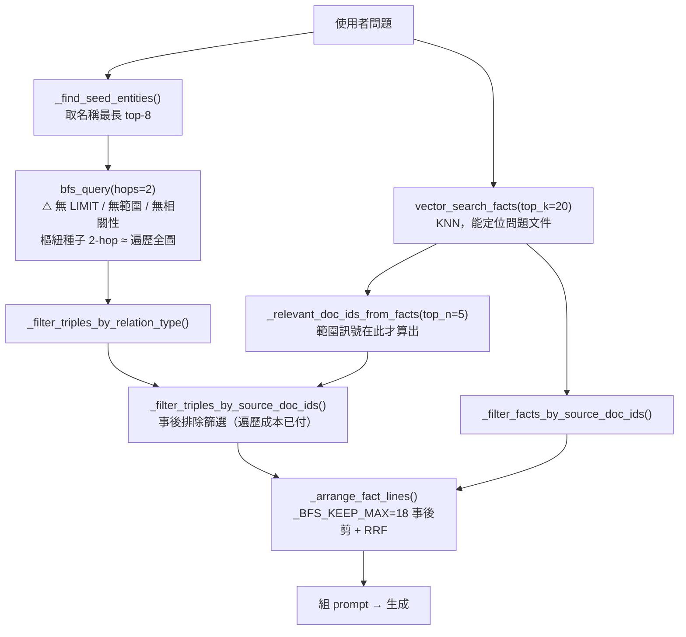
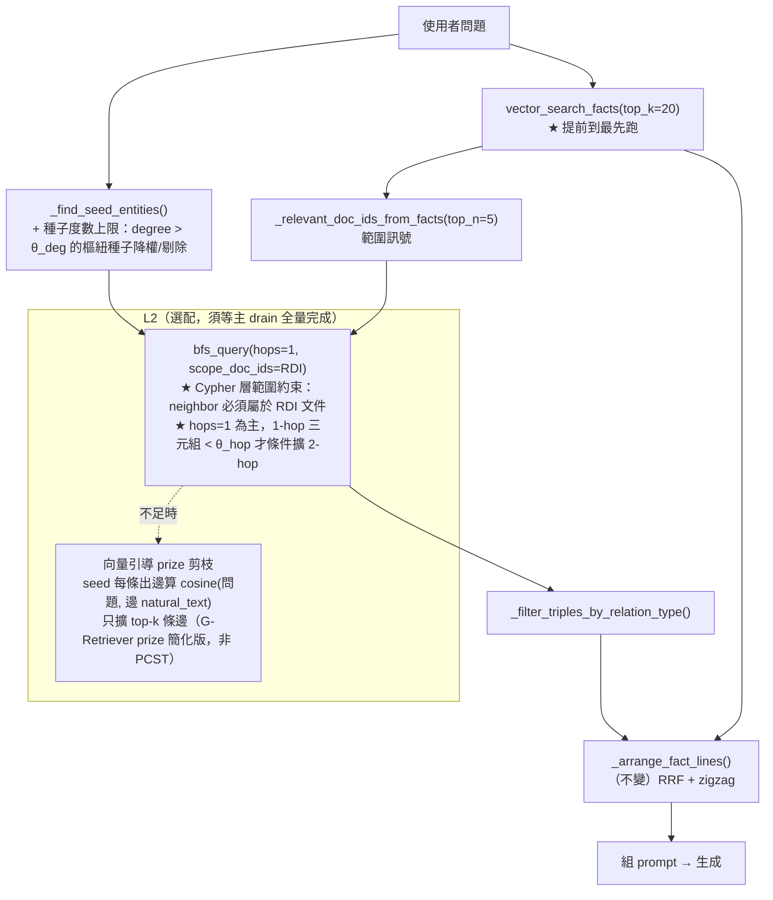

# 27．圖遍歷向量引導剪枝機制設計報告

**日期**：2026-09-04
**狀態**：設計提案，**尚未實作**，待確認
**對應**：`docs/報告/26_修正後瓶頸探測問答比對報告.md` § 4 #4（檢索灌爆＋延遲）；
`docs/論文/02_文獻探討.md` § 2.4.8（RQ6）／§ 3.7（向量引導圖剪枝，目前「預留」）；
`docs/參考文獻/04_圖遍歷與大節點問題/`、`docs/參考文獻/21_圖遍歷與向量檢索結果融合/`

---

## 1. 背景與觸發

報告26 用 8 道新題探測修正後的 c15949bf，§ 4 依影響排序列出 6 個殘留瓶頸，
其中 **#4「檢索灌爆＋延遲」**：

> 共用高頻實體（雇主／被保險人）當種子時 BFS 無 `LIMIT`／無評分，撈 80–100 條
> 大多離題，單題 5–7 分鐘（Q5 / Q6 / Q7 各 330–440 秒，BFS 79–100 條三元組）。

這是報告26 §4 六項裡**唯一的基礎設施問題**（其餘 #2/#3/#5/#6 屬 prompt 層級），
且它同時：

- 造成 5–7 分鐘延遲——可用性阻礙；
- 把離題事實灌進下游，惡化 #2（多事實組裝糊）與 #3（多跳推理）；
- 對應論文 **RQ6**，§ 3.7 已規劃「向量引導圖剪枝」但標記「預留」——本報告把它
  從預留轉為實作設計。

### 1.1 與報告25 發現6 的關係（已做了什麼、還缺什麼）

報告25 §4 發現6 已在**事實清單組裝階段**（`routers/agent.py::_arrange_fact_lines()`）
加了事後補救：BFS 三元組行先用 `_score_lines_by_embedding()` 對問題 cosine 排序、
剪到 `_BFS_KEEP_MAX=18`，再與語意 Fact 做 RRF 融合（報告25 §6 ⑤）。

**但那是「三元組已經全部撈回來、在 Python 端事後剪 prompt 行」**。`bfs_query()` 的
Cypher 遍歷本身仍無界——昂貴的路徑枚舉、Neo4j↔driver 的資料搬運、`SVOTriple`
建構全都先發生了，延遲成本無法靠下游剪枝回收。本報告處理的是**遍歷階段**。

---

## 2. 根因分析（讀碼確認，2026-09-04）

### 2.1 `bfs_query()` 遍歷無界

`services/svo_service.py:2823` `bfs_query(driver, kg_id, seed_entities, hops=2)`：

```cypher
MATCH (seed:Entity {kg_id: $kg_id}) WHERE seed.name IN $seed_entities
MATCH path = (seed)-[:<SVO_REL_TYPES>*1..$hops]-(neighbor:Entity {kg_id: $kg_id})
UNWIND relationships(path) AS rel
WITH DISTINCT startNode(rel) AS s, rel, endNode(rel) AS o
RETURN s.name, ..., rel.natural_text, o.name, ...
```

- `hops` 來自 `ChatRequest.svo_hops`，**預設 2**（`models/document.py:57`，`ge=1, le=3`）。
- **無 `LIMIT`、無問題相關性、無文件範圍。** 變長路徑 `*1..2` 從樞紐種子（雇主在
  勞動法語料裡出邊數可達數百）出發，2-hop 幾乎覆蓋整個 KG 的知識層邊。
- `WITH DISTINCT` 只在邊層級去重，**路徑枚舉本身**才是延遲來源（組合爆炸）。

### 2.2 `chat()` 的順序讓範圍訊號用不上

`routers/agent.py::chat()`（`sed -n '729,758p'`）目前順序：

1. `_find_seed_entities()`（取名稱最長的 top-8，`_SEED_ENTITY_LIMIT=8`）
2. **`bfs_query(hops=svo_hops)`** ← 無界遍歷在這裡發生
3. `_filter_triples_by_relation_type()`
4. `vector_search_facts(top_k=20)` ← 語意檢索，能推出「問題屬於哪份文件」
5. `_relevant_doc_ids_from_facts(top_n=_DOC_SCOPE_TOP_N_FACTS=5)` ← 範圍訊號**在此才算出**
6. `_filter_triples_by_source_doc_ids()` ← 只當**事後排除篩選**

報告25 §4 發現1 已確認 `vector_search_facts()` 能準確定位問題文件（真實測試兩次
Top-5 排第一、score ≈ 0.80）。但這個訊號在步驟 5 才產生，`bfs_query` 早在步驟 2
就把整張圖走完了。

### 2.3 兩個可分離的成本

| 成本 | 來源 | 目前緩解 | 缺口 |
|---|---|---|---|
| **(a) 遍歷延遲** | 樞紐種子 2-hop 路徑枚舉 | 無 | 本報告 L0 + L1 |
| **(b) 回傳量灌爆下游** | 79–100 條三元組進 Python | `_BFS_KEEP_MAX=18` 事後剪 + RRF | 事後剪治標；L1 降低源頭量 |

---

## 3. 文獻與參考專案對照

| 文獻／專案 | 對本設計的角色 | repo 狀態 |
|---|---|---|
| **G-Retriever**（He et al., 2024, NeurIPS 2024，arXiv:2402.07630） | 子圖檢索形式化為 **PCST（Prize-Collecting Steiner Tree）**：node／edge 各自用 Sentence-BERT 算 embedding，依對查詢的相似度給 prize（top-k 遞減 k…1，其餘 0），求最大化 Σprize − Σedge_cost 的連通子圖。具最佳化理論保證、有大小上界。WebQSP 準確率 70.49 vs KAPING 60.81。 | ✅ 已精讀全文含附錄，`docs/參考文獻/12_三元組事實層級向量化與檢索/`，已在 §3.1.4 §a 引用 |
| **PathRAG**（Chen et al., 2025, arXiv:2502.14902） | 明確命名「retrieved subgraph 的**冗餘**」為核心問題（非知識不足）。三階段：① Node Retrieval（LLM 抽問題關鍵詞→dense vector matching 取 top-N 節點）；② **flow-based pruning**（§Path Retrieval）——對每對檢索到的節點，用資源分配傳播 `S(v_i)=Σ α·S(v_j)/\|N(v_j,·)\|`（α 為衰減率）算路徑可靠度，`S(v_i)/\|N(v_i,·)\|<θ` 提前剪枝，只留 top-K 可靠路徑，**非任意相似度排序**；③ Answer Generation——路徑依可靠度**升冪**排列、最可靠者放在 prompt 尾端（Eq.6），跟本專案 `_litm_reorder()` 的 zigzag 原理相通（皆源自 Lost-in-the-Middle）。6 資料集 5 維度優於 GraphRAG／LightRAG。官方碼 [BUPT-GAMMA/PathRAG](https://github.com/BUPT-GAMMA/PathRAG)。 | ✅ 已下載全文精讀 `docs/參考文獻/02_RAG與GraphRAG/chen-et-al-2025-pathrag.pdf` |
| **CatRAG**（Lau et al., *Breaking the Static Graph: Context-Aware Traversal for Robust RAG*, Findings of ACL 2026，arXiv:2602.01965） | 命名 **「Static Graph Fallacy」**：方法依賴索引階段就固定的轉移機率、忽略邊相關性的**查詢相依**本質，導致 semantic drift——隨機游走**被高度數 hub 節點吸走、還沒走到關鍵下游證據就偏航**。與報告26 #4「共用實體把 BFS 灌爆、離題事實佔多數」近乎逐字對應。建於 HippoRAG 2 的 **Personalized PageRank**（非本專案的 Cypher BFS）之上，三機制：① **Symbolic Anchoring**（§3.2）——把查詢裡的具名實體注入為權重極小 ε 的「弱種子」，對抗機率質量擴散進通用 hub；② **Query-Aware Dynamic Edge Weighting**（§3.3）兩階段——Stage I 拓撲粗篩（每個種子出邊超過 K_edge 門檻時，依查詢向量與邊嵌入相似度只留 top-K_edge）＋ Stage II **LLM 對存活邊做離散分級**（Irrelevant/Weak/High/Direct）算動態權重 `ŵ_uv=φ(LLM(q,u,v,C(v)))·w_static`；③ Key-Fact Passage Weight Enhancement（§3.4，純算法無 LLM 成本）。官方碼 [kwunhang/CatRAG](https://github.com/kwunhang/CatRAG)。 | ✅ 已下載全文精讀 `docs/參考文獻/02_RAG與GraphRAG/lau-et-al-2026-catrag-static-graph-fallacy.pdf`（2026-08-25 收錄） |
| **LightRAG**（Guo et al., 2024, EMNLP 2025，arXiv:2410.05779） | dual-level 檢索，**local 層只取 one-hop 鄰居**——「`svo_hops` 預設 1」的直接先例。 | ✅ 已下載 `docs/參考文獻/02_RAG與GraphRAG/guo-et-al-2024-lightrag.pdf` |
| **SAGE**（Titiya et al., 2026, arXiv:2602.16964） | expand first-hop 鄰居 → dense+sparse retrieval 過濾 → 只選 top-k' → union seeds。retrieval recall +5.7pp（OTT-QA）／+8.5pp（STaRK）。「展開後剪枝」的先例。 | 🟡 摘要已查證 `docs/參考文獻/21_.../README.md` |
| **Han et al. GraphRAG 綜述**（2024/2025，arXiv:2501.00309） | 「隨跳數增加，retrieved subgraph 鄰居指數成長，exponentially increase the context length ... dilute the focus of LLMs」→「poses a requirement for graph-based reranking mechanisms」。確立「遍歷結果需問題相關性重排／剪枝」為領域共識。 | ✅ 已下載 `docs/參考文獻/21_.../han-et-al-2025-rag-with-graphs-survey.pdf` |
| **microsoft/graphrag** local search（35,774★，論文已引 Edge et al. 2024） | 具體 bounding recipe：先取 **top-10 entity**（embedding 相似度）→ 加 relationship 直到 token 數達 context ½ → 加原文 chunk 直到 context 滿。**以 token 預算為界、不以 hop 為界。** | ✅ 官方倉庫，論文 §2.3 已引用 |
| **Neo4j 工程實務**：David Allen, *Graph Modeling: All About Super Nodes*（Neo4j Developer Blog）；APOC `apoc.path.expandConfig`（`limit` / `maxLevel` / `labelFilter` / `bfs:true` / `filterStartNode`） | 「supernode / fanning-out problem」的實務命名與 Neo4j 原生 bounded-traversal primitive。⚠️ 本專案 Neo4j 未裝 APOC（`requirements.txt` 僅 `neo4j~=6.0`、原始碼全用 raw Cypher）——設計以純 Cypher 為主、APOC 列為替代路線。 | 書目層級 |

**誠實聲明**（沿用論文 §3.7 既有立場，2026-09-05 全文精讀 PathRAG／CatRAG 後補精確對照）：
本設計採用的是**簡化的度數/扇出上限剪枝**，**不是** PCST（G-Retriever）那類具
最佳化理論保證的嚴謹子圖檢索，也不直接複用 PathRAG 的資源分配流量剪枝或
CatRAG 的 PPR + 動態邊加權。精確對應關係：

- `_drop_hub_seeds()`（度數門檻）最接近 CatRAG **Stage I 拓撲粗篩**（§3.3.2，
  依相似度只留 top-K_edge 出邊）的精神，但本設計是**二元剔除**（種子整個丟棄
  或保留），CatRAG 是**保留但降到最小 Weak 權重**、且走訪本身是 PPR 而非
  BFS；本設計**完全沒有** CatRAG 的 Symbolic Anchoring（弱種子）、Stage II
  LLM 離散分級、Key-Fact Passage Enhancement 三項核心機制。
- `bfs_query(scope_doc_ids=)` 的文件範圍下推最接近 PathRAG **Node Retrieval**
  階段（先框定候選節點集合），但本設計**沒有** PathRAG 的核心創新——**Path
  Retrieval 的資源分配流量剪枝**（對每對節點算路徑可靠度、只留 top-K 可靠
  路徑），本設計的三元組是逐邊獨立篩選，不評估路徑整體可靠度。

若 RQ6 最終納入正式貢獻，第五章需依此精確對照說明本簡化方案與文獻嚴謹解法
的方法論差距，不能只籠統說「簡化版」。

---

## 4. 設計：分層，最小侵入優先

### 目前流程



### 提議流程



### L0 — 立即，純參數（純查詢端）

`ChatRequest.svo_hops` 預設 **2 → 1**。理由：

- 報告26 Q6（低連通度程序性條文「離職退保之日起二年內」）證實好種子的 1-hop
  就能接到答案並正確歸因；
- LightRAG local 層即只用 one-hop；
- 2-hop 僅在「1-hop 三元組數 < θ_hop」時條件觸發（`bfs_query` 內部先跑 1-hop、
  數量不足再擴），避免小文件漏檢。

### L1 — 核心（查詢端 Cypher + `chat()` 重排序，drain 期間可安全做）

**(1) `chat()` 順序**：`vector_search_facts` → `_relevant_doc_ids_from_facts` 提前到
`bfs_query` **之前**，把 `relevant_doc_ids` 當**前置**參數傳入。

**(2) `bfs_query(scope_doc_ids=...)` Cypher 範圍約束**：遍歷時 `neighbor` 必須屬於
`relevant_doc_ids` 內的文件。實作選項：

- 邊上 `citations_json` 是 JSON blob、無索引，**不用**；
- 改約束 `neighbor` Entity 經 `HAS_ENTITY` 邊連到的 `Document` 節點 id ∈ `scope_doc_ids`
  （`§3.1.4 §a` 的結構層邊）；
- `scope_doc_ids` 為空、或該 KG 無 `HAS_ENTITY` 邊時 → **fallback 回現行無界行為**
  （相容舊 KG）。

**(3) 種子度數上限**：`_find_seed_entities()` 對候選種子查 degree（`MATCH (e)-[r]-()
WHERE ... RETURN count(r)`），degree > θ_deg（初值 200，待校準）的樞紐實體降權排到
最後、或當候選 ≥ 2 個非樞紐種子時直接剔除。對應 CatRAG「semantic drift into hub」
的簡化對策。

### L2 — 選配，向量引導 prize 剪枝（**prototype 已落地 2026-09-08，預設關；啟用待 §6.2**）

若 L0 + L1 後延遲仍 > 目標，或答案正確性因範圍過窄而回歸：在**懶惰擴展觸發時**
（`hops >= 2` 且 1-hop 三元組 < `θ_hop`），不再對 frontier 做無差別 `2..hops` 走訪，
改為對每條候選 2-hop 邊算 `cosine(問題向量, 邊 natural_text 向量)`，只擴展 top-k 條
（k 初值 `_BFS_PRIZE_TOP_K = 10`）。這是 G-Retriever prize 機制的**扁平化簡化**
（無 Steiner tree 最佳化、無 GNN）。

此步改 `services/svo_service.py::bfs_query()` 的遍歷語意，屬**抽取端相鄰程式碼**，
且需要邊 `natural_text` 齊備。原「必須等 c15949bf 全量重抽（B）完成、進入抽取端凍
結期後再上」——2026-09-08 改為：**prototype 先落地（純新增參數、預設關、opt-in、
零行為變化），啟用（在 `chat()` 傳入三參數）待 §6.2 全量驗證顯示 L0+L1 不足時再定**。
新 KG #4 每條邊即時 `_naturalize_triple`，drain ~21% 時 naturalized 邊已夠測 prototype。
實作與行為見 §7.2。

### 不做

完整 PCST（He et al.）——最佳化理論保證但需 GNN 編碼子圖、實作重，超出本專案
「簡化相似度剪枝」定位（論文 §3.7 已聲明此差距）。列為第五章消融對照。

---

## 5. 風險與相容性

| 風險 | 緩解 |
|---|---|
| L1(2) 依賴 `HAS_ENTITY` 結構邊——memory 記載 `source_doc_id` 曾長期未賦值、舊 KG 無此邊（§3.1.4 §c） | fallback：`scope_doc_ids` 空或無 `HAS_ENTITY` → 退回無界。c15949bf 重抽後此路徑才穩定生效 |
| `svo_hops` API 預設值改變影響既有呼叫端／測試 | 改前 grep `svo_hops` 全用例；`tests/routers/test_agent.py`、`tests/services/test_svo_service.py` 需同步 |
| 範圍過窄 → 跨文件才答得出的題目漏檢 | `_DOC_SCOPE_TOP_N_FACTS` 已是 5（非 1）；驗證題組含 Q5（跨文件不混淆）把關 |
| θ_deg / θ_hop / L2 top-k 皆未校準 | 列入 §6 敏感度測試；初值保守（θ_deg=200、θ_hop=8、k=10） |

---

## 6. 驗證結果

### 6.1 早期部分驗證（2026-09-04，14 份目標文件重抽完成後）

**範圍聲明**：本輪驗證只在**報告26/25 的 14 份目標文件**（B：`drain_targeted_14docs.py`）
完成重抽後執行，**c15949bf 其餘 ~50 份文件仍在主 drain 佇列**（驗證當下
`pending≈3077`）。故本輪只能確認「L0+L1 機制本身正確運作、對已重抽文件有效」，
不能宣稱對全語料的效果——全量完成後需重跑本節題組做最終驗證（§6.2 待辦）。

**方法**：暫停主 drain（避免 Ollama 資源競爭汙染延遲量測，沿用報告22/25/26
的既有方法論），跑 `run_report26_comparison.py`（真呼叫 `routers.agent.chat()`，
條件 A／D），驗證後恢復主 drain。0 例外。

| 題 | 報告26（修正前） | 本輪（L0+L1 後） | 延遲 | BFS 三元組 |
|---|---|---|---|---|
| Q1 | ✗ 第3段錯值＋跨條文汙染（20m以上誤答 25 分，應 35 分） | **◐ 改善**：20m以上正確答「三十五分鐘」（原錯誤已修正）；5–20m 正確「二十五分鐘」；唯 2–5m→20分鐘 這段仍缺、被另一條件句取代 | 122.1s | 10（原 79–100） |
| Q2 | ✅ | ✅ 不變（四十公斤／四點五公斤全中） | 58.8s | 18 |
| Q3 | ◐ 事實糊成一團、漏「發給三個月為限」 | **✅ 改善**：四個事實清楚分述，含「發給三個個月為限」（原生糊問題非本次範圍，噪音降低意外幫了生成端） | 233.8s | 18 |
| Q4 | ✅ | ✅ 不變 | 138.4s | 17 |
| Q5 | ◐ 六個月對、起算日錯 | ◐ **正確性不變**（起算日仍未採用圖裡已有的正確事實，屬生成端 #2，非本次範圍）；**延遲大幅改善** | **88.7s**（原 330–440s，快 ~4–5 倍） | 8（原 79–100） |
| Q6 | ✅（低連通度可及性疑慮未重現） | ✅ **不變、無回歸**——樞紐種子剔除／`scope_doc_ids` 未誤傷此題正確種子 | **74.0s**（原 330–440s，快 ~4.5–6 倍） | 35（原 79–100，略高於 <30 目標） |
| Q7 | ✅✅ 誠實拒答乾淨過關 | ✅✅ 不變 | **142.4s**（原 330–440s，快 ~2.3–3 倍，未達 <90s 目標但顯著改善） | 6 |
| Q8 | ✗ 拒答「資料未明確記載」 | ✗ 仍失敗，但形態改變——**猜錯區間給出錯誤係數（3，應為 2）而非拒答**（多跳推理缺口，非本次範圍，BFS三元組=5 顯示檢索本身無誤） | 77.2s | 5 |

**純 LLM（條件 D）**：8 題皆延遲個位數到 30 秒內，0 命中正解字串（Q7 因問題本身語意巧合命中「未明確」但答非所問）——價值主張對照組維持報告26 的模式，不受本次改動影響。

### 6.2 結論與待辦

- **L1 範圍下推 + 種子度數上限機制運作正常、無回歸**：Q5/6/7（原延遲最重的三題）延遲降 2.3–6 倍，BFS 三元組數從 79–100 降到個位數~35；Q2/Q4/Q6/Q7 正確性維持、**Q1/Q3 意外連帶改善**（Q1 因 N0060029 完整重抽修正資料汙染；Q3 因噪音降低讓生成端組裝更乾淨）。
- **未達標項**：Q7 延遲 142.4s 仍高於 <90s 目標（但已比 330–440s 大幅改善）；Q6 的 BFS 三元組 35 筆略高於 <30 目標——θ_deg／θ_hop／per_seed_limit 三個門檻皆為初始值，可望再收斂。
- **確認不受影響（如預期）**：Q5 起算日、Q8 多跳推理——兩者皆為生成端缺口（報告26 §4 #2/#3），本報告未處理，需另案（C #2/#3）。
- **待辦**：
  1. 主 drain 全量完成（~50 份剩餘文件）後，重跑本節 8 題做最終驗證，確認全語料下 Q1（發現3 全量生效）與延遲改善是否維持。
  2. θ_deg／θ_hop／`_BFS_PER_SEED_LIMIT` 敏感度測試：θ_deg ∈ {100, 200, 400}、θ_hop（`_BFS_EXPAND_WHEN_BELOW`）∈ {5, 8, 12}、per_seed_limit ∈ {30, 60, 100}。
  3. 視 Q7 延遲與 Q6 三元組數是否收斂決定是否需要 L2。
  4. 全量驗證通過後同步論文 §3.7／§3.2 §b／§4.7.1／00_研究追溯對映表（見 §7 步驟5）。

---

## 7. 落地順序

1. ✅ **本報告確認**（2026-09-04）→ CatRAG（arXiv:2602.01965）全文已於 2026-08-25
   收錄於 `docs/參考文獻/02_RAG與GraphRAG/lau-et-al-2026-catrag-static-graph-fallacy.pdf`
   （初版誤在 `04_圖遍歷與大節點問題/` 建重複檔，2026-09-04 移除；`04_` README 改為
   純交叉引用，比照 G-Retriever 收於 `12_`、PathRAG/LightRAG 收於 `02_` 的既有模式）
2. ✅ **L0 + L1 已實作**（2026-09-04，純查詢端，主 drain 跑期間完成）——見下方 §7.1
3. ✅ **B（14 份目標文件）完成，早期部分驗證已跑**（2026-09-04）→ 結果見 §6.1：
   L1 無回歸、Q5/6/7 延遲降 2.3–6 倍、Q1/Q3 意外連帶改善。**主 drain 其餘 ~50 份
   文件仍在跑**，全量完成後需重跑本節做最終驗證（§6.2 待辦1）
4. 🟡 **L2 prototype 已落地**（2026-09-08，`bfs_query()` 新增參數、預設關、opt-in、零行為變化，見 §7.2）——**啟用**（在 `chat()` 傳入 `prize_top_k`/`question_vector`/`embedding_provider`）＋ k 敏感度校準仍待全量驗證（§6.2）顯示 L0+L1 不足時再定
5. ⏳ 論文 §3.7／§3.2 §b／§4.7.1（順序、前置篩選描述）／00_研究追溯對映表（RQ6 列）
   由「無截斷／不存在對應實作／事後排除篩選」改為「L0+L1 已實作、L2 待驗證」，
   §2.4.8 RQ6 補報告27 連結；第五章補簡化方案 vs PCST/PathRAG/CatRAG 的方法論差距說明
   （**待 B 驗證 L0+L1 有效後再改，避免回退**——見 §6）

### 7.1 L0 + L1 實作紀錄（2026-09-04）

| 層 | 檔案／函式 | 變更 |
|---|---|---|
| **L0** | `models/document.py::ChatRequest.svo_hops` | 預設 `2 → 1`（`ge=1, le=3` 不變） |
| **L0** | `services/svo_service.py::bfs_query()` | `hops` 語意改為「最大允許跳數」。一律先跑 1-hop（`*1..1`）；去重後 `< expand_when_below`（`_BFS_EXPAND_WHEN_BELOW=8`）且 `hops >= 2` 才補跑 `*2..hops` 擴展趟、依 `(subject, rel_type, object)` 去重合併。抽出 `_bfs_pass_cypher()`／`_bfs_records_to_triples()` 兩個 helper。 |
| **L1(1)** | `routers/agent.py::chat()` | `vector_search_facts()` + `_relevant_doc_ids_from_facts()` 提前到 `bfs_query()` 之前；`relevant_doc_ids`（空則傳 `None`）與 `_BFS_PER_SEED_LIMIT=60` 一併傳入 `bfs_query()`。事後 `_filter_triples_by_source_doc_ids()` 保留當 fallback 兜底。 |
| **L1(2)** | `services/svo_service.py::bfs_query(scope_doc_ids=)` | Cypher CALL 子查詢內加 `WHERE EXISTS { MATCH (c:Chunk {kg_id})-[:HAS_ENTITY]->(neighbor) WHERE c.source_doc_id IN $scope_doc_ids }`。**空結果 fallback**：scoped 首趟 1-hop 撈不到任何列 → 自動改跑無範圍版（相容無 `HAS_ENTITY` 邊的舊 KG／範圍推導失準）。`HAS_ENTITY` 只在此 `EXISTS {}`，不進 `*min..max` 走訪型別清單（2026-08-19 迴歸不破）。 |
| **L1(3)** | `routers/agent.py::_drop_hub_seeds()`（新） | `_find_seed_entities()` 回傳前呼叫。候選 ≥ 2 個時查各自 degree（`MATCH (e)-[r]-() ... count(r)`），剔除 degree > `_SEED_MAX_DEGREE=200` 的樞紐；全部都是樞紐時原樣保留。候選 < 2 個直接回傳、不多打查詢。 |
| **L1** | `services/svo_service.py::bfs_query(per_seed_limit=)` | CALL 子查詢內 `RETURN path LIMIT $per_seed_limit`，每 seed 展開路徑數上限（第二道扇出防線）。 |

**測試**：新增 9 個（`test_svo_service.py` 5：1-hop 預設不擴展／首趟已足夠不擴展／
scope+per_seed_limit 下推形狀／空結果 fallback／型別限制迴歸更新；`test_agent.py`
4：hub 剔除／全樞紐保留／單候選跳過 degree 查詢／`chat()` facts 先於 bfs 且傳 scope／
`svo_hops` 預設 1）。全套 **657 passed**（`pytest -q`，174s）。

**未驗證（誠實侷限）**：測試用的 `FakeDriver` 只記錄 query 字串、不執行 Cypher，
所以 L1(2) 的 `EXISTS {}` 範圍子查詢、CALL 子查詢 `LIMIT`、`*2..hops` 擴展的
**語意正確性與延遲改善**尚未對真實 Neo4j 驗證——留給 §6（B 完成後、kg2-neo4j）。
空結果 fallback 讓 L1(2) 上線本身安全（最壞情況退回現行無界行為 + 既有事後篩選）。

### 7.2 L2 prototype 實作紀錄（2026-09-08）

| 檔案／函式 | 變更 |
|---|---|
| `services/svo_service.py` 模組常數 | 新增 `_BFS_PRIZE_TOP_K = 10`（待 §6 校準，k ∈ {5, 10, 20}）。 |
| `services/svo_service.py::bfs_query()` | 新增 3 個 keyword-only 參數：`prize_top_k: int \| None = None`、`question_vector: list[float] \| None = None`、`embedding_provider: EmbeddingProvider \| None = None`。**三者缺任一 → 走原無差別 `*2..hops` 擴展（零行為變化）**。三者齊備且懶惰擴展觸發時：取 1-hop frontier 實體（objects ∪ subjects 減去 seeds）當新 seed，以 `_bfs_pass_cypher(rel_types, 1, 1, ...)` 再走一趟 1-hop 得候選 2-hop 邊；對每條候選算 `cosine(question_vector, embedding_provider.encode_batch(邊 natural_text))`，邊無 `natural_text` 時用 `f"{subject} {verb} {object}"` 打分；分數 top-`prize_top_k` 條併入結果（`(s, rel, o)` 去重）。 |
| `chat()` | **未接線**——L2 目前 dormant，啟用是在 `routers/agent.py::chat()` 的 `bfs_query(...)` 呼叫加傳三參數（`question_vector`/`embedding_provider` 已在該作用域），一行的事，待 §6.2。 |

**設計取捨**：
- 走的是「frontier 再走 1 hop」而非「blind `*2..2]` 後事後剪」——後者不省遍歷成本（§2.3 的遍歷階段成本），前者才真的把 2-hop 扇出限制在 prize top-k。
- 只處理 2-hop 擴展；`hops > 2` 時 prize 選完 2-hop 不再深入（初期 `svo_hops` 實際只到 2，見 §4 L0）。日後要 3-hop prize 需遞迴套用同機制。
- 邊 `natural_text` embedding **即時算、不預存**——新 KG 每查詢的 frontier 候選邊通常個位數~數十條，一次 `encode_batch` 成本可忽略；預存 `natural_text_embedding` 屬抽取端寫入、留待第五章消融再議。
- 舊 KG 邊多無 `natural_text` → 全部退回拼接字串打分，prize 排序品質下降但機制不失效。

**測試**：新增 2 個（`test_svo_service.py`：`_TwoPassBFSDriver` 替身——prize 只留 cosine top-k 且擴展趟走 `*1..1]`／三參數缺一退回 blind `*2..2]`）。全套 **703 passed**（`pytest -q`，130s）。

**未驗證（誠實侷限）**：同 §7.1——`FakeDriver` 不執行 Cypher，frontier 再走 1-hop 的
語意正確性、以及 prize 排序對真實答案品質／延遲的影響，待 §6.2 對 kg2-neo4j + KG #4
驗證（先 baseline 不啟用、再啟用比對；沿用報告26/25 暫停 drain 跑題組的方法論）。

---

## 8. 相關文件

- `docs/報告/26_修正後瓶頸探測問答比對報告.md` § 4 #4（觸發）、§ 2.1（Q1 資料汙染，與本報告獨立）
- `docs/報告/25_擴大版新舊KG問答品質比對報告.md` § 4 發現6（事實清單組裝階段的事後剪枝，本報告的下游）
- `docs/論文/02_文獻探討.md` § 2.4.8（RQ6）、§ 3.7（向量引導圖剪枝）
- `docs/參考文獻/04_圖遍歷與大節點問題/`、`docs/參考文獻/21_圖遍歷與向量檢索結果融合/`
- memory：`project_c15949bf_full_reextraction`（B 針對性重抽進行中）、
  `project_bfs_truncation_docs_correction`（`_PER_SEED_FACT_LIMIT` 從未存在的訂正）
