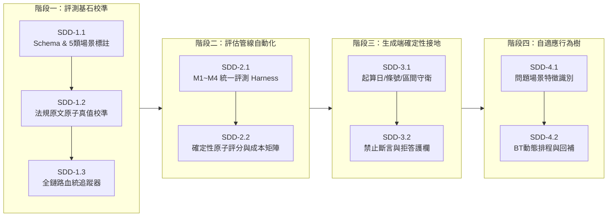

# 45_多階段SDD改善任務書：評測基準校準、確定性守衛與自適應行為樹

> 建立日期：2026-09-14  
> 依據來源：`docs/報告/42_全量重抽三階段方法比較與報告39七路評分報告.md`、`docs/報告/44_黃金版Benchmark與評測修正任務書.md`  
> 論文錨點：`docs/論文/03_系統設計與方法論.md` (§3.2 §d, §3.6 §d)、`05_實驗設計與評估.md` (§5.2, §5.5, §5.7)、`05_附錄A_測試題庫.md`  
> 核心目標：以原始法規原文為不可動搖之真值基準，量化四大代表方法（M1~M4）在三階段生命週期中的 Pareto 邊界，並落地確定性接地守衛與自適應檢索行為樹。

> ⚠️ **編號訂正（2026-09-14，入庫時補記）**：本文件原編號 44，建立時只存在主要 checkout 目錄、從未 `git commit`。與此同時另一 Claude session 已把 `docs/報告/44_黃金版Benchmark與評測修正任務書.md`（原編號 43，因與 `docs/報告/43_Fact-RAG語意排名健壯性設計報告.md` 衝突而改編號 44）commit 進 `origin/master`。為避免二次衝突，本文件改編號 45，文中對「報告43」的引用已同步訂正為「報告44」。**本文件描述的階段一至四工作是否已經完成，尚未經查證**——見入庫時的程式碼審查結果。

---

## 執行摘要與系統藍圖

全量重抽（KG#4 100% 完成）後的七路評測（報告 39/42）推翻了「單一架構全面碾壓」的直覺假設，確立了檢索技術的 **Pareto Trade-off（權衡邊界）**：
1. **Chunk-RAG（M1/M2）**：在單一條文、局部細節題具備極低延遲與上下文流暢性優勢；但在跨法規關聯、多條件跳躍時面臨嚴重的檢索漂移（Retrieval Drift）與來源條號斷裂。
2. **Knowledge Graph（M4/M3）**：在跨文件多跳、全域反向聚合題具備不可替代的拓撲路徑與條號級可審計血統；但承受較高的離線建圖算力與圖遍歷開銷。
3. **LLM 自我查驗失效**：純 LLM Judge 存在語意平滑化（如將「當月一日」視同「當日」）與內在幻覺放行問題，必須升級為確定性規則守衛。

本任務書拆解為四個漸進交付階段，嚴格實行「先校準真值基石 → 再自動化評測 → 落地生成端守衛 → 最終搭建自適應行為樹」之工程路徑。

---

## 階段一：評測基石校準（Benchmark & Ground Truth Hardening）

### SDD-1.1：測試題庫 Schema 升級與五大場景梯度標定
- **責任目標**：廢除舊版單一難度標籤，建立反映現實檢索特徵的 5 大梯度場景，並將題庫定義升級為 JSON Schema。
- **實體路徑**：
  - 規格文件：`docs/論文/05_附錄A_測試題庫.md`
  - 題庫檔案：`data/eval/test_cases.json`（或相應題庫載體）
- **具體任務**：
  1. 擴充題庫欄位定義：
     - `scenario_type`: `Type-A`（單文局部條文）、`Type-B`（密集數值/條件分支）、`Type-C`（跨文件多跳）、`Type-D`（全域聚合/計數）、`Type-E`（惡意干擾/非收錄法規）。
     - `atomic_gold_facts`: 包含 `exact_span`、`source_law`、`source_article`、`is_essential`。
  2. 將既有 30 題（報告 17/18/25/26 題組）完成 5 類場景分類，確保每類至少具備代表性案例。
- **驗收標準**：
  - `test_cases.json` 通過 Pydantic Schema 驗證。
  - 所有題目皆具備非空的 `scenario_type` 與合規結構。

### SDD-1.2：真值原子化校準（回歸原始法規 `original.md`）
- **責任目標**：徹底廢除「KG Fact 節點存在即真值」或「LLM 輸出共識為真值」之代理假設。所有金標答案必須 100% 錨定中華民國原始法規。
- **實體路徑**：
  - 原始法規庫：各法規原始檔案（例如 `original.md`）
  - 校準腳本：`scripts/eval/audit_ground_truth.py`
- **具體任務**：
  1. 針對目前 30 題中所有數值、期限、起算日（特別是 26-Q5、18-Q7 等爭議題目），逐一回歸原始條文逐字核對。
  2. 提取法規中之 `exact_span`（字串需能在原始條文中以 `indexOf >= 0` 完全比對）。
  3. 對於法規未明訂或需要跨條文推理之推論型答案，標註為 `inference_required: true` 並明列推論步驟。
  4. 標記未完成人工法規核對的題目，在正式計分時標註 `verification_status: unverified`，禁止直接作為研究結論引用。
- **驗收標準**：
  - 核心已核驗題目（Verified Subset）的 `exact_span` 字串 100% 存在於法規原文中。
  - 修正 26-Q5 標準答案之法律起算日為「自災害發生之當月一日起計算六個月」。

### SDD-1.3：全鏈路血統追蹤器（Lineage Tracer）
- **責任目標**：解決評測時「無法判定錯誤來自檢索、格式渲染還是模型生成」之黑箱問題。
- **實體路徑**：
  - 模組位置：`services/lineage_tracker.py`
  - 整合入口：`routers/agent.py::chat()` 與評測 Harness
- **具體任務**：
  1. 記錄 **檢索階段血統（Stage 1: Retrieval）**：
     - 召回之 Chunk ID / Fact ID、相似度分數、原始條文編號。
     - 判定 Gold Fact 是否出現在檢索取回集合中（Retrieval Recall）。
  2. 記錄 **提示詞組裝血統（Stage 2: Context Assembly）**：
     - 經過重排（Zigzag/RRF）、截斷（Truncate K）、自然語言化（Naturalize）後，該事實是否仍保留於送入 LLM 的最終 Prompt 中。
  3. 記錄 **生成輸出血統（Stage 3: Generation & Verification）**：
     - 生成草稿、接地核驗結果、確定性守衛判定、是否觸發重生成。
  4. 產出結構化 Lineage JSON，一鍵導出因果歸因報表。
- **驗收標準**：
  - 單次問答日誌能精確指示任一答案瑕疵的責任階段（如：`Failure Point: Stage 3 Generation (Fact present in context but hallucinated by LLM)`）。

---

## 階段二：評估管線自動化與指標矩陣（Multi-Metric Evaluation Engine）

### SDD-2.1：四大代表方法（M1~M4）與消融組評測 Harness
- **責任目標**：重構 `run_rq1_comparison.py`，收斂原本混亂的 7 條管線，將 4 大代表方法列為核心，其餘列為消融附錄。
- **架構對照**：
  - **M1 (B0)**：Naive Chunk RAG（Dense Embedding KNN 檢索 Chunk）
  - **M2 (B1)**：Hybrid Text RAG（BM25 + Dense RRF 融合 + CrossEncoder 重排）
  - **M3 (F)**：Fact Vector RAG（獨立事實節點語意檢索，無圖拓撲擴展）
  - **M4 (K)**：Full KG RAG（雙層 ConceptNode 路由 + SVO BFS 圖遍歷 + L0/L1 剪枝）
  - *消融組*：D（純 LLM parametric memory）、G（Gold In-Context Oracle）、K-2b（定向修訂版）
- **實體路徑**：
  - 核心腳本：`scripts/eval/run_rq1_comparison.py`
  - 服務封裝：`services/baseline_rag_service.py`、`services/svo_service.py`
- **具體任務**：
  1. 統一所有方法的 Generator、Prompt 模板格式與模型參數（固定 `qwen2.5:7b`，溫度 0）。
  2. 支援批次自動化執行、指定題目子集、指定重複次數（預設每題 ×3 次跑穩定性變異）。
  3. 自動記錄端到端延遲、Token 消耗量、Context 長度。
- **驗收標準**：
  - 執行 `python scripts/eval/run_rq1_comparison.py --arms M1,M2,M3,M4 --repeats 3` 能夠順暢跑完並輸出結構化結果 JSON。

### SDD-2.2：確定性原子評分器與全生命週期成本矩陣
- **責任目標**：以客觀程式邏輯取代人工肉眼評審與純 LLM 寬鬆評分，量化三階段成本。
- **實體路徑**：
  - 評分模組：`services/atomic_scorer.py`
  - 成本統計模組：`services/cost_analyzer.py`
- **具體任務**：
  1. **原子事實評分器**：
     - `Exact Span Matcher`：比對答案中是否逐字精確包含 gold fact 的關鍵片語。
     - `Numeric & Date Validator`：提取回答中之數值與日期，與真值執行嚴格數值相等性與日期相等性比對。
     - 計算 `Atomic Fact Accuracy` 與 `Atomic Fact Recall`。
  2. **三階段生命週期成本分析器**：
     - **建庫期**：計算 Ingestion 耗時（小時）、存儲膨脹比（Neo4j DB 大小 / 原始 Markdown 大小）、初始算力 Token 總量。
     - **更新期**：單份法規修訂時之 Delta Ingestion 延遲與節點重構成本。
     - **服務期**：線上查詢端到端延遲 p50/p95、TTFT、單題消耗 Token 數與平均查詢成本。
- **驗收標準**：
  - 評審報告自動產出如 05 章 §5.5 所規範之「成本–品質 Pareto 矩陣表」，不再只有單一文字評分。

---

## 階段三：生成端確定性接地防護（Deterministic Grounding Guard）

### SDD-3.1：起算日、法條條號與數值區間確定性守衛
- **責任目標**：將法律關鍵約束從 LLM Judge 抽離，建立不妥協的硬規則防線。
- **實體路徑**：
  - 守衛模組：`services/deterministic_guard_service.py`
  - 整合位置：`routers/agent.py::chat()` 串流與重生成判定處
- **具體任務**：
  1. **起算日錨點守衛（Inception Anchor Guard）**：
     - 正則抓取事實清單中之起算模式（如 `自.*?之(當月一日|次月首日|當日|次日)`）。
     - 若事實清單存在「當月一日」，而模型輸出縮寫或平滑化為「當日」，守衛強制攔截，判定為 `supported=False`。
  2. **法規條號守衛（Article Span Guard）**：
     - 抓取草稿中所有「XX法第YY條」字樣，比對本次檢索回傳之文檔與條目。未引證之條號強制判定未接地。
  3. **數值區間查表守衛（Interval Lookup Guard）**：
     - 整合並泛化既有「方案 E」（`interval_lookup_service.py`），支援雙邊界 `[lower, upper)` 與開放邊界比對。
- **驗收標準**：
  - 26-Q5 在啟用守衛後，若模型產出「當日」，自動被守衛攔截並觸發 Factored 限制性重生成，直到輸出精確「當月一日」或拒答。
  - 單元測試覆蓋率 100%（針對時間、條號、數值邊界的各類合法與違規句式）。

### SDD-3.2：禁止斷言與拒答護欄（Prohibited Assertion Filter）
- **責任目標**：避免模型在非收錄法規或證據不足時憑空猜測，堅定貫徹「寧願拒答，不願胡謅」。
- **實體路徑**：
  - 模組位置：`services/refusal_guard.py`
- **具體任務**：
  1. 定義不可斷言特徵庫（如：未收錄於當前知識圖譜之法律專有名詞、惡意注入的虛構法條）。
  2. 當檢索置信度過低（Recall@K=0 或 RRF 分數低於門檻）時，守衛直接終止生成，覆寫為權威法定拒答模板：
     `「依據目前收錄之勞動法規資料庫，並未記載有關【XXX】之規定，無法提供確定答覆。」`
- **驗收標準**：
  - Type-E Canary 題目達到 100% 精確拒答率，且不消耗長文本生成 Token。

---

## 階段四：自適應檢索行為樹（Adaptive Retrieval Behavior Tree）

### SDD-4.1：問題場景特徵識別與置信度探針
- **責任目標**：在查詢入口以極低延遲（<20ms）分析使用者提問特徵，為行為樹分支提供決策訊號。
- **實體路徑**：
  - 模組位置：`services/query_classifier.py`
- **具體任務**：
  1. 規則特徵抽取：
     - 提問是否提及特定單一法規名稱（如「勞動基準法」）？
     - 是否包含具體數值查詢（如「幾天」、「多少元」、「百分之幾」）？
     - 是否出現跨領域實體或全域聚合關鍵詞（如「所有」、「統計」、「哪些法令同時規定」）？
  2. 置信度探針（Confidence Probe）：
     - 結合 ConceptNode KNN 與 BM25 快速粗篩，計算問題與現有庫存的交集度。
- **驗收標準**：
  - 能夠準確將問題標記為 Type-A/B/C/D/E，分類耗時小於 30ms。

### SDD-4.2：行為樹動態排程與自適應回補（Adaptive Fallback）
- **責任目標**：實作 03 章 §3.2 §d 所定義之自適應行為樹，達成全場景之 Pareto 最優。
- **實體路徑**：
  - 行為樹核心：`services/adaptive_retrieval_service.py`
  - API 路由整合：`routers/agent.py`
- **具體任務**：
  1. **Behavior Tree 節點編程**：
     - `GuardNode`：檢查 Type-E，符合即直接拒答。
     - `TextBranch`：針對 Type-A/B，調度 M2 Hybrid Text 檢索。若 M2 檢索置信度足夠，直接送生成。
     - `GraphBranch`：針對 Type-C/D，調度 M4 Full KG 檢索，執行實體對齊與 BFS 拓撲擴展。
     - `FallbackAction`：當 TextBranch 的檢索結果未達置信度門檻（如未能匹配到條文），自動升級至 GraphBranch 啟動圖遍歷補足關聯事實。
  2. **動態路徑日誌**：每次問答記錄其走訪之 BT 節點軌跡，供審計與統計分析。
- **驗收標準**：
  - 端到端問答在 Type-A 題目上展現 M2 等級之低延遲（<2s），在 Type-C 題目上展現 M4 等級之多跳高準確率，系統整體進入 Pareto 最佳解區間。

---

## 階段里程碑與交付物檢核表

| 階段代號 | 階段名稱 | 核心交付物 | 驗收指令 / 檢驗方式 | 預估工期 |
|---|---|---|---|---|
| **Phase 1** | 評測基石校準 | `test_cases.json` `services/lineage_tracker.py` | 執行題庫 schema 驗證，確認 exact_span 100% 存在於法規 | 2 天 |
| **Phase 2** | 評估管線自動化 | `run_rq1_comparison.py` `services/atomic_scorer.py` `services/cost_analyzer.py` | 一鍵跑完 M1~M4 對照，自動產出三階段成本與原子準確率報表 | 3 天 |
| **Phase 3** | 生成端確定性接地 | `services/deterministic_guard_service.py` `services/refusal_guard.py` | 單元測試全數通過；26-Q5 成功修正「當月一日」；Type-E 100% 拒答 | 2 天 |
| **Phase 4** | 自適應行為樹 | `services/adaptive_retrieval_service.py` 更新 `/agent/chat` 路由 | 問答日誌顯示 BT 節點正確分流；線上延遲與準確率達 Pareto 最優 | 3 天 |

---

## 結論與動工準備

本任務書所訂定之四個階段，徹底將學術論文承諾（03 章、05 章）轉化為嚴謹的工程代碼架構。動工時遵循「先驗證後開發、先單元後端到端」之開發守則，確保每一步修正皆有客觀數據支撐，杜絕主觀臆測。
