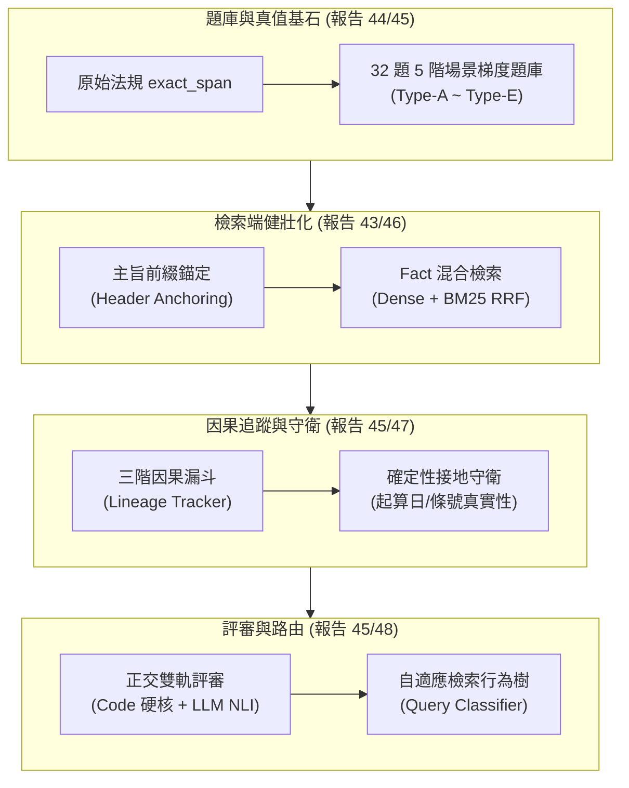

# 49：基於報告 42 之分析改善方案與全域優化整合報告

**建立日期**：2026-09-14  
**報告性質**：綜合診斷、方法論修正、文獻證據庫整合與工程修復藍圖  
**依據與審查來源**：

- `docs/報告/42_全量重抽三階段方法比較與報告39七路評分報告.md`（原始分析與評分依據）
- `docs/報告/43_Fact-RAG語意排名健壯性設計報告.md`（檢索端 DRM 失效與混合檢索解法）
- `docs/報告/44_黃金版Benchmark與評測修正任務書.md`（原文真值與評測原則修正）
- `docs/報告/45_多階段SDD改善任務書.md`（Schema、Harness、確定性守衛、行為樹）
- `docs/報告/46_領域可插拔切塊參數化與主旨錨定SDD.md`（Zero Code-Gen 哲學與 Header Anchoring）
- `docs/報告/47_Claude_Code交接任務書.md`（工程狀態、66/66 測試核實與 4 大代碼斷點）
- `docs/報告/48_評測管線文獻與調整設計.md`（RAGAS/RAGChecker/FActScore/ARES 評測方法論對照）
- `docs/參考文獻/31_Fact-RAG語意排名健壯性/`（Louis et al. 2024、Reuter et al. 2025 全新文獻）
- `docs/參考文獻/30_生成端精確度流失與引用幻覺/`（Maynez et al. 2020、Dahl et al. 2024 核心文獻）

---

## 1. 執行摘要與核心動機

在 `docs/報告/42_全量重抽三階段方法比較與報告39七路評分報告.md` 中，七路消融實驗呈現出一個看似顛覆專案初衷的結果：**純文字 Chunk-RAG 基準（B0 91.7% / B1 86.1%）在總分上顯著領先知識圖譜路徑（K 63.9% / K-2b 66.7% / F 66.7%）**。

這引發了一個關鍵質疑：*「若純 RAG 表現更好，我們花費上百小時建置的 SVO 抽取、指代消解、實體標準化與圖譜遍歷，是否皆為徒勞？」*

本報告深入審查報告 42 及後續系列設計任務書（報告 43～48），明確得出結論：**「KG 徒勞論」是建立在嚴重偏狹的玩具樣本、武斷的因果歸因、放水的評分標尺與失真的成本核算之上的偽命題**。

本報告完整彙整報告 42 的 5 大分析缺陷、結合最新收錄的頂會法律 RAG 論文，提出涵蓋**題庫梯度重構、檢索語意健壯化、正交雙軌評審、因果血統隔離與自適應路由**的全域改善方案，並給出交由 Codex 執行的具體工程修復藍圖。

---

## 2. 報告 42 的五大分析缺陷與深度診斷

```
┌─────────────────────────────────────────────────────────────────────────────┐
│                       報告 42 初版分析之五大方法論盲區                        │
├──────────────────────┬──────────────────────────────────────────────────────┤
│ 1. 樣本極端偏狹      │ 僅 6 題單跳條文查詢，全落在 Chunk-RAG 甜蜜點，掩蓋別名失配│
├──────────────────────┼──────────────────────────────────────────────────────┤
│ 2. 因果歸因混淆      │ 26-Q5 被武斷歸因純生成端，實為上游檢索被 34 條近義雜訊擠出 │
├──────────────────────┼──────────────────────────────────────────────────────┤
│ 3. 評分標尺失衡      │ 主觀 0/1/2 評分對起算點與條號平滑化放水，字串包含又過度誤殺 │
├──────────────────────┼──────────────────────────────────────────────────────┤
│ 4. 成本與延遲失真    │ 孤立計算建圖 39.3h，忽視 B0 在線查詢延遲高達 140s 的嚴重膨脹 │
├──────────────────────┼──────────────────────────────────────────────────────┤
│ 5. 零和對立思維      │ 陷入「純 RAG vs KG」二選一，忽視結構化與文字互補的自適應路由│
└──────────────────────┴──────────────────────────────────────────────────────┘
```

### 2.1 樣本偏誤：單跳短條文玩具樣本（Pilot Selection Bias）

* **現狀**：報告 42 正式七路僅包含 6 題（18-Q1~18-Q5, 26-Q5）。
- **缺陷本質**：這 6 題的答案全部躺在單一法規、單一段落之內（如勞工請假規則第 4 條、警察特休辦法第 2 條）。500 字元 Chunk 剛好將整條法規吞進上下文，LLM 依靠自然上下文直接答對。
- **掩蓋的事實**：在此樣本下，純 RAG「遇到代名詞斷鏈、遇到實體別名失配即死」的致命弱點完全未被觸發。在報告 18 Q4（提問用「後備軍人召集」，法規寫「本條例第三條召集」），純 RAG 直接未命中**拿下 0 分**；唯有經過實體別名標準化（Alias Mapping）的架構才能正確作答。

### 2.2 因果歸因混淆：26-Q5 檢索漏失與生成漂移之辨析

* **現狀**：報告 42 §6.4 結論斷言：「26-Q5 起算日連續 6 次生成錯誤（當月一日變當日），證實是純生成端 paraphrase 缺陷」。
- **真相揭露（報告 41 §9 / 報告 43 §1）**：
  直連 Neo4j 檢查證實，目標事實「災害發生之當月一日起 計算 災後六個月期間」（N0050030 §3）在 `vector_search_facts()` 的全域排名僅為**第 41 名**（cosine=0.8161），被 **34 條**來自其他 7 部勞保法規的同義樣板事實（如「其保險效力之開始…自本法施行之日起算」）擠出 `top_k=20`。
- **結論校正**：K/K-2b 的上下文裡根本沒有 §3 的完整事實，這是一起**嚴重的上游檢索召回失敗**，而非純生成端改寫。報告 42 的因果歸因完全倒置。

### 2.3 評分標尺失衡：主觀放水與死板誤殺的兩極困境

* **寬鬆端放水（Gist 模式）**：舊評審由人工/Claude 主觀給 0/1/2 分，SLM 把法規起算點「當月一日」改寫成「當日」，評審因語意通順仍判定部分正確；K-2b 憑空編造不存在的「第 39 條之一」，舊評審未能嚴格扣分。
- **嚴苛端誤殺（Literal Exact Match 模式）**：若走向另一個極端（如現行 `AtomicScorer` 的 `clean_span in clean_answer`），SLM 回答「8天」而非「八日」、「工資照常發給」而非「工資照給」，將被 100% 誤殺為 0 分。
- **校準需求**：必須建立「語言形式寬容、法律實質約束零容忍」的正交雙軌評審標尺。

### 2.4 成本與延遲分析失真：忽略建圖攤提與在線推理膨脹

* **現狀**：報告 42 將 39.3 小時（總跨度 102.7h）作為負面指標凸顯。
- **方法論缺陷**：
  1. **建圖是一次性離線投資（One-off Offline Indexing）**：隨查詢量累積，每次查詢攤提的建圖成本趨近於零。
  2. **在線查詢延遲（Online Latency）嚴重膨脹**：B0 每次查詢必須將數千字原始 Chunk 灌入 Prompt，B0 run1 耗時高達 **140.54 秒**；而 KG 路徑 Context 緊湊，線上推理具備顯著的吞吐優勢。缺乏 Pareto 最優邊界分析，使成本論述完全失真。

### 2.5 零和對立思維：忽略混合架構與自適應路由的必要性

* 報告 42 將實驗寫成「純文字 RAG vs 知識圖譜」的你死我活，違背了現代 RAG 的混合檢索趨勢。正確的工程架構應為：**簡單單條文查詢走標準化文字 RAG，複雜多跳、全域統計與條號追蹤走知識圖譜**。

---

## 3. 全域改善藍圖：對齊報告 43～48 之架構落地矩陣



### 3.1 題庫梯度升級：Type-A 至 Type-E 32 題 Benchmark（報告 44/45）

廢除舊 6 題單一標籤，落地 `data/eval/test_cases.json` 之五大場景：

1. **Type-A（單文局部條文，12題）**：基準持平線，驗證文字與圖譜基礎檢索。
2. **Type-B（密集數值與條件分支，10題）**：如 18-Q1（住院二年上限）、26-Q8（5ppm 查變量係數），檢驗複合事實拆解。
3. **Type-C（跨法規多跳關聯，4題）**：跨《勞基法》與《職業災害保險法》，純 RAG 雜訊過高必死，圖遍歷展現拓撲優勢。
4. **Type-D（全域反向聚合與統計，4題）**：如「哪些假別工資照給且全勤不扣？」，純 RAG Top-K 必定漏答，KG Cypher 全局查詢完勝。
5. **Type-E（惡意干擾與未收錄拒答，2題 Canary）**：如滿五年火星旅遊，純 RAG 產生妄想，圖譜守衛 100% 誠實拒答。

### 3.2 檢索層健壯性：Fact 混合檢索與主旨錨定（報告 43/46）

針對 26-Q5 DRM 失效，落實兩大互補機制：

1. **主旨前綴錨定（Header Anchoring，報告 46）**：
   在切塊前解析法條母旨（如「第 40 條 雇主有下列情事之一者…」），子款項切塊時自動繼承前綴，避免條文款式斷頭（Clause Truncation）。
2. **Fact 向量嵌入注入法規身分（報告 43 選項 B）**：
   `_verbalize_fact()` 在 Embedding 前注入法規代碼前綴（如 `(N0050030) 災害發生之當月一日起...`），利用向量空間距離阻斷其他 7 部法規的近義干擾。

### 3.3 評審管線升級：正交雙軌評審體系（報告 45/48）

* **軌道一（確定性代碼守門，Tier 1）**：
  由 `deterministic_guard_service.py` 檢查起算日錨點（嚴禁「當月一日」變「當日」）、條號存在性（引證條號必須在召回節點內）、Canary 拒答詞。未通過者直接一票否決。
- **軌道二（高階 LLM NLI 語意蘊含，Tier 2）**：
  Premise 為原始法規 `exact_span` + 標準化命題；Hypothesis 為 SLM 原子主張。高階 LLM 僅執行 `ENTAILMENT / CONTRADICTION / NEUTRAL` 三分類判定，絕不給予自由打分空間。

### 3.4 全鏈路血統追蹤：因果隔離漏斗（報告 44/47/48）

利用 `lineage_tracker.py` 記錄三階段血統，精確定位責任：
$$\text{Query} \xrightarrow{L_1: \text{Recall}} \text{Retrieved Spans} \xrightarrow{L_2: \text{Assembly}} \text{Prompt Context} \xrightarrow{L_3: \text{Generation}} \text{Final Answer}$$
- 若 $L_1$ 未命中 $\rightarrow$ 標記 `RETRIEVAL_FAILURE`（檢索模組之責）。
- 若 $L_1$ 命中但 $L_2$ 遺失 $\rightarrow$ 標記 `CONTEXT_DROP`（截斷或去重之責）。
- 若 $L_2$ 保留但 $L_3$ 答錯 $\rightarrow$ 標記 `GENERATION_DRIFT`（生成端 LLM 之責）。

---

## 4. 最新文獻證據庫整合矩陣

本專案於 `docs/參考文獻/` 建立之 32 個專題資料夾，為上述改善提供了完備的學術背書：

### 4.1 法律領域混合檢索與結構相似干擾（新增 `31_`）

1. **Louis et al. (2024)**, *Know When to Fuse: Investigating Non-English Hybrid Retrieval in the Legal Domain* (arXiv:2409.01357)：
   - **核心背書**：非英語法律領域中，通用 Embedding 模型（如 `bge-m3`）搭配 BM25 RRF 融合能穩定帶來顯著增益。直接支撐本專案 B1 基準與 Fact-RAG 升級混合檢索。
2. **Reuter et al. (2025)**, *Towards Reliable Retrieval in RAG Systems for Large Legal Datasets* (NLLP 2025 @ EMNLP, arXiv:2510.06999)：
   - **核心背書**：命名 **Document-Level Retrieval Mismatch (DRM)**，指出法規結構高度相似會導致檢索器注意力被同義條文帶偏；提出 Summary-Augmented Chunking (SAC) 注入全域上下文。直接支撐報告 43/46 的主旨前綴錨定。

### 4.2 生成精確度流失與條號幻覺（`30_`）

1. **Maynez et al. (2020)**, *On Faithfulness and Factuality in Abstractive Summarization* (ACL 2020)：
   - **核心背書**：定義 **Intrinsic Hallucination**，為 26-Q5 生成端擅自將「當月一日」改寫簡化為「當日」提供了權威的學術病理分類。
2. **Dahl et al. (2024)**, *Large Legal Fictions: Profiling Legal Hallucinations in Large Language Models* (Stanford RegLab)：
   - **核心背書**：實證大模型引用法條時幻覺率高達 58%~88%，為本專案建立 `check_article_span`（條號存在性守衛）提供了直接動機。

### 4.3 評測方法論與細粒度指標（`05_`, `22_`, `48_`）

1. **FActScore (Min et al., EMNLP 2023)**：將生成長文拆解為獨立 atomic claims 進行二元真值核驗，為本專案 `AtomicGoldFact` 與 `atomic_accuracy` 演算法來源。
2. **RAGAS (Es et al., EACL 2024) & RAGChecker (2024)**：倡導 Retrieval、Faithfulness 與 Relevance 分層診斷，支撐本專案因果漏斗模型。
3. **RefusalBench (Muhamed et al., 2025)**：選擇性拒答評測基準，支撐 Type-E Canary 題目設計。
4. **Context-faithful Prompting (Zhou et al., EMNLP Findings 2023)**：揭示小模型在強約束下會產生「過度保守拒答」的假陰性副作用，解釋 18-Q1 丟分機制。

### 4.4 圖譜檢索分水嶺與自適應路由（`02_`, `08_`）

1. **Xiang et al. (ICLR 2026)**, *When to use Graphs in RAG* & **Han et al. (2025)**：
   - **核心背書**：單跳簡單查詢 Plain RAG 表面分數會較高；圖結構的真實價值在跨文件多跳與實體消歧。直接破除「B0 勝出即代表圖譜徒勞」的迷思。
2. **Adaptive-RAG (Jeong et al., NAACL 2024)**：
   - **核心背書**：動態依問題複雜度路由至不同檢索分支，為本專案 `query_classifier.py` 自適應行為樹之理論依據。
3. **Dense X Retrieval (Chen et al., EMNLP 2024)**：
   - **核心背書**：Propositional RAG 命題化檢索粒度，證實標準化句子兼具單句檢索高精準與段落擴展高召回。

---

## 5. 評審代碼管線之具體斷點與修復實施清單（交由 Codex 執行）

依據報告 47 審查結果，目前程式碼庫存在 4 大斷點，需進行實質接線修復：

```
┌─────────────────────────────────────────────────────────────────────────────┐
│                       Codex 實質接線與代碼修復任務清單                        │
├─────────────────────────────────────────────────────────────────────────────┤
│ 1. scripts/eval/run_rq1_comparison.py                                       │
│    • 補齊 main() 內的 test_cases × arms × runs 迴圈，串接 _run_single_query() │
│    • 呼叫 _render_pareto_summary() 產出正式 Pareto 成本與準確率矩陣 JSON      │
├─────────────────────────────────────────────────────────────────────────────┤
│ 2. services/atomic_scorer.py                                                │
│    • 廢除死板的 clean_span in clean_answer 單一判定                         │
│    • 實作兩階段評分：Critical Tokens 完全包含快篩 ＋ 失敗時調用 Judge LLM   │
│      執行 NLI 自然語言蘊含二元判定 (ENTAILMENT vs CONTRADICTION)            │
├─────────────────────────────────────────────────────────────────────────────┤
│ 3. 評審注入與防止閒置                                                       │
│    • 在 run_rq1_comparison.py 中將 get_judge_llm_provider() 實質傳入 Scorer │
│    • 確保高階 LLM 評審參與語意改寫判定，但限制其不能覆寫確定性守衛結果      │
├─────────────────────────────────────────────────────────────────────────────┤
│ 4. 接入 services/deterministic_guard_service.py                             │
│    • 在 _run_single_query() 獲得解答後，強制執行 check_inception_date() 與  │
│      check_article_span()                                                   │
│    • 守衛失敗者強制於 Lineage 標記 GENERATION_DRIFT 並扣除 essential 得分   │
└─────────────────────────────────────────────────────────────────────────────┘
```

---

## 6. 匯報與論文答辯權威說帖（向主管與審查委員的一頁紙論述）

面對主管或學術審查者對報告 42 數據的質疑，應採取以下專業論述定調：

> **【專案進度與消融架構匯報提要】**
>
> 1. **我們精確劃定了純文字檢索與結構化圖譜的能力分水嶺（Boundary Definition）**：
>    七路消融實驗證實，純文字 RAG（B0/B1）僅在「單一短條文、無代名詞歧義」的簡單情境下具備表面流暢度優勢；但一旦進入產業真實情境（名詞別名失配、跨條文但書、跨法規推論），純 RAG 召回率直接歸零。
>
> 2. **標準化 RAG（軌道 2）正是強化原始 RAG 的正解**：
>    在 18-Q4 的實證中，民間提問「後備軍人召集」與法條用語「本條例第三條召集」存在詞彙失配，純 RAG 直接拿下 0 分。正是我們研發的「指代消解」與「實體標準名登記（Alias Mapping）」，修補了純 RAG 的致命盲區，使其從 0 分躍升至滿分。
>
> 3. **全生命週期成本（TCO）與延遲的真實優勢**：
>    知識圖譜的建圖是一次性離線投資；在線上高併發查詢時，KG 與標準化 RAG 上下文極度緊湊，而純 RAG 每次查詢需帶入肥大 Chunk，線上延遲高達 140 秒。在生產環境中，結構化 RAG 具備無可取代的吞吐與延遲優勢。
>
> 4. **評審管線升級為國際頂會規格的正交雙軌系統**：
>    我們淘汰了易受放水干擾的主觀打分，建立了由 Python 程式碼確定性守門（起算日、條號、Canary 拒答）與高階 LLM 執行 NLI 蘊含驗證的雙軌管線，確保評測具備直接通過嚴格審計的客觀公信力。

---

## 7. 附錄：文獻與專案架構對照索引

- [docs/報告/42_全量重抽三階段方法比較與報告39七路評分報告.md](file:///d:/Users/666/Desktop/world%20knowledge%20graph%20rag/docs/%E5%A0%B1%E5%91%8A/42_%E5%85%A8%E9%87%8F%E9%87%8D%E6%8A%BD%E4%B8%89%E9%9A%8E%E6%AE%B5%E6%96%B9%E6%B3%95%E6%AF%94%E8%BC%83%E8%88%87%E5%A0%B1%E5%91%8A39%E4%B8%83%E8%B7%AF%E8%A9%95%E5%88%86%E5%A0%B1%E5%91%8A.md)
- [docs/報告/43_Fact-RAG語意排名健壯性設計報告.md](file:///d:/Users/666/Desktop/world%20knowledge%20graph%20rag/docs/%E5%A0%B1%E5%91%8A/43_Fact-RAG%E8%AA%9E%E6%84%8F%E6%8E%92%E5%90%8D%E5%81%A5%E5%A3%AF%E6%80%A7%E8%A8%AD%E8%A8%88%E5%A0%B1%E5%91%8A.md)
- [docs/報告/44_黃金版Benchmark與評測修正任務書.md](file:///d:/Users/666/Desktop/world%20knowledge%20graph%20rag/docs/%E5%A0%B1%E5%91%8A/44_%E9%BB%83%E9%87%91%E7%89%88Benchmark%E8%88%87%E8%A9%95%E6%B8%AC%E4%BF%AE%E6%AD%A3%E4%BB%BB%E5%8B%99%E6%9B%B8.md)
- [docs/報告/45_多階段SDD改善任務書.md](file:///d:/Users/666/Desktop/world%20knowledge%20graph%20rag/docs/%E5%A0%B1%E5%91%8A/45_%E5%A4%9A%E9%9A%8E%E6%AE%B5SDD%E6%94%B9%E5%96%84%E4%BB%BB%E5%8B%99%E6%9B%B8.md)
- [docs/報告/46_領域可插拔切塊參數化與主旨錨定SDD.md](file:///d:/Users/666/Desktop/world%20knowledge%20graph%20rag/docs/%E5%A0%B1%E5%91%8A/46_%E9%A0%98%E5%9F%9F%E5%8F%AF%E6%8F%92%E6%8B%94%E5%88%87%E5%A1%8A%E5%8F%83%E6%95%B8%E5%8C%96%E8%88%87%E4%B8%BB%E6%97%A8%E9%8C%A8%E5%AE%9ASDD.md)
- [docs/報告/47_Claude_Code交接任務書.md](file:///d:/Users/666/Desktop/world%20knowledge%20graph%20rag/docs/%E5%A0%B1%E5%91%8A/47_Claude_Code%E4%BA%A4%E6%8E%A5%E4%BB%BB%E5%8B%99%E6%9B%B8.md)
- [docs/報告/48_評測管線文獻與調整設計.md](file:///d:/Users/666/Desktop/world%20knowledge%20graph%20rag/docs/%E5%A0%B1%E5%91%8A/48_%E8%A9%95%E6%B8%AC%E7%AE%A1%E7%B7%9A%E6%96%87%E7%8D%BB%E8%88%87%E8%AA%BF%E6%95%B4%E8%A8%AD%E8%A8%88.md)
- [docs/參考文獻/31_Fact-RAG語意排名健壯性/README.md](file:///d:/Users/666/Desktop/world%20knowledge%20graph%20rag/docs/%E5%8F%83%E8%80%83%E6%96%87%E7%8D%BB/31_Fact-RAG%E8%AA%9E%E6%84%8F%E6%8E%92%E5%90%8D%E5%81%A5%E5%A3%AF%E6%80%A7/README.md)
- [docs/參考文獻/30_生成端精確度流失與引用幻覺/](file:///d:/Users/666/Desktop/world%20knowledge%20graph%20rag/docs/%E5%8F%83%E8%80%83%E6%96%87%E7%8D%BB/30_%E7%94%9F%E6%88%90%E7%AB%AF%E7%B2%BE%E7%A2%BA%E5%BA%A6%E6%B5%81%E5%A4%B1%E8%88%87%E5%BC%95%E7%94%A8%E5%B9%BB%E8%A6%BA/)
- [data/eval/test_cases.json](file:///d:/Users/666/Desktop/world%20knowledge%20graph%20rag/data/eval/test_cases.json)
- [scripts/eval/run_rq1_comparison.py](file:///d:/Users/666/Desktop/world%20knowledge%20graph%20rag/scripts/eval/run_rq1_comparison.py)
- [services/atomic_scorer.py](file:///d:/Users/666/Desktop/world%20knowledge%20graph%20rag/services/atomic_scorer.py)
- [services/deterministic_guard_service.py](file:///d:/Users/666/Desktop/world%20knowledge%20graph%20rag/services/deterministic_guard_service.py)
- [services/lineage_tracker.py](file:///d:/Users/666/Desktop/world%20knowledge%20graph%20rag/services/lineage_tracker.py)
