# 報告95：專案節點流程總覽與設計說明

> **日期**：2026-09-28
> **基準 commit**：`9f66270`（`worktree-sdd-retrieval-comparison`）
> **定位**：以「節點」為單位，說明整個專案目前**實際在跑**的流程，以及每個節點的設計原理與目的。供兩種用途：
>
> 1. **介紹專案**：§1 一頁版＋§2 大節點地圖，可以直接拿來簡報。
> 2. **重構前的現況盤點**：每張節點卡都附「程式位置」與「重構觀察」，§13 彙整成重構建議。
>
> **判定原則**：一律以程式碼為準，不以論文章節或舊報告的描述為準。與舊文件不一致之處在各節點卡中標註。
> 本文件不取代 [HANDOVER.md](../../HANDOVER.md)（進度權威來源）與論文 [00_研究追溯對映表](../論文/00_研究追溯對映表.md)（文獻↔方法↔程式追溯），而是把兩者之間缺少的「流程視角」補上。

---

## 0. 閱讀指引：節點的表示法

### 0.1 三層節點

| 層級 | 名稱 | 意義 | 本文編號 |
|---|---|---|---|
| L0 | **大節點** | 一個可以獨立說清楚「負責什麼」的處理階段，未來重構時應對應一個模組邊界 | `N1`～`N10`，另有橫切節點 `X1`～`X3` |
| L1 | **內部節點** | 大節點內部的處理步驟，每個步驟有明確的輸入／輸出 | `N3.1`、`N3.2`…… |
| L2 | 函式 | 實作 L1 節點的程式入口 | 寫在節點卡的「程式位置」欄 |

### 0.2 節點卡欄位

每個大節點都附一張節點卡表格，欄位固定：

- **目的**：這個節點要解決的問題（為什麼存在）。
- **設計原理**：為什麼這樣設計，包括它避開的失敗模式、依據的報告或文獻。
- **輸入 → 輸出**：資料契約。
- **程式位置**：目前實作所在（`檔案::函式`）。
- **狀態**：`運作中`／`opt-in 預設關`／`prototype 未接線`／`stub 未實作`。
- **重構觀察**：目前邊界不清或位置錯置之處（只是觀察，不是已決定的方案）。

### 0.3 圖例

Mermaid 圖中：實線框＝運作中；**虛線框＝未接線或 stub**；灰底＝opt-in 預設關閉。

---

## 1. 專案介紹（一頁版）

### 1.1 專案是什麼

**World Knowledge Graph RAG** 是一個把文件轉成 SVO（主詞–動詞–受詞）知識圖譜、再以圖譜為基礎回答問題的 RAG 平台。它同時承擔兩個角色：

- **論文實作載體**：研究「知識圖譜在什麼條件下能改善 RAG 問答」。
- **產品平台**：網頁＋軟體形態、可支撐產品線的問答系統（後端 FastAPI＋Neo4j＋Ollama 等 LLM provider，前端 Vanilla JS）。

目前的主要資料集是**台灣勞動法規**（KG#4，64 份文件、3,307 個抽取 chunk、Fact 約 16,826 筆、Entity 約 12,296 個）。

### 1.2 研究問題與目前進度

| RQ | 問題 | 現況 |
|---|---|---|
| **RQ1** | KG 檢索與純向量 chunk-RAG 的比較 | **唯一完成完整比較實驗閉環的研究問題**（見 §1.3） |
| RQ2 | 多知識庫路由（ConceptNode） | 向量索引基礎已有；`route_kgs()` 是 stub，未接線 |
| RQ3 | 自我精煉檢索是否降低幻覺 | 生成端核對＋一次重生成已實作；正式多輪精煉迴圈未做 |
| RQ4a | 受控關係詞彙標準化 | 機制已實作（含 per-KG 擴充）；正式消融實驗未做 |
| RQ4b | 實體指代與別名對齊 | 部分實作（守衛可配置）；NER 上游與端到端實驗未做 |
| RQ5 | 事實時序 | 設計預留，核心功能未做 |
| RQ6 | Hub Node 向量引導剪枝 | L0/L1 已實作；L2 prototype 未接線 |

### 1.3 RQ1 目前的結論（誠實版）

- **KG（K 臂）vs chunk-RAG（B1）**，同一批 42 題、凍結條件：
  - 原評分器：K 13/42、B1 21/42，KG 落後 8 題（exact McNemar `p=0.021`）。
  - 規則 R 敏感度分析：16/42 對 22/42，落後 6 題（`p=0.109`，不再顯著）。
  - 報告88 人工裁決後，落差校正為 −7 題。
  - **方向上沒有顯示 KG 優於 chunk-RAG。**
- **B2（Agentic RAG 強基準）**，n=41：B0 0.649、B1 0.693、B2 0.681。B2 明顯優於 B0、與 B1 相近，代價是約 3 倍 LLM 呼叫；維持「optional」定位。
- **論文定位**：不是證明「KG 比較好」，而是**診斷 KG 在什麼條件下有／無增益**（報告61）。KG 的角色已收斂為「上下文精煉與路由者」，而不是推理鏈建構者（報告57 §7）。

### 1.4 一句話講完整個系統

> 文件 → 暫存與分類 → 切塊與標準化 → LLM 抽出 SVO 三元組 → 實體對齊後寫進 Neo4j（邊＋自然語句＋Fact 向量節點）→ 問答時用 Fact 向量檢索＋BFS 圖遍歷取回事實 → 排列成事實清單 → LLM 生成 → 接地核對，不通過就重生成 → 串流回傳；另有一條評測 harness 用同一個生成堆疊，比較 KG 與 chunk-RAG。

---

## 2. L0 大節點地圖

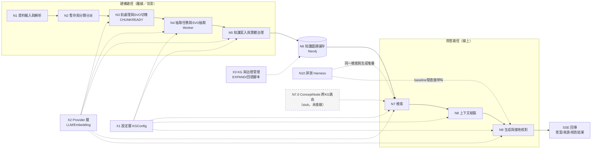

| 大節點 | 一句話目的 | 主要程式 |
|---|---|---|
| N1 資料輸入與解析 | 把各種格式的來源變成純文字 | `parser/`、`services/ingestion_service.py`、`routers/documents.py` |
| N2 暫存與分類分派 | 決定文件屬於哪個 KG | `services/classify_service.py`、`cluster_service.py`、`routers/staging.py` |
| N3 前處理與SVO切塊 | 把原文變成適合抽取的 chunk | `services/svo_preprocessing_service.py`、`svo_chunking.py`、`svo_service.py::trigger_extraction` |
| N4 抽取任務與SVO抽取 | 可恢復地把每個 chunk 抽成三元組 | `services/task_queue_service.py`、`extraction_worker.py`、`svo_service.py::extract_*` |
| N5 知識寫入與實體治理 | 對齊實體、去重、寫圖、產生自然語句與 Fact 向量 | `services/svo_service.py::merge_*` |
| N6 知識圖譜儲存 | 定義圖的資料模型與索引 | Neo4j、`repositories/` |
| N7 檢索 | 從圖中取回和問題相關的事實 | `routers/agent.py::chat()` 前段、`svo_service.py::vector_search_facts/bfs_query` |
| N8 上下文組裝 | 把事實排成 LLM 容易用的清單 | `routers/agent.py::_merge_fact_lines/_arrange_fact_lines/_build_prompt` |
| N9 生成與接地核對 | 生成答案並保證答案有依據 | `routers/agent.py::_generate_from_context_lines`、`services/verification_service.py` |
| N10 評測 Harness | 在固定條件下比較各檢索方法 | `scripts/eval/run_rq1_comparison.py`、`services/atomic_scorer.py`、`lineage_tracker.py` |
| X1 設定層 | 讓門檻與領域規則可以 per-KG 覆寫 | `core/kg_config/` |
| X2 Provider 層 | 抽換 LLM／embedding 供應商 | `core/providers/` |
| X3 KG 管理與治理 | KG 生命週期、未知關係型別仲裁、資料回填 | `routers/knowledge_graph.py`、`expand_*`、`scripts/kg/` |

---

## 3. N1 資料輸入與解析

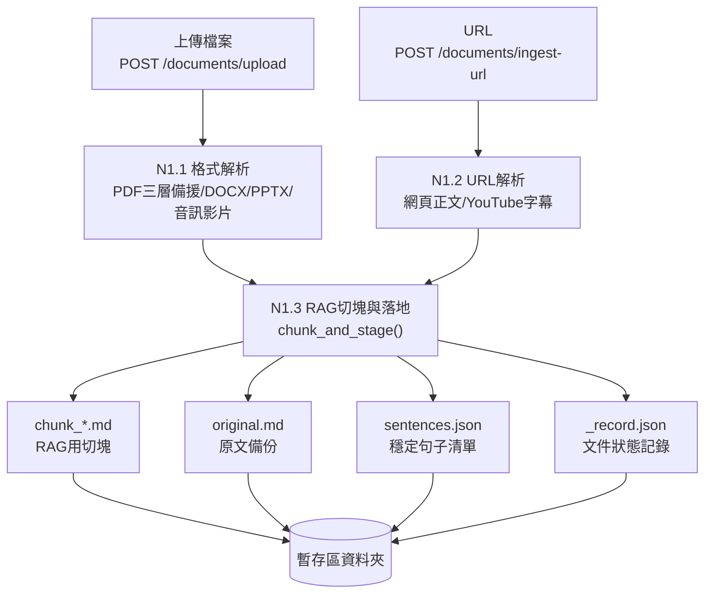

| 節點 | 目的 | 設計原理 | 輸入 → 輸出 | 程式位置 | 狀態 |
|---|---|---|---|---|---|
| N1.1 格式解析 | 各種檔案 → 純文字 | CPU-bound 解析放進 thread pool，避免阻塞 FastAPI 事件迴圈；PDF 三層備援處理掃描檔 | 檔案 → 純文字 | `ingestion_service.py::parse_document`、`parser/core.py::DocumentParser` | 運作中 |
| N1.2 URL 解析 | 網頁／影片 → 純文字 | 同上 | URL → 純文字 | `ingestion_service.py::parse_url_service`、`parser/core.py::URLParser` | 運作中 |
| N1.3 RAG 切塊與落地 | 建立文件資料夾與初始狀態 | **RAG 切塊與 SVO 切塊刻意分開**：這裡的 chunk 只給分類／chunk-RAG 用；抽取另外從 `original.md` 重切（見 N3）。先把原文與句子清單存下來，下游不必重新解析，句子邊界也固定不漂移。撞名時直接拒絕，避免靜默覆寫 | 純文字 → 暫存區資料夾（4 類檔案） | `ingestion_service.py::chunk_and_stage`、`parser/chunk_writer.py` | 運作中 |

**重構觀察**

- `routers/documents.py` 同時有 `/upload`、`/ingest-url`、兩個 `debug-*` 端點，以及一組舊的 `Document` CRUD（`create/get/list/delete`）。後者和 N6 的 `Document` 節點是兩套概念，建議釐清或移除。
- 「文件資料夾＋`_record.json`」是檔案系統上的真實狀態來源（見 N4），但它的讀寫散在 `parser/chunk_writer.py`、`document_record_service.py`、`svo_chunking.py` 三處。

---

## 4. N2 暫存與分類分派

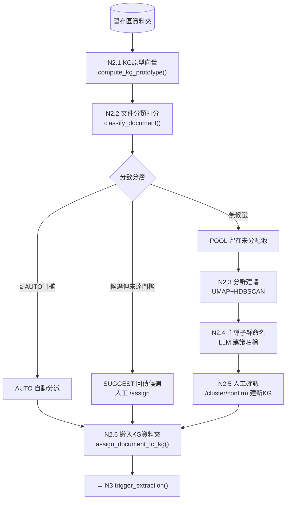

| 節點 | 目的 | 設計原理 | 程式位置 | 狀態 |
|---|---|---|---|---|
| N2.1–2.2 原型分類 | 判斷新文件屬於哪個既有 KG | Prototype（centroid）cosine，參考 ProtoNet；不需訓練分類器，KG 增加文件時原型自動更新 | `classify_service.py::compute_kg_prototype/classify_document` | 運作中；門檻未經正式校準 |
| AUTO／SUGGEST／POOL | 依信心分三層處理 | 高信心自動、中信心讓人決定、低信心不硬塞，是 human-in-the-loop 的信心分層（自有設計） | `classify_service.py::classify_all`、`routers/staging.py` | 運作中 |
| N2.3–2.5 分群建新 KG | 未分配文件可能自成一個新主題 | UMAP 降維＋HDBSCAN 密度分群（不需預設群數）；只回傳**建議**，由使用者微調後才建立 KG | `cluster_service.py`、`routers/staging.py::analyze_clusters/confirm_cluster` | 運作中 |
| N2.6 搬移並觸發抽取 | 分派確定後立刻開始建圖 | 「分派即觸發」，不需要另按「開始建圖」（§3.1.2 決策） | `classify_service.py::assign_document_to_kg` → `svo_service.trigger_extraction` | 運作中 |

**重構觀察**

- **KG#4 其實沒有走這條路**。法規資料集是由根目錄的專用匯入腳本（`import_leave_scheduling_dataset.py`、`create_clean_leave_scheduling_kg.py`）建立的，因為只有它們會傳入 `articles=`（條文結構，見 N3）。產品路徑與研究資料路徑因此是兩條入口。
- `routers/staging.py` 在 router 層直接呼叫 `svo_service.trigger_extraction`，出現三次（classify／assign／confirm）；「分派後觸發」應該收進 service 層的單一入口。

---

## 5. N3 前處理與 SVO 切塊（CHUNKREADY）

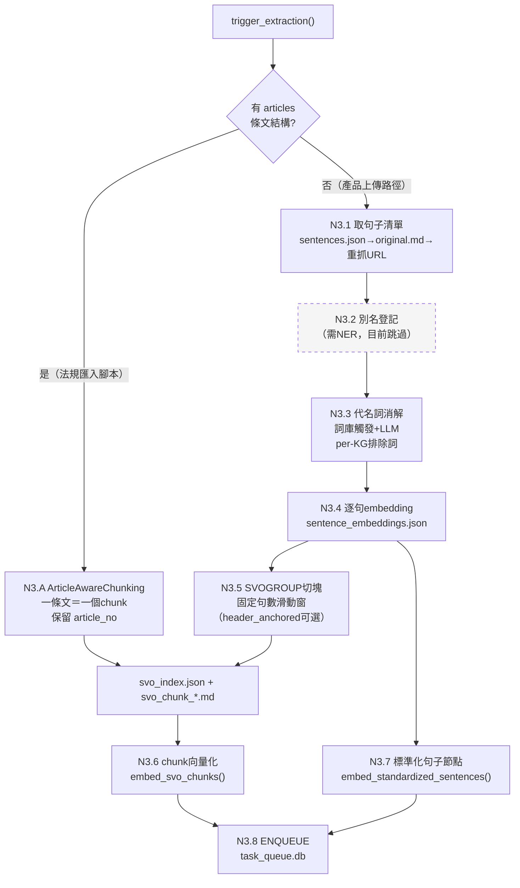

| 節點 | 目的 | 設計原理 | 程式位置 | 狀態 |
|---|---|---|---|---|
| N3.A 條文感知切塊 | 法規一條就是一個自我完備的語意單位 | 按 `ArticleNo` 切，不做句數切分，所以沒有「款項跨塊被截斷」的問題；`article_no` 往下游一路保留，Fact 可以連到 `LawArticle`（報告32 文獻：Prior 2026 等） | `svo_chunking.py::ArticleAwareChunking`（`build_article_aware_chunks`） | 運作中（只有匯入腳本會走） |
| N3.1 取句子清單 | 取得穩定、不漂移的句子邊界 | 三層取得：快取 → 原文重切 → URL 重抓；上傳檔的暫存檔已刪，第三層只救得回 URL 來源 | `ingestion_service.py::get_or_rebuild_sentences` | 運作中 |
| N3.2 別名登記 | 同一實體的不同稱呼先在文件內統一 | 設計上先做文件內 registry，再進抽取 | `entity_registry_service.py`、`entity_extraction_service.py` | **跳過**：NER（spaCy）未安裝驗證，`mentions=None` |
| N3.3 代名詞消解 | 把「其、該、此」換成具體實體，提高抽取準確度 | 詞庫觸發才呼叫 LLM（省成本）；per-KG 排除詞（法規 KG 排除「其」「該」，因為法律文本中它們多是正式泛稱，實測 41% 句子被誤觸發） | `pronoun_resolution_service.py::resolve_coreference_pipeline` | 運作中（SVOGROUP 路徑） |
| N3.4 逐句 embedding | 給「標準化 RAG」軌道用的句子向量 | 平行輸出，不影響抽取本身 | `svo_preprocessing_service.py::write_sentence_embeddings` | 運作中 |
| N3.5 SVOGROUP 切塊 | 一般文件的抽取切塊 | 固定句數滑動窗＋重疊；`ChunkingConfig` 可選 `header_anchored`（主旨錨定，給通用散文用） | `svo_chunking.py::build_svo_chunks` | 運作中；`cfg` 尚未由呼叫端傳入真實 per-KG 值 |
| N3.6–3.7 向量化 | chunk 與句子進 Neo4j 向量索引 | chunk-RAG 與標準化 RAG 的索引基礎 | `svo_service.py::embed_svo_chunks/embed_standardized_sentences` | 運作中 |
| N3.8 ENQUEUE | 把每個 chunk 登記成一筆抽取任務 | 把昂貴的 LLM 抽取交給背景 worker，上傳請求立刻返回 | `task_queue_service.py::enqueue` | 運作中 |

**重構觀察**

- **`trigger_extraction()` 是編排器（orchestrator），卻放在 `svo_service.py`**（3,400 多行的抽取／檢索單體檔案）。它應該屬於「建構管線」模組。
- **兩條切塊路徑的分歧點是 `articles` 參數，但 `articles` 沒有持久化**，導致 `build_graph(force_rebuild=True)` 無法重建法規 KG，只能靠 `ArticleStructureLossError` 防呆擋下（`knowledge_graph_service.py:97-109`）。重構時應把「切塊策略」做成 KG 或文件層級的持久化設定，而不是呼叫參數。
- 法規路徑略過 N3.2–N3.4；「哪些前處理步驟適用哪類文件」目前是隱含在 if 分支裡的規則，不是明確設定。

---

## 6. N4 抽取任務與 SVO 抽取（Worker）

### 6.1 任務狀態機

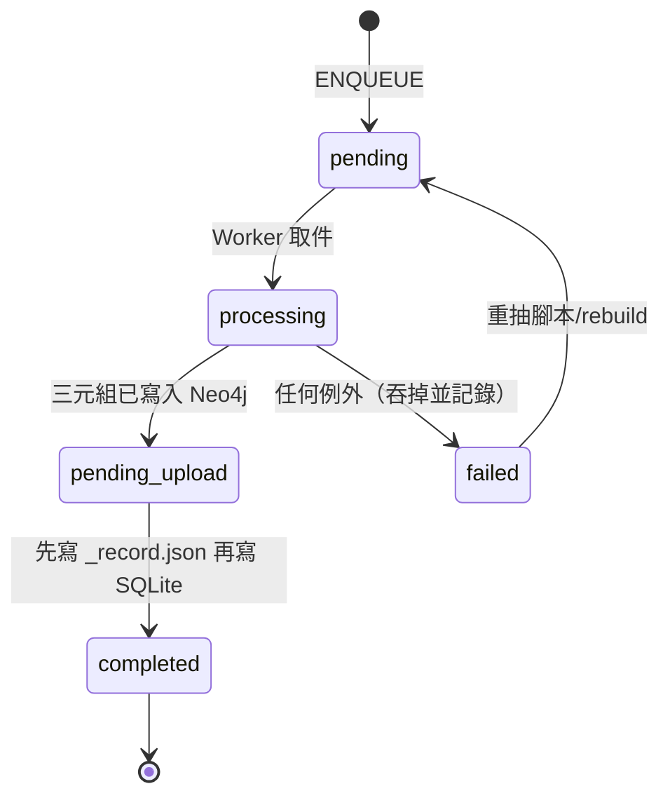

### 6.2 單一 chunk 的抽取流程

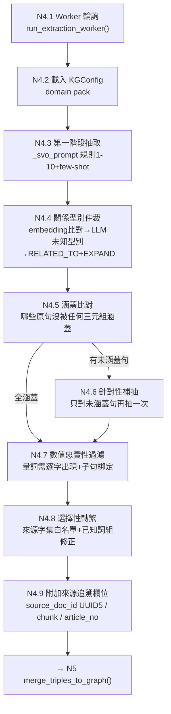

| 節點 | 目的 | 設計原理 | 程式位置 | 狀態 |
|---|---|---|---|---|
| N4.1 Worker 與佇列 | 長時間 LLM 抽取可中斷、可恢復 | SQLite 當效能索引，`_record.json` 才是真實狀態來源；**寫入順序先記錄檔後 SQLite**，避免中斷時重複建立 Fact（報告21） | `task_queue_service.py`、`extraction_worker.py::_process_one` | 運作中 |
| N4.3 第一階段抽取 | 句子 → SVO 三元組 | 受控關係詞彙（ConceptNet 35 個核心關係＋per-KG 擴充）；規則7 拆附加規定（修遺漏）、規則10 條件須複述進每筆結果（修條件被拆散，報告65） | `svo_service.py::_svo_prompt/extract_svo_triples` | 運作中 |
| N4.4 關係型別仲裁 | 把 LLM 的動詞歸到標準關係型別 | embedding 對型別描述打分，灰色地帶才問 LLM；不認識的型別兜底成 `RELATED_TO` 並提案給 EXPAND 治理流程（X3） | `svo_service.py::_reconcile_rel_type/classify_relation_by_embedding` | 運作中 |
| N4.5–4.6 完整性自我核對 | 保證召回率，不依賴窮舉 few-shot | **「先涵蓋、後補充」**：用 embedding 找沒被涵蓋的原句，只在有遺漏時才多花一次 LLM（成本不對稱，報告19） | `svo_service.py::extract_svo_triples_with_completeness_check/_find_uncovered_sentences` | 運作中 |
| N4.7 數值忠實性過濾 | 擋住 LLM 捏造或錯綁的數字 | 量詞必須逐字出現在原文，且落在與主詞相關的子句中（報告20、報告25 發現3）；純字串比對，不花 LLM | `svo_service.py::_filter_ungrounded_quantity_triples` | 運作中 |
| N4.8 選擇性轉繁 | `qwen2.5:7b` 偶爾輸出簡體字 | 只轉「這個 KG 來源文件實際用過的字」的白名單；另外逐詞修正白名單抓不到的詞組（准用→準用） | `svo_service.py::traditionalize_triples/_fix_known_simplified_compounds` | 運作中 |
| N4.9 來源追溯 | 每筆事實都能追回原文 | `document_uuid()` 用 UUID5 決定性推導，修正「source_doc_id 從未賦值」的根因（報告 3.1.4） | `extraction_worker.py`、`document_record_service.py::document_uuid` | 運作中 |

**重構觀察**

- **`_process_one()` 吞掉所有例外**，只把狀態標成 `failed`。重抽腳本回報的「N/N 成功」不可信，必須用 `scripts/kg/reextraction_manifest.py` 核對（報告57 附錄C）。重構時應讓失敗原因結構化、可查詢。
- N4.3–N4.8 全部在 `svo_service.py` 內，和 N5（寫圖）、N7（檢索）、各種 backfill 放在同一個檔案。

---

## 7. N5 知識寫入與實體治理

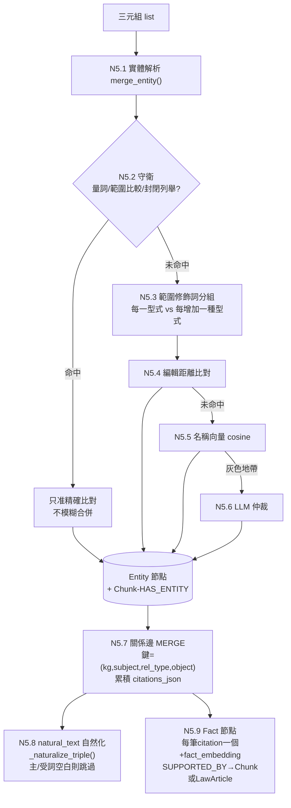

| 節點 | 目的 | 設計原理 | 程式位置 | 狀態 |
|---|---|---|---|---|
| N5.1、N5.4–5.6 實體解析（DEDUP4＋ESCALATE） | 同一實體只留一個節點 | 由便宜到昂貴三層：編輯距離 → cosine → LLM 仲裁；候選用 canopy 預篩 | `svo_service.py::merge_entity/resolve_entity_name/_fetch_entity_candidates_canopy` | 運作中 |
| N5.2 守衛 | 防止「字面相似、數值不同」被誤併 | 真實案例：`四千元`被併進`八千元`、三個年齡段併成一個。量詞、範圍比較詞、序數／附表、風險等級一律只准精確比對；token 清單 per-KG 可配置（報告76 `GuardConfig`） | `svo_service.py::_build_measure_pattern` 等 | 運作中 |
| N5.3 範圍修飾詞分組 | 「基礎量 vs 遞增量」不該合併 | 只縮小模糊比對的候選集，不影響精確比對 | `svo_service.py::_has_scope_modifier` | 運作中；覆蓋率未驗證 |
| N5.7 事實層級去重 | 相同事實只一條邊，來源不遺失 | 邊的 MERGE 鍵不含來源，來源累積在 `citations_json`；保持 BFS 單層走訪語意 | `svo_service.py::merge_triples_to_graph` | 運作中 |
| N5.8 自然化 | 讓 LLM 願意引用事實 | 報告22/23 對照實驗：生硬的三元組樣板會顯著降低被引用的機率，改成自然語句就會被引用；**寫入時就生成**（查詢時不必再呼叫 LLM）；主詞／受詞空白時跳過，否則 LLM 會自行編造補完 | `svo_service.py::_naturalize_triple` | 運作中；舊資料用 `backfill_natural_text` 回填 |
| N5.9 Fact 節點 | 事實層級的語意檢索單位 | 每筆 citation 一個 Fact（不平均、不覆蓋，避免語意壓平）；per-KG 獨立向量索引（範圍由索引保證）；embedding 前綴法規代碼（SAC，報告43） | `svo_service.py::_create_fact_node` | 運作中 |

**重構觀察**

- **同一件事實有兩種表示**：關係邊（帶 `natural_text`，給 BFS 用）與 Fact 節點（帶 `fact_text`＋向量，給語意檢索用），兩者文字來源不同（自然化 vs 樣板化）。N8 會把兩者合併、去重。這是有意的設計，但重構時應在資料模型文件中明確寫出「邊＝去重後的事實，Fact＝逐筆證據」。
- `svo_service.py` 裡有 10 個以上 `backfill_*`／`revoke_*` 維護函式，和線上寫入邏輯混在一起，建議拆到獨立的維護模組（X3）。

---

## 8. N6 知識圖譜儲存（資料模型）

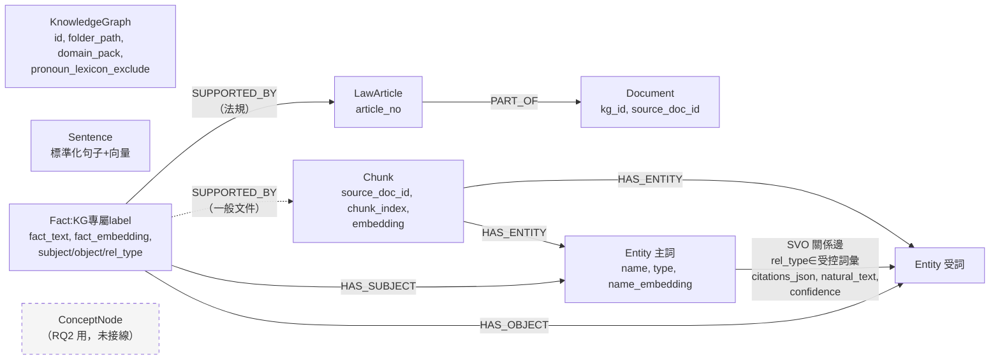

| 元素 | 目的 | 設計原理 |
|---|---|---|
| Entity＋SVO 關係邊 | 圖遍歷（BFS）的骨架 | 邊型別是受控詞彙，BFS 才能用型別過濾；`kg_id` 屬性隔離多個 KG |
| Fact（per-KG label） | 事實層級語意檢索 | 每個 KG 一個向量索引與 fulltext 索引（`_fact_vector_index_name`），檢索範圍由索引本身保證，而不是事後過濾 |
| Chunk／LawArticle | 事實的出處 | 法規 Fact 連到條文，其他 Fact 連到 chunk，使回答可以引用條號 |
| Sentence | 標準化 RAG 軌道 | 報告08 Phase 1/2；目前不在 `chat()` 主流程中 |
| 檔案系統（KG 資料夾） | 原文、切塊、`_record.json`、`svo_index.json` | 真實狀態來源；Neo4j 是可重建的衍生物 |
| SQLite `task_queue.db` | 抽取任務佇列 | 效能索引，可由 `_record.json` 重建 |

**重構觀察**：狀態分散在「Neo4j＋檔案系統＋SQLite」三處，重建規則寫在各函式的 docstring 裡。重構時建議整理出一份明確的「哪個是 source of truth、哪個可重建」表。

---

## 9. N7 檢索（`chat()` 前段）

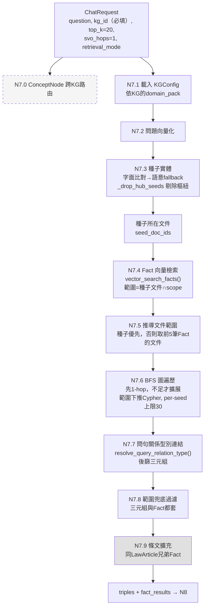

`retrieval_mode`：`both`（預設，全跑）／`fact_only`（跳過 N7.3、N7.6）／`bfs_only`（跳過 N7.4、N7.7）。

| 節點 | 目的 | 設計原理 | 程式位置 | 狀態 |
|---|---|---|---|---|
| N7.0 ConceptNode 路由 | 自動選出要查哪些 KG | RQ2 研究對象 | `services/concept_engine.py::route_kgs` | **stub**（`NotImplementedError`）；`chat()` 要求呼叫端指定 `kg_id` |
| N7.3 種子實體 | 找出 BFS 的起點 | 字面比對優先（精確）、找不到才用語意（實測 7/7 題字面比對失敗，因為實體名稱太長）；剔除度數大於 100 的樞紐種子，避免鄰居爆炸（報告27 L1） | `routers/agent.py::_find_seed_entities/_drop_hub_seeds` | 運作中 |
| N7.4 Fact 向量檢索 | 語意層級補足字面比對 | 取 `top_k×倍數` 候選池 → 依 (s,r,o) 去重 → 截斷；**範圍錨定在種子文件**，不讓語意相近但答非所問的跨文件事實帶偏（報告41 L9 V1） | `svo_service.py::vector_search_facts` | 運作中 |
| N7.4′ hybrid／source_doc_cap | BM25 混合、同源名額上限 | 報告43／57 prototype；n=3 消融中 `hybrid` 反而讓 Context Quality 下滑 | 同上參數 | **opt-in 預設關**，`chat()` 未傳 |
| N7.5 文件範圍 | 限制 BFS 只走相關文件 | 只取前 5 筆 Fact 推導範圍，`top_k=20` 全拿會被跨文件事實稀釋（報告25 發現1） | `routers/agent.py::_resolve_doc_scope/_relevant_doc_ids_from_facts` | 運作中 |
| N7.6 BFS | 沿圖取回相鄰事實 | **範圍下推進 Cypher**（先算範圍再走訪，舊順序單題 330–440 秒）；自適應跳數：1-hop 結果少於 8 筆才擴展；空結果退回無範圍 | `svo_service.py::bfs_query/_bfs_pass_cypher` | 運作中 |
| N7.6′ L2 prize 剪枝 | 2-hop 只留與問題最相關的邊 | G-Retriever prize 機制的扁平簡化（RQ6） | `bfs_query(prize_top_k=…)` | **prototype 未接線** |
| N7.7 關係型別連結 | 依問句意圖過濾關係型別 | 整句問題餵入（不另外抽動詞，省一次 LLM；代價是名詞稀釋比對） | `svo_service.py::resolve_query_relation_type` | 運作中 |
| N7.9 條文擴充 | 補回被拆碎的同條文事實 | 報告62 T3／72 S2：候選池確實擴大，但 5 個案例中只修好 1 個（部分） | `routers/agent.py::_expand_facts_by_article` | **opt-in 預設關** |

**與舊文件的差異**

- 舊文件（CLAUDE.md、早期 03 章）寫「ConceptNode 路由 → BFS → 文件取回」。實際順序是：**種子 → Fact 向量 → 推導範圍 → BFS（範圍下推）→ 型別後篩 → 範圍兜底**，而且沒有路由層。
- `QueryClassifier`／`AdaptiveRetrievalService`（行為樹）已實作並有測試，但**沒有接進 `chat()`**，而且 Type-C 規則對題庫過擬合。

**重構觀察**：**整個檢索編排（N7.1–N7.9，約 200 行）寫在 router 的 `_stream()` 閉包內**，harness 的 F/G/K 臂只能透過假造 HTTP 請求（`_drain_chat`）重用它。這是目前最大的邊界問題：router 應只負責 HTTP／SSE，檢索應是一個可以直接呼叫的 service（例如 `RetrievalPipeline.run(question, kg_id, cfg) -> RetrievalResult`）。

---

## 10. N8 上下文組裝

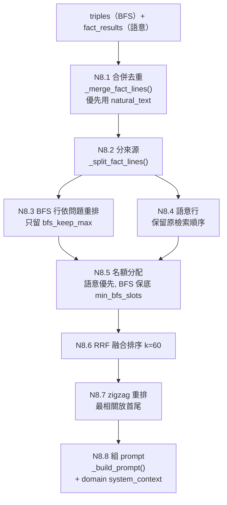

| 節點 | 目的 | 設計原理 | 程式位置 |
|---|---|---|---|
| N8.1 合併 | 邊與 Fact 兩種表示合成一份清單 | 優先使用自然語句（見 N5.8）；主詞或受詞空白的三元組過濾掉 | `routers/agent.py::_merge_fact_lines` |
| N8.3–8.5 分來源名額 | 不讓 BFS 鄰居洗掉語意排名 | 舊版整批重排曾把正解擠出前 18 名（報告25 發現6）；語意 Fact 為主、BFS 為輔且有保底（SAGE、Han 2024 綜述） | `_arrange_fact_lines` |
| N8.6 RRF | 融合兩個排名 | Cormack 2009，`k=60` 有文獻背書 | `_rrf_order` |
| N8.7 zigzag | 緩解 Lost-in-the-Middle | 只在清單大於 K 時套用（Jin 2025：小清單無效） | `_litm_reorder` |
| N8.8 prompt | 加入領域指令 | `system_context` 來自 domain pack（X1），不寫死台灣語境 | `_build_prompt/_build_constrained_prompt` |

**已知限制**：`bfs_keep_max`／`min_bfs_slots`／`truncate_k` 等值**都沒有經過實測校準**，只有 RRF `k=60` 有文獻依據。prompt 截斷門檻是非單調的（候選池大於 35 時放寬到 35 行，報告62 §10），調 `top_k` 會連帶改變 BFS 名額。

---

## 11. N9 生成與接地核對

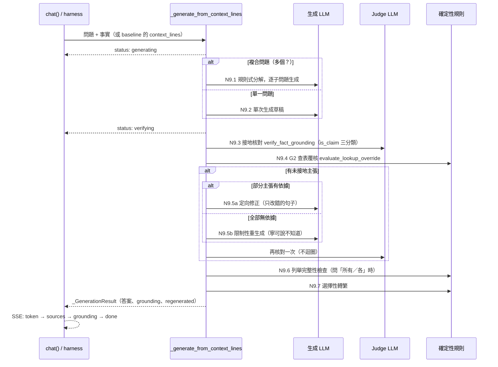

| 節點 | 目的 | 設計原理 | 程式位置 | 狀態 |
|---|---|---|---|---|
| N9.1 複合問題分解 | 小模型一次回答多個問題容易自相矛盾 | 規則式（按問號切分，最多 6 個），各自獨立生成；捨棄 LLM 分解（Least-to-Most／Self-Ask 只取精神） | `_split_into_subquestions/_generate_decomposed_answer` | 運作中 |
| N9.3 接地核對 | 抓出「證據有、生成仍捏造」 | 使用者原則：**「寧願說不知道，也禁止亂回答」**；使用者永遠看不到未核對的版本（方案 B）；judge 可以和生成模型分開（`JUDGE_LLM_PROVIDER`） | `services/verification_service.py::verify_fact_grounding` | 運作中 |
| N9.4 G2 查表覆核 | 「數值區間 → 對應值」的判斷不交給 LLM | 確定性 Python 規則；只在能解析出查表結構時介入 | `services/interval_lookup_service.py::evaluate_lookup_override` | 運作中 |
| N9.5 修正或重生成 | 修掉未接地的內容 | 部分有依據時做定向修正（2b，不把對的改壞），否則整份限制性重生成；**只做一次，不迴圈** | `_targeted_correction/_build_constrained_prompt` | 運作中；報告38 實測「無害但無感」 |
| N9.6 列舉完整性 | 問「所有」時不能漏掉級距 | 偵測事實中的層級族群，缺漏就重生成或附補充 | `_detect_tier_families/_missing_tier_members` | 運作中 |
| （未接線）確定性接地守衛 | 日期起算、條號、數值區間、禁止斷言 | 規則式，取代 LLM 軟性自查 | `services/deterministic_guard_service.py` | **只在 N10 評分時使用，`chat()` 未接線** |

**設計重點**：`_generate_from_context_lines()` 是 `chat()` 和 harness baseline 臂（B0/B1/B2）**共用的生成堆疊**，這是 RQ1 單一變因控制的硬需求：生成端逐位元相同，才分得出是「贏在檢索」還是「贏在生成」。但 baseline 模式不套用分解、2b 修正與列舉檢查（「前導夠用版」），這是已知的不對稱。

---

## 12. N10 評測 Harness

### 12.1 流程

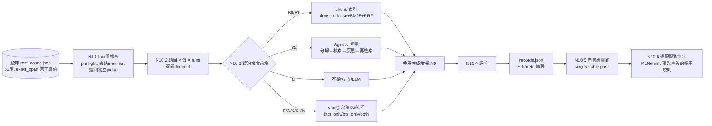

### 12.2 各臂定義

| 臂 | 別名 | 檢索前端 | 用途 |
|---|---|---|---|
| D | — | 無（`use_svo=False`） | 純 LLM 下限 |
| B0 | M1 | chunk 向量（dense only） | Naive chunk-RAG |
| B1 | M2 | chunk dense＋BM25，RRF 融合 | 強 chunk-RAG 基準（**RQ1 主要比較對象**） |
| B2 | — | 在 B1 上加 agentic 迴圈：複雜度路由 → 分解 → 每個子問題「檢索 → LLM 反思 → 依缺口精煉」，預算每子問題保底加動態分配 | Agentic RAG 強基準（optional） |
| F | M3 | KG，只用 Fact 向量（`fact_only`） | 消融：只有語意 Fact |
| G | — | KG，只用 BFS（`bfs_only`） | 消融：只有圖遍歷 |
| K | M4 | KG 完整流程（`both`） | **系統本體** |
| K-2b | — | 同 K，關閉接地重生成 | 消融：生成端修正的貢獻 |

B0/B1/B2 呼叫 `agent._generate_from_context_lines(context_lines=…)`；F/G/K 則透過 `_drain_chat()` 跑完整個 `chat()`。

### 12.3 評分節點（N10.4）

| 項目 | 做法 | 設計原理 | 程式位置 |
|---|---|---|---|
| 原子準確率 | 答案逐字包含 gold `exact_span` 算命中；未命中才請 judge 做語意蘊含 fallback | **真值直接取自法規原文**，不讓 LLM 動態生成參考答案（FActScore 精神）；逐字優先，防止「當月一日」被語意平滑成「當日」 | `services/atomic_scorer.py`、`semantic_span_matcher.py` |
| 拒答題（Type-E） | 關鍵字判斷是否拒答；命中陷阱主張就判失敗 | 確定性優先；已知會漏判實質拒答 | 同上（`trap_claim_spans`） |
| 確定性守衛 | 守衛失敗時 `is_perfect=False`，但保留原始覆蓋率 | 分清楚「有召回但法律關鍵詞被改寫」與「根本沒召回」 | `deterministic_guard_service.py` |
| Context Quality | Context Recall／SNR／Chain Completeness | 檢索與生成**因果解耦**：先看證據有沒有進來，再看生成有沒有用對（報告57 任務A） | `services/lineage_tracker.py` |
| 範圍稽核 | 新舊法、角色歸屬錯置 | 報告84/85 `role_mismatch` | `services/claim_scope_auditor.py` |
| 固定 metric judge | 評分用的 judge 與受測臂的 judge 分開 | 評判者間信度（報告69） | `--metric-judge-provider` |
| 達標判定 | 第一次通過→single_pass（抽查）；需要時重跑第二次→stable_pass／stable_fail | 控制 LLM 非決定性的成本 | `scripts/eval/adaptive_repeat.py` |

**已知量測限制**：評分器偽陰性下界 ≥7.2%、偽陽性下界 ≥3.4%（報告62 §14）；**達標題數 ±2 屬於量測噪音**；timeout 被記成 0 分，沒有從統計中排除（報告94）；規則 R／v2 評分器只當診斷工具，不是正式評分器。

**重構觀察**：harness 直接 import `routers.agent` 的私有函式（`agent._generate_from_context_lines`、`agent._GenerationResult`），表示生成堆疊應該從 router 抽出成公開的 service；`run_rq1_comparison.py` 約 940 行，同時負責 CLI、臂分派、B2 反思 prompt、評分與報表，可以拆成「臂註冊表＋評分管線＋報表」。

---

## 13. 橫切節點 X1–X3

| 節點 | 目的 | 設計原理 | 程式位置 | 狀態 |
|---|---|---|---|---|
| X1 設定層 `KGConfig` | 門檻、守衛 token、關係擴充、`system_context` 可以 per-KG／per-domain 覆寫 | 四層合併（shipped defaults → domain pack → per-KG 檔案 → 請求），深凍結不可變；golden test 保證預設值逐字等於舊常數，也就是**通用骨架＋領域參數注入**，而不是每個領域複製一份 prompt | `core/kg_config/`、`config/domain_packs/`、`config/kg/` | 查詢端已全接線；抽取端 `svo_fewshots` 已參數化（報告66）；切塊 `cfg` 尚未由 `trigger_extraction` 呼叫端傳入 |
| X2 Provider 層 | 抽換 LLM／embedding | 5 種 LLM、3 種 embedding；Ollama 固定 `temperature=0`、`seed`（仍無法完全決定性，報告20）；`_TIMEOUT=600s` 寫死 | `core/providers/` | 運作中；評測與 KG#4 使用 ollama 的 `bge-m3`（1024 維） |
| X3 KG 管理與治理 | KG 生命週期、未知關係型別提案、資料修補 | EXPAND：`RELATED_TO` 兜底邊保留動詞向量，核准新型別後回填；資料修補一律「preflight → `--apply` → compare-and-set」（報告90/92） | `routers/knowledge_graph.py`、`expand_governance_service.py`、`expand_worker.py`、`scripts/kg/` | 運作中 |

---

## 14. 重構觀察彙整

### 14.1 現況：節點與程式檔案的對應錯置

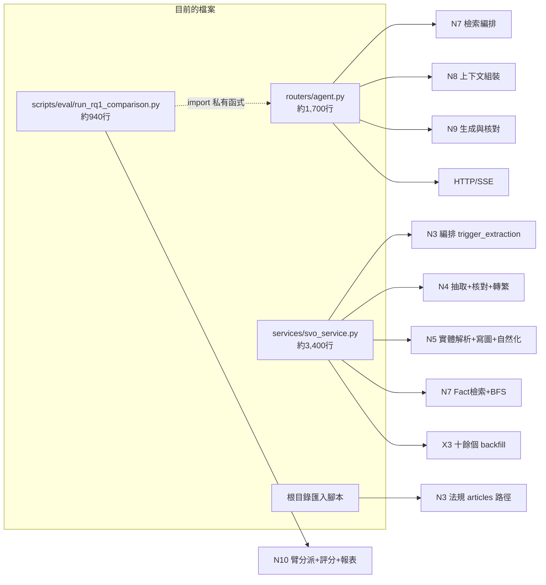

（行數為非空行計數。）

### 14.2 主要問題（依影響排序）

| # | 問題 | 影響 | 對應節點 |
|---|---|---|---|
| 1 | 檢索、組裝、生成都寫在 router 裡 | harness 只能繞道 HTTP 或 import 私有函式；很難單獨測試與重用 | N7/N8/N9 |
| 2 | `svo_service.py` 橫跨 5 個節點 | 修改抽取可能影響檢索；合併衝突集中（2026-09-27 合併時此檔單獨有 9 處衝突，另有 2 處 git 靜默合併錯誤） | N3/N4/N5/N7/X3 |
| 3 | 切塊策略（`articles`）沒有持久化 | 產品路徑無法重建法規 KG；研究資料只能靠根目錄腳本建立 | N2/N3 |
| 4 | Worker 吞例外 | 「成功」的回報不可信 | N4 |
| 5 | 多個 prototype 預設關、長期未接線 | 讀程式的人分不清哪些真的在跑 | N7.0、N7.4′、N7.6′、行為樹、確定性守衛 |
| 6 | 狀態來源散在三處 | 重建規則只寫在 docstring | N6 |
| 7 | 生成堆疊在 baseline 模式下功能不對稱 | RQ1 比較的單一變因控制有已知缺口 | N9/N10 |

### 14.3 目標模組邊界（建議，待討論）

以下只是依節點切分的**建議方向**，不是已決定的方案。依專案慣例（先討論、確認後才實作），每一項都需要另外開任務書：

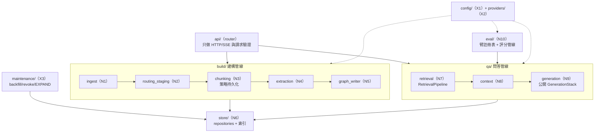

**重構前提（建議）**：

1. 先保證行為不變：現有 pytest（約 1,170 個）加上一次凍結評測（S0 基準）作為回歸網。
2. 一次搬一個節點，搬移和改行為不要放在同一個 commit。
3. `svo_service.py` 的拆分最好在沒有進行中抽取的時段做，避免和 drain／重抽腳本衝突。

---

## 15. 目前進度、已知限制、未決事項

### 15.1 進度

- 建構路徑 N1–N6：全部運作中；KG#4 抽取佇列 3,307/3,307 completed；報告71 的 natural_text 型別洩漏處理完畢（49 筆已 backfill，2 筆待處理，47 筆因欄位缺漏安全跳過）。
- 問答路徑 N7–N9：運作中，但沒有路由層（RQ2）與多輪精煉（RQ3）。
- 評測 N10：RQ1 完成 B0/B1/K 比較、B2 n=41。
- 版控（2026-09-28 查證）：`9f66270` 已在 `origin/worktree-sdd-retrieval-comparison`；該分支領先 `origin/master` 11 個 commit（報告93/94 系列），尚未進 master。

### 15.2 已知限制（依節點）

| 節點 | 限制 |
|---|---|
| N3 | NER 別名登記未啟用；切塊 `cfg` 未接線；法規重建只能用匯入腳本 |
| N4 | `qwen2.5:7b` 非決定性（batch-size 依賴）；worker 吞例外；條件分裂（`57-AGGR19` c85）仍未完全修好 |
| N5 | 無量詞的範圍修飾短語覆蓋率未驗證 |
| N7 | 沒有 ConceptNode 路由；只能在單一 KG 內檢索；`hybrid`／`source_doc_cap`／L2／條文擴充的證據都不足以預設開啟 |
| N8 | 名額與截斷參數未校準；截斷門檻非單調 |
| N9 | 只重生成一次；確定性守衛未接進線上流程 |
| N10 | 評分器偽陰性／偽陽性、timeout 記為 0 分、judge 非決定性；共用 generator／judge 只算 pilot |
| X2 | Ollama `_TIMEOUT=600s` 寫死；WSL 雙 Ollama 記憶體壓力 |

### 15.3 未決事項（待使用者裁示，不是自動下一步）

1. **B2 後續**：（a）反思 prompt 加入「多輪查無證據應提高拒答傾向」；（b）是否調高全域 `ollama.py::_TIMEOUT`（會影響所有 production 呼叫）；（c）是否做 42 題×3 的正式穩定性評估；或直接收斂寫入論文。
2. **是否合併進 master**：分支領先 `origin/master` 11 個 commit（加上本報告）。
3. **報告71 剩下的 2 筆** natural_text（結構化欄位本身有問題）。
4. **重構**：§14.3 的方向要不要進入任務書，以及先拆哪個節點（建議先做 #1：把 N7–N9 從 router 抽出）。
5. **長期方向**（未經深入討論不應啟動）：RQ2 路由、RQ5 時序、GAP-06/07。

---

## 16. 名詞對照表

### 16.1 系統與資料

| 名詞 | 意義 |
|---|---|
| KG#4 | 目前主要的正式 KG，`236903cf-055a-40a8-8923-b9d06601f3b7`（勞動法規，64 份文件） |
| 舊 KG | `76bc98ff-…`，已無 natural_text，不再使用 |
| SVO 三元組 | (主詞, 動詞, 受詞)＋`rel_type`＋型別；抽取的基本單位 |
| Entity | 圖中的實體節點，經 N5 對齊去重 |
| 關係邊 | Entity 之間帶受控型別的邊；以 (s, rel_type, o) 去重，來源累積在 `citations_json` |
| Fact | 每筆 citation 一個的證據節點，帶 `fact_text` 與向量，用於語意檢索 |
| natural_text | 關係邊上由 LLM 改寫的自然語句，prompt 優先使用 |
| citation | 一筆事實的一次出處（文件、chunk、句子範圍、動詞原文） |
| LawArticle | 法規條文節點；法規 Fact 的 `SUPPORTED_BY` 指向它 |
| domain pack | 領域設定包（例如 `taiwan-labor-law`、`generic`），由 KG 節點的 `domain_pack` 選擇 |
| CHUNKREADY／ENQUEUE／DEDUP4／ESCALATE | 03 章 Behavior Tree 的節點名稱，分別對應 N3、N3.8、N5.1、N5.6 |
| RAG 切塊 vs SVO 切塊 | 前者給分類與 chunk-RAG（N1.3），後者給抽取（N3.5／N3.A），刻意分開 |
| EXPAND | 未知關係型別的提案與核准流程 |

### 16.2 評測

| 名詞 | 意義 |
|---|---|
| D／B0／B1／B2／F／G／K／K-2b | 評測臂，見 §12.2 |
| M1–M4 | 臂別名：M1=B0、M2=B1、M3=F、M4=K |
| S0 | 新題庫下的 K 臂基準（13/42） |
| S1／K1b | K 臂 `top_k=40`＋BFS 保底 16（16/42，不採用） |
| S2／K2 | K 臂＋條文擴充（13/42，不採用） |
| K3 | K1b＋K2 組合（SNR 跌破門檻，否決） |
| S3 | chunk-RAG 對照（B0/B1 vs K），RQ1 的主要結果 |
| Type-A～E | 題目場景分類；Type-E＝應拒答的金絲雀題 |
| exact_span | 取自法規原文的原子真值字串 |
| single_pass／stable_pass／stable_fail | 自適應重跑的判定狀態 |
| 規則 R／v2 評分器 | 評分器敏感度分析用的確定性規則，只當診斷工具 |
| Context Recall／SNR／Chain Completeness | 檢索品質三指標（報告57） |
| bank hash | 題庫 sha256；目前是 `77c293ed…`（報告85），舊凍結為 `404cde9f…`、`23f8c06f…` |

### 16.3 報告索引（依主題）

| 主題 | 報告 |
|---|---|
| 早期架構藍圖（RQ 編號為舊版） | 01、03、08 |
| 抽取管線與修正 | 11、19（完整性自我核對）、20（數值忠實性）、21（管線稽核）、25（去重守衛）、32、65（規則10）、66（few-shot 參數化） |
| 生成端 | 16（接地核對）、22–24（natural_text 自然化） |
| 檢索與剪枝 | 27（BFS L0/L1/L2）、41（範圍錨定）、43（hybrid） |
| 設定分層 | 33、76（GuardConfig）、77（關係擴充） |
| 評測架構 | 36（B2 設計）、39（七路比較 harness）、51、57（Context Quality／KG 角色收斂）、62（下一階段／量測稽核）、68–69（embedding 快取／judge 解耦）、72（S0–S3） |
| RQ1 結果與診斷 | 78–83（S3 落差診斷與回灌）、88（人工裁決）、93–94（B2） |
| 文獻查證 | 61 |
| 資料修補 | 67、71、90、92 |
| 版控與交接 | 60、70、89 |
| **本文件** | **95：節點流程總覽** |
