# 報告95：專案節點流程總覽與設計說明

> **日期**：2026-09-28（v3：大節點＝規劃流程、內部節點＝已確定的實作細節；新增「目標註記」）
> **基準 commit**：`c8e2b7e`（`worktree-sdd-retrieval-comparison`）
> **用途**：
>
> 1. **介紹專案**：§1 一頁版＋§2 大節點規劃流程。
> 2. **與論文對齊**：大節點取自論文 03 章的方法設計，每個節點都標出 03／04／05–07 章節；§18 列出論文與程式不一致之處。
> 3. **為日後結構整理留紀錄**：§19 只記錄觀察，**本階段不重構**（使用者 2026-09-28 裁示）。
>
> **判定原則**：內部節點一律以程式碼為準，不以論文或舊報告的描述為準。
> 本文件不取代 [HANDOVER.md](../../HANDOVER.md)（進度權威來源）與 [00_研究追溯對映表](../論文/00_研究追溯對映表.md)（文獻↔方法↔程式追溯）。

---

## 0. 閱讀指引：大節點、內部節點、目標註記

本文用三種層次描述專案，各自代表不同的確定程度：

| 層次 | 意義 | 確定程度 | 來源 |
|---|---|---|---|
| **大節點** | 系統**規劃中的流程階段**，說明「這一段要負責什麼、為什麼需要」 | 可能已實作，也可能**只是規劃** | 論文 03 章方法設計、`docs/ARCHITECTURE.md` 產品分層 |
| **內部節點** | 大節點底下**已確定的實作細節**：程式存在、接在流程中、實際會執行 | **確定**（皆經程式碼核對） | 程式碼 |
| **目標註記** | 想完成、但**還沒規劃成大節點**的目標 | 只是方向 | 論文 07 §7.4、報告 |

### 0.1 大節點的狀態

| 標記 | 定義 |
|---|---|
| ✅ 已實作 | 規劃範圍已由內部節點完成 |
| 🟡 部分實作 | 已有內部節點，但規劃範圍還有一部分未完成 |
| 📐 只有規劃 | 沒有任何內部節點（最多只有尚未接線的零件） |

### 0.2 每個大節點的寫法

1. **規劃**：目的、為什麼需要這一段、論文章節、狀態。
2. **內部節點流程**：Mermaid 圖，**只畫已實作的內部節點**。
3. **內部節點說明**：目的｜設計原理（避開的失敗模式、依據的報告或文獻）｜程式位置｜論文章節。
4. **規劃範圍內未完成的項目**：分兩種——
   - 🟡 **待接線零件**：程式與測試已存在，但預設關閉或沒接進流程，所以**不算內部節點**；
   - 📐 **只有設計**：論文有設計，沒有程式。

> ✅ 指的是**工程機制已上線**，不等於研究問題已驗證。例如 N5 已實作，但 RQ4b 的正式實驗仍未完成。

---

## 1. 專案介紹（一頁版）

### 1.1 專案是什麼

**World Knowledge Graph RAG** 把文件轉成 SVO（主詞–動詞–受詞）知識圖譜，再以圖譜為基礎回答問題。它同時是：

- **論文實作載體**：研究「知識圖譜在什麼條件下能改善 RAG 問答」。
- **產品平台**：網頁＋軟體形態、可支撐產品線（後端 FastAPI＋Neo4j＋Ollama 等 LLM provider，前端 Vanilla JS）。

主要資料集是**台灣勞動法規**（KG#4：64 份文件、3,307 個抽取 chunk、Fact 約 16,826 筆、Entity 約 12,296 個）。

### 1.2 研究問題與進度（論文 01 §1.2、06 §6.2）

| RQ | 問題 | 對應大節點 | 已完成 | 未完成 |
|---|---|---|---|---|
| **RQ1** | KG 檢索 vs chunk-RAG | N9–N11、N13 | 完整比較實驗閉環（B0/B1/K）；B2 全量 pilot（n=41） | B2 ×3 正式穩定性評估 |
| RQ2 | 多 KG 路由 | **N8（📐）** | ConceptNode 向量索引零件 | 路由本身 |
| RQ3 | 自我精煉降低幻覺 | **N12（📐）**、N11 | N11 的接地核對＋一次重生成 | 檢索端多輪迴圈 |
| RQ4a | 受控關係詞彙 | N4、X3 | 詞彙、仲裁、EXPAND、per-KG 擴充 | 正式消融實驗 |
| RQ4b | 實體指代與別名 | N3、N5 | 守衛、跨文件別名、代名詞消解 | NER 接線、端到端實驗 |
| RQ5 | 事實時序 | **N7（📐）** | Document／LawArticle 日期中繼資料（N6） | 有效期間語意、時間條件查詢 |
| RQ6 | Hub Node 剪枝 | N9 | L0/L1 | L2 接線與消融 |

### 1.3 RQ1 結論（誠實版）

- **K（完整 KG）vs B1（強 chunk-RAG）**，42 題、凍結條件：
  - 原評分器：13/42 對 21/42，落後 8 題（exact McNemar `p=0.021`）；
  - 規則 R 敏感度分析：16/42 對 22/42（`p=0.109`，不顯著）；
  - 報告88 人工裁決後，落差校正為 −7 題。
  - **方向上沒有顯示 KG 優於 chunk-RAG。**
- **B2（Agentic RAG）**，n=41（`atomic_accuracy` 平均）：B0 0.649、B1 0.693、B2 0.681；約 3 倍 LLM 呼叫；維持 optional。
- **論文定位**：診斷 KG 在什麼條件下有／無增益（報告61）；KG 的角色收斂為「上下文精煉與路由者」（報告57 §7）。

### 1.4 一句話講完整個系統

> 文件 → 中央文件池與分類 → 切塊與標準化 → LLM 抽出 SVO 三元組 → 實體對齊後寫進 Neo4j（邊＋自然語句＋Fact 向量節點）→ 問答時以種子實體＋Fact 向量檢索＋BFS 取回事實 → 排列成事實清單 → LLM 生成 → 接地核對，不通過就修正或重生成 → 串流回傳；評測 harness 以同一套生成堆疊比較 KG 與 chunk-RAG。
> **規劃中但尚未實作的**：多 KG 路由、自我精煉迴圈、事實時序。

---

## 2. 大節點規劃流程

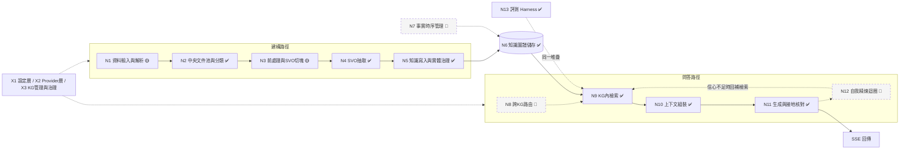

**目前實際運作的路徑**：N1 → N6 建圖；問答跳過 N8（呼叫端直接指定 `kg_id`），N9 → N11 單次執行、沒有 N12 迴圈。

| 大節點 | 規劃目的 | 狀態 | 內部節點 | 03 方法 | 04 實作 | 05–07 | RQ |
|---|---|---|---|---|---|---|---|
| N1 資料輸入與解析 | 各種來源 → 可處理的文字，並保留結構 | 🟡 | 3 | §3.1.1、§3.1.5 | §4.3.1、§4.0.1 | — | 產品 |
| N2 中央文件池與分類 | 文件只存一份，決定掛到哪些 KG | ✅ | 6 | §3.1.1、§3.1.1 §a | §4.2.4、§4.3.1–4.3.2 | §5.3.5 | 產品 |
| N3 前處理與SVO切塊 | 原文 → 適合抽取的 chunk | 🟡 | 8 | §3.1.2、§3.4 §a、§3.9.7 | §4.4.1、§4.11 | §5.3 | RQ4b 基礎 |
| N4 SVO 抽取 | 可恢復地抽出忠實的三元組 | ✅ | 8 | §3.1.2、§3.1.3 | §4.4.2、§4.6 | — | RQ4a 基礎 |
| N5 知識寫入與實體治理 | 對齊、去重、寫圖、自然化 | ✅ | 8 | §3.1.4、§3.4 §b | §4.4.3、§4.5 | — | RQ4b 基礎 |
| N6 知識圖譜儲存 | 資料模型、索引與狀態來源 | ✅ | — | §3.1.4 | §4.2.2–4.2.4 | — | — |
| N7 事實時序管理 | 同一事實隨時間改變時，保留版本並依時間查詢 | 📐 | 0 | §3.5 | — | §6.2.5 | RQ5 |
| N8 跨KG路由 | 自動決定問題該查哪些 KG | 📐 | 0 | §3.2 §a | §4.7.2 | §6.2.2 | RQ2 |
| N9 KG內檢索 | 在選定 KG 內取回相關事實 | ✅ | 8 | §3.2 §b–§f、§3.7 | §4.7.1 | §5.2、§6.2.1 | RQ1／RQ6 |
| N10 上下文組裝 | 事實排成 LLM 好用的清單 | ✅ | 7 | §3.2 §g、§3.6 | §4.7.3–4.7.4 | §5.5.1a | RQ1 |
| N11 生成與接地核對 | 只輸出有依據的答案 | ✅ | 7 | §3.6 | §4.7.2–4.7.3 | §5.6.1 | RQ3（生成端） |
| N12 自我精煉迴圈 | 信心不足時改變檢索、再生成，直到收斂 | 📐 | 0 | §3.6 | §4.7.2 | §6.2.3 | RQ3 |
| N13 評測 Harness | 固定條件下比較檢索方法 | ✅ | 6 | §3.8 | — | §5、§6、§7 | RQ1 |
| X1 設定層 | per-KG／per-domain 覆寫 | 🟡 | — | §3.9 | §4.10 | §5.3.6 | 工程決策 |
| X2 Provider 層 | 抽換模型供應商 | ✅ | — | — | §4.1、§4.2.3 | — | — |
| X3 KG 管理與治理 | 生命週期、型別治理、資料修補 | ✅ | — | §3.1.3 §a | §4.5.2、§4.6 | — | RQ4a |

---

## 3. N1 資料輸入與解析 🟡

**規劃**：把各種來源（文件、網頁、結構化資料）轉成可處理的形式；結構化資料要**保留原始結構**，不能全部壓成自然語言（03 §3.1.5）。
**已實作**：文件與 URL 路徑。**未實作**：結構化來源。

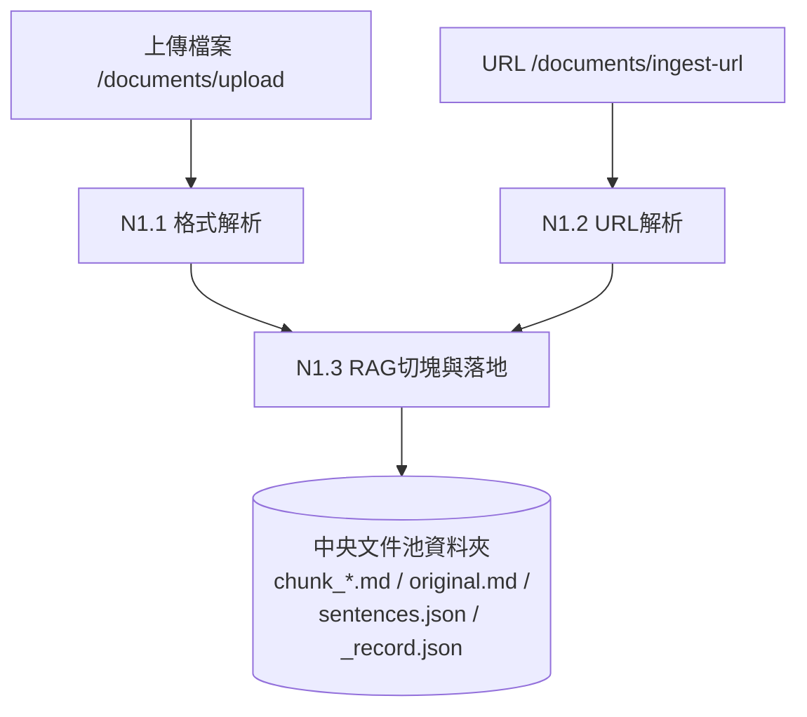

| 內部節點 | 目的 | 設計原理 | 程式位置 | 論文 |
|---|---|---|---|---|
| N1.1 格式解析 | PDF／DOCX／PPTX／音訊影片 → 純文字 | CPU-bound 解析放進 thread pool，不阻塞事件迴圈；PDF 三層備援處理掃描檔；文件內圖片走 `ImagePipeline`（OCR 預設開、本地圖理解模型預設關，失敗自動降級）——**此圖片管線 03／04 未登記，見報告96 A1** | `ingestion_service.py::parse_document`、`parser/core.py`、`parser/image_pipeline.py` | 03 §3.1.1／04 §4.3.1 |
| N1.2 URL 解析 | 網頁正文、YouTube 字幕 → 純文字 | 同上 | `ingestion_service.py::parse_url_service` | 同上 |
| N1.3 RAG 切塊與落地 | 建立文件資料夾（單一實體來源 SSOT） | **RAG 切塊與 SVO 切塊刻意分開**：這裡的 chunk 只給分類與 chunk-RAG；原文與句子清單先存下來，下游不必重新解析、邊界不漂移；撞名直接拒絕 | `ingestion_service.py::chunk_and_stage`、`parser/chunk_writer.py` | 03 §3.1.1／04 §4.3.1 |

**規劃範圍內未完成**

| 項目 | 類型 | 說明 | 論文 |
|---|---|---|---|
| 結構化來源（JSON／SQL／API／RDF） | 📐 | SourceAdapter、SchemaRegistry、CanonicalRecord 全部未實作 | 03 §3.1.5／04 §4.0.1 |
| `/documents` CRUD、`/search` 端點 | 📐 | 目前是 stub（`NotImplementedError`），需決定保留或移除 | 04 §4.8 |

## 4. N2 中央文件池與分類 ✅

**規劃**：文件實體只存一份；依內容決定掛到哪些 KG，一份文件可以同時屬於多個 KG；不確定時交給人決定。

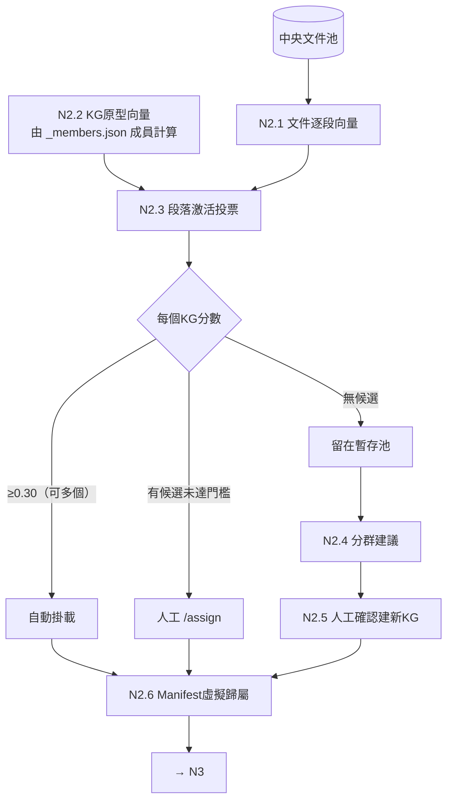

| 內部節點 | 目的 | 設計原理 | 程式位置 | 論文 |
|---|---|---|---|---|
| N2.1–2.3 段落激活投票 | 判斷屬於哪些 KG | 以段落投票，不用整份平均向量，避免長文件主題被稀釋；段落相似度 ≥0.68，且命中 ≥2 段或比例 ≥15%，單一偶然命中不算（報告53、SDD-51） | `classify_service.py::classify_document` | 03 §3.1.1／04 §4.3.2 |
| 三種處理路徑 | 依信心分流 | 高信心自動、中信心交給人、低信心不硬塞 | `classify_service.py::classify_all`、`routers/staging.py` | 04 §4.3.2 |
| N2.4–2.5 分群建新 KG | 未分配文件可能自成新主題 | UMAP＋HDBSCAN（不需預設群數）＋LLM 命名；只產生候選，使用者確認才建立 | `cluster_service.py` | 03 §3.1.1 §a／04 §4.3.2 |
| N2.6 Manifest 虛擬歸屬 | 多 KG 共用同一份文件 | 預設只原子更新 `_members.json`（暫存檔＋`os.replace`），失敗時回復；不搬移、不複製 | `classify_service.py::assign_document_to_kg` | 03 §3.1.1／04 §4.2.4 |

**規劃範圍內未完成**

| 項目 | 類型 | 說明 | 論文 |
|---|---|---|---|
| 分類門檻校準 | 🟡 | `0.30／0.68／2／15%` 都是工程預設值 | 05 §5.3.5 |
| 虛擬歸屬後接抽取的路徑 | 🟡 待實測 | 程式碼閱讀發現：`assign_document_to_kg()` 回傳中央文件池裡的原資料夾，`trigger_extraction()` 卻把它的上一層當 KG 資料夾，而 worker 到 `kg.folder_path` 找 `svo_index.json`，兩者可能對不上；`/staging/classify` 自動掛載後用的 `kg.folder_path/檔名` 在虛擬模式下也不存在。KG#4 由匯入腳本建立，不受影響。**尚未實測** | 04 §4.2.4 |

## 5. N3 前處理與 SVO 切塊（CHUNKREADY）🟡

**規劃**：從原文重新切出適合抽取的 chunk，並先做標準化：統一別名、代名詞換成實體、法規依條文切。
**未完成**：文件內別名登記（依賴 NER）。

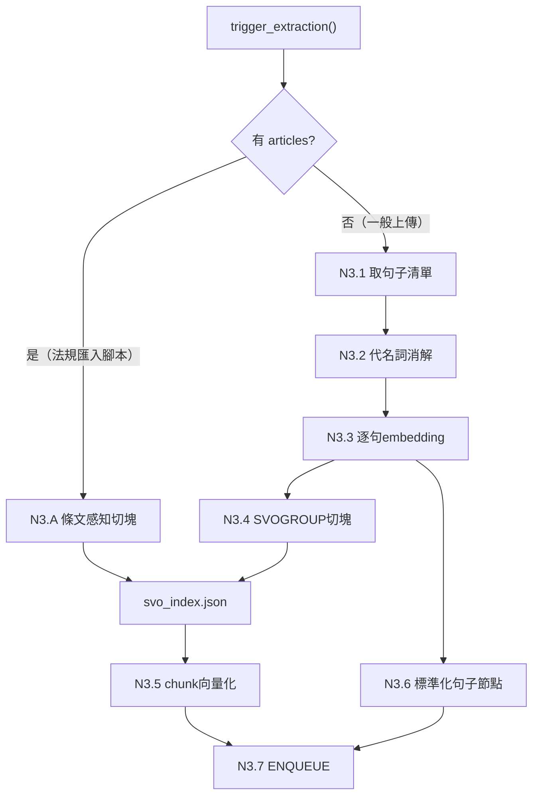

| 內部節點 | 目的 | 設計原理 | 程式位置 | 論文 |
|---|---|---|---|---|
| N3.A 條文感知切塊 | 法規一條＝一個自我完備的語意單位 | 不按句數切，所以沒有款項跨塊截斷；`article_no` 一路保留到 Fact→LawArticle（報告32 文獻） | `svo_chunking.py::ArticleAwareChunking`；呼叫端為根目錄 `import_leave_scheduling_dataset.py` | 03 §3.1.2／04 §4.4.1 |
| N3.1 句子清單 | 穩定的句子邊界 | 三層取得：快取 → 原文重切 → 重抓 URL | `ingestion_service.py::get_or_rebuild_sentences` | 03 §3.1.2 |
| N3.2 代名詞消解 | 「其、該、此」換成具體實體 | 詞庫觸發才呼叫 LLM；per-KG 排除詞（法規排除「其」「該」，實測 41% 句子被誤觸發） | `pronoun_resolution_service.py` | 03 §3.4 §a／04 §4.4.1 |
| N3.3、N3.5、N3.6 向量化 | chunk-RAG 與標準化 RAG 的索引 | 平行輸出，不影響抽取。⚠️ N3.6 的 Sentence 節點**目前沒有正式讀取端**（只寫不讀，見報告96 C1） | `svo_service.py::embed_svo_chunks/embed_standardized_sentences` | 03 §3.1.2 |
| N3.4 SVOGROUP 切塊 | 一般文件的抽取切塊 | 固定句數滑動窗＋重疊 | `svo_chunking.py::build_svo_chunks` | 03 §3.1.2 |
| N3.7 ENQUEUE | 每個 chunk 一筆抽取任務 | 昂貴的 LLM 抽取交給背景 worker；分派即觸發 | `task_queue_service.py::enqueue` | 03 §3.1.2／04 §4.6 |

**規劃範圍內未完成**

| 項目 | 類型 | 說明 | 論文 |
|---|---|---|---|
| 文件內別名登記（NER） | 🟡 | `entity_registry_service`、`entity_extraction_service` 與測試都在；spaCy 未安裝驗證，`trigger_extraction` 以 `mentions=None` 呼叫 | 03 §3.4 §a／04 §4.4.1 |
| 切塊設定接線（Header Anchoring） | 🟡 | `ChunkingConfig` 已實作；呼叫端未傳入真實 per-KG 設定 | 03 §3.1.2 補充、§3.9.7／04 §4.11 |
| 切塊策略持久化 | 📐 | `articles` 未持久化，產品路徑無法重建法規 KG（目前靠 `ArticleStructureLossError` 防呆） | 04 §4.4.1 |

## 6. N4 SVO 抽取 ✅

**規劃**：把每個 chunk 可靠地抽成三元組：可中斷、可恢復、不遺漏、不捏造數字、關係型別受控。

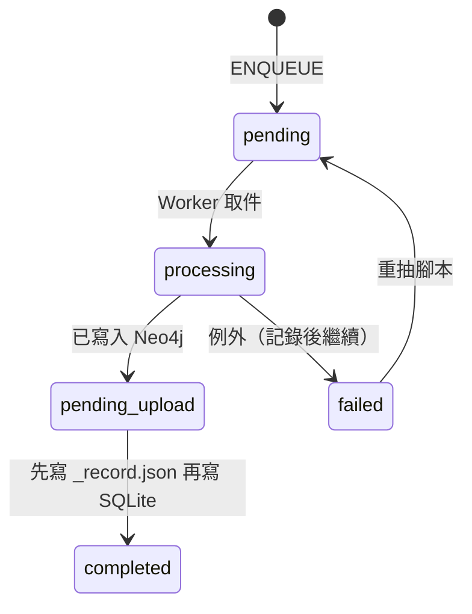

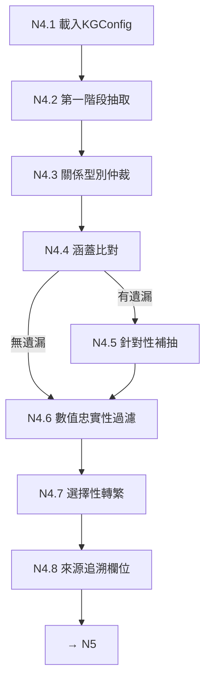

| 內部節點 | 目的 | 設計原理 | 程式位置 | 論文 |
|---|---|---|---|---|
| Worker 與佇列 | 長時間抽取可中斷、可恢復 | SQLite 是效能索引，`_record.json` 才是真實狀態；**先寫記錄檔再寫 SQLite**，避免中斷時重複建 Fact（報告21） | `task_queue_service.py`、`extraction_worker.py` | 03 §3.1.2／04 §4.6 |
| N4.2 第一階段抽取 | 句子 → 三元組 | 受控關係詞彙（ConceptNet 35 個核心關係＋per-KG 擴充）；規則7 拆附加規定、規則10 條件複述進每筆結果（報告65）；few-shot 由 domain pack 注入（報告66） | `svo_service.py::_svo_prompt/extract_svo_triples` | 03 §3.1.3／04 §4.4.2 |
| N4.3 關係型別仲裁 | 動詞歸到標準型別 | embedding 先判，灰色地帶才問 LLM；不認識的兜底為 `RELATED_TO` 並提案給 EXPAND（X3） | `_reconcile_rel_type` | 03 §3.1.3 §a／04 §4.4.2 |
| N4.4–4.5 完整性自我核對 | 保證召回率 | 「先涵蓋、後補充」：只在有遺漏時多花一次 LLM（報告19） | `extract_svo_triples_with_completeness_check` | 03 §3.1.3 |
| N4.6 數值忠實性 | 擋住捏造或錯綁的數字 | 量詞必須逐字出現在原文、且位於與主詞相關的子句（報告20、25） | `_filter_ungrounded_quantity_triples` | 03 §3.1.3 |
| N4.7 選擇性轉繁 | `qwen2.5:7b` 偶爾輸出簡體 | 只轉來源文件實際用過的字；另逐詞修正白名單抓不到的詞組 | `traditionalize_triples` | 04 §4.4.3 |
| N4.8 來源追溯 | 每筆事實能追回原文 | UUID5 決定性推導 | `document_record_service.py::document_uuid` | 03 §3.1.4 §c |

**規劃範圍內未完成**

| 項目 | 類型 | 說明 | 論文 |
|---|---|---|---|
| 條件分裂的完整修復 | 🟡 | 規則10 對 9 個 chunk 修好 4 個；`57-AGGR19` c85 仍未修；方向 B（句子層級 provenance）／C（qualifier）只有設計 | 03 §3.1.3 §b、報告65 |
| 抽取失敗可觀測性 | 🟡 | `_process_one()` 吞例外只標 `failed`，重抽腳本的「N/N 成功」需用 `reextraction_manifest.py` 核對 | 報告57 附錄C |

## 7. N5 知識寫入與實體治理 ✅

**規劃**：同一實體只留一個節點、同一事實只留一條邊但保留所有出處；讓事實讀起來自然，並能被語意檢索。

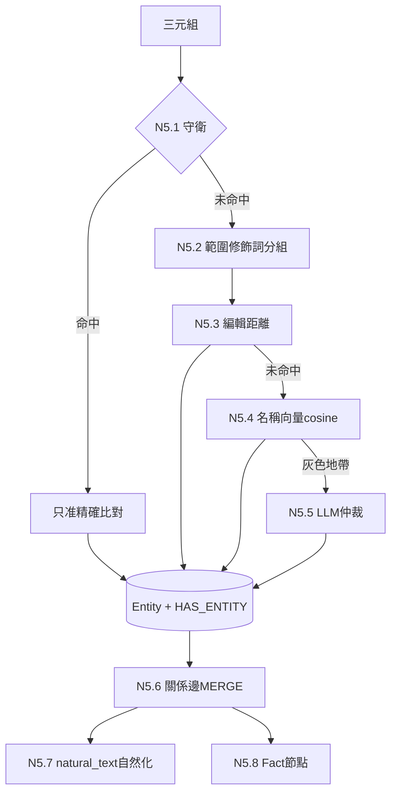

| 內部節點 | 目的 | 設計原理 | 程式位置 | 論文 |
|---|---|---|---|---|
| N5.1 守衛 | 防止「字面相似、數值不同」被誤併 | 真實案例：`四千元`併進`八千元`、三個年齡段併成一個；量詞、範圍比較、封閉列舉只准精確比對；token 可 per-KG 設定（報告76） | `resolve_entity_name` 前段 | 03 §3.4 §b／04 §4.5.1 |
| N5.2 範圍修飾詞分組 | 「每一型式」與「每增加一種型式」不合併 | 只縮小模糊比對候選 | `_has_scope_modifier` | 04 §4.5.1 |
| N5.3–5.5 DEDUP4＋ESCALATE | 同一實體只留一個節點 | 由便宜到昂貴：編輯距離 → cosine → LLM；跨文件標準名依獨立文件數頻率提升 | `merge_entity/resolve_entity_name` | 03 §3.4 §b／04 §4.5.1 |
| N5.6 事實層級去重 | 同一事實一條邊，來源不遺失 | MERGE 鍵不含來源，來源累積在 `citations_json` | `merge_triples_to_graph` | 03 §3.1.4／04 §4.5.2 |
| N5.7 自然化 | 讓 LLM 願意引用事實 | 報告22/23：生硬樣板會顯著降低引用率；寫入時生成；主詞或受詞空白時跳過（避免捏造）；量詞遺漏時退回樣板 | `_naturalize_triple` | 04 §4.4.3 |
| N5.8 Fact 節點 | 事實層級語意檢索單位 | 每筆 citation 一個 Fact（不平均，避免語意壓平）；per-KG 獨立索引；embedding 加法規代碼前綴 | `_create_fact_node` | 03 §3.1.4 §a／04 §4.5.3 |

**設計說明**：同一事實刻意有兩種表示。**關係邊**是去重後的事實，帶 `natural_text`，給 BFS 用；**Fact 節點**是逐筆證據，帶向量，給語意檢索用。

**規劃範圍內未完成**：範圍修飾短語的覆蓋率與全量驗證（🟡，00 表 RQ4b）；RQ4a／RQ4b 正式實驗（📐，05 §5.2.3）。

## 8. N6 知識圖譜儲存 ✅

**規劃**：定義圖的資料模型與索引，並明確規定哪一份資料是真實狀態來源。

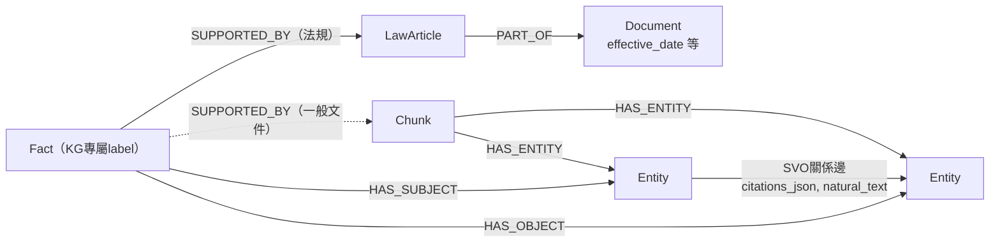

| 儲存 | 角色 | 論文 |
|---|---|---|
| 中央文件池（檔案系統） | **真實狀態來源**：原文、切塊、`_record.json`、`svo_index.json` | 04 §4.2.4、§4.3.1 |
| KG 資料夾 `_members.json` | 虛擬成員清單 | 04 §4.2.4 |
| SQLite `task_queue.db` | 效能索引，可由 `_record.json` 重建 | 04 §4.6 |
| Neo4j | 可重建的衍生物；`Entity(kg_id,name)` 唯一約束；embedding 維度守衛；另有 `Sentence` 節點（標準化 RAG） | 04 §4.2.2–4.2.3 |

## 9. N7 事實時序管理 📐（RQ5）

**規劃**（03 §3.5）：
- 同一 (主詞, 關係) 出現不同受詞時，要偵測為**新版本**：舊邊標記 `valid_to`（失效、不刪除），新邊標記 `valid_from`；
- 查詢時預設只回傳現行有效的邊，問題限定時間時依時間點篩選；
- 參考 T-GRAG、Graphiti、SAT-Graph RAG。

**為什麼需要**：目前事實去重的鍵是 (kg, s, rel_type, o)，新舊版本的受詞不同，就會**靜默並存、互相矛盾**，BFS 會把兩者一起撈出。

**現況**：沒有內部節點。
**可用零件**：`Document` 節點已存 `effective_date`／`effective_note`（N6，法規層級精度），但查詢端沒有讀取。
**規劃中的延伸**：結構化條件過濾查詢，例如「2026 年 7 月以後生效的法規」（03 §3.5，只記錄了方向）；GAP-07（Fact 層雙時態）屬於同一方向（報告63）。

## 10. N8 跨 KG 路由 📐（RQ2）

**規劃**（03 §3.2 §a）：問題向量化 → ConceptNode 向量索引 KNN 粗篩（Top-100）→ 逐 KG 算路由分數 → 門檻過濾 → 取前 `MAX_KG_PER_QUERY` 個 KG，再交給 N9。
**為什麼需要**：GraphRAG 預設單一大圖；多圖並存時，「該去哪個圖找」本身就是要驗證的問題（RQ2）。

**現況**：沒有內部節點。
- `services/concept_engine.py::route_kgs()` 是 stub；`chat()` 要求呼叫端指定 `kg_id`。
- **可用零件**：`repositories/concept_repo.py` 的 ConceptNode 向量索引與 KNN。
- 路由分數公式（v1 的 cosine × alignment × magnitude）待重新設計。

## 11. N9 KG 內檢索 ✅（RQ1、RQ6 查詢端）

**規劃**：在選定 KG 內，結合**具名實體錨點、事實語意相似度、圖結構鄰接**取回相關事實，並控制圖遍歷的扇出與延遲。

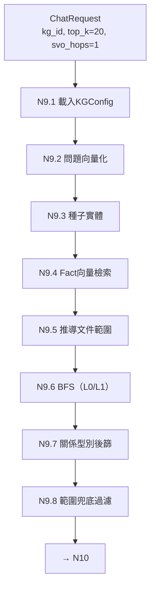

`retrieval_mode`：`both`（預設）／`fact_only`（跳過 N9.3、N9.6）／`bfs_only`（跳過 N9.4、N9.7）。

| 內部節點 | 目的 | 設計原理 | 程式位置 | 論文 |
|---|---|---|---|---|
| N9.3 種子實體 | BFS 起點 | 字面比對優先；找不到才用語意（實測 7/7 題字面失敗）；剔除度數 >100 的樞紐（報告27 L1） | `routers/agent.py::_find_seed_entities/_drop_hub_seeds` | 03 §3.2 §b／04 §4.7.1 |
| N9.4 Fact 向量檢索 | 語意層級補足字面比對 | 候選池 → (s,r,o) 去重 → 截斷；**範圍錨定種子文件**（報告41 L9 V1） | `svo_service.py::vector_search_facts` | 03 §3.2 §b／04 §4.7.1 |
| N9.5 文件範圍 | 限制 BFS 只走相關文件 | 種子優先；否則只取前 5 筆 Fact 推導（避免跨文件稀釋，報告25） | `_resolve_doc_scope` | 03 §3.2 §b |
| N9.6 BFS（L0/L1） | 沿圖取回相鄰事實 | **範圍下推進 Cypher**；先 1-hop、不足 8 筆才擴展；每種子上限 30；空結果退回無範圍 | `svo_service.py::bfs_query` | 03 §3.2 §b、§3.7／04 §4.7.1 |
| N9.7 關係型別連結 | 依問句意圖過濾 | 整句餵入，省一次 LLM | `resolve_query_relation_type` | 03 §3.2 §c |
| N9.8 範圍兜底 | Cypher fallback 時仍擋離題結果 | 三值邏輯＋歸零守衛 | `_filter_*_by_source_doc_ids` | 03 §3.5 補註 |

**規劃範圍內未完成**

| 項目 | 類型 | 說明 | 論文 |
|---|---|---|---|
| L2 向量引導剪枝（RQ6） | 🟡 | `bfs_query(prize_top_k=…)` 已實作，預設關；需接線、k 校準、消融 | 03 §3.7／04 §4.7.1 |
| 自適應檢索行為樹 | 🟡 | `query_classifier`、`adaptive_retrieval_service` 與測試都在；未接線；Type-C 規則對題庫過擬合 | 03 §3.2 §d |
| `hybrid`／`source_doc_cap` | 🟡 | `vector_search_facts` 參數，預設關；n=3 消融中 `hybrid` 反而讓品質下降 | 03 §3.2 §e–§f／04 §4.7.1 |
| 條文擴充 | 🟡 | `_expand_facts_by_article`，opt-in；S2 無淨增 | 報告62 T3、72 |

## 12. N10 上下文組裝 ✅

**規劃**：把檢索到的事實排成 LLM 容易使用的清單：去重、控制長度、最相關的放在注意力強的位置；長期規劃再補回來源原文（雙軌上下文）。

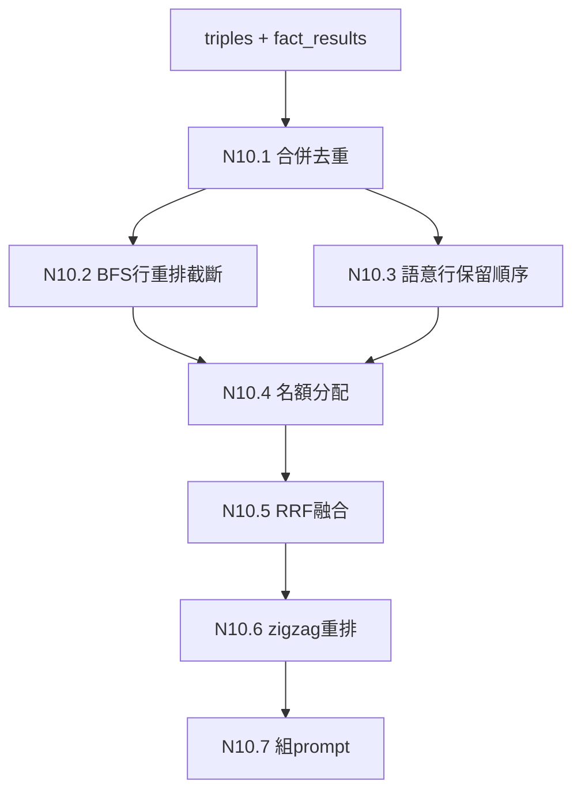

| 內部節點 | 目的 | 設計原理 | 程式位置 | 論文 |
|---|---|---|---|---|
| N10.1 合併 | 邊與 Fact 合成一份清單 | 優先自然語句；殘缺行過濾 | `_merge_fact_lines/_is_contentful_line` | 04 §4.7.3 |
| N10.2–10.4 分來源名額 | 不讓 BFS 鄰居洗掉語意排名 | 舊版整批重排曾把正解擠出前 18 名（報告25 發現6）；語意為主、BFS 保底 | `_arrange_fact_lines` | 03 §3.6／04 §4.7.3 |
| N10.5 RRF | 融合兩個排名 | Cormack 2009，`k=60` | `_rrf_order` | 同上 |
| N10.6 zigzag | 緩解 Lost-in-the-Middle | 只在清單大於 K 時套用（Jin 2025） | `_litm_reorder` | 同上 |
| N10.7 prompt | 加入領域指令 | `system_context` 來自 domain pack | `_build_prompt` | 03 §3.9 |

**規劃範圍內未完成**

| 項目 | 類型 | 說明 | 論文 |
|---|---|---|---|
| 來源 Chunk 回提／雙軌上下文（SDD-57） | 📐 | 只有 `retrieval_service._read_chunk_text` 零件；報告82 小樣本原型（3/10）不支持投入完整工程 | 03 §3.2 §g／04 §4.7.4、07 §7.4 GAP-S3-01 |
| 名額與截斷參數校準 | 🟡 | 參數已可配置，未校準；截斷門檻非單調（報告62 §10） | 報告25 §6 |

## 13. N11 生成與接地核對 ✅（RQ3 的生成端半套）

**規劃**：只輸出有依據的答案。使用者原則是**「寧願說不知道，也禁止亂回答」**；複合問題拆開回答。

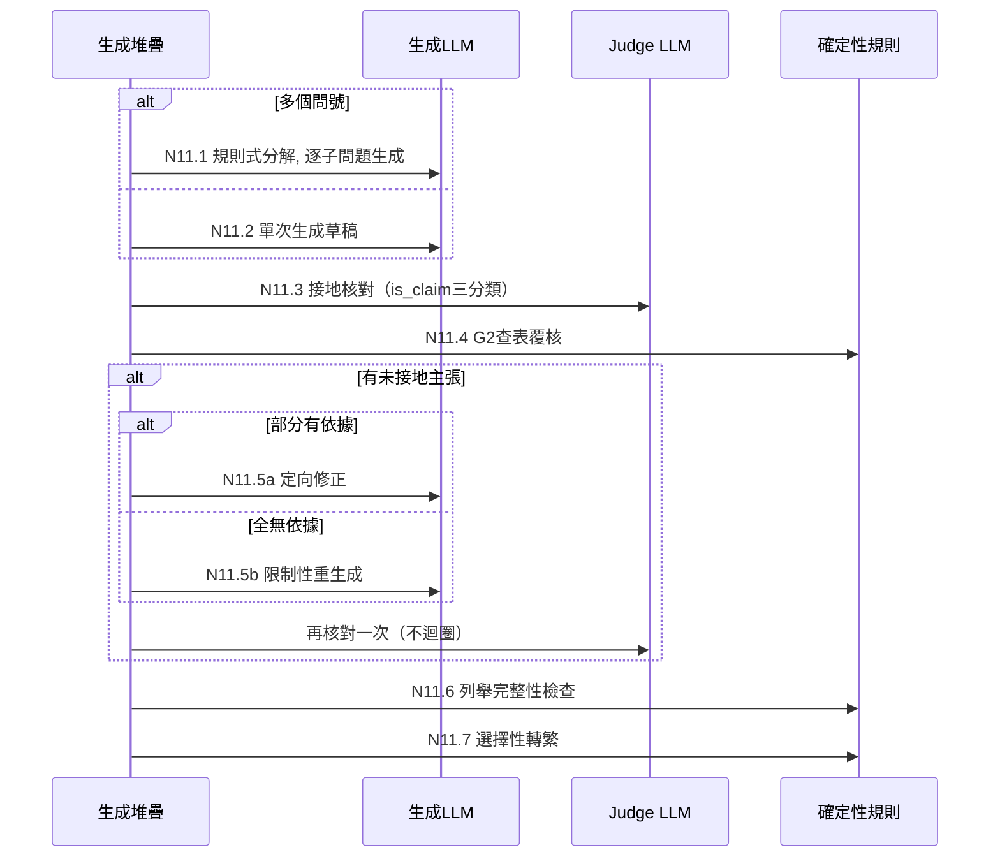

| 內部節點 | 目的 | 設計原理 | 程式位置 | 論文 |
|---|---|---|---|---|
| N11.1 分解 | 小模型一次答多題容易自相矛盾 | 規則式按問號切分，最多 6 個，零額外 LLM | `_split_into_subquestions` | 03 §3.6／04 §4.7.3 |
| N11.3 接地核對 | 抓出「證據有、生成仍捏造」 | 使用者看不到未核對版本（方案 B）；judge 可獨立於生成模型 | `verification_service.py::verify_fact_grounding` | 03 §3.6／04 §4.7.2 |
| N11.4 G2 查表覆核 | 數值區間判斷不交給 LLM | 確定性規則（方案 E） | `interval_lookup_service.py` | 04 §4.7.3 |
| N11.5 修正或重生成 | 修掉未接地內容 | 部分有依據走定向修正（不把對的改壞），否則整份重生成；只做一次 | `_targeted_correction/_build_constrained_prompt` | 04 §4.7.3 |
| N11.6 列舉完整性 | 問「所有」時不漏級距 | 偵測層級族群，缺漏就補 | `_missing_tier_members` | 04 §4.7.3 |

**共用堆疊**：`_generate_from_context_lines()` 由 `chat()` 與 harness 的 B0/B1/B2 臂共用（03 §3.8 單一變因控制）；baseline 模式不套用分解、定向修正與列舉檢查。

**規劃範圍內未完成**：確定性接地守衛（日期起算、條號、數值區間、禁止斷言）已實作，但**只用於 N13 評分**，沒有接進 `chat()`（🟡，03 §3.6 §確定性守衛）。

## 14. N12 自我精煉迴圈 📐（RQ3）

**規劃**（03 §3.6 流程圖）：生成候選答案並評信心 → 信心不足且未達輪數上限時，**回補檢索**（擴大 BFS 跳數或補相鄰 Chunk）→ 合併新舊 context → 再生成，直到信心達標，或達上限時標註低信心。
**為什麼需要**：單輪檢索不完整時，只在生成端修正，無法補回缺少的證據。

**現況**：沒有內部節點。N11 只做到「對同一份 context 核對與重寫一次」，**完全沒有再檢索**。信心評分、回補分支、多輪收斂都未實作。
**相關經驗**：B2（N13）的 agentic 反思迴圈是 chunk-RAG 上的類似機制。報告94 發現：證據不存在時，它只會一直擴大搜尋，反而引入雜訊（`57-CANARY1`），所以 N12 設計時需要「查無證據本身就是答案」的終止條件。

## 15. N13 評測 Harness ✅

**規劃**：在凍結條件（題庫雜湊、模型、KG）下，公平比較各檢索方法；把檢索品質和生成品質分開量測。

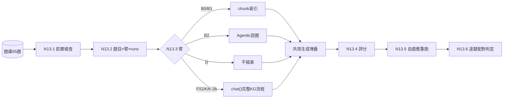

| 臂 | 別名 | 檢索前端 | 執行狀況 | 論文 |
|---|---|---|---|---|
| D | — | 無（純 LLM） | 已跑 | 05 §5.2.2 |
| B0 | M1 | chunk dense | 已跑（S3） | 05 §5.2.1、06 §6.1 |
| B1 | M2 | chunk dense＋BM25，RRF | 已跑（S3，**主要比較對象**） | 05 §5.4.1、06 §6.2.1 |
| B2 | — | B1＋agentic 迴圈 | 全量 pilot n=41（06 尚未收錄，見 §18） | 05 §5.4.1 |
| K | M4 | KG 完整流程 | 已跑（S0–S3） | 06 §6.1 |
| F／G／K-2b | M3／—／— | fact_only／bfs_only／關閉重生成 | 已實作，42 題凍結規模**未跑** | 05 §5.2.2 |

| 內部節點（評分） | 做法與設計原理 | 程式位置 | 論文 |
|---|---|---|---|
| 原子準確率 | 答案逐字包含法規原文 `exact_span` 才算命中，未命中才請 judge 做語意 fallback；真值取自原文，不讓 LLM 生成參考答案（FActScore） | `atomic_scorer.py` | 05 §5.5.1 |
| 拒答題 | 關鍵字判定；命中陷阱主張判失敗 | 同上 | 05 附錄A |
| 確定性守衛 | 失敗只擋 `is_perfect`，保留原始覆蓋率 | `deterministic_guard_service.py` | 03 §3.6 |
| Context Quality | Recall／SNR／Chain Completeness，檢索與生成因果解耦 | `lineage_tracker.py` | 05 §5.5.1a |
| 範圍稽核 | 新舊法、角色歸屬錯置 | `claim_scope_auditor.py` | 報告84/85 |
| 自適應重跑 | single_pass／stable_pass／stable_fail | `adaptive_repeat.py` | 報告62 |

**規劃範圍內未完成**：F／G／K-2b 在凍結規模下的消融（🟡）；B2 正式化（🟡：反思加拒答終止條件、`_TIMEOUT`、×3 穩定性）；timeout 排除統計與評分器 v2（🟡，待裁示）。
**量測限制**：偽陰性下界 ≥7.2%、偽陽性下界 ≥3.4%；達標題數 ±2 屬噪音；timeout 被記為 0 分。

## 16. 橫切節點

| 節點 | 規劃目的 | 狀態 | 已實作內容 | 未完成 | 論文 |
|---|---|---|---|---|---|
| X1 設定層 | 門檻、守衛、關係擴充、prompt 領域指令、few-shot 可 per-KG／per-domain 覆寫 | 🟡 | 四層合併、深凍結、golden test；查詢端與抽取 few-shot 已接線（**通用骨架＋領域參數注入**） | 切塊設定未由呼叫端傳入；逐階段評分閘控的可執行 eval suite | 03 §3.9／04 §4.10 |
| X2 Provider 層 | 抽換 LLM／embedding | ✅ | 5 種 LLM、3 種 embedding；Ollama `temperature=0`＋`seed`；維度守衛 | `_TIMEOUT=600s` 寫死（報告94） | 04 §4.1、§4.2.3 |
| X3 KG 管理與治理 | 生命週期、未知型別治理、資料修補 | ✅ | EXPAND 提案→審核→回填；資料修補一律 preflight → `--apply` → compare-and-set | — | 03 §3.1.3 §a／04 §4.6 |

---

## 17. 目標註記（尚未規劃成大節點）

以下是已經提出、但**還沒有規劃成大節點**的目標，只做註記，不代表會做。

| # | 目標 | 可能掛在哪裡 | 目前狀態與依據 | 出處 |
|---|---|---|---|---|
| G1 | 多模態版面感知表格解析（方案二） | N1 | 未實作；LayoutLM 只支持廣義動機 | 07 §7.4 |
| G2 | 社群自動導讀與 FAQ（方案四） | 新節點（圖分析） | 未實作；v2 查無社群偵測機制 | 07 §7.4、報告91 |
| G3 | 階層式社群摘要全局檢索（方案七） | 與 N9 並列的另一種檢索 | 未實作；參考 Microsoft GraphRAG Global Search | 07 §7.4 |
| G4 | 人類反饋調整邊權重（方案八） | N6／N9 | 未實作；缺乏文獻支撐 | 07 §7.4 |
| G5 | 圖層級增量更新（只更新受影響子圖） | N4／N5 | 未實作；現行是整份文件重抽 | 04 §4.9 |
| G6 | 同文件內二次檢索（`26-Q5` 型：先鎖文件、再找文件內事實） | N9 | 03 §3.2 §e 結論指出現有排序改良無法解決，需要新設計 | 03 §3.2 §e、07 §7.4 |
| G7 | 結構化條件過濾查詢（依施行日、類別篩選） | N7／N9 | 只記錄方向 | 03 §3.5 |
| G8 | 評分器的獨立人工標註流程 | N13 | 報告88 只人工判定 2 題，其餘 7 題落差未複核 | 07 §7.4 GAP-S3-02 |
| G9 | 跨領域 domain pack 有效性 | X1 | 只有台灣勞動法規一個驗證實例 | 03 §3.9 |
| G10 | 產品化（多 KG 併發、多 Worker 壓力、部署、完整前端） | 全域 | 04 §4.8 前端只完成骨架；未做壓力評估 | 04 §4.6、§4.8、`ARCHITECTURE.md` |
| G11 | GAP-06 Relator 多方關係載體 | N5／N6 | **報告63 查證其診斷與 KG 實查相反**；報告72 顯示 0 題需要；不建議投入 | 報告63、72 |

---

## 18. 論文對齊檢查（論文與程式不一致之處）

依專案慣例（先討論、確認後才改），**本次只列出，未修改論文**。

| # | 論文位置 | 論文目前寫法 | 程式／最新進度 | 建議處理 |
|---|---|---|---|---|
| 1 | 06 §6.1、§6.2.1、§6.4；07 §7.3；00 追溯表 RQ1 列 | 「B2 尚未實作／未完成」 | B2 已實作（報告93），全量 pilot n=41（報告94） | 改寫為「B2 已完成全量 pilot（非 ×3 正式評估）」，補上數字與 `57-CANARY1` 弱點 |
| 2 | 04 §4.7.2 | 問答順序是「種子 → BFS → 關係型別連結與 Fact 語意檢索」 | 實際是 N9.3 → N9.8（03 §3.2 §b 已是新版） | 以 03 §3.2 §b 與本文 §11 改寫 |
| 3 | 04 §4.10、00 追溯表第 73 列 | 「第 3b 步（`_svo_prompt` few-shot）尚未完成」 | `svo_fewshots` 已接進 `extract_svo_triples()`（報告66） | 更新為已完成 |
| 4 | 05 §5.4 | 「測試資料集（待決定）」、30 題、TODO | 題庫 65 題（`77c293ed…`），正式評測使用 42 題 | 改寫為現行題庫說明，舊方案移入歷史註記 |
| 5 | 04 §4.2.4、§4.3.2 | Manifest 描述正確 | 未提到與 `trigger_extraction` 路徑可能不一致 | 待 §4 疑似斷點實測後決定 |
| 6 | 論文沒有「大節點」層級的總覽 | 03 章是依方法主題分節 | 本文 §2 的大節點表可作為 03／04 章開頭的總覽圖 | 可考慮納入 03 §3.1 系統總覽（待裁示） |
| 7 | 根目錄 `CLAUDE.md`（非論文） | 「services 核心演算法皆為 stub」 | 核心已大量實作 | 可擇期更新 |

---

## 19. 結構觀察（本階段不重構，僅記錄）

| # | 觀察 | 涉及節點 |
|---|---|---|
| 1 | N9、N10、N11 都寫在 `routers/agent.py`（約 1,700 行，非空行）內；harness 需 import 其私有函式，或透過 `_drain_chat()` 走完整個 `chat()` | N9–N11、N13 |
| 2 | `services/svo_service.py`（約 3,400 行，非空行）橫跨 N3 編排、N4、N5、N9 與十餘個 backfill 維護函式 | N3–N5、N9、X3 |
| 3 | 法規 KG 的建立入口是根目錄腳本，產品路徑無法重建 | N2、N3 |
| 4 | 多個 🟡 零件預設關閉、長期未接線，讀程式時不易分辨哪些真的在跑 | N9、N11 |
| 5 | 狀態分散在檔案系統、SQLite、Neo4j 三處，重建規則寫在 docstring | N6 |

---

## 20. 進度與未決事項

### 20.1 進度

- 13 個大節點中：✅ 8 個（N2、N4、N5、N6、N9、N10、N11、N13）、🟡 2 個（N1、N3）、📐 3 個（N7、N8、N12）。
- KG#4 抽取佇列 3,307/3,307 completed；報告71 natural_text 型別洩漏處理完畢（49 筆已 backfill、2 筆待處理、47 筆因欄位缺漏安全跳過）。
- 版控：`origin/worktree-sdd-retrieval-comparison` 與本機同步；領先 `origin/master`，尚未合併。

### 20.2 未決事項（待使用者裁示，不是自動下一步）

1. **論文對齊**：§18 的 #1–#4、#6 要不要依建議修改論文（建議先改 #1 B2 與 #2 檢索順序）。
2. **疑似斷點實測**：§4 的虛擬歸屬與抽取路徑問題。
3. **B2 後續**：反思加入拒答終止條件、`_TIMEOUT`、×3 穩定性；或直接收斂寫入論文。
4. **是否合併進 master**。
5. **報告71 剩下的 2 筆** natural_text。
6. §17 的目標註記要不要升格成大節點（需另外討論與規劃）。
8. **整體目標、BT＋SM 工作流設計與程式整理方案**：見[報告97](97_專案目標與BT_SM工作流設計.md)；報告總索引見 [00_報告索引](00_報告索引.md)。
7. **程式流程登記缺漏**：見[報告96](96_程式流程與論文03_04登記缺漏盤點.md)（9 項在跑但未登記、評測實作缺章節、7 項只寫不讀或無呼叫者、維護程序未登記）。

---

## 21. 名詞對照表

### 21.1 系統與資料

| 名詞 | 意義 |
|---|---|
| 大節點／內部節點／目標註記 | 見 §0 |
| KG#4 | 主要正式 KG，`236903cf-055a-40a8-8923-b9d06601f3b7`（勞動法規） |
| 中央文件池／SSOT | 文件實體唯一存放處；KG 只以 `_members.json` 虛擬登記 |
| SVO 三元組 | (主詞, 動詞, 受詞)＋`rel_type`＋型別 |
| 關係邊 | Entity 間帶受控型別的邊；以 (s, rel_type, o) 去重，來源累積在 `citations_json` |
| Fact | 每筆 citation 一個的證據節點，帶 `fact_text` 與向量 |
| natural_text | 關係邊上由 LLM 改寫的自然語句 |
| LawArticle | 法規條文節點；法規 Fact 的 `SUPPORTED_BY` 指向它 |
| domain pack | 領域設定包（`taiwan-labor-law`、`generic`） |
| CHUNKREADY／ENQUEUE／DEDUP4／ESCALATE／EXPAND | 03 章 Behavior Tree 節點名，對應 N3、N3.7、N5.3、N5.5、X3 |

### 21.2 評測

| 名詞 | 意義 |
|---|---|
| D／B0／B1／B2／F／G／K／K-2b | 評測臂，見 §15 |
| M1–M4 | 臂別名：M1=B0、M2=B1、M3=F、M4=K |
| S0／S1(K1b)／S2(K2)／K3／S3 | 報告72：S0＝K 基準 13/42；K1b＝top_k 40（不採用）；K2＝條文擴充（不採用）；K3＝組合（否決）；S3＝chunk-RAG 對照 |
| Type-A～E | 題目場景分類；Type-E＝應拒答的金絲雀題 |
| exact_span | 取自法規原文的原子真值字串 |
| 規則 R／v2 評分器 | 評分器敏感度分析用的確定性規則，只當診斷工具 |
| bank hash | 題庫 sha256；現行 `77c293ed…`，舊版 `404cde9f…`、`23f8c06f…` |

### 21.3 報告索引（依主題）

| 主題 | 報告 |
|---|---|
| 早期架構藍圖（RQ 編號為舊版） | 01、03、08 |
| 抽取管線 | 11、19、20、21、25、32、65、66 |
| 生成端 | 16、22–24 |
| 檢索與剪枝 | 27、41、43 |
| 中央文件池與分類 | 51、53 |
| 設定分層 | 33、76、77 |
| 評測架構 | 36、39、57、62、68–69、72 |
| RQ1 結果與診斷 | 78–83、88、93–94 |
| 外部評論查證（含 GAP-06/07） | 63 |
| 文獻查證 | 61 |
| 資料修補 | 67、71、90、92 |
| 版控與交接 | 60、70、89 |
| **本文件** | **95：節點流程總覽** |
