# 報告95：專案節點流程總覽與設計說明

> **日期**：2026-09-28（v2：改為「已完成／規劃中」兩部分，並逐節點對齊論文章節）
> **基準 commit**：`0b9a24b`（`worktree-sdd-retrieval-comparison`）
> **定位**：以「節點」為單位說明專案目前**實際在跑**的流程、每個節點的設計原理與目的，以及還在規劃中的節點。用途：
>
> 1. **介紹專案**：§1 一頁版＋§2 大節點地圖。
> 2. **與論文對齊**：每個節點都標出對應的論文章節（03 方法／04 實作／05–07 評估與結果）；§16 列出論文與程式不一致之處。
> 3. **為日後結構整理留紀錄**：§17 只記錄結構觀察，**本階段不重構**（使用者 2026-09-28 裁示）。
>
> **判定原則**：一律以程式碼為準，不以論文或舊報告的描述為準。
> 本文件不取代 [HANDOVER.md](../../HANDOVER.md)（進度權威來源）與 [00_研究追溯對映表](../論文/00_研究追溯對映表.md)（文獻↔方法↔程式追溯），而是補上兩者之間缺少的「流程視角」。

---

## 0. 閱讀指引

### 0.1 節點層級

| 層級 | 名稱 | 意義 | 本文編號 |
|---|---|---|---|
| L0 | **大節點** | 一個能獨立說清楚「負責什麼」的處理階段 | `N1`～`N10`；橫切節點 `X1`～`X3` |
| L1 | **內部節點** | 大節點內的處理步驟，有明確輸入／輸出 | `N3.1`、`N3.2`…… |
| L2 | 函式 | 實作內部節點的程式入口 | 節點卡的「程式位置」欄 |

### 0.2 狀態分類（與論文 00 追溯表的標記一致）

本文分成兩大部分：

| 部分 | 標記 | 定義 | 對應 00 追溯表 |
|---|---|---|---|
| **Part A 已完成** | ✅ | 程式已接進正式流程、預設啟用、在運作中 | 「已實作」 |
| **Part B 規劃中** | 🟡 | 零件與測試已存在，但**預設關閉或未接進主流程**，或端到端效果未驗證 | 「部分實作」 |
| | 📐 | 論文有設計，**沒有可執行程式**（或只有 stub） | 「設計預留」 |

> 注意：✅「已完成」指**工程機制已上線**，不等於「研究問題已驗證」。例如 N5 的實體守衛是 ✅，但 RQ4b 的正式實驗仍屬規劃中。

### 0.3 節點卡欄位

**目的**（為什麼存在）｜**設計原理**（為什麼這樣做、避開什麼失敗模式、依據哪份報告或文獻）｜**程式位置**｜**論文**（03 方法 § ／ 04 實作 §）

### 0.4 圖例

Part A 的圖只畫已完成節點。規劃中節點統一放在 Part B 的圖中，用虛線表示。

---

## 1. 專案介紹（一頁版）

### 1.1 專案是什麼

**World Knowledge Graph RAG** 把文件轉成 SVO（主詞–動詞–受詞）知識圖譜，再以圖譜為基礎回答問題。它同時是：

- **論文實作載體**：研究「知識圖譜在什麼條件下能改善 RAG 問答」。
- **產品平台**：網頁＋軟體形態、可支撐產品線（後端 FastAPI＋Neo4j＋Ollama 等 LLM provider，前端 Vanilla JS）。

主要資料集是**台灣勞動法規**（KG#4：64 份文件、3,307 個抽取 chunk、Fact 約 16,826 筆、Entity 約 12,296 個）。

### 1.2 研究問題與進度（論文 01 §1.2、06 §6.2）

| RQ | 問題 | 已完成 | 規劃中 |
|---|---|---|---|
| **RQ1** | KG 檢索 vs chunk-RAG | 完整比較實驗閉環（B0/B1/K），B2 全量 pilot（n=41） | B2 的 ×3 正式穩定性評估 |
| RQ2 | 多 KG 路由 | ConceptNode 向量索引 | 路由本身（`route_kgs()` 是 stub） |
| RQ3 | 自我精煉降低幻覺 | 接地核對＋一次重生成 | 多輪「評估→改變檢索→再評估」迴圈 |
| RQ4a | 受控關係詞彙 | 詞彙、仲裁、EXPAND、per-KG 擴充 | 正式消融實驗 |
| RQ4b | 實體指代與別名 | 守衛、跨文件別名、代名詞消解 | NER 上游接線、端到端實驗 |
| RQ5 | 事實時序 | Document／LawArticle 有日期中繼資料 | 有效期間語意、時間條件查詢 |
| RQ6 | Hub Node 剪枝 | L0/L1（查詢端） | L2 接線與消融 |

### 1.3 RQ1 結論（誠實版）

- **K（完整 KG）vs B1（強 chunk-RAG）**，42 題、凍結條件：
  - 原評分器：13/42 對 21/42，落後 8 題（exact McNemar `p=0.021`）；
  - 規則 R 敏感度分析：16/42 對 22/42（`p=0.109`，不顯著）；
  - 報告88 人工裁決後，落差校正為 −7 題。
  - **方向上沒有顯示 KG 優於 chunk-RAG。**
- **B2（Agentic RAG）**，n=41（`atomic_accuracy` 平均）：B0 0.649、B1 0.693、B2 0.681；約 3 倍 LLM 呼叫；維持 optional。
- **論文定位**：診斷 KG 在什麼條件下有／無增益（報告61）；KG 的角色收斂為「上下文精煉與路由者」（報告57 §7）。

### 1.4 一句話講完整個系統

> 文件 → 中央文件池與分類 → 切塊與標準化 → LLM 抽出 SVO 三元組 → 實體對齊後寫進 Neo4j（邊＋自然語句＋Fact 向量節點）→ 問答時以種子實體＋Fact 向量檢索＋BFS 取回事實 → 排列成事實清單 → LLM 生成 → 接地核對，不通過就修正或重生成 → 串流回傳；評測 harness 以同一套生成堆疊比較 KG 與 chunk-RAG。

---

## 2. 大節點地圖與論文章節總對照

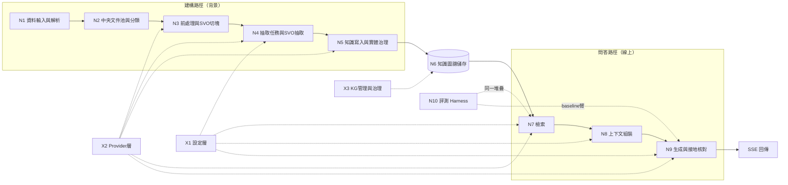

| 節點 | 目的 | 03 方法 | 04 實作 | 05–07 評估／結果 | RQ |
|---|---|---|---|---|---|
| N1 資料輸入與解析 | 各種來源 → 純文字 | §3.1.1、§3.1.5（多型態，規劃中） | §4.3.1、§4.0.1 | — | 產品能力 |
| N2 中央文件池與分類 | 決定文件掛到哪些 KG | §3.1.1、§3.1.1 §a | §4.2.4、§4.3.1–4.3.2 | §5.3.5（門檻校準，規劃中） | 產品能力 |
| N3 前處理與SVO切塊 | 原文 → 可抽取的 chunk | §3.1.2（含 Header Anchoring）、§3.4 §a、§3.9.7 | §4.4.1、§4.11 | §5.3（chunk size） | RQ4b 基礎 |
| N4 抽取任務與SVO抽取 | 可恢復地抽出三元組 | §3.1.2、§3.1.3（含 §a EXPAND、§b 已知限制） | §4.4.2、§4.6 | — | RQ4a 基礎 |
| N5 知識寫入與實體治理 | 對齊、去重、寫圖、自然化、Fact | §3.1.4（§a–§c）、§3.4 §b | §4.4.3、§4.5 | — | RQ4b 基礎 |
| N6 知識圖譜儲存 | 資料模型與索引 | §3.1.4 | §4.2.2–4.2.3 | — | — |
| N7 檢索 | 取回與問題相關的事實 | §3.2 §a–§g、§3.7 | §4.7.1–4.7.2 | §5.2、§6.2.1 | RQ1／RQ2／RQ6 |
| N8 上下文組裝 | 事實排成 LLM 好用的清單 | §3.6（排序融合） | §4.7.3 | §5.5.1a（Context Quality） | RQ1 |
| N9 生成與接地核對 | 有依據的答案 | §3.6（含分解、確定性守衛） | §4.7.3 | §5.6.1 | RQ3 |
| N10 評測 Harness | 固定條件下比較 | §3.8 | — | §5.2、§5.4–5.6、§6、§7 | RQ1 |
| X1 設定層 | per-KG／per-domain 覆寫 | §3.9 | §4.10 | §5.3.6 | 工程決策 |
| X2 Provider 層 | 抽換模型供應商 | — | §4.1、§4.2.3 | — | — |
| X3 KG 管理與治理 | 生命週期、型別治理、資料修補 | §3.1.3 §a/§a-1、§3.1.4 §b | §4.5.2、§4.6 | — | RQ4a |

---

# Part A　已完成（運作中）

## 3. N1 資料輸入與解析 ✅

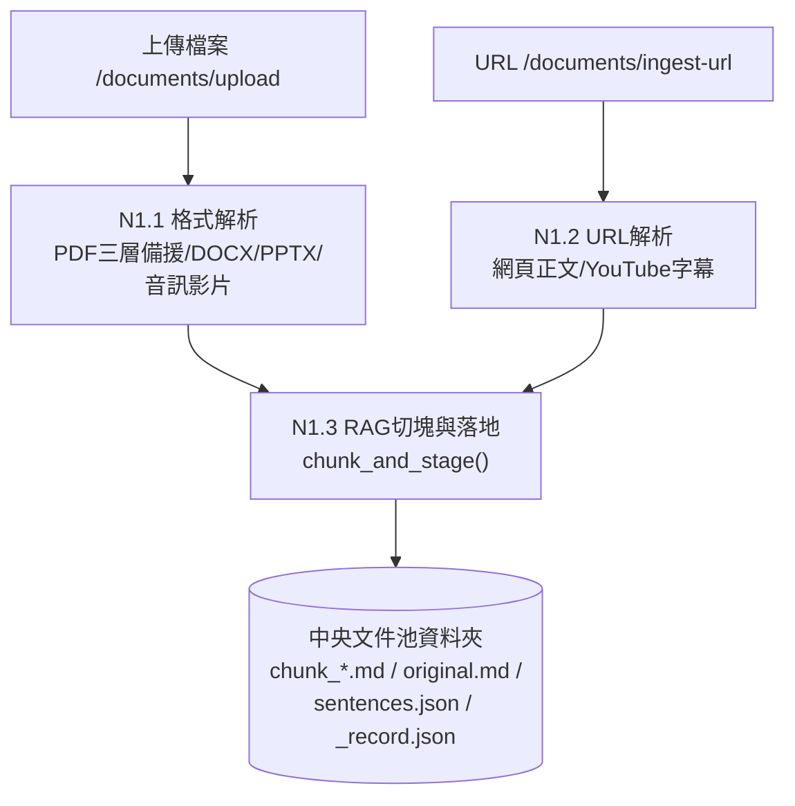

| 節點 | 目的 | 設計原理 | 程式位置 | 論文 |
|---|---|---|---|---|
| N1.1 格式解析 | 檔案 → 純文字 | CPU-bound 解析放進 thread pool，不阻塞 FastAPI 事件迴圈；PDF 三層備援處理掃描檔 | `ingestion_service.py::parse_document`、`parser/core.py` | 03 §3.1.1／04 §4.3.1 |
| N1.2 URL 解析 | 網頁／影片 → 純文字 | 同上 | `ingestion_service.py::parse_url_service` | 同上 |
| N1.3 RAG 切塊與落地 | 建立文件資料夾（**單一實體來源 SSOT**） | **RAG 切塊與 SVO 切塊刻意分開**：這裡的 chunk 只給分類與 chunk-RAG 用，抽取另外從 `original.md` 重切（N3）；原文與句子清單先存下來，下游不必重新解析、句子邊界也不漂移；撞名直接拒絕，避免靜默覆寫 | `ingestion_service.py::chunk_and_stage`、`parser/chunk_writer.py` | 03 §3.1.1／04 §4.3.1 |

## 4. N2 中央文件池與分類 ✅

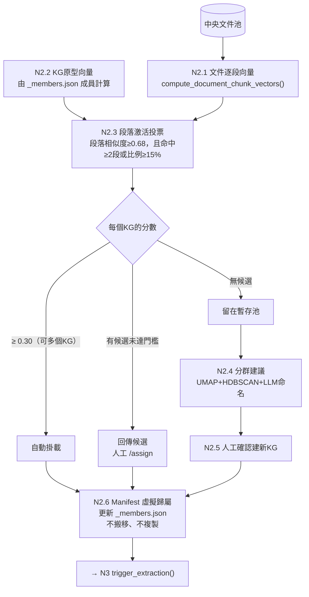

| 節點 | 目的 | 設計原理 | 程式位置 | 論文 |
|---|---|---|---|---|
| N2.1–2.3 段落激活投票 | 判斷文件屬於哪些 KG，**可同時屬於多個** | 以段落為單位投票，不用整份文件平均向量，避免長文件主題被稀釋；需多段命中，單一偶然命中不算（報告53、SDD-51） | `classify_service.py::classify_document/_classify_chunk_votes_for_kgs` | 03 §3.1.1／04 §4.3.2 |
| 三種處理路徑 | 依信心分流 | 高信心自動、中信心交給人、低信心不硬塞（human-in-the-loop） | `classify_service.py::classify_all`、`routers/staging.py` | 04 §4.3.2 |
| N2.4–2.5 分群建新 KG | 未分配文件可能自成新主題 | HDBSCAN 不需預設群數；只產生**候選**，使用者確認後才建立 | `cluster_service.py`、`routers/staging.py` | 03 §3.1.1 §a／04 §4.3.2 |
| N2.6 Manifest 虛擬歸屬 | 同一份文件可掛多個 KG，且只有一份實體 | 預設 `ENABLE_VIRTUAL_MANIFEST_ASSIGN=True`：只原子更新 `_members.json`（暫存檔＋`os.replace`），失敗時回復；`move_physical=True` 僅保留相容 | `classify_service.py::assign_document_to_kg` | 03 §3.1.1／04 §4.2.4 |

**已知問題（程式碼閱讀發現，未實測）**：虛擬歸屬模式下，`assign_document_to_kg()` 回傳的是中央文件池裡原本的資料夾，但 `trigger_extraction()` 會把「資料夾的上一層」當成 KG 資料夾，而 worker 是到 `kg.folder_path` 找 `svo_index.json`，兩者可能對不上。另外 `/staging/classify` 自動掛載後，是用 `kg.folder_path / 檔名` 當抽取路徑，虛擬模式下這個路徑並不存在。KG#4 是由匯入腳本建立（見 N3），沒有經過這條路徑，所以正式資料不受影響。**需要實測確認是否真的會斷**，列入 §18 未決事項。

## 5. N3 前處理與 SVO 切塊（CHUNKREADY）✅

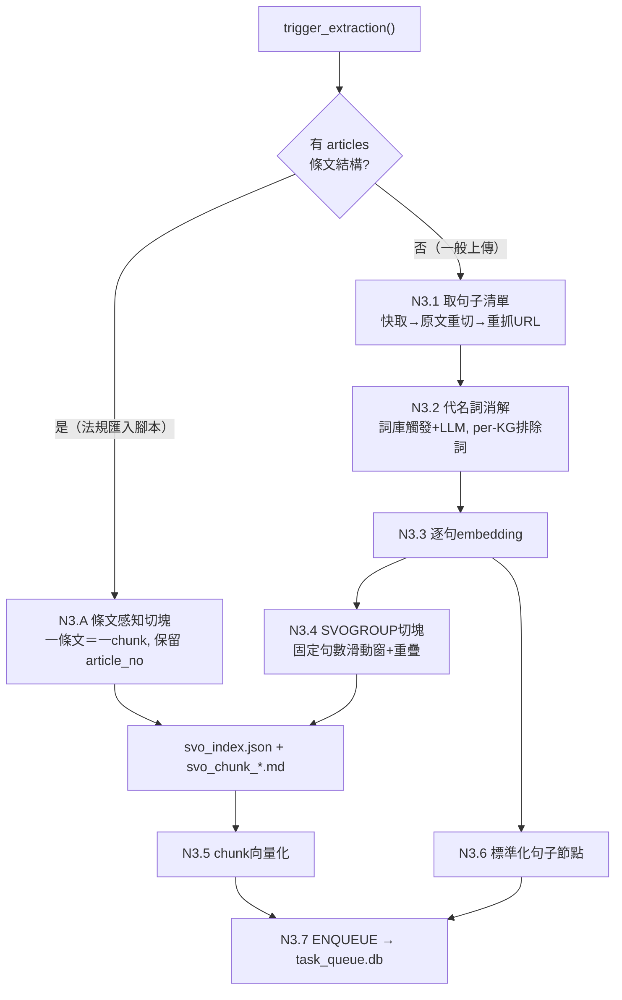

| 節點 | 目的 | 設計原理 | 程式位置 | 論文 |
|---|---|---|---|---|
| N3.A 條文感知切塊 | 法規一條就是一個自我完備的語意單位 | 不做句數切分，所以沒有「款項跨塊截斷」；`article_no` 一路保留到 Fact→LawArticle（報告32 文獻：Prior 2026 等） | `svo_chunking.py::ArticleAwareChunking`；呼叫端是根目錄 `import_leave_scheduling_dataset.py` | 03 §3.1.2／04 §4.4.1 |
| N3.1 句子清單 | 穩定的句子邊界 | 三層取得；上傳檔的暫存檔已刪，第三層只救得回 URL 來源 | `ingestion_service.py::get_or_rebuild_sentences` | 03 §3.1.2 |
| N3.2 代名詞消解 | 「其、該、此」換成具體實體，提高抽取準確度 | 詞庫觸發才呼叫 LLM；per-KG 排除詞（法規排除「其」「該」，實測 41% 句子被誤觸發） | `pronoun_resolution_service.py` | 03 §3.4 §a／04 §4.4.1 |
| N3.3、N3.5–3.6 向量化 | chunk-RAG 與標準化 RAG 的索引 | 平行輸出，不影響抽取 | `svo_service.py::embed_svo_chunks/embed_standardized_sentences` | 03 §3.1.2 |
| N3.4 SVOGROUP 切塊 | 一般文件的抽取切塊 | 固定句數＋重疊（預設 `sliding_window`） | `svo_chunking.py::build_svo_chunks` | 03 §3.1.2、§3.9.7 |
| N3.7 ENQUEUE | 每個 chunk 一筆抽取任務 | 昂貴的 LLM 抽取交給背景 worker，請求立即返回；分派即觸發 | `task_queue_service.py::enqueue` | 03 §3.1.2／04 §4.6 |

**限制**：法規路徑略過 N3.1–N3.3；`articles` 沒有持久化，所以 `build_graph(force_rebuild=True)` 無法重建法規 KG，只能靠 `ArticleStructureLossError` 防呆擋下，改用匯入腳本重跑。

## 6. N4 抽取任務與 SVO 抽取 ✅

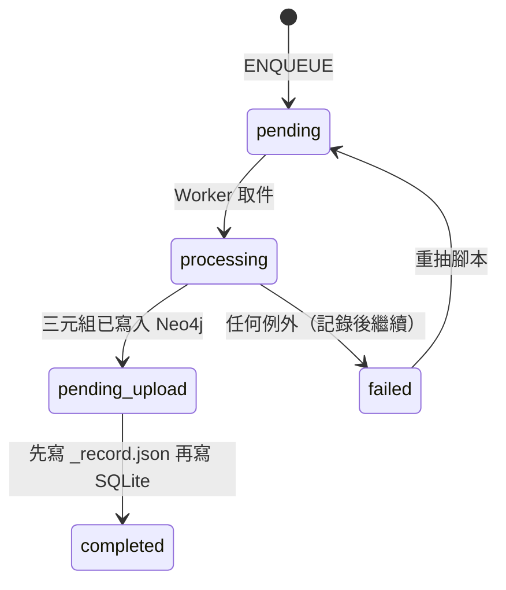

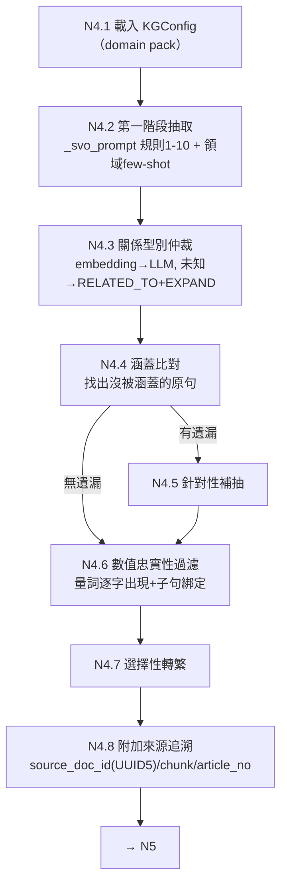

| 節點 | 目的 | 設計原理 | 程式位置 | 論文 |
|---|---|---|---|---|
| Worker 與佇列 | 長時間抽取可中斷、可恢復 | SQLite 是效能索引，`_record.json` 才是真實狀態；**先寫記錄檔再寫 SQLite**，避免中斷時重複建 Fact（報告21） | `task_queue_service.py`、`extraction_worker.py` | 03 §3.1.2／04 §4.6 |
| N4.2 第一階段抽取 | 句子 → 三元組 | 受控關係詞彙（ConceptNet 35 個核心關係＋per-KG 擴充）；規則7 拆附加規定（修遺漏）、規則10 條件複述進每筆結果（修條件被拆散，報告65）；few-shot 由 domain pack 注入（`svo_fewshots`，報告66：通用骨架＋領域參數） | `svo_service.py::_svo_prompt/extract_svo_triples` | 03 §3.1.3／04 §4.4.2 |
| N4.3 關係型別仲裁 | 動詞歸到標準型別 | 便宜的 embedding 先判，灰色地帶才問 LLM；不認識的兜底為 `RELATED_TO` 並提案給 EXPAND（X3） | `svo_service.py::_reconcile_rel_type` | 03 §3.1.3 §a／04 §4.4.2 |
| N4.4–4.5 完整性自我核對 | 保證召回率，不依賴窮舉 few-shot | 「先涵蓋、後補充」：只在有遺漏時多花一次 LLM（報告19） | `svo_service.py::extract_svo_triples_with_completeness_check` | 03 §3.1.3 |
| N4.6 數值忠實性 | 擋住捏造或錯綁的數字 | 量詞必須逐字出現在原文，且位於與主詞相關的子句（報告20、25）；純字串比對 | `svo_service.py::_filter_ungrounded_quantity_triples` | 03 §3.1.3 |
| N4.7 選擇性轉繁 | `qwen2.5:7b` 偶爾輸出簡體 | 只轉「來源文件實際用過的字」；另逐詞修正白名單抓不到的詞組 | `svo_service.py::traditionalize_triples` | 04 §4.4.3 |
| N4.8 來源追溯 | 每筆事實能追回原文 | UUID5 決定性推導，修正「source_doc_id 從未賦值」 | `document_record_service.py::document_uuid` | 03 §3.1.4 §c |

**限制**：`_process_one()` 吞掉例外、只標 `failed`，因此重抽腳本回報的「N/N 成功」不可信，需用 `scripts/kg/reextraction_manifest.py` 核對（報告57 附錄C）；`qwen2.5:7b` 非決定性（報告20）。

## 7. N5 知識寫入與實體治理 ✅

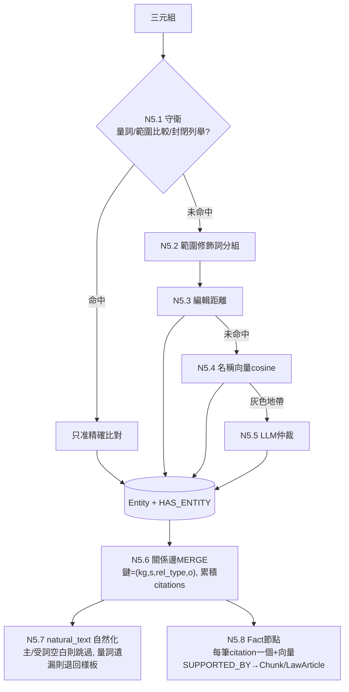

| 節點 | 目的 | 設計原理 | 程式位置 | 論文 |
|---|---|---|---|---|
| N5.1 守衛 | 防止「字面相似、數值不同」被誤併 | 真實案例：`四千元`併進`八千元`、三個年齡段併成一個；token 清單 per-KG 可配置（報告76） | `svo_service.py::resolve_entity_name` 前段 | 03 §3.4 §b／04 §4.5.1 |
| N5.2 範圍修飾詞分組 | 「基礎量 vs 遞增量」不合併 | 只縮小模糊比對候選，不影響精確比對 | `_has_scope_modifier` | 04 §4.5.1 |
| N5.3–5.5 DEDUP4＋ESCALATE | 同一實體只留一個節點 | 由便宜到昂貴：編輯距離 → cosine → LLM；跨文件標準名依獨立文件數頻率提升 | `merge_entity/resolve_entity_name` | 03 §3.4 §b／04 §4.5.1 |
| N5.6 事實層級去重 | 同一事實只一條邊，來源不遺失 | MERGE 鍵不含來源，來源累積在 `citations_json`；保持 BFS 單層走訪語意 | `merge_triples_to_graph` | 03 §3.1.4／04 §4.5.2 |
| N5.7 自然化 | 讓 LLM 願意引用事實 | 報告22/23：生硬的三元組樣板會顯著降低被引用的機率；**寫入時生成**，查詢時零額外成本；主詞或受詞空白會誘發捏造，所以跳過 | `_naturalize_triple` | 04 §4.4.3 |
| N5.8 Fact 節點 | 事實層級的語意檢索單位 | 每筆 citation 一個 Fact（不平均，避免語意壓平）；per-KG 獨立索引；embedding 加法規代碼前綴 | `_create_fact_node` | 03 §3.1.4 §a／04 §4.5.3 |

**設計說明**：同一件事實刻意有兩種表示。**關係邊**是去重後的事實，帶 `natural_text`，給 BFS 用；**Fact 節點**是逐筆證據，帶 `fact_text`＋向量，給語意檢索用。N8 會把兩者合併、去重。

## 8. N6 知識圖譜儲存 ✅

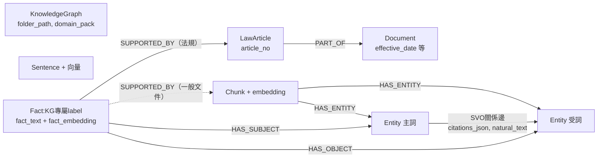

| 儲存 | 角色 | 論文 |
|---|---|---|
| 中央文件池（檔案系統） | **真實狀態來源**：原文、切塊、`_record.json`、`svo_index.json` | 04 §4.2.4、§4.3.1 |
| KG 資料夾 `_members.json` | 虛擬成員清單 | 04 §4.2.4 |
| SQLite `task_queue.db` | 效能索引，可由 `_record.json` 重建 | 04 §4.6 |
| Neo4j | 可重建的衍生物；`Entity(kg_id,name)` 唯一約束；embedding 模型切換有維度守衛 | 04 §4.2.2–4.2.3 |

## 9. N7 檢索 ✅

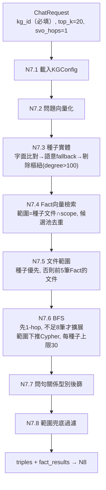

`retrieval_mode`：`both`（預設）／`fact_only`（跳過 N7.3、N7.6）／`bfs_only`（跳過 N7.4、N7.7）。

| 節點 | 目的 | 設計原理 | 程式位置 | 論文 |
|---|---|---|---|---|
| N7.3 種子實體 | BFS 起點 | 字面比對優先（精確）；找不到才用語意（實測 7/7 題字面失敗）；剔除樞紐避免鄰居爆炸（報告27 L1） | `routers/agent.py::_find_seed_entities/_drop_hub_seeds` | 03 §3.2 §b／04 §4.7.1 |
| N7.4 Fact 向量檢索 | 語意層級補足字面比對 | 候選池 `top_k×倍數` → 依 (s,r,o) 去重 → 截斷；**範圍錨定在種子文件**，不讓語意相近但答非所問的跨文件事實帶偏（報告41 L9 V1） | `svo_service.py::vector_search_facts` | 03 §3.2 §b／04 §4.7.1 |
| N7.5 文件範圍 | 限制 BFS 只走相關文件 | 只取前 5 筆 Fact 推導，否則會被 `top_k=20` 的跨文件事實稀釋（報告25） | `_resolve_doc_scope` | 03 §3.2 §b |
| N7.6 BFS（L0/L1） | 沿圖取回相鄰事實 | **範圍下推進 Cypher**（舊順序單題 330–440 秒）；自適應跳數；空結果退回無範圍 | `svo_service.py::bfs_query` | 03 §3.2 §b、§3.7／04 §4.7.1 |
| N7.7 關係型別連結 | 依問句意圖過濾型別 | 整句餵入，不另外抽動詞（省一次 LLM） | `resolve_query_relation_type` | 03 §3.2 §c |

**範圍**：只在呼叫端指定的單一 KG 內檢索（沒有路由層，見 Part B）。

## 10. N8 上下文組裝 ✅

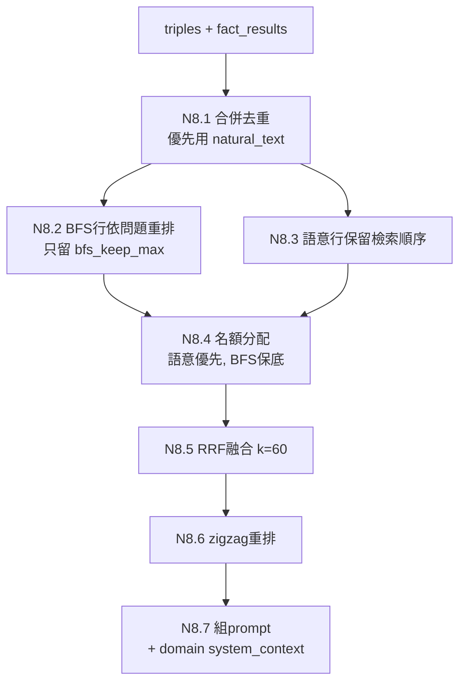

| 節點 | 目的 | 設計原理 | 程式位置 | 論文 |
|---|---|---|---|---|
| N8.1 合併 | 邊與 Fact 合成一份清單 | 優先自然語句；殘缺行過濾 | `_merge_fact_lines/_is_contentful_line` | 04 §4.7.3 |
| N8.2–8.4 分來源名額 | 不讓 BFS 鄰居洗掉語意排名 | 舊版整批重排曾把正解擠出前 18 名（報告25 發現6）；語意為主、BFS 保底（SAGE、Han 2024） | `_arrange_fact_lines` | 03 §3.6／04 §4.7.3 |
| N8.5 RRF | 融合兩個排名 | Cormack 2009，`k=60` 有文獻背書 | `_rrf_order` | 同上 |
| N8.6 zigzag | 緩解 Lost-in-the-Middle | 只在清單大於 K 時套用（Jin 2025） | `_litm_reorder` | 同上 |
| N8.7 prompt | 加入領域指令 | `system_context` 來自 domain pack，不寫死台灣語境 | `_build_prompt` | 03 §3.9 |

**限制**：名額與截斷參數未校準；截斷門檻非單調（報告62 §10）。

## 11. N9 生成與接地核對 ✅

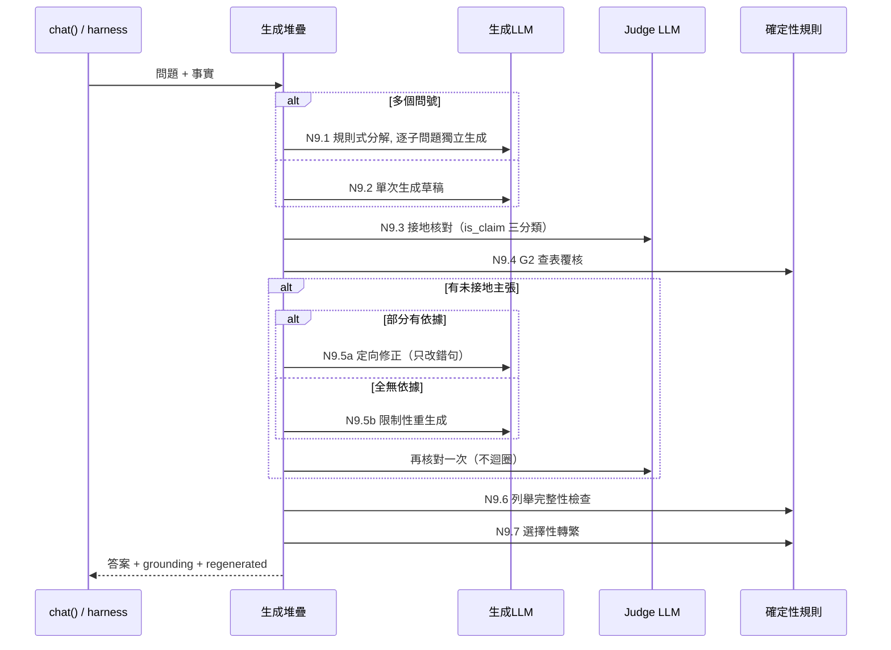

| 節點 | 目的 | 設計原理 | 程式位置 | 論文 |
|---|---|---|---|---|
| N9.1 分解 | 小模型一次答多題容易自相矛盾 | 規則式按問號切分（最多 6 個），零額外 LLM；只取 Least-to-Most／Self-Ask 的精神 | `_split_into_subquestions` | 03 §3.6 §分解／04 §4.7.3 |
| N9.3 接地核對 | 抓出「證據有、生成仍捏造」 | 使用者原則：**「寧願說不知道，也禁止亂回答」**；使用者看不到未核對版本（方案 B）；judge 可獨立於生成模型 | `verification_service.py::verify_fact_grounding` | 03 §3.6／04 §4.7.2–4.7.3 |
| N9.4 G2 查表覆核 | 「數值區間 → 對應值」不交給 LLM 判斷 | 確定性規則（方案 E）；解析不出查表結構就不介入 | `interval_lookup_service.py` | 04 §4.7.3 |
| N9.5 修正或重生成 | 修掉未接地內容 | 部分有依據走定向修正（不把對的改壞），否則整份重生成；**只做一次** | `_targeted_correction/_build_constrained_prompt` | 04 §4.7.3 |
| N9.6 列舉完整性 | 問「所有」時不能漏級距 | 偵測層級族群，缺漏就重生成或附補充 | `_missing_tier_members` | 04 §4.7.3 |

**共用堆疊**：`_generate_from_context_lines()` 由 `chat()` 和 harness 的 B0/B1/B2 臂共用，這是 RQ1 單一變因控制的需求（03 §3.8）。已知不對稱：baseline 模式不套用分解、定向修正與列舉檢查。

## 12. N10 評測 Harness ✅

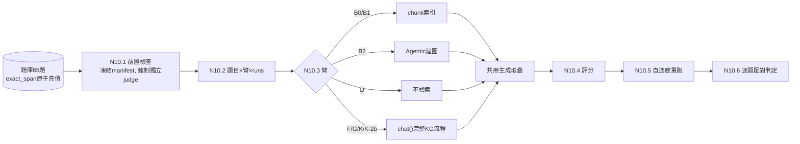

| 臂 | 別名 | 檢索前端 | 狀態 | 論文 |
|---|---|---|---|---|
| D | — | 無（純 LLM） | ✅ 已跑 | 05 §5.2.2 |
| B0 | M1 | chunk dense | ✅ 已跑（S3） | 05 §5.2.1、06 §6.1 |
| B1 | M2 | chunk dense＋BM25，RRF | ✅ 已跑（S3，**主要比較對象**） | 05 §5.4.1、06 §6.2.1 |
| B2 | — | B1＋agentic 迴圈（分解→檢索→反思→精煉） | ✅ 已實作＋全量 pilot n=41 | 05 §5.4.1（06 尚未收錄，見 §16） |
| K | M4 | KG 完整流程 | ✅ 已跑（S0–S3） | 06 §6.1 |
| F／G／K-2b | M3／—／— | fact_only／bfs_only／關閉重生成 | 🟡 已實作，42 題凍結規模未跑（見 Part B） | 05 §5.2.2 |

| 評分項目 | 做法與設計原理 | 程式位置 | 論文 |
|---|---|---|---|
| 原子準確率 | 答案逐字包含法規原文 `exact_span` 才算命中，未命中才請 judge 做語意蘊含 fallback；**真值取自原文**，不讓 LLM 生成參考答案（FActScore） | `atomic_scorer.py` | 05 §5.5.1 |
| 拒答題 | 關鍵字判定；命中陷阱主張就判失敗 | 同上 | 05 附錄A |
| 確定性守衛 | 守衛失敗只擋 `is_perfect`，保留原始覆蓋率 | `deterministic_guard_service.py` | 03 §3.6 |
| Context Quality | Recall／SNR／Chain Completeness，檢索與生成因果解耦 | `lineage_tracker.py` | 05 §5.5.1a |
| 範圍稽核 | 新舊法、角色歸屬錯置 | `claim_scope_auditor.py` | 報告84/85 |
| 固定 metric judge | 評分 judge 與受測臂 judge 分開 | `--metric-judge-provider` | 05 §5.6.1 |
| 自適應重跑 | single_pass（抽查）／stable_pass／stable_fail | `adaptive_repeat.py` | 報告62 |

**量測限制**：偽陰性下界 ≥7.2%、偽陽性下界 ≥3.4%；**達標題數 ±2 屬噪音**；timeout 被記為 0 分、未排除；規則 R 只當診斷工具。

## 13. 橫切節點 ✅

| 節點 | 目的 | 設計原理 | 程式位置 | 論文 |
|---|---|---|---|---|
| X1 設定層 | 門檻、守衛 token、關係擴充、`system_context`、抽取 few-shot 可 per-KG／per-domain 覆寫 | 四層合併、深凍結；golden test 保證預設值逐字等於舊常數；**通用骨架＋領域參數注入**，而不是每個領域複製一份 prompt | `core/kg_config/`、`config/` | 03 §3.9／04 §4.10 |
| X2 Provider 層 | 抽換 LLM／embedding | 5 種 LLM、3 種 embedding；Ollama 固定 `temperature=0`＋`seed`（仍非完全決定性）；embedding 維度守衛 | `core/providers/`、`core/embedding_guard.py` | 04 §4.1、§4.2.3 |
| X3 KG 管理與治理 | 生命週期、未知型別治理、資料修補 | EXPAND 提案→審核→回填；資料修補一律「preflight → `--apply` → compare-and-set」（報告90/92） | `routers/knowledge_graph.py`、`expand_*`、`scripts/kg/` | 03 §3.1.3 §a／04 §4.6 |

---

# Part B　規劃中

## 14. 規劃中節點地圖

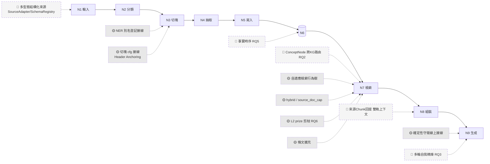

## 15. 規劃中項目清單（依大節點）

| 所屬節點 | 項目 | 標記 | 目前有什麼 | 缺什麼／前提 | 論文 |
|---|---|---|---|---|---|
| N1 | 多型態結構化來源（JSON／SQL／API／RDF） | 📐 | 只有設計 | SourceAdapter、SchemaRegistry、CanonicalRecord 全部未實作 | 03 §3.1.5／04 §4.0.1 |
| N1 | `/documents` CRUD、`/search` 端點 | 📐 | stub（`NotImplementedError`） | 決定保留或移除 | 04 §4.8 |
| N2 | 分類門檻校準 | 🟡 | 機制運作中 | `0.30／0.68／2／15%` 均為工程預設 | 05 §5.3.5 |
| N2→N3 | 虛擬歸屬後的抽取路徑 | 🟡 | 兩邊各自可運作 | 需實測確認 §4 所述路徑是否對得上 | 04 §4.2.4 |
| N3 | NER 別名登記接線 | 🟡 | `entity_registry_service`、`entity_extraction_service` 與測試 | spaCy 未安裝驗證；`trigger_extraction` 以 `mentions=None` 呼叫 | 03 §3.4 §a／04 §4.4.1 |
| N3 | 切塊 `cfg` 接線（Header Anchoring） | 🟡 | `ChunkingConfig` 與測試 | 呼叫端未傳入真實 per-KG 設定 | 03 §3.9.7／04 §4.11 |
| N3 | 切塊策略持久化 | 📐 | — | 讓產品路徑也能重建法規 KG | 04 §4.4.1 |
| N4 | 條件分裂的完整修復 | 🟡 | 規則10 部分有效（4/9 修好） | `57-AGGR19` c85 仍未修；方向 B／C | 報告65 |
| N5 | 範圍修飾短語覆蓋率驗證 | 🟡 | 守衛已可配置 | 覆蓋率與全量驗證 | 00 表 RQ4b |
| N7 | **ConceptNode 跨 KG 路由（RQ2）** | 📐 | ConceptNode 向量索引 | `route_kgs()` 未實作 | 03 §3.2 §a／06 §6.2.2 |
| N7 | 自適應檢索行為樹 | 🟡 | `query_classifier`、`adaptive_retrieval_service` 與測試 | 未接進 `chat()`；Type-C 規則對題庫過擬合 | 03 §3.2 §d |
| N7 | `hybrid`／`source_doc_cap` | 🟡 | `vector_search_facts` 參數，預設關 | n=3 消融中 `hybrid` 反而讓品質下降；需更大樣本 | 03 §3.2 §e–§f、05 §5.2.2 |
| N7 | L2 向量引導剪枝（RQ6） | 🟡 | `bfs_query(prize_top_k=…)`，預設關 | 接線、k 校準、消融 | 03 §3.7／06 §6.2.6 |
| N7 | 條文擴充 | 🟡 | `_expand_facts_by_article`，opt-in | S2 無淨增（5 個案例中只修好 1 個，且是部分） | 報告62 T3／72 S2 |
| N8 | 來源 Chunk 回提／雙軌上下文（SDD-57） | 📐 | `retrieval_service._read_chunk_text` 零件 | ContextBundle、接地核對雙軌、消融 | 03 §3.2 §g／04 §4.7.4、05 §5.5.3a |
| N8 | 名額／截斷參數校準 | 🟡 | 參數已可配置 | K 值敏感度測試 | 報告25 §6 |
| N9 | 確定性接地守衛線上接線 | 🟡 | 四道守衛與測試，只用於評分 | 接進 `chat()` | 03 §3.6 §確定性守衛 |
| N9 | **多輪自我精煉（RQ3）** | 📐 | 單次核對＋重生成 | 信心評分、擴大 BFS 分支、迭代收斂 | 03 §3.6／06 §6.2.3 |
| N6 | **事實時序（RQ5）** | 📐 | Document 日期中繼資料 | 有效起訖、衝突版本、時間條件查詢 | 03 §3.5／06 §6.2.5 |
| N10 | F／G／K-2b 臂 42 題凍結規模 | 🟡 | 臂已實作 | 完整消融 | 05 §5.2.2／06 §6.1 |
| N10 | B2 正式化 | 🟡 | 全量 pilot n=41 | 反思加拒答終止條件、`_TIMEOUT`、×3 穩定性 | 報告94 |
| N10 | timeout 排除統計、評分器 v2 | 🟡 | 已記錄為限制 | 使用者裁示 | 報告62 §14、報告94 |
| X1 | 逐階段評分閘控生命週期 | 🟡 | stage-registry 宣告骨架 | 可執行的 eval suite | 03 §3.9.5／04 §4.10 |
| — | RQ4a／RQ4b 正式實驗 | 📐 | 機制都已運作 | 實驗組別、資料集、指標 | 05 §5.2.3／06 §6.2.4 |

---

## 16. 論文對齊檢查（論文與程式不一致之處）

以下是撰寫本報告時逐節對照論文與程式碼發現的落差。依專案慣例（先討論、確認後才改），**本次只列出，未修改論文**。

| # | 論文位置 | 論文目前寫法 | 程式／最新進度 | 建議處理 |
|---|---|---|---|---|
| 1 | 06 §6.1、§6.2.1、§6.4；07 §7.3；00 追溯表 RQ1 列 | 「B2 尚未實作／未完成」 | B2 已實作（報告93），全量 pilot n=41 已完成（報告94） | 改寫為「B2 已完成全量 pilot（非 ×3 正式評估）」，並補上數字與 `57-CANARY1` 弱點 |
| 2 | 04 §4.7.2 | 問答順序是「種子 → BFS → 關係型別連結與 Fact 語意檢索」 | 實際是「種子 → Fact 檢索（範圍錨定種子文件）→ 推導範圍 → BFS 範圍下推 → 型別後篩」（03 §3.2 §b 已是新版） | 以 03 §3.2 §b 與本文 §9 為準改寫 04 §4.7.2 |
| 3 | 04 §4.10 標題與正文、00 追溯表第 73 列 | 「第 3b 步（`_svo_prompt` few-shot）尚未完成」 | `KGConfig.domain.svo_fewshots` 已接進 `extract_svo_triples()`（報告66） | 更新為已完成，並註明報告66 |
| 4 | 05 §5.4 標題與開頭 | 「測試資料集（待決定）」、30 題、TODO | 題庫 65 題（bank hash `77c293ed…`），正式評測使用 42 題 | 改寫本節為現行題庫說明，把舊候選方案移入歷史註記 |
| 5 | 04 §4.2.4、§4.3.2 | 描述 Manifest 虛擬歸屬（正確） | 未提到虛擬歸屬與 `trigger_extraction` 路徑可能對不上 | 待 §4 的疑似斷點實測後再決定是否寫入 |
| 6 | 根目錄 `CLAUDE.md` 專案概覽（非論文） | 「services 核心演算法皆為 stub」 | 核心已大量實作 | CLAUDE.md 頂部已註明以 HANDOVER 為準；可擇期更新 |

---

## 17. 結構觀察（本階段不重構，僅記錄）

使用者裁示暫不重構。以下只記錄撰寫本報告時看到的**節點與程式檔案邊界不一致**之處，供日後討論。

| # | 觀察 | 涉及節點 |
|---|---|---|
| 1 | 檢索編排（N7）、上下文組裝（N8）、生成堆疊（N9）都在 `routers/agent.py`（約 1,700 行）內；harness 需 import 其私有函式，或透過 `_drain_chat()` 走完整個 `chat()` | N7/N8/N9/N10 |
| 2 | `services/svo_service.py`（約 3,400 行）橫跨切塊編排、抽取、實體對齊與寫圖、Fact 檢索與 BFS、十餘個 backfill 維護函式 | N3/N4/N5/N7/X3 |
| 3 | 法規 KG 的建立入口是根目錄腳本，產品路徑無法重建 | N2/N3 |
| 4 | Worker 吞例外，失敗原因沒有結構化 | N4 |
| 5 | 多個 prototype 預設關閉、長期未接線，讀程式時不易分辨哪些真的在跑（Part B 的 🟡 項目） | N7/N9 |
| 6 | 狀態分散在檔案系統、SQLite、Neo4j 三處，重建規則寫在各函式 docstring | N6 |
| 7 | 生成堆疊在 baseline 模式下功能不對稱 | N9/N10 |

（行數為非空行計數。）

---

## 18. 進度、已知限制、未決事項

### 18.1 進度

- Part A 的 N1–N10 與 X1–X3 皆運作中；KG#4 抽取佇列 3,307/3,307 completed；報告71 natural_text 型別洩漏處理完畢（49 筆已 backfill、2 筆待處理、47 筆因欄位缺漏安全跳過）。
- RQ1：B0/B1/K 比較完成並寫入論文第六、七章；B2 全量 pilot 完成，尚未寫入論文（§16 #1）。
- 版控（2026-09-28）：`origin/worktree-sdd-retrieval-comparison` 已同步到 `0b9a24b`；此分支領先 `origin/master`，尚未合併。

### 18.2 未決事項（待使用者裁示，不是自動下一步）

1. **論文對齊**：§16 的 #1–#4 是否依建議修改論文（建議先處理 #1 B2 與 #2 檢索順序，這兩處影響 RQ1 敘述的正確性）。
2. **疑似斷點實測**：§4 虛擬歸屬與抽取路徑的問題，要不要做一次小規模實測（新建測試 KG、上傳一份文件，觀察 worker 是否找得到 chunk）。
3. **B2 後續**：反思加入拒答終止條件、是否調高 `ollama.py::_TIMEOUT`、是否做 ×3 穩定性評估；或直接收斂寫入論文。
4. **是否合併進 master**。
5. **報告71 剩下的 2 筆** natural_text。
6. 長期方向（未經深入討論不應啟動）：RQ2 路由、RQ5 時序、GAP-06/07、§17 的結構整理。

---

## 19. 名詞對照表

### 19.1 系統與資料

| 名詞 | 意義 |
|---|---|
| KG#4 | 主要正式 KG，`236903cf-055a-40a8-8923-b9d06601f3b7`（勞動法規） |
| 中央文件池／SSOT | 文件實體唯一存放處；KG 只以 `_members.json` 虛擬登記 |
| SVO 三元組 | (主詞, 動詞, 受詞)＋`rel_type`＋型別 |
| Entity | 圖中的實體節點，經 N5 對齊去重 |
| 關係邊 | Entity 間帶受控型別的邊；以 (s, rel_type, o) 去重，來源累積在 `citations_json` |
| Fact | 每筆 citation 一個的證據節點，帶 `fact_text` 與向量 |
| natural_text | 關係邊上由 LLM 改寫的自然語句 |
| LawArticle | 法規條文節點；法規 Fact 的 `SUPPORTED_BY` 指向它 |
| domain pack | 領域設定包（`taiwan-labor-law`、`generic`） |
| CHUNKREADY／ENQUEUE／DEDUP4／ESCALATE／EXPAND | 03 章 Behavior Tree 節點名，分別對應 N3、N3.7、N5.3、N5.5、X3 |
| RAG 切塊 vs SVO 切塊 | 前者給分類與 chunk-RAG（N1.3），後者給抽取（N3），刻意分開 |

### 19.2 評測

| 名詞 | 意義 |
|---|---|
| D／B0／B1／B2／F／G／K／K-2b | 評測臂，見 §12 |
| M1–M4 | 臂別名：M1=B0、M2=B1、M3=F、M4=K |
| S0／S1(K1b)／S2(K2)／K3／S3 | 報告72 的基準與候選：S0＝K 基準 13/42；K1b＝top_k 40（不採用）；K2＝條文擴充（不採用）；K3＝兩者組合（否決）；S3＝chunk-RAG 對照 |
| Type-A～E | 題目場景分類；Type-E＝應拒答的金絲雀題 |
| exact_span | 取自法規原文的原子真值字串 |
| single_pass／stable_pass／stable_fail | 自適應重跑的判定狀態 |
| 規則 R／v2 評分器 | 評分器敏感度分析用的確定性規則，只當診斷工具 |
| Context Recall／SNR／Chain Completeness | 檢索品質三指標（報告57） |
| bank hash | 題庫 sha256；現行 `77c293ed…`（報告85），舊版 `404cde9f…`、`23f8c06f…` |

### 19.3 報告索引（依主題）

| 主題 | 報告 |
|---|---|
| 早期架構藍圖（RQ 編號為舊版） | 01、03、08 |
| 抽取管線 | 11、19、20、21、25、32、65、66 |
| 生成端 | 16、22–24 |
| 檢索與剪枝 | 27、41、43 |
| 中央文件池與分類 | 51（SDD-51）、53 |
| 設定分層 | 33、76、77 |
| 評測架構 | 36、39、57、62、68–69、72 |
| RQ1 結果與診斷 | 78–83、88、93–94 |
| 文獻查證 | 61 |
| 資料修補 | 67、71、90、92 |
| 版控與交接 | 60、70、89 |
| **本文件** | **95：節點流程總覽** |
