# 報告97：專案目標與 BT＋SM 工作流設計

> **日期**：2026-09-28
> **基準 commit**：`3172da0`（`worktree-sdd-retrieval-comparison`）
> **性質**：設計與整理文件。**未修改任何程式碼、論文或資料檔**。
> **順序**（依使用者要求）：
> ① 確認整體目標與目標規劃（§1，**草案待確認**）
> → ② 定義 BT＋SM 表示法（§2）
> → ③ 用 BT＋SM 重新描述目前程式（§3 SM、§4 BT）
> → ④ 與論文對齊（§5）
> → ⑤ 決定程式碼如何整理（§6，**決策提案，暫不執行**）
> → ⑥ 專案資料與紀錄整理（§7）。
>
> **前置文件**：[報告95 節點流程總覽](95_專案節點流程總覽與設計說明.md)（大節點 N1–N13）、[報告96 登記缺漏盤點](96_程式流程與論文03_04登記缺漏盤點.md)、[報告索引](00_報告索引.md)（本次新增）。

---

## 1. 整體目標與目標規劃（草案，待使用者確認）

> 本節由論文 01 §1.1.4、§1.1.5、§1.2、§1.3 與 `docs/ARCHITECTURE.md` 整理而成，**不是新的決策**。第 6 節的程式碼整理方向取決於本節的優先順序，因此請先確認 §1.3 與 §1.4。

### 1.1 最終目標

> 讓研究人員、企業用戶或一般大眾，都能**建立、管理並查詢自己的世界知識圖譜**；在「世界知識／記憶」與「推理」兩個面向上，提供可操作、可驗證的實作方案。（01 §1.1.4）

三項核心產品能力（01 §1.1.4）：

| 能力 | 意義 | 對應大節點 | 目前狀態 |
|---|---|---|---|
| **多知識庫管理** | 多個獨立 KG 並存與路由 | N2、N8 | 分類與虛擬歸屬已完成；**路由（N8）未實作** |
| **可解釋的知識問答** | 每個回答可追溯到來源 | N5、N6、N9–N11 | 來源追溯、Fact→LawArticle 已完成；回答附來源事件已完成 |
| **低幻覺率** | 以結構化知識約束生成 | N11、N12 | 接地核對＋一次修正已完成；**自我精煉（N12）未實作** |

### 1.2 三條目標線

| 目標線 | 內容 | 成功標準 |
|---|---|---|
| **研究** | RQ1–RQ6 | 能宣稱的只有做完比較實驗的 RQ；目前只有 RQ1 |
| **產品／系統** | 七層產品能力（01 §1.1.5） | 可執行、可追溯、可擴充 |
| **工程品質**（本次新增，使用者要求） | 模組化、可讀性、流程可登記、與論文一一對應 | 每個程式流程都能對到一個 BT／SM 節點與一個論文章節；沒有「無人知道在做什麼」的程式 |

### 1.3 目標規劃（里程碑）

| 里程碑 | 內容 | 狀態 | 前提 |
|---|---|---|---|
| **M0 現況** | 建構與問答主流程可運作；RQ1 完成 B0/B1/K 比較；B2 全量 pilot | ✅ | — |
| **M1 論文收斂** | 論文與程式對齊（報告95 §18、報告96、本文 §5）；RQ1 結論寫定（含 B2）；第六、七章定稿 | ⏳ 進行中 | 使用者裁示對齊項目 |
| **M2 程式整理** | 依本文 §6 的 BT＋SM 結構整理程式，行為不變 | 📐 本文提案 | M1 的論文結構先定（避免整理完又對不上） |
| **M3 研究延伸** | RQ3 自我精煉（N12）、RQ2 路由（N8）、RQ6 L2、RQ4a/b 實驗 | 📐 | M2 完成後較容易接線 |
| **M4 產品化** | 多型態輸入、時序（N7）、多 KG 併發、部署、前端 | 📐 | M3 |

**建議優先順序**：M1 → M2 → M3 → M4。理由：
- 論文是有期限的產出，而且 M1 的對齊結果會決定 M2 的模組命名；
- M2 若在 M1 之前進行，04 章要改兩次。

### 1.4 明確的非目標（沿用 01 §1.4.1）

多模態文件解析、動態世界模型、社群摘要全局檢索、人類反饋權重學習、N-ary 關係、本地抽取／Electron 產品化，不在本論文驗證範圍。

### 1.5 需要確認的問題

1. §1.3 的里程碑順序是否同意（特別是 **M1 論文收斂先於 M2 程式整理**）？
2. §1.2 新增的「工程品質」目標線，是否要寫進論文（例如 01 §1.3 的「產品工程貢獻」）？

---

## 2. BT＋SM 設計約定

### 2.1 為什麼要分成兩種

| | 行為樹（BT） | 狀態機（SM） |
|---|---|---|
| 描述什麼 | **一次執行的控制流程**：一個請求、一個抽取任務、一次評測 | **長期存在的實體生命週期**：文件、任務、提案、評測執行 |
| 回答的問題 | 「接下來做什麼？失敗時改做什麼？」 | 「這個東西現在處於什麼狀態？可以轉到哪裡？」 |
| 本專案例子 | `chat()` 問答流程、單一 chunk 抽取流程 | `task_queue.db` 的 pending→processing→…、`_record.json` 的 `extraction_status` |
| 論文現況 | 03 章已大量使用（大寫代號，如 `GETSENT`、`DEDUP4`、`POOLSIZE`） | 03 §3.1.2 有任務狀態，但沒有獨立的 SM 章節 |

### 2.2 BT 節點類型

| 符號 | 類型 | 語意 |
|---|---|---|
| `→` | Sequence | 子節點依序執行，任一失敗就整體失敗 |
| `?` | Fallback／Selector | 依序嘗試，第一個成功就停止 |
| `⇉` | Parallel | 同時執行 |
| `◇` | Condition | 只讀取狀態，回傳成功／失敗 |
| `▢` | Action | 真正做事（呼叫 LLM、寫 Neo4j、轉移 SM 狀態） |
| `⟲` | Decorator | Retry、Timeout、ForEach、UntilSuccess、Guard 等修飾 |

### 2.3 SM 規則

1. 每個 SM 有明確的**狀態集合、事件、轉移表**。
2. 狀態只能透過**轉移**改變，不能任意寫字串。
3. 每個 SM 必須標明**真實狀態來源**（檔案、SQLite 或 Neo4j）。

### 2.4 BT 與 SM 的介面規則

- BT 的 Condition 節點**可以讀** SM 狀態。
- BT 的 Action 節點**要改變狀態時，只能送出 SM 事件**，不能直接寫狀態欄位。
- 這條規則是 §6 程式整理的核心：目前狀態寫入散落在各處（例如 `task_queue_service.update_status(...)` 在 `extraction_worker.py` 出現 4 次），之後集中成單一轉移入口。

### 2.5 與報告95節點的關係

| 報告95 | 在 BT＋SM 中 |
|---|---|
| 大節點 N1–N13 | 一棵 BT 子樹，或一個擁有 SM 的服務 |
| 內部節點 | BT 葉節點（Condition／Action） |
| 目標註記 | 尚未規劃，不出現在 BT／SM |

**命名規則**：葉節點代號**優先沿用論文 03 章既有代號**；論文沒有的，本文新增代號並標註「新」，之後回寫論文。

### 2.6 圖表慣例

- BT 用 Mermaid `flowchart TD`，節點標籤前綴為類型符號，子節點由左到右代表執行順序。
- SM 用 Mermaid `stateDiagram-v2`。
- 虛線＝規劃中（📐）或待接線（🟡）。

---

## 3. 狀態機（SM）清單

### 3.0 總表

| SM | 實體 | 真實狀態來源 | 狀態欄位 | 狀態 | 論文 |
|---|---|---|---|---|---|
| SM-1 | 文件 | `_record.json` | `assignment_history`、`extraction_status`、`normalization_status` | ✅（normalization 部分未驅動） | 03 §3.1.1–3.1.2 |
| SM-2 | 抽取任務（chunk） | `task_queue.db`（可由 SM-1 重建） | `status` | ✅ | 03 §3.1.2 |
| SM-3 | 暫存分類結果 | API 回應（不持久化） | `ClassifyResult.status` | ✅ | 03 §3.1.1 |
| SM-4 | EXPAND 候選動詞 | `expand_pool`（SQLite） | `status` | ✅ | 03 §3.1.3 §a |
| SM-5 | 關係型別提案 | `expand_cluster_proposal`（SQLite） | `status` | ✅ | 03 §3.1.3 §a |
| SM-6 | 問答回合 | SSE 事件（不持久化） | `phase` | ✅ | 03 §3.6 |
| SM-7 | 評測執行 | `manifest.json`、`records.json`、adaptive summary | `status`、`failure_attribution`、adaptive status | ✅ | 05 §5.7 |
| SM-8 | 知識圖譜 | **無明確欄位** | — | ⚠️ 缺口 | — |
| SM-9 | 事實版本（RQ5） | 設計中：邊上的 `valid_from`／`valid_to` | — | 📐 | 03 §3.5 |
| SM-10 | 精煉回合（RQ3） | 設計中 | — | 📐 | 03 §3.6 |

### 3.1 SM-1 文件

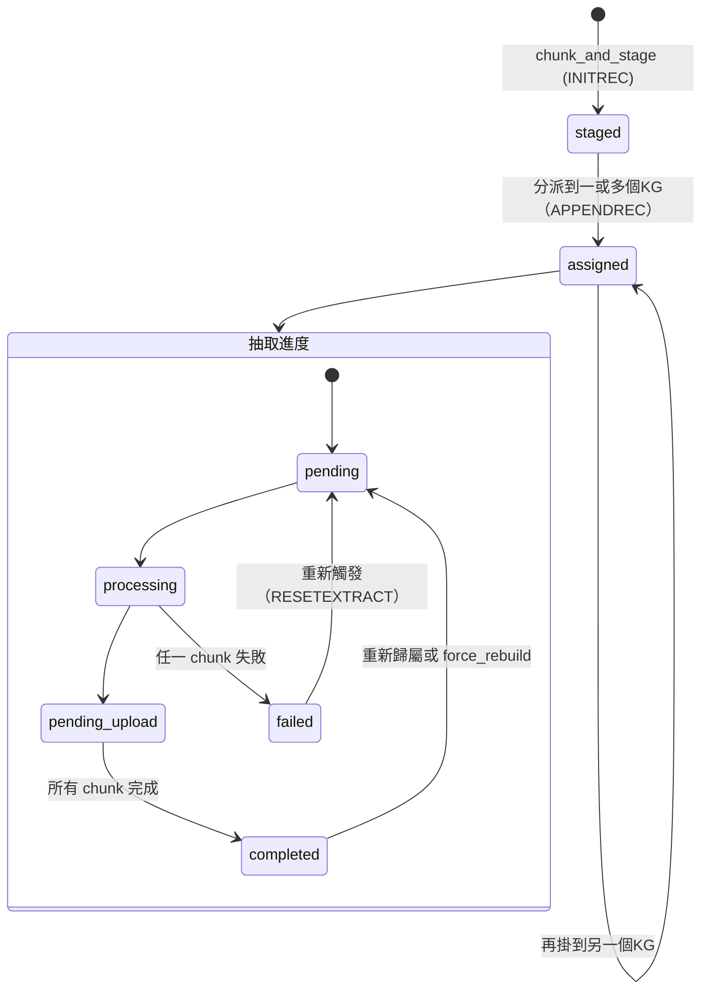

| 項目 | 內容 |
|---|---|
| 程式 | `services/document_record_service.py`、`models/knowledge_graph.py::DocumentRecord` |
| 重要設計 | 是否完成以 `completed_chunk_indices` 集合判斷，而不是看最大 index（修過「中間失敗被覆寫」的 bug） |
| ⚠️ 缺口 | `normalization_status` 有欄位、有更新函式 `update_normalization_progress()`，但**沒有任何程式驅動它**（報告96 C3） |

### 3.2 SM-2 抽取任務

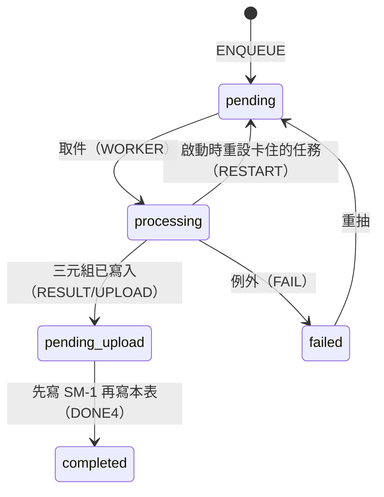

| 項目 | 內容 |
|---|---|
| 程式 | `services/task_queue_service.py`（`TaskStatus`）、`services/extraction_worker.py` |
| 恢復機制 | 啟動時 `ensure_ready()`：可信則補登缺漏（`TRUST`／`SCAN`），不可信則整份重建（`REBUILD`） |
| ⚠️ 缺口 | 轉移散落在 `extraction_worker.py` 4 處；`failed` 沒有記錄原因（worker 吞例外） |

### 3.3 SM-3 暫存分類結果

`pending → assigned`（自動或人工）或 `pending → unmatched`（留在暫存池）。結果只存在 API 回應中，歷史記錄在 SM-1 的 `assignment_history`。

### 3.4 SM-4／SM-5 關係型別治理

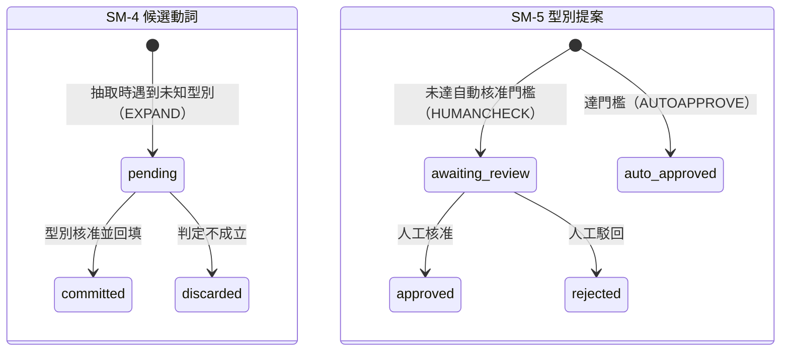

程式：`services/expand_governance_service.py`、`services/expand_worker.py`、`routers/expand.py`。

### 3.5 SM-6 問答回合

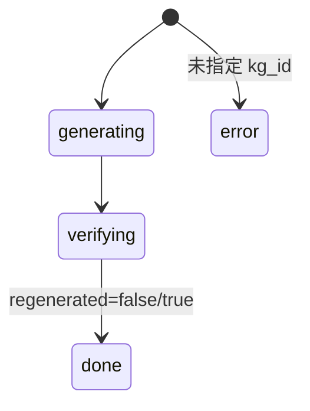

程式：`routers/agent.py::chat()` 以 SSE `event: status` 送出。設計重點：**使用者永遠看不到未核對的版本**。

### 3.6 SM-7 評測執行

| 層級 | 狀態 | 來源 |
|---|---|---|
| 一次執行（run） | `running` → `completed` | `manifest.json` |
| 單題單臂紀錄 | 正常／`Harness Timeout`／`Harness Exception` | `records.json` 的 `failure_attribution` |
| 題目穩定性 | `needs_second_run` → `single_pass`／`stable_pass`／`stable_fail` | `scripts/eval/adaptive_repeat.py` |

⚠️ 已知問題：timeout 被記為 `atomic_accuracy=0`，沒有和真正的生成失敗分開（報告94）。

### 3.7 SM-8 知識圖譜（缺口）

`KnowledgeGraph` 節點沒有狀態欄位。「這個 KG 建好了沒有」目前只能彙總底下所有文件的 SM-1 才知道。**建議**：定義為衍生狀態（`empty`／`building`／`ready`／`degraded`＝有 failed chunk），不新增儲存欄位。

---

## 4. 行為樹（BT）清單

### 4.0 總表

| BT | 範圍（大節點） | 觸發方式 | 驅動的 SM | 論文既有 BT 圖 |
|---|---|---|---|---|
| BT-0 系統主樹 | 全部 | — | — | 03 §3.1 總覽圖 |
| BT-1 INGEST | N1、N2 | API 上傳／分類 | SM-1、SM-3 | 03 §3.1.1、§3.1.1 §a |
| BT-2 CHUNKREADY | N3 | 分派後立即執行 | SM-1、SM-2 | 03 §3.1.2、§3.4 §a |
| BT-3 EXTRACT | N4、N5 | 背景 Worker，每個 chunk | SM-2、SM-1、SM-4 | 03 §3.1.3、§3.1.4、§3.4 §b |
| BT-4 GOVERN | X3 | 背景治理 Worker | SM-4、SM-5 | 03 §3.1.3 §a、§a-1 |
| BT-5 CHAT | N8–N12 | `/agent/chat` | SM-6 | 03 §3.2 §a–§d、§3.6（**目前的生成流程沒有圖**） |
| BT-6 EVAL | N13 | CLI | SM-7 | **無** |
| BT-7 MAINTAIN | X3 | CLI | SM-1、SM-2 | 03 §3.1.4 §b（僅 Fact 回填） |

### 4.1 BT-0 系統主樹

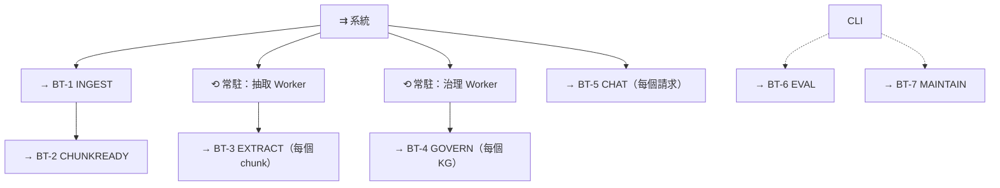

啟動時（`main.py::lifespan`，依序）：
1. 建立 Neo4j 連線；
2. 初始化 provider；
3. embedding 設定守衛（provider／model／維度不一致就停止啟動）；
4. 向量索引維度遷移（清掉維度不符的索引）；
5. 建立各種索引；
6. 佇列 `ensure_ready()`（SM-2 恢復），並對被重設的卡住 chunk **先撤銷已寫入的 Fact**（`revoke_chunk_facts`），避免重抽時重複；
7. 啟動抽取與治理兩個 Worker。

### 4.2 BT-1 INGEST（N1＋N2）

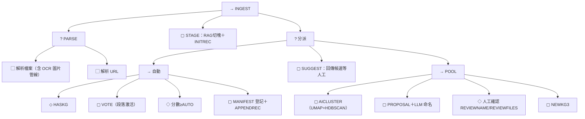

| 葉節點 | 代號 | 程式 | 論文 | 狀態 |
|---|---|---|---|---|
| 解析檔案 | `PARSE` | `ingestion_service.parse_document`、`parser/core.py`、`parser/image_pipeline.py` | 03 §3.1（圖片管線**未登記**） | ✅ |
| RAG 切塊落地 | `STAGE`／`INITREC` | `ingestion_service.chunk_and_stage` | 03 §3.1.1、§3.1.2 | ✅ |
| 段落激活投票 | `VOTE`／`ACTIVE`／`SCORE2` | `classify_service.classify_document` | 03 §3.1.1 | ✅ |
| Manifest 登記 | `DIRECT`／`AUTO`（新：`MANIFEST`） | `classify_service.assign_document_to_kg` | 03 §3.1.1、04 §4.2.4 | ✅ |
| 分群提案 | `AICLUSTER`／`PROPOSAL`／`LLMNAME` | `cluster_service` | 03 §3.1.1 §a | ✅ |
| 分派後觸發抽取 | （新：`HANDOFF`） | `routers/staging.py` 呼叫 `trigger_extraction` | 報告95 §4：**虛擬歸屬下路徑可能不一致，未實測** | ⚠️ |

### 4.3 BT-2 CHUNKREADY（N3）

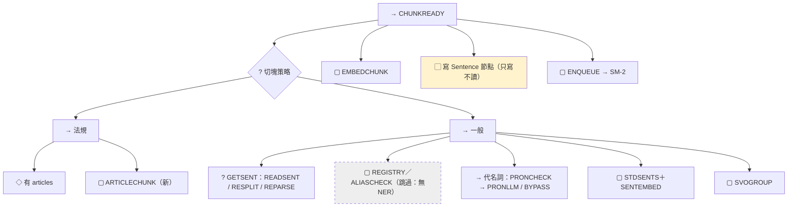

程式：`svo_service.trigger_extraction` → `svo_preprocessing_service.prepare_svo_ready_chunks` → `svo_chunking`。論文：03 §3.1.2、§3.4 §a。

### 4.4 BT-3 EXTRACT（N4＋N5，每個 chunk）

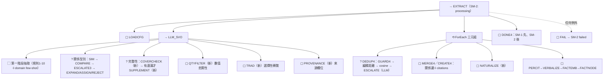

| 葉節點 | 論文代號 | 程式 | 論文 |
|---|---|---|---|
| 第一階段抽取 | `LLM_SVO` | `svo_service.extract_svo_triples`、`_svo_prompt` | 03 §3.1.3 |
| 關係型別仲裁 | `SIM`／`COMPARE`／`ESCALATE3`／`EXPAND` | `_reconcile_rel_type` | 03 §3.1.3 |
| 完整性核對 | 新 `COVERCHECK`／`SUPPLEMENT` | `extract_svo_triples_with_completeness_check` | 03 §3.1.3（有概念、無代號） |
| 數值忠實性 | 新 `QTYFILTER` | `_filter_ungrounded_quantity_triples` | 03 §3.1.3 |
| 選擇性轉繁 | 新 `TRAD` | `traditionalize_triples` | 04 §4.4.3 |
| 實體去重 | `GUARD4`／`DEDUP4`／`ESCALATE` | `merge_entity`、`resolve_entity_name` | 03 §3.1.4、§3.4 §b |
| 關係邊與 citation | `MERGE4`／`CREATE4` | `merge_triples_to_graph` | 03 §3.1.4 |
| 自然化 | 新 `NATURALIZE` | `_naturalize_triple` | 04 §4.4.3 |
| Fact 節點 | `PERCIT`／`VERBALIZE`／`FACTEMB`／`FACTNODE` | `_create_fact_node` | 03 §3.1.4 §a |
| 完成／失敗 | `DONE4`／`FAIL` | `extraction_worker._process_one` | 03 §3.1.2 |

### 4.5 BT-4 GOVERN（X3）

完全沿用論文 03 §3.1.3 §a 與 §a-1 的既有 BT：

`GOVWORKER` → `POOLSIZE` → `CLUSTER` → `HASCLUSTER` → `LLMJUDGE` → `REGCHECK` →（`REUSE`｜`NEWTYPE`）→ `GATE` →（`HUMANCHECK`｜`AUTOAPPROVE`）→ `COMMIT` → `BACKFILL`（`QUERYIDX` → `MATCHED` → `LLMCONFIRM` → `REWRITE`｜`SKIP`）。

程式：`expand_worker.run_governance_worker/run_governance_cycle`、`expand_governance_service`。**這是目前論文與程式對齊最好的一棵樹**，可作為其他樹的範本。

### 4.6 BT-5 CHAT（N8–N12）

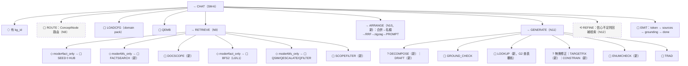

| 群組 | 代號 | 程式 | 論文 | 狀態 |
|---|---|---|---|---|
| 路由 | `EMB`／`COARSE`／`SCORE`／`FILTER`／`RANK`／`CAP` | `concept_engine.route_kgs`（stub） | 03 §3.2 §a | 📐 |
| 種子＋樞紐 | `SEED`／`HUB` | `agent._find_seed_entities/_drop_hub_seeds` | 03 §3.2 §b | ✅ |
| Fact 檢索、文件範圍 | 新 `FACTSEARCH`／`DOCSCOPE`／`SCOPEFILTER` | `vector_search_facts`、`agent._resolve_doc_scope`、`_filter_*` | 03 §3.2 §b（文字有，圖沒有） | ✅ |
| BFS | `BFS2`／`PASS`／`TRIPLES` | `svo_service.bfs_query` | 03 §3.2 §b | ✅ |
| 關係型別連結 | `QEMB`／`QSIM`／`QESCALATE`／`QASSIGN`／`QFILTER` | `resolve_query_relation_type` | 03 §3.2 §c | ✅ |
| 上下文組裝 | 新 `ARRANGE` | `agent._merge_fact_lines/_arrange_fact_lines/_build_prompt` | 03 §3.6（無圖） | ✅ |
| 生成與核對 | `GROUND_CHECK`（03 §3.2 §d）；其餘為新代號 | `agent._generate_from_context_lines`、`verification_service`、`interval_lookup_service` | 03 §3.6（**只有規劃中的精煉迴圈圖**） | ✅ |
| 行為樹分類（替代路徑） | `GUARD`／`CLASSIFY`／`SCENARIO`／`ROUTE_TEXT`／`ROUTE_KG`… | `query_classifier`、`adaptive_retrieval_service` | 03 §3.2 §d | 🟡 未接線 |
| 自我精煉 | `CONF`／`ROUND`／`RETRIEVE`／`MERGE3` | 無 | 03 §3.6 | 📐 |

### 4.7 BT-6 EVAL（N13，論文沒有 BT 圖）

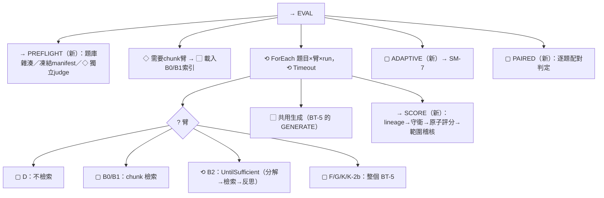

程式：`scripts/eval/run_rq1_comparison.py`、`services/{baseline_rag,agentic_baseline,atomic_scorer,lineage_tracker,semantic_span_matcher,claim_scope_auditor,evaluation_preflight}`、`scripts/eval/adaptive_repeat.py`。論文：05 有方法，**04 無實作章節**（報告96 §3）。

### 4.8 BT-7 MAINTAIN（X3，論文只登記 Fact 回填）

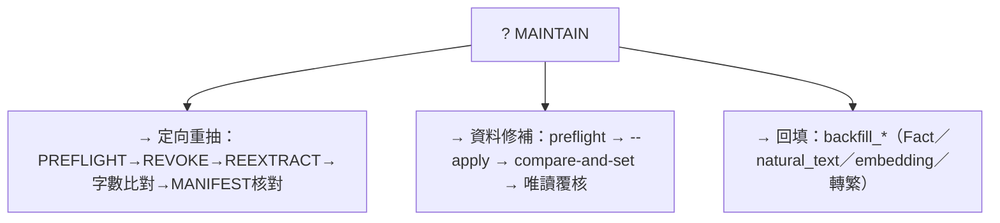

程式：`scripts/kg/reextract_chunks.py`、`reextraction_manifest.py`、`fix_report*_*.py`、`backfill_naturalization_safe_edges.py`、`svo_service.revoke_chunk_facts/backfill_*`。

---

## 5. 與論文對齊

### 5.1 論文 03 的 BT 圖與本文 BT 的對應

| 論文 03 章既有圖 | 本文 | 對齊程度 |
|---|---|---|
| §3.1 系統總覽（`PARSE`…`ROUTE`／`BFS`／`REFINE`／`CTX`／`LLM`） | BT-0 | ⚠️ 論文把 `ROUTE`、`REFINE` 畫成現行流程，實際未實作 |
| §3.1.1 分類、§3.1.1 §a 分群 | BT-1 | ✅（需補 Manifest 虛擬歸屬節點） |
| §3.1.2 紀錄與佇列、`RESTART` | BT-2、SM-1、SM-2 | ✅（需補 SM 圖） |
| §3.1.3 抽取與型別仲裁 | BT-3 前半 | 🟡 缺完整性、數值、轉繁節點 |
| §3.1.3 §a／§a-1 EXPAND | BT-4、SM-4／5 | ✅ 最完整 |
| §3.1.4 DEDUP4／Fact 向量化／回填 | BT-3 後半、BT-7 | 🟡 缺自然化節點 |
| §3.2 §a 路由 | BT-5 `ROUTE` | ✅（皆標為規劃） |
| §3.2 §b BFS、§c 關係連結 | BT-5 RETRIEVE | 🟡 圖上沒有 Fact 檢索與範圍錨定 |
| §3.2 §d 行為樹 | BT-5 替代路徑 | ✅（皆標為未接線） |
| §3.4 §a／§b | BT-2、BT-3 | ✅ |
| §3.5 時序 | SM-9 | ✅（皆標為規劃） |
| §3.6 自我精煉 | BT-5 `REFINE`、SM-10 | ⚠️ **只有規劃中的迴圈，沒有目前實際運作的生成流程圖** |
| （無） | BT-6 EVAL、BT-7 MAINTAIN | ❌ 缺 |

### 5.2 論文待修正清單（彙總報告95 §18、報告96、本文新發現）

| # | 位置 | 問題 | 來源 |
|---|---|---|---|
| 1 | 06 §6.1／§6.2.1／§6.4、07 §7.3、00 表 | 仍寫 B2 未完成 | 報告95 |
| 2 | 04 §4.7.2 | 檢索順序是舊版 | 報告95 |
| 3 | 04 §4.10、00 表第73列 | 說抽取 few-shot 未完成 | 報告95 |
| 4 | 05 §5.4 | 仍寫「測試資料集待決定、30 題」 | 報告95 |
| 5 | 04 §4.11 | 仍寫 harness 未串接跑測迴圈 | 報告96 |
| 6 | 03／04 | 圖片 OCR 管線完全未登記 | 報告96 |
| 7 | 03／04 | 報告53–94 的機制多數未登記（共用生成、trace、規則10、RelTypeExtension、GuardConfig 實作…） | 報告96 |
| 8 | **01 §1.4.2** | 仍寫「設定分層第 3–5 步尚未做、domain pack 尚未存在」，實際上 domain pack 已存在並接線 | **本文新發現** |
| 9 | 03 §3.1 總覽圖 | `ROUTE`、`REFINE` 畫成現行流程 | 本文 |
| 10 | 03 §3.6 | 缺目前生成流程的 BT 圖 | 本文 |
| 11 | 04 | 缺評測實作、資料維護程序兩節 | 報告96 |

### 5.3 建議的論文結構調整（待裁示）

1. **03 §3.1 開頭**新增「BT／SM 表示法約定」一小節（本文 §2 的精簡版），並把 §3.1 總覽圖改成 BT-0，用虛線標出規劃中節點。
2. **03 §3.1.2** 補 SM-1、SM-2 狀態圖；**§3.1.3 §a** 補 SM-4／5。
3. **03 §3.6** 補「目前生成流程」的 BT 圖（BT-5 GENERATE），和規劃中的精煉迴圈分開畫。
4. **04 章**依 BT 組織，每節開頭標註對應的 BT／SM 與節點代號，新增「評測實作」與「資料維護程序」兩節。
5. 新代號（`FACTSEARCH`、`DOCSCOPE`、`ARRANGE`、`NATURALIZE`、`COVERCHECK`…）回寫 03 對應章節。

---

## 6. 程式碼整理方案（決策提案，暫不執行）

### 6.1 整理目標

1. **一個大節點＝一個模組邊界**；一個 BT＝一個看得懂的協調函式。
2. **一個 SM＝一個狀態模組**，狀態只能經由轉移改變。
3. **讀程式時能直接對到論文**：模組與函式的 docstring 標註 BT 代號與論文章節（沿用現有 `Traceability:` 註解格式）。
4. **行為完全不變**：整理和改行為絕不放在同一個 commit。

### 6.2 需要決定的事項（附建議）

| # | 決策 | 選項 | 建議 | 理由 |
|---|---|---|---|---|
| D1 | 要不要導入 BT 執行框架（例如 `py_trees`） | (a) 導入；(b) **BT 只作為設計與程式結構約定** | **(b)** | 主流程是 async＋SSE 串流，引入 tick 式框架會增加複雜度，也影響可讀性；協調函式照 BT 的結構寫，已足以達到「一看就懂」 |
| D2 | SM 怎麼實作 | (a) 維持字串；(b) **Enum＋轉移表＋單一 `transition()` 入口** | **(b)** | 非法轉移可在測試中直接抓到；狀態寫入集中一處 |
| D3 | 目錄怎麼改 | (a) 全面改名成新頂層結構；(b) **漸進式：保留現有頂層，新增 `workflows/`、`state/`，把兩個巨型檔案拆成子套件** | **(b)** | import 變動最小；可以一步一步驗證 |
| D4 | 🟡 未接線零件放哪裡 | (a) 留在原處；(b) **留在原處，但集中登記在一份清單並統一加上 `# STATUS: prototype, not wired` 註解**；(c) 移到 `experimental/` | **(b)** | 移動會破壞既有測試與報告引用；登記清單已由報告95 Part B 提供 |
| D5 | harness 引用私有函式 | (a) 維持；(b) **把生成堆疊、檢索流程抽成公開 service，harness 改用公開 API** | **(b)** | 這是目前最大的耦合點（報告96 §19 #1） |
| D6 | 根目錄一次性腳本 | (a) 維持；(b) **移到 `scripts/archive/`，並在出處報告註明** | **(b)**，但放在最後做 | 部分腳本以相對路徑讀寫根目錄檔案，需要一起調整（§7.3） |

### 6.3 目標結構（漸進式，對應 D3-b）

```text
routers/                 ← 只做 HTTP／SSE 與請求驗證
workflows/               ← 新增：每棵 BT 一個協調模組
  ingest.py              BT-1（staging 路由的分派邏輯）
  chunkready.py          BT-2（trigger_extraction）
  extract.py             BT-3（extraction_worker._process_one）
  govern.py              BT-4（expand_worker）
  chat.py                BT-5（chat() 的 _stream 主體）
  maintain.py            BT-7
state/                   ← 新增：SM
  document_sm.py         SM-1（document_record_service 的狀態部分）
  task_sm.py             SM-2（task_queue_service 的狀態部分）
  expand_sm.py           SM-4／5
services/
  parsing/               N1（ingestion_service 解析部分；parser/ 維持原處）
  classification/        N2（classify_service、cluster_service）
  preprocessing/         N3（svo_preprocessing、svo_chunking、pronoun、entity_registry、entity_extraction）
  extraction/            N4（由 svo_service 拆出：prompt、抽取、型別仲裁、完整性、數值、轉繁）
  graph_write/           N5（由 svo_service 拆出：實體對齊、守衛、寫邊、自然化、Fact）
  retrieval/             N9（由 agent.py＋svo_service 拆出：種子、Fact 檢索、範圍、BFS、關係連結）
  context/               N10（由 agent.py 拆出：合併、排序、prompt）
  generation/            N11（由 agent.py 拆出：分解、生成堆疊、修正；verification、interval_lookup）
  maintenance/           X3（backfill_*、revoke_chunk_facts）
repositories/            ← N6：Neo4j 存取＋索引建立（create_*_index 移入）
core/                    ← X1 kg_config、X2 providers（維持）
eval/                    ← N13：arms、scoring、harness（由 scripts/eval 與 services/ 評測元件整併）
scripts/                 ← CLI 入口（kg、eval、analysis、archive）
```

### 6.4 兩個巨型檔案的拆分對照

**`services/svo_service.py`（約 3,400 行，非空行）**

| 目前內容 | 移往 | 大節點 |
|---|---|---|
| `_svo_prompt`、`extract_svo_triples*`、`_find_uncovered_sentences`、`_reconcile_rel_type`、`classify_relation_by_embedding`、數值／子句守衛、`traditionalize_triples` | `services/extraction/` | N4 |
| `merge_entity`、`resolve_entity_name`、`_build_*_pattern`（守衛）、`merge_triples_to_graph`、`_naturalize_triple`、`_create_fact_node`、`_verbalize_fact` | `services/graph_write/` | N5 |
| `vector_search_facts`、`vector_search_entities`、`bfs_query`、`resolve_query_relation_type`、`_rrf_fuse_fact_ids`、`_apply_source_doc_cap` | `services/retrieval/` | N9 |
| `embed_svo_chunks`、`embed_standardized_sentences`、`vector_search_sentences` | `services/preprocessing/`（寫入）／待 C1 決定（讀取） | N3 |
| `trigger_extraction` | `workflows/chunkready.py` | BT-2 |
| `create_*_index` | `repositories/` | N6 |
| `backfill_*`、`revoke_chunk_facts` | `services/maintenance/` | X3 |

**`routers/agent.py`（約 1,700 行，非空行）**

| 目前內容 | 移往 | 大節點 |
|---|---|---|
| `chat()` 路由本體與 SSE 輸出 | 留在 `routers/agent.py`（只剩約 50 行） | — |
| `_stream()` 的流程主體 | `workflows/chat.py` | BT-5 |
| `_find_seed_entities`、`_drop_hub_seeds`、範圍推導與過濾、`_expand_facts_by_article` | `services/retrieval/` | N9 |
| `_merge_fact_lines`、`_split_fact_lines`、`_arrange_fact_lines`、`_rrf_order`、`_litm_reorder`、`_build_prompt`、`_build_constrained_prompt` | `services/context/` | N10 |
| `_split_into_subquestions`、`_generate_*`、`_targeted_correction`、`_detect_tier_families`、`_missing_tier_members`、`_GenerationResult` | `services/generation/` | N11 |
| `_build_retrieval_trace`、`_serialize_sources`、`_build_retrieval_telemetry` | `services/generation/`（或 `workflows/chat.py`） | N11／N13 |

### 6.5 分階段計畫（每階段行為不變）

| 階段 | 內容 | 驗收條件 |
|---|---|---|
| **P0 回歸網** | 固定目前行為：全套 pytest（約 1,170 個）＋一組小型凍結評測（例如 5 題 × K 臂 × 1 run，保存答案與 trace）＋ import 圖快照 | 基準建立 |
| **P1 SM 化** | 新增 `state/`，把 SM-1、SM-2、SM-4／5 的轉移集中；舊函式改為呼叫轉移入口 | pytest 全綠；新增非法轉移測試 |
| **P2 拆 agent.py** | 抽出 retrieval／context／generation 與 `workflows/chat.py`；舊名稱在 `routers/agent.py` 保留 re-export；harness 改用公開 API | pytest 全綠；P0 凍結評測逐字相同 |
| **P3 拆 svo_service.py** | 依 §6.4 拆成 5 個子套件；`svo_service.py` 暫時保留為 re-export 外殼 | 同上；**需在沒有抽取 drain 執行時進行** |
| **P4 建構路徑** | `workflows/ingest.py`、`chunkready.py`、`extract.py`、`govern.py`；同時實測並修正報告95 §4 的虛擬歸屬路徑問題（這一步會改行為，另開 commit） | 同上 |
| **P5 評測與維護** | 整併 `eval/`、`services/maintenance/`；處理報告96 C3–C6 無呼叫者程式（刪除需逐項確認） | 同上 |
| **P6 論文同步** | 04 章依新結構改寫；移除 re-export 外殼 | 論文與程式逐節核對 |

### 6.6 風險

- **平行 session 與共用 checkout**：大規模搬檔容易和 Codex 或其他 session 衝突（HANDOVER 多次記錄），每階段開始前先確認沒有其他工作在同一分支。
- **git 靜默合併錯誤**：報告89 合併時已發生過重複參數；拆檔後合併要以 `compile()`＋pytest 驗證。
- **評測可比性**：任何階段都不能改變凍結基準的行為，否則 S0–S3 的數字會失去可比性。

---

## 7. 專案資料與紀錄整理

### 7.1 現況盤點

| 位置 | 內容 | 規模 |
|---|---|---|
| `docs/報告/` | 編號報告 100 份（加本文為 101）＋3 份未編號＋`產品競品研究/`（9）＋`簡報影片/`（176） | 288 個檔案 |
| `docs/論文/` | 01–07 章、附錄、追溯表、變更紀錄 | 15 |
| `docs/參考文獻/` | 文獻 PDF 與 README | 183 |
| `docs/` 根目錄 | `ARCHITECTURE.md`、兩份交接／討論稿 | 4 |
| `data/eval/` | 評測輸出（baseline_runs、candidate_runs、scorer_audit、scorer_v2、natural_text dry-run） | 267 |
| repo 根目錄 | 34 支 `.py`、10 個被追蹤的實驗輸出檔、3 份 HANDOVER（`HANDOVER.md` 542 行＋2 份舊版）、`AGENTS.md`／`GEMINI.md`／`CLAUDE.md`、`EXTRACTION_LOG.md` | — |

### 7.2 本次已完成

1. **新增 [`docs/報告/00_報告索引.md`](00_報告索引.md)**：101 份編號報告依 18 個主題分組，標註對應節點；未編號文件與子資料夾另列。
2. 報告95（節點總覽）、報告96（登記缺漏）、報告97（本文）構成一組現況文件：**報告95 看流程、報告96 看缺漏、報告97 看目標與設計**。

### 7.3 為什麼本次不搬移任何檔案

逐一檢查後，根目錄檔案多數有程式或文件以路徑引用，搬移會造成程式錯誤（違反「先不動程式碼」）或文件連結失效：

| 檔案 | 引用者 | 搬移影響 |
|---|---|---|
| `baseline_rag_index_*_cs500.{json,npy}` | `services/baseline_rag_service.py` 從工作目錄載入；報告72、82；2 支 eval 腳本 | **B0/B1/B2 評測直接失敗** |
| `compare_entity_candidate_recall_result.json` | `core/constants.py`、`services/svo_service.py` 的註解；報告40 | 註解與報告連結失效 |
| `compare_doc_scope_retrieval_result.json` | 對應腳本；報告41 | 同上 |
| `refusal_canary_output_*.txt` | 論文 03、04 章；參考文獻 22 README | **論文內文路徑失效** |
| `t2_acceptance_results.json` | `run_t2_acceptance.py`；報告42 | 同上 |
| `_ablation_*.json` | 對應 `_run_ablation_arm*.py` | 腳本失效 |
| `EXTRACTION_LOG.md` | `core/providers/base.py`、`svo_service.py`、論文 03 | 同上 |
| `HANDOVER_CODEX.md`、`HANDOVER_CLAUDE_CODE.md` | `HANDOVER.md`、報告47 | 連結失效 |

### 7.4 建議的整理方案（待裁示）

| # | 項目 | 做法 | 時機 |
|---|---|---|---|
| R1 | `HANDOVER.md`（542 行） | 拆成「現況」（只留最新狀態、接手必讀、未決事項）與 `docs/交接歷史/HANDOVER_歷史.md`（原文照搬） | 可以現在做；需確認沒有其他 agent 正在寫入 |
| R2 | 兩份舊 HANDOVER | 移到 `docs/交接歷史/`，更新 3 處連結 | 與 R1 一起 |
| R3 | 根目錄實驗輸出檔 | 移到 `data/legacy_root_outputs/`，同步修改引用（含 `baseline_rag_service` 的預設路徑與論文路徑） | **M2 的 P5**（涉及程式碼） |
| R4 | 根目錄一次性腳本 | 移到 `scripts/archive/`，出處報告加註新路徑 | M2 的 P5 |
| R5 | `docs/報告/` 的已被取代報告 | 不搬移，只在 `00_報告索引.md` 加「已被取代」欄位 | 可以現在做，需要逐份判定 |
| R6 | 報告編號規則 | 同號多檔（57 附錄、84、89 的任務書與結果）維持現狀，索引已能呈現 | — |

---

## 8. 待使用者確認（依順序）

1. **§1 目標**：里程碑順序（建議 M1 論文收斂 → M2 程式整理）與「工程品質」目標線。**這一項確認後，§6 才能定案。**
2. **§2 表示法**：BT 用於一次執行的流程、SM 用於長期實體，以及「BT 改狀態只能發 SM 事件」的規則。
3. **§5.3 論文結構調整**：要不要把 BT／SM 表示法寫進 03 §3.1，並依 BT 重組 04。
4. **§6.2 決策 D1–D6**：是否同意建議選項。
5. **§7.4 紀錄整理**：R1／R2（HANDOVER 拆分）是否現在執行；R5 是否逐份判定「已被取代」。
