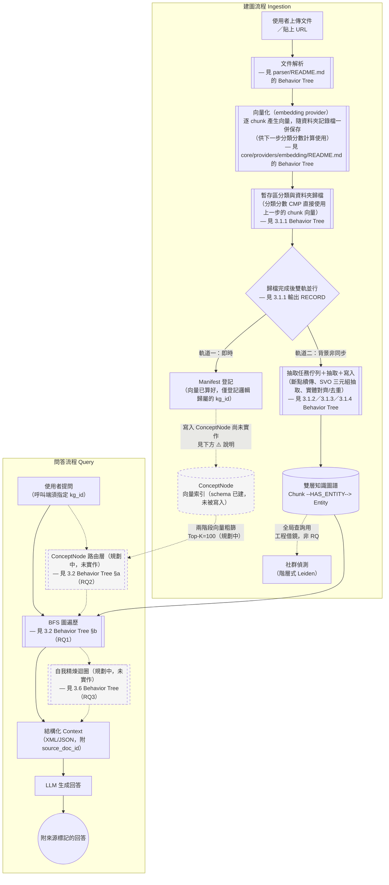

# 報告99：論文對齊批次2——03 §3.1 新增 BT／SM 表示法約定並改寫總覽圖 SDD 任務書

> **日期**：2026-09-29
> **執行者**：Codex｜**設計、撰寫與審核**：Claude Code
> **基準 commit**：`f560e24`（`worktree-sdd-retrieval-comparison`）
> **工作目錄**：`D:\Users\666\Desktop\world knowledge graph rag\.claude\worktrees\sdd-retrieval-comparison`
> **上位文件**：[報告97](97_專案目標與BT_SM工作流設計.md) §5.3 第 1 項；[報告98](98_論文對齊批次1與5_B2現況與過時狀態修正SDD任務書.md)（批次1＋5，已完成並push）
> **性質**：**只改論文文字，一份檔案**。不改程式碼、不改資料、不跑評測、不需要理解程式碼。

---

## 0. 給 Codex 的重點

本任務與報告98不同：報告98是「依已查證的事實改寫敘述」，本任務是**結構設計**——新增一段方法論說明、並用一張**逐字給定**的 Mermaid 圖取代現有總覽圖。

1. **設計判斷已由 Claude Code 做完**：§2 給的新段落文字與新 Mermaid 圖都是**最終版本**，請**逐字複製貼上**，不要自行改寫用詞、不要調整 Mermaid 節點順序或連線方式。
2. 這是**一份檔案的兩處插入點**（`docs/論文/03_系統設計與方法論.md`），另加一筆變更紀錄。全部都在 §3 精確定位。
3. Mermaid 語法本身**未經 mmdc 實際渲染驗證**（本機無 Mermaid CLI）；請貼上後**目視檢查語法**（括號、引號、箭頭是否配對），若發現明顯語法錯誤（例如漏掉引號、`-->` 打成 `->`），可以修正語法本身，但**不得改變節點文字或連線邏輯**——語法修正需在 §6 回填區逐項說明改了什麼、為什麼。
4. 完成後在本機 commit（一個 commit），**不要 push**。

---

## 1. 背景

報告95／97 指出 03 §3.1 的系統總覽圖有兩個問題：

1. 圖中沒有任何機制可以區分「已經在跑的流程」和「規劃中、還沒做的流程」——`ROUTE`（ConceptNode 路由）與 `REFINE`（自我精煉迴圈）用和 `BFS`（已實作）完全相同的實線樣式畫出來，但正文（第 51、3.2 §a、3.6 節）都已經明說這兩者未實作。
2. 全論文沒有一段話說明「行為樹（BT）」和「狀態機（SM）」這兩種圖各自代表什麼、什麼時候該用哪一種——03 章大量使用 BT（`GETSENT`、`DEDUP4`、`POOLSIZE`…），但從未定義這個約定本身。

批次2解決這兩點，同時對齊[報告97](97_專案目標與BT_SM工作流設計.md) §2 的表示法設計與 §4 的 BT-0 總覽樹。

---

## 2. 已定案的內容（Claude Code 設計，請逐字採用）

### 2.1 新段落：BT／SM 表示法約定

這段是**新增的 blockquote**，插入位置見 §3 T1。

```markdown
> **BT／SM 表示法約定（2026-09-29 新增，報告97／99）**：本章的流程圖分兩種表示法，適用範圍不同——**行為樹（Behavior Tree, BT）**描述「一次執行的控制流程」（例如一次問答請求、一個 chunk 的抽取任務），回答「接下來做什麼、失敗時改做什麼」；**狀態機（State Machine, SM）**描述「長期存在實體的生命週期」（例如一份文件、一個抽取任務、一個關係型別提案），回答「這個實體現在處於什麼狀態、可以轉到哪個狀態」。兩者分工明確：BT 節點若需要改變某個實體的狀態，只能透過該實體的 SM 定義好的轉移送出事件，不得繞過 SM 直接寫狀態欄位——這既是方法論主張，也是第四章程式碼追溯時的檢查依據。**圖例**：實線節點與箭頭代表**目前已實作並接在正式流程中**；虛線節點與箭頭（含灰底）代表**規劃中、尚未實作或尚未接線**。本章節點命名沿用既有大寫代號慣例（如 `GETSENT`／`DEDUP4`／`POOLSIZE`）；後續小節新增的代號比照命名，並標明是否已有實作。完整的節點清單、狀態機清單，以及與程式碼、既有報告的逐項對照，見 `docs/報告/97_專案目標與BT_SM工作流設計.md` §3–§4；本節總覽圖對應該報告所稱之「BT-0 系統主樹」。
```

**插入位置**：緊接在既有「**架構圖表繪製慣例**」那段（即目前檔案第 5 行，以「本章沿用 `parser/README.md` 已驗證過的『Behavior Tree』分層繪圖法……」開頭的那個 blockquote）之後、`## 3.1 系統總覽` 標題之前。也就是說，兩個 blockquote 段落相鄰，中間不加標題，維持原本 `>` 開頭的引用區塊排版慣例。

### 2.2 新總覽圖（取代現有 Mermaid 區塊）

以下是**完整替換版**，取代現有第 11–39 行的整個 ```` ```mermaid …``` ```` 區塊（含首尾三個反引號）。**逐字採用**，包含縮排：



**與現有圖的差異（Codex 不需要自行比對，僅供理解，貼上時以上方完整版為準）**：
- `REGIDX["Manifest／向量索引登記…"]` 的節點文字簡化為「Manifest 登記」，並拿掉「向量索引登記」字樣——因為「寫入向量索引」這件事本身尚未實作（見下方 ⚠️ 說明），節點文字不該暗示它已經做到。
- `REGIDX --> CONCEPTIDX` 改為 `REGIDX -.->|"寫入 ConceptNode 尚未實作..."| CONCEPTIDX`，`CONCEPTIDX` 加上 `:::planned` 樣式（虛線灰底）。
- `Q --> ROUTE --> BFS --> REFINE --> CTX` 這條原本一路實線的鏈，改為：`Q --> BFS`（實線，反映目前呼叫端必須直接指定 `kg_id`、沒有路由這一步）、`BFS --> CTX`（實線，反映目前檢索結果直接進入組裝，沒有精煉迴圈）；`ROUTE`、`REFINE` 兩個節點加上 `:::planned` 樣式，並以虛線（`-.->`）連進／連出主線，呈現「這是規劃中會插入的步驟，但今天被繞過」。
- 新增檔案末尾 `classDef planned stroke-dasharray: 5 5,fill:#f5f5f5` 一行。
- `CONCEPTIDX -.->|"兩階段向量粗篩 Top-K=100"| ROUTE` 這條原有的虛線箭頭保留，文字加上「（規劃中）」四字，與其他規劃中節點的標註方式一致。

### 2.3 REGIDX 說明段落微調（非必要但建議一併做）

現有第 51 行（`⚠️ **REGIDX／軌道一的實作狀態…**` 那個 blockquote）內容**維持不動**（已經正確描述了現況），只在該段**最後一句**（「此圖保留 `REGIDX` 分支是為呈現目標架構的雙軌形態，非宣稱其已運作。」）之後，另起一句：

```
本節總覽圖已依此說明將 `REGIDX`／`CONCEPTIDX` 之間的連線與 `CONCEPTIDX` 節點改為虛線標示，與本段文字保持一致。
```

---

## 3. 任務清單

### T1　插入 BT／SM 表示法約定段落

- **檔案**：`docs/論文/03_系統設計與方法論.md`
- **定位**：找到以「> 本章沿用 `parser/README.md` 已驗證過的『Behavior Tree』分層繪圖法」開頭的 blockquote 段落（目前檔案第 5 行）。
- **動作**：在這個 blockquote **正下方**（與 `## 3.1 系統總覽` 標題之間）插入 §2.1 給定的新 blockquote，逐字複製，包含開頭的 `> `。
- **驗證**：插入後，「架構圖表繪製慣例」段落與新的「BT／SM 表示法約定」段落應相鄰、之間沒有其他內容，且都在 `## 3.1 系統總覽` 標題之前。

### T2　替換總覽圖

- **檔案**：同上
- **定位**：現有的 ```` ```mermaid ```` 到對應 ```` ``` ```` 結尾（目前檔案第 11–39 行，`flowchart TD` 開頭、以 `KG --> BFS` 後的 ```` ``` ```` 結尾）。
- **動作**：整段（含首尾反引號）替換成 §2.2 給定的完整版本。
- **驗證**：替換後貼上結果需含 `classDef planned` 這一行；`ROUTE`、`REFINE`、`CONCEPTIDX` 三個節點定義都要有 `:::planned`。

### T3　REGIDX 說明段落補一句（可選，建議做）

- **檔案**：同上
- **定位**：現有 `⚠️ **REGIDX／軌道一的實作狀態…**` 段落的最後一句之後。
- **動作**：依 §2.3 附加一句。

### T4　03 變更紀錄

- **檔案**：`docs/論文/03_變更紀錄.md`
- **動作**：依既有格式（參照 2026-09-28 報告98 那筆的寫法）新增一筆 2026-09-29 條目，內容約：「依報告99新增 03 §3.1 BT／SM表示法約定，並改寫系統總覽圖以虛線標示規劃中節點（ROUTE／REFINE／CONCEPTIDX 寫入路徑）；純文件與圖表調整，不影響任何已完成章節的結論。」

---

## 4. 全域禁止事項

- 不修改任何 `.py`、`.json`、`data/` 檔案；不執行 pytest 或評測。
- 不修改本任務未列出的章節段落（例如 3.1.1–3.1.4、3.2 之後的內容一律不動）。
- **不得**改寫 §2.1、§2.2 給定文字的用詞或語氣；如果 Mermaid 語法本身有明顯打字錯誤需要修正，只能修**語法**（括號/引號配對、箭頭符號），不能改**節點文字內容**或**連線邏輯**，且必須在 §6 回填區列出改了哪裡。
- 不新增額外的 Mermaid 圖、不新增其他小節。
- 使用繁體中文；沿用既有 blockquote／粗體風格。
- 不 push。

---

## 5. 驗收標準（Claude Code 審核時逐項檢查）

| # | 檢查 | 方法 |
|---|---|---|
| A1 | 新 blockquote 逐字插入、位置正確 | 人工核對 §2.1 文字與插入點 |
| A2 | 新 Mermaid 圖逐字替換、`classDef planned` 存在、三個節點有 `:::planned` | 人工核對 diff |
| A3 | 沒有變動 `ROUTE`／`REFINE`／`CONCEPTIDX` 以外的既有節點文字 | `git diff` 逐行核對 |
| A4 | T3、T4 各一筆變更，位置正確 | 人工核對 |
| A5 | `git diff --stat` 只包含 `03_系統設計與方法論.md` 與 `03_變更紀錄.md` | `git diff --stat` |
| A6 | 沒有改到 3.1.1 之後任何既有段落 | 逐檔 `git diff` 人工審閱 |

---

## 6. 回填區（Codex 填寫）

> 完成後請在這裡填寫，然後 commit。

- **commit SHA**：
- **T1–T4 完成情況**：
- **若修正過 Mermaid 語法本身，逐項列出改了什麼、為什麼**（沒有的話填「無」）：
- **發現但未處理的其他問題**：

---

## 7. 給 Codex 的指令（使用者可直接貼上）

```text
請在 D:\Users\666\Desktop\world knowledge graph rag\.claude\worktrees\sdd-retrieval-comparison
（分支 worktree-sdd-retrieval-comparison）執行
docs/報告/99_論文對齊批次2_BTSM表示法約定與總覽圖SDD任務書.md。

開始前：
- 先執行 git status 與 git log -1 --oneline，確認 HEAD 為 f560e24 且工作區乾淨；若不是，停止並回報，不要動手。

規則：
1. 先完整讀完任務書 §0-§5。§2 給的新段落文字與新 Mermaid 圖是最終版本，
   請逐字複製貼上到 §3 指定的位置，不要自行改寫用詞、不要調整 Mermaid 節點順序或連線方式。
2. 只改 docs/論文/03_系統設計與方法論.md（T1-T3）與 docs/論文/03_變更紀錄.md（T4）。
   不改任何程式碼、.json、data/ 檔案，不跑 pytest 或評測。
3. Mermaid 圖若發現明顯語法錯誤（括號/引號沒配對、箭頭符號打錯），
   可以修正語法本身，但不能改節點文字內容或連線邏輯，且要在任務書 §6 回填區逐項說明改了什麼。
4. 遇到任務書沒涵蓋的情況，記在任務書 §6 回填區，不要自行擴大修改範圍。

完成後：
- 填寫任務書 §6 回填區。
- 自行跑一次 git diff --stat，貼在回報中（應只有兩個檔案）。
- 全部變更做成一個本機 commit，訊息開頭：docs(論文): 報告99 批次2
- 不要 push。
- 回報內容：commit SHA、T1-T4 各自完成情況、git diff --stat 的輸出、
  是否有修正 Mermaid 語法本身（若有請列出）、回填區摘要。
```
