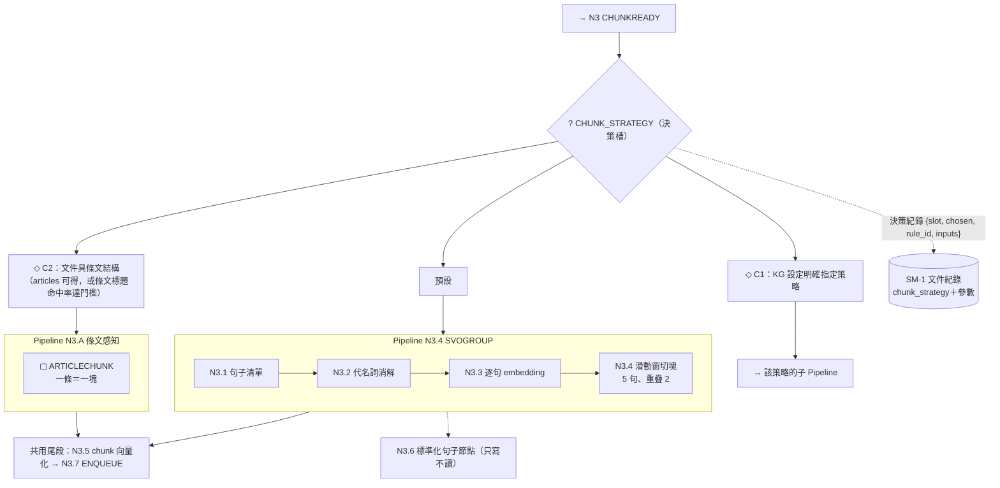

# BT＋SM 節點化結構設計草案 v0.1

> **日期**：2026-09-30
> **性質**：設計討論草案。**未修改任何程式碼、論文或資料檔。** 尚未編號（報告 146 已預留給報告 145 的成果）；使用者確認後由主流程指派編號，並更新[報告索引](00_報告索引.md)。
> **基準 commit**：`d40a6ff`（`worktree-sdd-retrieval-comparison`）
> **與既有文件的關係**：
> - **修訂**[報告97](97_專案目標與BT_SM工作流設計.md) §2（BT／SM 約定）與 §6.3（目標結構）；報告97 §3 SM 清單、§4 BT 清單、§6.5 階段計畫仍是現行工作的依據，本文只列出**需要調整之處**（§9）。
> - **不影響**進行中的報告145（P2 第四刀）與 M2 既有階段；本文的落地路線（§8）是在既有階段之間**插入**的，不重排。
> - 來源：使用者 2026-09-30 的三段說明（見 §1）。

---

## 0. 一頁摘要

1. **BT 的重點是「決策」，不是「走固定流程」。** 固定順序的流程叫 **Pipeline**；BT 負責在流程上預留的**決策槽**，依規則從多種可用做法中選一種，並留下決策紀錄。
2. **BT＋SM 是結構語言**：用它們設計**不同大小、有父子關係的節點**，讓專案可交接、可維護。每個層級的節點共用**同一份介面約定**。
3. **大節點要能獨立成功能**，不依附本專案。獨立性的驗證標準是「**抽離測試**」：把節點資料夾抽出來，接上假的外部能力（ports），它自己的測試能過。
4. **SM 屬於擁有該實體的最小節點**；其他節點只能讀、要改只能送事件。交界約定明確，可擋掉 A8、X1-A 這類「交界兩邊假設不一致」的 bug。
5. 落地載體是**節點卡**（一頁一個大節點）＋**防漂移檢查腳本**。

## 1. 設計原則（使用者 2026-09-30 說明，逐字要點）

| # | 使用者的說明 | 本文的對應 |
|---|---|---|
| P1 | BT 的關鍵是決策，而不是走特定流程。例如查詢時判斷要用 RAG、完整 KG 或其他搭配；某些環節預備了不只一種方式（預設執行、或走該 KG 的特定方式）；抽取的 chunk 切分有五句與自動語意切分兩種。目前流程設計比較像直條式，沒有採用 BT 結構。 | §3 決策槽 |
| P2 | 不侷限於這幾處使用 BT。重點是透過 BT 與 SM 設計出不同大小與父子的節點結構，讓專案更結構化、可交接與維護。 | §2 節點模型、§6 節點卡 |
| P3 | 讓大節點成為獨立功能，不一定只能依附在此專案上使用。 | §5 獨立性 |

## 2. 節點模型

### 2.1 三種節點與一個共用約定

| 類型 | BT 語意 | 用途 | 畫法 |
| --- | --- | --- | --- |
| **Pipeline 節點** | Sequence（依序、任一失敗即失敗） | 固定順序的流程骨架 | Mermaid `flowchart` |
| **Decision 節點** | Selector／Fallback（依序試規則，第一個成立就選它） | **決策槽**：在多種做法中選一種，或「先便宜、不行再升級」 | Mermaid `flowchart`，畫出條件與候選 |
| **Leaf 節點** | Action／Condition | 單一動作或只讀檢查 | 一個函式 |

**任何大小的節點都遵守同一份約定**（節點約定表）：

| 欄位 | 內容 |
| --- | --- |
| 名稱與代號 | 沿用報告95 的 N 編號與論文 03 章代號 |
| 輸入／輸出 | 有型別的資料結構（Pydantic model） |
| 前置條件 | 什麼狀態下才能執行（Condition，可讀 SM） |
| 執行結果 | 成功／失敗／執行中，失敗須帶**原因** |
| 擁有的 SM | 本節點負責哪些實體的生命週期（可為空） |
| 對外事件 | 完成或失敗時發出什麼 |
| ports | 需要的外部能力，以介面宣告（見 §5.2） |
| 設定命名空間 | 對應 `KGConfig` 的哪一段 |
| 決策槽 | 本節點內預留了哪些變化點（見 §3） |

### 2.2 層級

| 層 | 名稱 | 例 | 規則 |
| --- | --- | --- | --- |
| L0 | 系統 | 整個專案 | 只有一棵主樹（報告97 BT-0） |
| L1 | 大節點 | N4 SVO 抽取 | **可獨立**；有節點卡 |
| L2 | 子流程 | N4.3 關係型別仲裁 | 由大節點內部組織 |
| L3 | 葉節點 | `_reconcile_rel_type` | 一個函式 |

- **最多四層。** 再深讀不懂。
- **父節點**負責順序與決策；**子節點不知道兄弟節點的存在**，只依自己的約定運作。
- 代號：`N4.3` 這種層級式代號；葉節點的論文代號（`SIM`、`ESCALATE3`…）維持報告97 §2.5 的規則。

### 2.3 什麼時候該畫 BT、什麼時候畫 Pipeline

| 情況 | 用 |
| --- | --- |
| 步驟固定、失敗就整體失敗 | Pipeline（流程圖即可，不必強調 BT） |
| 有「多種做法、需要選」或「先試 A、不行改 B」 | Decision 節點（BT 的價值所在） |
| 兩者混合 | Pipeline 骨架＋其中幾個位置放 Decision 節點 |

**現有已符合 Decision 的部分**（不必重新發明）：關係型別仲裁（`SIM → COMPARE → ESCALATE3`）、實體去重（`DEDUP4`）、EXPAND 治理（`GATE`）——都是「便宜的先試、不行才升級」的 Fallback 串接。

## 3. 決策槽（Decision Slot）

### 3.1 規格

每個決策槽必須有：

| 要素 | 說明 |
| --- | --- |
| **槽名** | 全域唯一，例如 `CHUNK_STRATEGY` |
| **候選策略** | 有名字的策略清單；每個策略是一個符合共同介面的實作（如已有的 `ChunkingStrategy` Protocol） |
| **決策規則** | **有順序的 Condition 清單**，第一個成立者勝出；最後一定有**預設** |
| **決策紀錄** | 每次決策輸出：`{slot, chosen, rule_id, inputs_snapshot, ts}`，寫進 trace |

**規則優先序（沿用 `KGConfig` 分層精神）**：per-KG 明確指定 ＞ domain pack ＞ 條件規則（依文件／問題／KG 狀態特徵）＞ 系統預設。

**決策紀錄的持久化**：

- **影響可重現性的決策要寫回實體**（例如切塊策略：重抽時必須用同一策略 → 記進 SM-1 文件紀錄）。
- **只影響單次執行的決策只進 trace**（例如查詢路徑）。

### 3.2 決策槽清單（初稿）

> 「現況」欄依 2026-09-30 程式碼核對。**「待使用者補充」欄請使用者補上其他預備了多種做法的環節。**

| 槽名 | 所屬大節點 | 候選策略 | 現況 | 決策由誰做 |
| --- | --- | --- | --- | --- |
| `QUERY_PATH` | N8／N9（查詢入口） | 純 LLM（D）／chunk-RAG（B0、B1）／agentic（B2）／完整 KG（K）／fact_only／bfs_only | 由請求參數 `retrieval_mode` 或評測腳本指定；`query_classifier`／`adaptive_retrieval_service` 有實作但**未接線** | 待定（規則／KG 設定／分類器） |
| `CHUNK_STRATEGY` | N3 | N3.A 條文感知（`ArticleAwareChunking`，即使用者所稱「自動語意切分」）／N3.4 SVOGROUP（`sliding_window`，預設 5 句、重疊 2）／`header_anchored`（N3.4 變體，是否獨立列為候選待裁示） | 由呼叫端依「有無 `articles`」隱性決定；`ChunkingConfig.strategy` 無法表達條文感知；詳見 §3.5 | 規則＋KG 設定（Q4 已裁示） |
| `REL_TYPE_ARBITRATION` | N4 | embedding 判定／比對／LLM 升級 | 已是 Fallback 串接 ✅ | 分數門檻 |
| `ENTITY_DEDUP` | N5 | 守衛精確比對／編輯距離／cosine／LLM | 已是 Fallback 串接 ✅ | 分數門檻＋守衛 |
| `GEN_MODE` | N11 | 單次生成／規則式分解逐題／baseline（不套分解與修正） | 由多個問號與 baseline 旗標決定 | 規則 |
| `CORRECTION_MODE` | N11 | 無需修正／定向修正／限制性重生成 | 由接地核對結果決定 ✅ | 核對結果 |
| `GRAPH_PRUNING` | N9 | 無剪枝／L1（剔除樞紐，現行）／L2 向量引導（`bfs_query(prize_top_k=…)`） | L2 已實作、預設關 | 規則（**上線須評測閘控**，RQ6） |
| `FACT_RETRIEVAL_MODE` | N9 | 純向量（現行）／`hybrid`／`source_doc_cap` | 參數已有、預設關；n=3 消融中 `hybrid` 反而使品質下降 | **登記槽、預設固定為純向量，暫不寫自動規則**（有負面證據） |
| `ARTICLE_EXPANSION` | N9 | 不擴充（現行）／`_expand_facts_by_article` | opt-in；S2 無淨增 | 同上：登記槽、預設固定 |
| `PRONOUN_RESOLUTION` | N3 | 全面／per-KG 排除詞／跳過 | 已由 per-KG 設定驅動（法規排除「其」「該」） | KG 設定（不需另寫規則） |

**Q5 處理（2026-09-30，依 Claude 建議）**：上表新增四列，採用準則＝「**已有 2 種以上實作且已有切換開關**」。**不列為決策槽**的：生成後核對的 judge 是否獨立（純設定）、抽取 few-shot／關係詞彙（`KGConfig` 分層已涵蓋，屬設定而非執行期決策）。**負面證據的選項只登記、不寫自動規則**，避免重蹈 Type-C 過擬合。使用者日後仍可補充。

### 3.3 為什麼 `QUERY_PATH` 最重要

RQ1 顯示 K 整體沒有勝過 B1（42 題：13/42 對 21/42），論文定位是**診斷 KG 在什麼條件下有增益**。`QUERY_PATH` 的決策規則就是這個診斷的**可執行版本**：評測找出條件，規則把條件落實成路由，產品邏輯與研究結論不脫節。

### 3.4 風險與守則

- **過擬合**：Type-C 行為樹規則對題庫過擬合（報告95 §11），因此**決策規則上線前須有評測把關**（沿用逐階段評分閘控），且不得用題庫題目文字設計規則。
- **槽不要一次開太多**：先做 2–3 個（建議 `QUERY_PATH`、`CHUNK_STRATEGY`，再加一個），其餘維持現況。
- **每次決策必留紀錄**：沒有紀錄的選擇等於回到隱性狀態。

### 3.5 案例：`CHUNK_STRATEGY` 決策槽（N3.A／N3.4，使用者 2026-09-30 指定）

> 使用者指出「五句」與「自動語意切分」就是報告95 的 **N3.4 SVOGROUP** 與 **N3.A 條文感知切塊**。本節依此建立 BT。**先前「查無語意切分」的疑慮解除**（Q6 已回答，見 §10.2）。

**現況（程式核對）**：選擇是**隱性的、在呼叫端**——

- `prepare_svo_ready_chunks(articles=…)`：`articles is not None` → `ArticleAwareChunking`（N3.A，按條文邊界，**完全不讀 `ChunkingConfig`**）；否則 → `build_svo_chunks(config=…)`（N3.4，預設 5 句、重疊 2）。
- `articles` 只由法規匯入腳本傳入，**沒有持久化**，所以產品上傳路徑**無法選到 N3.A**（現以 `ArticleStructureLossError` 防呆）。
- `ChunkingConfig.strategy` 只能表達 `sliding_window`／`header_anchored`，**無法表達「條文感知」**；且 `header_anchored`（用 `header_regex` 從句子清單辨識「第X條」）其實是 N3.4 內部一個能在**沒有預先解析 articles** 時處理法規型文件的變體。
- 兩條路徑的**下游步驟不同**：一般路徑有代名詞消解（N3.2）與標準化句子節點（N3.6）；條文感知路徑沒有。所以這個決策選的不是單一葉節點，而是**兩條子 Pipeline**。

**目標結構（提案）**：決策節點選子 Pipeline，兩者共用尾段。



**決策規則（有序，第一個成立者勝出）**：

| 序 | 規則 | 選擇 | 現況 |
| --- | --- | --- | --- |
| C1 | `KGConfig.chunking.strategy` 明確指定 | 該策略 | ⚠️ 需先擴充設定值（目前無 `article_aware`） |
| C2 | 文件具條文結構 | N3.A | 🟡 現況等價於「呼叫端有傳 `articles`」；產品路徑要能成立，須先讓 articles 可持久化或可由 `original.md` 重建 |
| C3 | 預設 | N3.4（`sliding_window`，5／2） | ✅ 現況 |

**本案例的三項裁示（2026-09-30，使用者同意 Claude 建議）**：

1. **`header_anchored` 列為第三個候選。** 它能在沒有預解析 articles 時近似條文感知，可當產品路徑上「偵測到條文標題就用它」的中間方案。
2. **C2 的「條文結構」判定：S5a 只認呼叫端明確傳入 `articles`（選項 a，等價現況）；由 `original.md` 用 `header_regex` 偵測命中率（選項 b，行為變更）留待 S5b 再評估。**
3. **決策紀錄寫入 SM-1**（重抽時須沿用同策略；`ArticleStructureLossError` 防呆的根因就是策略沒被記錄）。

**S5 因此拆成兩步**：**S5a** 只把現有隱性決策顯性化並記錄（選擇結果與現況逐字相同，等價重構）；**S5b** 新增 C1／C2(b)（改行為，須另開任務，依評測與抽取結果把關）。

## 4. SM 歸屬與 BT／SM 介面

### 4.1 規則

| # | 規則 |
| --- | --- |
| R1 | **SM 屬於擁有該實體的最小節點。** |
| R2 | 其他節點**只能讀**該 SM，要改狀態只能**對擁有者送事件**。 |
| R3 | 轉移必須**帶預期的來源狀態**（compare-and-set）；實際狀態不符就轉移失敗。BT 的 Condition 讀取後、Action 轉移前可能有競態，靠此規則兜底。專案的資料修補流程已採用，升格為通用規則。 |
| R4 | **跨 SM 的寫入順序是明文協定，由一個協調點執行。** 例：SM-1 是權威、SM-2 是可重建的索引，完成事件由協調點「先 SM-1、後 SM-2」套用；BT 端只送一個事件（`DONE4`／`FAIL`），不必知道兩張表的順序。 |
| R5 | **重試分兩層**：單次執行內的重試屬於 BT（Retry／Fallback 修飾）；跨執行的重試屬於 SM（`failed → pending` 事件，由重抽腳本或啟動恢復觸發）。 |
| R6 | **`FAIL` 事件必須帶失敗原因**，SM 記錄之（補上報告97 §3.2 的缺口「failed 沒有記錄原因」）。 |

### 4.2 SM 清單調整（相對報告97 §3.0）

| SM | 調整 | 理由 |
| --- | --- | --- |
| SM-1 文件、SM-2 抽取任務 | 維持；歸屬分別為 N2、N4；R4 協定明文化 | X1-A 的根因是兩邊各自寫狀態 |
| SM-4／5 EXPAND 候選與提案 | 維持；歸屬 X3 | — |
| SM-7 評測執行 | 維持；歸屬 N13 | `failure_attribution` 是**分類**不是狀態，應獨立欄位 |
| SM-8 知識圖譜 | 維持為**衍生狀態**（`empty／building／ready／degraded`），不新增儲存欄位 | 供決策槽的 Condition 讀取（如 `QUERY_PATH` 判斷 KG 是否 ready） |
| **SM-3 暫存分類結果** | **降級為輸出資料結構** | 不持久化，歷史已在 SM-1 的 `assignment_history` |
| **SM-6 問答回合** | **降級為 BT 執行軌跡（trace 事件）** | 只是單次執行的進度回報，沒有轉移表、不持久化、沒人依它決策，不符 SM 定義 |
| SM-9、SM-10 | 維持 📐 規劃 | RQ5、RQ3 |

## 5. 大節點獨立性

### 5.1 獨立的四個條件

1. **依賴走介面（ports），不直接 import 具體實作。**
2. **設定由外面傳入**，不讀全域設定（`core.config`）。
3. **持有自己的資料模型與 SM**，不讀取其他節點的內部資料表。
4. **自帶測試，只用假的 ports 就能通過。**

**抽離測試**：把該節點資料夾複製出去，接上假的 LLM／embedding／圖儲存，節點自己的測試能通過。這是「可獨立」的可執行判準。

### 5.2 ports 清單（草案）

| port | 內容 | 現況 |
| --- | --- | --- |
| `LLMPort` | 生成、結構化輸出 | `core/providers/base.py::LLMProvider` ✅ 已有 |
| `EmbeddingPort` | 向量化 | `core/providers/base.py::EmbeddingProvider` ✅ 已有 |
| `GraphStorePort` | 實體／關係／Fact 的讀寫、向量檢索、BFS | ❌ **缺**：`driver` 雖由呼叫端注入（好），但型別綁 `neo4j.AsyncDriver`，Cypher 直接寫在 `svo_service.py` 內（處數未逐一統計） |
| `DocumentStorePort` | 原文、chunk、`_record.json`、`svo_index.json` | ❌ 缺：以檔案路徑散落各處（A8 的根因之一） |
| `ConfigPort` | 節點的設定命名空間 | 🟡 `KGConfig` 已有分層與凍結，但部分節點仍讀全域設定 |

### 5.3 各大節點的可獨立性（由易到難）

| 排序 | 大節點 | 需要的 ports | 判斷 |
| --- | --- | --- | --- |
| 1 | **N4 SVO 抽取** | LLM、Embedding | 輸入 chunk 文字、輸出三元組，**不碰資料庫**；最適合當獨立化的試點 |
| 2 | **N2 文件分類** | Embedding、DocumentStore | 只需向量與文件存取 |
| 3 | **N13 評測 Harness** | 生成堆疊的公開 API | 已是 CLI；需先把私有函式引用換成公開 API（報告97 D5） |
| 4 | **N10 上下文組裝** | Embedding | P2 已抽出一部分（`services/context/`） |
| 5 | **N11 生成與核對** | LLM、Embedding | 依賴 N10 的輸出型別 |
| 6 | **N9 KG 內檢索** | Embedding、GraphStore | 需先有 `GraphStorePort` |
| 7 | **N5、N6 寫入與儲存** | LLM、Embedding、GraphStore | 需先有 `GraphStorePort`；N5 粒度偏大（去重、寫邊、自然化、Fact 四件事），獨立前可能要再拆（見 §10 Q2） |

### 5.4 目前的耦合障礙

| 障礙 | 影響 |
| --- | --- |
| `svo_service.py`（約 3,400 行）橫跨 N3、N4、N5、N9 與維護函式 | N4、N5 無法各自獨立（= 報告97 P3） |
| 圖儲存沒有介面，Cypher 寫在 service 內 | N5、N6、N9 |
| `routers/agent.py` 內 N9–N11 互相呼叫私有函式 | 檢索、生成（P2 進行中） |
| 部分節點直接讀全域設定 | 多數 |
| 大節點之間以檔案路徑傳遞位置 | N2→N3（A8） |

## 6. 節點卡與防漂移檢查

### 6.1 節點卡（每個大節點一頁）

放在節點資料夾內（`NODE.md`），內容：

| 區塊 | 內容 |
| --- | --- |
| 目的與規劃狀態 | 對應報告95 的 ✅／🟡／📐 |
| 節點約定表 | §2.1 的欄位逐項填寫 |
| 結構圖 | Pipeline／Decision 的 Mermaid 圖，虛線標規劃中或未接線 |
| 決策槽 | 槽名、候選、規則、現況 |
| 擁有的 SM | 狀態、事件、轉移表、真實狀態來源 |
| ports 與設定 | 需要什麼、設定命名空間 |
| 論文章節與報告 | 03／04／05–07 的對應 |
| 測試 | 節點自己的測試位置、抽離測試是否通過 |
| 已知缺口 | 沿用報告96 的登記缺漏 |

**用途**：新接手的人或 agent 讀節點卡就知道這個節點做什麼、怎麼接；取代散在數十份報告裡的說明。

### 6.2 防漂移檢查腳本（規格）

- 掃描各 `NODE.md` 中出現的葉節點代號，確認在程式碼的 `Traceability:` 註解裡**都找得到**，反之亦然。
- 掃描各節點資料夾的 import：**節點不得 import 其他節點的內部模組**，只能經由該節點公開的 `contract`。
- 列為 pytest 測試（像目前 `tests/` 內的反向依賴 AST 測試），失敗即擋。
- **不引入 BT 執行框架**（沿用報告97 D1）：BT 是結構約定，不是執行引擎。

## 7. 目錄結構（提案）

報告97 §6.3 是**依層次**分（`services/extraction/`…）。若要讓節點可整包搬走，應**依節點**分。**漸進式，不一次搬**：P2 已建立的 `services/context/`、`services/retrieval/` 就是節點資料夾的雛形。

```text
<node>/                    例：services/context/（N10）、services/extraction/（N4）
  NODE.md                  節點卡
  contract.py              輸入／輸出資料結構、對外事件（公開介面）
  ports.py                 本節點需要的外部能力（Protocol）
  state.py                 本節點擁有的 SM（若有）
  flow.py                  本節點的協調函式（Pipeline／Decision 的程式形態）
  <leaf>.py                葉節點（純函式或單一動作）
tests/<node>/              節點自己的測試（抽離測試用假 ports）
```

- `routers/` 只做 HTTP／SSE 與請求驗證，呼叫各節點的 `flow.py`。
- `state/`（已建立）：SM-1、SM-2 目前集中於此；依 R1，長期應各歸其擁有節點，**本文不要求現在搬**，等對應節點成形時再處理。
- 既有 `Traceability:` 註解格式沿用。

## 8. 落地路線（插入既有 M2 階段之間，行為皆不變）

> 進行中：報告145（P2 第四刀，Codex 執行中）。**以下都在其完成並驗收後才開始**，且不改變 M2 既有階段順序。

| 步驟 | 內容 | 是否改行為 | 驗收 |
| --- | --- | --- | --- |
| **S1** | 使用者確認本草案（§10 開放問題）——**Q1–Q4 已裁示（§10.1）；Q5–Q7 仍開放（§10.2）** | — | 本文待升為正式報告並編號（使用者確認後） |
| **S2** | 為**已成形的節點**補節點卡：N10（`services/context/`）、N9 的 `services/retrieval/`（第四刀完成後） | 否（純文件） | 節點卡與程式代號互查 |
| **S3** | 寫防漂移檢查腳本＋測試（§6.2） | 否 | pytest 全綠；故意破壞可被抓到 |
| **S4** | 定義 `GraphStorePort`（Protocol）＋以 Neo4j 實作包住現有 Cypher，**先只宣告介面與轉接，不改呼叫端** | 否 | 既有測試全綠 |
| **S5a** | 決策槽試點：`CHUNK_STRATEGY`——把現有「有 articles 就走條文感知」的隱性決策顯性化成 Decision 節點＋決策紀錄（寫入 SM-1），**選擇結果與現況逐字相同**（見 §3.5） | 否（等價重構） | 對現有匯入路徑輸出逐字相同 |
| **S5b** | `CHUNK_STRATEGY` 新增 C1（KG 設定指定，需擴充設定值）與 C2(b)（由原文偵測條文結構）；articles 可持久化或重建 | **是** | 須另開任務；依評測與抽取結果把關 |
| **S6** | 抽離測試試點：N4（只需 LLM、Embedding） | 否 | 抽離測試通過 |
| **S7** | 決策槽 `QUERY_PATH`：先把 `retrieval_mode` 等現有參數登記為候選與規則，**不新增自動分流** | 否 | 同上 |
| **S8** | 新增**自動分流**規則（會改行為，須先有評測條件；另開任務、另設閘控） | **是** | 依評測閘控，屬 M3 |

與報告97 §6.5 的關係：S4 是 P3（拆 `svo_service.py`）的前置；S5–S7 可與 P4（建構路徑）併行設計；S8 屬 M3 研究延伸。**S1 之前不動任何程式。**

## 9. 相對報告97 的修訂彙整

| 報告97 位置 | 原內容 | 本文修訂 |
| --- | --- | --- |
| §2.1 | BT＝一次執行的控制流程 | BT＝**決策**；固定流程稱 Pipeline |
| §2.4 | BT 改狀態只能發事件 | 沿用，並加 R3（帶來源狀態）、R4（跨 SM 協定）、R5（重試分層）、R6（失敗原因） |
| §3 SM 清單 | SM-1～SM-10 | SM-3、SM-6 降級；SM-8 明定為衍生狀態 |
| §4 BT 清單 | BT-1～BT-7 皆畫成樹 | 僅有決策的處才畫 Decision；其餘為 Pipeline；BT-6、BT-7 多為 Pipeline |
| §6.3 目標結構 | 依層次分子套件 | 依**節點**分，每節點含 `NODE.md`、`contract.py`、`ports.py`、`flow.py` |
| §6.2 D1 | 不導入 BT 框架 | **維持** |
| §6.2 D5 | harness 改用公開 API | 維持；併入 §5.3 的獨立性排序 |
| （無） | — | 新增：決策槽、節點卡、ports、抽離測試、防漂移檢查 |

## 10. 裁示與待裁示

### 10.1 已裁示（2026-09-30，使用者：「有明確建議理由就依照你的建議與判斷；判斷不出來再討論」）

| # | 決議 | 理由 | 影響 |
| --- | --- | --- | --- |
| Q1 | **獨立功能形態＝同 repo 內邊界清楚的資料夾**；不做 pip 套件、不做獨立服務 | 抽離測試即可驗證可獨立；套件化要版本化與發佈，論文期限內不划算；獨立服務屬 M4 | `contract.py`／`ports.py` 寫清楚即可，**不需版本號**；日後升級成套件只是打包動作 |
| Q2 | **N1–N13 大致沿用；N5 暫不拆** | 先做 N4 抽離試點，實際碰到 N5 邊界問題再拆，才知道切在哪最自然；避免與 P3（拆 `svo_service.py`）搶同一批程式碼 | N5 屆時可能拆成「實體治理／圖寫入／自然化」三個子節點（僅備案，未定案） |
| Q3 | **節點之間先用「直接呼叫＋明確資料結構」**；不上事件匯流排 | 成本低；日後要換事件，只要 `contract.py` 的資料結構不變即可 | S2–S7 的介面形態 |
| Q4 | **決策機制分層**：`CHUNK_STRATEGY`＝規則＋KG 設定；`QUERY_PATH`＝規則優先，分類器留到評測有結論後；Fallback 串接＝分數門檻；**不採 LLM 判斷路由**；**決策紀錄一律要寫** | 前者是可檢查的事實；分類器易過擬合題庫（Type-C 前例）；LLM 路由多一次呼叫、不確定、不利論文可重現 | §3.2「決策由誰做」欄依此填 |

### 10.2 仍待裁示（不阻擋 S2–S4、S6）

| # | 問題 | 建議（未裁示） | 影響 |
| --- | --- | --- | --- |
| Q5 | ~~補充其他預備了多種做法的環節~~ **已處理（2026-09-30）**：依 Claude 建議補進 §3.2 四列（`GRAPH_PRUNING`、`FACT_RETRIEVAL_MODE`、`ARTICLE_EXPANSION`、`PRONOUN_RESOLUTION`） | 使用者授權「有明確理由就依建議」；日後仍可補充 | §3.2 清單 |
| Q6 | ~~自動語意切分是否已有實作？~~ **已回答（2026-09-30）**：使用者指出就是報告95 的 **N3.A（條文感知）與 N3.4（SVOGROUP）** | 依此建立 BT，見 §3.5 | S5a 解除阻擋；§3.5 三項裁示已定（列 `header_anchored`、S5a 的 C2 只認明確傳入 `articles`、決策紀錄寫 SM-1） |
| Q7 | ~~本草案要不要寫進論文~~ **已採建議（2026-09-30）：先不寫**（03 §3.1 表示法約定、01 §1.3 產品工程貢獻）。 | 等 S5／S6 試點證明可行後，再以實際結果為依據寫入，避免 M1 已定稿的章節反覆修改（報告97 §1.3 的同一理由） | 論文對齊工作量 |

**S1 狀態**：Q1–Q4 已裁示、Q6 已回答，**S2、S3、S4、S6 可在報告145 驗收後啟動**；**S5a 已可在報告145 驗收後啟動（§3.5 三項裁示已定）**；S7 待 Q5 補充後決定範圍。**尚未授權任何程式改動的實際排程**，仍依使用者指派。

### 10.2b 新增（附錄 A 的 N4 contract 草稿引出）

| # | 問題 | 狀態 / 建議 | 影響 |
| --- | --- | --- | --- |
| Q8 | N4 的 EXPAND 候選池與 ESCALATE3 仲裁事件目前由 N4 內部直接寫入 SQLite。改為**由 N4 回傳事件、由 X3 寫入**？ | **採建議（理由明確：R2，SM-4 屬 X3）**；實作時須驗證與現況等價（寫入時機由「函式內途中」變成「回傳後」） | S6 的範圍；N4 簽名不再需要 `kg_id`、`calibration_db_path` |
| Q9 | `SVOTriple` 混合了「抽取結果欄位」與「來源追溯欄位」（約 10 個 provenance 欄位）。是否拆成兩個型別？ | **待討論**：牽涉 N4、N5、N9、評測共用，影響面大；建議先不拆，僅在 `contract.py` 重新匯出並註記欄位分群 | N4／N5 邊界 |
| Q10 | `QUERY_PATH` 的**產品**候選是否含 B2（agentic）？ | **待討論**：B2 n=41 略低於 B1（0.681 對 0.693）、約 3 倍呼叫、維持 optional；目前只是評測臂 | `QUERY_PATH` 候選清單 |

### 10.3 原問題（保留）

| # | 問題 | 影響 |
| --- | --- | --- |
| Q1 | **「獨立功能」的最終形態**：可 pip 安裝的套件、獨立服務，或只是同一 repo 內邊界清楚的資料夾？ | 決定 ports 與 contract 的嚴格程度、是否要版本化 |
| Q2 | **N1–N13 的粒度是否沿用？** 例如 N5 同時管去重、寫邊、自然化、Fact 節點，若要獨立可能需拆 | 決定節點卡與資料夾切法 |
| Q3 | **大節點之間怎麼傳遞？** 先用「直接呼叫＋明確資料結構」（建議，成本低）或一開始就用事件匯流排 | S2–S7 的介面形態 |
| Q4 | **決策由誰做？** 寫死的規則、KG 設定檔、分類器或 LLM；不同槽可以不同 | §3.2 「決策由誰做」欄 |
| Q5 | **補充其他預備了多種做法的環節** | §3.2 清單 |
| Q6 | **「自動語意切分」是否已有實作？** 本次核對只找到 `sliding_window`、`header_anchored`、`ArticleAwareChunking`，**查無語意切分程式**；若在其他分支或未提交，請指出位置 | `CHUNK_STRATEGY` 候選清單 |
| Q7 | 本草案要不要寫進論文（例如 03 §3.1 的表示法約定、01 §1.3 產品工程貢獻）？ | 論文對齊工作量 |

## 11. 本次核對的事實（2026-09-30，基準 `d40a6ff`）

- （2026-09-30 補）`prepare_svo_ready_chunks(articles=…)`：`articles is not None` → `ArticleAwareChunking`，否則 `build_svo_chunks(config=…)`；條文感知路徑不讀 `ChunkingConfig`（`services/svo_preprocessing_service.py:189-229`）。「自動語意切分」即 N3.A，非另有程式。
- `ChunkingConfig.strategy` 的取值只有 `sliding_window`／`header_anchored`（`core/kg_config/model.py:180`）；預設 `max_sentences=5`、`overlap_sentences=2`；`ArticleAwareChunking` 是 `services/svo_chunking.py` 內的另一個類別，由呼叫端（匯入腳本）選用。
- `retrieval_mode: Literal["both","bfs_only","fact_only"]`（`models/document.py:70`）由請求帶入。
- `svo_service.py` 的圖存取函式以參數注入 `AsyncDriver`，型別為 `neo4j.AsyncDriver`；`create_*_index` 等定義在同檔。
- `services/context/`（`fact_lines.py`、`telemetry.py`）與 `state/`（`document_sm.py`、`task_sm.py`）已存在；`services/retrieval/` 由報告145 建立中。
- 回歸基準：1344 passed（HANDOVER 2026-09-30）。

---

## 附錄 A：N4 SVO 抽取的 contract 草稿（S6 抽離試點用）

> **依據**：`services/svo_service.py` 函式簽名核對（`extract_svo_triples` 第 438 行、`extract_svo_triples_with_completeness_check` 第 1012 行、`_reconcile_rel_type` 第 364 行）與 `models/knowledge_graph.py::SVOTriple`。**草稿，未實作。**

### A.1 現況簽名（核對結果）

```text
extract_svo_triples_with_completeness_check(
    text, original_sentences,
    llm_provider=None, embedding_provider=None,
    *, cfg: KGConfig|None, kg_id: str|None, calibration_db_path: Path|None
) -> list[SVOTriple]
```

### A.2 核對發現的三個問題

| # | 發現 | 為何影響獨立性 |
| --- | --- | --- |
| 1 | **隱性副作用**：`kg_id` 與 `calibration_db_path` 都提供時，`_reconcile_rel_type` 會把**未知動詞寫入 EXPAND 候選池**，並把 **ESCALATE3 仲裁事件寫入 SQLite**（第 426–433 行） | 「抽取」節點竟寫入 X3 擁有的 SM-4 資料；違反 R2；抽離後必須帶著 SQLite 才能跑 |
| 2 | `llm_provider`、`embedding_provider` 皆可為 `None`，`None` 代表**靜默降級**（如無 embedding 就直接採信 LLM 自報型別） | contract 必須把「降級」寫成明確語意，否則呼叫端不知道少了什麼 |
| 3 | 失敗時例外向上拋，由 `extraction_worker._process_one` 吞掉並標 `failed`（報告57 附錄C） | 違反 R6：失敗原因沒有進入 SM |

### A.3 contract 草稿

```text
輸入  ExtractionInput
        text: str
        original_sentences: Sequence[str]      # 完整性核對用
        config: KGConfig 的抽取段（規則、few-shot、門檻、型別詞彙）
ports LLMPort（必要）、EmbeddingPort（可選，缺則明確降級並在結果標記）
輸出  ExtractionResult
        triples: list[SVOTriple]               # N4→N5 的共用資料型別
        arbitration_events: list[...]          # 原本寫 SQLite 的 ESCALATE3 事件（Q8）
        expand_candidates: list[...]           # 原本寫 EXPAND 池的未知動詞（Q8）
        degraded: list[str]                    # 例：["no_embedding"]
        status / failure_reason                # R6
簽名不再需要  kg_id、calibration_db_path      # 寫入改由 X3 依 result 執行
```

### A.4 抽離測試（S6 驗收）

- 只用**假的 LLMPort／EmbeddingPort**，不連 Neo4j、不建 SQLite，N4 自己的測試通過。
- 差分測試：同一批輸入，抽離後結果的 `triples` 與現況**逐字相同**；`arbitration_events`／`expand_candidates` 與現況實際寫入 SQLite 的內容相同。
- 依賴檢查：N4 資料夾不得 import `repositories`、`neo4j`、`sqlite3`。
