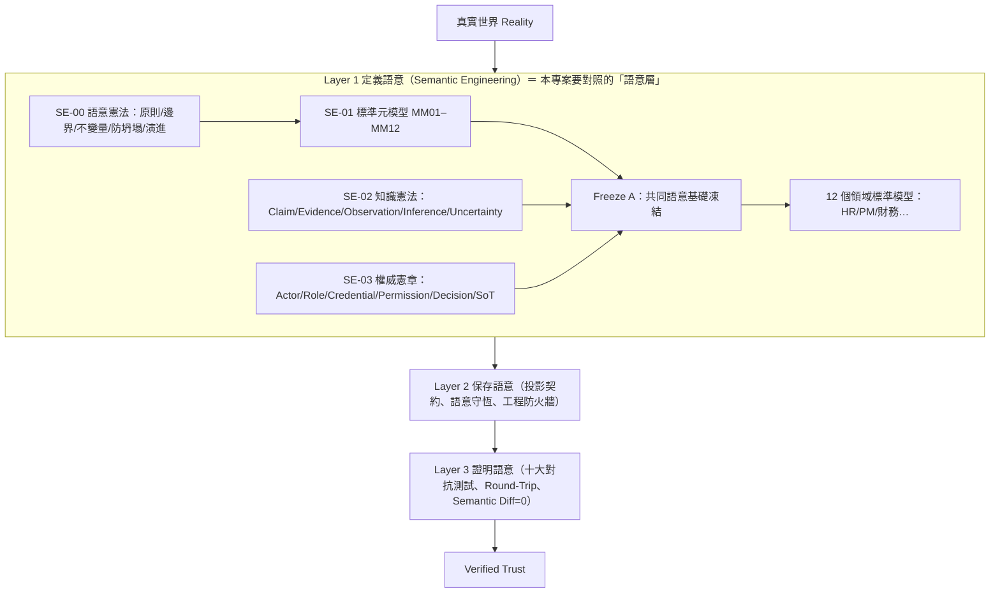

# Lumori 簡報「語意層（語意模型）」對照本專案——設計原理理解與缺口檢查 v0.1

> **日期**：2026-10-01
> **性質**：只讀檢查報告。**未改任何程式、論文、題庫；未啟動 Neo4j／Ollama；未跑任何實驗。**
> **對象**：`D:\Users\666\Desktop\本體論設計\Lumori PPT`（6 章、66 張投影片）vs 本專案（World Knowledge Graph RAG，分支 `worktree-sdd-retrieval-comparison`）。
> **方法**：① 讀各章 `README.md`（前一對話整理的逐頁說明），並**抽 4 張關鍵投影片原圖核對**（八大建構 `0.1.04.03`、MM01–05 `0.1.05.04`、MM06–12 `0.1.05.05`、SE-01/02/03 `0.1.05.06`）——README 與原圖一致；其餘投影片僅讀 README、未逐張看原圖。② 以程式碼讀取核對本專案現況（Grep／Read，**讀碼為主、未執行**）。
> **標記**：〔事實〕附 `檔案:行號`；〔推論〕我的判斷（附把握度）；〔無資料〕未能核對。
> **同系列文件**：[`本體抽取與系統落地工程缺口紀錄表_v1.0.md`](file:///D:/Users/666/Desktop/本體論設計/本體抽取與系統落地工程缺口紀錄表_v1.0.md)（GAP-01～09，法規領域切入）、[`本體論計畫對接_待確認事項與資料收集清單_v0.1.md`](本體論計畫對接_待確認事項與資料收集清單_v0.1.md)。本報告從**簡報的語意層結構**切入，並標出與 GAP 表重疊與**未被 GAP 表涵蓋**的項目。

---

## 0. 結論先講（給沒空的你）

1. **簡報的「語意層」不是「抽取出圖」，而是一套「描述世界的語法」**：八個建構（Identity／Relation／Time／Rule／Authority／Evidence／Event／History）＋ MM01–MM12 元模型，核心是**防止概念坍塌**（Person≠Employment、Evidence≠Truth…）與**把「意義、知識、權威」分成三件事**。
2. **本專案目前做得最像簡報的部分是 Evidence（來源追溯）**：句子層級的來源、邊上累積引用、事實節點掛到法條。其餘七個建構，**Relation、Time、Identity 有但偏弱，Authority、Event、History、Admission 基本沒有**。
3. **最大的結構性落差有五項**（§3）：① 詞彙與領域不符（關係＝ConceptNet 通用常識、實體型別＝schema.org 網頁型別，台灣勞動法的領域包是空的）；② **實體身份＝可變動的名稱**（沒有穩定 ID，合併靠 embedding 相似度）；③ 時間只在文件層、不進事實也不進檢索；④ **沒有權威位階**，衝突的主張被合併成同一條邊；⑤ **所有事實一抽出就算數**（沒有候選／已接納／未決狀態，`confidence` 只是個整數）。
4. 其中 ②④⑤ 與**時間（③）的「改寫即覆蓋」**，**不在既有 GAP 表裡**；①③與關係載體、條件綁定已在 GAP 表。
5. **簡報本身有很多地方太抽象**（§1.3）——它沒說怎麼從文件抽取、沒定義「相同」、沒說接納標準、權威模型是組織式而非法規式。所以我的檢查是「把抽象原則翻成可檢查的具體問題」，這個翻譯是我的詮釋，**需要你確認**。

---

## 1. 我對簡報設計原理的理解

### 1.1 簡報的結構

### 1.2 設計原理（我的歸納）

| # | 原理 | 簡報依據 | 白話 |
| --- | --- | --- | --- |
| P1 | **意義先於實作** | 第4章 02：先問 What does it mean？再談 DB／API | 先決定「世界裡有什麼、各自什麼意思」，別先建表 |
| P2 | **防坍塌（Anti-Collapse）** | 第4章 01、03：Person≠Employment、Role≠Authority、Evidence≠Truth、Decision≠Execution、Product≠Goods | 看起來很像的概念要被明確分開；實作時不可悄悄合併 |
| P3 | **「意義／知識／權威」是三件事** | 第5章 06：SE-01 是什麼意思／SE-02 憑什麼相信／SE-03 誰有權決定 | 抽到一句話≠它是真的≠它有效力 |
| P4 | **八個建構缺一不可** | 第4章 03 | Identity、Relation、Time、Rule、Authority、Evidence、Event、History |
| P5 | **接納機制，允許未知** | MM08 Candidate→Unresolved→Admission；「允許暫時未知，但不造成語意崩塌」 | 不確定的東西要有「未決」的位置，不能強填值 |
| P6 | **機器可精確讀取的註冊表** | MM09：Canonical↔Registry↔Exact Mapping | 詞彙表／代碼表要單一、雙向可對、零差量 |
| P7 | **近≠相同（Manifold ≠ Ontology）** | 第3章 05：cosine 很近不代表可替換（合約≠訂單） | 向量相似度只能當候選，不能當等價判定 |
| P8 | **狀態誠信** | 第6章 02：FROZEN／VALIDATED／IN PROGRESS／BLOCKED／NOT EXECUTED；Status is evidence | 「完成」要有證據；未驗證就明說未驗證 |
| P9 | **憲法與元模型互檢＋凍結門檻** | MM10–MM12、Freeze A | 基準線要經對抗測試與一致性檢查才凍結 |

### 1.3 簡報太抽象、沒說清楚的地方（以及我怎麼詮釋）

| 簡報沒說的 | 為什麼重要 | 我的詮釋（**請確認**） |
| --- | --- | --- |
| **怎麼從文件得到這些建構** | 簡報起點是「現實世界」（含人員、系統），不是文件 | 抽取只能產生**候選**；Identity／Authority／Rule 的「決定」不是抽取能完成的（與你的〈簡報理解記錄〉結論一致） |
| **「相同」（Identity）的判準** | MM02 只說「什麼時候仍然是同一個」，沒給判準 | 對本專案＝實體合併／拆分的規則與可追溯性 |
| **Admission 的標準** | MM08 沒說候選怎樣算被接納 | 對本專案＝一筆事實從「LLM 抽出」到「可被檢索當依據」之間要有閘門與狀態 |
| **Authority 在法規語料的樣子** | 簡報的 Authority 是組織式（Actor／Role／Credential）；法規的權威是**法源位階、制定機關、生效／廢止、新舊法** | 需自行改寫成「誰制定、位階、何時生效、與其他來源衝突時聽誰」 |
| **Semantic Diff = 0 的「意義相等」定義** | 沒定義就無法驗證 | 本專案若要做 Layer 3，需先定義事實層級的等價（本報告不展開） |
| **粒度：「最小單位名詞」** | 簡報第2頁用「人 vs 員工」，沒給判準 | 以「是否有獨立的生命週期與屬性集合」為判準（我的假設） |
| **領域模型的格式** | 12 個領域模型只有名單 | 對本專案＝「台灣勞動法領域模型」本身要自己定義（見 §3-①） |

---

## 2. 逐建構對照：本專案現況

燈號：🟢 具備且貼近簡報／🟡 有但偏弱／🔴 基本沒有。

| 簡報建構（出處） | 燈號 | 本專案現況（〔事實〕附出處） | 差距 |
| --- | --- | --- | --- |
| **Evidence 證據／來源**（MM07、八建構 6） | 🟢 | `SVOTriple` 帶 `source_doc_id`、`source`、`source_svo_chunk_index/file`、`source_sentence_start/end`、`source_article_no`（`models/knowledge_graph.py:202-222`）；同一條邊的引用**累積**成 `citations_json`（`services/svo_service.py:1230-1240`、`_new_citation` `:843-860`）；事實節點 `SUPPORTED_BY` 指向 `LawArticle`；`(Chunk)-[:HAS_ENTITY {surface_form}]->(Entity)` 保留提及來源（`svo_service.py` `merge_entity` docstring `:711-716`） | 引用**沒有**抽取時間、模型／提示詞版本、抽取器版本（`_new_citation` 欄位清單即全部）；無法回答「這句是哪個版本的抽取器在何時抽的」。`confidence` 是整數且取引用中最大值（`:1240`），**沒有定義語意**，不是 SE-02 的 Uncertainty |
| **Relation 關係**（MM04、八建構 2） | 🟡 | 受控 35 類關係，**全是 ConceptNet 通用常識／詞彙關係**（`core/constants.py` `SVO_REL_TYPES`；描述範例如 learn↔erudition、bridge used for cross water）；關係＝邊，無獨立載體；無基數／依賴／組合約束。KG#4 的 `RELATED_TO` 占 **89.1%**（報告187）。有每 KG 擴充機制 `cfg.domain.rel_type_extensions`（`services/extraction/prompt.py:96-108`），但**台灣勞動法領域包是空的**（`config/domain_packs/taiwan-labor-law.json` 只宣告名稱）。有 EXPAND 治理（候選型別→人工核准，`models/knowledge_graph.py:243-260`） | 缺法律模態（應／得／不得／視為）、準用／授權／例外、關係載體（GAP-03、GAP-04、GAP-06 已記） |
| **Time 時間**（MM06、八建構 3） | 🟡 | 時間只在**文件層**：`LawDocument.update_date`／`effective_date`（`models/law_document.py:27-28`）；`Fact`／邊沒有有效期間。`effective_date` **只被當中繼資料附在回答與追蹤紀錄上**（`routers/agent.py:377`、`services/context/telemetry.py:18-19,124`），**未見用於篩選或選擇版本**；且**資料很稀疏**：全 KG 64 份文件僅 15 份有 `effective_date`，`57-AGGR18` 涉及的兩部法皆為 `None`（`scripts/analysis/source_ambiguity_audit.py:1584`）。`record_type` 只被寫入、未見讀取使用（`repositories/law_document_repo.py:33,44,106`）。邊上的 `verb`、`natural_text` **每次新引用都被最新值覆蓋**（`svo_service.py:1250-1254` 註解明寫「不是累積歷史」） | 沒有「有效時間 vs 記錄時間」之分（MM06）；改寫即覆蓋；新舊法並存無法依時間過濾（GAP-07 已記，**覆寫行為與記錄時間未在 GAP 表**） |
| **Identity 身份**（MM02、八建構 1） | 🟡→🔴 | 實體唯一鍵＝`(kg_id, name)`（`svo_service.py:173-174` 唯一約束）；**標準名會被頻率提升而改寫**（`SET e.name = $final_name`，`:776`）；沒有與名稱無關的穩定 ID；合併決策靠 embedding cosine／編輯距離門檻＋LLM 升級（`core/constants.py` `ENTITY_DEDUP_*`、`ENTITY_CANDIDATE_CANOPY_K`）；候選檢索限同型別（`_fetch_entity_candidates`，部分閘門）；別名存在 `e.aliases`（`:776-780`）；〔無資料〕未見合併／拆分事件紀錄與「取消合併」操作（未逐行窮舉） | 身份 ≠ 標籤（MM02）未滿足；「未授權合併一律拒絕」（Gate 標準）與「embedding 自動合併」直接衝突。**此項不在 GAP 表** |
| **Authority 權威**（MM05、SE-03、八建構 5） | 🔴 | 以「權威／位階／authority／主管機關」搜尋 `core/constants.py`、`services/refusal_guard.py`、`services/svo_service.py` 共 8 處命中，**逐一查看皆與權威模型無關**：是把 schema.org 當詞彙的權威來源（`core/constants.py:304-305`）、「中央主管機關」作為實體去重案例（`svo_service.py:412,416,601`）、「寫入圖譜的權威判斷」指標準名提升（`:719-720`）、拒答語句欄位說明（`refusal_guard.py:19`）。無法源位階（憲法>法律>命令>函釋）、無「衝突時聽誰」規則、無來源可信度。`LawDocument.record_type` 存在但**未用於任何裁決** | 完全缺。法規場景下是核心：新舊法、法律 vs 函釋、母法 vs 子法。**不在 GAP 表**（GAP-06 的主體錯置是症狀之一） |
| **Rule 規則**（八建構 4） | 🟡 | 規則只以「事實三元組」存在；無約束層（基數、不重疊、條件→效果）；條件／但書／除外未結構化（GAP-04、記憶中 Fact 限定詞 B／C／D 未做） | 缺約束與條件綁定；規則無來源版本欄位（來源只在引用層） |
| **Event 事件**（八建構 7） | 🔴 | 儲存庫與服務碼中**無 Event 節點**（`repositories/`、`services/` 內 `Event` 命中 0）；`ENTITY_TYPES` 有 `EVENT`（`core/constants.py`）但是 schema.org 的「賽事／活動」意義，未作為「發生了什麼」的具象化；僅有 ConceptNet 的 `HAS_SUBEVENT` 類關係 | 缺（已在對接清單中列為設計未實作） |
| **History 歷史**（八建構 8、MM06） | 🔴 | 無「重建某時點世界狀態」；邊上 `verb`／`natural_text` 被覆蓋（見上）；重抽是**另建新 KG**（記憶中 KG#4 `236903cf`），不是版本化；`revoke_chunk_facts()` 是移除而非保留歷史 | 缺。**覆寫與無版本不在 GAP 表** |
| **Classification 分類軸**（MM03） | 🟡 | 52 個實體型別全是 **schema.org 網頁／消費型別**（Restaurant、SkiResort、TVEpisode、Recipe…，`core/constants.py` `ENTITY_TYPES`），預設型別「概念」（`models/knowledge_graph.py:196,200`）；單一軸，無「本質／階段／角色／情境」多軸；無「角色」概念 | 型別與法規領域脫節（GAP-05 已記）；多軸與角色缺 |
| **Admission／Unresolved 接納**（MM08） | 🔴 | **事實層沒有候選／已接納／未決狀態**：抽出即 MERGE 入邊（`svo_service.py:1218-1241`）。最接近的是：REJECT 把不在詞彙表的型別退回 `RELATED_TO` 並保留原 verb（`services/extraction/extract.py:58-61`），以及關係型別的 EXPAND 候選池（`expand_pool.status`）。文件層有 `extraction_status`（`models/knowledge_graph.py:112`）。`source_article_no` 的 `None` 同時表示「一般文件不適用」與可能的「未知」（`:222`、`svo_service.py:857-858` 註解）——**NULL 語意含混**（簡報第4章 04 的 SQL NULL≠不存在） | 缺。**不在 GAP 表** |
| **Registry 機器可讀註冊表**（MM09） | 🟡 | 詞彙分散在三處：程式常數（`SVO_REL_TYPES`）、每 KG 擴充（`domain.rel_type_extensions`）、EXPAND 的 SQLite 表（`task_queue.db`）；實體型別 → schema.org 的對應只是常數字典，無版本、無雙向精確對應檢查 | 無單一權威註冊表；無「零差量」檢查。**不在 GAP 表** |
| **SE-02 知識（Claim／Evidence／Observation／Inference／Uncertainty）** | 🟡 | 事實＝LLM 抽取的主張；有守衛（數量片語須逐字出現於來源，報告20；原子化評分；接地核對）。**但 `natural_text`（LLM 改寫句）與原始三元組存在同一條邊上**（`svo_service.py:1248-1268`），沒有「這是衍生產物」標記；報告24 曾發生空賓語三元組被 LLM 補出幻覺 | 部分防護、無模型層區分「觀察（原文所述）」與「推論（衍生）」。**不在 GAP 表** |
| **SE-00／MM10／MM11／MM12 憲法、對抗驗證、凍結** | 🟡 | 有類似物：凍結 42 題基準（`frozen_manifest.json`）、拒答金絲雀、評分器盲點紀錄、大量「誠實侷限」註記。**沒有**語意模型的「憲法」文件（不變量清單）、也沒有機器可檢查的不變量（例如「每個 Fact 必有來源」「每個 Entity 必有 HAS_ENTITY」） | 治理文化強，**形式化不變量缺** |

---

## 3. 最大五項落差（依對本專案目標的影響排序）

排序依據：〔推論〕對「法規問答正確性」與「作為語意層對接本體論專案」的影響；把握度中高。

### ① 領域詞彙與法規領域不符（簡報：Domain Canonical Model）

- 〔事實〕關係詞彙是 ConceptNet 的 35 類、實體型別是 schema.org 網頁型別；領域包 `taiwan-labor-law` 是空殼；KG#4 有 89.1% 的事實落在 `RELATED_TO`、7 題 RQ4a 相關題的答案邊全是 `RELATED_TO`＋原始動詞（報告187／190）。
- 〔推論〕簡報要求先「定義這個世界有什麼、什麼關係」；本專案是**拿通用詞彙去裝法規**，導致語意在寫入時就被壓扁（「應」「得」「視為」＝同一種關係）。這也解釋了為什麼報告191 得出「RQ4a 在現行題庫上沒有區分力」——不是題庫的問題，是詞彙沒有能區分的東西。
- 既有 GAP：GAP-03、GAP-04、GAP-05。**已有擴充機制可用（`rel_type_extensions`），尚未使用。**

### ② 身份＝可變的名稱，且合併靠相似度（簡報 P2、P7、MM02）

- 〔事實〕唯一鍵 `(kg_id, name)`、標準名會被頻率提升改寫（`:776`）、沒有穩定 ID；合併靠 cosine／編輯距離＋LLM 升級；無合併事件紀錄、〔無資料〕無取消合併。
- 〔事實〕本專案**已經發生過**這類坍塌或不穩定：實體混淆／embedding 過度合併調查（記憶）、「每一型式 vs 每增加一種型式」相似度 0.727 的去重問題、報告183 的「本保險」跨三部法同名不同指涉、以及「中央主管機關」這同一實體在不同次抽取被判成不同型別（`services/svo_service.py:412-416` docstring 所記的真實案例）。
- 〔推論〕這正是簡報第3章 05 的「很近≠相同」。**部分閘門已存在**（候選限同型別、LLM 升級帶），但沒有「型別相容＋指涉範圍（哪部法）」的本體約束，也沒有穩定 ID 讓合併可回復。
- **不在 GAP 表。**

### ③ 時間只在文件層，且寫入即覆蓋（簡報 MM06、History）

- 〔事實〕`effective_date` 在 `LawDocument`，未進 `Fact`；只被附在回答／追蹤紀錄上、未見用於篩選版本；且 64 份文件中僅 15 份有值；邊上 `verb`／`natural_text` 取最新值覆蓋（`:1250-1254`）。
- 〔推論〕簡報的 Time 含「發生／有效／被系統知道」三種時間；本專案連第二種都沒進事實層，第三種（記錄時間）被覆寫抹掉。報告57 發現「原子評分不檢查新舊法歸屬」、AGGR18 新舊機關寫反仍 100%，是同一個根因的症狀。
- 既有 GAP：GAP-07（有效期間）。**覆寫行為與記錄時間不在 GAP 表。**

### ④ 沒有權威位階，衝突主張被合併（簡報 SE-03、P3）

- 〔事實〕邊的鍵是（主詞、關係型別、受詞）（`svo_service.py:1222`）——**同一組出自不同來源（甚至新舊法）的主張會被合併成同一條邊**，只累積引用；沒有法源位階、沒有「衝突時聽誰」。`record_type` 存在但未被使用。
- 〔推論〕簡報的 Evidence≠Truth、Role≠Authority 在法規裡對應「函釋≠法律」「子法需有母法授權」。目前這些只能靠 LLM 在答案中自己排列組合（AGGR18 失敗的原因）。
- **不在 GAP 表**（GAP-06 處理的是主體歸屬錯置，這是它上游的權威缺口）。

### ⑤ 抽出即算數：沒有接納狀態、`confidence` 無語意、衍生物與主張同層（簡報 MM08、SE-02）

- 〔事實〕事實一抽出就 MERGE 入圖；`confidence` 是整數取最大值；`natural_text` 與原始三元組同層、無衍生標記；`None` 語意含混。
- 〔推論〕簡報要求「候選→未決→接納」與「允許未知而不造成崩塌」。本專案在**生成端**有很好的拒答機制，但在**資料層**沒有對應狀態，導致下游只能事後用守衛補救。
- **不在 GAP 表。**

---

## 4. 本專案做得好、簡報會肯定的地方

| 項目 | 對應簡報 | 說明 |
| --- | --- | --- |
| 句子層級來源追溯＋引用累積 | MM07 Evidence／Lineage | 比簡報的「內容雜湊不等於證據身份」要求更貼近（有位置、有來源文件） |
| 數量片語逐字接地、原子化評分、接地核對、區間查表拒答 | MM10 對抗驗證、SE-02 防「推論當事實」 | 已有「故意攻擊自己」的雛形（拒答金絲雀） |
| EXPAND 治理（候選關係型別→LLM 判斷→人工核准） | MM08 接納、MM09 註冊 | 型別層級的接納機制已存在，可擴張到事實層 |
| 凍結 42 題基準、評分器盲點紀錄、「誠實侷限」註記文化 | P8 狀態誠信、MM12 凍結 | 與「Status is evidence, not optimism」同一精神 |
| 每 KG 設定與領域包擴充點 | 領域標準模型 | **機制具備，缺內容** |
| 候選實體限同型別、LLM 升級帶 | P7 近≠相同（部分閘門） | 已避免最粗的跨型別誤合併 |

---

## 5. 簡報中**不屬於**本專案範圍的部分（不算缺口）

- Layer 2（投影契約、語意守恆、工程防火牆、Round-Trip）與 Layer 3（十大對抗測試、Semantic Diff=0）：屬「系統圖資料庫／實作」階段，你在〈簡報理解記錄〉已確認尚未做；本報告不把它們算進語意層缺口。
- 12 個企業領域模型（HR、財務、CRM…）：本專案只有「法規」這一個領域；其他領域是本體論專案的事。
- 簡報的 FROZEN／VALIDATED 工程狀態標籤：可借用於治理，但不是缺口。

---

## 6. 本報告的限制與未核對事項

- 〔限制〕**讀碼為主、未執行、未重查 Neo4j**；KG#4 的實體型別實際分佈、未使用型別的比例〔無資料〕。
- 〔限制〕66 張投影片中只有 4 張核對了原圖；其餘依 README，可能有轉述偏差。
- 〔無資料〕合併／拆分是否有隱含紀錄或還原腳本（只查了主要路徑，未窮舉）。
- 〔無資料〕`confidence` 的實際值分布與生成邏輯（`SVOTriple.confidence: int = 1` 預設，來源是否由 LLM 打分未查）。
- 〔推論〕§1.3 的所有「我的詮釋」需要你確認，尤其「抽取只產生候選」與「Authority 要改寫成法源位階」。
- 優先序（§3）是我的判斷，不是計算結果。

---

## 7. 若要處理，我的建議順序（**僅建議，需你決定；不排程**）

| 順序 | 內容 | 理由 | 成本／風險 |
| --- | --- | --- | --- |
| A | **定義「台灣勞動法領域詞彙」草案**：用既有 `rel_type_extensions` 寫出法律模態（應／得／不得／視為）、授權、準用、例外；實體型別補法規專用（法規、條文、主管機關、義務主體、期間、金額） | 一次改善 ①，且機制已在；不改程式即可試 | 需你與本體論專案對齊詞彙；改完要重抽才有效（成本見報告178：凍結範圍 ≈11–29 h） |
| B | **為實體加穩定 ID，並記錄合併事件**（不改合併規則） | 讓合併可追溯可回復，是 ② 的前提；不影響檢索 | 需遷移約束（`(kg_id,name)` 唯一鍵）；屬 production 改動 |
| C | **事實層加最小屬性：`valid_from/valid_to`、`extracted_at`、`extractor_version`、`status`（candidate／admitted）；不再覆寫 `verb`／`natural_text`** | 同時處理 ③⑤；與 GAP-07 合併 | 需 schema 變更＋回填 |
| D | **來源位階欄位與衝突規則**（先寫成資料，不急著用於檢索） | ④ 的前提；`record_type` 已在，可先填值 | 需你提供法源位階對照 |
| E | **形式化不變量清單＋機器檢查腳本**（唯讀） | 對應 MM11／MM12，低風險、可立即做 | 純文件＋唯讀腳本 |

**我最推薦先做 E 與 A**：E 不動資料、A 不動程式，且 A 的內容能反過來決定 B／C／D 要放什麼欄位。

---

## 8. 需要你確認的問題（不急）

1. §1.3 的詮釋是否正確？特別是「本專案的語意知識圖譜＝產生**候選**，Canonical Model 是中間層的事」。
2. 法規領域的 Authority 你打算用「法源位階」還是另有定義？
3. 是否要把本報告 §3 的 ②④⑤ 補進 `本體抽取與系統落地工程缺口紀錄表` 的 GAP 表（我不改那個資料夾，等你決定）。
4. 本報告是否需要我再逐張看完剩下 62 張投影片原圖？
