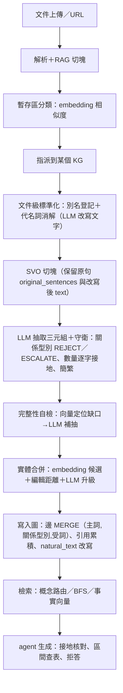

# Lumori 簡報「語意層」對照本專案流程——設計原理保證檢查 v0.2

> **日期**：2026-10-01（取代 v0.1；v0.1 把簡報當成「法規／人資領域模型」來對照，**框架有誤，已撤回**）
> **性質**：只讀檢查報告。**未改任何程式、論文、題庫；未啟動 Neo4j／Ollama；未跑任何實驗。**
> **對象**：Lumori 簡報第 1 章 `0.0.04`（05/08「從現實世界到可運作的共同語意模型」八步）為主，輔以第 4、5 章；對照**本專案整條流程（文件 → 知識圖譜 → agent）**。
> **標記**：〔事實〕附 `檔案:行號`（讀碼，未執行）；〔推論〕我的判斷；〔無資料〕未核對。
> **核對範圍**：簡報原圖已看 5 張（`0.0.04`、`0.1.04.03`、`0.1.05.04`、`0.1.05.05`、`0.1.05.06`）；其餘依各章 README（前一對話整理，與原圖一致處已核對）。

---

## 0. 結論先講

1. **這次要檢查的不是「我們有沒有法規領域模型」，而是「我們的流程，有沒有保證簡報八步背後的設計原理」**。你的做法是 **知識圖譜 ＋ agent**，不建 Canonical Model；但圖譜是 agent 依據的資料，所以**圖譜必須自己承擔那些原理的保證**。
2. 我把簡報八步翻成**八項與領域無關、可檢查的「圖譜保證」**（§3）。現況：**1 項大致成立（證據 Evidence）、5 項部分成立或偏弱（現實、事實、關係、規則、整合標準化）、2 項基本沒有（時間、權威的資料來源層面）；身份是最弱的一項**。
3. **最值得注意的三個流程性問題**（不是領域問題）：
   - **A. 事實裡混了「改寫」**：抽取前的別名登記與代名詞消解會用 LLM 改寫文字，之後事實從改寫後的文字抽出；chunk 層保留了原句，但**單筆事實沒標記「這是原文所述」還是「經改寫」**（簡報 02 Facts：避免混合推論與判斷）。
   - **B. 身份靠名稱，合併靠相似度**（簡報 03 Identity、第3章「很近≠相同」）：沒有穩定 ID、標準名會被改寫、合併無紀錄。
   - **C. 事實一抽出就算數**（簡報 MM08 接納／未決）：沒有候選／已接納狀態，`confidence` 只是無定義的整數。
4. **對 v0.1 的更正**（§5）：撤回「法源位階」「新舊法」「法規領域詞彙」這類只對勞動法成立的論述；對應的一般性問題（來源權威與版本、關係語意是否被定義）保留，但改用領域無關的說法，測試語料（勞動法）的現象只當**證據舉例**。
5. 簡報太抽象的地方，我把它翻成可檢查問題（§3「保證」欄）——**這個翻譯是我的詮釋，需要你確認**（§8）。

---

## 1. 我對簡報第 05 頁的理解

### 1.1 八步與工程產出

| 步 | 名稱 | 簡報原文重點 | 我的理解 |
| --- | --- | --- | --- |
| 01 | Reality 現實世界 | 來自業務、人員、設備、文件、系統等各種真實事件與資料來源 | 一切建模的起點是**可指認的真實來源**，不是憑空的概念 |
| 02 | Facts 事實拆解 | 將複雜情境拆解成可記錄的事實，**避免混合推論與判斷** | 事實＝「來源說了什麼」；推論與判斷要和事實分開 |
| 03 | Identity 身份定義 | 定義核心對象；確保**唯一性與一致性，避免混淆** | 「同一個」要有判準；不同的東西不可被合併 |
| 04 | Relation 關係建模 | 定義對象之間的關係與**角色**（人與雇用、產品與訂單） | 關係要有定義；角色與關係不是同一回事 |
| 05 | Time 時間與狀態 | 記錄什麼時間發生、持續多久、狀態如何變化，**保留完整歷史** | 時間是事實的一部分；歷史不能被覆寫 |
| 06 | Rule 規則與約束 | 定義業務規則、法律規範與**不可違反的約束條件** | 模型要有可檢查的約束；違反要能被偵測 |
| 07 | Authority 權威來源 | 明確資料與規則的權威來源，確保**可追溯與可治理** | 誰說了算、變更由誰核准要有紀錄 |
| 08 | Evidence 證據與驗證 | 保存來自文件、系統、事件的證據，支撐查核與可信任的決策 | 每個結論都能回查證據 |
| → | 整合與標準化 | 形成 Canonical Model | 統一定義、屬性與編碼，成為**可跨系統、可支援 AI、可追溯驗證、可持續擴展、可治理**的共同基礎 |

工程產出四項：**語意模型**（對象與關係）、**規則與約束**、**標準化字典**（統一定義、屬性與編碼）、**可驗證成果**（可測試、可追溯、可跨系統重現）。

### 1.2 簡報其他章補充的原理（與本專案流程相關者）

- **近≠相同**（第3章 05）：向量相似度只代表常一起出現，**不代表可替換**；需要本體約束當閘門。
- **意義／知識／權威是三件事**（第5章 06）：抽到≠為真≠有效力。
- **接納與未決**（MM08）：Candidate → Unresolved → Admission；允許暫時未知，**但不造成語意崩塌**。
- **機器可讀註冊表**（MM09）：詞彙與代碼要單一、可雙向精確對應。
- **狀態誠信**（第6章 02）：Status is evidence, not optimism。

### 1.3 與你做法的關係

簡報的終點是**凍結的 Canonical Model**（受治理、人決定）；你的終點是**知識圖譜 ＋ agent**。我的解讀（請確認）：**圖譜不必是 Canonical Model，但必須保證八步背後的性質**，這樣 agent 讀到的資料才能「被信任、被追溯、被治理」。簡報沒說抽取怎麼做，所以「抽取產生候選、決定另外做」是我加的詮釋。

### 1.4 使用者對八步的理解（2026-10-01，**以此為準**；第 6 步使用者不確定）

| 步 | 使用者的理解 | 與簡報原頁的對照（我的註記） |
| --- | --- | --- |
| 01 | 收集語境資料 | 一致 |
| 02 | 整理成具有清楚語意的段落內容 | 簡報重點是「拆成可記錄的事實、**避免混合推論與判斷**」；使用者的說法偏「讓文字語意清楚」。兩者在本專案的交會點＝抽取前的標準化（別名登記、代名詞消解）：它讓語意更清楚，但也是**推論進入事實**的入口，所以需要「可追溯」 |
| 03 | 整理出語境中最小的互動單位名詞們 | 簡報還要求「**唯一性與一致性、避免混淆**」（同一個名詞＝同一個東西）。使用者的說法沒強調這一點，但它是第 3 步的另一半 |
| 04 | 提供名詞間的關係意義 | 一致（簡報另加「角色」） |
| 05 | **每個關係都建立成狀態機**；狀態機有開始與結束，**不強制綁定時間**，也可由其他條件、根據監測到的狀態變化觸發；確保關係可更新（使用者 2026-10-01 澄清） | **比簡報原頁更具體、也更好**：簡報只說「記錄時間、狀態、保留歷史」。關鍵澄清：**核心是狀態機，時間只是轉換的可選依據**。我採用此說法定義 G5（見 §3） |
| 06 | 不確定 | 見下方〔第 6 步說明〕 |
| 07 | 確保圖譜**來源品質** | 簡報用詞是「權威來源」＝**哪個來源說了算**、可追溯可治理。與「來源品質」相近但不同：品質是**程度**，權威是**誰有資格當依據**。兩者都需要「來源有屬性」這個前提 |
| 08 | 確保圖譜可與來源對應、取出來源資料 | 一致（簡報另加：證據支撐查核與可信任的決策） |

**〔第 5 步澄清：狀態機，不是時間欄位〕**（使用者 2026-10-01）
- 我先前（含 §3 的初版 G5）把它理解成「每條關係帶起訖時間」——**這是錯的**。使用者的意思是：**每個關係都建立成狀態機**；狀態機自然有「開始」與「結束」，但**觸發條件不限於時間**，也可以是其他條件、或根據監測到的狀態變化。
- 這和簡報的對應關係（我的詮釋，**請確認**）：簡報八建構裡 **Event（事件）** 是「客觀發生的轉折點」（到職、離職、重新到職），**Time／Rule／Authority／Evidence** 都掛在關係上。也就是：**關係＝狀態機；事件＝讓狀態轉換的原因；證據＝事件的依據；時間只是事件可能帶的屬性之一**。這樣「Time」與「Event」「History」三個建構可以用同一個機制表達。
- 與步驟 06 的銜接：狀態機的**允許轉換、互斥狀態**正是「規則與約束」的具體內容。
- 與簡報 MM08（候選→未決→接納）的關係：〔推論，把握度中〕「候選／已接納」可能只是關係狀態機的**前段狀態**，不必另立一套機制；但這是設計選擇，待你決定。

**〔使用者補充（2026-10-01）：關係的內部屬性、節點的標準化與內建屬性〕**
- **關係**建成狀態機後，會有**內部屬性**（使用者的設計；具體有哪些屬性使用者尚未列出，我不替他定）。
- **名詞節點**以 **schema.org**（使用者原文寫 `sgimach.org`，我判斷是 schema.org 的筆誤，**請確認**）做標準化，並帶**內建屬性**。
- 〔事實，讀本專案內的 schema.org 30.0 資料 `data/schema_org_entity_types.json`〕schema.org **自己有對應「關係帶屬性」的機制**：`Role` 型別，定義為「Represents additional information about a relationship or property」，例子是某球員以「成員」角色連到球隊、且發生在某段時間；`OrganizationRole`、`EmployeeRole`（「describe employee relationships」）是其子型別。**與簡報的 Person≠Employment 例子直接對應**，也與使用者「關係帶內部屬性」的想法一致。〔推論〕但 `Role` 的內建屬性是 `startDate`／`endDate` 這類**時間**，使用者要的「**不強制綁時間、由條件或監測到的狀態變化觸發**」比它更一般，所以不能只套 `Role`，狀態機部分仍需自行定義。
- 〔事實，本專案現況〕schema.org 的**型別標準化已存在**：`resolve_entity_type()`（`services/extraction/prompt.py:72-93`）先比對核心 52 類，查不到才查 939 類擴充庫，**兩者皆無就原樣保留 LLM 輸出的字串，不驗證、不拒絕**；比對方式是字串正規化後精確比對（`prompt.py:50-56`），**沒有語意對應**（例如 LLM 輸出「公司」不會對到 Organization）。**但 schema.org 的「內建屬性」沒有使用**：該資料檔只有型別（欄位 `id`／`label`／`comment`／`subTypeOf`，共 939 筆），不含任何屬性（如 Person 的 birthDate）；實體節點觀察到的屬性只有名稱、型別、別名（`svo_service.py:737-780`，〔未窮舉〕）。
- 〔推論〕所以「節點標準化」目前只做到**型別標籤**這一半；「內建屬性」與「關係狀態機的內部屬性」兩者都是**尚未存在**的部分。〔無資料〕KG#4 中有多少實體的型別落在 schema.org 之外（保留了原始字串）——可用唯讀查詢取得，本次未查。

**〔第 6 步說明：Rule 規則與約束〕** 簡報原文：「定義業務規則、法律規範與**不可違反的約束條件**」。白話：**模型事先宣告哪些情況不可能發生，違反就要被偵測**。它不是「從文件抽出規則句」，而是圖譜自己的**完整性規則**。在你的步驟 5 之後，最自然的內容是：

1. **狀態機規則**：結束時間不得早於開始時間；某些關係同一時間只能有一個有效狀態（例如同一人同時只能有一個主要任職）；允許哪些狀態轉換。
2. **關係端點規則**：某種關係的兩端必須是相容的型別（例如「雇用」連的應是人與組織，不是人與日期）。
3. **資料完整性規則**：每條事實必須有來源；每個實體至少被某處提及；每個實體有穩定識別。
4. 簡報舉的「法律規範」只是**一種**可以被模型持有的規則內容，不是第 6 步的定義；你的圖譜要不要承載「文件裡的規則句」，是另一個問題。

我的判斷（把握度中高）：**第 6 步對你的圖譜＝「把第 3、4、5 步的承諾寫成可檢查的規則」**——沒有它，前面五步只是約定，沒人能發現被違反。這也是我建議先做「不變量清單＋唯讀檢查」的原因。

**與使用者理解對照的本專案新發現（〔事實〕，讀碼）**：簡報原頁的例子（某人 2019–2022 任職、2025 重新入職＝**兩段**關係）在本專案**無法表示**——邊的鍵是（主詞,關係型別,受詞）（`services/svo_service.py:1222`），同一組只會合併成**一條**邊並累積引用，**沒有關係實例、沒有狀態、沒有轉換**，「結束後又重新開始」會被併成同一條。這正好對應使用者步驟 5「每個關係都是狀態機」的缺口——缺的不只是時間欄位，而是**整個狀態機**（見〔第 5 步澄清〕）。

---

## 2. 本專案的實際流程（依既有程式與報告歸納）

〔事實〕對應程式：標準化 `services/svo_preprocessing_service.py:198-231`；SVO 切塊 `services/svo_chunking.py:37-52`（`SVOChunk.text`、`original_sentences`）；抽取 `services/extraction/`；合併 `services/svo_service.py:695-780`；寫圖 `:1218-1268`。

---

## 3. 八步 → 圖譜保證 → 本專案現況

燈號：🟢 大致成立／🟡 部分成立或偏弱／🔴 基本沒有。**「保證」欄是我把簡報原則翻成領域無關、可檢查的性質。**

| 步 | 圖譜應保證（可檢查） | 本專案現況（〔事實〕） | 燈號 |
| --- | --- | --- | --- |
| **01 Reality** | G1：每個事實、實體都能回溯到**可指認的來源**及其位置；來源的**版本**可辨識 | 事實帶 `source_doc_id`、`source`、`source_svo_chunk_index/file`、`source_sentence_start/end`（`models/knowledge_graph.py:202-222`）；實體經 `(Chunk)-[:HAS_ENTITY {surface_form}]` 連回來源（`svo_service.py:711-716`）。**來源版本識別偏弱**：`content_hash` 只在法規文件模型 `LawDocumentCreate`（`models/law_document.py`）；一般文件的 `DocumentRecord` 無內容雜湊欄位（`models/knowledge_graph.py:106-142`；全專案 `services／repositories／routers／models` 內 `content_hash` 只出現在 `law_document_repo.py` 與 `law_document.py`）。**來源範圍限文字文件**（簡報的設備、系統、事件來源本專案不處理——屬範圍而非缺陷） | 🟡 |
| **02 Facts** | G2：每筆事實是「來源所述」的記錄；**推論或改寫可被辨識**，不混進事實 | 三元組＝事實拆解（核心設計）；抽取前的別名登記、代名詞消解以 LLM 改寫文字（`svo_preprocessing_service.py:203-220`），**事實由改寫後的 `text` 抽出**；chunk 層保留 `original_sentences`（`svo_chunking.py:43`），但**單筆事實／引用沒有「經改寫」旗標**（`_new_citation` 欄位清單 `svo_service.py:843-860` 即全部）；`natural_text`（LLM 改寫句）與原三元組**同層存放**於邊上（`:1248-1268`）；有守衛：數量片語須逐字出現於來源（報告20）。曾發生空賓語三元組被 LLM 補出幻覺（報告24） | 🟡 |
| **03 Identity** | G3：實體有**穩定 ID**；合併有明確準則、**可追溯、可回復**；不相容者不合併 | 唯一鍵 `(kg_id, name)`（`svo_service.py:173-174`）；標準名會被頻率提升**改寫**（`SET e.name = $final_name`，`:776`）；合併靠 embedding cosine／編輯距離＋LLM 升級（`core/constants.py` `ENTITY_DEDUP_*`）；候選限同型別（部分閘門，`_fetch_entity_candidates`）；別名存 `e.aliases`；〔無資料〕合併／拆分事件紀錄與「取消合併」操作未見（未窮舉）。實際發生過的混淆：實體過度合併調查（記憶）、「每一型式 vs 每增加一種型式」0.727、「中央主管機關」在不同次抽取被判成不同型別（`svo_service.py:412-416`） | 🔴 |
| **04 Relation** | G4：關係型別**有定義**；無法歸類者**標示為未決**，不悄悄落入通用關係；**角色**與關係分開 | 35 類關係**每類有定義說明**（`core/constants.py` `SVO_REL_TYPE_DESCRIPTIONS`）；詞彙權威已宣告（ConceptNet／schema.org，`constants.py:304-305`）；不在詞彙內者 REJECT 退回 `RELATED_TO` 並保留原 verb（`services/extraction/extract.py:58-61`）；有每 KG 擴充機制 `cfg.domain.rel_type_extensions`（`services/extraction/prompt.py:96-108`）與 EXPAND 候選→核准治理（`models/knowledge_graph.py:243-260`）。**但**兜底的 `RELATED_TO` 與「真的只是一般關聯」**無法區分**；測試 KG 上占 89.1%（報告187，**僅此 KG**）；**無角色概念**（關係是邊，無關係載體） | 🟡 |
| **05 Time** | G5（採使用者理解）：**每個關係是一個狀態機**；「開始／結束」由**狀態轉換**定義，不強制綁定時間，可由事件、條件或監測到的狀態變化觸發；更新＝轉換狀態，**不覆寫**，歷史＝轉換序列。〔我的建議，使用者未說〕另可記錄「何時得知」作為證據元資料，但它不是語意必要條件 | 事實／邊**沒有任何時間欄位**；邊上 `verb`、`natural_text` 每次新引用都被最新值覆蓋（`svo_service.py:1250-1254` 註解明寫「不是累積歷史」）；引用無抽取時間；文件層時間僅法規文件有 `effective_date`／`update_date`（`models/law_document.py:27-28`），且 64 份中僅 15 份有值（`scripts/analysis/source_ambiguity_audit.py:1584`），只附在回答上，未見用於篩選 | 🔴 |
| **06 Rule** | G6：宣告的**完整性規則可機器檢查**（狀態機規則、關係端點型別相容、每事實有來源等），違反可被偵測；**使用者對此步不確定，見 §1.4 說明** | 圖層級約束只有一條：實體 `(kg_id,name)` 唯一（`svo_service.py:173`）；其餘是**抽取期守衛**（數量接地、型別 REJECT）而非圖上不變量；無「每個 Fact 必有來源」「每個 Entity 必有提及」等的檢查腳本；〔推論〕抽取期守衛通過與否未持久化，事後無法稽核 | 🟡 |
| **07 Authority** | G7：資料來源有**屬性**（來源品質／權威程度，採使用者「來源品質」理解並含簡報「誰說了算」）；多來源衝突有政策；詞彙／標準變更**有人核准** | **詞彙層成立**：權威來源已宣告，新關係型別須人工核准（`ExpandProposalResolveRequest.decision: approved/rejected`，`models/knowledge_graph.py:259-260`）。**資料來源層沒有**：邊的鍵是（主詞,關係型別,受詞）（`svo_service.py:1222`），**不同來源、甚至互相矛盾的主張會合併成同一條邊**，只累積引用；沒有來源權威／優先序屬性；`LawDocument.record_type` 只被寫入、未見使用（`repositories/law_document_repo.py:33,44,106`） | 🟡（詞彙）／🔴（資料來源） |
| **08 Evidence** | G8：答案可附證據、證據可回查原文；證據自身帶**產生者與時間** | 指標完整（見 01）；agent 回答附法規層級中繼資料（`routers/agent.py:377`、`services/context/telemetry.py:18-19,124`），並有接地核對與拒答。**缺**：引用沒有抽取器／模型／提示詞版本與時間（`_new_citation` 即全部欄位）；`confidence` 是整數且取引用中最大值（`svo_service.py:1240`）、**未定義語意**，不是不確定性度量 | 🟢（指標）／🟡（產生者與時間） |
| **→ 整合與標準化** | G9：詞彙、代碼有**單一、版本化**的權威來源；**節點型別以 schema.org 標準化並帶內建屬性、關係狀態機帶內部屬性**（使用者設計） | 詞彙分散三處：程式常數（`SVO_REL_TYPES`）、每 KG 擴充（`rel_type_extensions`）、EXPAND 的 SQLite 表（`task_queue.db`）；實體型別對 schema.org 只是常數字典；無版本、無一致性檢查；〔補〕schema.org 型別標準化已存在（核心 52＋擴充 939，查無對應則保留原字串、不驗證），**內建屬性與關係內部屬性尚未存在**（見 §1.4 使用者補充）。 | 🟡 |

---

## 4. 跨步驟的流程原則

### 4.1 「近≠相同」：哪裡用相似度做了「相等」判斷

〔事實〕本專案用向量相似度的地方，分兩類——

| 用途 | 性質 | 位置 | 有閘門嗎？ |
| --- | --- | --- | --- |
| 檢索（找候選、找事實） | 正當：只是找近的 | `vector_search_facts`、概念路由 | 不需要「相等」判斷 |
| **實體合併** | **等價判定** | `ENTITY_DEDUP_COSINE_THRESHOLD`、`ENTITY_DEDUP_EDIT_RATIO_THRESHOLD`、`ENTITY_DEDUP_ESCALATE_LOW_THRESHOLD`（`core/constants.py`） | 部分：限同型別、灰色帶交 LLM；**無「指涉範圍」或型別相容之外的約束** |
| **關係型別歸類** | 等價判定 | `COMPARE_COSINE_THRESHOLD`、REJECT／ESCALATE（`extract.py`） | 部分：不在詞彙就退兜底；兜底不可區分 |
| 文件分類 | 歸屬判定 | `CLASSIFY_*` | 部分：低信心標記 |

〔推論〕「等價判定」是流程中最需要本體約束閘門的地方；現有閘門有，但偏統計性、且**判定結果不留紀錄**。

### 4.2 「推論不混入事實」：改寫鏈

〔事實〕改寫發生在三處：別名登記（文字層）、代名詞消解（文字層）、`natural_text`（事實層）。chunk 層保留原句（好），但事實層沒有標記。〔推論〕這對檢索與生成影響不大，但**對「保證事實＝來源所述」不成立**，是簡報 02 的核心要求。

### 4.3 agent 端（你的做法：KG ＋ agent）

〔事實〕agent 端對應簡報「Evidence≠Truth」做得不錯：接地核對、區間查表拒答、附來源中繼資料。〔推論〕缺的是**把圖譜的屬性傳給 agent**：答案不會告訴使用者「這條事實的來源是否互相衝突」「這個事實何時被抽出、是否經改寫」，因為圖譜根本沒存這些。**agent 端的好守衛無法彌補資料層沒有的資訊。**

---

## 5. 對 v0.1 的更正

| v0.1 說法 | 問題 | v0.2 處理 |
| --- | --- | --- |
| 「領域詞彙與法規不符；台灣勞動法領域包是空的」列為落差①最大 | 把測試語料的特性當成簡報原理；簡報的語意層與領域無關 | **降級**：改成 G4「關係型別有定義、無法歸類須標示未決」；89.1% 僅作此 KG 的證據舉例；並承認本專案採 generic-first 設計（通用詞彙＋每 KG 擴充）是有意的 |
| 「權威＝法源位階、新舊法」 | 法規特有 | **改寫**為 G7「資料來源有權威屬性、衝突有政策」；法規例子只當舉例 |
| 「時間：新舊法並存無法過濾」 | 法規特有的症狀 | **改寫**為 G5「事實無時間、歷史被覆寫」，與領域無關 |
| 「對照 12 個領域模型、法規 Rule」 | 簡報的 Rule 是**模型的約束**，不是抽取出來的法規條文 | **改寫** G6 為「圖上的不變量可檢查」 |
| 漏掉 02 Facts | 沒檢查「推論混入事實」 | **新增**§3-02、§4.2 |

保留且仍成立：身份靠可變名稱、事實一抽出就算數（接納／未決）、詞彙分散、引用缺產生者與時間。

---

## 6. 本專案做得好、簡報會肯定的地方

- 句子層級來源追溯、引用累積、chunk 同時保留原句與改寫句。
- 詞彙層治理：EXPAND 候選→LLM 判斷→人工核准；權威來源宣告。
- 抽取期守衛（數量逐字接地、簡繁）、生成端接地核對與拒答、拒答金絲雀。
- 凍結 42 題基準、評分器盲點紀錄、「誠實侷限」註記文化（對應「Status is evidence」）。
- 實體候選限同型別、灰色帶交 LLM（部分閘門）。

---

## 7. 若要處理，我的建議（**僅建議；需你決定；不排程**）

**先把八項「保證」寫成可機器檢查的不變量，再看哪項真的被違反**，因為：
- 這正是簡報「保證」的落實（MM11／MM12 的精神），也是 06 Rule 的具體化；
- 純唯讀（查 Neo4j 與檔案），不動資料、不改程式；
- 結果能把本報告的〔推論〕變成〔事實〕，並決定後續優先序（例如穩定 ID、事實層時間、改寫旗標哪個先做）。

可檢查的例子（領域無關）：G1 每個 Fact 有 `source_*` 欄位；G1 每個 Entity 至少一條 `HAS_ENTITY`；G3 同名但不同型別的實體數量；G3 `aliases` 非空且 `name` 不在 aliases 中的實體數；G4 `RELATED_TO` 占比與其 verb 分布；G5 具時間欄位的 Fact 比例（預期 0）；G7 同一（主詞,受詞）在不同 `rel_type` 下並存的情況與同一邊有多個互異 `verb` 的比例；G8 引用含抽取時間的比例（預期 0）。

其後才是結構性改動（穩定 ID、事實層記錄時間與狀態、改寫旗標、來源權威屬性），每項都是 production 改動，需另行評估。

---

## 8. 需要你確認的問題

1. （使用者已於 §1.4 說明八步理解；§1.3 的解讀仍待確認）「圖譜不必是 Canonical Model，但必須保證八步背後的性質」。
   - 新問題：§1.4〔第 6 步說明〕與〔第 5 步澄清〕的詮釋是否符合你的想法？特別是「事件觸發狀態轉換、時間只是屬性」。
   - 設計題（不急）：關係狀態機要用**一套通用狀態**（例如候選／有效／結束／爭議），還是**每種關係型別各自定義**？
   - 確認：`sgimach.org` ＝ schema.org？「內建屬性」是指 schema.org 為各型別定義的屬性（如 Person 的 birthDate），還是你自己挑選的一小組？關係的「內部屬性」你心中有清單嗎（例如目前狀態、進入條件、觸發事件、來源、起訖）？
2. §3 的 G1–G9 是否符合你對「保證」的期待？有沒有你認為簡報**不要求**的、或我漏掉的？
3. 是否同意先做 §7 的「不變量清單＋唯讀檢查」？
4. 是否要我把剩下的簡報原圖逐張看完（目前原圖看了 5 張）？

## 9. 限制

- 讀碼為主、未執行；KG#4 的實際分布除報告187／190 已有者外〔無資料〕。
- 合併／拆分紀錄、`confidence` 的產生方式〔無資料〕。
- 燈號是我的判斷，不是量測；「保證」欄是我的詮釋。
