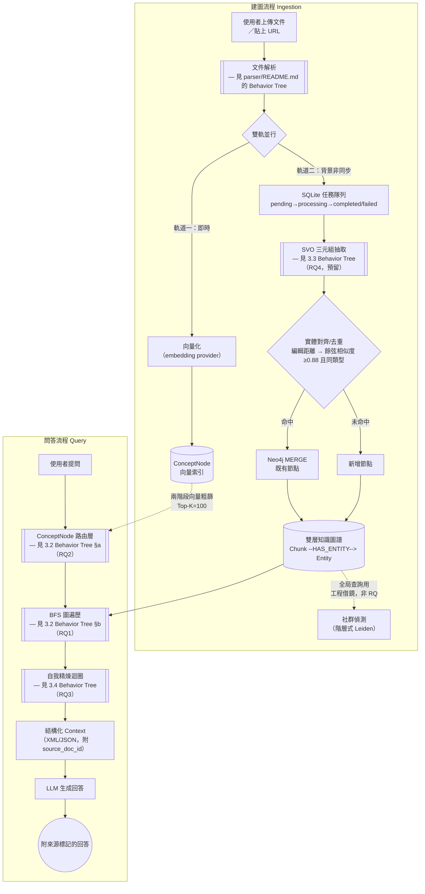
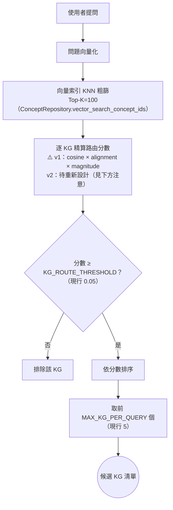
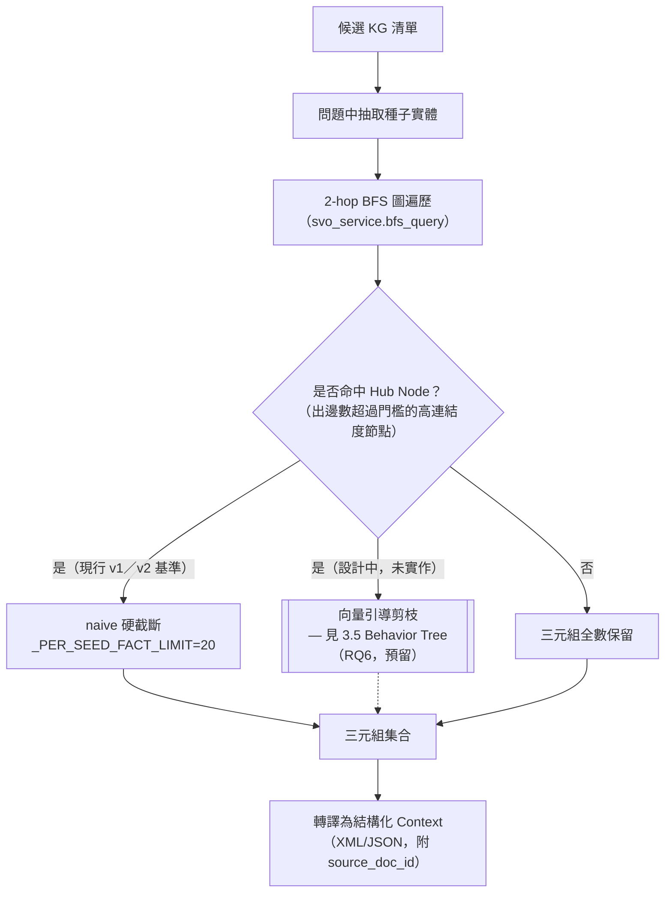
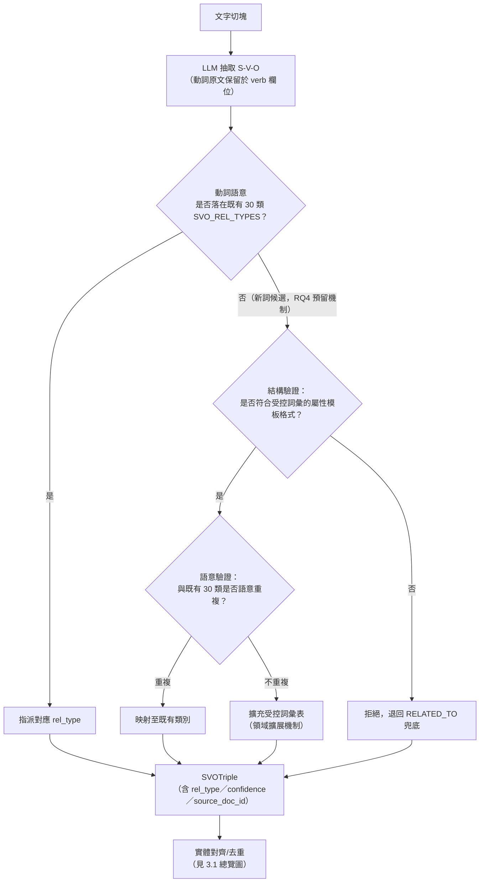
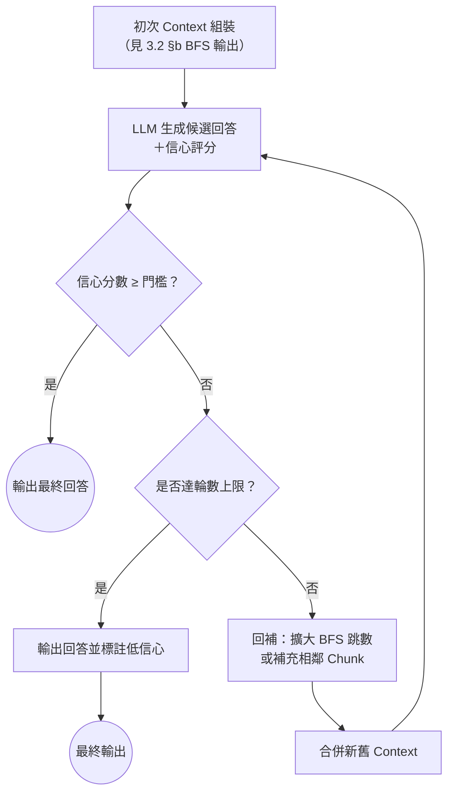
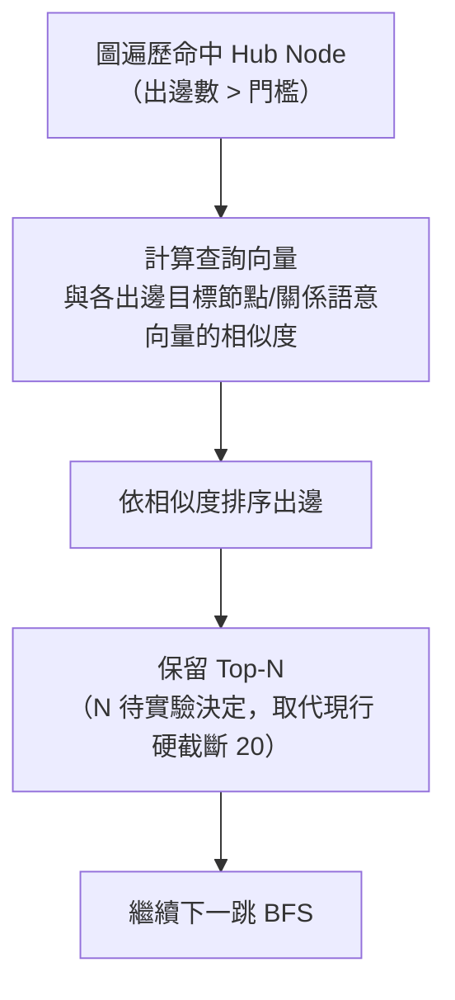

# 第三章：系統設計與方法論

> 狀態：🟡 草稿（2026-07-16 首次填實）。內容主體整合自 v1 `docs/報告/01_專案總覽_是什麼為什麼怎麼做.md` 第三章「怎麼做」、`docs/ARCHITECTURE.md` 決策紀錄、`core/constants.py` 現行參數，並依 1.5 節待辦完成 RQ 編號校正（見下方各節標題）。**RQ 編號現行狀態**：3.2 對應 RQ1（KG-BFS vs. 純向量 RAG 的優勢邊界）與 RQ2（輕量路由層效能取捨）；3.3 對應 RQ4（預留）；3.4 對應 RQ3；3.5 對應 RQ6（預留）——與 1.5 節指出的舊版四 RQ 編號已核對一致，不需再變更。
>
> **架構圖表繪製慣例**：本章沿用 `parser/README.md` 已驗證過的「Behavior Tree」分層繪圖法——先給一張**系統總覽**流程圖，圖中凡標示 `[[ ]]` 雙框的節點代表「此處有更細的子流程圖，見指定小節」，各小節再各自展開一張聚焦於該元件的細部圖。這樣讀者可以先掌握全局，再依需要下鑽到任一元件的決策細節，不必一次消化過於龐大的單張圖。

## 3.1 系統總覽

本系統的處理流程分兩條主線：**建圖流程（Ingestion）**將使用者提供的原始文件轉譯為結構化知識圖譜；**問答流程（Query）**則在既有圖譜上進行路由、遍歷、精煉，最終生成附來源標記的回答。兩條主線共用同一個 Neo4j 雙層知識圖譜作為交會點。

> **注意**：`[[ 雙框 ]]` 節點是本章分層繪圖的核心慣例，代表「此節點內部另有一張聚焦圖，見對應小節」——與 `parser/README.md` 圖文管線 BT 的 `IMG[[ ]]` 用法完全一致，確保全文件的圖表語彙一致，讀者不需要重新學習一套新符號。
>
> 建圖與問答兩條主線並非彼此獨立的兩個系統，而是共用同一個 Neo4j 雙層圖：建圖流程持續把新文件寫入 `KG`，問答流程隨時讀取當前狀態的 `KG` 做路由與遍歷——這也是 3.5 節「向量引導圖剪枝」與時序管理等未來工作（見 `docs/ARCHITECTURE.md`）需要面對「讀寫並行一致性」的原因，本論文將此列為方法論限制（見 3.6）。
>
> 社群偵測（`COMM`）與全局查詢（Global Search）是 `docs/報告/03_核心架構藍圖.md` 痛點 2/13 指出的**工程借鏡型**改善，業界已有 RAGFlow、Microsoft GraphRAG 官方實作可直接參考（見第二章 2.1.2），本論文不將其列為研究問題，故圖中以虛線標示、不展開細部 Behavior Tree。

## 3.2 雙層檢索架構（對應 RQ1／RQ2）

本論文將問答時的檢索拆成兩層：**路由層（ConceptNode）**負責在多個獨立知識圖譜之間決定「該去哪個圖找答案」；**知識層（BFS 圖遍歷）**負責在選定的圖譜內做多跳推理。這個分層設計本身**是本論文自行提出的架構**，並非採用文獻中的標準演算法（誠實聲明，呼應 v1 報告五.2）——第二章 2.1.2 已指出 Edge et al.（2024）GraphRAG 的設計預設是單一大圖，較少討論多圖並存時的路由問題，這正是 RQ2 要驗證的缺口；而路由層之上、選定圖譜之後的圖遍歷本身是否比純向量 RAG 更具優勢，則是 RQ1 要驗證的問題。兩者合起來才是完整的「雙層檢索」設計動機。

### §a：ConceptNode 路由層 Behavior Tree（RQ2）

> **注意**：`SCORE` 節點的「cosine × alignment × magnitude」加權公式是 v1 的既有設計（`concept_engine.py` docstring 標註「TODO(v2 架構重整)：待重新設計後遷移」），本論文暫不假設此公式在 v2 會原樣保留——RQ2 的實驗設計需要明確區分「路由層這個兩層架構本身是否成立」與「這個特定加權公式是否為最優解」兩件事，避免把工程實作細節誤植為研究貢獻。`KG_ROUTE_THRESHOLD`、`MAX_KG_PER_QUERY`、`CONCEPT_COARSE_TOP_K` 三個門檻值目前定義在 `core/constants.py`，第五章消融實驗需要對這些門檻做敏感度分析。

### §b：BFS 圖遍歷 Behavior Tree（RQ1）

> **注意**：`PRUNE` 節點以虛線連回 `TRIPLES`，代表這是**尚未實作、屬 RQ6（預留）的設計提案**，現行系統（v1 與 v2 stub）在遇到 Hub Node 時一律走 `CUT` 這條 naive 硬截斷路徑（`_PER_SEED_FACT_LIMIT=20`）。RQ1 的實驗設計（KG-BFS vs. 純向量 RAG）以現行的 `CUT` 路徑為基準線即可，不需要等 RQ6 完成；但若 RQ6 最終納入正式貢獻，RQ1 的基準線需要重新跑一次以排除剪枝策略改變帶來的干擾。

## 3.3 受控語意關係抽取（對應 RQ4，預留）

本節設計的核心問題：SVO 抽取時，動詞是要開放抽取（任意動詞字串皆可成為關係，如 Angeli et al. 2015 Stanford OpenIE 的做法），還是收斂到一組**受控語意關係詞彙**？本論文選擇後者——`core/constants.py` 目前定義 30 種語意關係類別（`SVO_REL_TYPES`），涵蓋分類關係（`IS_A`/`PART_OF`/`INSTANCE_OF`）、因果關係（`CAUSES`/`PREVENTS`/`ENABLES`）、功能關係（`USES`/`REQUIRES`/`IMPLEMENTS`）、比較關係（`CONTRASTS`/`SIMILAR_TO`/`OUTPERFORMS`）等九組，並以 `RELATED_TO` 作為無法歸類時的兜底類別。

選擇受控集合而非開放抽取的理由，直接回應第二章 2.1.3 討論的語意一致性缺口：Vashishth et al.（2018）CESI 指出開放式抽取會讓語意相同的關係以不同字串存入知識庫（「創立」「成立」「建立」被記為三個不同謂語），造成多跳推理時的語意漂移。但受控集合並非沒有代價——固定 30 類詞彙必然犧牲一部分細緻語意的召回率，這正是 RQ4 要實證回答的 trade-off：語意一致性與可追溯性（AIS）的提升，是否能補償召回率的損失？

> **注意**：「結構驗證→語意驗證」兩步機制與 Schema.org（Guha et al., 2016）的受控詞彙擴展精神一致——新詞彙要進入系統，先檢查格式是否符合既有屬性模板（結構驗證），再檢查是否與既有類別語意重複（語意驗證），避免詞彙表無限膨脹又退化為開放式抽取。**這是本論文的設計提案，目前尚未實作**（`svo_service.py` 現況為 stub），且 Guha et al.（2016）原文為 ACM 付費資源、僅記書目資訊（見第二章 2.2 與 `docs/參考文獻/README.md`），寫作定稿前需透過學校圖書館取得全文核實此處的類比是否恰當。
>
> 本節與 `docs/報告/03_核心架構藍圖.md` 痛點 12（實體/關係摘要整併，Element Summarization）為**不同但相關**的問題：本節解決的是「同一描述該歸到哪個受控類別」，痛點 12 解決的是「同一節點的多筆描述如何整併成單一摘要」——兩者皆發生在 `DEDUP2` 之後，但摘要整併目前尚未排入本論文的正式 RQ（見第七章未來工作）。

## 3.4 自我精煉檢索迴圈（對應 RQ3）

單輪 BFS 檢索的問題：若種子實體提取不完整或問題本身需要跨圖多跳才能回答，第一輪檢索到的 Context 可能不足以支撐正確回答，此時直接生成容易產生幻覺。本論文設計信心門檻觸發的自我精煉迴圈，在生成後評估回答信心，信心不足時回補檢索範圍、再次生成，直到信心達標或達輪數上限。

> **注意**：本設計延伸 Self-RAG（Asai et al., 2023）、FLARE（Jiang et al., 2023）、IRCoT（Trivedi et al., 2022）等主動式/反思式檢索文獻的評估範疇（見第二章 2.1.1），但機制上有明確差異——這三篇文獻皆作用在**自由文字段落**的檢索與生成上；本論文的自我精煉迴圈作用在**結構化三元組 Context**上，回補動作是「擴大 BFS 跳數」而非「重新檢索段落」，且信心評分與圖遍歷的信心（如命中種子實體數、路徑長度）綁定，而非純粹依賴生成模型自身的 token 機率。此差異需要在第二章 2.3 比較表與正文中明確寫出，不能只是條列式帶過。
>
> 「信心門檻」與「輪數上限」的具體數值屬於工程參數，需要在第五章消融實驗中做敏感度分析，本節僅描述機制設計，不預設最終參數值。

## 3.5 向量引導圖剪枝（對應 RQ6，預留）

**本節內容目前不存在對應實作**，是四項待驗證研究問題中風險最高的一項（去留已於第一章 1.2 節聲明「暫緩，待 RQ1-3 進度明朗後再評估」）。現行系統在 BFS 遍歷命中高連結度節點（Hub Node）時，一律採 naive 硬截斷（`_PER_SEED_FACT_LIMIT=20`），不區分被截斷的三元組與查詢問題的相關性——這正是第二章 2.1.4 討論的「Static Graph Fallacy」（Lau et al., 2026）：索引時固定的圖結構忽略了查詢依賴的邊相關性，導致遍歷被引導至高連結度但與當前問題無關的節點。

> **注意**：此圖為**設計提案**，非現行系統行為（現行行為見 3.2 §b 的 `CUT` 節點）。PathRAG（Chen et al., 2025）的流量式剪枝（flow-based pruning）與 CatRAG（Lau et al., 2026）的查詢自適應遍歷是本設計最直接的文獻對照對象（見第二章 2.1.4），但兩者皆非本論文的技術棧（Neo4j + Cypher BFS）下的現成實作，若 RQ6 最終納入正式貢獻，需要自行實作並與 naive 硬截斷做消融比較，而非直接沿用兩篇文獻的程式碼。若 RQ1-3 進度不允許納入 RQ6，本節將改寫為「未來工作」並移至第七章（見第一章 1.4.2）。

## 3.6 研究方法論說明

依 v1 報告五.1/五.2 已建立的誠實框架，本論文的技術決策分兩類，需在正文中明確標示，不可混為一談：

- **借用既有理論**：路由層之外的圖遍歷正確性（Cypher BFS 語意）、受控詞彙的結構/語意驗證兩步機制之理論類比對象（Schema.org）、自我精煉迴圈的信心觸發機制脈絡（Self-RAG/FLARE/IRCoT），皆有明確文獻可引用佐證設計動機，但**具體實作皆為本論文自行設計**，並非直接套用文獻中的演算法或程式碼。
- **本論文自行設計的工程決策**：雙層路由架構（RQ1/RQ2）、向量引導剪枝的相似度計算方式（RQ6，預留）等，目前業界與學界皆無現成解法可直接採用（見第二章文獻定位分析與 `docs/報告/03_核心架構藍圖.md` 痛點分類），這正是本論文宣稱研究貢獻之處。

**實驗可追溯性承諾**：依 `docs/ARCHITECTURE.md`「實驗可追溯性規範」（2026-07-13 決策），第五章的每次實驗執行皆須記錄 git commit hash／分支、完整參數快照、測試案例集版本、原始輸出路徑四項資訊，以 JSON/YAML manifest 形式與實驗結果一併保存，不引入 MLflow 等重量級 MLOps 平台。此規範同時支撐 RQ2／RQ3 的可追溯性次要指標評估。

**消融實驗設計原則**：RQ1-RQ3（確定）與 RQ4/RQ6（預留）的實驗設計皆遵循「單一變因控制」原則——例如 RQ2 驗證路由層時，知識層（BFS）與生成模型應保持固定，只切換「有無路由層」或路由層的門檻參數；RQ6（若納入）驗證剪枝策略時，路由層與受控詞彙集應保持固定，只切換「naive 硬截斷 vs. 向量引導剪枝」。完整的組別設計、baseline 與資料集留待第五章展開，本章僅聲明此為貫穿全部消融實驗的共同原則。
