# 第三章：系統設計與方法論

> 狀態：🟡 草稿。**章節分工原則**：3.1（含 3.1.1-3.1.4）純粹描述建圖流程本身的機制與運作，不深入個別研究問題的設計原理與文獻佐證；3.2 之後每節對應一個 RQ，說明該 RQ 的作法、原理與參考文獻，並依 RQ 對應回第二章文獻探討。**RQ 對應**：3.2 對應 RQ1／RQ2；3.3 對應 RQ4a（受控語意關係詞彙標準化，其機制流程見 3.1.3）；3.4 對應 RQ4b（實體指代與別名消解，其機制流程分見 3.1.2／3.1.4 的指標節點）；3.5 對應 RQ3；3.6 對應 RQ6；3.7 為研究方法論說明。3.1.1 已完成實作與測試，3.1.2-3.1.4／3.3／3.4／3.6 仍為設計中。完整逐日變更歷程、已評估但未採用的設計方案，見 [`03_變更紀錄.md`](03_變更紀錄.md)。
>
> **架構圖表繪製慣例**：本章沿用 `parser/README.md` 已驗證過的「Behavior Tree」分層繪圖法——先給一張**系統總覽**流程圖，圖中凡標示 `[[ ]]` 雙框的節點代表「此處有更細的子流程圖，見指定小節」，各小節再各自展開一張聚焦於該元件的細部圖。這樣讀者可以先掌握全局，再依需要下鑽到任一元件的決策細節，不必一次消化過於龐大的單張圖。

## 3.1 系統總覽

本系統的處理流程分兩條主線：**建圖流程（Ingestion）**將使用者提供的原始文件轉譯為結構化知識圖譜；**問答流程（Query）**則在既有圖譜上進行路由、遍歷、精煉，最終生成附來源標記的回答。兩條主線共用同一個 Neo4j 雙層知識圖譜作為交會點。

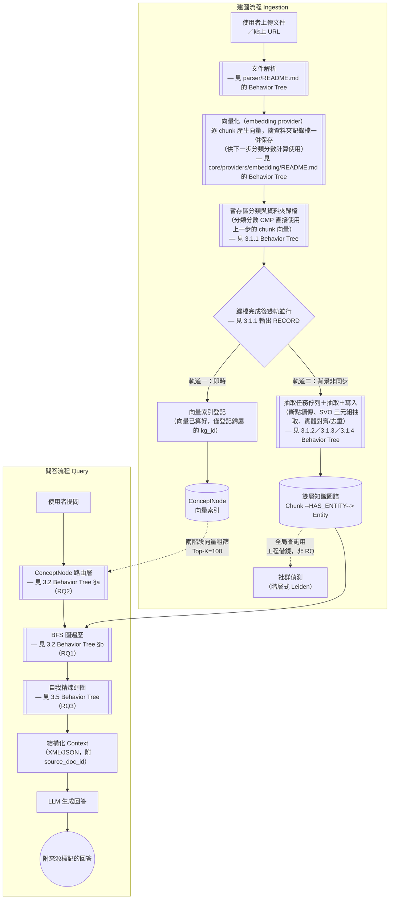

> **注意**：`[[ 雙框 ]]` 節點是本章分層繪圖的核心慣例，代表「此節點內部另有一張聚焦圖，見對應小節」——與 `parser/README.md` 圖文管線 BT 的 `IMG[[ ]]` 用法完全一致，確保全文件的圖表語彙一致，讀者不需要重新學習一套新符號。
>
> **向量化的時序（2026-07-17 校正）**：向量化（`VEC`）緊接在文件解析之後、暫存區分類之前，而非分類完成後才進行——原因是 3.1.1 節分類分數計算（`CMP` 節點）需要「該文件所有 chunk 向量的平均」才能與各 KG 的 prototype 向量算 cosine 相似度，向量必須先存在，分類判斷才有東西可算，兩者不能反過來。因此解析完成的文字並非直接進入雙軌處理，而是先向量化，再經過**暫存區分類與資料夾歸檔**（3.1.1，內部直接使用已算好的 chunk 向量）決定歸屬哪個知識圖譜，歸檔後才分岔為雙軌：**軌道一（即時）**是把已算好的向量登記進該 KG 的 ConceptNode 索引（只是登記歸屬的 `kg_id`，不重新計算向量，不需要排隊等候）；**軌道二（背景非同步）**才是具斷點續傳能力的建圖管線後半段，依序涵蓋**佇列與斷點續傳**（3.1.2）、**抽取過程**（3.1.3）、**抽取後續**（3.1.4）三個步驟。`QUEUE` 雙框節點因此同時指向這三節——三者是同一條背景管線依序執行的步驟，皆為 3.1 底下純粹描述機制的小節，此處總覽圖用一個節點收攏，避免在快速瀏覽的總覽圖上重複展開細節；個別研究問題（RQ4a 受控詞彙設計原理與文獻見 3.3、RQ4b 別名消解原理與文獻見 3.4）則留給對應的 RQ 小節深入討論。這三個新增/調整的節點是本論文對 v1 既有設計（`docs/ARCHITECTURE.md`「執行環境架構」「建圖流程：雙軌非同步」決策）的具體化與圖示化，非重新設計；「向量索引登記」與「SVO 抽取佇列」這兩條軌道的分岔時機，則是本次為修正向量化時序而調整的部分。
>
> 這個時序調整也與 3.1.2 節「重新歸屬邊界案例」的既有設計一致——該節已聲明「向量化結果（ConceptNode 向量索引項）直接遷移至新 KG，不需重新向量化」，隱含向量本身是獨立於 `kg_id` 之外、先算好才被登記歸屬的物件；本次總覽圖的修正只是把這個既有隱含假設明確畫出來，並非新增設計決策。`VEC` 節點升級為 `[[ ]]` 雙框節點，其內部細節（provider 選型、正規化、文獻依據）**不放在本章正文**，而是另立 [`core/providers/embedding/README.md`](../../core/providers/embedding/README.md) 說明——向量化本身不是本論文的研究問題（🔧 通用基礎設施，直接沿用 v1），這個引用方式與 `PARSE` 節點指向 `parser/README.md` 的做法完全一致：非核心研究貢獻的工程模組，其文獻佐證與 Behavior Tree 收斂在程式碼旁的 README，論文正文只保留一個雙框引用節點，不重複展開內容。
>
> 建圖與問答兩條主線並非彼此獨立的兩個系統，而是共用同一個 Neo4j 雙層圖：建圖流程持續把新文件寫入 `KG`，問答流程隨時讀取當前狀態的 `KG` 做路由與遍歷——這也是 3.6 節「向量引導圖剪枝」與時序管理等未來工作（見 `docs/ARCHITECTURE.md`）需要面對「讀寫並行一致性」的原因，本論文將此列為方法論限制（見 3.7）。
>
> 社群偵測（`COMM`）與全局查詢（Global Search）是 `docs/報告/03_核心架構藍圖.md` 痛點 2/13 指出的**工程借鏡型**改善，業界已有 RAGFlow、Microsoft GraphRAG 官方實作可直接參考（見第二章 2.1.2），本論文不將其列為研究問題，故圖中以虛線標示、不展開細部 Behavior Tree。

### 3.1.1 暫存區分類與資料夾歸檔

每個知識圖譜（`KnowledgeGraph`）對應磁碟上一個以其名稱命名的獨立資料夾（`folder_path`）。**每份文件解析完成後，本身也是一個獨立資料夾**——內含該文件切塊後的內容，以及一份隨資料夾移動的「記錄檔」（狀態機，詳見 3.1.2）。「歸檔」在本設計裡不是抽象的資料庫關聯，而是**把這份文件的整個資料夾，實際搬移到目標 KG 的資料夾底下**（同一磁碟分割內的搬移屬原子操作，不是複製再刪除，不會有「搬到一半」的中間態）——資料本身跟著搬，離開暫存區，使用者用檔案總管打開任一 KG 資料夾，看到的就是它實際擁有的全部原始來源。

> ✅ **實作現況（2026-07-20 校正，取代先前已過時的落差說明）**：`parser/chunk_writer.py::write_chunks_as_markdown()` 已改為每份文件各自一個獨立子資料夾（`chunk-NNN-of-MMM.md`，見 § 3.1.1 開頭段落），先前草稿描述的「攤平寫入同一 `output_dir`」是 2026-07-16 實作前的舊敘述，未同步更新，已於本次校正移除。**同日再補上一個更上游的缺口**：切塊本身雖已就緒，但從「使用者上傳文件」到「切好塊、寫進暫存區、記錄檔初始化」這一段，先前完全沒有真正的端點串起來——`routers/documents.py` 原本只有 `debug-parse`／`debug-parse-url`（明確標註不寫入暫存區，僅供除錯），`classify_service`／`cluster_service` 的既有測試都是直接手動偽造好切塊資料夾繞過這一段。已新增 `services/ingestion_service.py::chunk_and_stage()`（解析後文字 → 句子感知切塊 → 寫入暫存區 → 初始化記錄檔）與對應的 `POST /documents/upload`／`POST /documents/ingest-url` 端點補齊這段銜接，使本節開頭「解析完成的文件資料夾（含切塊內容＋初始記錄檔）」這個前提狀態，現在有真正的端到端程式路徑可以到達，而不只是測試裡人工建構的假設狀態。

文件解析完成後，並非直接進入雙軌處理，而是先決定歸屬，共有四種讓文件資料夾找到「家」的路徑。**本節的分類分數計算與 AI 自動分群機制，皆以有廣泛驗證基礎的文獻/開源專案為主要參考起點，而非直接沿用 v1（智慧知識庫）的既有實作**——v1 的對應程式碼僅在查證後與驗證方法一致的部分才保留，其餘經查證不具驗證基礎或實質等價於更簡單做法的部分，予以替換（詳見下方各段說明與 `docs/報告/技術參考地圖.md` 登記）。

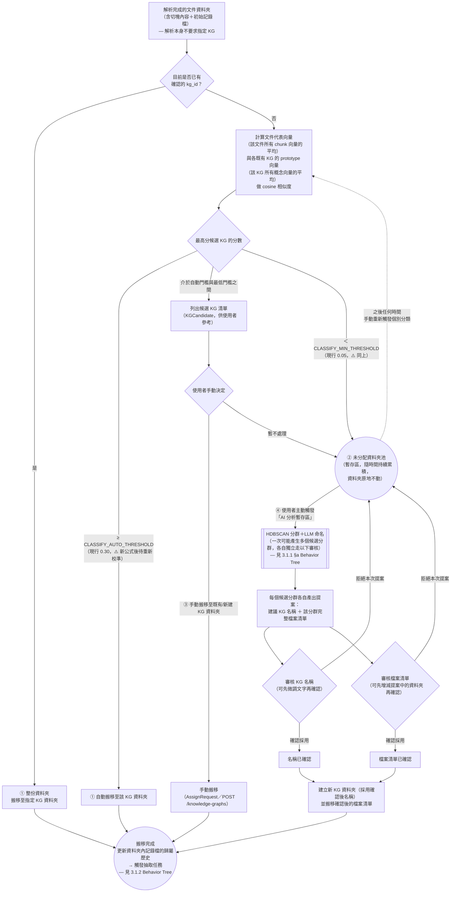

> **注意**：四種歸檔路徑對應開頭提出的四項功能——① 自動分配、② 都沒有適合的就留在未分配資料夾池、③ 手動分配到既有 KG、④ 使用者主動觸發 AI 分析未分配資料夾池。**無論走哪一條路徑，一旦資料夾被實際搬入某個 KG 資料夾，就立即觸發該 KG 的抽取任務**，不需要使用者另外按「開始建圖」；這是本論文對「建圖冷啟動延遲」痛點（`docs/報告/03_核心架構藍圖.md` 痛點 1）的具體回應之一。
>
> **分類分數計算（`CMP`）的參考依據**：採用 **Prototypical Networks**（Snell, Swersky, Zemel, 2017，🟢 **NeurIPS 2017**）的 centroid 相似度精神——把每個 KG 表示成其所有概念向量的平均（prototype），新文件與各 KG prototype 的 cosine 相似度即為分類分數。**不採用 v1 `concept_engine.compute_match_score()` 的兩兩配對＋align/magnitude 加權公式**：查證 v1 全 codebase 後發現，該公式的 `interest_score`／`professional_score` 兩個標量從初始化後從未被任何函式更新過（doc/KG 端恆為常數 0.5，查詢/新文件端恆為常數 0.8），代入公式後 `align`／`magnitude` 兩項對每一對概念皆為相同常數（0.7 與 0.65），整條公式在數學上等價於「0.7 × 平均 cosine 相似度」——個人化/差異化的設計意圖從未實際生效，v2 不予沿用。`CLASSIFY_AUTO_THRESHOLD`（現行 0.30）與 `CLASSIFY_MIN_THRESHOLD`（現行 0.05）兩個門檻值是針對舊公式校準的，換成 centroid cosine 相似度後數值尺度不必然相同，不能照搬舊數值——**分類機制本身（centroid cosine 相似度）有 Prototypical Networks／Sentence-BERT 文獻佐證，但這兩個具體門檻數值是資料集依賴的，任何文獻都無法直接告訴你正確切點，只能靠帶標籤驗證集實測校準**，兩者是不同層次的問題，不可混為一談。正式校準實驗設計（沿用同一份驗證集、PR 曲線式門檻掃描）見第五章 5.3.5 節；`core/constants.py` 已於校準完成前加上警告註解，避免這兩個佔位值被誤用為已驗證參數。
>
> **可信任專案背書與其邊界（查證見第二章 2.4.1）**：`semantic-router`（Aurelio Labs）驗證了「以 embedding 相似度做離散分類路由」是業界已實際部署的生產模式，但其機制是查詢向量對每條 route 底下每一句範例語句逐一比對的即時 kNN＋聚合，並非預先算好單一 centroid 向量——`CMP` 節點「預先計算 KG prototype」這個具體機制，仍直接依據 Snell et al.（2017）原型網路精神，semantic-router 只佐證同一大類設計模式的產業可行性，不佐證此處的具體實作選擇。
>
> **三層信心分級機制的定位（查證見第二章 2.4.2）**：`AUTO`／`SUGGEST`／`POOL` 三層依分數分級、`SUGGEST` 層讓使用者逐一確認候選的介面設計，查證廣泛使用的開源文件管理系統 Paperless-ngx 後發現該專案的 ML 自動分類（`MLPClassifier`）並無信心分級或建議層、直接套用單一預測結果——本論文找不到現有生產系統對此設計的直接先例，故此處應誠實定位為本論文自行提出的工程決策（以使用者可控性優先於全自動化），而非文獻/專案既有做法的複製。這與本節開頭「分類分數計算與 AI 自動分群機制以驗證文獻/專案為主要參考起點」的聲明並不矛盾——**演算法**（centroid 相似度、HDBSCAN、命名輸入篩選）借鏡自成熟文獻與專案，但**信心分級的介面設計**是本論文自行提出，兩者性質不同。
>
> **④ AI 自動分群建立新 KG 的審核機制**：AI 提案的「建議名稱」與「該分群檔案清單」是**兩項獨立審核**——`REVIEWNAME` 與 `REVIEWFILES` 各自可以先微調（改名稱文字／增減清單中的資料夾）再確認，不是綁在一起的單一整包同意/拒絕；任一項被拒絕，本次提案即取消，相關資料夾回到未分配資料夾池，不會只憑其中一項就建立新 KG。兩項都確認後，才以確認後的名稱與確認後的檔案清單建立新 KG。此機制目前**僅存在於 v1 `services/knowledge_graph_service.py` 的 docstring 註記與 v1 `cluster_service.py` 的具體實作**，v2 沒有對應的路由或實作——這是本論文的工程借鏡型待辦，非研究問題本身，若最終未實作，第四章需明確聲明降級為「僅支援①②③，不支援④」。
>
> **未分配資料夾池會隨時間持續累積**（②＋使用者「暫不處理」）：放著不管的話，暫存區只會越堆越多，需要一個機制把「彼此相似、但都跟現有 KG 對不上」的一批文件收攏成新的知識圖譜，而不是要求使用者逐一手動處理每一個檔案。詳細分群機制見下方 §a。

### 3.1.1 §a：AI 自動分群機制 Behavior Tree（HDBSCAN + LLM 命名）

未分配資料夾池達一定規模後，使用者可主動觸發分析。此機制的分群演算法與命名輸入篩選皆以已有廣泛驗證基礎的文獻為主要參考，而非直接沿用 v1 `cluster_service.py` 的簡化實作：

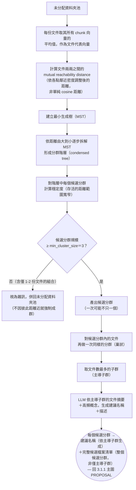

> **注意**：`FILTER` 節點的 `min_cluster_size=3` 是分群過程本身的限制，不是「先分群、再事後篩掉太小的群」——距離再近的兩份文件，若湊不滿 3 份，就不會被判定為一個真正的分群，會直接被歸為雜訊、留在未分配池等待未來有更多相似文件加入。這個機制直接對應本論文對「一個 KG 至少要有 3 個檔案」這項需求的具體實作依據。
>
> **分群演算法參考依據**：採用 **HDBSCAN**（McInnes, Healy, Astels, 2017，🟢 ***Journal of Open Source Software***）——透過調整過的距離度量（`mutual reachability distance`：兩點距離取兩者各自的「核心距離」與實際距離三者中的最大值，避免孤立點成為連接兩個不相關群集的橋樑）、最小生成樹、階層拆解、穩定度篩選，找出真正緊密的候選分群。**不採用 v1 `cluster_service.py` 的門檻式連通分量分群**：該做法用單一固定相似度門檻（0.35）判斷「同群」，已知有連鎖效應缺陷——若 A-B 相似度、B-C 相似度都恰好卡在門檻邊緣，即使 A 與 C 完全不相關，仍會被遞移地分進同一群；HDBSCAN 用相對穩定度而非絕對門檻判斷分群，可避免此問題。
>
> **實作驗證發現（`services/cluster_service.py`）**：HDBSCAN 預設參數在「未分配池裡唯一存在的真實結構，剛好只有一組達 `min_cluster_size` 的緊密群、其餘皆為雜訊、沒有第二個群可供對照」的情境下，會傾向把整批全數判為雜訊，即使群內本身緊密——這在資料量不大（暫存區剛開始累積）時是常見情境。實測解法是加上 HDBSCAN 官方既有參數 `allow_single_cluster=True`（非本專案自創演算法變體），並實測確認不影響多群情境下的正常區分能力（見 `tests/services/test_cluster_service.py`）。同時 `min_samples` 需明確設為 1（而非 HDBSCAN 預設值等於 `min_cluster_size`），避免剛好達邊界的小群因核心點密度門檻過嚴而被誤判。
>
> **命名輸入篩選的參考依據**：分群完成後，命名所需的代表文件並非直接取整個候選分群的全部檔案，而是採用 **Khandelwal (2025)**《Using LLM-Based Approaches to Enhance and Automate Topic Labeling》驗證過表現最佳的 **Approach 3（主導子群法）**——對候選分群內的文件再做一次同樣的分群，取文件數最多的子群作為 LLM 命名的輸入依據，過濾掉可能混入候選分群但主題略有偏移的邊緣文件，避免稀釋生成名稱的聚焦度。**不採用 v1 `_suggest_kg_name()` 直接取 `filenames[:10]`（未經任何篩選排序）的做法**——該論文的實證比較顯示，未經篩選/以多樣性為目標的取樣方式（該論文的 Approach 4）表現持續較差。**重要區分**：主導子群篩選**只影響命名時餵給 LLM 的輸入**，不影響候選分群本身包含哪些檔案——使用者在 `REVIEWFILES` 審核時看到的仍是整個候選分群的完整檔案清單，不會被系統偷偷先篩掉邊緣文件。
>
> **可信任專案背書（查證見第二章 2.4.2）**：**BERTopic**（Grootendorst, 2022，🟡 arXiv:2203.05794，尚無正式期刊/會議版本，但 GitHub 約 7.7k stars、原作者持續維護）獨立實作了與本節高度一致的「embedding → HDBSCAN 分群 → LLM/統計式命名」整條管線，其標準管線並支援 LLM-based 主題命名（見 Grootendorst〈Topic Modeling with Llama 2〉部落格文章），是比單獨引用 HDBSCAN 論文更有力的管線層級產業驗證。**需誠實標註的落差**：BERTopic 在 HDBSCAN 分群前固定接一段 UMAP 降維，理由是 mutual reachability distance 在高維空間容易受維度詛咒影響；`services/cluster_service.py` 目前直接對原始 embedding 向量做 `metric="euclidean"` 分群，未做降維前處理——此落差列入下方優化建議。
>
> **3.1.1 優化建議（2026-07-17 依程式碼實讀整理；2026-07-20 逐項處理，狀態見各條）**：以下六項為重新審視 `services/classify_service.py`／`services/cluster_service.py`／`routers/staging.py` 實際邏輯後發現的具體改進空間，非文獻查證發現，屬工程借鏡型待辦：
>
> 1. ✅ **已修正（2026-07-20）prototype／文件向量無持久化快取**：`compute_document_vector()` 改為優先讀取資料夾記錄檔快取的 `document_vector`（`DocumentRecord.document_vector`），命中則不重新呼叫 embedding provider；`compute_kg_prototype()` 新增 `_prototype_cache.json`（KG 資料夾內），成員清單與快取一致才命中，任一成員加入/移出即自動失效重算。兩者皆已由 `tests/services/test_classify_service.py`／`test_document_record_service.py` 的快取命中／失效測試覆蓋。
> 2. ✅ **已修正（2026-07-20）同批次分類的 prototype 過時**：`classify_all()` 新增 `_incremental_prototype_update()`，批次內文件被自動分配後立即以移動平均就地更新該 KG 在記憶體中的 prototype 與成員數，同批次後續文件不再拿舊 prototype 比對；`test_prototype_and_member_count_update_within_batch` 驗證批次內第二份文件看到的 `member_count` 已反映第一份文件的分配結果。
> 3. ✅ **已修正（2026-07-20）搬移與記錄檔更新無交易保護**：`assign_document_to_kg()` 的記錄檔更新若拋例外，改為把資料夾移回原位再重新拋出，確保呼叫端看到例外時資料夾必定還在呼叫前的位置，不會出現「已搬移但記錄檔未更新」的中間態；`test_rolls_back_move_when_record_update_fails` 驗證此行為（未採用「事後掃描修復」，因搬移前置回滾在此處是更簡單且立即一致的作法，不需要額外的背景掃描機制）。
> 4. ✅ **已處理（2026-07-20）HDBSCAN 未做降維前處理**：`cluster_service.py` 新增條件式 UMAP 降維（McInnes, Healy, Saul & Großberger, 2018, JOSS——與分群所用的 McInnes, Healy & Astels 2017 HDBSCAN 論文作者部分重疊但是不同文獻），僅在未分配池規模 ≥ `UMAP_MIN_POOL_SIZE=20` 才套用——**刻意不照抄「一律先 UMAP」**：UMAP 在點數過少時的流形估計本身不穩定，訂在略高於 UMAP 預設 `n_neighbors=15` 的規模才啟用，避免對本已為小樣本調校過（`allow_single_cluster=True`）的分群品質造成反效果；`random_state=42` 固定確保可重現。決策細節見 `services/cluster_service.py` 模組 docstring「降維前處理的決策」，測試見 `test_cluster_vectors_umap_gating`／`test_reduce_dimensionality` 系列。
> 5. **部分緩解（2026-07-20）新建 KG 的最小成員數門檻不對稱**：④ AI 自動分群路徑強制 `min_cluster_size=3` 才能成群，但 ③ 手動分配路徑仍可建立僅 1 份文件的新 KG——**刻意不改為強制門檻**：手動路徑存在的目的就是讓使用者能覆寫自動化判斷，若也強制最少 3 份文件，會與「手動」的自主性設計意圖矛盾，且第一份文件永遠無處可去。改為在 `classify_by_vector()` 新增 `low_confidence` 標記（`KGCandidate.member_count` / `low_confidence`，成員數 < `CLUSTER_MIN_SIZE` 時標記為 true）：不阻止建立小型 KG，但讓呼叫端（未來 UI）能區分「高分且樣本充足」與「高分但樣本太少、prototype 不穩定」，把判斷權交還給使用者而非系統代為決定。
> 6. **已標註觀測性警告（2026-07-20，非解決演算法複雜度本身）未分配資料夾池的擴展性上限**：`mean_pairwise_cosine_similarity()` 與 HDBSCAN 的距離計算皆為 O(n²)，而 3.1.1 §a 原文已承認未分配資料夾池「隨時間持續累積」。現階段**不引入近似最近鄰（如 FAISS）等額外基礎設施**——這會是比目前規模更大的架構決策；改為在池規模達 500 時記錄警告，讓維運者/未來研究者有明確訊號知道何時需要重新評估此設計。若第五章實驗語料規模觸及此門檻，需將「導入 ANN」列為第七章未來工作。決策細節見 `services/cluster_service.py` 模組 docstring「擴展性上限的決策」。
>
> 另可列為次要加分項（尚未處理）：`cluster_vectors()` 目前只用 HDBSCAN 硬標籤，未使用其官方本身提供的 soft membership 機率，可作為 `ClusterSuggestion.intra_similarity` 之外的額外信心指標。

### 3.1.2 抽取任務佇列與斷點續傳（Chunk 粒度）

> **設計定案（2026-07-20；2026-07-21 校正切塊來源；2026-07-21 再校正句子清單來源）**：建圖流程於最前端引入「指代消解與實體別名前處理」（完整機制見 3.4 §a，RQ4b；代名詞消解的正則清單/Prompt 模板/程式實作見 `docs/報告/05_指代消解與前處理任務書.md`），以「登記表比對（別名）＋前 4 後 2 雙向上下文視窗（代名詞）」對句子清單就地替換，輸出語意自足的標準化文字。**此標準化流程對 3.1.1 順手另存的句子切分結果（`sentences.json`）操作，不是每次重新對 `original.md` 呼叫 `split_into_sentences()`，更不沿用 3.1.1 為 RAG 向量檢索切好的 `chunk-NNN-of-MMM.md`**——句子切分規則若日後調整，重算會讓先前存的句子索引對不上，故一次切好存成穩定清單；RAG／SVO 切塊粒度需求不同，SVO 抽取不該沿用 RAG 切塊，完整比較過程見 `03_變更紀錄.md`；SVO 專用的切塊演算法本身尚未定案（見下方圖中 `GETSENT` 之後的銜接）。因此進入 3.1.2 任務佇列的每個 Chunk 最終仍會是**自包含的、無指代/別名歧義的標準化文字**，SVO 抽取 Worker 可直接以單一 Chunk 為單位呼叫 LLM，無須滑動視窗或多 Chunk 拼接——追蹤單位維持 `chunk_index`，`task_queue.db` schema 不變。此決定取代了原本的滑動視窗草案，完整比較過程見 [`03_變更紀錄.md`](03_變更紀錄.md)。

文件資料夾搬移至某 KG 資料夾後，立即觸發抽取任務。狀態追蹤採**雙層機制**，分工如下：

- **記錄檔**（資料夾內建、隨資料夾一起搬移）是**真實狀態來源**，記錄這份文件的**歸屬歷史**（何時被分配/搬移到哪個 KG）與**抽取進度**（是否完成；若未完成，停在哪個 `chunk_index`）。因為記錄檔實際存在於文件資料夾裡，資料夾不論被搬到哪個 KG，狀態都跟著走，不需要依賴外部資料庫才能得知這份文件的狀態。
- **本地 SQLite（`task_queue.db`）**是背景 Worker 用來快速排隊、挑選下一個待處理 Chunk 的**效能索引**，與記錄檔保持同步——好處是即使 `task_queue.db` 遺失或損毀，仍可透過掃描各 KG 資料夾下每份文件的記錄檔重建索引，不會真的遺失狀態；壞處是兩份狀態需要在每次轉換時同步寫入，實作時需注意寫入順序與失敗處理（例如記錄檔寫入成功但 SQLite 更新失敗時如何補救）。

本節只負責佇列的**生產者端**：文件怎麼被登記進佇列、佇列索引本身的完整性與程式重啟後的恢復。Worker 怎麼把工作領出來處理（消費者端，含「挑出下一個 pending Chunk」「狀態→processing」）見 3.1.3；抽取完成後的寫入與去重見 3.1.4——兩節的失敗/重試最終都回到本節登記的佇列，但佇列本身的生產/恢復機制與消費者端的取件邏輯是兩件事，不放在同一節。狀態機的五個狀態定義仍由本節統一負責，即使實際轉換發生在 3.1.3／3.1.4。

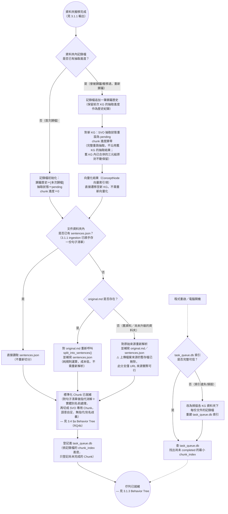

> **`GETSENT` 三層判斷的理由（2026-07-21 新增，2026-07-21 再校正為句子清單優先）**：`sentences.json`／`original.md` 皆由 3.1.1 的 `chunk_and_stage()` 順手寫入（見 `parser.chunk_writer.write_sentences_index()`／`write_original_text()`），正常情況下兩者一定存在，`GETSENT`／`CHECKORIG` 主要是防禦性檢查（例如舊資料夾是這兩項功能上線前歸檔的）。三層優先序刻意設計：① `sentences.json` 存在就直接讀，最快；② 只有 `original.md` 沒有 `sentences.json` 時，重新呼叫 `split_into_sentences()` 補回來——這是純規則運算，不需要 LLM 或重新解析文件，成本很低；③ 兩者都不存在才需要對原始來源重新解析。**`REPARSE` 分支誠實聲明其侷限**：`routers/documents.py::upload_document()` 在解析完成後會於 `finally` 區塊刪除暫存上傳檔案（`os.remove(temp_path)`），檔案上傳來源的原始位元組已不存在，理論上的「重新解析」在這類來源上其實無法真正執行，只有 URL 來源（`ingest_url`，`source` 本身就是可重新請求的網址）才能靠重新抓取復原；檔案上傳來源若真的走到這個分支，代表資料已經無法復原，屬於需要人工介入的異常狀態，非正常運作路徑。
>
> **注意**：狀態機共五態——`pending`（待處理）／`processing`（處理中）／`completed`（已完成）／`failed`（失敗，可重試）／`pending_upload`（本地抽取已完成，但尚未成功送達知識圖譜）。`pending_upload` 是刻意設計的中間態：本地抽取（CPU/GPU 算力）與寫入知識圖譜是兩個可能各自失敗的步驟，若只有 `completed`／`failed` 兩態，寫入失敗就必須重新做一次本地抽取，浪費已完成的算力；有了 `pending_upload`，重試只需要重送結果，不必重跑 LLM 抽取。三態轉換的實際時機：`processing` 由 3.1.3 的 `WORKER`／`PROC` 節點設定（Worker 領到 Chunk 的當下）；`pending_upload`／`failed` 由 3.1.3 的抽取結果決定；`completed` 由 3.1.4 的寫入結果決定——本節（3.1.2）只負責定義這五個狀態的意義與登記進佇列時的初始狀態（`pending`），不觸發中間的狀態轉換。
>
> **中斷處理**：若程式在某 Chunk 標記為 `processing` 但尚未轉為其他終態時被中止（當機、強制關閉），重啟掃描時必須將這類「卡在 processing」的 Chunk 視為未完成、可重新處理，而非誤判為進行中而跳過——這是斷點續傳正確性的關鍵細節，第四章實作時建議啟動時先將所有 `processing` 狀態批次重置為 `pending`。
>
> **重新歸屬的邊界案例（已定案）**：若一份文件曾被分配到 KG-A、部分或全部 Chunk 已合併進 KG-A 的知識圖譜，之後又被重新分配到 KG-B——兩條軌道的可遷移性不同：
>
> - **軌道二（SVO／圖譜）不遷移**：已合併進 KG-A 的三元組可能已與其他文件貢獻的既有實體糾纏在一起，無法乾淨切割；本論文選擇對 KG-B 完整重新抽取這份文件，KG-A 內已合併的三元組原封不動保留——刻意接受的取捨，避免處理實體融合切割這個更困難的問題。
> - **軌道一（向量化／ConceptNode）直接遷移**：向量獨立自包含，不需重新向量化。
>
> 記錄檔的歸屬歷史忠實記下這份文件曾經歷過哪些 KG 分配，但每次重新歸屬時抽取進度只針對「當前所屬的 KG」重新起算，不跨 KG 累加。
>
> 此三層追蹤（KG 資料夾 → 文件資料夾 → Chunk）皆為本地端狀態，與 `docs/ARCHITECTURE.md`「本地抽取＋雲端閘道」決策一致，只有 `pending_upload → completed` 這個轉換需要一次網路呼叫。

> 設計過程中曾評估「切塊粒度整合——向量索引 vs. SVO 抽取視窗（滑動視窗）」方案，最終選擇上方「設計定案」所述的指代消解前置法（見 3.4 §a，RQ4b）。完整比較過程（含 GraphRAG／LightRAG／Text2KGBench／CORE-KG 文獻查證）見 [`03_變更紀錄.md`](03_變更紀錄.md) 「二、已評估但未採用的設計方案」。

### 3.1.3 抽取過程

延續 3.1.2：本節是佇列的**消費者端**——佇列就緒後（含正常新增與程式重啟後的恢復兩種來源），由 Worker 依序把工作領出來處理，才真正開始抽取。`core/constants.py` 目前定義 30 種受控語意關係類別（`SVO_REL_TYPES`），涵蓋分類關係（`IS_A`/`PART_OF`/`INSTANCE_OF`）、因果關係（`CAUSES`/`PREVENTS`/`ENABLES`）、功能關係（`USES`/`REQUIRES`/`IMPLEMENTS`）、比較關係（`CONTRASTS`/`SIMILAR_TO`/`OUTPERFORMS`）等九組，並以 `RELATED_TO` 作為無法歸類時的兜底類別；LLM 抽取出的動詞先比對這組受控詞彙，比對不上時走結構/語意兩層驗證，決定映射到既有類別或擴充詞彙表。**為什麼選擇受控詞彙而非開放抽取、其學理依據與文獻佐證，見 3.3（RQ4a）**——本節只呈現「機制怎麼跑」，不重複該節的研究問題與 trade-off 論證。

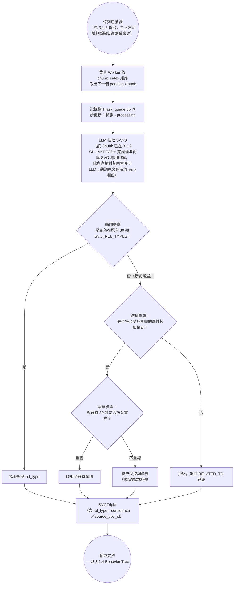

> **注意**：`STRUCT`／`SEMANTIC` 兩步驗證目前為**設計提案，尚未實作**（`svo_service.py` 現況為 stub）；其與 Schema.org 受控詞彙擴展精神的類比、Guha et al.（2016）全文查證缺口、Vrandečić & Krötzsch（2014）《Wikidata》替代佐證，皆屬 RQ4a 的原理與文獻討論範疇，完整內容見 3.3。

### 3.1.4 抽取後續

延續 3.1.3：抽取產出 `SVOTriple` 後，本節處理結果如何送進知識圖譜——對應 3.1.2 五態狀態機中 `pending_upload`／`completed`／`failed` 三態實際觸發的動作，以及實體對齊/去重（DEDUP）如何決定 MERGE 既有節點或新增節點。此步驟原本散落在 3.1 總覽圖與舊版 3.1.2 的 `WRITE` 節點，本次集中於此獨立小節完整展開。

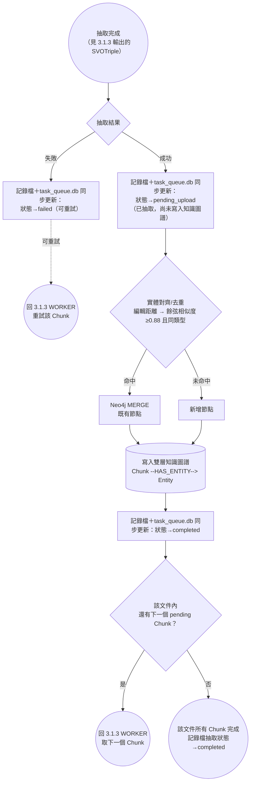

> **注意**：`DEDUP4` 是現行已定案的基準機制（`docs/ARCHITECTURE.md`，2026-07-10 決策：編輯距離→cosine≥0.88 且同類型），本節只是把原本分散在總覽圖與舊版 3.1.2 的細節集中展開，非新機制。此基準機制在「I-35」對「Interstate Highway 35」這類縮寫上的已知弱點，以及 LLM 仲裁擴充（`ESCALATE`）與別名記錄（`surface_form`）的完整設計，屬於 RQ4b 的原理與文獻討論範疇，見 3.4 §b。

## 3.2 雙層檢索架構（對應 RQ1／RQ2）

本論文將問答時的檢索拆成兩層：**路由層（ConceptNode）**負責在多個獨立知識圖譜之間決定「該去哪個圖找答案」；**知識層（BFS 圖遍歷）**負責在選定的圖譜內做多跳推理。這個分層設計本身**是本論文自行提出的架構**，並非採用文獻中的標準演算法（誠實聲明，呼應 v1 報告五.2）——第二章 2.1.2 已指出 Edge et al.（2024）GraphRAG 的設計預設是單一大圖，較少討論多圖並存時的路由問題，這正是 RQ2 要驗證的缺口；而路由層之上、選定圖譜之後的圖遍歷本身是否比純向量 RAG 更具優勢，則是 RQ1 要驗證的問題。兩者合起來才是完整的「雙層檢索」設計動機。

### §a：ConceptNode 路由層 Behavior Tree（RQ2）

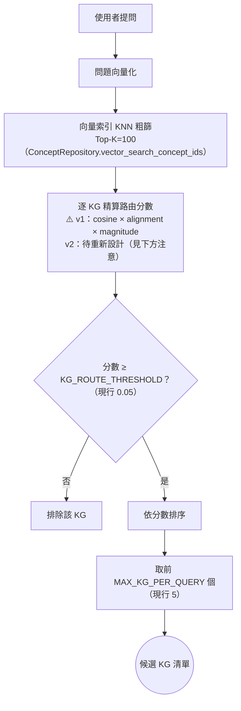

> **注意**：`SCORE` 節點的「cosine × alignment × magnitude」加權公式是 v1 的既有設計（`concept_engine.py` docstring 標註「TODO(v2 架構重整)：待重新設計後遷移」），本論文暫不假設此公式在 v2 會原樣保留——RQ2 的實驗設計需要明確區分「路由層這個兩層架構本身是否成立」與「這個特定加權公式是否為最優解」兩件事，避免把工程實作細節誤植為研究貢獻。`KG_ROUTE_THRESHOLD`、`MAX_KG_PER_QUERY`、`CONCEPT_COARSE_TOP_K` 三個門檻值目前定義在 `core/constants.py`，第五章消融實驗需要對這些門檻做敏感度分析。

### §b：BFS 圖遍歷 Behavior Tree（RQ1）

> **注意**：`PRUNE` 節點以虛線連回 `TRIPLES`，代表這是**尚未實作、屬 RQ6（預留）的設計提案**，現行系統（v1 與 v2 stub）在遇到 Hub Node 時一律走 `CUT` 這條 naive 硬截斷路徑（`_PER_SEED_FACT_LIMIT=20`）。RQ1 的實驗設計（KG-BFS vs. 純向量 RAG）以現行的 `CUT` 路徑為基準線即可，不需要等 RQ6 完成；但若 RQ6 最終納入正式貢獻，RQ1 的基準線需要重新跑一次以排除剪枝策略改變帶來的干擾。

## 3.3 受控語意關係抽取（對應 RQ4a，預留）

> 本節說明 RQ4a 的設計原理與文獻佐證；抽取機制實際如何運作（Behavior Tree）見 3.1.3，此處不重複展開。

本節設計的核心問題：SVO 抽取時，動詞是要開放抽取（任意動詞字串皆可成為關係，如 Angeli et al. 2015 Stanford OpenIE 的做法），還是收斂到一組**受控語意關係詞彙**（即 3.1.3 的 `SVO_REL_TYPES` 30 類）？本論文選擇後者。

選擇受控集合而非開放抽取的理由，直接回應第二章 2.1.3 討論的語意一致性缺口：Vashishth et al.（2018）CESI 指出開放式抽取會讓語意相同的關係以不同字串存入知識庫（「創立」「成立」「建立」被記為三個不同謂語），造成多跳推理時的語意漂移。但受控集合並非沒有代價——固定 30 類詞彙必然犧牲一部分細緻語意的召回率，這正是 RQ4a 要實證回答的 trade-off：語意一致性與可追溯性（AIS）的提升，是否能補償召回率的損失？RQ4a 處理的是三元組裡「V」（關係類型）的受控化；三元組另一半「S／O」（實體本身）的指稱一致性問題，見 3.4 節（RQ4b）。

> **注意**：3.1.3 的 `STRUCT`（結構驗證）／`SEMANTIC`（語意驗證）兩步機制與 Schema.org（Guha et al., 2016）的受控詞彙擴展精神一致——新詞彙要進入系統，先檢查格式是否符合既有屬性模板（結構驗證），再檢查是否與既有類別語意重複（語意驗證），避免詞彙表無限膨脹又退化為開放式抽取。**這是本論文的設計提案，目前尚未實作**（`svo_service.py` 現況為 stub），且 Guha et al.（2016）原文為 ACM 付費資源、僅記書目資訊（見第二章 2.1.3 與 `docs/參考文獻/03_資訊抽取與本體設計/README.md`），寫作定稿前需透過學校圖書館取得全文核實此處的類比是否恰當。
>
> **替代查證來源（2026-07-20，見第二章 2.1.3）**：在 Guha et al. 全文取得前，已另外精讀 **Vrandečić & Krötzsch（2014，🟢 CACM 57(10)）**《Wikidata》作為部分替代佐證——Wikidata 屬性頁面須指定 datatype（結構層限制）、schema 本身受社群治理、另有社群制定的語意限制條件與外部掃描機制（語意層檢查），證實「受控詞彙的結構層與語意層可分別治理」已有生產級規模化先例。**但誠實聲明**：Wikidata 論文並未描述「結構驗證→語意驗證」這種**循序、單一審核閘門**的精確機制（其兩層檢查是獨立運作，非新詞彙進入前的循序關卡），因此本節設計提案與 Wikidata 治理模式**不宣稱機制等價**，僅多一份「此類分層治理模式在生產級系統可行」的獨立佐證；本節與 Schema.org 精神的直接類比仍待 Guha et al. 全文核實。
>
> 本節與 `docs/報告/03_核心架構藍圖.md` 痛點 12（實體/關係摘要整併，Element Summarization）為**不同但相關**的問題：本節解決的是「同一描述該歸到哪個受控類別」，痛點 12 解決的是「同一節點的多筆描述如何整併成單一摘要」——兩者皆發生在 3.1.4 抽取後續之後，但摘要整併目前尚未排入本論文的正式 RQ（見第七章未來工作）。

## 3.4 實體指代與別名消解（對應 RQ4b，預留，2026-07-20 新增）

> 狀態：🟡 設計提案，機制合理，關鍵參數與涵蓋範圍待第五章消融實驗驗證，非定案實作。

RQ4a（3.3 節）處理的是 SVO 三元組裡「V」（關係類型）該不該受控；本節處理的是「S／O」（實體本身）的另一半問題——同一個真實世界的實體，在文字裡可能以完全不同的字面形式出現：**代名詞**（他、它、該公司）、**全稱/簡稱/別名**（Interstate Highway 35／I-35／Interstate；Richard Stone／Stone／the defendant）。若不處理，會直接反映成圖譜裡的**冗餘/孤立節點**（同一實體被拆成好幾個各自連結度很低的節點），削弱多跳推理（RQ1）與路由層（RQ2）賴以運作的圖結構完整性，也讓「語意一致性」這個 RQ4 的核心主張不完整——只控制關係類型、不控制實體指稱，等於三元組只做了一半的受控化。

**RQ4b**：文件內／跨文件的實體指代與別名消解機制，相較於現行僅靠字串編輯距離＋cosine 相似度門檻的簡單去重，對圖譜節點冗餘度、多跳推理正確率、可追溯性（AIS）有何影響？

本節機制分兩層，分別解決「同一份文件內」與「跨文件」兩種不同尺度的指稱不一致問題——這個分層本身呼應第二章 2.1.3 已查證的文獻（原始查證脈絡見 [`03_變更紀錄.md`](03_變更紀錄.md) 「3.1.2 §a（原稿）」）：Text2KGBench（Mihindukulasooriya et al., 2023）證實句子級抽取若不處理指代消解會漏抽，CORE-KG（Meher, Domeniconi & Correa-Cabrera, 2025）證實把指代消解前置於切塊之前能量化降低節點冗餘（-28.25%），但兩篇文獻皆未涵蓋「別名要在圖譜中可追溯記錄」這個本節額外要求，此部分為本論文自行設計。

### §a：文件內前處理——代名詞消解＋實體別名登記

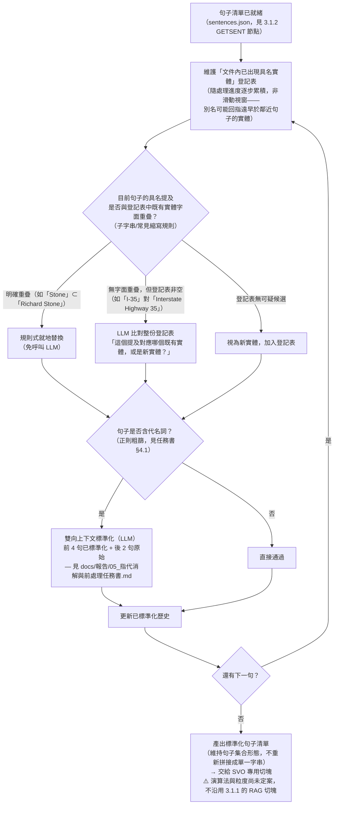

> **順序**：別名消解跑在代名詞消解**之前**——先把「Stone」「該公司」這類具名別名收斂成文件內唯一稱呼，代名詞消解時「前 4 句已標準化」的品質才會更好。
>
> **與 05 任務書的分工**：代名詞消解（`PRONLLM` 節點）完整規格見 `docs/報告/05_指代消解與前處理任務書.md`（正則清單、雙向上下文視窗設計、Prompt 模板、Python 實作），本節只展示其在整條前處理管線中的位置；別名登記/比對機制（`REGISTRY`／`ALIASCHECK`／`ALIASLLM`）目前僅有本節的機制設計，尚待補上對應的實作任務書。
>
> **成本控制**：`ALIASLLM` 只在「無字面重疊但登記表非空」時觸發，多數句子仍走免費的規則式路徑（`ALIASRULE`）或直接通過（`BYPASS`），呼應代名詞消解既有的「正則粗篩才呼叫 LLM」省錢邏輯。
>
> ⚠️ **已知限制**：登記表比對是**文件內**範圍，不處理跨文件別名（見下方 §b）；`ALIASLLM` 的判準（多少相似度才算「同一實體」）目前僅有機制設計、無量化門檻，需留給第五章消融實驗校準。
>
> **與 3.1.1 RAG 切塊的關係（2026-07-21 確認；2026-07-21 再校正輸入形態）**：本節輸入是 3.1.1 順手另存的句子切分結果（`sentences.json`，見 3.1.2 `GETSENT`），不是 3.1.1 為 RAG 向量檢索切好的 `chunk-NNN-of-MMM.md`——兩者切塊粒度需求不同（向量檢索要細、SVO 抽取要粗），SVO 抽取不該沿用 RAG 切塊，完整討論見 `03_變更紀錄.md`「已評估但未採用的設計方案」。本節輸入輸出皆維持**句子集合**形態（不重新拼接成單一字串），`STDSENTS` 產出標準化句子清單後直接交給 SVO 專用切塊，該切塊的演算法與粒度目前**尚未定案**，是本節之後待補的設計。

### §b：跨文件別名消解——擴充現行 DEDUP／MERGE 機制

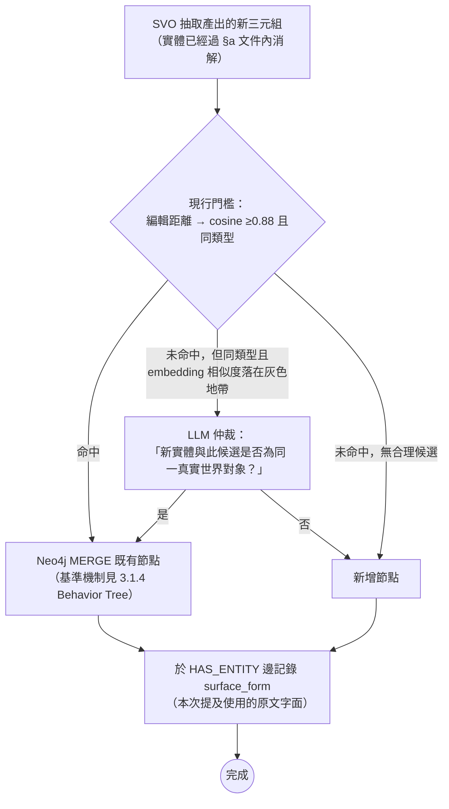

> **為什麼現行門檻不夠**：`docs/ARCHITECTURE.md`（2026-07-10 決策）既有的編輯距離/cosine 0.88 門檻，對「San Antonio」/「San Antonio, Texas」這類字面相近的變體還算堪用，但對「I-35」/「Interstate Highway 35」這種縮寫（字面幾乎無重疊）不可靠——這是已知弱點，`ESCALATE` 節點只在既有門檻判不出來、但候選同類型時才呼叫 LLM，不是取代現行門檻，是補一層仲裁。
>
> **記錄別名而非只是靜默合併**：`(Chunk)-[:HAS_ENTITY]->(Entity)` 邊（`docs/ARCHITECTURE.md`，HippoRAG 文獻背書）新增 `surface_form` 屬性，記錄每次提及實際使用的字面——`Entity.name` 只需一個簡單規則決定正式名稱（如最長/最正式者，或先出現者為準），其餘變體透過查詢 `MATCH (c)-[r:HAS_ENTITY]->(e) RETURN DISTINCT r.surface_form` 取得，不需新增節點類型，直接沿用既有 schema。這同時滿足「別名要合併」與「別名要可追溯」兩個要求，服務 RQ3／RQ4a／RQ4b 共同的可追溯性（AIS）次要指標。
>
> ⚠️ **待決策**：`ESCALATE` 的呼叫時機（embedding 相似度落在哪個區間才算「灰色地帶」）、`Entity.name` 正式名稱的選取規則，皆尚未定案，需留給第四章實作與第五章消融實驗。本節與 §a 皆為設計提案，非定案實作（`svo_service.py`／DEDUP 相關程式碼現況為 stub）。

## 3.5 自我精煉檢索迴圈（對應 RQ3）

單輪 BFS 檢索的問題：若種子實體提取不完整或問題本身需要跨圖多跳才能回答，第一輪檢索到的 Context 可能不足以支撐正確回答，此時直接生成容易產生幻覺。本論文設計信心門檻觸發的自我精煉迴圈，在生成後評估回答信心，信心不足時回補檢索範圍、再次生成，直到信心達標或達輪數上限。

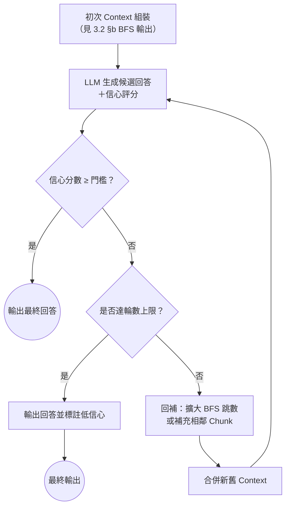

> **注意**：本設計延伸 Self-RAG（Asai et al., 2023）、FLARE（Jiang et al., 2023）、IRCoT（Trivedi et al., 2022）等主動式/反思式檢索文獻的評估範疇（見第二章 2.1.1），但機制上有明確差異——這三篇文獻皆作用在**自由文字段落**的檢索與生成上；本論文的自我精煉迴圈作用在**結構化三元組 Context**上，回補動作是「擴大 BFS 跳數」而非「重新檢索段落」，且信心評分與圖遍歷的信心（如命中種子實體數、路徑長度）綁定，而非純粹依賴生成模型自身的 token 機率。此差異需要在第二章 2.3 比較表與正文中明確寫出，不能只是條列式帶過。
>
> 「信心門檻」與「輪數上限」的具體數值屬於工程參數，需要在第五章消融實驗中做敏感度分析，本節僅描述機制設計，不預設最終參數值。

## 3.6 向量引導圖剪枝（對應 RQ6，預留）

**本節內容目前不存在對應實作**，是四項待驗證研究問題中風險最高的一項（去留已於第一章 1.2 節聲明「暫緩，待 RQ1-3 進度明朗後再評估」）。現行系統在 BFS 遍歷命中高連結度節點（Hub Node）時，一律採 naive 硬截斷（`_PER_SEED_FACT_LIMIT=20`），不區分被截斷的三元組與查詢問題的相關性——這正是第二章 2.1.4 討論的「Static Graph Fallacy」（Lau et al., 2026）：索引時固定的圖結構忽略了查詢依賴的邊相關性，導致遍歷被引導至高連結度但與當前問題無關的節點。

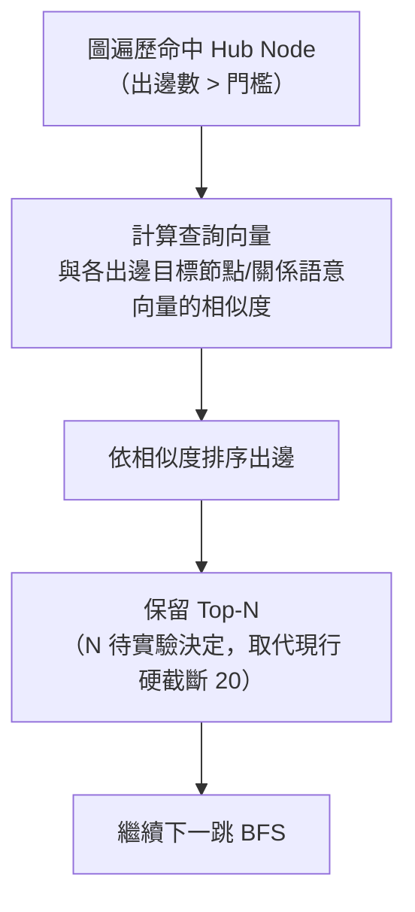

> **注意**：此圖為**設計提案**，非現行系統行為（現行行為見 3.2 §b 的 `CUT` 節點）。PathRAG（Chen et al., 2025）的流量式剪枝（flow-based pruning）與 CatRAG（Lau et al., 2026）的查詢自適應遍歷是本設計最直接的文獻對照對象（見第二章 2.1.4），但兩者皆非本論文的技術棧（Neo4j + Cypher BFS）下的現成實作，若 RQ6 最終納入正式貢獻，需要自行實作並與 naive 硬截斷做消融比較，而非直接沿用兩篇文獻的程式碼。若 RQ1-3 進度不允許納入 RQ6，本節將改寫為「未來工作」並移至第七章（見第一章 1.4.2）。

## 3.7 研究方法論說明

依 v1 報告五.1/五.2 已建立的誠實框架，本論文的技術決策分兩類，需在正文中明確標示，不可混為一談：

- **借用既有理論**：路由層之外的圖遍歷正確性（Cypher BFS 語意）、受控詞彙的結構/語意驗證兩步機制之理論類比對象（Schema.org）、自我精煉迴圈的信心觸發機制脈絡（Self-RAG/FLARE/IRCoT），皆有明確文獻可引用佐證設計動機，但**具體實作皆為本論文自行設計**，並非直接套用文獻中的演算法或程式碼。
- **本論文自行設計的工程決策**：雙層路由架構（RQ1/RQ2）、文件內／跨文件實體別名消解機制（RQ4b，預留——CORE-KG 雖已驗證「指代消解前置於切塊」的大方向，但其登記表比對＋分級 LLM 仲裁的具體機制為本論文自行設計，非直接沿用）、向量引導剪枝的相似度計算方式（RQ6，預留）等，目前業界與學界皆無現成解法可直接採用（見第二章文獻定位分析與 `docs/報告/03_核心架構藍圖.md` 痛點分類），這正是本論文宣稱研究貢獻之處。

**實驗可追溯性承諾**：依 `docs/ARCHITECTURE.md`「實驗可追溯性規範」（2026-07-13 決策），第五章的每次實驗執行皆須記錄 git commit hash／分支、完整參數快照、測試案例集版本、原始輸出路徑四項資訊，以 JSON/YAML manifest 形式與實驗結果一併保存，不引入 MLflow 等重量級 MLOps 平台。此規範同時支撐 RQ2／RQ3 的可追溯性次要指標評估。

**消融實驗設計原則**：RQ1-RQ3（確定）與 RQ4a/RQ4b/RQ6（預留）的實驗設計皆遵循「單一變因控制」原則——例如 RQ2 驗證路由層時，知識層（BFS）與生成模型應保持固定，只切換「有無路由層」或路由層的門檻參數；RQ6（若納入）驗證剪枝策略時，路由層與受控詞彙集應保持固定，只切換「naive 硬截斷 vs. 向量引導剪枝」。完整的組別設計、baseline 與資料集留待第五章展開，本章僅聲明此為貫穿全部消融實驗的共同原則。
