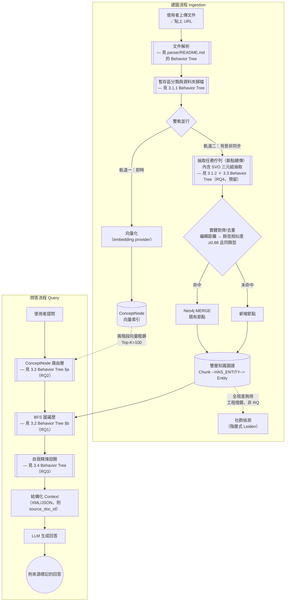
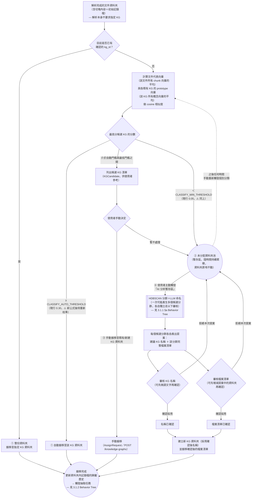
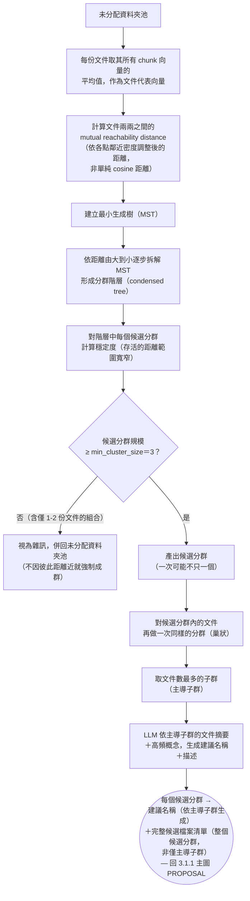
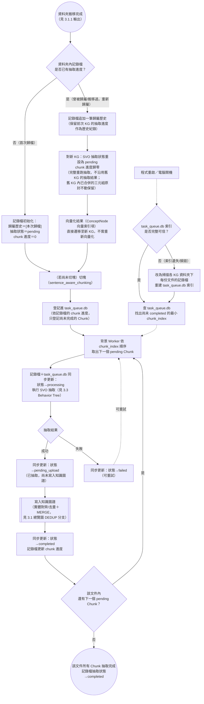
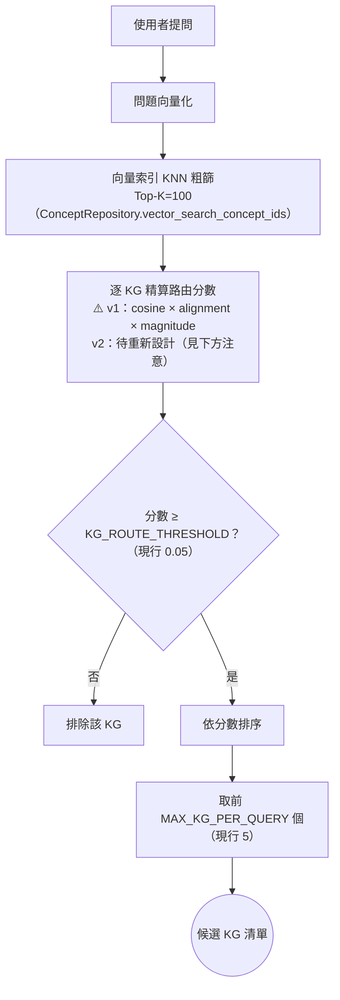
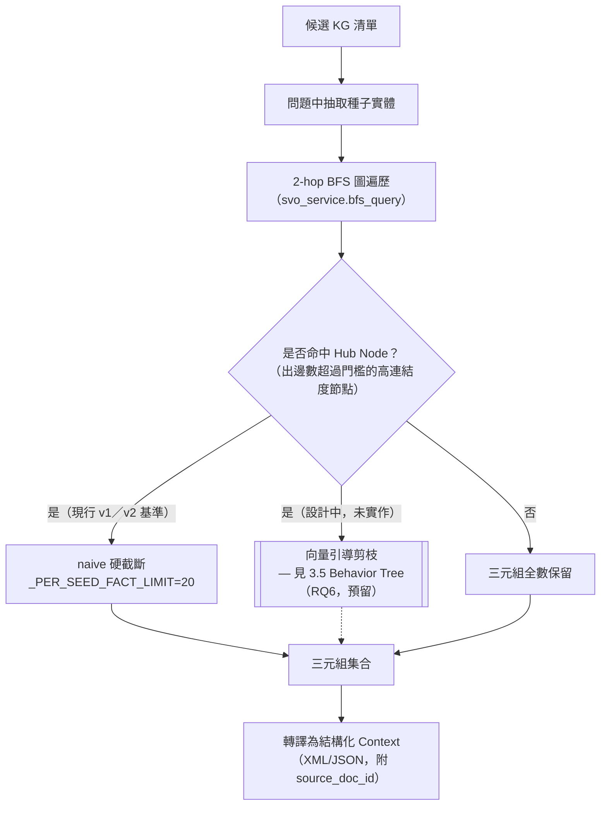
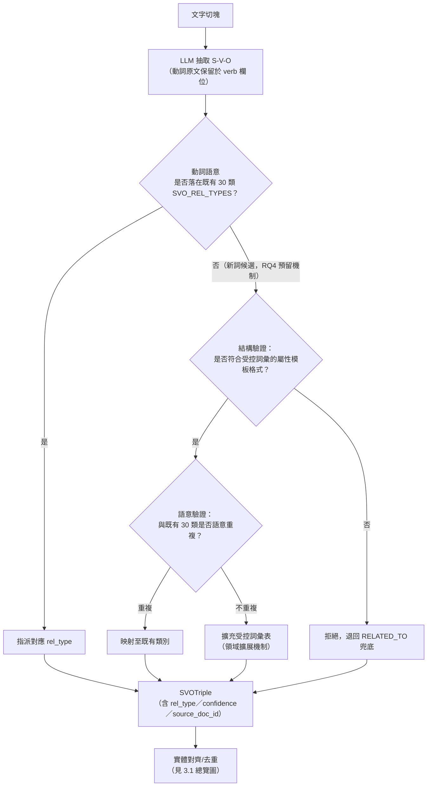
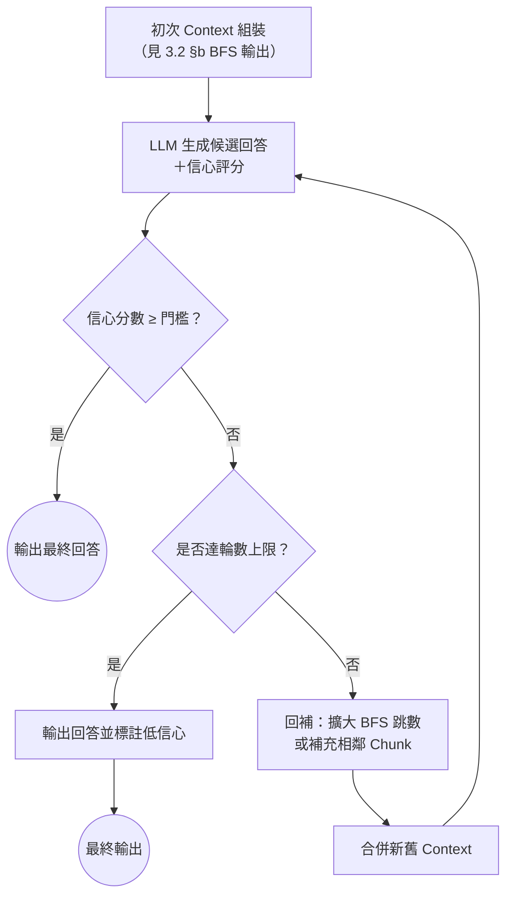
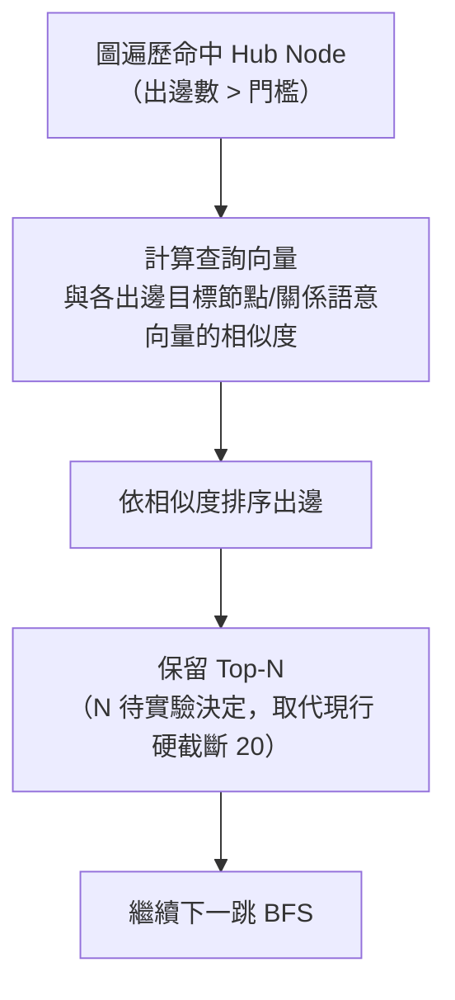

# 第三章：系統設計與方法論

> 狀態：🟡 草稿（2026-07-16 首次填實；同日補充 3.1.1／3.1.2 暫存區歸檔與抽取斷點續傳細節；同日再修正 3.1.1/3.1.2 改為「文件資料夾實際搬移＋資料夾內記錄檔狀態機」設計，並補齊四項暫存區功能①自動分配②無適合則留存③手動分配④使用者觸發 AI 分群建議＋審核，其中④的審核機制已定案為「名稱與檔案清單分開審核、皆可先微調再確認」；重新歸屬的邊界案例亦已定案：軌道二不遷移、改對新 KG 完整重跑抽取，軌道一直接遷移向量化結果；同日再將 3.1.1 的分類分數計算與 AI 自動分群機制，從「直接沿用 v1」改為「以驗證文獻/專案為主要參考起點」——分數計算改採 Prototypical Networks (Snell et al., 2017) centroid 相似度，捨棄查證後發現恆為常數、無實際作用的 v1 align/magnitude 加權；AI 分群改採 HDBSCAN (McInnes et al., 2017，`min_cluster_size=3`) 取代 v1 門檻式連通分量分群，命名輸入篩選改採 Khandelwal (2025) 驗證表現最佳的主導子群法，取代 v1 未經篩選的做法；新增 3.1.1 §a 專門展開此分群機制的 Behavior Tree；同日 3.1.1 完成實作與測試——`parser/chunk_writer.py` 改為逐文件資料夾、新增 `services/document_record_service.py`／`services/classify_service.py`／`services/cluster_service.py`／`routers/staging.py` 端點，122 項 pytest 測試通過，實作過程中發現 HDBSCAN 需加上 `allow_single_cluster=True` 參數才能正確辨識「未分配池裡唯一結構恰好達 min_cluster_size」的情境，已同步更新 §a 說明與 `docs/報告/技術參考地圖.md`）。同日（2026-07-17）再為 3.1.1／§a 查證可信任專案背書並提出優化建議：分類分數額外對照 **semantic-router**（Aurelio Labs）驗證「embedding 相似度離散路由」已是產業實例，但誠實區分其即時 kNN 機制與本論文 centroid prototype 機制的差異，不可混為一談；AI 分群額外對照 **BERTopic**（Grootendorst, 2022）驗證「HDBSCAN＋LLM 命名」整條管線的產業實例，並誠實標註本論文未如 BERTopic 於 HDBSCAN 前做 UMAP 降維的落差；另查證 **Paperless-ngx** 的 ML 自動分類機制，確認其無信心分級/建議層設計，故將 3.1.1 主圖的三層信心分級機制明確定位為本論文自行提出的工程決策，而非業界既定做法的複製；同時依現行程式碼實讀（`services/classify_service.py`／`services/cluster_service.py`）整理六項優化建議。完整查證過程見新增之第二章 2.4 節，優化建議清單見本節文末。內容主體整合自 v1 `docs/報告/01_專案總覽_是什麼為什麼怎麼做.md` 第三章「怎麼做」、`docs/ARCHITECTURE.md` 決策紀錄、`docs/報告/01_本地抽取與混合架構評估.md` 第四節、`core/constants.py` 現行參數，並依 1.5 節待辦完成 RQ 編號校正（見下方各節標題）。**RQ 編號現行狀態**：3.1 為建圖流程的基礎工程機制（暫存區分類、斷點續傳佇列），屬 🔧 工程借鏡型，不對應任何 RQ；3.2 對應 RQ1（KG-BFS vs. 純向量 RAG 的優勢邊界）與 RQ2（輕量路由層效能取捨）；3.3 對應 RQ4（預留）；3.4 對應 RQ3；3.5 對應 RQ6（預留）——與 1.5 節指出的舊版四 RQ 編號已核對一致，不需再變更。
>
> **架構圖表繪製慣例**：本章沿用 `parser/README.md` 已驗證過的「Behavior Tree」分層繪圖法——先給一張**系統總覽**流程圖，圖中凡標示 `[[ ]]` 雙框的節點代表「此處有更細的子流程圖，見指定小節」，各小節再各自展開一張聚焦於該元件的細部圖。這樣讀者可以先掌握全局，再依需要下鑽到任一元件的決策細節，不必一次消化過於龐大的單張圖。

## 3.1 系統總覽

本系統的處理流程分兩條主線：**建圖流程（Ingestion）**將使用者提供的原始文件轉譯為結構化知識圖譜；**問答流程（Query）**則在既有圖譜上進行路由、遍歷、精煉，最終生成附來源標記的回答。兩條主線共用同一個 Neo4j 雙層知識圖譜作為交會點。

> **注意**：`[[ 雙框 ]]` 節點是本章分層繪圖的核心慣例，代表「此節點內部另有一張聚焦圖，見對應小節」——與 `parser/README.md` 圖文管線 BT 的 `IMG[[ ]]` 用法完全一致，確保全文件的圖表語彙一致，讀者不需要重新學習一套新符號。
>
> 解析完成的文字並非直接進入雙軌處理，而是先經過**暫存區分類與資料夾歸檔**（3.1.1）決定歸屬哪個知識圖譜，歸檔後才分岔為雙軌：**軌道一（即時）**是同步、快速的向量化，不需要排隊等候；**軌道二（背景非同步）**才是具斷點續傳能力的**抽取任務佇列**（3.1.2），佇列內部的其中一步驟即為 SVO 三元組抽取（3.3）。`QUEUE` 雙框節點因此同時指向 3.1.2（佇列機制本身）與 3.3（佇列內執行的抽取演算法），兩者是「容器」與「容器內一個步驟」的關係，不是平行的兩張獨立圖。這三個新增/調整的節點是本論文對 v1 既有設計（`docs/ARCHITECTURE.md`「執行環境架構」「建圖流程：雙軌非同步」決策）的具體化與圖示化，非重新設計。
>
> 建圖與問答兩條主線並非彼此獨立的兩個系統，而是共用同一個 Neo4j 雙層圖：建圖流程持續把新文件寫入 `KG`，問答流程隨時讀取當前狀態的 `KG` 做路由與遍歷——這也是 3.5 節「向量引導圖剪枝」與時序管理等未來工作（見 `docs/ARCHITECTURE.md`）需要面對「讀寫並行一致性」的原因，本論文將此列為方法論限制（見 3.6）。
>
> 社群偵測（`COMM`）與全局查詢（Global Search）是 `docs/報告/03_核心架構藍圖.md` 痛點 2/13 指出的**工程借鏡型**改善，業界已有 RAGFlow、Microsoft GraphRAG 官方實作可直接參考（見第二章 2.1.2），本論文不將其列為研究問題，故圖中以虛線標示、不展開細部 Behavior Tree。

### 3.1.1 暫存區分類與資料夾歸檔

每個知識圖譜（`KnowledgeGraph`）對應磁碟上一個以其名稱命名的獨立資料夾（`folder_path`）。**每份文件解析完成後，本身也是一個獨立資料夾**——內含該文件切塊後的內容，以及一份隨資料夾移動的「記錄檔」（狀態機，詳見 3.1.2）。「歸檔」在本設計裡不是抽象的資料庫關聯，而是**把這份文件的整個資料夾，實際搬移到目標 KG 的資料夾底下**（同一磁碟分割內的搬移屬原子操作，不是複製再刪除，不會有「搬到一半」的中間態）——資料本身跟著搬，離開暫存區，使用者用檔案總管打開任一 KG 資料夾，看到的就是它實際擁有的全部原始來源。

> ⚠️ **與現行 `parser/chunk_writer.py` 的落差**：目前 `write_chunks_as_markdown()` 是把同一份文件的所有切塊檔案攤平寫進同一個 `output_dir`，以檔名前綴 `{source}__chunk-N-of-M.md` 區分來源，並非「每份文件各自一個資料夾」。本節「文件資料夾」的結構是 v2 尚待落實的調整，第四章需明確記錄這項實作差距（可能是在 `chunk_writer` 外再包一層依 `source` 分資料夾的邏輯）。

文件解析完成後，並非直接進入雙軌處理，而是先決定歸屬，共有四種讓文件資料夾找到「家」的路徑。**本節的分類分數計算與 AI 自動分群機制，皆以有廣泛驗證基礎的文獻/開源專案為主要參考起點，而非直接沿用 v1（智慧知識庫）的既有實作**——v1 的對應程式碼僅在查證後與驗證方法一致的部分才保留，其餘經查證不具驗證基礎或實質等價於更簡單做法的部分，予以替換（詳見下方各段說明與 `docs/報告/技術參考地圖.md` 登記）。

> **注意**：四種歸檔路徑對應開頭提出的四項功能——① 自動分配、② 都沒有適合的就留在未分配資料夾池、③ 手動分配到既有 KG、④ 使用者主動觸發 AI 分析未分配資料夾池。**無論走哪一條路徑，一旦資料夾被實際搬入某個 KG 資料夾，就立即觸發該 KG 的抽取任務**，不需要使用者另外按「開始建圖」；這是本論文對「建圖冷啟動延遲」痛點（`docs/報告/03_核心架構藍圖.md` 痛點 1）的具體回應之一。
>
> **分類分數計算（`CMP`）的參考依據**：採用 **Prototypical Networks**（Snell, Swersky, Zemel, 2017，**NeurIPS**）的 centroid 相似度精神——把每個 KG 表示成其所有概念向量的平均（prototype），新文件與各 KG prototype 的 cosine 相似度即為分類分數。**不採用 v1 `concept_engine.compute_match_score()` 的兩兩配對＋align/magnitude 加權公式**：查證 v1 全 codebase 後發現，該公式的 `interest_score`／`professional_score` 兩個標量從初始化後從未被任何函式更新過（doc/KG 端恆為常數 0.5，查詢/新文件端恆為常數 0.8），代入公式後 `align`／`magnitude` 兩項對每一對概念皆為相同常數（0.7 與 0.65），整條公式在數學上等價於「0.7 × 平均 cosine 相似度」——個人化/差異化的設計意圖從未實際生效，v2 不予沿用。`CLASSIFY_AUTO_THRESHOLD`（現行 0.30）與 `CLASSIFY_MIN_THRESHOLD`（現行 0.05）兩個門檻值是針對舊公式校準的，換成 centroid cosine 相似度後數值尺度不必然相同，第五章實驗設計需要重新校準這兩個門檻，不能照搬舊數值。
>
> **可信任專案背書與其邊界（查證見第二章 2.4.1）**：`semantic-router`（Aurelio Labs）驗證了「以 embedding 相似度做離散分類路由」是業界已實際部署的生產模式，但其機制是查詢向量對每條 route 底下每一句範例語句逐一比對的即時 kNN＋聚合，並非預先算好單一 centroid 向量——`CMP` 節點「預先計算 KG prototype」這個具體機制，仍直接依據 Snell et al.（2017）原型網路精神，semantic-router 只佐證同一大類設計模式的產業可行性，不佐證此處的具體實作選擇。
>
> **三層信心分級機制的定位（查證見第二章 2.4.2）**：`AUTO`／`SUGGEST`／`POOL` 三層依分數分級、`SUGGEST` 層讓使用者逐一確認候選的介面設計，查證廣泛使用的開源文件管理系統 Paperless-ngx 後發現該專案的 ML 自動分類（`MLPClassifier`）並無信心分級或建議層、直接套用單一預測結果——本論文找不到現有生產系統對此設計的直接先例，故此處應誠實定位為本論文自行提出的工程決策（以使用者可控性優先於全自動化），而非文獻/專案既有做法的複製。這與本節開頭「分類分數計算與 AI 自動分群機制以驗證文獻/專案為主要參考起點」的聲明並不矛盾——**演算法**（centroid 相似度、HDBSCAN、命名輸入篩選）借鏡自成熟文獻與專案，但**信心分級的介面設計**是本論文自行提出，兩者性質不同。
>
> **④ AI 自動分群建立新 KG 的審核機制**：AI 提案的「建議名稱」與「該分群檔案清單」是**兩項獨立審核**——`REVIEWNAME` 與 `REVIEWFILES` 各自可以先微調（改名稱文字／增減清單中的資料夾）再確認，不是綁在一起的單一整包同意/拒絕；任一項被拒絕，本次提案即取消，相關資料夾回到未分配資料夾池，不會只憑其中一項就建立新 KG。兩項都確認後，才以確認後的名稱與確認後的檔案清單建立新 KG。此機制目前**僅存在於 v1 `services/knowledge_graph_service.py` 的 docstring 註記與 v1 `cluster_service.py` 的具體實作**，v2 沒有對應的路由或實作——這是本論文的工程借鏡型待辦，非研究問題本身，若最終未實作，第四章需明確聲明降級為「僅支援①②③，不支援④」。
>
> **未分配資料夾池會隨時間持續累積**（②＋使用者「暫不處理」）：放著不管的話，暫存區只會越堆越多，需要一個機制把「彼此相似、但都跟現有 KG 對不上」的一批文件收攏成新的知識圖譜，而不是要求使用者逐一手動處理每一個檔案。詳細分群機制見下方 §a。

### 3.1.1 §a：AI 自動分群機制 Behavior Tree（HDBSCAN + LLM 命名）

未分配資料夾池達一定規模後，使用者可主動觸發分析。此機制的分群演算法與命名輸入篩選皆以已有廣泛驗證基礎的文獻為主要參考，而非直接沿用 v1 `cluster_service.py` 的簡化實作：

> **注意**：`FILTER` 節點的 `min_cluster_size=3` 是分群過程本身的限制，不是「先分群、再事後篩掉太小的群」——距離再近的兩份文件，若湊不滿 3 份，就不會被判定為一個真正的分群，會直接被歸為雜訊、留在未分配池等待未來有更多相似文件加入。這個機制直接對應本論文對「一個 KG 至少要有 3 個檔案」這項需求的具體實作依據。
>
> **分群演算法參考依據**：採用 **HDBSCAN**（McInnes, Healy, Astels, 2017，**Journal of Open Source Software**）——透過調整過的距離度量（`mutual reachability distance`：兩點距離取兩者各自的「核心距離」與實際距離三者中的最大值，避免孤立點成為連接兩個不相關群集的橋樑）、最小生成樹、階層拆解、穩定度篩選，找出真正緊密的候選分群。**不採用 v1 `cluster_service.py` 的門檻式連通分量分群**：該做法用單一固定相似度門檻（0.35）判斷「同群」，已知有連鎖效應缺陷——若 A-B 相似度、B-C 相似度都恰好卡在門檻邊緣，即使 A 與 C 完全不相關，仍會被遞移地分進同一群；HDBSCAN 用相對穩定度而非絕對門檻判斷分群，可避免此問題。
>
> **實作驗證發現（`services/cluster_service.py`）**：HDBSCAN 預設參數在「未分配池裡唯一存在的真實結構，剛好只有一組達 `min_cluster_size` 的緊密群、其餘皆為雜訊、沒有第二個群可供對照」的情境下，會傾向把整批全數判為雜訊，即使群內本身緊密——這在資料量不大（暫存區剛開始累積）時是常見情境。實測解法是加上 HDBSCAN 官方既有參數 `allow_single_cluster=True`（非本專案自創演算法變體），並實測確認不影響多群情境下的正常區分能力（見 `tests/services/test_cluster_service.py`）。同時 `min_samples` 需明確設為 1（而非 HDBSCAN 預設值等於 `min_cluster_size`），避免剛好達邊界的小群因核心點密度門檻過嚴而被誤判。
>
> **命名輸入篩選的參考依據**：分群完成後，命名所需的代表文件並非直接取整個候選分群的全部檔案，而是採用 **Khandelwal (2025)**《Using LLM-Based Approaches to Enhance and Automate Topic Labeling》驗證過表現最佳的 **Approach 3（主導子群法）**——對候選分群內的文件再做一次同樣的分群，取文件數最多的子群作為 LLM 命名的輸入依據，過濾掉可能混入候選分群但主題略有偏移的邊緣文件，避免稀釋生成名稱的聚焦度。**不採用 v1 `_suggest_kg_name()` 直接取 `filenames[:10]`（未經任何篩選排序）的做法**——該論文的實證比較顯示，未經篩選/以多樣性為目標的取樣方式（該論文的 Approach 4）表現持續較差。**重要區分**：主導子群篩選**只影響命名時餵給 LLM 的輸入**，不影響候選分群本身包含哪些檔案——使用者在 `REVIEWFILES` 審核時看到的仍是整個候選分群的完整檔案清單，不會被系統偷偷先篩掉邊緣文件。
>
> **可信任專案背書（查證見第二章 2.4.2）**：**BERTopic**（Grootendorst, 2022，🟡 arXiv:2203.05794，尚無正式期刊/會議版本，但 GitHub 約 7.7k stars、原作者持續維護）獨立實作了與本節高度一致的「embedding → HDBSCAN 分群 → LLM/統計式命名」整條管線，其標準管線並支援 LLM-based 主題命名（見 Grootendorst〈Topic Modeling with Llama 2〉部落格文章），是比單獨引用 HDBSCAN 論文更有力的管線層級產業驗證。**需誠實標註的落差**：BERTopic 在 HDBSCAN 分群前固定接一段 UMAP 降維，理由是 mutual reachability distance 在高維空間容易受維度詛咒影響；`services/cluster_service.py` 目前直接對原始 embedding 向量做 `metric="euclidean"` 分群，未做降維前處理——此落差列入下方優化建議。
>
> **3.1.1 優化建議（依現行程式碼實讀整理，2026-07-17）**：以下六項為重新審視 `services/classify_service.py`／`services/cluster_service.py`／`routers/staging.py` 實際邏輯後發現的具體改進空間，非文獻查證發現，屬工程借鏡型待辦，供第四章實作精修或第五章消融實驗參考，皆非阻斷性缺陷：
>
> 1. **prototype／文件向量無持久化快取**：`compute_kg_prototype()`／`compute_document_vector()`（`classify_service.py`）每次呼叫皆重新讀檔＋重新呼叫 embedding provider，`classify_all()` 雖在單批次內共用一次 prototype，跨批次呼叫仍整批重算。建議將文件向量快取進資料夾記錄檔（擴充欄位），KG prototype 改增量移動平均更新。
> 2. **同批次分類的 prototype 過時**：`classify_all()`（`classify_service.py:167-199`）在迴圈開始前一次算好所有 KG 的 prototype，同批次內先被自動分配的文件不會更新其 KG 的 prototype，導致同批次後續文件仍拿「舊」prototype 比對。建議自動分配後對該 KG 做增量更新，或在文件中明確聲明此為刻意簡化並評估其對分類結果的實際影響。
> 3. **搬移與記錄檔更新無交易保護**：`assign_document_to_kg()`（`classify_service.py:139-153`）先搬移資料夾、才更新記錄檔，兩步之間若中途失敗，物理位置與記錄檔內容會不一致，且無 rollback。建議比照 3.1.2 節「記錄檔為真實狀態來源，可重新掃描重建索引」的既有設計精神，增加一致性掃描修復機制。
> 4. **HDBSCAN 未做降維前處理**：見上方 BERTopic 可信任專案背書段落——`cluster_vectors()` 直接對原始高維 embedding 做歐氏距離分群，未如業界標準管線先做 UMAP 降維。建議至少在第五章消融實驗中評估降維前處理對分群品質的影響。
> 5. **新建 KG 的最小成員數門檻不對稱**：④ AI 自動分群路徑強制 `min_cluster_size=3` 才能成群，但 ③ 手動分配路徑（`POST /staging/{filename}/assign`，`routers/staging.py`）可直接建立僅 1 份文件的新 KG，其 prototype 即為該文件向量本身，屬 cold-start 不穩定風險，且與 AI 分群路徑的門檻不一致。建議文件中誠實標註此不對稱，或評估是否對成員數過少的 KG 排除於自動比對候選之外。
> 6. **未分配資料夾池的擴展性上限未討論**：`mean_pairwise_cosine_similarity()` 與 HDBSCAN 的距離計算皆為 O(n²)，而 3.1.1 §a 原文已承認未分配資料夾池「隨時間持續累積」，卻未討論大規模時的效能上限。建議於第五章或 3.6 節方法論限制中補一條可量測的擴展性邊界。
>
> 另可列為次要加分項：`cluster_vectors()` 目前只用 HDBSCAN 硬標籤，未使用其官方本身提供的 soft membership 機率，可作為 `ClusterSuggestion.intra_similarity` 之外的額外信心指標。

### 3.1.2 抽取任務佇列與斷點續傳（Chunk 粒度）

文件資料夾搬移至某 KG 資料夾後，立即觸發抽取任務。狀態追蹤採**雙層機制**，分工如下：

- **記錄檔**（資料夾內建、隨資料夾一起搬移）是**真實狀態來源**，記錄這份文件的**歸屬歷史**（何時被分配/搬移到哪個 KG）與**抽取進度**（是否完成；若未完成，停在哪個 `chunk_index`）。因為記錄檔實際存在於文件資料夾裡，資料夾不論被搬到哪個 KG，狀態都跟著走，不需要依賴外部資料庫才能得知這份文件的狀態。
- **本地 SQLite（`task_queue.db`）**是背景 Worker 用來快速排隊、挑選下一個待處理 Chunk 的**效能索引**，與記錄檔保持同步——好處是即使 `task_queue.db` 遺失或損毀，仍可透過掃描各 KG 資料夾下每份文件的記錄檔重建索引，不會真的遺失狀態；壞處是兩份狀態需要在每次轉換時同步寫入，實作時需注意寫入順序與失敗處理（例如記錄檔寫入成功但 SQLite 更新失敗時如何補救）。

> **注意**：狀態機共五態——`pending`（待處理）／`processing`（處理中）／`completed`（已完成）／`failed`（失敗，可重試）／`pending_upload`（本地抽取已完成，但尚未成功送達知識圖譜）。`pending_upload` 這個中間態是刻意設計的：本地抽取（CPU/GPU 算力）與寫入知識圖譜是兩個可能各自失敗的步驟，若只有 `completed`／`failed` 兩態，一旦寫入失敗就必須重新做一次本地抽取，浪費已完成的算力；有了 `pending_upload`，重試只需要重送結果，不必重跑 LLM 抽取。
>
> **中斷時機的處理**：若程式在某個 Chunk 標記為 `processing` 但尚未轉為 `pending_upload`/`completed`/`failed` 時被中止（例如當機、強制關閉），重啟掃描時必須將這類「卡在 processing」的 Chunk 視為未完成、可重新處理，而非誤判為「正在進行中」而跳過——這是斷點續傳正確性的關鍵細節，需在第四章實作時明確處理（例如啟動時先將所有 `processing` 狀態批次重置為 `pending`）。
>
> **重新歸屬的邊界案例（已定案）**：若一份文件曾被分配到 KG-A、部分或全部 Chunk 已抽取並合併進 KG-A 的知識圖譜，之後又被重新分配到 KG-B——**依軌道拆開處理，兩條軌道的可遷移性不同**：
>
> - **軌道二（SVO／圖譜）不嘗試遷移**：已合併進 KG-A 的三元組是實體對齊/融合後的產物，可能已與 KG-A 其他文件貢獻的既有實體糾纏在一起，無法乾淨切割出「只屬於這份文件」的部分；即使切得出來，搬到 KG-B 後仍需對 KG-B 既有實體重新做一次對齊，工作量等同重新抽取。因此本論文的決策是：**對 KG-B 完整重新抽取這份文件，不沿用舊 KG 的抽取結果；KG-A 內已合併的三元組原封不動保留，不遷移也不刪除**。這是刻意接受的取捨——KG-A 會殘留一份「概念上已不屬於它」的舊資料，但換取設計與實作的單純性，避免處理實體融合切割這個更困難的問題。
> - **軌道一（向量化／ConceptNode）直接遷移**：Chunk 的向量是獨立、自包含的，不會像圖譜實體一樣與其他文件的向量融合，因此向量化結果可以直接搬到 KG-B 的向量索引，不需要重新向量化。
>
> 記錄檔的歸屬歷史機制忠實記下「這份文件曾經歷過哪些 KG 分配」，但每次重新歸屬時，抽取進度都是針對「當前所屬的 KG」重新起算，不跨 KG 累加或延續。
>
> 此三層追蹤（KG 資料夾 → 文件資料夾 → Chunk）與 `ARCHITECTURE.md`「執行環境架構：本地抽取 + 雲端閘道」決策一致：抽取任務完全在本地執行，後端只負責接收已完成的 SVO 結果（Ingestion Gateway 角色），因此記錄檔與 `task_queue.db` 都是本地端狀態、不需要與後端即時同步，只有 `pending_upload → completed` 這個轉換需要一次網路呼叫。
>
> **與其他圖的分工**：本圖的 `WRITE` 節點刻意不重新定義「實體對齊/去重」的判斷邏輯，只指回 3.1 總覽圖的 `DEDUP` 分支——同一個步驟只在一張圖裡展開細節，其餘圖以雙框節點引用即可，避免多張圖各自簡化、彼此表述不一致。

## 3.2 雙層檢索架構（對應 RQ1／RQ2）

本論文將問答時的檢索拆成兩層：**路由層（ConceptNode）**負責在多個獨立知識圖譜之間決定「該去哪個圖找答案」；**知識層（BFS 圖遍歷）**負責在選定的圖譜內做多跳推理。這個分層設計本身**是本論文自行提出的架構**，並非採用文獻中的標準演算法（誠實聲明，呼應 v1 報告五.2）——第二章 2.1.2 已指出 Edge et al.（2024）GraphRAG 的設計預設是單一大圖，較少討論多圖並存時的路由問題，這正是 RQ2 要驗證的缺口；而路由層之上、選定圖譜之後的圖遍歷本身是否比純向量 RAG 更具優勢，則是 RQ1 要驗證的問題。兩者合起來才是完整的「雙層檢索」設計動機。

### §a：ConceptNode 路由層 Behavior Tree（RQ2）

> **注意**：`SCORE` 節點的「cosine × alignment × magnitude」加權公式是 v1 的既有設計（`concept_engine.py` docstring 標註「TODO(v2 架構重整)：待重新設計後遷移」），本論文暫不假設此公式在 v2 會原樣保留——RQ2 的實驗設計需要明確區分「路由層這個兩層架構本身是否成立」與「這個特定加權公式是否為最優解」兩件事，避免把工程實作細節誤植為研究貢獻。`KG_ROUTE_THRESHOLD`、`MAX_KG_PER_QUERY`、`CONCEPT_COARSE_TOP_K` 三個門檻值目前定義在 `core/constants.py`，第五章消融實驗需要對這些門檻做敏感度分析。

### §b：BFS 圖遍歷 Behavior Tree（RQ1）

> **注意**：`PRUNE` 節點以虛線連回 `TRIPLES`，代表這是**尚未實作、屬 RQ6（預留）的設計提案**，現行系統（v1 與 v2 stub）在遇到 Hub Node 時一律走 `CUT` 這條 naive 硬截斷路徑（`_PER_SEED_FACT_LIMIT=20`）。RQ1 的實驗設計（KG-BFS vs. 純向量 RAG）以現行的 `CUT` 路徑為基準線即可，不需要等 RQ6 完成；但若 RQ6 最終納入正式貢獻，RQ1 的基準線需要重新跑一次以排除剪枝策略改變帶來的干擾。

## 3.3 受控語意關係抽取（對應 RQ4，預留）

本節設計的核心問題：SVO 抽取時，動詞是要開放抽取（任意動詞字串皆可成為關係，如 Angeli et al. 2015 Stanford OpenIE 的做法），還是收斂到一組**受控語意關係詞彙**？本論文選擇後者——`core/constants.py` 目前定義 30 種語意關係類別（`SVO_REL_TYPES`），涵蓋分類關係（`IS_A`/`PART_OF`/`INSTANCE_OF`）、因果關係（`CAUSES`/`PREVENTS`/`ENABLES`）、功能關係（`USES`/`REQUIRES`/`IMPLEMENTS`）、比較關係（`CONTRASTS`/`SIMILAR_TO`/`OUTPERFORMS`）等九組，並以 `RELATED_TO` 作為無法歸類時的兜底類別。

選擇受控集合而非開放抽取的理由，直接回應第二章 2.1.3 討論的語意一致性缺口：Vashishth et al.（2018）CESI 指出開放式抽取會讓語意相同的關係以不同字串存入知識庫（「創立」「成立」「建立」被記為三個不同謂語），造成多跳推理時的語意漂移。但受控集合並非沒有代價——固定 30 類詞彙必然犧牲一部分細緻語意的召回率，這正是 RQ4 要實證回答的 trade-off：語意一致性與可追溯性（AIS）的提升，是否能補償召回率的損失？

> **注意**：「結構驗證→語意驗證」兩步機制與 Schema.org（Guha et al., 2016）的受控詞彙擴展精神一致——新詞彙要進入系統，先檢查格式是否符合既有屬性模板（結構驗證），再檢查是否與既有類別語意重複（語意驗證），避免詞彙表無限膨脹又退化為開放式抽取。**這是本論文的設計提案，目前尚未實作**（`svo_service.py` 現況為 stub），且 Guha et al.（2016）原文為 ACM 付費資源、僅記書目資訊（見第二章 2.2 與 `docs/參考文獻/README.md`），寫作定稿前需透過學校圖書館取得全文核實此處的類比是否恰當。
>
> 本節與 `docs/報告/03_核心架構藍圖.md` 痛點 12（實體/關係摘要整併，Element Summarization）為**不同但相關**的問題：本節解決的是「同一描述該歸到哪個受控類別」，痛點 12 解決的是「同一節點的多筆描述如何整併成單一摘要」——兩者皆發生在 `DEDUP2` 之後，但摘要整併目前尚未排入本論文的正式 RQ（見第七章未來工作）。

## 3.4 自我精煉檢索迴圈（對應 RQ3）

單輪 BFS 檢索的問題：若種子實體提取不完整或問題本身需要跨圖多跳才能回答，第一輪檢索到的 Context 可能不足以支撐正確回答，此時直接生成容易產生幻覺。本論文設計信心門檻觸發的自我精煉迴圈，在生成後評估回答信心，信心不足時回補檢索範圍、再次生成，直到信心達標或達輪數上限。

> **注意**：本設計延伸 Self-RAG（Asai et al., 2023）、FLARE（Jiang et al., 2023）、IRCoT（Trivedi et al., 2022）等主動式/反思式檢索文獻的評估範疇（見第二章 2.1.1），但機制上有明確差異——這三篇文獻皆作用在**自由文字段落**的檢索與生成上；本論文的自我精煉迴圈作用在**結構化三元組 Context**上，回補動作是「擴大 BFS 跳數」而非「重新檢索段落」，且信心評分與圖遍歷的信心（如命中種子實體數、路徑長度）綁定，而非純粹依賴生成模型自身的 token 機率。此差異需要在第二章 2.3 比較表與正文中明確寫出，不能只是條列式帶過。
>
> 「信心門檻」與「輪數上限」的具體數值屬於工程參數，需要在第五章消融實驗中做敏感度分析，本節僅描述機制設計，不預設最終參數值。

## 3.5 向量引導圖剪枝（對應 RQ6，預留）

**本節內容目前不存在對應實作**，是四項待驗證研究問題中風險最高的一項（去留已於第一章 1.2 節聲明「暫緩，待 RQ1-3 進度明朗後再評估」）。現行系統在 BFS 遍歷命中高連結度節點（Hub Node）時，一律採 naive 硬截斷（`_PER_SEED_FACT_LIMIT=20`），不區分被截斷的三元組與查詢問題的相關性——這正是第二章 2.1.4 討論的「Static Graph Fallacy」（Lau et al., 2026）：索引時固定的圖結構忽略了查詢依賴的邊相關性，導致遍歷被引導至高連結度但與當前問題無關的節點。

> **注意**：此圖為**設計提案**，非現行系統行為（現行行為見 3.2 §b 的 `CUT` 節點）。PathRAG（Chen et al., 2025）的流量式剪枝（flow-based pruning）與 CatRAG（Lau et al., 2026）的查詢自適應遍歷是本設計最直接的文獻對照對象（見第二章 2.1.4），但兩者皆非本論文的技術棧（Neo4j + Cypher BFS）下的現成實作，若 RQ6 最終納入正式貢獻，需要自行實作並與 naive 硬截斷做消融比較，而非直接沿用兩篇文獻的程式碼。若 RQ1-3 進度不允許納入 RQ6，本節將改寫為「未來工作」並移至第七章（見第一章 1.4.2）。

## 3.6 研究方法論說明

依 v1 報告五.1/五.2 已建立的誠實框架，本論文的技術決策分兩類，需在正文中明確標示，不可混為一談：

- **借用既有理論**：路由層之外的圖遍歷正確性（Cypher BFS 語意）、受控詞彙的結構/語意驗證兩步機制之理論類比對象（Schema.org）、自我精煉迴圈的信心觸發機制脈絡（Self-RAG/FLARE/IRCoT），皆有明確文獻可引用佐證設計動機，但**具體實作皆為本論文自行設計**，並非直接套用文獻中的演算法或程式碼。
- **本論文自行設計的工程決策**：雙層路由架構（RQ1/RQ2）、向量引導剪枝的相似度計算方式（RQ6，預留）等，目前業界與學界皆無現成解法可直接採用（見第二章文獻定位分析與 `docs/報告/03_核心架構藍圖.md` 痛點分類），這正是本論文宣稱研究貢獻之處。

**實驗可追溯性承諾**：依 `docs/ARCHITECTURE.md`「實驗可追溯性規範」（2026-07-13 決策），第五章的每次實驗執行皆須記錄 git commit hash／分支、完整參數快照、測試案例集版本、原始輸出路徑四項資訊，以 JSON/YAML manifest 形式與實驗結果一併保存，不引入 MLflow 等重量級 MLOps 平台。此規範同時支撐 RQ2／RQ3 的可追溯性次要指標評估。

**消融實驗設計原則**：RQ1-RQ3（確定）與 RQ4/RQ6（預留）的實驗設計皆遵循「單一變因控制」原則——例如 RQ2 驗證路由層時，知識層（BFS）與生成模型應保持固定，只切換「有無路由層」或路由層的門檻參數；RQ6（若納入）驗證剪枝策略時，路由層與受控詞彙集應保持固定，只切換「naive 硬截斷 vs. 向量引導剪枝」。完整的組別設計、baseline 與資料集留待第五章展開，本章僅聲明此為貫穿全部消融實驗的共同原則。
