# 第三章：系統設計與方法論

> 狀態：🟡 草稿。**章節分工原則**：3.1（含 3.1.1-3.1.4）純粹描述建圖流程本身的機制與運作，不深入個別研究問題的設計原理與文獻佐證；3.2 之後每節對應一個 RQ，說明該 RQ 的作法、原理與參考文獻，並依 RQ 對應回第二章文獻探討。**RQ 對應**：3.2 對應 RQ1／RQ2；3.3 對應 RQ4a（受控語意關係詞彙標準化，其機制流程見 3.1.3）；3.4 對應 RQ4b（實體指代與別名消解，其機制流程分見 3.1.2／3.1.4 的指標節點）；3.5 對應 RQ5（事實時序保留策略，2026-07-23 新增，緊接 3.4 實體/事實合併機制之後，預留）；3.6 對應 RQ3；3.7 對應 RQ6；3.8 為研究方法論說明。3.1.1 已完成實作與測試，3.1.2-3.1.4／3.3／3.4／3.5／3.7 仍為設計中。完整逐日變更歷程、已評估但未採用的設計方案，見 [`03_變更紀錄.md`](03_變更紀錄.md)。
>
> **架構圖表繪製慣例**：本章沿用 `parser/README.md` 已驗證過的「Behavior Tree」分層繪圖法——先給一張**系統總覽**流程圖，圖中凡標示 `[[ ]]` 雙框的節點代表「此處有更細的子流程圖，見指定小節」，各小節再各自展開一張聚焦於該元件的細部圖。這樣讀者可以先掌握全局，再依需要下鑽到任一元件的決策細節，不必一次消化過於龐大的單張圖。

## 3.1 系統總覽

本系統的處理流程分兩條主線：**建圖流程（Ingestion）**將使用者提供的原始文件轉譯為結構化知識圖譜；**問答流程（Query）**則在既有圖譜上進行路由、遍歷、精煉，最終生成附來源標記的回答。兩條主線共用同一個 Neo4j 雙層知識圖譜作為交會點。

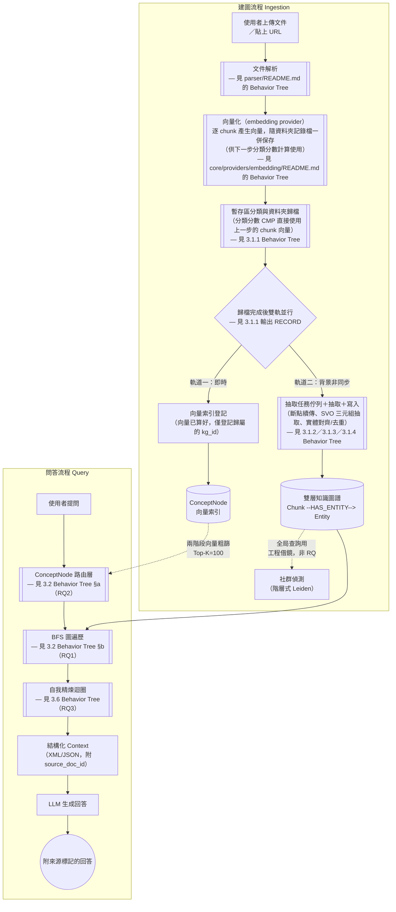
```mermaid
flowchart TD
    subgraph ING["建圖流程 Ingestion"]
        direction TB
        UP["使用者上傳文件<br/>／貼上 URL"] --> PARSE
        PARSE[["文件解析<br/>— 見 parser/README.md 的 Behavior Tree"]] --> VEC
        VEC[["向量化（embedding provider）<br/>逐 chunk 產生向量，隨資料夾記錄檔一併保存<br/>（供下一步分類分數計算使用）<br/>— 見 core/providers/embedding/README.md 的 Behavior Tree"]] --> STAGE
        STAGE[["暫存區分類與資料夾歸檔<br/>（分類分數 CMP 直接使用上一步的 chunk 向量）<br/>— 見 3.1.1 Behavior Tree"]] --> SPLIT{"歸檔完成後雙軌並行<br/>— 見 3.1.1 輸出 RECORD"}
        SPLIT -->|"軌道一：即時"| REGIDX["向量索引登記<br/>（向量已算好，僅登記歸屬的 kg_id）"]
        SPLIT -->|"軌道二：背景非同步"| QUEUE
        QUEUE[["抽取任務佇列＋抽取＋寫入<br/>（斷點續傳、SVO 三元組抽取、實體對齊/去重）<br/>— 見 3.1.2／3.1.3／3.1.4 Behavior Tree"]]
        QUEUE --> KG[("雙層知識圖譜<br/>Chunk --HAS_ENTITY--> Entity")]
        REGIDX --> CONCEPTIDX[("ConceptNode<br/>向量索引")]
        KG -.->|"全局查詢用<br/>工程借鏡，非 RQ"| COMM["社群偵測<br/>（階層式 Leiden）"]
    end

    subgraph QRY["問答流程 Query"]
        direction TB
        Q["使用者提問"] --> ROUTE
        ROUTE[["ConceptNode 路由層<br/>— 見 3.2 Behavior Tree §a（RQ2）"]] --> BFS
        BFS[["BFS 圖遍歷<br/>— 見 3.2 Behavior Tree §b（RQ1）"]] --> REFINE
        REFINE[["自我精煉迴圈<br/>— 見 3.6 Behavior Tree（RQ3）"]] --> CTX
        CTX["結構化 Context<br/>（XML/JSON，附 source_doc_id）"] --> LLM
        LLM["LLM 生成回答"] --> CITE(("附來源標記的回答"))
    end

    CONCEPTIDX -.->|"兩階段向量粗篩<br/>Top-K=100"| ROUTE
    KG --> BFS
```

> **注意**：`[[ 雙框 ]]` 節點是本章分層繪圖的核心慣例，代表「此節點內部另有一張聚焦圖，見對應小節」——與 `parser/README.md` 圖文管線 BT 的 `IMG[[ ]]` 用法完全一致，確保全文件的圖表語彙一致，讀者不需要重新學習一套新符號。
>
> **向量化的時序（2026-07-17 校正）**：向量化（`VEC`）緊接在文件解析之後、暫存區分類之前，而非分類完成後才進行——原因是 3.1.1 節分類分數計算（`CMP` 節點）需要「該文件所有 chunk 向量的平均」才能與各 KG 的 prototype 向量算 cosine 相似度，向量必須先存在，分類判斷才有東西可算，兩者不能反過來。因此解析完成的文字並非直接進入雙軌處理，而是先向量化，再經過**暫存區分類與資料夾歸檔**（3.1.1，內部直接使用已算好的 chunk 向量）決定歸屬哪個知識圖譜，歸檔後才分岔為雙軌：**軌道一（即時）**是把已算好的向量登記進該 KG 的 ConceptNode 索引（只是登記歸屬的 `kg_id`，不重新計算向量，不需要排隊等候）；**軌道二（背景非同步）**才是具斷點續傳能力的建圖管線後半段，依序涵蓋**佇列與斷點續傳**（3.1.2）、**抽取過程**（3.1.3）、**抽取後續**（3.1.4）三個步驟。`QUEUE` 雙框節點因此同時指向這三節——三者是同一條背景管線依序執行的步驟，皆為 3.1 底下純粹描述機制的小節，此處總覽圖用一個節點收攏，避免在快速瀏覽的總覽圖上重複展開細節；個別研究問題（RQ4a 受控詞彙設計原理與文獻見 3.3、RQ4b 別名消解原理與文獻見 3.4）則留給對應的 RQ 小節深入討論。這三個新增/調整的節點是本論文對 v1 既有設計（`docs/ARCHITECTURE.md`「執行環境架構」「建圖流程：雙軌非同步」決策）的具體化與圖示化，非重新設計；「向量索引登記」與「SVO 抽取佇列」這兩條軌道的分岔時機，則是本次為修正向量化時序而調整的部分。
>
> 這個時序調整也與 3.1.2 節「重新歸屬邊界案例」的既有設計一致——該節已聲明「向量化結果（ConceptNode 向量索引項）直接遷移至新 KG，不需重新向量化」，隱含向量本身是獨立於 `kg_id` 之外、先算好才被登記歸屬的物件；本次總覽圖的修正只是把這個既有隱含假設明確畫出來，並非新增設計決策。`VEC` 節點升級為 `[[ ]]` 雙框節點，其內部細節（provider 選型、正規化、文獻依據）**不放在本章正文**，而是另立 [`core/providers/embedding/README.md`](../../core/providers/embedding/README.md) 說明——向量化本身不是本論文的研究問題（🔧 通用基礎設施，直接沿用 v1），這個引用方式與 `PARSE` 節點指向 `parser/README.md` 的做法完全一致：非核心研究貢獻的工程模組，其文獻佐證與 Behavior Tree 收斂在程式碼旁的 README，論文正文只保留一個雙框引用節點，不重複展開內容。
>
> 建圖與問答兩條主線並非彼此獨立的兩個系統，而是共用同一個 Neo4j 雙層圖：建圖流程持續把新文件寫入 `KG`，問答流程隨時讀取當前狀態的 `KG` 做路由與遍歷——這也是 3.5 節「事實時序保留策略」與 3.7 節「向量引導圖剪枝」需要面對「讀寫並行一致性」的原因，本論文將此列為方法論限制（見 3.8）。
>
> 社群偵測（`COMM`）與全局查詢（Global Search）是 `docs/報告/03_核心架構藍圖.md` 痛點 2/13 指出的**工程借鏡型**改善，業界已有 RAGFlow（開源，Apache-2.0，85,733★，2026-07-23 GitHub API 查證）、Microsoft GraphRAG 官方實作可直接參考（見第二章 2.4.2），本論文不將其列為研究問題，故圖中以虛線標示、不展開細部 Behavior Tree。

### 3.1.1 暫存區分類與資料夾歸檔

每個知識圖譜（`KnowledgeGraph`）對應磁碟上一個以其名稱命名的獨立資料夾（`folder_path`）。**每份文件解析完成後，本身也是一個獨立資料夾**——內含該文件切塊後的內容，以及一份隨資料夾移動的「記錄檔」（狀態機，詳見 3.1.2）。「歸檔」在本設計裡不是抽象的資料庫關聯，而是**把這份文件的整個資料夾，實際搬移到目標 KG 的資料夾底下**（同一磁碟分割內的搬移屬原子操作，不是複製再刪除，不會有「搬到一半」的中間態）——資料本身跟著搬，離開暫存區，使用者用檔案總管打開任一 KG 資料夾，看到的就是它實際擁有的全部原始來源。

> ✅ **實作現況（2026-07-20 校正，取代先前已過時的落差說明）**：`parser/chunk_writer.py::write_chunks_as_markdown()` 已改為每份文件各自一個獨立子資料夾（`chunk-NNN-of-MMM.md`，見 § 3.1.1 開頭段落），先前草稿描述的「攤平寫入同一 `output_dir`」是 2026-07-16 實作前的舊敘述，未同步更新，已於本次校正移除。**同日再補上一個更上游的缺口**：切塊本身雖已就緒，但從「使用者上傳文件」到「切好塊、寫進暫存區、記錄檔初始化」這一段，先前完全沒有真正的端點串起來——`routers/documents.py` 原本只有 `debug-parse`／`debug-parse-url`（明確標註不寫入暫存區，僅供除錯），`classify_service`／`cluster_service` 的既有測試都是直接手動偽造好切塊資料夾繞過這一段。已新增 `services/ingestion_service.py::chunk_and_stage()`（解析後文字 → 句子感知切塊 → 寫入暫存區 → 初始化記錄檔）與對應的 `POST /documents/upload`／`POST /documents/ingest-url` 端點補齊這段銜接，使本節開頭「解析完成的文件資料夾（含切塊內容＋初始記錄檔）」這個前提狀態，現在有真正的端到端程式路徑可以到達，而不只是測試裡人工建構的假設狀態。

文件解析完成後，並非直接進入雙軌處理，而是先決定歸屬，共有四種讓文件資料夾找到「家」的路徑。**本節的分類分數計算與 AI 自動分群機制，皆以有廣泛驗證基礎的文獻/開源專案為主要參考起點，而非直接沿用 v1（智慧知識庫）的既有實作**——v1 的對應程式碼僅在查證後與驗證方法一致的部分才保留，其餘經查證不具驗證基礎或實質等價於更簡單做法的部分，予以替換（詳見下方各段說明與 `docs/報告/技術參考地圖.md` 登記）。

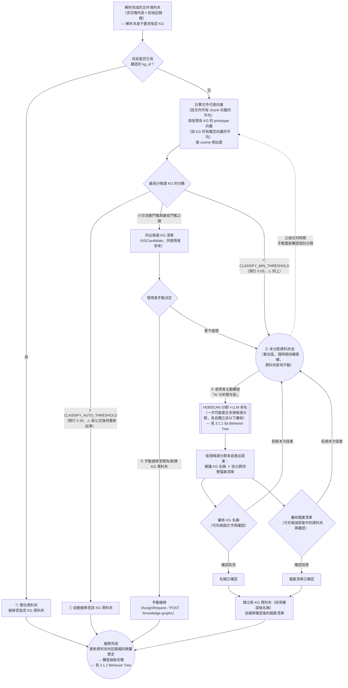
```mermaid
flowchart TD
    TEXT["解析完成的文件資料夾<br/>（含切塊內容＋初始記錄檔）<br/>— 解析本身不要求指定 KG"] --> HASKG{"目前是否已有<br/>確認的 kg_id？"}

    HASKG -->|是| FOLDER["① 整份資料夾<br/>搬移至指定 KG 資料夾"]
    HASKG -->|否| CMP["計算文件代表向量<br/>（該文件所有 chunk 向量的平均）<br/>與各既有 KG 的 prototype 向量<br/>（該 KG 所有概念向量的平均）<br/>做 cosine 相似度"]

    CMP --> SCORE2{"最高分候選 KG 的分數"}
    SCORE2 -->|"≥ CLASSIFY_AUTO_THRESHOLD<br/>（現行 0.30，⚠️ 新公式後待重新校準）"| AUTO["① 自動搬移至該 KG 資料夾"]
    SCORE2 -->|"介於自動門檻與最低門檻之間"| SUGGEST["列出候選 KG 清單<br/>（KGCandidate，供使用者參考）"]
    SCORE2 -->|"＜ CLASSIFY_MIN_THRESHOLD<br/>（現行 0.05，⚠️ 同上）"| POOL

    SUGGEST --> MANUAL{"使用者手動決定"}
    MANUAL -->|"③ 手動搬移至既有/新建 KG 資料夾"| FOLDER2["手動搬移<br/>（AssignRequest／POST /knowledge-graphs）"]
    MANUAL -->|"暫不處理"| POOL

    POOL(("② 未分配資料夾池<br/>（暫存區，隨時間持續累積，<br/>資料夾原地不動）"))
    POOL -.->|"之後任何時間<br/>手動重新觸發個別分類"| CMP

    POOL -->|"④ 使用者主動觸發<br/>「AI 分析暫存區」"| AICLUSTER
    AICLUSTER[["HDBSCAN 分群＋LLM 命名<br/>（一次可能產生多個候選分群，各自獨立走以下審核）<br/>— 見 3.1.1 §a Behavior Tree"]]
    AICLUSTER --> PROPOSAL["每個候選分群各自產出提案：<br/>建議 KG 名稱 ＋ 該分群完整檔案清單"]
    PROPOSAL --> REVIEWNAME{"審核 KG 名稱<br/>（可先微調文字再確認）"}
    PROPOSAL --> REVIEWFILES{"審核檔案清單<br/>（可先增減提案中的資料夾再確認）"}
    REVIEWNAME -->|確認採用| NAMEOK["名稱已確認"]
    REVIEWNAME -->|拒絕本次提案| POOL
    REVIEWFILES -->|確認採用| FILESOK["檔案清單已確認"]
    REVIEWFILES -->|拒絕本次提案| POOL
    NAMEOK --> NEWKG3
    FILESOK --> NEWKG3
    NEWKG3["建立新 KG 資料夾（採用確認後名稱）<br/>並搬移確認後的檔案清單"]

    FOLDER --> RECORD
    AUTO --> RECORD
    FOLDER2 --> RECORD
    NEWKG3 --> RECORD

    RECORD(("搬移完成<br/>更新資料夾內記錄檔的歸屬歷史<br/>→ 觸發抽取任務<br/>— 見 3.1.2 Behavior Tree"))
```

> **注意**：四種歸檔路徑對應開頭提出的四項功能——① 自動分配、② 都沒有適合的就留在未分配資料夾池、③ 手動分配到既有 KG、④ 使用者主動觸發 AI 分析未分配資料夾池。**無論走哪一條路徑，一旦資料夾被實際搬入某個 KG 資料夾，就立即觸發該 KG 的抽取任務**，不需要使用者另外按「開始建圖」；這是本論文對「建圖冷啟動延遲」痛點（`docs/報告/03_核心架構藍圖.md` 痛點 1）的具體回應之一。
>
> **分類分數計算（`CMP`）的參考依據**：採用 **Prototypical Networks**（Snell, Swersky, Zemel, 2017，🟢 **NeurIPS 2017**）的 centroid 相似度精神——把每個 KG 表示成其所有概念向量的平均（prototype），新文件與各 KG prototype 的 cosine 相似度即為分類分數。**不採用 v1 `concept_engine.compute_match_score()` 的兩兩配對＋align/magnitude 加權公式**：查證 v1 全 codebase 後發現，該公式的 `interest_score`／`professional_score` 兩個標量從初始化後從未被任何函式更新過（doc/KG 端恆為常數 0.5，查詢/新文件端恆為常數 0.8），代入公式後 `align`／`magnitude` 兩項對每一對概念皆為相同常數（0.7 與 0.65），整條公式在數學上等價於「0.7 × 平均 cosine 相似度」——個人化/差異化的設計意圖從未實際生效，v2 不予沿用。`CLASSIFY_AUTO_THRESHOLD`（現行 0.30）與 `CLASSIFY_MIN_THRESHOLD`（現行 0.05）兩個門檻值是針對舊公式校準的，換成 centroid cosine 相似度後數值尺度不必然相同，不能照搬舊數值——**分類機制本身（centroid cosine 相似度）有 Prototypical Networks／Sentence-BERT 文獻佐證，但這兩個具體門檻數值是資料集依賴的，任何文獻都無法直接告訴你正確切點，只能靠帶標籤驗證集實測校準**，兩者是不同層次的問題，不可混為一談。正式校準實驗設計（沿用同一份驗證集、PR 曲線式門檻掃描）見第五章 5.3.5 節；`core/constants.py` 已於校準完成前加上警告註解，避免這兩個佔位值被誤用為已驗證參數。
>
> **可信任專案背書與其邊界（查證見第二章 2.4.1.1）**：`semantic-router`（Aurelio Labs）驗證了「以 embedding 相似度做離散分類路由」是業界已實際部署的生產模式，但其機制是查詢向量對每條 route 底下每一句範例語句逐一比對的即時 kNN＋聚合，並非預先算好單一 centroid 向量——`CMP` 節點「預先計算 KG prototype」這個具體機制，仍直接依據 Snell et al.（2017）原型網路精神，semantic-router 只佐證同一大類設計模式的產業可行性，不佐證此處的具體實作選擇。
>
> **三層信心分級機制的定位（查證見第二章 2.4.1.2）**：`AUTO`／`SUGGEST`／`POOL` 三層依分數分級、`SUGGEST` 層讓使用者逐一確認候選的介面設計，查證廣泛使用的開源文件管理系統 Paperless-ngx 後發現該專案的 ML 自動分類（`MLPClassifier`）並無信心分級或建議層、直接套用單一預測結果——本論文找不到現有生產系統對此設計的直接先例，故此處應誠實定位為本論文自行提出的工程決策（以使用者可控性優先於全自動化），而非文獻/專案既有做法的複製。這與本節開頭「分類分數計算與 AI 自動分群機制以驗證文獻/專案為主要參考起點」的聲明並不矛盾——**演算法**（centroid 相似度、HDBSCAN、命名輸入篩選）借鏡自成熟文獻與專案，但**信心分級的介面設計**是本論文自行提出，兩者性質不同。
>
> **④ AI 自動分群建立新 KG 的審核機制**：AI 提案的「建議名稱」與「該分群檔案清單」是**兩項獨立審核**——`REVIEWNAME` 與 `REVIEWFILES` 各自可以先微調（改名稱文字／增減清單中的資料夾）再確認，不是綁在一起的單一整包同意/拒絕；任一項被拒絕，本次提案即取消，相關資料夾回到未分配資料夾池，不會只憑其中一項就建立新 KG。兩項都確認後，才以確認後的名稱與確認後的檔案清單建立新 KG。此機制目前**僅存在於 v1 `services/knowledge_graph_service.py` 的 docstring 註記與 v1 `cluster_service.py` 的具體實作**，v2 沒有對應的路由或實作——這是本論文的工程借鏡型待辦，非研究問題本身，若最終未實作，第四章需明確聲明降級為「僅支援①②③，不支援④」。
>
> **未分配資料夾池會隨時間持續累積**（②＋使用者「暫不處理」）：放著不管的話，暫存區只會越堆越多，需要一個機制把「彼此相似、但都跟現有 KG 對不上」的一批文件收攏成新的知識圖譜，而不是要求使用者逐一手動處理每一個檔案。詳細分群機制見下方 §a。

### 3.1.1 §a：AI 自動分群機制 Behavior Tree（HDBSCAN + LLM 命名）

未分配資料夾池達一定規模後，使用者可主動觸發分析。此機制的分群演算法與命名輸入篩選皆以已有廣泛驗證基礎的文獻為主要參考，而非直接沿用 v1 `cluster_service.py` 的簡化實作：

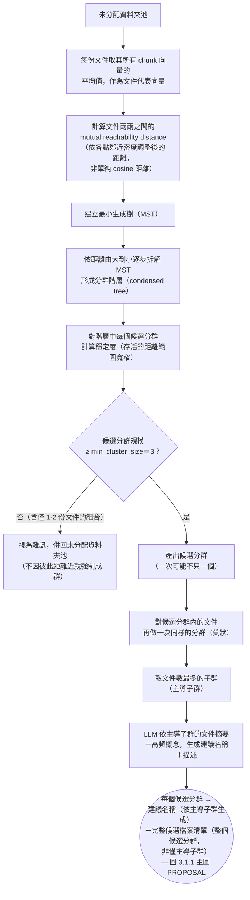
```mermaid
flowchart TD
    POOLIN["未分配資料夾池"] --> VEC2["每份文件取其所有 chunk 向量的<br/>平均值，作為文件代表向量"]
    VEC2 --> DIST["計算文件兩兩之間的<br/>mutual reachability distance<br/>（依各點鄰近密度調整後的距離，<br/>非單純 cosine 距離）"]
    DIST --> MST["建立最小生成樹（MST）"]
    MST --> HIER["依距離由大到小逐步拆解 MST<br/>形成分群階層（condensed tree）"]
    HIER --> STABLE["對階層中每個候選分群<br/>計算穩定度（存活的距離範圍寬窄）"]
    STABLE --> FILTER{"候選分群規模<br/>≥ min_cluster_size＝3？"}
    FILTER -->|"否（含僅 1-2 份文件的組合）"| NOISE["視為雜訊，併回未分配資料夾池<br/>（不因彼此距離近就強制成群）"]
    FILTER -->|是| CANDIDATE["產出候選分群<br/>（一次可能不只一個）"]

    CANDIDATE --> SUBCLUSTER["對候選分群內的文件<br/>再做一次同樣的分群（巢狀）"]
    SUBCLUSTER --> DOMINANT["取文件數最多的子群<br/>（主導子群）"]
    DOMINANT --> LLMNAME["LLM 依主導子群的文件摘要<br/>＋高頻概念，生成建議名稱＋描述"]
    LLMNAME --> OUT(("每個候選分群 →<br/>建議名稱（依主導子群生成）<br/>＋完整候選檔案清單（整個候選分群，<br/>非僅主導子群）<br/>— 回 3.1.1 主圖 PROPOSAL"))
```

> **注意**：`FILTER` 節點的 `min_cluster_size=3` 是分群過程本身的限制，不是「先分群、再事後篩掉太小的群」——距離再近的兩份文件，若湊不滿 3 份，就不會被判定為一個真正的分群，會直接被歸為雜訊、留在未分配池等待未來有更多相似文件加入。這個機制直接對應本論文對「一個 KG 至少要有 3 個檔案」這項需求的具體實作依據。
>
> **分群演算法參考依據**：採用 **HDBSCAN**（McInnes, Healy, Astels, 2017，🟢 ***Journal of Open Source Software***）——透過調整過的距離度量（`mutual reachability distance`：兩點距離取兩者各自的「核心距離」與實際距離三者中的最大值，避免孤立點成為連接兩個不相關群集的橋樑）、最小生成樹、階層拆解、穩定度篩選，找出真正緊密的候選分群。**不採用 v1 `cluster_service.py` 的門檻式連通分量分群**：該做法用單一固定相似度門檻（0.35）判斷「同群」，已知有連鎖效應缺陷——若 A-B 相似度、B-C 相似度都恰好卡在門檻邊緣，即使 A 與 C 完全不相關，仍會被遞移地分進同一群；HDBSCAN 用相對穩定度而非絕對門檻判斷分群，可避免此問題。
>
> **實作驗證發現（`services/cluster_service.py`）**：HDBSCAN 預設參數在「未分配池裡唯一存在的真實結構，剛好只有一組達 `min_cluster_size` 的緊密群、其餘皆為雜訊、沒有第二個群可供對照」的情境下，會傾向把整批全數判為雜訊，即使群內本身緊密——這在資料量不大（暫存區剛開始累積）時是常見情境。實測解法是加上 HDBSCAN 官方既有參數 `allow_single_cluster=True`（非本專案自創演算法變體），並實測確認不影響多群情境下的正常區分能力（見 `tests/services/test_cluster_service.py`）。同時 `min_samples` 需明確設為 1（而非 HDBSCAN 預設值等於 `min_cluster_size`），避免剛好達邊界的小群因核心點密度門檻過嚴而被誤判。
>
> **命名輸入篩選的參考依據**：分群完成後，命名所需的代表文件並非直接取整個候選分群的全部檔案，而是採用 **Khandelwal (2025)**《Using LLM-Based Approaches to Enhance and Automate Topic Labeling》驗證過表現最佳的 **Approach 3（主導子群法）**——對候選分群內的文件再做一次同樣的分群，取文件數最多的子群作為 LLM 命名的輸入依據，過濾掉可能混入候選分群但主題略有偏移的邊緣文件，避免稀釋生成名稱的聚焦度。**不採用 v1 `_suggest_kg_name()` 直接取 `filenames[:10]`（未經任何篩選排序）的做法**——該論文的實證比較顯示，未經篩選/以多樣性為目標的取樣方式（該論文的 Approach 4）表現持續較差。**重要區分**：主導子群篩選**只影響命名時餵給 LLM 的輸入**，不影響候選分群本身包含哪些檔案——使用者在 `REVIEWFILES` 審核時看到的仍是整個候選分群的完整檔案清單，不會被系統偷偷先篩掉邊緣文件。
>
> **參考專案（2026-07-23 補齊區分，完整查證見第二章 2.4.1.2）**：`services/cluster_service.py` 直接 `import hdbscan`，實際執行的是 HDBSCAN 論文作者本人維護的官方參考實作（[scikit-learn-contrib/hdbscan](https://github.com/scikit-learn-contrib/hdbscan)，3,132★）——這是**直接依賴**，非僅是架構層級的旁證。
>
> **架構背書（查證見第二章 2.4.1.2）**：**BERTopic**（Grootendorst, 2022，🟡 arXiv:2203.05794，尚無正式期刊/會議版本，但 GitHub 約 7.7k stars、原作者持續維護）獨立實作了與本節高度一致的「embedding → HDBSCAN 分群 → LLM/統計式命名」整條管線，其標準管線並支援 LLM-based 主題命名（見 Grootendorst〈Topic Modeling with Llama 2〉部落格文章），是比單獨引用 HDBSCAN 論文更有力的管線層級產業驗證。**需誠實標註的落差**：BERTopic 在 HDBSCAN 分群前固定接一段 UMAP 降維，理由是 mutual reachability distance 在高維空間容易受維度詛咒影響；`services/cluster_service.py` 目前直接對原始 embedding 向量做 `metric="euclidean"` 分群，未做降維前處理——此落差列入下方優化建議。
>
> **3.1.1 優化建議（2026-07-17 依程式碼實讀整理；2026-07-20 逐項處理，狀態見各條）**：以下六項為重新審視 `services/classify_service.py`／`services/cluster_service.py`／`routers/staging.py` 實際邏輯後發現的具體改進空間，非文獻查證發現，屬工程借鏡型待辦：
>
> 1. ✅ **已修正（2026-07-20）prototype／文件向量無持久化快取**：`compute_document_vector()` 改為優先讀取資料夾記錄檔快取的 `document_vector`（`DocumentRecord.document_vector`），命中則不重新呼叫 embedding provider；`compute_kg_prototype()` 新增 `_prototype_cache.json`（KG 資料夾內），成員清單與快取一致才命中，任一成員加入/移出即自動失效重算。兩者皆已由 `tests/services/test_classify_service.py`／`test_document_record_service.py` 的快取命中／失效測試覆蓋。
> 2. ✅ **已修正（2026-07-20）同批次分類的 prototype 過時**：`classify_all()` 新增 `_incremental_prototype_update()`，批次內文件被自動分配後立即以移動平均就地更新該 KG 在記憶體中的 prototype 與成員數，同批次後續文件不再拿舊 prototype 比對；`test_prototype_and_member_count_update_within_batch` 驗證批次內第二份文件看到的 `member_count` 已反映第一份文件的分配結果。
> 3. ✅ **已修正（2026-07-20）搬移與記錄檔更新無交易保護**：`assign_document_to_kg()` 的記錄檔更新若拋例外，改為把資料夾移回原位再重新拋出，確保呼叫端看到例外時資料夾必定還在呼叫前的位置，不會出現「已搬移但記錄檔未更新」的中間態；`test_rolls_back_move_when_record_update_fails` 驗證此行為（未採用「事後掃描修復」，因搬移前置回滾在此處是更簡單且立即一致的作法，不需要額外的背景掃描機制）。
> 4. ✅ **已處理（2026-07-20）HDBSCAN 未做降維前處理**：`cluster_service.py` 新增條件式 UMAP 降維（McInnes, Healy, Saul & Großberger, 2018, JOSS——與分群所用的 McInnes, Healy & Astels 2017 HDBSCAN 論文作者部分重疊但是不同文獻），僅在未分配池規模 ≥ `UMAP_MIN_POOL_SIZE=20` 才套用——**刻意不照抄「一律先 UMAP」**：UMAP 在點數過少時的流形估計本身不穩定，訂在略高於 UMAP 預設 `n_neighbors=15` 的規模才啟用，避免對本已為小樣本調校過（`allow_single_cluster=True`）的分群品質造成反效果；`random_state=42` 固定確保可重現。決策細節見 `services/cluster_service.py` 模組 docstring「降維前處理的決策」，測試見 `test_cluster_vectors_umap_gating`／`test_reduce_dimensionality` 系列。
> 5. **部分緩解（2026-07-20）新建 KG 的最小成員數門檻不對稱**：④ AI 自動分群路徑強制 `min_cluster_size=3` 才能成群，但 ③ 手動分配路徑仍可建立僅 1 份文件的新 KG——**刻意不改為強制門檻**：手動路徑存在的目的就是讓使用者能覆寫自動化判斷，若也強制最少 3 份文件，會與「手動」的自主性設計意圖矛盾，且第一份文件永遠無處可去。改為在 `classify_by_vector()` 新增 `low_confidence` 標記（`KGCandidate.member_count` / `low_confidence`，成員數 < `CLUSTER_MIN_SIZE` 時標記為 true）：不阻止建立小型 KG，但讓呼叫端（未來 UI）能區分「高分且樣本充足」與「高分但樣本太少、prototype 不穩定」，把判斷權交還給使用者而非系統代為決定。
> 6. **已標註觀測性警告（2026-07-20，非解決演算法複雜度本身）未分配資料夾池的擴展性上限**：`mean_pairwise_cosine_similarity()` 與 HDBSCAN 的距離計算皆為 O(n²)，而 3.1.1 §a 原文已承認未分配資料夾池「隨時間持續累積」。現階段**不引入近似最近鄰（如 FAISS）等額外基礎設施**——這會是比目前規模更大的架構決策；改為在池規模達 500 時記錄警告，讓維運者/未來研究者有明確訊號知道何時需要重新評估此設計。若第五章實驗語料規模觸及此門檻，需將「導入 ANN」列為第七章未來工作。決策細節見 `services/cluster_service.py` 模組 docstring「擴展性上限的決策」。
>
> 另可列為次要加分項（尚未處理）：`cluster_vectors()` 目前只用 HDBSCAN 硬標籤，未使用其官方本身提供的 soft membership 機率，可作為 `ClusterSuggestion.intra_similarity` 之外的額外信心指標。

### 3.1.2 抽取任務佇列與斷點續傳（Chunk 粒度）

> **設計定案（2026-07-20；2026-07-21 校正切塊來源；2026-07-21 再校正句子清單來源）**：建圖流程於最前端引入「指代消解與實體別名前處理」（完整機制見 3.4 §a，RQ4b；代名詞消解的正則清單/Prompt 模板/程式實作見 `docs/報告/05_指代消解與前處理任務書.md`），以「登記表比對（別名）＋前 4 後 2 雙向上下文視窗（代名詞）」對句子清單就地替換，輸出語意自足的標準化文字。**此標準化流程對 3.1.1 順手另存的句子切分結果（`sentences.json`）操作，不是每次重新對 `original.md` 呼叫 `split_into_sentences()`，更不沿用 3.1.1 為 RAG 向量檢索切好的 `chunk-NNN-of-MMM.md`**——句子切分規則若日後調整，重算會讓先前存的句子索引對不上，故一次切好存成穩定清單；RAG／SVO 切塊粒度需求不同，SVO 抽取不該沿用 RAG 切塊，完整比較過程見 `03_變更紀錄.md`；SVO 專用的切塊演算法本身尚未定案（見下方圖中 `GETSENT` 之後的銜接）。因此進入 3.1.2 任務佇列的每個 Chunk 最終仍會是**自包含的、無指代/別名歧義的標準化文字**，SVO 抽取 Worker 可直接以單一 Chunk 為單位呼叫 LLM，無須滑動視窗或多 Chunk 拼接——追蹤單位維持 `chunk_index`，`task_queue.db` schema 不變。此決定取代了原本的滑動視窗草案，完整比較過程見 [`03_變更紀錄.md`](03_變更紀錄.md)。

文件資料夾搬移至某 KG 資料夾後，立即觸發抽取任務。狀態追蹤採**雙層機制**，分工如下：

> ✅ **實作（2026-07-21 新增；2026-07-22 補上 `EMBEDCHUNK`）**：`routers/staging.py::_trigger_extraction()` 在 `assign()`／`confirm_cluster()`／`classify()`（自動分配部分）三個實際觸發文件搬移的端點之後，同步直接呼叫 `CHUNKREADY`（`prepare_svo_ready_chunks()`）→ `EMBEDCHUNK`（`svo_service.embed_svo_chunks()`，切塊當下逐塊計算向量存入 `Chunk.embedding`，`get_embedding_provider()` 尚未初始化時優雅跳過）→ `ENQUEUE`（`task_queue_service.enqueue()`），符合本段「立即觸發」的敘述，同步呼叫（而非背景排程）是 2026-07-21 使用者決策。`EMBEDCHUNK` 的設計動機與誠實侷限（`Chunk` 節點目前有兩套識別鍵）詳見 3.1.4 節「SVO chunk 向量化」註記。測試見 `tests/routers/test_staging.py`。

- **記錄檔**（資料夾內建、隨資料夾一起搬移）是**真實狀態來源**，記錄這份文件的**歸屬歷史**（何時被分配/搬移到哪個 KG）與**抽取進度**（是否完成；若未完成，停在哪個 `chunk_index`）。因為記錄檔實際存在於文件資料夾裡，資料夾不論被搬到哪個 KG，狀態都跟著走，不需要依賴外部資料庫才能得知這份文件的狀態。
- **本地 SQLite（`task_queue.db`）**是背景 Worker 用來快速排隊、挑選下一個待處理 Chunk 的**效能索引**，與記錄檔保持同步——好處是即使 `task_queue.db` 遺失或損毀，仍可透過掃描各 KG 資料夾下每份文件的記錄檔重建索引，不會真的遺失狀態；壞處是兩份狀態需要在每次轉換時同步寫入，實作時需注意寫入順序與失敗處理（例如記錄檔寫入成功但 SQLite 更新失敗時如何補救）。

本節只負責佇列的**生產者端**：文件怎麼被登記進佇列、佇列索引本身的完整性與程式重啟後的恢復。Worker 怎麼把工作領出來處理（消費者端，含「挑出下一個 pending Chunk」「狀態→processing」）見 3.1.3；抽取完成後的寫入與去重見 3.1.4——兩節的失敗/重試最終都回到本節登記的佇列，但佇列本身的生產/恢復機制與消費者端的取件邏輯是兩件事，不放在同一節。狀態機的五個狀態定義仍由本節統一負責，即使實際轉換發生在 3.1.3／3.1.4。

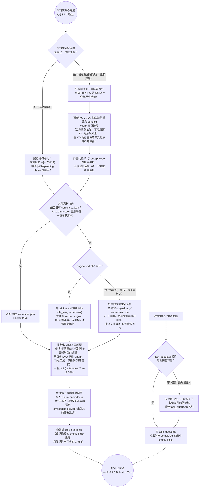
```mermaid
flowchart TD
    RECORD2(("資料夾搬移完成<br/>（見 3.1.1 輸出）")) --> HASRECORD{"資料夾內記錄檔<br/>是否已有抽取進度？"}
    HASRECORD -->|"否（首次歸檔）"| INITREC["記錄檔初始化：<br/>歸屬歷史＝[本次歸檔]<br/>抽取狀態＝pending<br/>chunk 進度＝0"]
    HASRECORD -->|"是（曾被歸屬/搬移過，重新歸屬）"| APPENDREC["記錄檔追加一筆歸屬歷史<br/>（保留前次 KG 的抽取進度作為歷史紀錄）"]
    APPENDREC --> RESETEXTRACT["對新 KG：SVO 抽取狀態重設為 pending<br/>chunk 進度歸零<br/>（完整重跑抽取，不沿用舊 KG 的抽取結果；<br/>舊 KG 內已合併的三元組原封不動保留）"]
    RESETEXTRACT --> MIGRATEVEC["向量化結果（ConceptNode 向量索引項）<br/>直接遷移至新 KG，不需重新向量化"]

    INITREC --> GETSENT
    MIGRATEVEC --> GETSENT

    GETSENT{"文件資料夾內<br/>是否已有 sentences.json？<br/>（3.1.1 ingestion 已順手存一份句子清單）"}
    GETSENT -->|是| READSENT["直接讀取 sentences.json<br/>（不重新切分）"]
    GETSENT -->|否| CHECKORIG{"original.md 是否存在？"}
    CHECKORIG -->|是| RESPLIT["對 original.md 重新呼叫<br/>split_into_sentences()<br/>並補寫 sentences.json<br/>（純規則運算，成本低，不需重新解析）"]
    CHECKORIG -->|"否（舊資料／尚未升級的資料夾）"| REPARSE["對原始來源重新解析<br/>並補寫 original.md／sentences.json<br/>⚠️ 上傳檔案來源的暫存檔已刪除，<br/>此分支僅 URL 來源實際可行"]
    READSENT --> CHUNKREADY
    RESPLIT --> CHUNKREADY
    REPARSE --> CHUNKREADY

    CHUNKREADY[["標準化 Chunk 已就緒<br/>（對句子清單做指代消解＋實體別名前處理，<br/>再切成 SVO 專用 Chunk，語意自足、無指代/別名歧義）<br/>— 見 3.4 §a Behavior Tree（RQ4b）"]] --> EMBEDCHUNK["切塊當下逐塊計算向量<br/>存入 Chunk.embedding<br/>（供未來回答階段的來源篩選用，<br/>embedding provider 未就緒時優雅跳過）"]
    EMBEDCHUNK --> ENQUEUE["登記進 task_queue.db<br/>（依記錄檔的 chunk_index 進度，<br/>只登記尚未完成的 Chunk）"]
    ENQUEUE --> READY(("佇列已就緒<br/>— 見 3.1.3 Behavior Tree"))

    RESTART["程式重啟／電腦開機"] -.-> TRUST{"task_queue.db 索引<br/>是否完整可信？"}
    TRUST -->|是| SCAN["查 task_queue.db<br/>找出尚未 completed 的最小 chunk_index"]
    TRUST -->|"否（索引遺失/損毀）"| REBUILD["改為掃描各 KG 資料夾下<br/>每份文件的記錄檔<br/>重建 task_queue.db 索引"]
    REBUILD --> SCAN
    SCAN -.-> READY
```

> **`GETSENT` 三層判斷的理由（2026-07-21 新增，2026-07-21 再校正為句子清單優先；2026-07-21 補上實作）**：`sentences.json`／`original.md` 皆由 3.1.1 的 `chunk_and_stage()` 順手寫入（見 `parser.chunk_writer.write_sentences_index()`／`write_original_text()`），正常情況下兩者一定存在，`GETSENT`／`CHECKORIG` 主要是防禦性檢查（例如舊資料夾是這兩項功能上線前歸檔的）。三層優先序刻意設計：① `sentences.json` 存在就直接讀，最快；② 只有 `original.md` 沒有 `sentences.json` 時，重新呼叫 `split_into_sentences()` 補回來——這是純規則運算，不需要 LLM 或重新解析文件，成本很低；③ 兩者都不存在才需要對原始來源重新解析。**`REPARSE` 分支誠實聲明其侷限**：`routers/documents.py::upload_document()` 在解析完成後會於 `finally` 區塊刪除暫存上傳檔案（`os.remove(temp_path)`），檔案上傳來源的原始位元組已不存在，理論上的「重新解析」在這類來源上其實無法真正執行，只有 URL 來源（`ingest_url`，`source` 本身就是可重新請求的網址）才能靠重新抓取復原；檔案上傳來源若真的走到這個分支，代表資料已經無法復原，屬於需要人工介入的異常狀態，非正常運作路徑。**✅ 實作**：`parser/chunk_writer.py::read_sentences_index()`／`read_original_text()`（讀取端，對應既有寫入端）＋ `services/ingestion_service.py::get_or_rebuild_sentences()`（三層判斷主體，含 URL 來源重新抓取）；測試見 `tests/test_chunk_writer.py`／`tests/services/test_ingestion_service.py::TestGetOrRebuildSentences`。
>
> **注意**：狀態機共五態——`pending`（待處理）／`processing`（處理中）／`completed`（已完成）／`failed`（失敗，可重試）／`pending_upload`（本地抽取已完成，但尚未成功送達知識圖譜）。`pending_upload` 是刻意設計的中間態：本地抽取（CPU/GPU 算力）與寫入知識圖譜是兩個可能各自失敗的步驟，若只有 `completed`／`failed` 兩態，寫入失敗就必須重新做一次本地抽取，浪費已完成的算力；有了 `pending_upload`，重試只需要重送結果，不必重跑 LLM 抽取。三態轉換的實際時機：`processing` 由 3.1.3 的 `WORKER`／`PROC` 節點設定（Worker 領到 Chunk 的當下）；`pending_upload`／`failed` 由 3.1.3 的抽取結果決定；`completed` 由 3.1.4 的寫入結果決定——本節（3.1.2）只負責定義這五個狀態的意義與登記進佇列時的初始狀態（`pending`），不觸發中間的狀態轉換。
>
> **中斷處理**：若程式在某 Chunk 標記為 `processing` 但尚未轉為其他終態時被中止（當機、強制關閉），重啟掃描時必須將這類「卡在 processing」的 Chunk 視為未完成、可重新處理，而非誤判為進行中而跳過——這是斷點續傳正確性的關鍵細節，第四章實作時建議啟動時先將所有 `processing` 狀態批次重置為 `pending`。
>
> ✅ **`ENQUEUE`／`RESTART`／`TRUST`／`SCAN`／`REBUILD` 實作（2026-07-21）**：`services/task_queue_service.py`——`enqueue()`（登記尚未完成的 Chunk，`INSERT OR IGNORE` 避免覆蓋已在處理中的狀態）、`update_status()`（五態轉換寫入）、`next_pending()`（依 `chunk_index` 挑下一個待處理項目，支援單一 KG 或跨 KG 查詢）、`is_index_trustworthy()`（`TRUST`，索引可查詢即視為可信）、`reset_stuck_processing()`（中斷處理，批次重置卡住的 `processing`）、`rebuild_from_records()`（`REBUILD`，索引損毀時掃描各 KG 資料夾記錄檔重建）、`ensure_ready()`（`RESTART` 入口，串連 `TRUST`→重置或重建）。測試見 `tests/services/test_task_queue_service.py`（16 項）。**跨 KG 排程政策未定案**：`next_pending()` 目前僅以 `chunk_index` 排序，不同 KG 間的公平排程規則本節未規定（該問題屬已取代的滑動視窗草案討論範疇，見 `03_變更紀錄.md`），留待第四章依實際 Worker 架構決定，非本模組需要解決的問題。
>
> **重新歸屬的邊界案例（已定案）**：若一份文件曾被分配到 KG-A、部分或全部 Chunk 已合併進 KG-A 的知識圖譜，之後又被重新分配到 KG-B——兩條軌道的可遷移性不同：
>
> - **軌道二（SVO／圖譜）不遷移**：已合併進 KG-A 的三元組可能已與其他文件貢獻的既有實體糾纏在一起，無法乾淨切割；本論文選擇對 KG-B 完整重新抽取這份文件，KG-A 內已合併的三元組原封不動保留——刻意接受的取捨，避免處理實體融合切割這個更困難的問題。
> - **軌道一（向量化／ConceptNode）直接遷移**：向量獨立自包含，不需重新向量化。
>
> ⚠️ **`MIGRATEVEC` 誠實侷限（2026-07-21 查核）**：本節「直接遷移」是既有設計決策，但目前**完全沒有對應程式碼**——不只是遷移邏輯本身缺席，`repositories/concept_repo.py` 現況只有 `create_vector_index()`（建立索引 schema）與 `vector_search_concept_ids()`（KNN 查詢），**連寫入/建立 ConceptNode 本身的方法都還不存在**。這不是 3.1.2 範圍內的缺口，而是結構性依賴 3.2 §a（RQ2，ConceptNode 路由層）尚未動工——`services/classify_service.py` 的模組說明已自承「刻意不依賴 ConceptNode 路由層...屬 3.2 節 RQ2 範圍，尚未實作」。`MIGRATEVEC` 要有意義，必須等 3.2 §a 先把 ConceptNode 的建立/查詢機制做出來，本次 3.1.2/3.4 收尾不將其納入範圍，誠實記錄於此，避免之後誤以為這是被遺漏的 3.1.2 待辦。
>
> 記錄檔的歸屬歷史忠實記下這份文件曾經歷過哪些 KG 分配，但每次重新歸屬時抽取進度只針對「當前所屬的 KG」重新起算，不跨 KG 累加。
>
> 此三層追蹤（KG 資料夾 → 文件資料夾 → Chunk）皆為本地端狀態，與 `docs/ARCHITECTURE.md`「本地抽取＋雲端閘道」決策一致，只有 `pending_upload → completed` 這個轉換需要一次網路呼叫。

> 設計過程中曾評估「切塊粒度整合——向量索引 vs. SVO 抽取視窗（滑動視窗）」方案，最終選擇上方「設計定案」所述的指代消解前置法（見 3.4 §a，RQ4b）。完整比較過程（含 GraphRAG／LightRAG／Text2KGBench／CORE-KG 文獻查證）見 [`03_變更紀錄.md`](03_變更紀錄.md) 「二、已評估但未採用的設計方案」。

### 3.1.3 抽取過程

延續 3.1.2：本節是佇列的**消費者端**——佇列就緒後（含正常新增與程式重啟後的恢復兩種來源），由 Worker 依序把工作領出來處理，才真正開始抽取。**為什麼選擇受控詞彙而非開放抽取、其學理依據與文獻佐證，見 3.3（RQ4a）**——本節只呈現「機制怎麼跑」，不重複該節的研究問題與 trade-off 論證。

> **設計定案（2026-07-24，取代下方舊版 `MATCH`／`STRUCT`／`SEMANTIC` 三段式）**：與使用者逐階段討論後，本節的實體型別與關係型別設計皆有調整，完整討論脈絡與文獻查證見第二章 2.4.4：
>
> 1. **實體型別（`subject_type`／`object_type`）選填、允許多值、不做強制驗證**——LLM 抽取時自由產生型別字串，找不到合適型別可以留空，同一實體也可以同時歸屬多個型別；型別純粹是**記錄用途**（供未來整理/瀏覽方便），不參與本節任何判斷邏輯。型別的實際儲存方式（獨立 Type 節點＋「屬於」邊，而非 Entity 節點屬性）與連帶的去重篩選調整，屬於 3.1.4 節範疇，見該節說明。
> 2. **關係型別收斂為扁平單一層，不再是「關係類型（上位分類）→關係（具體值）」兩層架構**——原本設想比照 ACE 2005（6 粗類→18 細類）建立上位分類，但查證發現 ACE 的粗類名稱（人物/組織/地點關係）與本論文因果/功能/比較領域不合，改採 **ConceptNet 5.5**（Speer et al., 2017，🟢 AAAI 2017）的核心關係直接作為關係型別本身。⚠️ **2026-07-26 逐字查證更正**：論文正文自稱「36 個核心關係」，但逐字核對其明確列出的清單實際只有 **35 個**（7 對稱＋28 非對稱）——此為原始論文自身的數字不一致，完整清單見 `docs/參考文獻/03_資訊抽取與本體設計/README.md`。`core/constants.py` 的 `SVO_REL_TYPES` 已於 2026-07-26（第二十一次調整）落地為此 ConceptNet 35 類，取代原本自行擬定的 30 類。⚠️ **2026-07-27 再訂正為 33 類**：查證 ConceptNet 官方 GitHub wiki（即時查詢版本，非 2017 年論文快照）發現 `ENTAILS`／`INSTANCE_OF` 已被 ConceptNet 專案自己列為「已棄用」，官方建議前者併入 `MANNER_OF`／`HAS_PREREQUISITE`、後者併入 `IS_A`——本論文選擇跟進官方現行建議移除這 2 類，`SVO_REL_TYPES` 現為 33 類，完整查證與範例句來源見 `docs/參考文獻/03_資訊抽取與本體設計/README.md`。
> 3. **動詞原文（`verb` 欄位）與關係型別分開記錄，兩者皆保留**——比照實體的「名稱（自由文字）＋型別（受控）」設計精神：LLM 抽出的動詞原文一律保留於 `verb` 欄位（現行程式碼已如此），額外指派一個 33 選 1 的關係型別；查詢時無論用 canonical 型別名稱查，或用同型別底下的另一種動詞措辭查，都應該要能命中——查詢端「動詞→型別」的比對機制設計見 3.2 §c。
> 4. **`STRUCT`（結構驗證：是否符合受控詞彙的屬性模板格式）已被取代、不再適用**——這個節點原本設想的 domain/range 型別限制，前提是型別要能拿來做強制驗證；既然第 1 點已定案型別不做強制驗證，`STRUCT` 這個判斷本身就沒有意義，直接移除，不是尚未實作，而是設計本身已變更。

```mermaid
flowchart TD
    READY2(("佇列已就緒<br/>（見 3.1.2 輸出，含正常新增與斷點恢復兩種來源）")) --> WORKER["背景 Worker 依 chunk_index 順序<br/>取出下一個 pending Chunk"]
    WORKER --> PROC["記錄檔＋task_queue.db 同步更新：狀態→processing"]
    PROC --> LLM_SVO["LLM 抽取 S-V-O<br/>（該 Chunk 已在 3.1.2 CHUNKREADY 完成標準化與 SVO 專用切塊，<br/>此處直接對其內容呼叫 LLM，同一次呼叫直接輸出 rel_type<br/>（33 選 1，現行程式碼已如此）；動詞原文保留於 verb 欄位；<br/>主客實體型別選填、可多值，不做驗證，見 3.1.4）"]
    LLM_SVO --> SIM{"verb embedding 與 33 個<br/>canonical 關係型別 embedding<br/>算 cosine 相似度，取最相似者"}
    SIM --> COMPARE{"embedding 最相似的型別<br/>是否與 LLM 自報的 rel_type 一致，<br/>且最高分 ≥ COMPARE_COSINE_THRESHOLD＝0.75（暫定，未驗證）？"}
    COMPARE -->|一致| ASSIGN["採用 LLM 自報的 rel_type<br/>（兩個獨立訊號互相驗證，直接放行）"]
    COMPARE -->|"不一致（或 embedding 對所有型別\n都不夠相似，見下方灰色地帶）"| ESCALATE3["LLM 仲裁（第二次呼叫）：<br/>「此動詞究竟屬於原答案、embedding<br/>建議的候選，還是兩者皆非？」<br/>（比照 3.4 §b ESCALATE 模式）"]
    ESCALATE3 -->|確認其中一個候選| ASSIGN
    ESCALATE3 -->|"兩者皆非（判定為真正新類別）"| EXPAND["提案新增關係型別<br/>（進入候選池，<br/>見 3.1.3 §a 治理機制）"]
    EXPAND -->|審核不通過| REJECT["退回 RELATED_TO 兜底<br/>（三元組本身保留，僅關係型別降級）"]
    EXPAND -->|審核通過| ASSIGN
    ASSIGN --> TRIPLE["SVOTriple<br/>（含 rel_type／verb／confidence／source_doc_id）"]
    REJECT --> TRIPLE
    TRIPLE --> HANDOFF3(("抽取完成<br/>— 見 3.1.4 Behavior Tree"))
```

> **設計定案（2026-07-26，取代上一版「SIM 獨立分類、取代 LLM 自報」的草案）**：與使用者討論「embedding 該不該取代 LLM 自報」這個架構模糊點後，確認採用**選項 2——兩者並存，用「不一致」觸發仲裁**，取代原本設想的「embedding 優先、信心不足才問 LLM」（選項 1）。理由：
>
> 1. **保留現行已測試的程式碼**：`_svo_prompt()` 現行做法（LLM 一次呼叫同時輸出 rel_type）不變，`SIM` 不再是取代 LLM 自報的獨立分類器，改為**事後驗證**——額外算一次 verb embedding 與 33 個 canonical 型別的 cosine 相似度，用來檢查 LLM 自報的答案是否與 embedding 的獨立判斷一致。
> 2. **EXPAND 的觸發條件從「LLM 自己覺得不像」變成可量化的「兩個獨立訊號不一致」**——`COMPARE` 節點的判斷本身即為觸發 `ESCALATE3`／`EXPAND` 的具體判準，不必依賴 LLM 對自身答案的主觀信心陳述。
> 3. **降低子問題 A（見下方誠實聲明）的落地風險**：選項 1 若要成立，前提是 embedding 的自身信心可以拿來決定「要不要問 LLM」，一旦 LLM 對 33 個型別的仲裁準確度不均勻（見下方），這個前提就不成立；選項 2 不靠 embedding 信心決定是否呼叫 LLM（LLM 反正已經呼叫過一次），只是多一層事後檢查，即使子問題 A 的假設不成立，代價頂多是「該仲裁而漏了仲裁」，不會讓整套機制的正確性建立在未驗證的統計假設上。
>
> ⚠️ **誠實聲明（子問題 A，2026-07-26 使用者確認為現階段無法回答的開放問題）**：本節「LLM 自報 rel_type」這個機制本身的品質，目前**無法肯定其可靠性，也沒有機制能真正把關**——LLM 對 33 個 ConceptNet 型別的仲裁準確度是否均勻，尚未驗證；`COMPARE` 節點只能抓到「LLM 自報與 embedding 判斷不一致」的情況，若兩者**恰好都判斷錯誤**（例如 LLM 誤判、且該動詞的 embedding 也剛好落在同一個錯誤型別附近），這套機制無法偵測。這不是本次設計要解決的問題，而是本論文誠實記錄的一項現階段侷限：受控詞彙型別指派的正確性，目前僅靠 LLM 本身的抽取品質與上述雙訊號交叉驗證，缺乏獨立於兩者之外的第三方判準，第五章若要評估 RQ4a 的成效，此侷限應誠實揭露為評估時的已知變因。
>
> **未來方向：SIM 的學習/校正機制與畢業路徑（2026-07-26 使用者提出，設計方向記錄，尚未實作）**：使用者提出後續會導入學習機制，持續用 `ESCALATE3` 的仲裁結果（LLM 最終判定 vs. embedding 原始判斷）校正 `SIM` 的準確度與穩定度，長期目標是讓 `SIM` 累積到足夠可信賴的程度後，多數情況可以不必再呼叫 LLM 仲裁。這個「累積歷史仲裁紀錄→持續校正→達到穩定門檻後畢業，減少/停止仰賴 LLM」的整體方向，與 3.1.3 §a `EXPAND` 治理機制「追蹤人機一致率、達門檻後畢業為自動核准」是**同一類機制**，可沿用同一套理論依據——**Bloodgood & Vijay-Shanker（2009，🟢 CoNLL 2009）**與 **Bloodgood & Grothendieck（2013，🟢 CoNLL 2013）**已於 3.1.3 §a 查證的 Kappa 一致率穩定度停止準則（連續 k 輪穩定即可減少人工/昂貴模型介入），理論上同樣適用於「`SIM` 與 `ESCALATE3` 仲裁結果的一致率穩定後，逐步減少呼叫 LLM 的頻率」這個情境，不需另外查證新文獻，但具體機制（校正演算法、畢業門檻、如何避免子問題 A 的偏誤被固化——見上方誠實聲明）**仍是本論文自行設計，非改寫自任何既有論文**，留待第四章實作、第五章消融實驗校準，目前僅記錄方向。
>
> **文獻依據**：Yih et al.（2015，🟢 ACL-IJCNLP 2015，STAGG）核心文獻——原文以神經網路將問題與 predicate 序列投影至同一向量空間、以相似度比對，與本節「動詞 embedding vs. canonical 型別 embedding 算 cosine」機制精神一致；Sakor et al.（2020，🟢 CIKM '20，Falcon 2.0）與 Mihindukulasooriya et al.（2020，🟢 ISWC 2020，SLING）佐證「關係連結（Relation Linking）」是 KBQA 領域被廣泛研究的既定任務；**confidence-based cascade deferral** 核心文獻 **Jitkrittum et al.（2023，🟢 NeurIPS 2023，Google Research）**與 **Madras, Pitassi & Zemel（2018，🟢 NeurIPS 2018）**——`COMPARE`／`ESCALATE3` 這套「兩訊號不一致才升級仲裁」的機制屬於這個成熟研究方向的變體（差異：本節不靠 embedding 信心決定是否呼叫 LLM，是事後驗證而非事前篩選，故子問題 A 的失效條件對本節影響較小，詳見上方設計定案第 3 點）。完整查證見第二章 2.4.4 與 `docs/參考文獻/03_資訊抽取與本體設計/README.md`。**參考專案查證（2026-07-23，沿用既有結論）**：舊版 `STRUCT`／`SEMANTIC` 循序審核閘門查無任何開源專案實作過完全對應的流程。**抽取分工佐證**：`LLM_SVO` 與 `SIM`／`ESCALATE3`／`EXPAND` 分屬不同節點、原始抽取與型別收斂比對分階段處理，AutoRE（Xue et al., 2024, ACL 2024，RHF 三階段拆解，全文精讀確認資料量失衡數字無誤）佐證「拆開處理避免子任務互相干擾」的大方向；KGGen（Mo et al., 2025, NeurIPS 2025）§4.3「Entity and Edge Resolution」的「分群→LLM 判斷→LLM 命名」流程與 `EXPAND` 流程結構對應（詳見 2.4.4 誠實訂正說明）。`EXPAND`（動態擴充關係型別庫）**保留**（不因治理成本而移除），完整治理機制見 3.1.3 §a，`EXPAND` 牽動 runtime 併發寫入/持久化等架構問題仍待第四章實作時處理。`ESCALATE3` 的灰色地帶門檻與 `COMPARE` 一致性判準的具體實作細節，屬工程參數，留待第四章實作與第五章消融實驗校準。**⚠️ `COMPARE_COSINE_THRESHOLD` 數字來源誠實聲明（2026-07-26 查證）**：使用者要求先查文獻佐證再訂定 `COMPARE`／`POOLSIZE` 的具體數字。逐字精讀 **Vashishth, Jain & Talukdar（2018，🟢 WWW 2018，CESI）**全文後發現：CESI §6 明確記錄其分群門檻「chosen based on held out validation dataset」——**沒有查到可直接套用的具體數字，但確認了學界對這類門檻的方法論共識：必須用驗證集校準，不能靠理論或套用他人任務的數字決定**；CESI 的對照基線 AMIE 使用固定門檻（support=2/confidence=0.2）反而在 22K 關係短語上只歸納出 51 個群集，召回率遠不及 CESI 的校準式做法（Table 3），佐證「套用其他任務的固定門檻」風險真實存在。上圖 `COMPARE_COSINE_THRESHOLD＝0.75` 為**類比 3.4 §b 既有的 `ENTITY_DEDUP_ESCALATE_LOW_THRESHOLD＝0.75` 借用的暫定值**，並非從 CESI 或任何文獻直接推導，選擇理由僅是「與本論文既有的其他 cosine 門檻同一數量級」，明確標註未驗證，第五章消融實驗需依本論文自己的動詞 embedding 資料重新校準，不可直接沿用。完整查證見第二章 2.4.4 與 `docs/參考文獻/03_資訊抽取與本體設計/README.md`。
>
> ✅ **`REJECT` 落差已修補（2026-07-23）**：本圖 `REJECT` 節點描述的是「拒絕，退回 `RELATED_TO` 兜底」——三元組本身應保留，只是關係型別降級。程式碼原本對不合法 `rel_type` 直接 `continue` 跳過整個 dict，導致整條事實（含 subject／verb／object）靜默消失，比文件描述的行為更嚴重，屬未定案兜底落空的 bug。已修正 `services/svo_service.py::extract_svo_triples()`：不合法 `rel_type` 一律改寫為 `RELATED_TO` 後照樣建立 `SVOTriple`，原始語意保留在 `verb` 欄位。測試見 `tests/services/test_svo_service.py::test_extract_svo_triples_parses_valid_json_and_downgrades_invalid_rel_type`。**2026-07-24 補充說明**：此修補是在舊版「精確比對固定集合」機制下做的局部修正，`REJECT` 節點本身在新版 `SIM`／`ESCALATE3`／`EXPAND` 機制裡的觸發條件（審核不通過）需要等待上述新機制實作後才會真正對應，現行程式碼的 `REJECT` 行為與新設計的觸發時機暫時不同步，此落差已誠實記錄，非遺漏。
>
> ✅ **`SIM`／`COMPARE`／`ESCALATE3` 已實作（2026-07-27）**：`services/svo_service.py` 新增 `classify_relation_by_embedding()`（`SIM`：verb embedding 與 `core/constants.py::SVO_REL_TYPE_DESCRIPTIONS`——33 個型別的描述句而非識別碼字串，見上方 ZS-BERT 查證——算 cosine，取最相似者）與 `_reconcile_rel_type()`（`COMPARE`＋`ESCALATE3`：一致且分數 ≥ `COMPARE_COSINE_THRESHOLD` 則直接採信 LLM 自報值；否則第二次 LLM 呼叫仲裁，確認候選其一則採用該候選）。`extract_svo_triples()` 新增選填參數 `embedding_provider`：未提供時行為與先前版本完全一致（僅 `LLM_SVO`＋`REJECT`），提供時才會執行本節新機制，向後相容。⚠️ **已知限制（暫時性，非疏漏）**：`ESCALATE3` 判定「兩者皆非」時，因 3.1.3 §a `EXPAND` 候選池／治理機制尚未實作，暫時直接退回 `RELATED_TO` 兜底（比照現行 `REJECT` 邏輯），三元組本身仍保留；待 `EXPAND` 落地後，此分支應改為先進候選池、審核通過才新增型別。測試見 `tests/services/test_svo_service.py`「SIM／COMPARE／ESCALATE3」區塊（7 項新測試，含一致放行、不一致仲裁採信兩種候選、以及未提供 `embedding_provider` 時向後相容的情境）。子問題 A（LLM 對 33 型別仲裁準確度是否均勻）與 `COMPARE_COSINE_THRESHOLD＝0.75` 未經校準的限制依然成立，實作本身不解決這兩項已知限制。

### 3.1.3 §a：EXPAND 治理機制 Behavior Tree（關係型別動態擴充審核，2026-07-26 定案）

> **決策脈絡**：與使用者逐輪討論後確認——`EXPAND` 保留（不因「難以治理」而移除動態擴充能力），但擴充必須嚴格把關，不可依單一動詞的單次出現就隨意新增型別。以下記錄本次討論收斂的完整治理設計，取代 3.1.3 主圖與其注意事項中原先「評分模型 B，僅有機制概念」的暫定說法。
>
> 1. **候選判準：分群＋LLM 語意判斷，取代原先設想的頻率計數門檻**——原本可能的做法是「同一動詞出現滿 N 次才提案新型別」，但這是又一個難以校準的 magic number，且無法處理「多個措辭不同但語意相同的動詞各自出現次數都不足」的情況。改採：同一 KG 內所有觸發 `EXPAND` 的候選動詞先累積進候選池，達一定規模後對候選池的動詞 embedding 做 **HDBSCAN 分群**（沿用 3.1.1 §a 已用於暫存區分類的同一套機制與既有 McInnes et al. 2017 引用，不是新工具），再由 **LLM 判斷該群集是否構成一個內部一致、可類推的新關係類型**（而非湊巧語意相關但實際上該分開的雜訊），若是則由 LLM 一併提出候選 canonical 名稱。
> 2. **寫入範圍：預設只在該 KG 內生效，但需跨 KG 一致性檢查**——關係型別的擴充不是全域的，是該 KG 局部的，因此候選型別核准後預設只寫入該 KG 自己的擴充庫、成為該 KG 專屬的第 37、38...類。但這帶出新問題：若 KG-A 已核准「導致性惡化」為新型別，KG-B 之後也獨立提出語意幾乎相同的候選，若各自命名（例如 KG-B 取名「加劇因果」），會讓「同一概念在不同 KG 有不同名稱」，使未來若這些 KG 需要合併比對或共用同一組型別 embedding 時出現分裂。**因此新增一個輕量的跨 KG 關係型別登記表**（獨立於任何單一 KG 的 Neo4j 資料庫，架構上類比現行 `task_queue.db` 這種「橫跨多個 KG 的共用基礎設施」慣例，而非另開一個 KG 專屬資料庫）：核准新型別寫入該 KG 擴充庫的同時，也查詢/寫入這份登記表；下次任何 KG 觸發 `EXPAND` 時，LLM 判斷「是否為新類別」的同一步驟，順帶查詢登記表是否已有語意相近的已核准型別可沿用命名，而非各 KG 各自命名。這是本系統第一個處理「跨 KG 一致性」的機制——現行 DEDUP／MERGE 等既有去重機制都只在單一 KG 內運作，本設計是新增的跨界基礎設施，非既有機制的延伸。
> 3. **人工確認的畢業機制：追蹤人機一致率，而非固定次數或固定時間門檻**——目標是在達成足夠可信任度後，完全移除人工確認，但不用武斷的「跑滿 N 次就自動化」規則。設計為：每次候選型別走完 LLM 判斷流程後，仍先交人工確認（核准／駁回），並記錄「LLM 判斷結果」與「人工最終決定」是否一致；持續追蹤一個滾動窗口內的一致率，當一致率穩定超過門檻（具體數值留待第五章消融實驗校準，比照 `ESCALATE` 灰色地帶門檻的既有慣例），才將該類判斷「畢業」為自動核准，不再逐筆要求人工介入。**畢業後仍保留安全網**：定期抽樣事後複查已自動核准的型別，而非畢業後完全移除監督——理由是關係型別一旦寫入知識圖譜並被下游查詢依賴，回頭修改/合併型別的代價遠高於一開始就核准錯誤（不可逆性風險），且候選來源文件的語言分布/主題若隨時間飄移（distribution shift），過去校準出的一致率門檻不必然持續有效，事後抽查是低成本的保險機制。
> 4. **完整流程**：見下方 Behavior Tree。

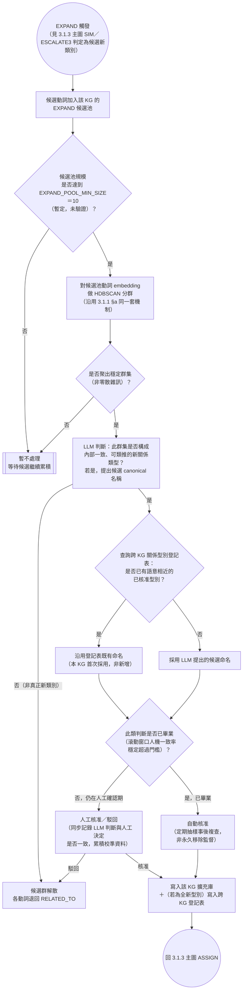
```mermaid
flowchart TD
    EXPANDIN(("EXPAND 觸發<br/>（見 3.1.3 主圖 SIM／ESCALATE3 判定為候選新類別）")) --> POOL["候選動詞加入該 KG 的<br/>EXPAND 候選池"]
    POOL --> POOLSIZE{"候選池規模<br/>是否達到 EXPAND_POOL_MIN_SIZE＝10<br/>（暫定，未驗證）？"}
    POOLSIZE -->|否| WAIT[["暫不處理<br/>等待候選繼續累積"]]
    POOLSIZE -->|是| CLUSTER["對候選池動詞 embedding<br/>做 HDBSCAN 分群<br/>（沿用 3.1.1 §a 同一套機制）"]
    CLUSTER --> HASCLUSTER{"是否聚出穩定群集<br/>（非零散雜訊）？"}
    HASCLUSTER -->|否| WAIT
    HASCLUSTER -->|是| LLMJUDGE["LLM 判斷：此群集是否構成<br/>內部一致、可類推的新關係類型？<br/>若是，提出候選 canonical 名稱"]
    LLMJUDGE -->|"否（非真正新類別）"| DISCARD["候選群解散<br/>各動詞退回 RELATED_TO"]
    LLMJUDGE -->|是| REGCHECK{"查詢跨 KG 關係型別登記表：<br/>是否已有語意相近的<br/>已核准型別？"}
    REGCHECK -->|是| REUSE["沿用登記表既有命名<br/>（本 KG 首次採用，非新增）"]
    REGCHECK -->|否| NEWTYPE["採用 LLM 提出的候選命名"]
    REUSE --> GATE{"此類判斷是否已畢業<br/>（滾動窗口人機一致率<br/>穩定超過門檻）？"}
    NEWTYPE --> GATE
    GATE -->|否，仍在人工確認期| HUMANCHECK["人工核准／駁回<br/>（同步記錄 LLM 判斷與人工決定<br/>是否一致，累積校準資料）"]
    GATE -->|是，已畢業| AUTOAPPROVE["自動核准<br/>（定期抽樣事後複查，<br/>非永久移除監督）"]
    HUMANCHECK -->|核准| COMMIT
    HUMANCHECK -->|駁回| DISCARD
    AUTOAPPROVE --> COMMIT["寫入該 KG 擴充庫<br/>＋（若為全新型別）寫入跨 KG 登記表"]
    COMMIT --> BACKMAIN(("回 3.1.3 主圖 ASSIGN"))
```

> **注意**：本節（3.1.3 §a）目前為**設計提案，尚未實作**——`svo_service.py` 現況完全沒有 `EXPAND` 相關邏輯（見 3.1.3 主圖上方注意事項）。以下項目為本次設計新引入、留待第四章實作時具體落實：候選池的儲存位置與規模門檻（工程參數）、跨 KG 關係型別登記表的實際資料結構與存放位置（獨立 SQLite，比照 `task_queue.db` 慣例，或併入現有基礎設施，待決）、滾動窗口與一致率門檻的具體數值。**文獻依據**：分群步驟沿用 3.1.1 §a 已引用的 McInnes, Healy & Astels（2017，🟡 arXiv／JOSS，HDBSCAN），LLM 語意判斷步驟延續本論文既有的 `ESCALATE` 仲裁精神（見 3.4 §b、3.1.3 `ESCALATE3`、3.2 §c `QESCALATE`），皆非新查證。**⚠️ 誠實聲明（2026-07-26 補充參考先例查證）**：「跨 KG 型別登記表」與「以人機一致率作為自動化畢業門檻」這兩個設計本身仍是本論文**自行設計**，非改寫自任何既有論文或系統——本節查證找到的是**功能性先例／方法論先例**，不是機制本身的直接依據：① 跨 KG 登記表——既有引用文獻 Vrandečić & Krötzsch（2014）Wikidata 背後的社群治理流程裡，`Wikidata:Property_proposal`／`Wikidata:Property_creation`（2026-07-26 直接擷取確認）明確要求「新增屬性前先查既有清單確認不重複」、公開討論達共識後才建立，扮演的中央查重角色與本設計相同；⚠️ Wikidata 是單一共用知識庫非「多個獨立 KG」架構，且是社群方針頁面非論文正文。② 人機一致率自動化畢業——**Bloodgood & Vijay-Shanker（2009，🟢 CoNLL 2009）**《A Method for Stopping Active Learning Based on Stabilizing Predictions...》與 **Bloodgood & Grothendieck（2013，🟢 CoNLL 2013）**《Analysis of Stopping Active Learning based on Stabilizing Predictions》兩篇正式出版、已逐字精讀全文的論文——用前後兩輪模型的 Cohen's Kappa 一致率連續穩定 k 輪（longevity window，機制上對應本設計的滾動窗口）決定是否停止再要求人工標註，2013 年論文並證明 Kappa 達門檻 T 時 F-measure 差距的理論上界為 4(1-T)/T；⚠️ 原論文比對「前後兩輪模型」而非「LLM vs. 人工」，機制是「停止再要求標註」而非「讓某類判斷畢業成不需逐筆確認」，問題設定相近但不完全相同，**具體機制不可直接套用，僅驗證「一致率作為減少人工介入的量化判準」這個大方向在學界有正式理論基礎**。完整查證見第二章 2.4.4 與 `docs/參考文獻/03_資訊抽取與本體設計/README.md`。**參考專案查證**：仍未查證是否有開源專案完整實作「分群候選→LLM審核→跨庫共用命名」這整套流程，留待第四章實作前依既有慣例（`gh api repos/...` 查星數）確認；HDBSCAN 分群本身的專案佐證已見 3.1.1 §a，不重複列出。**⚠️ `EXPAND_POOL_MIN_SIZE` 數字來源誠實聲明（2026-07-26 查證）**：與上方 `COMPARE_COSINE_THRESHOLD` 同一輪查證——逐字精讀 CESI（Vashishth et al. 2018）全文後確認，開放式抽取關係短語的 embedding 分群門檻，學界共識是用驗證集校準，沒有查到可直接套用的具體數字。上圖 `EXPAND_POOL_MIN_SIZE＝10` 為**類比 3.1.1 §a 文件分群 `min_cluster_size＝3` 抓高的暫定值**（理由：候選池是單一動詞 embedding、未經聚合，噪訊比例預期高於 3.1.1 §a 已聚合的文件向量，故抓比 3 更高的門檻），並非從任何文獻直接推導，第五章消融實驗需依本論文實際累積的候選池分佈重新校準。完整查證見第二章 2.4.4 與 `docs/參考文獻/03_資訊抽取與本體設計/README.md`。

### 3.1.3 §a-1：`EXPAND` 核准後回溯重分類（BACKFILL，2026-07-27 定案）

> **決策脈絡**：使用者發現 3.1.3 主圖把 `EXPAND → 審核通過 → ASSIGN` 畫成單一次抽取流程裡的同步判斷，但 §a 的候選池機制需要累積到 `EXPAND_POOL_MIN_SIZE` 才分群、審核，時間尺度橫跨同一 KG 內多份不同文件的多次抽取——觸發 `EXPAND` 的那個三元組，在候選池審核跑完之前必須先寫入圖譜，只能先用 `RELATED_TO` 兜底。使用者追問：**若候選池之後真的核准了新型別，這些已經用 `RELATED_TO` 寫入的舊三元組，要不要回頭更新？**本節記錄此問題的定案。

**與實體標準名提升機制的類比與差異**：`docs/報告/09_實體別名登記與動態標準名提升機制設計報告.md` § 4.3 已有一個結構相同的問題——跨文件累積新證據後，回頭把 `Entity.name` 更新為更多文件認同的別名。但那套機制能生效，是因為改的是**節點屬性**（`name`），節點本身與所有既有邊都不動、自動繼承新名稱。關係型別不是節點屬性，是**邊本身的 Neo4j TYPE**，建立後不能原地改名——升級一條邊只能刪舊邊、用新型別建新邊，因此不能照搬同一招，需要另外設計。

**設計方案（工程方案，非改寫自特定論文或專案）**：

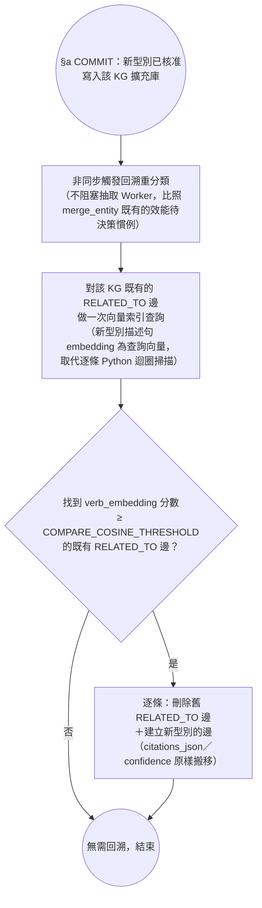
```mermaid
flowchart TD
    COMMITTED(("§a COMMIT：新型別已核准<br/>寫入該 KG 擴充庫")) --> BACKFILLTRIGGER["非同步觸發回溯重分類<br/>（不阻塞抽取 Worker，比照<br/>merge_entity 既有的效能待決策慣例）"]
    BACKFILLTRIGGER --> QUERYIDX["對該 KG 既有的 RELATED_TO 邊<br/>做一次向量索引查詢<br/>（新型別描述句 embedding 為查詢向量，<br/>取代逐條 Python 迴圈掃描）"]
    QUERYIDX --> MATCHED{"找到 verb_embedding 分數<br/>≥ COMPARE_COSINE_THRESHOLD<br/>的既有 RELATED_TO 邊？"}
    MATCHED -->|否| BFDONE(("無需回溯，結束"))
    MATCHED -->|是| REWRITE["逐條：刪除舊 RELATED_TO 邊<br/>＋建立新型別的邊<br/>（citations_json／confidence 原樣搬移）"]
    REWRITE --> BFDONE
```

**三項具體工程手段**：

1. **建立當下就把 `verb` 的 embedding 存起來，backfill 不必重新算**——比照 3.1.4「SVO chunk 向量化」既有慣例（2026-07-22 已定案並實作，切塊當下順便存 embedding 避免之後重複計算）：`extract_svo_triples()` 判定最終 `rel_type` 為 `RELATED_TO` 時，順便算好 `verb` 的 embedding 存進 `SVOTriple.verb_embedding`，`merge_triples_to_graph()` 寫入時存成邊的 `verb_embedding` 屬性——只有 `RELATED_TO` 邊需要，已經有明確型別的邊不需要，省下多餘的儲存與運算。
2. **用 Neo4j 原生 relationship 向量索引做查詢，取代逐條掃描**——已查證確認 Neo4j 支援對關係屬性建立向量索引（`CREATE VECTOR INDEX ... FOR ()-[r:RELATED_TO]-() ON r.verb_embedding`）與查詢（`db.index.vector.queryRelationships(indexName, k, queryVector) YIELD relationship, score`）；這與本專案既有的 `ConceptRepository` 節點向量索引（`concept_q_vector`）、`create_chunk_vector_index()` 是同一套機制的延伸應用，非新技術主張。
3. **範圍與時機**：型別本身是 KG 局部生效（見 §a），backfill 天然只需掃描該 KG 的 `RELATED_TO` 邊；觸發時機為非同步／批次，不阻塞抽取 Worker，比照 `merge_entity()` 既有的「每次合併都重新聚合全部邊，效能待決策，留待第四章/第五章評估」慣例（見 09 號報告 § 4.3）。

**⚠️ 誠實聲明（查無直接對應文獻或開源專案，2026-07-27 查證）**：搜尋了三個方向，皆未找到直接對應「型別詞彙擴充後，如何有效率回溯重分類既有資料」這個具體問題的既有文獻或廣為人知的開源模式：
- **本體演化（ontology evolution）調查文獻**：確認「重分類會被觸發」是被承認的問題，但未提供具體機制討論，未達可引用的深度。
- **開放式關係抽取（OpenRE）新關係發現文獻**（如 SIND、Relation-Oriented Clustering）：問題方向相近（把原本歸類到「其他」的樣本重新分群），但這些論文的實驗情境是**離線批次評測資料集**，不是「持續運行的線上系統、新型別核准後才回頭處理歷史資料」這種維運場景；且僅查到摘要層級，**尚未下載全文精讀**，依本論文既有標準不能列為正式文獻依據，留待後續視需要補齊。
- **開源專案**：查到 `cocoindex-io/cocoindex`（🟢 11,067★，真實活躍專案，「incremental compute system that keeps large corpora fresh without re-embedding」）——但其核心機制是 **change data capture（來源資料變動時增量處理）**，與本設計的情境（來源資料不變、是**目標詞彙表**新增了一個類別）方向相反，只能算是「避免全量重算的增量式架構哲學」存在且被廣泛採用的存在性佐證，不是本設計機制本身的直接依據。

本節三項工程手段（預先計算存起來、用向量索引取代線性掃描、KG 局部範圍＋非同步批次）本質上是資料庫/資訊檢索領域的標準工程實踐＋本專案既有慣例的組合，**沒有一篇論文或一個知名開源專案精確描述這整套機制**，誠實記錄為本論文自行設計的工程方案。**已知限制**：`verb_embedding` 只在此功能上線後新建立的 `RELATED_TO` 邊才會有，上線前既有的 `RELATED_TO` 邊不會被向量索引收錄，backfill 對這些邊無效——若需要涵蓋，需另外補一次性遷移腳本，非本次設計範圍。

### 3.1.4 抽取後續

延續 3.1.3：抽取產出 `SVOTriple` 後，本節處理結果如何送進知識圖譜——對應 3.1.2 五態狀態機中 `pending_upload`／`completed`／`failed` 三態實際觸發的動作，以及實體對齊/去重（DEDUP）如何決定 MERGE 既有節點或新增節點。此步驟原本散落在 3.1 總覽圖與舊版 3.1.2 的 `WRITE` 節點，本次集中於此獨立小節完整展開。

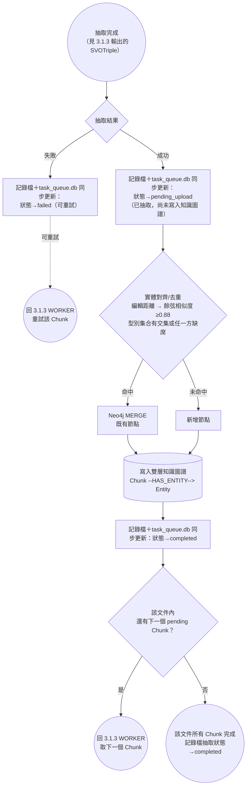
```mermaid
flowchart TD
    HANDOFF4(("抽取完成<br/>（見 3.1.3 輸出的 SVOTriple）")) --> RESULT{"抽取結果"}
    RESULT -->|成功| UPLOAD["記錄檔＋task_queue.db 同步更新：<br/>狀態→pending_upload<br/>（已抽取，尚未寫入知識圖譜）"]
    RESULT -->|失敗| FAIL["記錄檔＋task_queue.db 同步更新：<br/>狀態→failed（可重試）"]
    FAIL -.->|可重試| RETRY(("回 3.1.3 WORKER<br/>重試該 Chunk"))

    UPLOAD --> DEDUP4{"實體對齊/去重<br/>編輯距離 → 餘弦相似度 ≥0.88<br/>型別集合有交集或任一方缺席"}
    DEDUP4 -->|命中| MERGE4["Neo4j MERGE<br/>既有節點"]
    DEDUP4 -->|未命中| CREATE4["新增節點"]
    MERGE4 --> KG4[("寫入雙層知識圖譜<br/>Chunk --HAS_ENTITY--> Entity")]
    CREATE4 --> KG4
    KG4 --> DONE4["記錄檔＋task_queue.db 同步更新：狀態→completed"]
    DONE4 --> NEXT4{"該文件內<br/>還有下一個 pending Chunk？"}
    NEXT4 -->|是| RETRY2(("回 3.1.3 WORKER<br/>取下一個 Chunk"))
    NEXT4 -->|否| IDLE4(("該文件所有 Chunk 完成<br/>記錄檔抽取狀態→completed"))
```

> **注意**：`DEDUP4` 是現行已定案的基準機制（`docs/ARCHITECTURE.md`，2026-07-10 決策：編輯距離→cosine≥0.88），本節只是把原本分散在總覽圖與舊版 3.1.2 的細節集中展開，非新機制。此基準機制在「I-35」對「Interstate Highway 35」這類縮寫上的已知弱點，以及 LLM 仲裁擴充（`ESCALATE`）與別名記錄（`surface_form`）的完整設計，屬於 RQ4b 的原理與文獻討論範疇，見 3.4 §b。
>
> **實體型別建模定案（2026-07-24 新增）**：實體型別**不**存成 Entity 節點的 `type` 屬性，改為獨立的 **Type 節點**，實體透過 `(Entity)-[:屬於]->(Type)` 邊連接——理由：型別本身選填、允許多值（見 3.1.3 節「LLM_SVO」節點注意事項），屬性欄位無法優雅表示「可空」與「可多值」兩種情況，改用邊天然支援零到多條；未來確定某實體的型別後，也能藉由 Type 節點自動帶入該類型的屬性清單模板。此建模方式對應 RDF／Wikidata 的 `rdf:type` 慣例（Vrandečić & Krötzsch, 2014，見第二章 2.4.4／2.4.5，不需另尋新文獻）——型別本身是一種陳述（statement/edge），而非特殊保留屬性。公用實體類型庫的具體內容依據為 **Brinkmann, Primpeli & Bizer（2023，🟢 WWW '23 Companion）**《The Web Data Commons Schema.org Data Set Series》——Table 1（11 類精選展示）與同一個 2022 release 的官方統計頁（`webdatacommons.org/structureddata/2022-12/stats/schema_org_subsets.html`，48 個完整實測類型）聯集去重後共 **52 個不重複類型**，每個皆有官方精確使用量數字（Hosts／URLs／Quads）佐證，已落地為 `core/constants.py::ENTITY_TYPES`。**2026-07-26 查證歷程（同日四次改版）**：本節最初記錄的 Hovy et al. (2006) 為查證錯誤（全文不涉及 NER），改以 Pradhan et al. (2013)／Weischedel et al. (2011) 兩篇正式出版文獻確認「OntoNotes 18 類」這個數字，但兩篇皆未列出具體標籤名稱——此缺口促成改採 Brinkmann et al. (2023) Table 1 的 11 類；使用者其後認為 11 類數量偏少，要求量化證明是否足夠，查證同一 2022 release 的官方統計頁後擴充至上述 52 類，使每個類型名稱都能直接追溯到官方精確數字。⚠️ **誠實聲明（使用者已知悉並選擇採用）**：此排名反映的是網站為觸發 Google／Bing rich snippet 而標註的商業/行銷導向分布，與 OntoNotes 18 類「為新聞/廣播/任意領域文本設計的通用 NER 類型」出發點不同；本論文 SVO 抽取對象含學術/技術文件等非電商內容，此清單未必是語意最貼切的參考類型，換取的是文獻可追溯性的紮實度。完整查證見第二章 2.4.4 與 `docs/參考文獻/03_資訊抽取與本體設計/README.md`。**與關係型別治理機制的區別**：本節實體型別選填、不做強制驗證（見上方定案），因此**沒有**對應 3.1.3 §a 那種正式審核流程；「評分模型 B」一詞現已專指 3.1.3 §a 定案的關係型別 `EXPAND` 治理機制（分群＋LLM 判斷＋跨 KG 登記表），不適用於實體型別。
>
> ⚠️ **`DEDUP4` 篩選邏輯連帶調整（2026-07-24，尚待實作）**：`_fetch_entity_candidates()` 現行程式碼以 `type` 屬性完全相等篩選候選名單（`MATCH (e:Entity {kg_id: $kg_id, type: $entity_type})`），與上述「型別選填、可多值」的新定案衝突——若新提及的實體型別與既有節點的型別字串不完全一致（甚至任一方缺席），現行邏輯會在名稱比對前就把本該合併的候選排除掉，即使兩者名稱完全相同也一樣。**修正方向（已與使用者確認，做法 A）**：型別缺席時視為不設限，直接跟 KG 內所有既有實體比對名稱相似度；型別存在時，改成「型別集合有交集即可視為候選」而非要求完全相等。這個代價是比對範圍變大、查詢效能可能下降，但比照 `merge_entity` 既有的「效能待決策」慣例（見下方），列為第四章實作與第五章消融實驗評估項目，不影響正確性。此修正同樣適用於 3.4 §b `DEDUP3`／`ESCALATE` 的型別篩選邏輯。
>
> ✅ **事實層級去重（2026-07-22 使用者確認並實作）**：`KG4` 節點「寫入雙層知識圖譜」實際包含兩層寫入——`DEDUP4` 處理的是**實體層**（`Chunk --HAS_ENTITY--> Entity`），另一層是**事實層**（`Entity --[REL_TYPE]--> Entity`，即 SVOTriple 本身）。事實層原本以 `(subject, rel_type, object, source_svo_chunk_index, source_sentence_start, source_sentence_end)` 為 Neo4j `MERGE` 鍵，代表**同一個 (subject, rel_type, object) 只要來自不同 chunk／句子，就會產生多條邊**——這在 3.1.2 引入切塊重疊（見上方 `SVOGROUP` 註記）後尤其明顯，但使用者指出這其實是既有的結構性問題，與是否重疊無關：即使完全不重疊的兩個 chunk 各自獨立提到同一事實，一樣會產生兩條邊。**修訂**：`MERGE` 鍵拿掉來源 chunk／句子欄位，只保留 `(kg_id, subject, rel_type, object)`——相同事實一律收斂成同一條邊；每次抽取的來源改記錄在邊上累積的 `citations_json`（JSON 字串陣列，每筆含 `source_doc_id`／`source_svo_chunk_index`／`source_sentence_start`／`source_sentence_end`／`verb`／`confidence`），寫入時先讀回既有清單、應用層附加後整份寫回，邊上的 `confidence` 屬性則取所有引用中的最大值作為代表信心值。**為何不把事實也節點化**：比照 `HAS_ENTITY` 把事實也變成獨立節點（`(Chunk)-[:MENTIONS]->(Fact)`）在模型一致性上更徹底，但會牽動 3.2 §b `bfs_query` 既有的單層關係走訪語意（BFS 的「跳數」定義會被事實節點化打斷），屬於更大範圍的變更，非本次範圍——目前僅在既有的直接邊上改良 MERGE 鍵與來源記錄方式。**下游影響**：`bfs_query()` 回傳的 `SVOTriple` 目前取 `citations_json` 中「最後一筆」引用作為代表來源；累積多筆引用後該呈現哪幾筆給使用者，是回答階段的向量篩選設計（見下方「切塊向量化」），不在本次範圍。實作見 `services/svo_service.py::merge_triples_to_graph()`／`bfs_query()`，測試見 `tests/services/test_svo_service.py`。**⚠️ 誠實聲明（2026-07-26 補充參考先例查證）**：本段「MERGE 鍵重新設計＋`citations_json` 累積來源」是全系統中唯一原本完全未經文獻查證的環節，查證後找到兩項功能性先例（非直接依據）：① 資料結構層面——**Vrandečić & Krötzsch（2014）**Wikidata「Citation Needed」機制，每則陳述可附加可變長度的參考來源清單（截至該文寫作時 43,189,145 筆陳述中 23,242,779 筆已附帶來源），與「單一邊＋可變長度 `citations_json`」的結構高度對應，但 Wikidata 的來源是社群手動附加的支持性引用（回答可信度），本論文是系統自動累積的抽取來源（回答可追溯性），動機不同。② 問題成因與處理方向層面——**Dong et al.（2014，🟢 KDD 2014）**《Knowledge Vault》第 3.2／3.5 節處理同一類「同一三元組被多來源重複抽到」問題，其「同網域只計一次避免虛灌證據」與本論文「同一事實不論來自哪個 chunk 只保留一條邊」問題結構平行；但 KV 是信心分數融合（多來源→一個機率值，來源不個別保留），本論文是結構化來源保留（多來源→逐筆存入 `citations_json`），且 KV「信心隨獨立來源數上升」與本論文現行「取所有引用最大值」方向不同——具體機制不可直接套用。完整查證見 `docs/參考文獻/11_事實層級去重與知識融合/README.md` 與第二章 2.6.3。
>
> ✅ **SVO chunk 向量化（2026-07-22 使用者提出並實作）**：切塊當下（`_trigger_extraction()`，3.1.2）順便把每個 SVO chunk 的內容算成向量，存進 `Chunk` 節點的 `embedding` 屬性（沿用 `ConceptRepository.create_vector_index()` 同一套 Neo4j 向量索引模式，新增 `chunk_embedding_vector` 索引）。**目的**：累積多筆引用的事實（見上方事實層級去重）在回答階段需要決定呈現哪幾筆來源給使用者，作法是把候選來源 chunk 的向量與問題向量做相似度比對，只取分數最高的幾筆，而非把全部來源原文直接吐出——比對／排序邏輯本身不在 3.1.2 範圍內，本次只完成「切塊當下算好向量存起來」這一步，沿用現有 `EmbeddingProvider` 抽象（而非另外引入學習式 attention 機制）。**⚠️ 誠實侷限**：本次寫入的 `Chunk` 節點以 `(kg_id, source, chunk_index)` 為識別鍵（`source` 為檔案系統路徑字串），與 `HAS_ENTITY` 邊所用的 `(kg_id, source_doc_id: UUID, chunk_index)` 鍵不同——這不是本次疏漏，而是既有缺口的延伸：`source_doc_id` 這個 UUID 目前沒有任何實際產生邏輯（尚無 Worker 把文件解析賦予真正的文件 UUID，只有測試程式碼會自行塞入亂數 UUID），向量化又發生在 SVO 抽取之前，此時唯一可靠的文件識別就是 `source` 字串。兩套鍵值如何收斂成同一份 `Chunk` 節點，待文件 UUID 指派機制於第四章實際實作時一併處理。實作見 `services/svo_service.py::embed_svo_chunks()`／`create_chunk_vector_index()`，接線於 `routers/staging.py::_trigger_extraction()`（`get_embedding_provider()` 尚未初始化時優雅跳過）與 `main.py` 啟動流程。

## 3.2 雙層檢索架構（對應 RQ1／RQ2）

本論文將問答時的檢索拆成兩層：**路由層（ConceptNode）**負責在多個獨立知識圖譜之間決定「該去哪個圖找答案」；**知識層（BFS 圖遍歷）**負責在選定的圖譜內做多跳推理。這個分層設計本身**是本論文自行提出的架構**，並非採用文獻中的標準演算法（誠實聲明，呼應 v1 報告五.2）——第二章 2.4.2 已指出 Edge et al.（2024）GraphRAG 的設計預設是單一大圖，較少討論多圖並存時的路由問題，這正是 RQ2 要驗證的缺口；而路由層之上、選定圖譜之後的圖遍歷本身是否比純向量 RAG 更具優勢，則是 RQ1 要驗證的問題。兩者合起來才是完整的「雙層檢索」設計動機。

### §a：ConceptNode 路由層 Behavior Tree（RQ2）

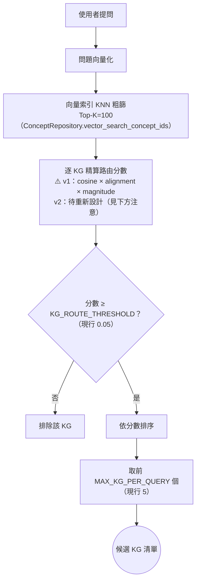
```mermaid
flowchart TD
    Q["使用者提問"] --> EMB["問題向量化"]
    EMB --> COARSE["向量索引 KNN 粗篩<br/>Top-K=100<br/>（ConceptRepository.vector_search_concept_ids）"]
    COARSE --> SCORE["逐 KG 精算路由分數<br/>⚠️ v1：cosine × alignment × magnitude<br/>v2：待重新設計（見下方注意）"]
    SCORE --> FILTER{"分數 ≥ KG_ROUTE_THRESHOLD？<br/>（現行 0.05）"}
    FILTER -->|否| DROP["排除該 KG"]
    FILTER -->|是| RANK["依分數排序"]
    RANK --> CAP["取前 MAX_KG_PER_QUERY 個<br/>（現行 5）"]
    CAP --> OUT(("候選 KG 清單"))
```

> **注意**：`SCORE` 節點的「cosine × alignment × magnitude」加權公式是 v1 的既有設計（`concept_engine.py` docstring 標註「TODO(v2 架構重整)：待重新設計後遷移」），本論文暫不假設此公式在 v2 會原樣保留——RQ2 的實驗設計需要明確區分「路由層這個兩層架構本身是否成立」與「這個特定加權公式是否為最優解」兩件事，避免把工程實作細節誤植為研究貢獻。`KG_ROUTE_THRESHOLD`、`MAX_KG_PER_QUERY`、`CONCEPT_COARSE_TOP_K` 三個門檻值目前定義在 `core/constants.py`，第五章消融實驗需要對這些門檻做敏感度分析。

### §b：BFS 圖遍歷 Behavior Tree（RQ1）

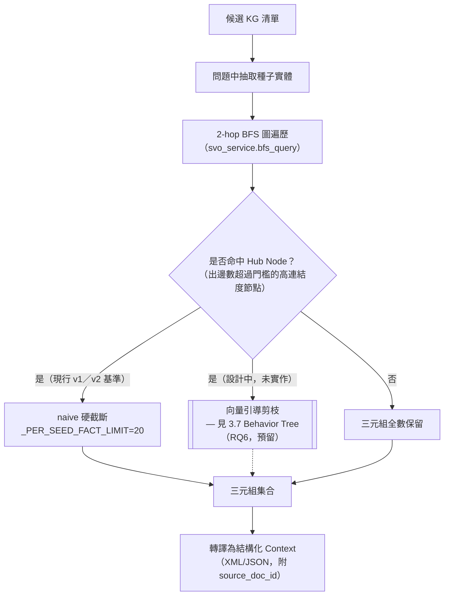
```mermaid
flowchart TD
    KGS["候選 KG 清單"] --> SEED["問題中抽取種子實體"]
    SEED --> BFS2["2-hop BFS 圖遍歷<br/>（svo_service.bfs_query）"]
    BFS2 --> HUB{"是否命中 Hub Node？<br/>（出邊數超過門檻的高連結度節點）"}
    HUB -->|"是（現行 v1／v2 基準）"| CUT["naive 硬截斷<br/>_PER_SEED_FACT_LIMIT=20"]
    HUB -->|"是（設計中，未實作）"| PRUNE[["向量引導剪枝<br/>— 見 3.7 Behavior Tree（RQ6，預留）"]]
    HUB -->|否| PASS["三元組全數保留"]
    CUT --> TRIPLES["三元組集合"]
    PRUNE -.-> TRIPLES
    PASS --> TRIPLES
    TRIPLES --> CTX["轉譯為結構化 Context<br/>（XML/JSON，附 source_doc_id）"]
```

> **注意**：`PRUNE` 節點以虛線連回 `TRIPLES`，代表這是**尚未實作、屬 RQ6（預留）的設計提案**，現行系統（v1 與 v2 stub）在遇到 Hub Node 時一律走 `CUT` 這條 naive 硬截斷路徑（`_PER_SEED_FACT_LIMIT=20`）。RQ1 的實驗設計（KG-BFS vs. 純向量 RAG）以現行的 `CUT` 路徑為基準線即可，不需要等 RQ6 完成；但若 RQ6 最終納入正式貢獻，RQ1 的基準線需要重新跑一次以排除剪枝策略改變帶來的干擾。

### §c：查詢時關係連結（Relation Linking，2026-07-24 新增設計提案）

> 狀態：🟡 設計提案，尚未實作。`bfs_query()` 現況完全不對關係類型做篩選——從種子實體出發做 N-hop BFS，把路徑上所有關係不分類型全部撈回，關係的理解與篩選現行是丟給後面的 LLM 讀取三元組集合時自己判斷。本節是**面向未來**的機制設計：若查詢端日後需要依關係類型篩選 BFS 邊（例如「找出導致 X 的原因」只想沿著 `CAUSES` 型別的邊走），需要先解決「使用者的動詞措辭如何對應到 3.1.3 節的 33 個 canonical 關係型別」這個問題。

**動機**：3.1.3 節已定案關係型別收斂為扁平的 33 類（ConceptNet 5.5，見該節 2026-07-26 逐字查證更正、2026-07-27 因官方棄用建議再訂正 35→33），抽取時動詞原文與型別分開記錄。但這也代表：如果使用者提問用的措辭（例如「導致」）跟抽取時記錄的動詞原文（例如「推動」）不完全一致，純字串比對會找不到對應的 canonical 型別，即使兩者語意上都該歸類到 `CAUSES`——這與實體缺乏同義合併機制時會遇到的問題性質相同，只是發生在關係這一側、且是在查詢端而非抽取端。

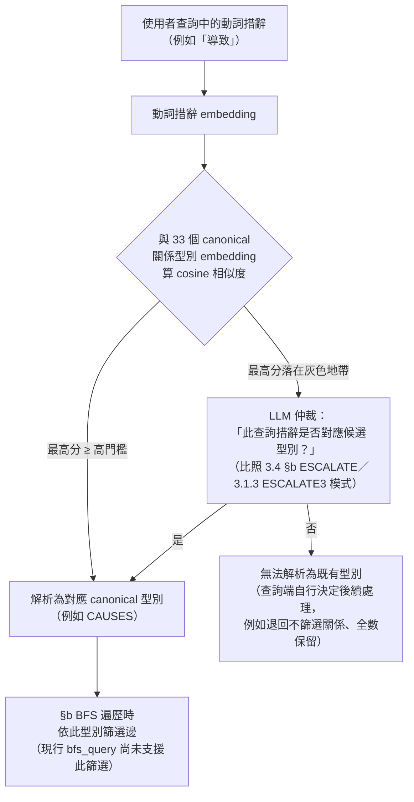
```mermaid
flowchart TD
    UQ["使用者查詢中的動詞措辭<br/>（例如「導致」）"] --> QEMB["動詞措辭 embedding"]
    QEMB --> QSIM{"與 33 個 canonical<br/>關係型別 embedding<br/>算 cosine 相似度"}
    QSIM -->|"最高分 ≥ 高門檻"| QASSIGN["解析為對應 canonical 型別<br/>（例如 CAUSES）"]
    QSIM -->|"最高分落在灰色地帶"| QESCALATE["LLM 仲裁：<br/>「此查詢措辭是否對應候選型別？」<br/>（比照 3.4 §b ESCALATE／3.1.3 ESCALATE3 模式）"]
    QESCALATE -->|是| QASSIGN
    QESCALATE -->|否| QNOMATCH["無法解析為既有型別<br/>（查詢端自行決定後續處理，<br/>例如退回不篩選關係、全數保留）"]
    QASSIGN --> QFILTER["§b BFS 遍歷時<br/>依此型別篩選邊<br/>（現行 bfs_query 尚未支援此篩選）"]
```

> **文獻依據**：這個問題在 KBQA（Knowledge Base Question Answering）領域是被廣泛研究的既定任務，稱為 **Relation Linking／Predicate Linking**。核心文獻為 **Yih, Chang, He & Gao（2015，🟢 ACL-IJCNLP 2015）**《Semantic Parsing via Staged Query Graph Generation》（STAGG）——原文訓練神經網路將問題與 KB predicate 序列投影到同一向量空間、以相似度比對，機制精神與本節「查詢動詞 embedding vs. 33 個 canonical 型別 embedding 算 cosine」一致，差別僅在本節不需重新訓練模型，直接用現成 `EmbeddingProvider` 即可；官方實作 [scottyih/STAGG](https://github.com/scottyih/STAGG)（111★）。佐證此任務領域成熟度的補充文獻：**Sakor et al.（2020，🟢 CIKM '20）**《Falcon 2.0》（⚠️ 規則式系統，非 embedding 相似度比對，僅佐證任務重要性，非機制依據）與 **Mihindukulasooriya et al.（2020，🟢 ISWC 2020）**《SLING》（AMR＋遠端監督＋相似度混合式，比 Falcon 2.0 更接近本節機制但仍非純 cosine）。完整查證見第二章 2.4.4 與 `docs/參考文獻/03_資訊抽取與本體設計/README.md`。
>
> ⚠️ **與 3.1.3 `SIM`／`ESCALATE3` 機制對稱但用途不同**：兩者都是「動詞 embedding vs. 33 個 canonical 型別做 cosine，灰色地帶交由 LLM 仲裁」的同一套比對邏輯，差別在於 3.1.3 發生在**抽取時**（決定新三元組的 rel_type），本節發生在**查詢時**（決定使用者問題該篩選哪個關係型別）——實作時應共用同一組型別 embedding 與同一套比對函式，避免兩處各自實作出不一致的門檻。`QNOMATCH` 的後續處理（無法解析時是否要退回不篩選、或直接告知使用者查無此類關係）目前僅有機制框架，未展開具體策略，留待與 `bfs_query()` 實際整合時一併設計。
>
> **與 3.1.3 §a 跨 KG 登記表的關係（2026-07-26 補充，待決；同日逐字查證更正型別總數 36→35；2026-07-27 再訂正 35→33，見 3.1.3 節）**：`QSIM`／`QESCALATE` 目前只針對「基礎 33 個 canonical 型別」做比對，但 3.1.3 §a 定案後，各 KG 可能各自擁有超出這 33 類的**擴充型別**（含經跨 KG 登記表沿用命名、多個 KG 共用的擴充型別，以及僅單一 KG 局部核准、未被其他 KG 沿用的擴充型別）。查詢時若使用者措辭實際對應到的是某 KG 的擴充型別而非基礎 33 類，現行 `QSIM` 比對範圍不含這些型別會找不到對應、誤判為 `QNOMATCH`。可能方案：(a) 比對範圍改為「基礎 33 類＋被路由到的候選 KG 各自的擴充型別聯集」；(b) 僅併入跨 KG 登記表內的共用擴充型別，排除單一 KG 未登記的局部命名，以維持型別 embedding 集合相對穩定。兩者取捨牽動 3.2 §a 路由層的執行時序（要先知道候選 KG 是誰，才能組裝對應的型別集合）與 `QSIM` 型別 embedding 是否要動態組裝而非固定 33 維，目前僅記錄此待決問題與可能方向，具體方案留待 3.1.3 §a 治理機制實作、並與 `bfs_query()` 整合時一併設計。

## 3.3 受控語意關係抽取（對應 RQ4a，預留）

> 本節說明 RQ4a 的設計原理與文獻佐證；抽取機制實際如何運作（Behavior Tree）見 3.1.3，此處不重複展開。

本節設計的核心問題：SVO 抽取時，動詞是要開放抽取（任意動詞字串皆可成為關係，如 Angeli et al. 2015 Stanford OpenIE 的做法），還是收斂到一組**受控語意關係詞彙**（即 3.1.3 的關係型別，內容依據見下方 2026-07-24 更新）？本論文選擇後者。

選擇受控集合而非開放抽取的理由，直接回應第二章 2.4.4 討論的語意一致性缺口：Vashishth et al.（2018）CESI 指出開放式抽取會讓語意相同的關係以不同字串存入知識庫（「創立」「成立」「建立」被記為三個不同謂語），造成多跳推理時的語意漂移。但受控集合並非沒有代價——固定詞彙必然犧牲一部分細緻語意的召回率，這正是 RQ4a 要實證回答的 trade-off：語意一致性與可追溯性（AIS）的提升，是否能補償召回率的損失？RQ4a 處理的是三元組裡「V」（關係類型）的受控化；三元組另一半「S／O」（實體本身）的指稱一致性問題，見 3.4 節（RQ4b）。

> **注意（原始構想，2026-07-24 已被下方定案取代）**：3.1.3 的 `STRUCT`（結構驗證）／`SEMANTIC`（語意驗證）兩步機制原本設想與 Schema.org（Guha et al., 2016）的受控詞彙擴展精神一致——新詞彙要進入系統，先檢查格式是否符合既有屬性模板（結構驗證），再檢查是否與既有類別語意重複（語意驗證）。Guha et al.（2016）原文為 ACM 付費資源、僅記書目資訊（見第二章 2.4.4 與 `docs/參考文獻/03_資訊抽取與本體設計/README.md`）。
>
> **替代查證來源（2026-07-20，見第二章 2.4.4）**：在 Guha et al. 全文取得前，已另外精讀 **Vrandečić & Krötzsch（2014，🟢 CACM 57(10)）**《Wikidata》作為部分替代佐證——Wikidata 屬性頁面須指定 datatype（結構層限制）、schema 本身受社群治理、另有社群制定的語意限制條件與外部掃描機制（語意層檢查），證實「受控詞彙的結構層與語意層可分別治理」已有生產級規模化先例。**但誠實聲明**：Wikidata 論文並未描述「結構驗證→語意驗證」這種**循序、單一審核閘門**的精確機制（其兩層檢查是獨立運作，非新詞彙進入前的循序關卡），因此原始構想與 Wikidata 治理模式**不宣稱機制等價**，僅多一份「此類分層治理模式在生產級系統可行」的獨立佐證。
>
> **2026-07-24 設計定案更新——上述 `STRUCT` 構想已被取代**：與使用者逐階段討論後，確認 `STRUCT`（domain/range 屬性模板驗證）的前提是「型別要能拿來做強制驗證」，但 3.1.3／3.1.4 已定案實體型別選填、不做強制驗證，`STRUCT` 這個判斷因此**不再適用**，不是尚未實作、而是設計本身已變更。查證結果反而印證了這個決定的合理性：連 Wikidata 這篇文獻都未提供「結構驗證→語意驗證」循序閘門的先例（見上方誠實聲明），本論文選擇不採用需要這種循序閘門的設計，與查證結果互相印證，並非迴避問題。取而代之，關係型別改採**扁平單一層**，內容依據 **ConceptNet 5.5**（Speer et al., 2017，🟢 AAAI 2017）的 35 個核心關係（論文正文自稱 36，逐字核對實際列出 35，見 2026-07-26 誠實訂正；2026-07-27 因 `ENTAILS`／`INSTANCE_OF` 被 ConceptNet 官方現行 wiki 列為已棄用，再訂正為 33 個，見 3.1.3 節），`SEMANTIC` 判斷（語意是否與既有型別重複）改為 cosine 相似度比對＋灰色地帶 LLM 仲裁（比照 3.4 §b `ESCALATE` 模式），完整機制見 3.1.3 節。**兩層分類法本身的結構性佐證**（雖未採用其內容）：ACE 2005 relation schema（6 粗類→18 細類）與 **Aguilar et al.（2014，🟢 ACL 2014 EVENTS Workshop）**比較 ACE／ERE／TAC-KBP／FrameNet 四套關係本體，證明「關係分粗類/細類」在學界並非罕見；但 ACE 粗類名稱（人物/組織/地點關係）與本論文因果/功能/比較領域不合，這正是本論文最終**放棄**兩層架構的部分原因。完整查證見第二章 2.4.4。
>
> 本節與 `docs/報告/03_核心架構藍圖.md` 痛點 12（實體/關係摘要整併，Element Summarization）為**不同但相關**的問題：本節解決的是「同一描述該歸到哪個受控類別」，痛點 12 解決的是「同一節點的多筆描述如何整併成單一摘要」——兩者皆發生在 3.1.4 抽取後續之後，但摘要整併目前尚未排入本論文的正式 RQ（見第七章未來工作）。

## 3.4 實體指代與別名消解（對應 RQ4b，預留，2026-07-20 新增）

> 狀態：🟡 設計提案，機制合理，關鍵參數與涵蓋範圍待第五章消融實驗驗證，非定案實作。

RQ4a（3.3 節）處理的是 SVO 三元組裡「V」（關係類型）該不該受控；本節處理的是「S／O」（實體本身）的另一半問題——同一個真實世界的實體，在文字裡可能以完全不同的字面形式出現：**代名詞**（他、它、該公司）、**全稱/簡稱/別名**（Interstate Highway 35／I-35／Interstate；Richard Stone／Stone／the defendant）。若不處理，會直接反映成圖譜裡的**冗餘/孤立節點**（同一實體被拆成好幾個各自連結度很低的節點），削弱多跳推理（RQ1）與路由層（RQ2）賴以運作的圖結構完整性，也讓「語意一致性」這個 RQ4 的核心主張不完整——只控制關係類型、不控制實體指稱，等於三元組只做了一半的受控化。

**RQ4b**：文件內／跨文件的實體指代與別名消解機制，相較於現行僅靠字串編輯距離＋cosine 相似度門檻的簡單去重，對圖譜節點冗餘度、多跳推理正確率、可追溯性（AIS）有何影響？

本節機制分兩層，分別解決「同一份文件內」與「跨文件」兩種不同尺度的指稱不一致問題——這個分層本身呼應第二章 2.4.5 已查證的文獻（原始查證脈絡見 [`03_變更紀錄.md`](03_變更紀錄.md) 「3.1.2 §a（原稿）」；**誠實訂正（2026-07-23）**：此處原誤植為「第二章 2.1.3」，該節實際討論的是 RQ4a 的 OpenIE/CESI/Schema.org 文獻，與本段 Text2KGBench／CORE-KG 無關，此次一併校正並在 02 文獻探討章新增 2.4.5 節收納這批文獻）：Text2KGBench（Mihindukulasooriya et al., 2023）證實句子級抽取若不處理指代消解會漏抽，CORE-KG（Meher, Domeniconi & Correa-Cabrera, 2025）證實把指代消解前置於切塊之前能量化降低節點冗餘（-28.25%），但兩篇文獻皆未涵蓋「別名要在圖譜中可追溯記錄」這個本節額外要求，此部分為本論文自行設計。

### §a：文件內前處理——代名詞消解＋實體別名登記

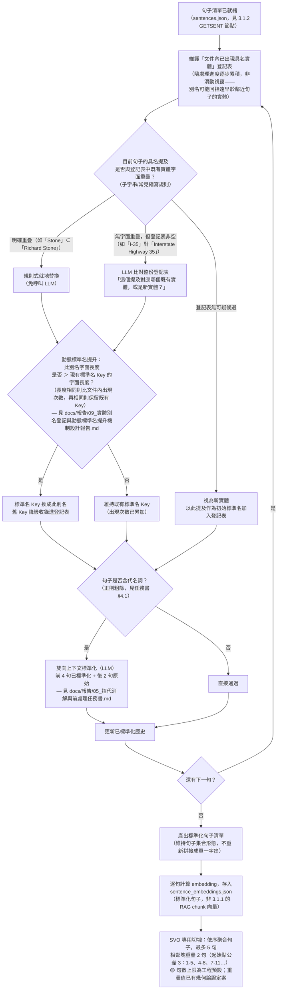
```mermaid
flowchart TD
    RAW["句子清單已就緒<br/>（sentences.json，見 3.1.2 GETSENT 節點）"] --> REGISTRY["維護「文件內已出現具名實體」登記表<br/>（隨處理進度逐步累積，非滑動視窗——<br/>別名可能回指遠早於鄰近句子的實體）"]

    REGISTRY --> ALIASCHECK{"目前句子的具名提及<br/>是否與登記表中既有實體字面重疊？<br/>（子字串/常見縮寫規則）"}
    ALIASCHECK -->|"明確重疊（如「Stone」⊂「Richard Stone」）"| ALIASRULE["規則式就地替換<br/>（免呼叫 LLM）"]
    ALIASCHECK -->|"無字面重疊，但登記表非空<br/>（如「I-35」對「Interstate Highway 35」）"| ALIASLLM["LLM 比對整份登記表<br/>「這個提及對應哪個既有實體，或是新實體？」"]
    ALIASCHECK -->|"登記表無可疑候選"| NEWENT["視為新實體<br/>以此提及作為初始標準名加入登記表"]

    ALIASRULE --> PROMOTE
    ALIASLLM --> PROMOTE
    PROMOTE{"動態標準名提升：<br/>此別名字面長度<br/>是否 ＞ 現有標準名 Key 的字面長度？<br/>（長度相同則比文件內出現次數，再相同則保留既有 Key）<br/>— 見 docs/報告/09_實體別名登記與動態標準名提升機制設計報告.md"}
    PROMOTE -->|是| SWAPKEY["標準名 Key 換成此別名<br/>舊 Key 降級收錄進登記表"]
    PROMOTE -->|否| KEEPKEY["維持既有標準名 Key<br/>（出現次數已累加）"]

    SWAPKEY --> PRONCHECK
    KEEPKEY --> PRONCHECK
    NEWENT --> PRONCHECK

    PRONCHECK{"句子是否含代名詞？<br/>（正則粗篩，見任務書 §4.1）"}
    PRONCHECK -->|是| PRONLLM["雙向上下文標準化（LLM）<br/>前 4 句已標準化 + 後 2 句原始<br/>— 見 docs/報告/05_指代消解與前處理任務書.md"]
    PRONCHECK -->|否| BYPASS["直接通過"]

    PRONLLM --> UPDATE["更新已標準化歷史"]
    BYPASS --> UPDATE
    UPDATE --> NEXT2{"還有下一句？"}
    NEXT2 -->|是| REGISTRY
    NEXT2 -->|否| STDSENTS["產出標準化句子清單<br/>（維持句子集合形態，不重新拼接成單一字串）"]
    STDSENTS --> SENTEMBED["逐句計算 embedding，存入<br/>sentence_embeddings.json<br/>（標準化句子，非 3.1.1 的 RAG chunk 向量）"]
    SENTEMBED --> SVOGROUP["SVO 專用切塊：依序聚合句子，最多 5 句<br/>相鄰塊重疊 2 句（起始點公差 3：1-5、4-8、7-11…）<br/>🟡 句數上限為工程預設；重疊值已有幾何論證定案"]
```

> **順序**：別名消解跑在代名詞消解**之前**——先把「Stone」「該公司」這類具名別名收斂成文件內唯一稱呼，代名詞消解時「前 4 句已標準化」的品質才會更好。
>
> **`PROMOTE` 動態標準名提升機制（2026-07-21 新增，2026-07-21 三度修訂改為長度優先，完整設計見 `docs/報告/09_實體別名登記與動態標準名提升機制設計報告.md`）**：`ALIASCHECK` 判定某個提及對應既有登記表條目後，並非直接沿用該條目現有的標準名——文件最早出現的字面形式常是簡稱或縮寫（如首句只出現「I-35」，第 4 句才出現全稱「Interstate Highway 35」），標準名不能死板固定於首次出現者。本機制**主規則為字面長度優先**：登記表額外記錄每個別名各自的文件內出現次數，當前提及若比現有標準名 Key 更長，就把 Key 換成這個更長的字面形式，原 Key 降級收錄進登記表；長度相同才比出現次數（次規則），再相同則保留既有 Key（最終 tie-breaker）。**設計理由（2026-07-21 使用者提出）**：單一文件內，實體通常是「先給完整名稱、後續才為精簡改用簡稱」——若沿用頻率優先，幾乎必然選到後面反覆使用的簡稱為標準名，反而犧牲完整性，也讓下游代名詞消解的實體接力上下文不夠清楚；改為長度優先才能穩定拿到最完整的稱呼。**查證結果與誠實框架**：此機制歷經三次修訂——初稿以「長度優先」宣稱 7 項專案/文獻佐證，查證後發現全部不支持，改採「頻率優先」呼應 Wikidata／CESI（詳見 `docs/參考文獻/10_跨文件實體別名消解與增量聚類/README.md`）；使用者後續指出頻率優先在單一文件內會系統性選到簡稱，且 Wikidata／CESI 本來就是跨文件/跨編者尺度的頻率概念，套用在單一文件內本屬勉強延伸——因此**改回長度優先為主規則，但誠實標註為本論文自行設計的工程決策，不宣稱文獻背書**（依 3.8 節誠實框架）；跨文件範圍的頻率優先規則保留在 §b，該處才是 Wikidata／CESI 真正適用的尺度。**參考專案查證（2026-07-23）**：除了查無文獻先例，也查無任何開源專案實作過此長度優先 PK 機制（完整查證見第二章 2.4.5 節）——`PROMOTE` 是本系統中外部佐證最薄弱的節點，文獻與專案兩條證據鏈皆為空，純屬本論文自行設計，寫作時不應暗示有任何形式的既有先例背書。
>
> ⚠️ **本節輸出僅為「文件內暫定標準名」，非最終權威（2026-07-21 再修訂，重要）**：`PROMOTE` 的統計範圍**僅限單一文件**——單一文件內的長度/次數判斷，反映的是這份文件/這位作者自己的行文習慣，不代表這是實體在整個語料庫中被廣泛認可的通用標準名稱。若把本節輸出直接當成最終寫入知識圖譜的 `Entity.name`，標準名會隨文件來源飄移，違背 RQ4b「跨文件語意一致」的核心目標。因此本節輸出**只用於這份文件自身的處理**（下游代名詞消解、SVO 切塊分組），最終寫入圖譜的 `Entity.name` 由 §b「跨文件別名頻率聚合」決定，且隨新文件持續加入可能修正——兩者衡量範圍不同、權威層級不同、**主規則也不同**（§a 長度優先，§b 頻率優先），不可混淆。
>
> **與 05 任務書的分工（2026-07-21 補上實作，改用 10 報告的雙軌偵測）**：代名詞消解（`PRONCHECK`／`PRONLLM` 節點）完整規格見 `docs/報告/05_指代消解與前處理任務書.md`（雙向上下文視窗設計、Prompt 模板）與 `docs/報告/10_代名詞雙軌檢測與正則詞庫自動進化機制設計報告.md`（POS＋正則雙軌偵測，2026-07-21 使用者決策採用，取代 05 單一正則設計已知的「其/該」誤觸發限制）。**文獻/參考專案查證（2026-07-23，完整內容見第二章 2.4.5）**：`SpacyPosTagger` 直接依賴 spaCy（33,766★），詞性標籤依循 Universal Dependencies 標準（Nivre et al., 2016，⚠️ 全文未下載），但「雙軌預篩、僅偵測到代名詞才呼叫 LLM」這個應用層設計本身查無 fastcoref 等專案的直接先例，與 `PROMOTE` 同屬本論文自行設計的機制，10 報告原稿誤引的 Stanford CoreNLP 量化宣稱已查證為查無出處並整條移除。**✅ 已實作**：`services/pronoun_resolution_service.py`——`detect_pronoun()`（雙軌三路分流：正則命中／POS 命中但正則未收錄／皆未命中）、`SpacyPosTagger`（spaCy `PRON`/`DET` 標籤，透過 `PosTagger` 介面注入，未安裝 spaCy 時不影響模組其餘邏輯匯入與測試）、`audit_unmapped_pronoun()`（背景 LLM 詞庫審核）、`resolve_coreference_pipeline()`（前 4 後 2 雙向上下文消解主體，`llm_provider=None` 時原句直接通過）。測試見 `tests/services/test_pronoun_resolution_service.py`（18 項，皆以 Fake `PosTagger` 驗證雙軌判讀邏輯，真實 spaCy 整合本身未在本專案環境驗證，見 `requirements.txt` 新增項目）。**別名登記/比對機制（`REGISTRY`／`ALIASCHECK`／`ALIASLLM`／`PROMOTE`）已實作**：`services/entity_registry_service.py`（`EntityRegistry` 類別、`should_promote_by_length()` 長度優先規則、`_is_rule_match()` 子字串/縮寫規則、`apply_registry()` 整合入口、`write_registry_snapshot()`／`read_registry_snapshot()` 斷點續傳快照），測試見 `tests/services/test_entity_registry_service.py`（21 項）。
>
> ✅ **`CHUNKREADY` 端到端串接（2026-07-21 新增；2026-07-22 補上 `SENTEMBED`）**：`services/svo_preprocessing_service.py::prepare_svo_ready_chunks()` 把 `get_or_rebuild_sentences()`（`GETSENT`）→ `entity_registry_service.apply_registry()`（`REGISTRY`／`PROMOTE`，可選）→ `pronoun_resolution_service.resolve_coreference_pipeline()`（`PRONCHECK`／`PRONLLM`）→ `write_sentence_embeddings()`（`SENTEMBED`，`embedding_provider` 提供時才執行）→ `svo_chunking.build_svo_chunks()`＋`write_svo_chunks()`（`SVOGROUP`）串成一條真正可呼叫的管線，測試見 `tests/services/test_svo_preprocessing_service.py`。`routers/staging.py::_trigger_extraction()` 已接上同一個 `embedding_provider`（與 `EMBEDCHUNK` 共用同一次 `get_embedding_provider()` 呼叫，不重複 fetch）。
>
> ✅ **具名提及抽取（NER，2026-07-23 補上模組，部分解除上游缺口）**：`services/entity_extraction_service.py` 新增混合式抽取——spaCy NER（`SpacyNerTagger`，複用 `pronoun_resolution_service.SpacyPosTagger` 同一顆 `zh_core_web_sm` 模型精神）為主，正則兜底只補常見漏抓的代號型實體（如「I-35」）；純 LLM-based NER（逐句呼叫）已評估並否決，理由是會打破現有管線「規則式優先、篩不出來才呼叫 LLM」的省成本慣例。刻意偏召回率（recall）而非精確率（precision）：漏抓的提及沒有補救機會，抓錯/抓多則由下游 `ALIASCHECK`／`ALIASLLM` 緩衝。`prepare_svo_ready_chunks()` 新增 `ner_tagger` 參數，`mentions=None` 但提供 `ner_tagger` 時自動對原始句子現場抽取（`mentions` 明確提供時優先採用，兩者互斥）。測試見 `tests/services/test_entity_extraction_service.py`。**⚠️ 誠實侷限（尚未完全解決）**：與 `SpacyPosTagger` 同樣的既有風險，本專案環境 spaCy／`zh_core_web_sm` 仍未安裝驗證，`routers/staging.py::_trigger_extraction()` 目前仍以 `ner_tagger=None` 呼叫，正式流程中 §a 別名登記表整體仍是跳過狀態——NER 介面與上游模組已就緒，缺的只剩「production 環境接上真的 spaCy」這最後一步，待第四章實作環境安裝驗證後接線。
>
> **成本控制**：`ALIASLLM` 只在「無字面重疊但登記表非空」時觸發，多數句子仍走免費的規則式路徑（`ALIASRULE`）或直接通過（`BYPASS`），呼應代名詞消解既有的「正則粗篩才呼叫 LLM」省錢邏輯。
>
> ⚠️ **已知限制**：登記表比對是**文件內**範圍，不處理跨文件別名（見下方 §b）；`ALIASLLM` 的判準（多少相似度才算「同一實體」）目前僅有機制設計、無量化門檻，需留給第五章消融實驗校準。
>
> **與 3.1.1 RAG 切塊的關係（2026-07-21 確認；2026-07-21 再校正輸入形態）**：本節輸入是 3.1.1 順手另存的句子切分結果（`sentences.json`，見 3.1.2 `GETSENT`），不是 3.1.1 為 RAG 向量檢索切好的 `chunk-NNN-of-MMM.md`——兩者切塊粒度需求不同（向量檢索要細、SVO 抽取要粗），SVO 抽取不該沿用 RAG 切塊，完整討論見 `03_變更紀錄.md`「已評估但未採用的設計方案」。本節輸入輸出皆維持**句子集合**形態（不重新拼接成單一字串），`STDSENTS` 產出標準化句子清單後直接交給 SVO 專用切塊——切塊演算法已定案並實作（見下方 `SVOGROUP` 註記）。
>
> ✅ **`SENTEMBED` 逐句 embedding（2026-07-21 定案，2026-07-22 實作補齊）**：標準化句子清單產出後，逐句計算 embedding（與 3.1.1 的 RAG chunk 向量分開計算、分開索引，粒度不同），存成該文件資料夾內的 `sentence_embeddings.json`（比照 `sentences.json` 的落地模式）。用途分兩個層次：① 作為後續 SVO 切塊分組的候選依據來源之一（例如未來若採語意斷點式分組，這裡的向量即可直接使用），但**分組規則本身已定案採簡單固定聚合，非語意切分**（見下方 `SVOGROUP` 註記）；② 讓 `docs/報告/08_三軌混合檢索架構與標準化RAG設計報告.md` 提出的「標準化 RAG」檢索軌道具備可實測的基礎建設，第五章消融實驗可據此**實際比較**傳統 RAG 與標準化 RAG 的效果，而非僅依賴文獻宣稱——**08 報告本身的三軌架構是否納入 RQ1/RQ2 既有範圍仍未定案**，這次只實作「算好向量存起來」這一步，不代表 08 報告的檢索設計本身已定案（見 `docs/報告/06_SVO抽取管線調整任務書.md` 第 5 節）。**實作**：`services/svo_preprocessing_service.py::write_sentence_embeddings()`／`read_sentence_embeddings()`，`prepare_svo_ready_chunks()` 新增 `embedding_provider` 參數（`None` 時優雅跳過，不影響下游 `PROMOTE`／`SVOGROUP`，兩者本就不依賴 `SENTEMBED` 的向量）。
>
> ✅ **`SVOGROUP` 組塊上限與重疊（2026-07-21 定案句數上限、2026-07-22 定案改用純句數＋重疊，取代原本的 300 字元上限）**：先採簡單固定聚合（依序聚合句子，最多 5 句），語意斷點式分組（07 報告的核心演算法）因文獻支撐不足暫緩（見 `03_變更紀錄.md` 與 `06_SVO抽取管線調整任務書.md` 第 5 節的查證過程，07 報告已據此訂正、降級為第五章候選對照方案）。**原本的 300 字元上限已拿掉（2026-07-22 使用者決策）**：這個數字本來就沒有直接文獻依據，只是呼應 GraphRAG（Edge et al., 2024）附錄「切塊越小、抽取密度越高」的方向性發現（其測試範圍是 600/1200/2400 token，非中文字元，換算本就不精確），拿掉後只用 `max_sentences`（預設 5）這個有清楚語意（一次抽取涵蓋幾句話）的參數控制切塊大小，數值本身仍是工程預設，留給第五章消融實驗校準。
>
> **相鄰塊重疊 2 句（`overlap_sentences=2`，2026-07-22 使用者提出並驗證）**：起始點以公差 3（= 5 句 − 重疊 2 句）遞增，產生 1-5、4-8、7-11……這組序列。**設計目標**：避免「事實跨塊邊界被切斷」——若某個事實橫跨兩句、恰好卡在切塊邊界，重疊能確保它仍完整落在至少一個塊內。**幾何論證**（逐句子在塊內偏移量驗算，見 `03_變更紀錄.md` 2026-07-22 條目）：任一句子若在塊內偏移量為 2（正中央），單一塊本身前後就各有 2 句，不需要第二個框；偏移量為 0/1/3/4（貼近塊的邊界）時，恰好也是相鄰塊與本塊的重疊區段，兩塊聯集後前後文皆 ≥ 2 句——換言之，每一句要嘛被單一塊完整覆蓋所需的前後文，要嘛被恰好兩個塊的聯集覆蓋，不會有「兩塊都覆蓋不到」的中間地帶。文件開頭/結尾因為沒有更多句子，前後文自然受限，不算違反此設計。**實作**：`services/svo_chunking.py::build_svo_chunks()` 的 `max_sentences`／`overlap_sentences` 參數，測試見 `tests/services/test_svo_chunking.py`（含逐句覆蓋驗證 `test_every_sentence_union_of_its_chunks_covers_front_two_and_back_two`）。
>
> ⚠️ **重疊會讓同一事實被重複抽取，但這不是重疊獨有的問題**：即使完全不重疊的兩個塊，各自獨立抽到同一個事實（例如同一事實在文件不同段落各被提到一次），一樣會產生「同一 (subject, rel_type, object) 出現兩次」的情況——重複與否取決於文件內容本身是否重複陳述，不是切塊策略的副作用。真正該解決的是**下游要不要把它們收斂成同一條邊**，而不是靠「不重疊」去迴避問題（見下方事實層級去重）。

### §b：跨文件別名消解——擴充現行 DEDUP／MERGE 機制

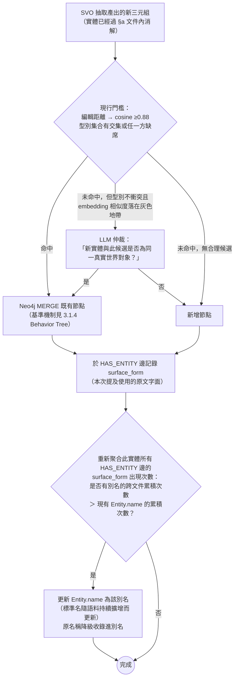
```mermaid
flowchart TD
    NEWTRIPLE["SVO 抽取產出的新三元組<br/>（實體已經過 §a 文件內消解）"] --> DEDUP3{"現行門檻：<br/>編輯距離 → cosine ≥0.88<br/>型別集合有交集或任一方缺席"}
    DEDUP3 -->|命中| MERGE2["Neo4j MERGE 既有節點<br/>（基準機制見 3.1.4 Behavior Tree）"]
    DEDUP3 -->|"未命中，但型別不衝突且<br/>embedding 相似度落在灰色地帶"| ESCALATE["LLM 仲裁：<br/>「新實體與此候選是否為同一真實世界對象？」"]
    DEDUP3 -->|"未命中，無合理候選"| CREATE2["新增節點"]
    ESCALATE -->|是| MERGE2
    ESCALATE -->|否| CREATE2
    MERGE2 --> RECORD3B["於 HAS_ENTITY 邊記錄 surface_form<br/>（本次提及使用的原文字面）"]
    CREATE2 --> RECORD3B
    RECORD3B --> RECHECK{"重新聚合此實體所有 HAS_ENTITY 邊的<br/>surface_form 出現次數：<br/>是否有別名的跨文件累積次數<br/>＞ 現有 Entity.name 的累積次數？"}
    RECHECK -->|是| UPDATENAME["更新 Entity.name 為該別名<br/>（標準名隨語料持續擴增而更新）<br/>原名稱降級收錄進別名"]
    RECHECK -->|否| DONE2(("完成"))
    UPDATENAME --> DONE2
```

> **為什麼現行門檻不夠**：`docs/ARCHITECTURE.md`（2026-07-10 決策）既有的編輯距離/cosine 0.88 門檻，對「San Antonio」/「San Antonio, Texas」這類字面相近的變體還算堪用，但對「I-35」/「Interstate Highway 35」這種縮寫（字面幾乎無重疊）不可靠——這是已知弱點，`ESCALATE` 節點只在既有門檻判不出來、但候選型別不衝突時才呼叫 LLM，不是取代現行門檻，是補一層仲裁。
>
> ⚠️ **「同類型」篩選條件已調整為「型別集合有交集或任一方缺席」（2026-07-24，尚待實作）**：3.1.4 節已定案實體型別選填、允許多值，`DEDUP3`／`DEDUP4` 若繼續要求候選型別完全相等，會系統性排除本該合併的實體——例如同一個「台積電」，一次被標「組織」、一次沒有型別，完全相等的篩選邏輯會誤判為兩個不同實體，即使名稱字面完全相同。修正方向（做法 A，已與使用者確認）：任一方型別缺席時視為不設限，直接跟所有既有候選比對；雙方皆有型別時，改成集合有交集即可視為候選，而非要求完全相等。程式碼現況（`_fetch_entity_candidates()`）仍是舊版完全相等查詢，此修正待第四章實作時落地，完整討論見 3.1.4 節對應段落。
>
> **§a 的輸出不是最終標準名——§b 才是真正的權威層，且兩者主規則不同（2026-07-21 修訂；同日再修訂主規則分工）**：§a `PROMOTE` 產生的是「文件內暫定標準名」，衡量範圍僅限單一文件，只服務該文件自身的一致性（代名詞消解、SVO 切塊分組），**主規則是長度優先**；單一文件內某個別名出現次數多，可能只反映這份文件/這位作者的行文習慣（範圍內簡稱），不代表這是實體在整個語料庫中被廣泛認可的通用標準名。若直接把 §a 的暫定名稱當成最終 `Entity.name`，標準名會隨文件來源飄移，破壞跨文件語意一致性——這正是 RQ4b 要解決的問題本身，不能在自己的機制裡留這個漏洞。因此 `Entity.name` 的真正權威判斷交給本節：**每次合併三元組後（`RECHECK` 節點），重新聚合該實體所有 `HAS_ENTITY` 邊的 `surface_form` 跨文件累積次數，主規則是頻率優先**（`should_promote_by_frequency()`，次數相同才比長度，再相同保留現狀）——**與 §a 的長度優先規則不同**（`should_promote_by_length()`），只是碰巧兩者都以「長度」作次要判準；資料來源從單一文件的登記表換成跨文件累積統計；若某別名的跨文件累積次數已超過現有 `Entity.name`，才觸發 `UPDATENAME` 更新，原名稱降級收錄進別名。同一實體要在夠多不同文件中都被稱為某個名稱，才會讓它成為標準名。
>
> **記錄別名而非只是靜默合併**：`(Chunk)-[:HAS_ENTITY]->(Entity)` 邊（`docs/ARCHITECTURE.md`，HippoRAG 文獻背書——⚠️ 全文尚未核實，官方程式碼 3,882★／NeurIPS 正式版被引用 54 次，2026-07-23 查證，完整誠實聲明見 `docs/ARCHITECTURE.md`「雙層圖結構」決策記錄）新增 `surface_form` 屬性，記錄每次提及實際使用的字面——這份逐邊記錄正是 `RECHECK` 重新計算跨文件標準名的資料來源，查詢 `MATCH (c)-[r:HAS_ENTITY]->(e) RETURN r.surface_form, count(DISTINCT c.source_doc_id) AS freq` 即可重算。**計數單位是獨立文件數，不是邊的總數（2026-07-21 修訂）**：§a 已把單一文件內的所有變體收斂成一個文件內暫定標準名，若按邊數計，單一文件只要 chunk 數量多，就會讓它選中的別名在跨文件頻率上被灌票，不代表真正有更多文件認同這個稱呼；改成數獨立文件數，才是「一份文件一票」的跨文件共識。不需新增節點類型，直接沿用既有 schema。這同時滿足「別名要合併」「別名要可追溯」「標準名選取跨文件一致」三個要求，服務 RQ3／RQ4a／RQ4b 共同的可追溯性（AIS）次要指標。
>
> **跨文件持續擴增的架構定位（2026-07-21 新增）**：本節的 `DEDUP3`／`MERGE2`／`RECHECK` 迴圈，本質上就是「別名圖譜隨新文件持續擴增、標準名隨之修正」這個大目標的跨文件實作——每有新文件抽取出新三元組，就與既有圖譜的實體重新比對、決定合併或新增，且合併後立即重新評估標準名是否該更新，圖譜本身逐文件累積成長，不需要重新處理已入庫的舊文件。此架構方向有真實文獻先例（詳見 `docs/參考文獻/10_跨文件實體別名消解與增量聚類/README.md`）：Rao, McNamee & Dredze（2010）的串流式跨文件指代消解、TAC-KBP Entity Linking track（Ji, Grishman & Dang, 2011）的 NIL 聚類機制（連結不到既有知識庫的提及建立新聚類、後續文件持續併入）、Saeedi, Peukert & Rahm（2020）知識圖譜場景下的增量式多來源實體對齊——三篇描述的正是「隨資料累積、決策持續修正」，比套用在單一文件內更貼合這些文獻的實際場景。**誠實侷限**：這 3 篇僅佐證「跨文件增量聚類、決策隨資料修正」的架構層面，皆未描述本節 `Entity.name` 選取規則的具體演算法，該規則的文獻依據仍是上一段的 Wikidata／CESI（頻率導向大方向，現在對應到本節的頻率優先規則，而非 §a 的長度優先規則），組合本身是本論文自行設計。
>
> ⚠️ **效能待決策（2026-07-21 新增）**：`RECHECK` 每次合併都重新聚合該實體全部 `HAS_ENTITY` 邊的做法，在圖譜規模變大、高連結度實體（Hub Node，見 3.2 §b）邊數眾多時可能有效能疑慮；是否需要改成批次/週期性重算而非每次寫入同步觸發，留待第四章實作與第五章消融實驗評估，非本設計階段的阻斷性問題。
>
> ✅ **實作現況（2026-07-21 定案；同日再修訂：改以 HAS_ENTITY 邊聚合，修正與文字描述不一致之處；同日三度修訂：頻率計數改以獨立文件數為單位）**：`DEDUP3`／`ESCALATE`／`RECORD3B`／`RECHECK`／`UPDATENAME` 已實作於 `services/svo_service.py`——`resolve_entity_name()`（編輯距離→cosine→LLM 仲裁三段式判斷）、`_merge_chunk_mention()`（建立 `Chunk` 節點與 `HAS_ENTITY {surface_form}` 邊，即上方「記錄別名而非只是靜默合併」段落描述的實際落地）、`_aggregate_alias_counts()`（對應上方 `MATCH (c)-[r:HAS_ENTITY]->(e) RETURN r.surface_form, count(DISTINCT c.source_doc_id) AS freq` 查詢範例）、`merge_entity()`（串連三者＋呼叫 `entity_registry_service.should_promote_by_frequency()` 決定跨文件標準名動態更新）。門檻常數定義於 `core/constants.py`（`ENTITY_DEDUP_EDIT_RATIO_THRESHOLD`／`ENTITY_DEDUP_COSINE_THRESHOLD`／`ENTITY_DEDUP_ESCALATE_LOW_THRESHOLD`，皆為未驗證工程預設）。測試見 `tests/services/test_svo_service.py`（`InMemoryEntityDriver` 模擬 Entity／Chunk 節點與 HAS_ENTITY 邊的完整 MERGE／改名／聚合狀態，共 17 項，含「同一文件多 chunk 不應灌票」的專門測試）。`Entity.aliases` 已實作為節點陣列屬性（2026-07-21 使用者決策），內容為聚合查詢當下的別名去重清單（快取用途，權威來源仍是 `HAS_ENTITY` 邊本身，而非這個陣列屬性）；缺乏 chunk 追溯資訊（`source_doc_id`／`source_svo_chunk_index`）的呼叫會跳過 `HAS_ENTITY` 邊建立與標準名提升判斷，只單純 MERGE 節點，此為刻意的保守退化，非 bug。
>
> ⚠️ **誠實訂正（2026-07-21）**：本節初版實作曾以 Entity 節點上的 `alias_counts_json`（JSON 字串屬性）取代 `HAS_ENTITY` 邊聚合，與上方「記錄別名而非只是靜默合併」段落的文字描述（邊屬性＋Cypher 聚合查詢）是兩套不同的資料模型——這是實作時為避免額外設計 Chunk 節點 schema 所做的簡化，未經確認就與文件描述產生落差。現已修正為與文字描述一致的邊聚合實作，此處記錄供追溯。
>
> ⚠️ **仍待決策**：`ESCALATE` 的呼叫時機（embedding 相似度落在哪個區間才算「灰色地帶」）三個門檻常數皆為工程預設，尚未經驗證，需留給第四章實作校準與第五章消融實驗（見 `core/constants.py` 註解）。`RECHECK` 每次合併都同步重新聚合全部邊的效能疑慮，亦留給第四章/第五章評估（見上方「效能待決策」）。

## 3.5 事實時序保留策略（對應 RQ5，預留，2026-07-23 新增）

**本節內容目前不存在對應實作**，是六個研究問題中與現行系統落差最大的一項——不像 RQ4b（在既有去重機制上加驗證層）或 RQ6（截斷邏輯已有 baseline 可對照），RQ5 連最基本的「偵測到同一事實有新版本」都做不到，需要從 schema 到查詢邏輯整條新建。

**問題成因**：3.1.4／3.4 §b 的事實層級去重（`merge_triples_to_graph()`）MERGE 鍵為 `(kg_id, subject, rel_type, object)`——只有主詞、關係類型、受詞三者完全相同才會合併成同一條邊。當同一實體的同一種關係隨時間改變（例如「A 公司總部設在台北」三年後變成「A 公司總部設在新竹」），新舊事實的 `object` 不同，**不會觸發任何合併或衝突判斷**，兩條邊會無關聯地並存於圖中；`bfs_query()` 遍歷時會把矛盾的新舊事實平等地一併撈出，沒有時間先後標記，也沒有任何機制標示何者為現行有效事實。v1（智慧知識庫）的 `_temporal_decay()` 曾提供隱性的時間衰減機制，但 v2 目前連這個都未移植（見 `docs/ARCHITECTURE.md`「時序管理」決策記錄），現況比「靜默覆蓋」更原始——是「靜默並存矛盾」。

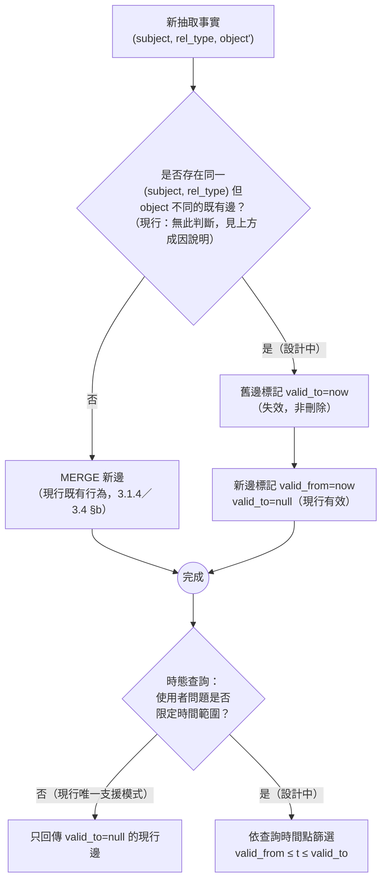
```mermaid
flowchart TD
    NEWFACT["新抽取事實<br/>(subject, rel_type, object')"] --> CONFLICT{"是否存在同一<br/>(subject, rel_type) 但<br/>object 不同的既有邊？<br/>（現行：無此判斷，見上方成因說明）"}
    CONFLICT -->|否| CREATE5["MERGE 新邊<br/>（現行既有行為，3.1.4／3.4 §b）"]
    CONFLICT -->|"是（設計中）"| TAGOLD["舊邊標記 valid_to=now<br/>（失效，非刪除）"]
    TAGOLD --> CREATENEW["新邊標記 valid_from=now<br/>valid_to=null（現行有效）"]
    CREATE5 --> DONE5(("完成"))
    CREATENEW --> DONE5
    DONE5 --> QTIME{"時態查詢：<br/>使用者問題是否<br/>限定時間範圍？"}
    QTIME -->|否（現行唯一支援模式）| QNOW["只回傳 valid_to=null 的現行邊"]
    QTIME -->|"是（設計中）"| QAS["依查詢時間點篩選<br/>valid_from ≤ t ≤ valid_to"]
```

> **注意**：此圖 `CONFLICT`／`TAGOLD`／`CREATENEW`／`QTIME`／`QAS` 皆為**設計提案，非現行系統行為**——現行系統只有 `CREATE5` 這條路徑（見上方成因說明），連 `CONFLICT` 判斷本身都不存在。若 RQ5 納入正式貢獻，需要在 Neo4j 關係邊新增 `valid_from`/`valid_to` 時間戳屬性、在 `merge_triples_to_graph()` 新增衝突偵測（同 subject+rel_type、不同 object 時觸發，而非現行的完全相等才判斷）、在 `bfs_query()` 新增時態過濾邏輯，三者目前皆為 stub。
>
> **文獻依據**：`docs/報告/03_核心架構藍圖.md` 痛點 5 最初參考 **Zep/Graphiti**（Rasmussen et al., 2025，見 `docs/ARCHITECTURE.md`「時序管理」決策），但該版本查證方式僅到 WebSearch 確認存在性，未下載全文。01 緒論正式定案 RQ5 時改以 **T-GRAG**（Li et al., 2025，🟢 ACM Multimedia 2025，已下載全文 `docs/參考文獻/02_RAG與GraphRAG/li-et-al-2025-t-grag.pdf`）作為核心文獻——兩者皆屬「雙時態知識圖譜」（bi-temporal KG）這個大方向，第二章文獻探討 2.4.6 節已定案採用 T-GRAG 為核心引用，Zep/Graphiti 因未下載全文暫不並列佐證，此處誠實記錄兩個版本引用不一致的既有落差，避免之後誤以為是本次新增的錯誤。
>
> **參考專案（2026-07-23 補齊，本論文查得最高星數的參考專案，完整查證見第二章 2.4.6）**：Zep 對應的開源實作 **Graphiti**（[getzep/graphiti](https://github.com/getzep/graphiti)，29,096★）核心資料模型正是「邊上標記時間戳、舊事實標記失效而非刪除」，與本節設計高度吻合——Zep **論文**未全文核實不影響 Graphiti **專案**作為「雙時態邊在生產系統可被實作」的獨立佐證，兩條證據鏈需分開看待，不可因論文查證缺口連帶低估專案佐證的價值。T-GRAG 本身查無公開程式碼，若後續實作建議同時參照兩者。
>
> **與 3.4 §b 的分工**：3.4 §b 的 `RECHECK`／`UPDATENAME` 處理的是「同一實體該用哪個名字」隨語料持續加入而更新（標準名漂移）；本節處理的是「同一事實隨時間改變」（事實本身的有效期）。兩者都涉及「舊資訊要不要保留」，但一個是實體指稱層級、一個是事實內容層級，機制上彼此獨立，不應合併討論。
>
> **本節與 RQ1（多跳推理）的交互影響（風險提示）**：若採「保留歷史」策略，圖中會同時存在同一 subject+rel_type 的多條時態邊，BFS 遍歷若不加時態過濾，路徑數量會比現行「事實層級去重後只留一條邊」的基準線更多——RQ5 若納入正式貢獻，RQ1 的實驗基準線需要重新界定是否要處理時態邊，否則兩個 RQ 的實驗結果可能互相污染，這點需要在第五章實驗設計時明確處理，本節僅先標示風險。

## 3.6 自我精煉檢索迴圈（對應 RQ3）

單輪 BFS 檢索的問題：若種子實體提取不完整或問題本身需要跨圖多跳才能回答，第一輪檢索到的 Context 可能不足以支撐正確回答，此時直接生成容易產生幻覺。本論文設計信心門檻觸發的自我精煉迴圈，在生成後評估回答信心，信心不足時回補檢索範圍、再次生成，直到信心達標或達輪數上限。

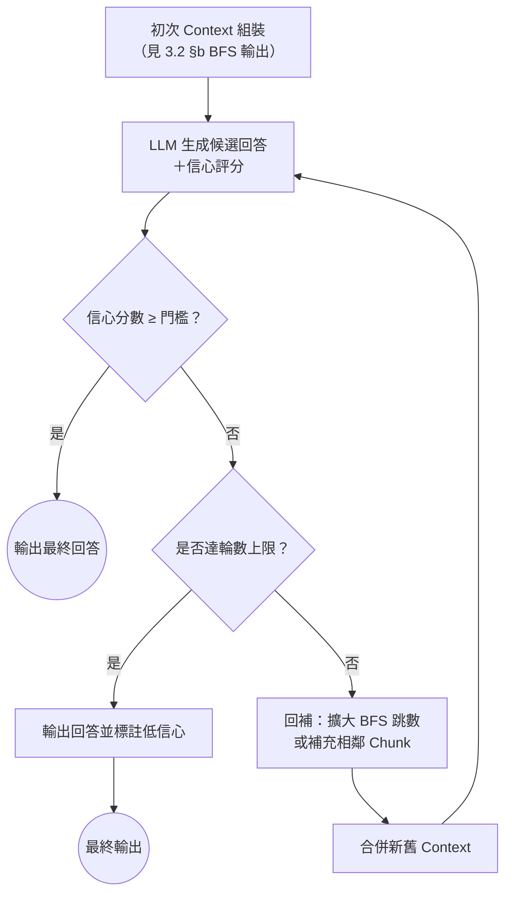
```mermaid
flowchart TD
    CTX["初次 Context 組裝<br/>（見 3.2 §b BFS 輸出）"] --> GEN["LLM 生成候選回答<br/>＋信心評分"]
    GEN --> CONF{"信心分數 ≥ 門檻？"}
    CONF -->|是| FINAL(("輸出最終回答"))
    CONF -->|否| ROUND{"是否達輪數上限？"}
    ROUND -->|是| FINALLOW["輸出回答並標註低信心"]
    ROUND -->|否| RETRIEVE["回補：擴大 BFS 跳數<br/>或補充相鄰 Chunk"]
    RETRIEVE --> MERGE3["合併新舊 Context"]
    MERGE3 --> GEN
    FINALLOW --> OUT(("最終輸出"))
```

> **注意**：本設計延伸 Self-RAG（Asai et al., 2023）、FLARE（Jiang et al., 2023）、IRCoT（Trivedi et al., 2022）等主動式/反思式檢索文獻的評估範疇（見第二章 2.4.7），但機制上有明確差異——這三篇文獻皆作用在**自由文字段落**的檢索與生成上；本論文的自我精煉迴圈作用在**結構化三元組 Context**上，回補動作是「擴大 BFS 跳數」而非「重新檢索段落」，且信心評分與圖遍歷的信心（如命中種子實體數、路徑長度）綁定，而非純粹依賴生成模型自身的 token 機率。此差異需要在第二章 2.3 比較表與正文中明確寫出，不能只是條列式帶過。
>
> 「信心門檻」與「輪數上限」的具體數值屬於工程參數，需要在第五章消融實驗中做敏感度分析，本節僅描述機制設計，不預設最終參數值。
>
> **參考專案（2026-07-23 補齊，完整查證見第二章 2.4.7）**：Self-RAG（[AkariAsai/self-rag](https://github.com/AkariAsai/self-rag)，2,410★）、FLARE（[jzbjyb/FLARE](https://github.com/jzbjyb/FLARE)，669★）、IRCoT（[StonyBrookNLP/ircot](https://github.com/StonyBrookNLP/ircot)，272★）皆有官方程式碼，但三者皆針對自由文字段落、未實作圖結構檢索，與本節作用於三元組 Context 的機制不同——參考價值僅止於觸發邏輯的實作範例，本節機制本身仍屬第三章 3.8 節「本論文自行設計的工程決策」。

## 3.7 向量引導圖剪枝（對應 RQ6，預留）

**本節內容目前不存在對應實作**，是四項待驗證研究問題中風險最高的一項（去留已於第一章 1.2 節聲明「暫緩，待 RQ1-3 進度明朗後再評估」）。現行系統在 BFS 遍歷命中高連結度節點（Hub Node）時，一律採 naive 硬截斷（`_PER_SEED_FACT_LIMIT=20`），不區分被截斷的三元組與查詢問題的相關性——這正是第二章 2.4.8 討論的「Static Graph Fallacy」（Lau et al., 2026）：索引時固定的圖結構忽略了查詢依賴的邊相關性，導致遍歷被引導至高連結度但與當前問題無關的節點。

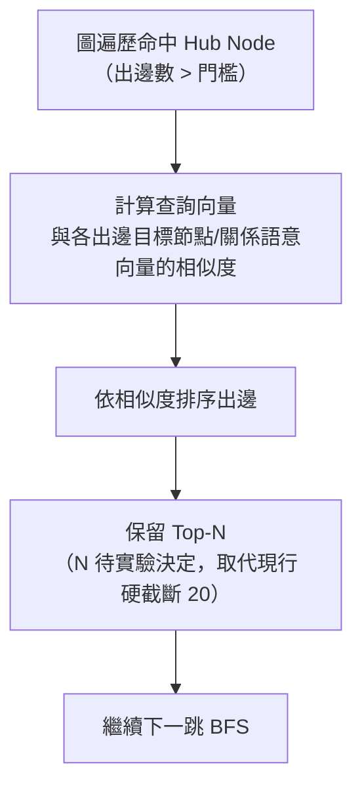
```mermaid
flowchart TD
    NODE["圖遍歷命中 Hub Node<br/>（出邊數 > 門檻）"] --> QVEC["計算查詢向量<br/>與各出邊目標節點/關係語意向量的相似度"]
    QVEC --> RANK3["依相似度排序出邊"]
    RANK3 --> TOPN["保留 Top-N<br/>（N 待實驗決定，取代現行硬截斷 20）"]
    TOPN --> CONT["繼續下一跳 BFS"]
```

> **注意**：此圖為**設計提案**，非現行系統行為（現行行為見 3.2 §b 的 `CUT` 節點）。PathRAG（Chen et al., 2025）的流量式剪枝（flow-based pruning）與 CatRAG（Lau et al., 2026）的查詢自適應遍歷是本設計最直接的文獻對照對象（見第二章 2.4.8），但兩者皆非本論文的技術棧（Neo4j + Cypher BFS）下的現成實作，若 RQ6 最終納入正式貢獻，需要自行實作並與 naive 硬截斷做消融比較，而非直接沿用兩篇文獻的程式碼。若 RQ1-3 進度不允許納入 RQ6，本節將改寫為「未來工作」並移至第七章（見第一章 1.4.2）。**參考專案（2026-07-23 補齊，完整查證見第二章 2.4.8）**：PathRAG 有官方程式碼（[BUPT-GAMMA/PathRAG](https://github.com/BUPT-GAMMA/PathRAG)，375★）可對照；**CatRAG 查無可信的公開程式碼**，本節若採 CatRAG 精神將完全依賴論文文字描述、無程式碼可對照，是本節與第一章已標註「風險最高」判斷的具體佐證之一。

## 3.8 研究方法論說明

依 v1 報告五.1/五.2 已建立的誠實框架，本論文的技術決策分兩類，需在正文中明確標示，不可混為一談：

- **借用既有理論**：路由層之外的圖遍歷正確性（Cypher BFS 語意）、公用實體/關係類型庫的具體內容依據（OntoNotes、ConceptNet 5.5，2026-07-24 取代原本的 Schema.org 結構/語意驗證兩步機制類比，見 3.1.3／3.3 節說明）、查詢時關係連結機制的相似度比對精神（STAGG，見 3.2 §c）、自我精煉迴圈的信心觸發機制脈絡（Self-RAG/FLARE/IRCoT）、事實時序保留策略的雙時態邊設計精神（T-GRAG／Zep-Graphiti，RQ5，見 3.5 節文獻依據說明），皆有明確文獻可引用佐證設計動機，但**具體實作皆為本論文自行設計**，並非直接套用文獻中的演算法或程式碼。
- **本論文自行設計的工程決策**：雙層路由架構（RQ1/RQ2）、文件內／跨文件實體別名消解機制（RQ4b，預留——CORE-KG 雖已驗證「指代消解前置於切塊」的大方向，但其登記表比對＋分級 LLM 仲裁的具體機制為本論文自行設計，非直接沿用）、事實衝突偵測與時態查詢過濾的具體機制（RQ5，預留，T-GRAG／Zep-Graphiti僅提供雙時態邊的概念方向，衝突偵測邏輯與查詢過濾實作為本論文自行設計）、向量引導剪枝的相似度計算方式（RQ6，預留）等，目前業界與學界皆無現成解法可直接採用（見第二章文獻定位分析與 `docs/報告/03_核心架構藍圖.md` 痛點分類），這正是本論文宣稱研究貢獻之處。

**實驗可追溯性承諾**：依 `docs/ARCHITECTURE.md`「實驗可追溯性規範」（2026-07-13 決策），第五章的每次實驗執行皆須記錄 git commit hash／分支、完整參數快照、測試案例集版本、原始輸出路徑四項資訊，以 JSON/YAML manifest 形式與實驗結果一併保存，不引入 MLflow 等重量級 MLOps 平台。此規範同時支撐 RQ2／RQ3 的可追溯性次要指標評估。

**消融實驗設計原則**：RQ1-RQ3（確定）與 RQ4a/RQ4b/RQ5/RQ6（預留）的實驗設計皆遵循「單一變因控制」原則——例如 RQ2 驗證路由層時，知識層（BFS）與生成模型應保持固定，只切換「有無路由層」或路由層的門檻參數；RQ6（若納入）驗證剪枝策略時，路由層與受控詞彙集應保持固定，只切換「naive 硬截斷 vs. 向量引導剪枝」。完整的組別設計、baseline 與資料集留待第五章展開，本章僅聲明此為貫穿全部消融實驗的共同原則。
