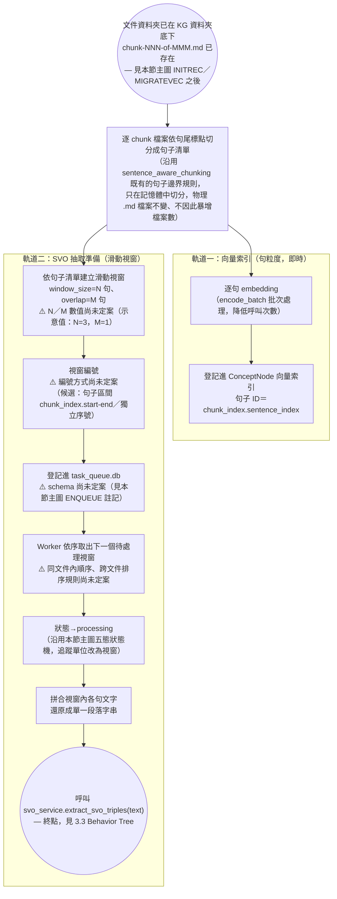

# 第三章：變更紀錄與已評估但未採用的設計方案

> 本檔案是 [`03_系統設計與方法論.md`](03_系統設計與方法論.md) 的附屬紀錄，收納兩類內容：① 逐日變更歷程（供追溯查證，非正文必讀）；② 已評估但最終未採用的設計草案（保留完整推理過程，供理解「為什麼沒有選這條路」）。正文只保留最終定案的設計與一句指向本檔案的連結，不影響正文的可讀性。

---

## 一、變更歷程

### 2026-07-16

- 首次填實 3.1.1／3.1.2 暫存區歸檔與抽取斷點續傳細節。
- 3.1.1/3.1.2 改為「文件資料夾實際搬移＋資料夾內記錄檔狀態機」設計，補齊四項暫存區功能：①自動分配 ②無適合則留存 ③手動分配 ④使用者觸發 AI 分群建議＋審核。④ 的審核機制定案為「名稱與檔案清單分開審核、皆可先微調再確認」。重新歸屬的邊界案例亦已定案：軌道二（SVO／圖譜）不遷移、對新 KG 完整重跑抽取；軌道一（向量化）直接遷移。
- 3.1.1 的分類分數計算與 AI 自動分群機制，從「直接沿用 v1」改為「以驗證文獻/專案為主要參考起點」：
  - 分數計算改採 **Prototypical Networks**（Snell et al., 2017）centroid 相似度，捨棄 v1 `concept_engine.compute_match_score()` 的 align/magnitude 加權——查證後發現該公式的兩個標量從初始化後從未被更新過（恆為常數），代入後整條公式數學上等價於「0.7 × 平均 cosine 相似度」，個人化設計意圖從未實際生效。
  - AI 分群改採 **HDBSCAN**（McInnes et al., 2017，`min_cluster_size=3`）取代 v1 門檻式連通分量分群（已知有連鎖效應缺陷）。
  - 命名輸入篩選改採 **Khandelwal (2025)** 驗證表現最佳的主導子群法，取代 v1 未經篩選的 `filenames[:10]` 做法。
  - 新增 3.1.1 §a 專門展開此分群機制的 Behavior Tree。
- 3.1.1 完成實作與測試：`parser/chunk_writer.py` 改為逐文件獨立資料夾，新增 `services/document_record_service.py`／`services/classify_service.py`／`services/cluster_service.py`／`routers/staging.py` 端點，122 項 pytest 測試通過。實作過程中發現 HDBSCAN 需加上 `allow_single_cluster=True` 參數才能正確辨識「未分配池裡唯一結構恰好達 `min_cluster_size`」的情境，已同步更新 §a 說明與 `docs/報告/技術參考地圖.md`。

### 2026-07-17

- 為 3.1.1／§a 查證可信任專案背書並提出優化建議：分類分數額外對照 **semantic-router**（Aurelio Labs）驗證「embedding 相似度離散路由」是業界已實際部署的模式，但誠實區分其即時 kNN 機制與本論文 centroid prototype 機制的差異；AI 分群額外對照 **BERTopic**（Grootendorst, 2022）驗證「HDBSCAN＋LLM 命名」整條管線的產業實例，並誠實標註本論文未如 BERTopic 於 HDBSCAN 前做 UMAP 降維的落差；另查證 **Paperless-ngx** 的 ML 自動分類機制，確認其無信心分級/建議層設計，故將 3.1.1 主圖的三層信心分級機制明確定位為本論文自行提出的工程決策。完整查證過程見第二章 2.4 節，優化建議清單見 3.1.1 節文末。
- 校正 3.1 總覽 BT 的向量化時序：3.1.1 §CMP 節點計算分類分數時需使用已算好的 chunk 向量，總覽圖原本把「向量化」畫成暫存區分類**之後**才分岔出的軌道一，與此矛盾；已改為向量化緊接解析之後、分類之前，分類後的軌道一改為「向量索引登記」（僅登記歸屬 kg_id，不重算），與 3.1.2 節「向量化結果直接遷移、不需重新向量化」的既有敘述一致。向量化本身的實作細節與文獻佐證另立 `core/providers/embedding/README.md` 收納，不寫入本章正文——向量化不是本論文的研究貢獻。

### 2026-07-20

- 逐項處理 3.1.1 優化建議並補齊 RQ4 替代文獻：六項優化建議中，prototype／文件向量快取、同批次 prototype 過時、搬移與記錄檔無交易保護三項已修正；新建 KG 最小成員數不對稱改以 `low_confidence` 標記緩解；HDBSCAN 未做降維前處理已補上條件式 UMAP 降維（McInnes, Healy, Saul & Großberger, 2018，池規模 ≥20 才套用）；未分配池 O(n²) 擴展性補上規模達 500 的觀測性警告（非解決演算法複雜度本身）。RQ4（受控語意關係詞彙）方面，Guha et al.（2016）Schema.org 全文再次確認無合法免費全文，改查證並精讀開放取用的 Vrandečić & Krötzsch（2014）《Wikidata》（CACM）作為部分替代佐證。完整查證過程見第二章 2.1.3 節。
- 重新對照現行程式碼逐段檢查 3.1.1 輸出到 SVO 抽取開始之間的銜接，發現並修正兩個缺口：`parser/chunk_writer.py` 早已改為逐文件獨立資料夾，但正文描述舊行為（攤平寫入）的落差說明未同步更新，已移除；更關鍵的是「使用者上傳→切塊→寫入暫存區→記錄檔初始化」這段上游管線先前完全沒有真正端點串接（`routers/documents.py` 僅有除錯用、不落地的 `debug-parse` 端點），已新增 `services/ingestion_service.py::chunk_and_stage()` 與 `POST /documents/upload`／`POST /documents/ingest-url` 補齊。
- 開始正式設計討論 3.1.2（範圍界定為「3.1.1 指派完成」到「SVO 抽取正式呼叫」之間的銜接，不含抽取演算法本身）：確認向量索引與 SVO 抽取不該共用同一種切塊粒度，新增 3.1.2 §a 記錄整合方案草稿（句子級向量索引＋滑動視窗式 SVO 抽取）。
- 深入查證本體論式（ontology-guided）受控詞彙抽取的專門文獻：確認 GraphRAG／LightRAG 的統一大切塊慣例屬開放式抽取、不適用本節受控場景；查到 **Text2KGBench**（Mihindukulasooriya et al., 2023, ISWC 2023）作為唯一直接對應任務類型的專門 benchmark，其句子級切分為既有學術慣例，但論文自承跨句指代消解會導致漏抽且選擇迴避而非解決；查到 **CORE-KG**（Meher, Domeniconi & Correa-Cabrera, 2025）提出「指代消解前置於切塊之前」的解法並有量化消融驗證（節點重複率 -28.25%），是與滑動視窗不同的技術路線。內容主體整合自 v1 `docs/報告/01_專案總覽_是什麼為什麼怎麼做.md` 第三章「怎麼做」、`docs/ARCHITECTURE.md` 決策紀錄、`docs/報告/01_本地抽取與混合架構評估.md` 第四節、`core/constants.py` 現行參數，並依 1.5 節待辦完成 RQ 編號校正。
- 使用者提出「跨句指代消解只解決代名詞、未解決實體別名（全稱/簡稱/縮寫）」的關鍵質疑後，設計方向確定為**指代消解前置法**，並進一步討論「實體別名消解是否該正式列為新 RQ」——決定不新增 RQ7（1.2 節已自承六個 RQ 對碩士論文工作量偏重，RQ5-6 仍為預留觀察中，不宜再加），改將其併入 RQ4，拆為 **RQ4a**（原 RQ4，受控語意關係詞彙標準化）與 **RQ4b**（新增，實體指代與別名消解），新增 **3.4 節「實體指代與別名消解」**，原 3.4/3.5/3.6 節依序後移為 3.5/3.6/3.7；3.1.2 §a 的滑動視窗草案保留作設計過程紀錄、標註已被 3.4 節取代（完整草案見下方「二、已評估但未採用的設計方案」）。
- （本次調整）依使用者要求重新審視 3.1／3.1.1／3.1.2 段落的可讀性，發現正文開頭的變更歷史已膨脹為超過千字的流水帳、且 3.1.2 §a 的整段已取代草案仍留在主要閱讀路徑上，將兩者移出獨立成本檔案；3.1.2 現存的六段旁註精簡為四段，移除與 3.1 節開頭「架構圖表繪製慣例」重複的「與其他圖的分工」meta 註解。

### 2026-07-20（第二次調整，同日）——3.1 拆分為完整流程小節、確立「3.1 描述流程／3.x 描述 RQ」分工原則

使用者審視完第一次調整後，進一步提出：3.1.2 目前的「終點」是把任務丟進佇列後就指向外部的 3.3（RQ4a），讀者得跳出 3.1 才看得到抽取怎麼跑，寫入/去重步驟又只在 3.1 總覽圖與 3.1.2 的 `WRITE` 節點各自簡略帶過，同一件事分散在三個地方講一半。確立分工原則：**3.1（含 3.1.1-3.1.4）純粹描述建圖流程本身的機制與運作，不深入個別 RQ 的設計原理與文獻佐證；3.2 之後每節對應一個 RQ，說明該 RQ 的作法、原理與參考文獻，並依 RQ 對應回第二章**。具體調整：

- 新增 **3.1.3 抽取過程**：把原 3.3（RQ4a）的 Behavior Tree（LLM 抽取→比對 `SVO_REL_TYPES`→結構/語意驗證→產出 SVOTriple）與 `SVO_REL_TYPES` 30 類的事實描述搬到這裡，作為純流程說明；3.3 保留「為什麼選受控詞彙而非開放抽取」的理論動機（Vashishth et al. 2018 CESI）、Schema.org／Wikidata 文獻佐證、RQ4a 的 trade-off 論證，並改為指回 3.1.3 看機制本身，不重複展開圖。
- 新增 **3.1.4 抽取後續**：把原本散落在 3.1 總覽圖（`DEDUP`／`MERGE`／`CREATE` 節點）與 3.1.2 的 `WRITE` 節點的寫入知識圖譜／實體對齊去重步驟，集中在此獨立小節完整展開為 Behavior Tree；基準去重機制（編輯距離→cosine≥0.88，`docs/ARCHITECTURE.md` 2026-07-10 決策）在此呈現，RQ4b 的 LLM 仲裁擴充（`ESCALATE`）與別名記錄（`surface_form`）維持在 3.4 §b，3.1.4 只做指標引用。
- **3.1.2 的終點改為「開始抽取」**：診斷/重試/寫入相關節點（`RESULT`／`UPLOAD`／`FAIL`／`WRITE`／`DONE`／`NEXT`／`IDLE`）搬到 3.1.3／3.1.4，3.1.2 的 Behavior Tree 在 Worker 把狀態轉為 `processing` 後即以 `HANDOFF` 終端節點收尾；五態狀態機的**定義**仍由 3.1.2 統一負責，因為即使部分狀態轉換實際由 3.1.3／3.1.4 觸發。
- 3.1 總覽圖大幅簡化：`QUEUE` 雙框節點原本同時指向「3.1.2＋3.3」，改為指向「3.1.2／3.1.3／3.1.4」三個流程小節；原本內嵌在總覽圖裡的 `DEDUP`／`MERGE`／`CREATE` 三個節點整段移除，改由 `QUEUE` 直接連到 `KG`，細節收斂到 3.1.4。
- **RQ 對應維持不變**（見下方最新版本）——因為 RQ4a／RQ4b 仍各自保有獨立的「原理＋文獻」小節，只是其對應的機制流程圖被搬進 3.1，不需要連鎖重編後續章節編號，`01_緒論.md`／`附錄與參考文獻.md`／`docs/報告/05_指代消解與前處理任務書.md` 等外部檔案的章節引用皆不受影響。

### 2026-07-21（第三次調整，同日）——3.4 §a 新增動態標準名提升機制，查證並修訂 09 報告

- 延續 `docs/報告/09_實體別名登記與動態標準名提升機制設計報告.md`（同日稍早定案）提出的「動態標準名提升（原稿：長度優先三規則 PK 比試）」構想，使用者要求「先查證方法可行性、有清楚的參考專案與文獻背書，確認後再記錄文獻並整合進 3.4」。
- **第一輪查證**：09 報告原引用的 7 項佐證（spaCy `EntityLinker`／fastcoref／Microsoft GraphRAG Entity Dictionary／CORE-KG／Text2KGBench／CESI／Wikidata）逐一查證後，**沒有一項描述三規則 PK 比試演算法本身**，其中 spaCy（精確字串比對連結靜態 KB）、Microsoft GraphRAG（title/type 完全相同才合併，交由 LLM 摘要）、CESI（頻率加權質心）、Wikidata（社群共識最常用名稱）四項是明確採用不同方法，構成 CONTRADICTS 而非單純空白。
- 使用者釐清真正目標比 09 報告原稿更廣：不只是文件內標準名選取，還要**建立持久化的跨文件實體別名圖譜，隨新文件與查詢持續擴增**。**第二輪查證**換方向搜尋「跨文件增量聚類」文獻，找到 3 篇架構層面真正吻合的先例：Rao, McNamee & Dredze（2010，COLING，串流式跨文件指代消解先驅）、Ji, Grishman & Dang（2011，TAC-KBP Entity Linking track，NIL clustering 官方機制）、Saeedi, Peukert & Rahm（2020，ESWC，知識圖譜場景增量式多來源實體對齊／FAMER 框架）——三篇皆開放取用，已下載至新資料夾 `docs/參考文獻/10_跨文件實體別名消解與增量聚類/`。但三篇同樣**未描述**標準名選取規則本身。
- 使用者以「泰國 vs. 罕用正式全名」為例，指出原本「長度優先」規則會誤選字面較長但實際罕用的形式，因而定案改為**「出現頻率優先，長度僅作平手時的次要規則」**——此規則改為呼應已查證過的 Wikidata（社群共識最常用名稱）與 CESI（頻率加權質心）兩篇文獻的方向，比原長度優先規則更有文獻基礎；但「頻率優先＋長度平手次規則」這個完整組合本身仍查無直接文獻先例，長度 tie-breaker 部分依 3.7 節框架標註為本論文自行設計。
- 已完成的整合動作：① 新增 `docs/參考文獻/10_跨文件實體別名消解與增量聚類/README.md` 並下載 3 篇 PDF，同步更新 `docs/參考文獻/README.md` 與 `docs/論文/附錄與參考文獻.md`；② 全面修訂 `docs/報告/09_實體別名登記與動態標準名提升機制設計報告.md`（登記表資料結構改為 `alias_counts` 頻率字典、演算法改為頻率優先＋長度次要、第 6 節文獻佐證改寫為架構層／規則層兩層誠實框架＋「已查證但不適用」清單）；③ 3.4 §a Behavior Tree 新增 `PROMOTE`／`SWAPKEY`／`KEEPKEY` 節點與對應文字說明；④ 3.4 §b「Entity.name 選取規則」由原本「待決策」改為定案（同一套頻率優先規則，資料來源換成跨文件累積的 `surface_form` 統計），並新增「跨文件持續擴增架構定位」段落引用上述 3 篇新文獻。
- **尚未決定、留待後續討論**：`Entity.aliases` 該持久化為節點陣列屬性（09 報告原提案），還是維持純粹由 `surface_form` 邊屬性動態查詢衍生——兩者是不同的資料模型取捨，3.4 §b 已明確標註為新的待決策項目；「查詢時使用者新稱呼也應擴增別名圖譜」這個使用者提出的目標，目前尚未設計具體機制，僅記錄於此，未寫入 3.4 正文。

### 2026-07-21（第四次調整，同日）——拆分「文件內暫定標準名」與「跨文件真正標準名」兩個權威層級

- 使用者重新檢視上一輪的「頻率優先」規則後，指出一個更根本的問題：單一文件內某個別名出現頻率高，不等於它是實體被廣泛認可的通用標準名——可能只是這份文件/這位作者自己的行文習慣（範圍內簡稱）。若把單一文件的局部頻率直接當成最終標準名，標準名會隨文件來源飄移，違背 RQ4b「跨文件語意一致」的核心目標本身。
- 確認調整方向：**§a（文件內）的頻率優先機制降級為「暫時性局部正規化」**，其輸出（文件內暫定標準名）只服務這份文件自身的處理（代名詞消解、SVO 切塊分組），不直接寫入 `Entity.name`；**§b（跨文件）才是真正的權威層**，每次三元組合併進既有實體後，重新聚合該實體所有 `HAS_ENTITY` 邊的 `surface_form` 跨文件累積次數，套用與 §a 相同的規則（頻率優先、長度次要、保留現狀最終 tie-break），決定是否更新 `Entity.name`——同一實體要在夠多不同文件中都被稱為某個名稱，才會讓它成為標準名。
- 此拆分讓機制與已查證的架構文獻（Rao 2010／TAC-KBP／Saeedi 2020）貼合度更高：這三篇描述的本來就是「跨文件/跨資料源、隨資料累積持續修正」的決策過程，套用在跨文件層級（§b）比先前套用在單一文件內（§a）更符合文獻原本的場景。
- 已完成的整合動作：① `03_系統設計與方法論.md` § 3.4 §a 新增「本節輸出僅為文件內暫定標準名，非最終權威」警示段落；② §b Behavior Tree 新增 `RECHECK`／`UPDATENAME` 節點，文字說明改寫為「§a 的輸出不是最終標準名——§b 才是真正的權威層」，並新增效能待決策（每次合併都重新聚合全部邊，規模變大後可能有效能疑慮，留待第四章/第五章評估）；③ `09_實體別名登記與動態標準名提升機制設計報告.md` 同步修訂：第 2 節新增範圍註記、第 3 節新增「僅限單一文件範圍」警示、第 4 節拆分為「4.1 首次寫入（暫定值）／4.2 surface_form 記錄／4.3 跨文件標準名更新（真正權威層）」、第 5 節新增 `recompute_canonical_name()` 模組規劃。
- **仍未決定**：`RECHECK` 每次合併都同步重新聚合的效能疑慮（是否需要批次/週期性重算）留待第四章實作與第五章消融實驗；「查詢時使用者新稱呼也應擴增別名圖譜」的具體機制仍未設計。

### 2026-07-21（第五次調整，同日）——盤點 3.1.2/3.4 缺口，查證並修訂 07/10 報告，實作落地＋測試

- 使用者要求盤點 3.1.2（含 3.4）目前還有哪些缺口需要專案/文獻支持，以及 07-10 報告裡「建議優化」的部分是否也需要查證；確認後即完成程式實作並測試。
- **缺口盤點**（詳見 `docs/報告/06_SVO抽取管線調整任務書.md` 第 3 節）：多數缺口屬純工程決策（不需外部文獻，只需拍板），使用者確認 4 項皆採推薦方案——① 標準化句子/SVO chunk 落地存檔（`svo_index.json`）；② `SVOTriple` 新增 `source_sentence_range` 追溯欄位；③ 3.4 §a 標準化流程做斷點續傳；④ `Entity.aliases` 存成節點陣列屬性（而非純查詢衍生）。
- **07/10 報告查證**：延續 09 報告的查證標準，查出 10 報告引用 Stanford CoreNLP（2014）「證實過濾 80% 無代詞句子降低 LLM 呼叫成本」查無出處、2014 年語境不可能討論 LLM 成本，**確認為疑似編造，整條移除**；CORE-KG 機制描述張冠李戴（原稿誤植為「前置 Pronoun 掃描器」，實際是逐實體類型循序 LLM prompt）；07 報告的 LangChain `SemanticChunker`「業界廣泛驗證」與 GraphRAG「強烈建議依實體關係密度調整」兩條查無出處，皆已訂正或移除。09/07/10 三份報告的狀態由「🟢 定案」降級為「🟡 設計提案／部分已實作」，解除暫緩；08 報告因涉及 RQ1/RQ2 範疇界定（非文獻問題）維持暫緩。
- **程式實作與測試**（詳見 `docs/報告/06_SVO抽取管線調整任務書.md` 第 4 節）：
  - 新增 `services/entity_registry_service.py`——3.4 §a 文件內實體別名登記表本體，含 `should_promote()`（頻率優先＋長度次要 PK 規則）、規則式別名比對（子字串/縮寫）、LLM 仲裁 hook、`apply_registry()` 整合入口、斷點續傳快照讀寫；測試 17 項全數通過（`tests/services/test_entity_registry_service.py`）。
  - `services/svo_chunking.py` 新增 `max_sentences` 參數（預設 5），`DEFAULT_SVO_CHUNK_SIZE` 由 500 改為 300，對應 3.4 §a `SVOGROUP` 節點「5 句或 300 字元先到者為準」的定案；既有 6 項測試維持通過，新增 3 項測試。
  - `services/svo_service.py` 新增實體對齊/去重完整實作（3.1.4 DEDUP4／3.4 §b ESCALATE＋RECHECK）：`resolve_entity_name()`（編輯距離→cosine→LLM 仲裁三段式）、`merge_entity()`（含跨文件標準名動態更新與 `alias_counts_json`／`aliases` 屬性維護）；`core/constants.py` 新增三個門檻常數（`ENTITY_DEDUP_EDIT_RATIO_THRESHOLD=0.70`／`ENTITY_DEDUP_COSINE_THRESHOLD=0.88`／`ENTITY_DEDUP_ESCALATE_LOW_THRESHOLD=0.75`，皆為未驗證工程預設）；既有 4 項測試更新、新增 10 項測試（含 `InMemoryEntityDriver` 模擬 MERGE／改名狀態），共 14 項全數通過。
  - 全專案測試套件執行結果：212 項通過，1 項既有錯誤（`tests/run_downloads_test.py`，與本次改動無關的既有 fixture 問題，非本次引入）。
- **仍未實作／留待後續**：`Entity.aliases` 對外查詢 API；`RECHECK` 效能優化（批次/週期性重算，非每次同步觸發）；10 報告的雙軌 POS/正則代名詞檢測本身（僅完成文獻訂正，尚待與 05 任務書整合）；具名提及抽取（NER）與代名詞消解模組的端到端串接。

### 2026-07-21（第六次調整，同日）——比對 3.1.2/3.4 程式碼與論文規格，發現並修正 RECORD3B 資料模型落差

- 使用者要求檢查 3.1.2（含 3.4）的程式是否符合論文標準、測試是否通過。逐節比對 Behavior Tree 節點與實際程式碼後，發現一項需要處理的落差、與三項尚未實作的既有已知缺口：
  1. **🔴 `RECORD3B` 資料模型與論文文字描述不一致**：論文明確描述 `(Chunk)-[:HAS_ENTITY {surface_form}]->(Entity)` 邊＋`MATCH (c)-[r:HAS_ENTITY]->(e) RETURN r.surface_form, count(*)` 聚合查詢，但第五次調整時的實作走了捷徑，直接把別名頻率存成 Entity 節點上的 `alias_counts_json`（JSON 字串屬性），未建立 Chunk 節點或 HAS_ENTITY 邊——功能上達成同樣的頻率優先判斷，但資料模型與文字描述矛盾，且 3.1 總覽圖本來就把「Chunk --HAS_ENTITY--> Entity」列為全系統的核心雙層圖結構（非只是別名機制的附帶細節）。
  2. 3.1.2 的 `GETSENT` 三層判斷（sentences.json／original.md 重切／重新解析）只有寫入端，沒有對應的讀取端函式。
  3. `task_queue.db` 完全未實作，`ENQUEUE`／`RESTART`／`TRUST`／`SCAN`／`REBUILD` 這幾個節點目前只有記錄檔追蹤，沒有效能索引層。
  4. `CHUNKREADY` 沒有端到端串接：`entity_registry_service.apply_registry()` 與 `svo_chunking.build_svo_chunks()` 各自獨立測試通過，但沒有管線函式把兩者（與尚未實作的代名詞消解模組）接起來。
- 依使用者指示優先處理第 1 項：`services/svo_service.py` 改寫為真正的 Chunk／HAS_ENTITY 邊架構——新增 `_merge_chunk_mention()`（MERGE Chunk 節點＋`HAS_ENTITY {surface_form}` 邊，鍵為 `(chunk, entity, surface_form)`，同一 chunk 內重複提及同一別名不重複計數）、`_aggregate_alias_counts()`（對應論文 Cypher 範例的聚合查詢）；`merge_entity()` 改為呼叫這兩者取代原本的 JSON 屬性讀寫；`Entity.aliases` 改為聚合查詢後的快取陣列（權威來源是 HAS_ENTITY 邊本身，不再是這個陣列）。`_fetch_entity_candidates()` 同步簡化（不再需要回傳 alias_counts_json）。
- 測試同步改寫：`InMemoryEntityDriver` 改為模擬 Entity／Chunk 節點與 HAS_ENTITY 邊的完整聚合狀態；`merge_entity` 相關測試改用不同 `source_doc_id`／`chunk_index` 模擬跨文件/跨 chunk 提及（同一 chunk 重複提及不應重複計數，是刻意的頻率語意）；新增「無 chunk 追溯資訊時退化為單純 MERGE」與「HAS_ENTITY 邊確實記錄 surface_form」兩項測試。`tests/services/test_svo_service.py` 共 16 項全數通過；全專案測試套件 212 項通過（不含既有無關的 `tests/run_downloads_test.py` 錯誤）。
- 論文 3.4 §b 同步更新「實作現況」段落，明確記錄「初版實作與文字描述不一致、已修正」的過程，不掩蓋這次落差。
- **第 2/3/4 項落差本次未處理**，留待後續依優先順序決定是否要做。

### 2026-07-21（第七次調整，同日）——補齊 GETSENT／task_queue.db／代名詞消解／CHUNKREADY 端到端串接

- 使用者要求繼續完成第六次調整標記為「已知缺口但確定要做」的第 2/3/4 項，若遇疑問項目先討論。
- **代名詞消解機制選擇（唯一需要討論的問題）**：05 任務書原始設計是單一正則 `PRONOUN_PATTERN`，已知會誤觸發於「其他/其中/其實/應該」等常見詞；10 報告提出的 POS＋正則雙軌比對正是為修正此限制而設計。使用者確認採用 10 報告方案（推薦選項）。
- **已完成並測試**：
  1. **`GETSENT` 讀取端**：`parser/chunk_writer.py` 新增 `read_sentences_index()`／`read_original_text()`（讀取端，對稱既有寫入端）；`services/ingestion_service.py` 新增 `get_or_rebuild_sentences()` 實作三層判斷（優先讀 `sentences.json`→退而對 `original.md` 重新切句→都沒有時僅 URL 來源可重新抓取，檔案上傳來源拋出明確例外）。測試：`tests/test_chunk_writer.py`（新增 5 項）、`tests/services/test_ingestion_service.py::TestGetOrRebuildSentences`（4 項）。
  2. **`task_queue.db`**：新增 `services/task_queue_service.py`，SQLite 實作 `enqueue()`／`update_status()`／`next_pending()`／`is_index_trustworthy()`（`TRUST`）／`reset_stuck_processing()`（中斷處理）／`rebuild_from_records()`（`REBUILD`，掃描 KG 資料夾記錄檔重建）／`ensure_ready()`（`RESTART` 入口）。跨 KG 排程政策不在本節規定範圍內，僅以 `chunk_index` 排序，留待第四章依實際 Worker 架構決定。測試：`tests/services/test_task_queue_service.py`（16 項）。
  3. **代名詞消解（10 報告雙軌方案）**：新增 `services/pronoun_resolution_service.py`——`detect_pronoun()` 三路分流（正則命中／POS 命中但正則未收錄則標記 unmapped／皆未命中）、`PosTagger` 介面＋`SpacyPosTagger`（延遲匯入 spaCy，未安裝不影響其餘邏輯）、`audit_unmapped_pronoun()`（背景 LLM 詞庫審核）、`append_to_lexicon()`／`load_custom_lexicon()`（詞庫持久化）、`resolve_coreference_pipeline()`（05 任務書前 4 後 2 雙向上下文消解主體，改用雙軌偵測取代單一正則，並補上複數代名詞「他們/她們/它們」）。`requirements.txt` 新增 `spacy~=3.8`（中文模型 `zh_core_web_sm` 需另外下載，本專案環境未安裝，`SpacyPosTagger` 本身未經實測，僅驗證過依賴注入的 `PosTagger` 介面邏輯）。測試：`tests/services/test_pronoun_resolution_service.py`（18 項，皆用 Fake `PosTagger`）。
  4. **`CHUNKREADY` 端到端串接**：新增 `services/svo_preprocessing_service.py::prepare_svo_ready_chunks()`，串連 `get_or_rebuild_sentences()`→（可選）`entity_registry_service.apply_registry()`→`pronoun_resolution_service.resolve_coreference_pipeline()`→`svo_chunking.build_svo_chunks()`＋`write_svo_chunks()`。測試：`tests/services/test_svo_preprocessing_service.py`（3 項，涵蓋無/有 `mentions`、落地驗證）。
- **誠實記錄的未解決依賴**：具名提及抽取（NER）仍無任何模組產生，`prepare_svo_ready_chunks()` 目前只能以 `mentions=None` 呼叫，此時跳過整個 §a 別名登記表階段，只完成代名詞消解——這是系統當前真實狀態，非本次刻意簡化，是別名登記表真正投入使用前的最後一塊拼圖。代名詞消解本身的句子級斷點續傳（3.4 §a 標準化整體進度已追蹤，但代名詞消解跑到一半中斷仍需整份重跑）也未處理。
- 全專案測試套件執行結果：260 項通過（不含既有無關的 `tests/run_downloads_test.py` 錯誤）。
- 論文 3.1.2／3.4 §a 對應段落與 `docs/報告/06_SVO抽取管線調整任務書.md` 第 3/4/6 節同步更新實作現況。

### 2026-07-21（第八次調整，同日）——查核「元件完成」與「系統接線完成」的落差，補上實際觸發點

- 使用者追問第七次調整後 3.1.2 是否真正完成、有無需要討論的預期問題，要求全部處理好才進 3.1.3。逐一核對每個 Behavior Tree 節點在程式碼裡「是否真的被系統其他部分呼叫」（不只是單元測試通過），發現元件層級已完成，但**系統接線層級**尚有落差：
  1. `CHUNKREADY` 沒有接到 `ENQUEUE`：`prepare_svo_ready_chunks()` 寫出 SVO chunk 後從未呼叫 `task_queue_service.enqueue()`。
  2. 文件搬進 KG 資料夾後，沒有任何呼叫點觸發這整條管線（`classify_service`／`cluster_service` 完全沒有呼叫新模組）。
  3. `task_queue_service.ensure_ready()`（`RESTART`）沒有接進 `main.py` 的 `lifespan` 啟動流程。
  4. `MIGRATEVEC`（向量遷移）完全沒有程式碼——查核後確認這不是 3.1.2 的缺口，而是結構性依賴 3.2 §a（RQ2，ConceptNode 路由層）尚未動工，`repositories/concept_repo.py` 連寫入 ConceptNode 的方法都不存在。
  5. （既有、非本次引入）`svo_service.create_entity_index()` 從未被 `main.py` 呼叫，儘管其 docstring 註明「app 啟動時呼叫一次」。
- **觸發方式**（唯一需要與使用者確認的問題）：使用者選擇「同步直接呼叫」（推薦選項），而非背景排程或延後執行。
- **已完成並測試**：
  1. `routers/staging.py` 新增 `_trigger_extraction()`，在 `assign()`／`confirm_cluster()`／`classify()`（自動分配部分，依 `ClassifyResult.auto_assigned` 判斷）三個端點呼叫 `assign_document_to_kg()` 之後，同步呼叫 `prepare_svo_ready_chunks()` 產生 SVO chunk，再呼叫 `task_queue_service.enqueue()` 登記進佇列，並用 `document_record_service.set_svo_chunk_total()` 記錄總數。
  2. `core/config.py` 新增 `task_queue_db_path()`（沿用 `staging_folder()` 既有的集中定義慣例，避免路徑各處重複硬編碼）。
  3. `main.py` 的 `lifespan` 新增呼叫 `svo_service.create_entity_index(get_driver())` 與 `_restart_task_queue()`（內部呼叫 `KGRepository.list_all()` 取得 KG 資料夾清單餵給 `task_queue_service.ensure_ready()`；`KGRepository` 為 stub 時捕捉 `NotImplementedError`、降級為空 KG 清單，確保不會讓整個 app 啟動失敗）。
  4. 新增 `tests/routers/test_staging.py`（3 項，直接單元測試 `_trigger_extraction()`，不透過 FastAPI TestClient——本專案目前尚無 router 層級測試慣例，此為首次嘗試，聚焦驗證新邏輯本身）。
- `MIGRATEVEC` 與 `Entity.aliases` 對外查詢 API／`RECHECK` 效能優化／NER／代名詞消解句子級 checkpoint 這 5 項**維持不處理**，論文與 06 任務書皆已標註清楚各自的阻斷原因（結構性依賴 3.2、或非阻斷性待辦）。
- 全專案測試套件執行結果：263 項通過（不含既有無關的 `tests/run_downloads_test.py` 錯誤）。
- 論文 3.1.2「立即觸發抽取任務」段落與「重新歸屬邊界案例」段落同步新增實作現況／`MIGRATEVEC` 誠實侷限說明；06 任務書第 4 節同步更新。

### RQ 編號現行狀態（2026-07-20 起適用，含同日第二次調整）

3.1（含 3.1.1-3.1.4）為建圖流程的基礎工程機制，屬 🔧 工程借鏡型，純粹描述流程本身，不對應任何 RQ——但 3.1.3／3.1.4 的機制流程分別服務 RQ4a／RQ4b，其設計原理與文獻仍在對應的 RQ 小節。3.2 對應 RQ1（KG-BFS vs. 純向量 RAG 的優勢邊界）與 RQ2（輕量路由層效能取捨）；3.3 對應 RQ4a（受控語意關係詞彙標準化）；3.4 對應 RQ4b（實體指代與別名消解）；3.5 對應 RQ3；3.6 對應 RQ6；3.7 為研究方法論說明。

---

## 二、已評估但未採用的設計方案

### 3.1.2 §a（原稿）：切塊粒度整合——向量索引 vs. SVO 抽取視窗

> ⚠️ **本節設計已被 3.4 節「實體指代與別名消解」（指代消解前置法）取代**：經評估下方待決策清單第 7 項後，本論文選擇「指代消解與別名消解前置於切塊之前」而非本節的滑動視窗方案——滑動視窗只解決 SVO 抽取當下的上下文不足問題，指代消解前置則從源頭消除指稱不一致，讓 3.1.2 的佇列設計回歸最簡單版本（見 `03_系統設計與方法論.md` 3.1.2 節「設計定案」註記與 `CHUNKREADY` 節點）。本節內容**保留作為設計過程紀錄**，呈現「為什麼沒有選滑動視窗」的完整推理與查證過程（含 GraphRAG／LightRAG／Text2KGBench／CORE-KG 文獻查證，這些查證結果直接促成了 3.4 節的設計），不代表現行設計，第四章實作不需參照本節的滑動視窗機制。

**討論起點**：3.1.1 產生的 `chunk-NNN-of-MMM.md`（500 字元、50 字元重疊）原本同時身兼三個用途——① 分類分數計算的向量來源、② 之後要登記進 ConceptNode 向量索引、③ 直接餵給 SVO 抽取的輸入文字。重新檢視後確認①②③不該共用同一種粒度：**向量檢索要細**（避免長文字段落稀釋相似度、命中定位要精確到句），**SVO 抽取要粗**（LLM 需要多句上下文才能做指代消解，例如「他」「該公司」要回指到前一句的主詞，單句拆開會導致關係整條漏抽，且不會有任何錯誤訊息提示）。本節記錄目前談到的整合方案，**尚未定案**，用 ⚠️ 標出還沒決定的部分。

> **重複抽取沒有被消除，只是換了個更容易處理的形式**：Batch 1（句 0-2）與 Batch 2（句 2-4，overlap=1）都包含句 2，若一個 SVO 關係完整落在句 2 裡，仍會被抽取兩次。這不會在圖譜中產生真正的重複邊（Neo4j `MERGE` 對相同 subject/predicate/object 具冪等性，見 3.1 總覽圖 `DEDUP` 分支），但若之後要在邊上記錄來源做可追溯性（AIS，呼應第一章 1.1.4／第二章 2.1.5），同一事實會有兩筆來源紀錄，去重邏輯需要另外設計。比起原本字元級重疊（50 字元、邊界模糊），句子級重疊至少能用「句子 ID 區間完全相同」做明確判斷，是提案的合理副作用，但不是解決方案，不可在正文中宣稱「已解決重複抽取」。
>
> **文獻對照**：句子級作為向量索引粒度，比對本專案已查證的 **Chen et al.（2023/2024）Dense X Retrieval**（🟢 EMNLP 2024，見 `docs/參考文獻/08_向量化與語意表示/`）——該文獻的實證結果顯示，比句子更細的 **proposition（命題）級**檢索單位表現又優於句子級。本節**刻意選擇句子級而非命題級**：命題級需要額外一次 LLM 呼叫把句子拆解成獨立命題，複雜度與成本更高；句子級用既有的規則式切分（`sentence_aware_chunking` 的句尾標點規則）即可，確定性高、不需額外模型呼叫。這是本論文明確的取捨聲明，非未查證該文獻。
>
> **產業慣例查證（2026-07-20）——GraphRAG／LightRAG 不適用受控詞彙場景**：直接查證 Microsoft GraphRAG（Edge et al., 2024）原始碼（`packages/graphrag/graphrag/config/defaults.py`）確認其 `ChunkingDefaults` 為 `size=1200`／`overlap=100`（**單位為 token，非字元**），並追蹤 `extract_graph.py`／`generate_text_embeddings.py` 兩個 workflow，確認兩者共用同一張 `text_units` 表——GraphRAG **沒有**把向量索引與實體/關係抽取的切塊分開，只用一種相對大的切塊同時服務兩者。LightRAG（Guo et al., 2024，本論文已引用）官方預設數值與 GraphRAG 完全相同（僅查證搜尋摘要，未如 GraphRAG 直接查證原始碼，信任等級較低）。**但這兩個慣例皆不能直接套用**：兩者都是**開放式抽取**（relationship_description 為自由文字），不是本節對應的 3.3 節受控 30 類 SVO_REL_TYPES 抽取，任務性質不同，此數值僅供對照、不構成本節設計依據。
>
> **本體論式抽取的既有學術慣例與已知限制（Mihindukulasooriya et al., 2023，🟢 ISWC 2023，Text2KGBench）**：查證到目前**唯一一篇明確做「給定受控本體、從文字抽取符合本體之三元組」這個確切任務**的專門文獻，任務性質與本節/3.3 節（RQ4）幾乎一致。其資料集以**句子級**對齊三元組，是本體論式抽取領域的既有學術慣例——但論文自身在資料清洗章節明確承認：句子級抽取會因指代消解失敗而漏抽跨句關係（例：「The film was also nominated for...」因「the film」無法在單句內解析而被排除出高品質測試集），**該論文選擇迴避（排除此類句子）而非解決**。這直接證實了本節最初提出的疑慮，且是從本體論式抽取的專門文獻內部證實，非本論文自行推論。該論文的 Ontology Conformance 指標（0.83-0.93）遠高於 Fact Extraction F1（0.22-0.68），顯示受控詞彙抽取的瓶頸不在「選對關係類型」，而在「有沒有辦法把該抽的事實抽出來」——與上下文/指代消解直接相關。
>
> **已有文獻提出的解方：指代消解前置於切塊之前（Meher, Domeniconi & Correa-Cabrera, 2025，🟡 KDD '25 Workshop SKnow-LLM，CORE-KG；量化驗證見 Meher & Domeniconi, 2025，🟡 arXiv 預印本）**：目前查到**唯一一篇針對「切塊前先解決跨句指代消解」提出具體解法並量化驗證效果**的文獻。方法是**把指代消解與切塊解耦**——先對整份文件跑「逐實體類型循序」的 LLM 指代消解（先解 Person、再 Location、再 Route...，避免一次解多類型導致注意力分散），產生「指代消解後的完整文字」，才進入下一步的切塊＋抽取（切塊機制本身沿用 GraphRAG 的 300-token 重疊切塊，未改變）。消融實驗（LLaMA 3.3 70B、20 份真實美國法院人口走私案件文件）量化證實：拿掉指代消解模組，節點重複率上升 28.25%（20.28%→26.01%）、雜訊節點增加 4.32%。**這是與本節「滑動視窗擴大抽取上下文」不同的技術路線**——不是讓抽取時看到更多文字，而是先把代名詞/簡稱統一成標準形式再切塊，兩者可能是互斥的替代方案、也可能可以並用，尚待決定（見下方待決策清單第 7 項）。⚠️ 需誠實區分：CORE-KG 做的是開放式抽取（不受控詞彙），量化效果數字是在其開放式抽取＋法律文件領域測得，不可直接假設同樣幅度會發生在本論文的受控詞彙＋任意領域文件情境下；但其「指代消解與切塊解耦」的架構設計本身與是否受控詞彙無關，方法可遷移。
>
> **與 3.1 總覽圖的關係**：本節「軌道一／軌道二」的命名沿用 3.1 總覽圖既有的「軌道一：向量化（即時）／軌道二：SVO 抽取（背景非同步）」劃分，是同一組軌道在「切塊粒度整合」這個更細節的層次上的具體化，不是新的並行結構。

**尚待決策清單（依討論順序，2026-07-20 補充第 7 項）**：
1. 滑動視窗大小 `window_size` 與重疊句數 `overlap` 的具體數值——查證確認無文獻/專案針對受控詞彙抽取場景做過此消融，數值需留給第五章消融實驗校準（比照 `CLASSIFY_AUTO_THRESHOLD` 現行做法），不存在可直接套用的既有數字。
2. 視窗編號方式——句子區間字串（如 `chunk_index.start-end`）還是獨立遞增序號？這個決定會直接影響 `task_queue.db` 的 schema 設計。
3. `task_queue.db` schema 本身——需要哪些欄位才能定位「哪個 KG、哪份文件、哪個視窗」。
4. 同一文件內視窗順序（依句子順序，應已隱含定案）與**跨文件、跨 KG 的排序規則**——大文件（多視窗）先進先出，還是多文件輪流處理避免大文件餓死小文件？
5. Worker 執行模型——常駐背景迴圈（asyncio task，隨 Electron Daemon 一起活）還是每次觸發時一次性喚起處理？這會回頭影響第 1 節「立即觸發 vs. 定期掃描」的選擇。
6. 重試政策——`failed` 狀態的重試上限、退避策略，多次失敗後是否標記為「需人工介入」，本節主圖與此草稿皆尚未涵蓋。
7. ✅ **已決定（2026-07-20）滑動視窗 vs. 指代消解前置**：選擇**指代消解前置**，不採用本節的滑動視窗方案——理由與完整機制見 `03_系統設計與方法論.md` 3.4 節（RQ4b）。本節第 1-6 項待決策清單隨滑動視窗方案一併作廢，不再是現行設計的待辦；3.4 §a／§b 有其自己的待決策清單。
