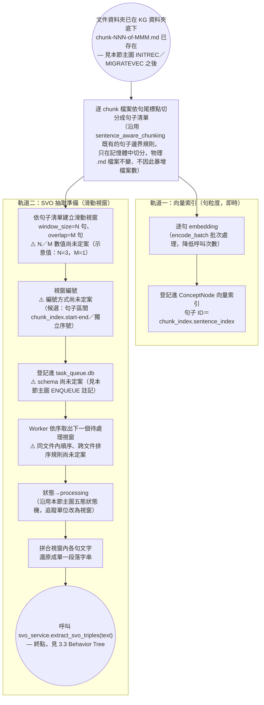

# 第三章：變更紀錄與已評估但未採用的設計方案

> 本文件是歷史追溯紀錄，不是目前系統設計的唯一權威來源。下列內容可能反映當時的查證結果或已放棄方案；目前採用的 RQ、方法、程式與文獻狀態，以 `01_緒論.md`、`02_文獻探討.md`、`03_系統設計與方法論.md`、`04_系統實作.md` 及 `文獻與專案查核表.md` 為準。

> 本檔案是 [`03_系統設計與方法論.md`](03_系統設計與方法論.md) 的附屬紀錄，收納兩類內容：① 逐日變更歷程（供追溯查證，非正文必讀）；② 已評估但最終未採用的設計草案（保留完整推理過程，供理解「為什麼沒有選這條路」）。正文只保留最終定案的設計與一句指向本檔案的連結，不影響正文的可讀性。

---

## 一、變更歷程

### 2026-07-16

- 首次填實 3.1.1／3.1.2 暫存區歸檔與抽取斷點續傳細節。
- 3.1.1/3.1.2 改為「文件資料夾實際搬移＋資料夾內記錄檔狀態機」設計，補齊四項暫存區功能：①自動分配 ②無適合則留存 ③手動分配 ④使用者觸發 AI 分群建議＋審核。④ 的審核機制定案為「名稱與檔案清單分開審核、皆可先微調再確認」。重新歸屬的邊界案例亦已定案：軌道二（SVO／圖譜）不遷移、對新 KG 完整重跑抽取；軌道一（向量化）直接遷移。
- 3.1.1 的分類分數計算與 AI 自動分群機制，從「直接沿用 v1」改為「以驗證文獻/專案為主要參考起點」：
  - 分數計算改採 **Prototypical Networks**（Snell et al., 2017）centroid 相似度，捨棄 v1 `concept_engine.compute_match_score()` 的 align/magnitude 加權——查證後發現該公式的兩個標量從初始化後從未被更新過（恆為常數），代入後整條公式數學上等價於「0.7 × 平均 cosine 相似度」，個人化設計意圖從未實際生效。
  - AI 分群改採 **HDBSCAN**（McInnes et al., 2017，`min_cluster_size=3`）取代 v1 門檻式連通分量分群（已知有連鎖效應缺陷）。
  - 命名輸入篩選改採 **Khandelwal (2025)** 驗證表現最佳的主導子群法，取代 v1 未經篩選的 `filenames[:10]` 做法。
  - 新增 3.1.1 §a 專門展開此分群機制的 Behavior Tree。
- 3.1.1 完成實作與測試：`parser/chunk_writer.py` 改為逐文件獨立資料夾，新增 `services/document_record_service.py`／`services/classify_service.py`／`services/cluster_service.py`／`routers/staging.py` 端點，122 項 pytest 測試通過。實作過程中發現 HDBSCAN 需加上 `allow_single_cluster=True` 參數才能正確辨識「未分配池裡唯一結構恰好達 `min_cluster_size`」的情境，已同步更新 §a 說明與 `docs/報告/技術參考地圖.md`。

### 2026-07-17

- 為 3.1.1／§a 查證可信任專案背書並提出優化建議：分類分數額外對照 **semantic-router**（Aurelio Labs）驗證「embedding 相似度離散路由」是業界已實際部署的模式，但誠實區分其即時 kNN 機制與本論文 centroid prototype 機制的差異；AI 分群額外對照 **BERTopic**（Grootendorst, 2022）驗證「HDBSCAN＋LLM 命名」整條管線的產業實例，並誠實標註本論文未如 BERTopic 於 HDBSCAN 前做 UMAP 降維的落差；另查證 **Paperless-ngx** 的 ML 自動分類機制，確認其無信心分級/建議層設計，故將 3.1.1 主圖的三層信心分級機制明確定位為本論文自行提出的工程決策。完整查證過程見第二章 2.4 節，優化建議清單見 3.1.1 節文末。
- 校正 3.1 總覽 BT 的向量化時序：3.1.1 §CMP 節點計算分類分數時需使用已算好的 chunk 向量，總覽圖原本把「向量化」畫成暫存區分類**之後**才分岔出的軌道一，與此矛盾；已改為向量化緊接解析之後、分類之前，分類後的軌道一改為「向量索引登記」（僅登記歸屬 kg_id，不重算），與 3.1.2 節「向量化結果直接遷移、不需重新向量化」的既有敘述一致。向量化本身的實作細節與文獻佐證另立 `core/providers/embedding/README.md` 收納，不寫入本章正文——向量化不是本論文的研究貢獻。

### 2026-07-20

- 逐項處理 3.1.1 優化建議並補齊 RQ4 替代文獻：六項優化建議中，prototype／文件向量快取、同批次 prototype 過時、搬移與記錄檔無交易保護三項已修正；新建 KG 最小成員數不對稱改以 `low_confidence` 標記緩解；HDBSCAN 未做降維前處理已補上條件式 UMAP 降維（McInnes, Healy, Saul & Großberger, 2018，池規模 ≥20 才套用）；未分配池 O(n²) 擴展性補上規模達 500 的觀測性警告（非解決演算法複雜度本身）。RQ4（受控語意關係詞彙）方面，Guha et al.（2016）Schema.org 全文再次確認無合法免費全文，改查證並精讀開放取用的 Vrandečić & Krötzsch（2014）《Wikidata》（CACM）作為部分替代佐證。完整查證過程見第二章 2.1.3 節。
- 重新對照現行程式碼逐段檢查 3.1.1 輸出到 SVO 抽取開始之間的銜接，發現並修正兩個缺口：`parser/chunk_writer.py` 早已改為逐文件獨立資料夾，但正文描述舊行為（攤平寫入）的落差說明未同步更新，已移除；更關鍵的是「使用者上傳→切塊→寫入暫存區→記錄檔初始化」這段上游管線先前完全沒有真正端點串接（`routers/documents.py` 僅有除錯用、不落地的 `debug-parse` 端點），已新增 `services/ingestion_service.py::chunk_and_stage()` 與 `POST /documents/upload`／`POST /documents/ingest-url` 補齊。
- 開始正式設計討論 3.1.2（範圍界定為「3.1.1 指派完成」到「SVO 抽取正式呼叫」之間的銜接，不含抽取演算法本身）：確認向量索引與 SVO 抽取不該共用同一種切塊粒度，新增 3.1.2 §a 記錄整合方案草稿（句子級向量索引＋滑動視窗式 SVO 抽取）。
- 深入查證本體論式（ontology-guided）受控詞彙抽取的專門文獻：確認 GraphRAG／LightRAG 的統一大切塊慣例屬開放式抽取、不適用本節受控場景；查到 **Text2KGBench**（Mihindukulasooriya et al., 2023, ISWC 2023）作為唯一直接對應任務類型的專門 benchmark，其句子級切分為既有學術慣例，但論文自承跨句指代消解會導致漏抽且選擇迴避而非解決；查到 **CORE-KG**（Meher, Domeniconi & Correa-Cabrera, 2025）提出「指代消解前置於切塊之前」的解法並有量化消融驗證（節點重複率 -28.25%），是與滑動視窗不同的技術路線。內容主體整合自 v1 `docs/報告/01_專案總覽_是什麼為什麼怎麼做.md` 第三章「怎麼做」、`docs/ARCHITECTURE.md` 決策紀錄、`docs/報告/01_本地抽取與混合架構評估.md` 第四節、`core/constants.py` 現行參數，並依 1.5 節待辦完成 RQ 編號校正。
- 使用者提出「跨句指代消解只解決代名詞、未解決實體別名（全稱/簡稱/縮寫）」的關鍵質疑後，設計方向確定為**指代消解前置法**，並進一步討論「實體別名消解是否該正式列為新 RQ」——決定不新增 RQ7（1.2 節已自承六個 RQ 對碩士論文工作量偏重，RQ5-6 仍為預留觀察中，不宜再加），改將其併入 RQ4，拆為 **RQ4a**（原 RQ4，受控語意關係詞彙標準化）與 **RQ4b**（新增，實體指代與別名消解），新增 **3.4 節「實體指代與別名消解」**，原 3.4/3.5/3.6 節依序後移為 3.5/3.6/3.7；3.1.2 §a 的滑動視窗草案保留作設計過程紀錄、標註已被 3.4 節取代（完整草案見下方「二、已評估但未採用的設計方案」）。
- （本次調整）依使用者要求重新審視 3.1／3.1.1／3.1.2 段落的可讀性，發現正文開頭的變更歷史已膨脹為超過千字的流水帳、且 3.1.2 §a 的整段已取代草案仍留在主要閱讀路徑上，將兩者移出獨立成本檔案；3.1.2 現存的六段旁註精簡為四段，移除與 3.1 節開頭「架構圖表繪製慣例」重複的「與其他圖的分工」meta 註解。

### 2026-07-20（第二次調整，同日）——3.1 拆分為完整流程小節、確立「3.1 描述流程／3.x 描述 RQ」分工原則

使用者審視完第一次調整後，進一步提出：3.1.2 目前的「終點」是把任務丟進佇列後就指向外部的 3.3（RQ4a），讀者得跳出 3.1 才看得到抽取怎麼跑，寫入/去重步驟又只在 3.1 總覽圖與 3.1.2 的 `WRITE` 節點各自簡略帶過，同一件事分散在三個地方講一半。確立分工原則：**3.1（含 3.1.1-3.1.4）純粹描述建圖流程本身的機制與運作，不深入個別 RQ 的設計原理與文獻佐證；3.2 之後每節對應一個 RQ，說明該 RQ 的作法、原理與參考文獻，並依 RQ 對應回第二章**。具體調整：

- 新增 **3.1.3 抽取過程**：把原 3.3（RQ4a）的 Behavior Tree（LLM 抽取→比對 `SVO_REL_TYPES`→結構/語意驗證→產出 SVOTriple）與 `SVO_REL_TYPES` 30 類的事實描述搬到這裡，作為純流程說明；3.3 保留「為什麼選受控詞彙而非開放抽取」的理論動機（Vashishth et al. 2018 CESI）、Schema.org／Wikidata 文獻佐證、RQ4a 的 trade-off 論證，並改為指回 3.1.3 看機制本身，不重複展開圖。
- 新增 **3.1.4 抽取後續**：把原本散落在 3.1 總覽圖（`DEDUP`／`MERGE`／`CREATE` 節點）與 3.1.2 的 `WRITE` 節點的寫入知識圖譜／實體對齊去重步驟，集中在此獨立小節完整展開為 Behavior Tree；基準去重機制（編輯距離→cosine≥0.88，`docs/ARCHITECTURE.md` 2026-07-10 決策）在此呈現，RQ4b 的 LLM 仲裁擴充（`ESCALATE`）與別名記錄（`surface_form`）維持在 3.4 §b，3.1.4 只做指標引用。
- **3.1.2 的終點改為「開始抽取」**：診斷/重試/寫入相關節點（`RESULT`／`UPLOAD`／`FAIL`／`WRITE`／`DONE`／`NEXT`／`IDLE`）搬到 3.1.3／3.1.4，3.1.2 的 Behavior Tree 在 Worker 把狀態轉為 `processing` 後即以 `HANDOFF` 終端節點收尾；五態狀態機的**定義**仍由 3.1.2 統一負責，因為即使部分狀態轉換實際由 3.1.3／3.1.4 觸發。
- 3.1 總覽圖大幅簡化：`QUEUE` 雙框節點原本同時指向「3.1.2＋3.3」，改為指向「3.1.2／3.1.3／3.1.4」三個流程小節；原本內嵌在總覽圖裡的 `DEDUP`／`MERGE`／`CREATE` 三個節點整段移除，改由 `QUEUE` 直接連到 `KG`，細節收斂到 3.1.4。
- **RQ 對應維持不變**（見下方最新版本）——因為 RQ4a／RQ4b 仍各自保有獨立的「原理＋文獻」小節，只是其對應的機制流程圖被搬進 3.1，不需要連鎖重編後續章節編號，`01_緒論.md`／`附錄與參考文獻.md`／`docs/報告/05_指代消解與前處理任務書.md` 等外部檔案的章節引用皆不受影響。

### 2026-07-21（第三次調整，同日）——3.4 §a 新增動態標準名提升機制，查證並修訂 09 報告

- 延續 `docs/報告/09_實體別名登記與動態標準名提升機制設計報告.md`（同日稍早定案）提出的「動態標準名提升（原稿：長度優先三規則 PK 比試）」構想，使用者要求「先查證方法可行性、有清楚的參考專案與文獻背書，確認後再記錄文獻並整合進 3.4」。
- **第一輪查證**：09 報告原引用的 7 項佐證（spaCy `EntityLinker`／fastcoref／Microsoft GraphRAG Entity Dictionary／CORE-KG／Text2KGBench／CESI／Wikidata）逐一查證後，**沒有一項描述三規則 PK 比試演算法本身**，其中 spaCy（精確字串比對連結靜態 KB）、Microsoft GraphRAG（title/type 完全相同才合併，交由 LLM 摘要）、CESI（頻率加權質心）、Wikidata（社群共識最常用名稱）四項是明確採用不同方法，構成 CONTRADICTS 而非單純空白。
- 使用者釐清真正目標比 09 報告原稿更廣：不只是文件內標準名選取，還要**建立持久化的跨文件實體別名圖譜，隨新文件與查詢持續擴增**。**第二輪查證**換方向搜尋「跨文件增量聚類」文獻，找到 3 篇架構層面真正吻合的先例：Rao, McNamee & Dredze（2010，COLING，串流式跨文件指代消解先驅）、Ji, Grishman & Dang（2011，TAC-KBP Entity Linking track，NIL clustering 官方機制）、Saeedi, Peukert & Rahm（2020，ESWC，知識圖譜場景增量式多來源實體對齊／FAMER 框架）——三篇皆開放取用，已下載至新資料夾 `docs/參考文獻/10_跨文件實體別名消解與增量聚類/`。但三篇同樣**未描述**標準名選取規則本身。
- 使用者以「泰國 vs. 罕用正式全名」為例，指出原本「長度優先」規則會誤選字面較長但實際罕用的形式，因而定案改為**「出現頻率優先，長度僅作平手時的次要規則」**——此規則改為呼應已查證過的 Wikidata（社群共識最常用名稱）與 CESI（頻率加權質心）兩篇文獻的方向，比原長度優先規則更有文獻基礎；但「頻率優先＋長度平手次規則」這個完整組合本身仍查無直接文獻先例，長度 tie-breaker 部分依 3.7 節框架標註為本論文自行設計。
- 已完成的整合動作：① 新增 `docs/參考文獻/10_跨文件實體別名消解與增量聚類/README.md` 並下載 3 篇 PDF，同步更新 `docs/參考文獻/README.md` 與 `docs/論文/附錄與參考文獻.md`；② 全面修訂 `docs/報告/09_實體別名登記與動態標準名提升機制設計報告.md`（登記表資料結構改為 `alias_counts` 頻率字典、演算法改為頻率優先＋長度次要、第 6 節文獻佐證改寫為架構層／規則層兩層誠實框架＋「已查證但不適用」清單）；③ 3.4 §a Behavior Tree 新增 `PROMOTE`／`SWAPKEY`／`KEEPKEY` 節點與對應文字說明；④ 3.4 §b「Entity.name 選取規則」由原本「待決策」改為定案（同一套頻率優先規則，資料來源換成跨文件累積的 `surface_form` 統計），並新增「跨文件持續擴增架構定位」段落引用上述 3 篇新文獻。
- **尚未決定、留待後續討論**：`Entity.aliases` 該持久化為節點陣列屬性（09 報告原提案），還是維持純粹由 `surface_form` 邊屬性動態查詢衍生——兩者是不同的資料模型取捨，3.4 §b 已明確標註為新的待決策項目；「查詢時使用者新稱呼也應擴增別名圖譜」這個使用者提出的目標，目前尚未設計具體機制，僅記錄於此，未寫入 3.4 正文。

### 2026-07-21（第四次調整，同日）——拆分「文件內暫定標準名」與「跨文件真正標準名」兩個權威層級

- 使用者重新檢視上一輪的「頻率優先」規則後，指出一個更根本的問題：單一文件內某個別名出現頻率高，不等於它是實體被廣泛認可的通用標準名——可能只是這份文件/這位作者自己的行文習慣（範圍內簡稱）。若把單一文件的局部頻率直接當成最終標準名，標準名會隨文件來源飄移，違背 RQ4b「跨文件語意一致」的核心目標本身。
- 確認調整方向：**§a（文件內）的頻率優先機制降級為「暫時性局部正規化」**，其輸出（文件內暫定標準名）只服務這份文件自身的處理（代名詞消解、SVO 切塊分組），不直接寫入 `Entity.name`；**§b（跨文件）才是真正的權威層**，每次三元組合併進既有實體後，重新聚合該實體所有 `HAS_ENTITY` 邊的 `surface_form` 跨文件累積次數，套用與 §a 相同的規則（頻率優先、長度次要、保留現狀最終 tie-break），決定是否更新 `Entity.name`——同一實體要在夠多不同文件中都被稱為某個名稱，才會讓它成為標準名。
- 此拆分讓機制與已查證的架構文獻（Rao 2010／TAC-KBP／Saeedi 2020）貼合度更高：這三篇描述的本來就是「跨文件/跨資料源、隨資料累積持續修正」的決策過程，套用在跨文件層級（§b）比先前套用在單一文件內（§a）更符合文獻原本的場景。
- 已完成的整合動作：① `03_系統設計與方法論.md` § 3.4 §a 新增「本節輸出僅為文件內暫定標準名，非最終權威」警示段落；② §b Behavior Tree 新增 `RECHECK`／`UPDATENAME` 節點，文字說明改寫為「§a 的輸出不是最終標準名——§b 才是真正的權威層」，並新增效能待決策（每次合併都重新聚合全部邊，規模變大後可能有效能疑慮，留待第四章/第五章評估）；③ `09_實體別名登記與動態標準名提升機制設計報告.md` 同步修訂：第 2 節新增範圍註記、第 3 節新增「僅限單一文件範圍」警示、第 4 節拆分為「4.1 首次寫入（暫定值）／4.2 surface_form 記錄／4.3 跨文件標準名更新（真正權威層）」、第 5 節新增 `recompute_canonical_name()` 模組規劃。
- **仍未決定**：`RECHECK` 每次合併都同步重新聚合的效能疑慮（是否需要批次/週期性重算）留待第四章實作與第五章消融實驗；「查詢時使用者新稱呼也應擴增別名圖譜」的具體機制仍未設計。

### 2026-07-21（第五次調整，同日）——盤點 3.1.2/3.4 缺口，查證並修訂 07/10 報告，實作落地＋測試

- 使用者要求盤點 3.1.2（含 3.4）目前還有哪些缺口需要專案/文獻支持，以及 07-10 報告裡「建議優化」的部分是否也需要查證；確認後即完成程式實作並測試。
- **缺口盤點**（詳見 `docs/報告/06_SVO抽取管線調整任務書.md` 第 3 節）：多數缺口屬純工程決策（不需外部文獻，只需拍板），使用者確認 4 項皆採推薦方案——① 標準化句子/SVO chunk 落地存檔（`svo_index.json`）；② `SVOTriple` 新增 `source_sentence_range` 追溯欄位；③ 3.4 §a 標準化流程做斷點續傳；④ `Entity.aliases` 存成節點陣列屬性（而非純查詢衍生）。
- **07/10 報告查證**：延續 09 報告的查證標準，查出 10 報告引用 Stanford CoreNLP（2014）「證實過濾 80% 無代詞句子降低 LLM 呼叫成本」查無出處、2014 年語境不可能討論 LLM 成本，**確認為疑似編造，整條移除**；CORE-KG 機制描述張冠李戴（原稿誤植為「前置 Pronoun 掃描器」，實際是逐實體類型循序 LLM prompt）；07 報告的 LangChain `SemanticChunker`「業界廣泛驗證」與 GraphRAG「強烈建議依實體關係密度調整」兩條查無出處，皆已訂正或移除。09/07/10 三份報告的狀態由「🟢 定案」降級為「🟡 設計提案／部分已實作」，解除暫緩；08 報告因涉及 RQ1/RQ2 範疇界定（非文獻問題）維持暫緩。
- **程式實作與測試**（詳見 `docs/報告/06_SVO抽取管線調整任務書.md` 第 4 節）：
  - 新增 `services/entity_registry_service.py`——3.4 §a 文件內實體別名登記表本體，含 `should_promote()`（頻率優先＋長度次要 PK 規則）、規則式別名比對（子字串/縮寫）、LLM 仲裁 hook、`apply_registry()` 整合入口、斷點續傳快照讀寫；測試 17 項全數通過（`tests/services/test_entity_registry_service.py`）。
  - `services/svo_chunking.py` 新增 `max_sentences` 參數（預設 5），`DEFAULT_SVO_CHUNK_SIZE` 由 500 改為 300，對應 3.4 §a `SVOGROUP` 節點「5 句或 300 字元先到者為準」的定案；既有 6 項測試維持通過，新增 3 項測試。
  - `services/svo_service.py` 新增實體對齊/去重完整實作（3.1.4 DEDUP4／3.4 §b ESCALATE＋RECHECK）：`resolve_entity_name()`（編輯距離→cosine→LLM 仲裁三段式）、`merge_entity()`（含跨文件標準名動態更新與 `alias_counts_json`／`aliases` 屬性維護）；`core/constants.py` 新增三個門檻常數（`ENTITY_DEDUP_EDIT_RATIO_THRESHOLD=0.70`／`ENTITY_DEDUP_COSINE_THRESHOLD=0.88`／`ENTITY_DEDUP_ESCALATE_LOW_THRESHOLD=0.75`，皆為未驗證工程預設）；既有 4 項測試更新、新增 10 項測試（含 `InMemoryEntityDriver` 模擬 MERGE／改名狀態），共 14 項全數通過。
  - 全專案測試套件執行結果：212 項通過，1 項既有錯誤（`tests/run_downloads_test.py`，與本次改動無關的既有 fixture 問題，非本次引入）。
- **仍未實作／留待後續**：`Entity.aliases` 對外查詢 API；`RECHECK` 效能優化（批次/週期性重算，非每次同步觸發）；10 報告的雙軌 POS/正則代名詞檢測本身（僅完成文獻訂正，尚待與 05 任務書整合）；具名提及抽取（NER）與代名詞消解模組的端到端串接。

### 2026-07-21（第六次調整，同日）——比對 3.1.2/3.4 程式碼與論文規格，發現並修正 RECORD3B 資料模型落差

- 使用者要求檢查 3.1.2（含 3.4）的程式是否符合論文標準、測試是否通過。逐節比對 Behavior Tree 節點與實際程式碼後，發現一項需要處理的落差、與三項尚未實作的既有已知缺口：
  1. **🔴 `RECORD3B` 資料模型與論文文字描述不一致**：論文明確描述 `(Chunk)-[:HAS_ENTITY {surface_form}]->(Entity)` 邊＋`MATCH (c)-[r:HAS_ENTITY]->(e) RETURN r.surface_form, count(*)` 聚合查詢，但第五次調整時的實作走了捷徑，直接把別名頻率存成 Entity 節點上的 `alias_counts_json`（JSON 字串屬性），未建立 Chunk 節點或 HAS_ENTITY 邊——功能上達成同樣的頻率優先判斷，但資料模型與文字描述矛盾，且 3.1 總覽圖本來就把「Chunk --HAS_ENTITY--> Entity」列為全系統的核心雙層圖結構（非只是別名機制的附帶細節）。
  2. 3.1.2 的 `GETSENT` 三層判斷（sentences.json／original.md 重切／重新解析）只有寫入端，沒有對應的讀取端函式。
  3. `task_queue.db` 完全未實作，`ENQUEUE`／`RESTART`／`TRUST`／`SCAN`／`REBUILD` 這幾個節點目前只有記錄檔追蹤，沒有效能索引層。
  4. `CHUNKREADY` 沒有端到端串接：`entity_registry_service.apply_registry()` 與 `svo_chunking.build_svo_chunks()` 各自獨立測試通過，但沒有管線函式把兩者（與尚未實作的代名詞消解模組）接起來。
- 依使用者指示優先處理第 1 項：`services/svo_service.py` 改寫為真正的 Chunk／HAS_ENTITY 邊架構——新增 `_merge_chunk_mention()`（MERGE Chunk 節點＋`HAS_ENTITY {surface_form}` 邊，鍵為 `(chunk, entity, surface_form)`，同一 chunk 內重複提及同一別名不重複計數）、`_aggregate_alias_counts()`（對應論文 Cypher 範例的聚合查詢）；`merge_entity()` 改為呼叫這兩者取代原本的 JSON 屬性讀寫；`Entity.aliases` 改為聚合查詢後的快取陣列（權威來源是 HAS_ENTITY 邊本身，不再是這個陣列）。`_fetch_entity_candidates()` 同步簡化（不再需要回傳 alias_counts_json）。
- 測試同步改寫：`InMemoryEntityDriver` 改為模擬 Entity／Chunk 節點與 HAS_ENTITY 邊的完整聚合狀態；`merge_entity` 相關測試改用不同 `source_doc_id`／`chunk_index` 模擬跨文件/跨 chunk 提及（同一 chunk 重複提及不應重複計數，是刻意的頻率語意）；新增「無 chunk 追溯資訊時退化為單純 MERGE」與「HAS_ENTITY 邊確實記錄 surface_form」兩項測試。`tests/services/test_svo_service.py` 共 16 項全數通過；全專案測試套件 212 項通過（不含既有無關的 `tests/run_downloads_test.py` 錯誤）。
- 論文 3.4 §b 同步更新「實作現況」段落，明確記錄「初版實作與文字描述不一致、已修正」的過程，不掩蓋這次落差。
- **第 2/3/4 項落差本次未處理**，留待後續依優先順序決定是否要做。

### 2026-07-21（第七次調整，同日）——補齊 GETSENT／task_queue.db／代名詞消解／CHUNKREADY 端到端串接

- 使用者要求繼續完成第六次調整標記為「已知缺口但確定要做」的第 2/3/4 項，若遇疑問項目先討論。
- **代名詞消解機制選擇（唯一需要討論的問題）**：05 任務書原始設計是單一正則 `PRONOUN_PATTERN`，已知會誤觸發於「其他/其中/其實/應該」等常見詞；10 報告提出的 POS＋正則雙軌比對正是為修正此限制而設計。使用者確認採用 10 報告方案（推薦選項）。
- **已完成並測試**：
  1. **`GETSENT` 讀取端**：`parser/chunk_writer.py` 新增 `read_sentences_index()`／`read_original_text()`（讀取端，對稱既有寫入端）；`services/ingestion_service.py` 新增 `get_or_rebuild_sentences()` 實作三層判斷（優先讀 `sentences.json`→退而對 `original.md` 重新切句→都沒有時僅 URL 來源可重新抓取，檔案上傳來源拋出明確例外）。測試：`tests/test_chunk_writer.py`（新增 5 項）、`tests/services/test_ingestion_service.py::TestGetOrRebuildSentences`（4 項）。
  2. **`task_queue.db`**：新增 `services/task_queue_service.py`，SQLite 實作 `enqueue()`／`update_status()`／`next_pending()`／`is_index_trustworthy()`（`TRUST`）／`reset_stuck_processing()`（中斷處理）／`rebuild_from_records()`（`REBUILD`，掃描 KG 資料夾記錄檔重建）／`ensure_ready()`（`RESTART` 入口）。跨 KG 排程政策不在本節規定範圍內，僅以 `chunk_index` 排序，留待第四章依實際 Worker 架構決定。測試：`tests/services/test_task_queue_service.py`（16 項）。
  3. **代名詞消解（10 報告雙軌方案）**：新增 `services/pronoun_resolution_service.py`——`detect_pronoun()` 三路分流（正則命中／POS 命中但正則未收錄則標記 unmapped／皆未命中）、`PosTagger` 介面＋`SpacyPosTagger`（延遲匯入 spaCy，未安裝不影響其餘邏輯）、`audit_unmapped_pronoun()`（背景 LLM 詞庫審核）、`append_to_lexicon()`／`load_custom_lexicon()`（詞庫持久化）、`resolve_coreference_pipeline()`（05 任務書前 4 後 2 雙向上下文消解主體，改用雙軌偵測取代單一正則，並補上複數代名詞「他們/她們/它們」）。`requirements.txt` 新增 `spacy~=3.8`（中文模型 `zh_core_web_sm` 需另外下載，本專案環境未安裝，`SpacyPosTagger` 本身未經實測，僅驗證過依賴注入的 `PosTagger` 介面邏輯）。測試：`tests/services/test_pronoun_resolution_service.py`（18 項，皆用 Fake `PosTagger`）。
  4. **`CHUNKREADY` 端到端串接**：新增 `services/svo_preprocessing_service.py::prepare_svo_ready_chunks()`，串連 `get_or_rebuild_sentences()`→（可選）`entity_registry_service.apply_registry()`→`pronoun_resolution_service.resolve_coreference_pipeline()`→`svo_chunking.build_svo_chunks()`＋`write_svo_chunks()`。測試：`tests/services/test_svo_preprocessing_service.py`（3 項，涵蓋無/有 `mentions`、落地驗證）。
- **誠實記錄的未解決依賴**：具名提及抽取（NER）仍無任何模組產生，`prepare_svo_ready_chunks()` 目前只能以 `mentions=None` 呼叫，此時跳過整個 §a 別名登記表階段，只完成代名詞消解——這是系統當前真實狀態，非本次刻意簡化，是別名登記表真正投入使用前的最後一塊拼圖。代名詞消解本身的句子級斷點續傳（3.4 §a 標準化整體進度已追蹤，但代名詞消解跑到一半中斷仍需整份重跑）也未處理。
- 全專案測試套件執行結果：260 項通過（不含既有無關的 `tests/run_downloads_test.py` 錯誤）。
- 論文 3.1.2／3.4 §a 對應段落與 `docs/報告/06_SVO抽取管線調整任務書.md` 第 3/4/6 節同步更新實作現況。

### 2026-07-21（第八次調整，同日）——查核「元件完成」與「系統接線完成」的落差，補上實際觸發點

- 使用者追問第七次調整後 3.1.2 是否真正完成、有無需要討論的預期問題，要求全部處理好才進 3.1.3。逐一核對每個 Behavior Tree 節點在程式碼裡「是否真的被系統其他部分呼叫」（不只是單元測試通過），發現元件層級已完成，但**系統接線層級**尚有落差：
  1. `CHUNKREADY` 沒有接到 `ENQUEUE`：`prepare_svo_ready_chunks()` 寫出 SVO chunk 後從未呼叫 `task_queue_service.enqueue()`。
  2. 文件搬進 KG 資料夾後，沒有任何呼叫點觸發這整條管線（`classify_service`／`cluster_service` 完全沒有呼叫新模組）。
  3. `task_queue_service.ensure_ready()`（`RESTART`）沒有接進 `main.py` 的 `lifespan` 啟動流程。
  4. `MIGRATEVEC`（向量遷移）完全沒有程式碼——查核後確認這不是 3.1.2 的缺口，而是結構性依賴 3.2 §a（RQ2，ConceptNode 路由層）尚未動工，`repositories/concept_repo.py` 連寫入 ConceptNode 的方法都不存在。
  5. （既有、非本次引入）`svo_service.create_entity_index()` 從未被 `main.py` 呼叫，儘管其 docstring 註明「app 啟動時呼叫一次」。
- **觸發方式**（唯一需要與使用者確認的問題）：使用者選擇「同步直接呼叫」（推薦選項），而非背景排程或延後執行。
- **已完成並測試**：
  1. `routers/staging.py` 新增 `_trigger_extraction()`，在 `assign()`／`confirm_cluster()`／`classify()`（自動分配部分，依 `ClassifyResult.auto_assigned` 判斷）三個端點呼叫 `assign_document_to_kg()` 之後，同步呼叫 `prepare_svo_ready_chunks()` 產生 SVO chunk，再呼叫 `task_queue_service.enqueue()` 登記進佇列，並用 `document_record_service.set_svo_chunk_total()` 記錄總數。
  2. `core/config.py` 新增 `task_queue_db_path()`（沿用 `staging_folder()` 既有的集中定義慣例，避免路徑各處重複硬編碼）。
  3. `main.py` 的 `lifespan` 新增呼叫 `svo_service.create_entity_index(get_driver())` 與 `_restart_task_queue()`（內部呼叫 `KGRepository.list_all()` 取得 KG 資料夾清單餵給 `task_queue_service.ensure_ready()`；`KGRepository` 為 stub 時捕捉 `NotImplementedError`、降級為空 KG 清單，確保不會讓整個 app 啟動失敗）。
  4. 新增 `tests/routers/test_staging.py`（3 項，直接單元測試 `_trigger_extraction()`，不透過 FastAPI TestClient——本專案目前尚無 router 層級測試慣例，此為首次嘗試，聚焦驗證新邏輯本身）。
- `MIGRATEVEC` 與 `Entity.aliases` 對外查詢 API／`RECHECK` 效能優化／NER／代名詞消解句子級 checkpoint 這 5 項**維持不處理**，論文與 06 任務書皆已標註清楚各自的阻斷原因（結構性依賴 3.2、或非阻斷性待辦）。
- 全專案測試套件執行結果：263 項通過（不含既有無關的 `tests/run_downloads_test.py` 錯誤）。
- 論文 3.1.2「立即觸發抽取任務」段落與「重新歸屬邊界案例」段落同步新增實作現況／`MIGRATEVEC` 誠實侷限說明；06 任務書第 4 節同步更新。

### 2026-07-21（第九次調整，同日）——§a／§b 主規則拆分為長度優先／頻率優先，頻率計數改以獨立文件數為單位

- 使用者提出：單一文件內，實體通常「先給完整名稱、後續才為精簡改用簡稱」，若沿用頻率優先，幾乎必然選到簡稱為標準名，反而犧牲完整性；跨文件則應維持頻率優先，因為 Wikidata／CESI 描述的頻率概念本來就是跨文件/跨編者尺度，套用在單一文件內是勉強延伸。使用者進一步釐清：跨文件頻率應該用「每份文件的 §a 最長標準名」計票（一份文件一票），而非用「chunk/提及次數」計票，否則單一文件因 chunk 數量多會灌票，不代表真正的跨文件共識。
- **確認的設計**：
  - §a（文件內，`services/entity_registry_service.py`）：主規則改為**長度優先**，出現次數僅作平手次規則。新增 `should_promote_by_length()`，原 `should_promote()` 更名為 `should_promote_by_frequency()`（保留給 §b 使用），兩者是獨立函式，不互相影響。
  - §b（跨文件，`services/svo_service.py`）：主規則維持**頻率優先**（`should_promote_by_frequency()`）不變，但頻率計數單位改為**獨立文件數**——`_aggregate_alias_counts()` 的 Cypher 從 `count(*)` 改為 `count(DISTINCT c.source_doc_id)`，確保「一份文件一票」，不被單一文件的 chunk 數量灌票。
- **已完成並測試**：
  - `entity_registry_service.py`：新增 `should_promote_by_length()`；`resolve_mention()` 改呼叫此函式；模組 docstring 新增設計理由說明。
  - `svo_service.py`：`import should_promote_by_frequency` 取代 `should_promote`；`_aggregate_alias_counts()` 查詢改為 `count(DISTINCT c.source_doc_id)`；相關 docstring 同步更新，明確標註 §a／§b 主規則不同、只是碰巧都以長度作次要判準之一。
  - 測試：`tests/services/test_entity_registry_service.py` 全面改寫（21 項）——新增「較短別名無論頻率多高都不會被提升」「較長別名即使只出現一次也會被提升」等對照組，取代舊版頻率優先的測試預期；`tests/services/test_svo_service.py` 新增 `test_merge_entity_frequency_counts_distinct_documents_not_chunks`（驗證 10 個 chunk 的文件 A 不會壓過 1 個 chunk 的文件 B），`InMemoryEntityDriver` 的聚合邏輯同步改為模擬 `count(DISTINCT source_doc_id)` 語意（17 項）。
  - 論文 3.4 §a／§b 對應段落、Behavior Tree 節點文字、09 報告第 3/4/5/6 節同步修訂，明確標註「§a 長度優先／§b 頻率優先」的分工與各自的文獻誠實框架（長度優先查無文獻先例；頻率優先呼應 Wikidata／CESI，現在正確對應到 §b 而非 §a）。
- 全專案測試套件執行結果：268 項通過（不含既有無關的 `tests/run_downloads_test.py` 錯誤）。

### 2026-07-22（第十次調整）——SVO 切塊改用純句數＋重疊、事實層級去重、切塊向量化

- 使用者提出三件相關但獨立的修訂，皆已確認並實作：
  1. **拿掉 300 字元上限**：只用 `max_sentences`（最多 5 句）控制切塊大小，理由與逐句覆蓋驗證見下方第 2 點。
  2. **相鄰塊重疊 2 句（`overlap_sentences=2`）**：使用者提出切塊演算法為「起始點公差 3、每塊最多 5 句」，產生 1-5、4-8、7-11……這組序列（= `max_sentences - overlap_sentences` 為公差）。設計目標是避免「事實跨塊邊界被切斷」：每一句子透過其所屬（最多兩個）chunk 的聯集，都能拿到前 2 句與後 2 句上下文。逐位置驗算（0-indexed 塊內偏移量）：
     - 偏移量 2（塊正中央）：單一塊內前 2、後 2 皆已滿足，不需要第二個框。
     - 偏移量 0（塊首，= 前一塊倒數第 2 句）：單一塊內後文充足（4 句），前一塊內前文充足（3 句），聯集後前後皆 ≥ 2。
     - 偏移量 1（= 前一塊最後一句）：同理，聯集後前後皆 ≥ 2。
     - 偏移量 3／4（塊尾側，= 下一塊塊首兩句）：對稱同理。
     - 文件開頭/結尾因為沒有更多句子可補，前後文自然受限，不算違反設計。
     - 已在 `tests/services/test_svo_chunking.py::test_every_sentence_union_of_its_chunks_covers_front_two_and_back_two` 對 20 句的合成序列窮舉驗證。
  3. **事實層級去重**：使用者先指出「分塊做序列、返回也是塊序列」，重複抽取造成的重複邊問題與是否重疊無關——即使完全不重疊的兩個塊各自獨立抽到同一事實，一樣會產生兩條邊。使用者確認「相同的內容應該收斂成一條邊」。`merge_triples_to_graph()` 的關係 `MERGE` 鍵從 `(subject, rel_type, object, source_svo_chunk_index, source_sentence_start, source_sentence_end)` 簡化為 `(kg_id, subject, rel_type, object)`；來源改記錄在邊上累積的 `citations_json`（JSON 字串陣列，每筆含來源 chunk／句子／verb／confidence），先讀回既有清單、應用層附加後整份寫回；邊上的 `confidence` 取所有引用的最大值。`bfs_query()` 同步改讀 `citations_json`，暫以最後一筆引用作為代表來源（回答階段如何呈現多筆來源不在本次範圍）。
  4. **切塊向量化**：使用者說明來源追溯機制的完整設想——來源記錄在關係邊（而非實體節點）上，並有一份來源對照表（現況即 `Chunk` 節點本身，已記錄檔案與 chunk 索引，不需另建新表）；回答時的來源篩選走向量比對（沿用現有 `EmbeddingProvider`，非學習式 attention），只呈現分數最高的幾筆，而非全部來源原文；因此切塊當下需要多一條路徑做向量化。新增 `svo_service.embed_svo_chunks()`（切塊當下把每個 SVO chunk 算成向量存進 `Chunk.embedding`）與 `create_chunk_vector_index()`（比照 `ConceptRepository` 模式建 Neo4j 向量索引），接線於 `routers/staging.py::_trigger_extraction()`（`get_embedding_provider()` 未初始化時優雅跳過）與 `main.py` 啟動流程。**誠實侷限**：此路徑的 `Chunk` 節點以 `(kg_id, source: str, chunk_index)` 為鍵，與 `HAS_ENTITY` 邊所用的 `(kg_id, source_doc_id: UUID, chunk_index)` 不同——`source_doc_id` 這個 UUID 目前沒有任何實際產生邏輯（無 Worker 賦予真正文件 UUID），向量化又發生在抽取之前，此時唯一可靠識別就是 `source` 字串；兩套鍵值如何收斂待第四章文件 UUID 機制實作時處理。
- **回答階段範圍界定（使用者明確排除）**：候選來源 chunk 的向量比對／排序（挑選哪幾筆呈現給使用者）不屬於 3.1.2 範圍，留待後續設計；本次只完成「切塊當下算好向量存起來」與「事實層級去重」兩項寫入面的修訂。
- **已完成並測試**：
  - `services/svo_chunking.py`：拿掉 `max_chars`／`DEFAULT_SVO_CHUNK_SIZE`，`build_svo_chunks()` 改純句數＋重疊演算法，`DEFAULT_SVO_CHUNK_OVERLAP_SENTENCES` 預設改為 2；新增 `overlap_sentences >= max_sentences` 驗證。
  - `services/svo_preprocessing_service.py`：`prepare_svo_ready_chunks()` 同步拿掉 `max_chars` 參數，改傳 `overlap_sentences`。
  - `services/svo_service.py`：新增 `_new_citation()`／`embed_svo_chunks()`／`create_chunk_vector_index()`；`merge_triples_to_graph()` 改為讀回-附加-寫回的事實層級去重；`bfs_query()` 改讀 `citations_json`。
  - `routers/staging.py::_trigger_extraction()`：接上 `get_embedding_provider()`（優雅降級，未初始化時跳過向量化），呼叫 `embed_svo_chunks()`。
  - `main.py`：lifespan 新增 `svo_service.create_chunk_vector_index()` 呼叫。
  - 測試：`tests/services/test_svo_chunking.py`（新增覆蓋驗證與序列驗證兩項）、`tests/services/test_svo_service.py`（新增事實去重、向量化測試）、`tests/routers/test_staging.py`（新增 provider 優雅降級與向量化接線兩項）全面更新／新增，全部通過。
- 全專案測試套件執行結果：276 項通過（不含既有無關的 `tests/run_downloads_test.py` 錯誤）。

### 2026-07-22（第十一次調整）——補齊 `SENTEMBED` 逐句 embedding

- 補上 3.4 §a `SENTEMBED` 節點：先前標記「已定案，實作仍待補」，這次補齊實作。與同日稍早完成的 `EMBEDCHUNK`（chunk 層級向量化，寫進 Neo4j `Chunk.embedding`）是不同粒度、不同儲存位置的獨立輸出——`SENTEMBED` 對標準化句子清單（STDSENTS）逐句算向量，存成該文件資料夾內的 `sentence_embeddings.json`（比照 `sentences.json` 的檔案落地模式，非 Neo4j），供未來（不在本次範圍）08 報告「標準化 RAG」檢索軌道使用；本次只完成「算好存起來」，不實作任何檢索/查詢邏輯，08 報告本身是否納入正式範圍仍未定案。
- **已完成並測試**：
  - `services/svo_preprocessing_service.py`：新增 `write_sentence_embeddings()`／`read_sentence_embeddings()`；`prepare_svo_ready_chunks()` 新增 `embedding_provider` 參數，在 `STDSENTS` 之後、`SVOGROUP` 之前選擇性寫入。
  - `routers/staging.py::_trigger_extraction()`：`embedding_provider` 的 fetch 提前到呼叫 `prepare_svo_ready_chunks()` 之前，同一個 provider 實例同時供 `SENTEMBED` 與 `EMBEDCHUNK` 使用，不重複呼叫 `get_embedding_provider()`。
  - 測試：`tests/services/test_svo_preprocessing_service.py` 新增 2 項（有/無 provider 兩種路徑）、`tests/routers/test_staging.py` 更新既有向量化測試以驗證 provider 只被 fetch 一次且兩份輸出（`Chunk.embedding`／`sentence_embeddings.json`）皆落地。
- 全專案測試套件執行結果：278 項通過（不含既有無關的 `tests/run_downloads_test.py` 錯誤）。

### 2026-07-23（第十二次調整）——RQ5（事實時序保留策略）補齊 03/02 對應章節，第二章依系統流程重新架構

- 使用者確認 **RQ5（事實時序保留策略）保留**（不併入未來工作），要求全面更新相關文件的一致性與完整性，並提出兩項後續結構性要求：① 第二章文獻探討改為「先彙整各 RQ 核心參考，再依第三章系統流程順序逐階段補充方法佐證」的兩段式結構；② 第三章即使是非主要研究問題的中間方法，其文獻佐證也應累積收錄進第二章，不遺漏。
- **`03_系統設計與方法論.md` 新增 3.5 節「事實時序保留策略（對應 RQ5，預留）」**：緊接 3.4（實體/事實合併機制）之後插入，理由是 RQ5 處理的是「同一事實隨時間改變」的寫入時機問題，與 3.4 §b 的實體合併機制主題相鄰。內容包含問題成因分析（現行 `merge_triples_to_graph()` MERGE 鍵不比對 `object`，同一 subject+rel_type 但 object 不同的新舊事實會靜默並存、無時間標記，比「靜默覆蓋」更原始）、設計提案 Behavior Tree（`CONFLICT`／`TAGOLD`／`CREATENEW`／`QTIME`／`QAS`，皆誠實標註為設計提案非現行行為）、文獻依據（T-GRAG，取代 `03_核心架構藍圖.md` 原引用但未下載全文的 Zep/Graphiti）、與 RQ1 的交互影響風險提示（時態邊會增加 BFS 路徑數，需注意實驗基準線污染）。原 3.5（RQ3 自我精煉迴圈）／3.6（RQ6 向量剪枝）／3.7（研究方法論說明）依序順移為 3.6／3.7／3.8，章節分工原則（第一節狀態列）、系統總覽圖節點引用、3.8 節的「本論文自行設計工程決策」與「消融實驗設計原則」清單，皆已同步補上 RQ5 並校正編號。
- **修正一處既有的錯誤交叉引用**：3.4 節「本節機制分兩層...呼應第二章 2.1.3 已查證的文獻」原本誤指向 RQ4a 的 OpenIE/CESI/Schema.org 小節，但緊接著實際討論的是 Text2KGBench／CORE-KG（RQ4b 的文獻），與 2.1.3 無關——此次一併校正並就地記錄誠實訂正說明，不掩蓋此前的錯誤。
- **`02_文獻探討.md` 依使用者指示重新架構**：原「五個技術缺口主題分群」（2.1.1-2.1.5）改為「2.1 文獻篩選方法論 → 2.2 各 RQ 核心文獻總覽（新增）→ 2.3 比較表 → 2.4 依第三章系統流程逐階段回顧（2.4.1 對應 3.1.1…2.4.8 對應 3.7，含 2.4.5 RQ4b／2.4.6 RQ5 兩節全新內容）→ 2.5 評估方法論橫向回顧 → 2.6 其餘管線模組佐證（新增，收錄 parser／embedding 模組文獻，屬非 RQ 主線但第三章總覽圖仍引用者）→ 2.7 研究方法論誠實框架」。既有段落文字盡量原樣搬遷，只換組織方式；比較表新增「事實更新處理」一列對應 RQ5。每個小節結尾點回 `附錄與參考文獻.md` 的對應表格區塊，作為文獻-本地檔案對照的唯一權威來源，02 正文不重複維護 URL/路徑。
- **周邊文件同步校正**：`01_緒論.md`／`附錄與參考文獻.md`／`docs/參考文獻/README.md`（含補上先前遺漏的 `08_向量化與語意表示/`／`09_SVO抽取切塊策略與指代消解/` 兩個資料夾索引）／`docs/參考文獻/{02,03,04,05}_*/README.md` 內指向 02 舊章節編號的交叉引用，全數校正為新編號；`docs/報告/03_核心架構藍圖.md` 補上「RQ 編號版本說明」對照表（該文件寫作於重構前，用的是舊版 RQ1-4 編號），痛點 5（時序稽核）的分類由「🔧 工程借鏡」更正為「🎓 研究問題型 RQ5」；`docs/ARCHITECTURE.md`「時序管理」決策記錄同步更新學術支撐引用與現況；`docs/論文/00_README.md` 章節狀態表與「目前最需要你決定的事」段落同步更新，修正先前已與 `01_緒論.md` 本身狀態脫節的過時描述（原寫「1.3-1.5仍是TODO」，但 01 緒論檔案自身狀態列早已顯示三節皆有草稿）。
- 本次調整純屬文件重組與新增設計提案章節，未變更任何既有程式碼行為，不涉及測試套件。

### RQ 編號現行狀態（2026-07-20 起適用，2026-07-23 因新增 3.5 RQ5 節再次校正）

3.1（含 3.1.1-3.1.4）為建圖流程的基礎工程機制，屬 🔧 工程借鏡型，純粹描述流程本身，不對應任何 RQ——但 3.1.3／3.1.4 的機制流程分別服務 RQ4a／RQ4b，其設計原理與文獻仍在對應的 RQ 小節。3.2 對應 RQ1（KG-BFS vs. 純向量 RAG 的優勢邊界）與 RQ2（輕量路由層效能取捨）；3.3 對應 RQ4a（受控語意關係詞彙標準化）；3.4 對應 RQ4b（實體指代與別名消解）；**3.5 對應 RQ5（事實時序保留策略，2026-07-23 新增）**；3.6 對應 RQ3；3.7 對應 RQ6；3.8 為研究方法論說明。

### 2026-07-23（第十三次調整，同日）——補齊專案參考的熱度佐證指標（GitHub stars／引用數）

- 使用者要求檢查是否還有「文件/方法引用了某個專案，但缺乏瀏覽數/引用數/星星數佐證」的缺口，並補齊。逐一查證第二、三章及 `docs/ARCHITECTURE.md`／`docs/報告/03_核心架構藍圖.md` 提到但未附熱度指標的專案：
- **透過 `gh api`（GitHub API）即時查證**：RAGFlow（`infiniflow/ragflow`）85,733★（2026-07-13 查證時為 84,718★，已更新為最新值）；Neo4j LLM Knowledge Graph Builder（`neo4j-labs/llm-graph-builder`）4,955★（先前僅記「約 4.7k-4.9k★」於 `產品競品研究/00_總覽.md`，此為未精確引入 02/03 正文的既有缺口，現已補上精確值）；HippoRAG 官方程式碼（`OSU-NLP-Group/HippoRAG`）3,882★；Microsoft GraphRAG 官方實作（`microsoft/graphrag`）34,769★；semantic-router（`aurelio-labs/semantic-router`）3,738★；Paperless-ngx（`paperless-ngx/paperless-ngx`）43,354★；BERTopic（`MaartenGr/BERTopic`）7,752★（原記「約 7.7k stars」，已補精確值與查證日期）；WhyHow.ai 主力產品 `whyhow-ai/knowledge-graph-studio` 929★、namespace 隔離機制實際所在的舊版 SDK `whyhow-ai/whyhow` 128★（規模明顯小於其餘對照專案，已在 02 §2.4.2 誠實標註）。
- **透過 OpenAlex API 查證學術引用次數**：HippoRAG（NeurIPS 2024 正式出版版本）被引用 54 次，可能低估（部分後續論文引用的是 arXiv 預印本、與正式出版版本在資料庫中分開計數）；Edge et al. (2024) GraphRAG 論文的精確被引用次數**查證未完成**——OpenAlex 標題/關鍵字搜尋多次未能穩定命中此篇（可能與該篇長期僅為 arXiv 預印本、後續才被多個資料庫以不同中繼資料收錄有關），已誠實標註為待補，不以「業界公認被引用最廣」這類定性描述取代未查得的量化數字。
- **發現並修補的最大缺口**：HippoRAG 此前被 `docs/ARCHITECTURE.md`「雙層圖結構」決策（`(Chunk)-[:HAS_ENTITY]->(Entity)` 設計的**唯一**學術支撐）、`03_系統設計與方法論.md` § 3.4 §b、`03_核心架構藍圖.md`「核心參考座標」三處引用，但**全文從未下載核實**，且不像同樣未核實的 Guha et al. (2016) Schema.org 那樣有 ⚠️ 警語——三處皆已補上熱度指標與「熱度不等於全文已核實」的誠實聲明，統一指回 `docs/ARCHITECTURE.md` 作為權威記錄。
- 本次調整純屬補充查證與誠實聲明，未變更任何架構決策或程式碼行為。`docs/報告/產品競品研究/00_總覽.md`（產品規劃材料，非論文素材）本身數字未同步更新，因其記錄的是查證當下的快照，論文正文才是需要保持最新查證值的位置。

### 2026-07-23（第十四次調整，同日）——區分「文獻依據」與「參考專案」兩條獨立證據鏈，逐階段補齊參考專案查證

- 使用者釐清一個此前混淆的概念：**文獻**佐證的是「這個方法理論上成立」，**參考專案**佐證的是「這個方法可以被實際寫成程式碼、而且真的有人做過」——兩者是獨立的證據鏈，第十三次調整把兩者混在同一條「熱度佐證」註記裡處理，不夠精確；使用者進一步指出第三章目前似乎沒有系統性記錄每個階段的參考專案，要求逐階段查證補齊。
- **逐節點查證結果**（`gh api` 查證 GitHub star 數，2026-07-23）：
  - **3.1.1 §a（HDBSCAN）**：發現 `services/cluster_service.py` 直接 `import hdbscan`，實際依賴的就是官方參考實作 `scikit-learn-contrib/hdbscan`（3,132★）——這是比 BERTopic（架構層級的獨立驗證）證據力更強的**直接依賴**，此前未被單獨標註，現已在 02/03 拆成「直接依賴套件」與「架構背書」兩層。
  - **3.3（RQ4a，STRUCT/SEMANTIC）**：查無任何開源專案實作過「結構驗證→語意驗證」循序審核閘門，Wikibase（Wikidata 實際軟體）主要在 Wikimedia 自家 Gerrit 開發、GitHub 鏡像星數不具代表性，不適合作為熱度佐證——確認為「文獻依據薄弱＋參考專案空白」同時成立的節點。
  - **3.4 §a（`PROMOTE`）**：確認查無參考專案（與此前已查無文獻先例的結論一致），是全系統外部佐證最薄弱的機制。
  - **3.4 §b（`HAS_ENTITY`）**：HippoRAG 官方程式碼 `OSU-NLP-Group/HippoRAG`（3,882★）存在，但只驗證資料模型本身，不驗證別名比對演算法。
  - **3.5（RQ5，時序保留）**：**本次查證最大發現**——Zep 對應的開源實作 **Graphiti**（`getzep/graphiti`，29,096★，本論文查得星數最高的參考專案，甚至超過 RAGFlow）核心資料模型（邊上標記時間戳、舊事實失效不刪除）與本節設計高度吻合；明確區分「Zep 論文未全文核實」與「Graphiti 專案是真實大規模生產系統」兩件事，不因前者的查證缺口連帶低估後者的價值。**（歷史記錄）當時尚未記錄 T-GRAG 官方 repository URL；目前以 02 與文獻查核表的最新狀態為準。**
  - **3.6（RQ3，自我精煉迴圈）**：Self-RAG（`AkariAsai/self-rag`，2,410★）、FLARE（`jzbjyb/FLARE`，669★）、IRCoT（`StonyBrookNLP/ircot`，272★）皆有官方程式碼，但三者皆作用於自由文字段落、未實作圖結構檢索，參考價值僅止於觸發邏輯範例。
  - **3.7（RQ6，Hub Node 剪枝）**：PathRAG 有官方程式碼（`BUPT-GAMMA/PathRAG`，375★）；**（歷史記錄）當時查無可信公開倉庫**，因此原先判斷本節若採其精神將完全無程式碼可對照。2026-08-24 已查得 CatRAG 作者公開 repository；目前狀態以 02、03 與文獻查核表為準，兩者仍都尚未接入本專案。
- 02_文獻探討.md 對應 8 個小節（2.4.1.2／2.4.4／2.4.5／2.4.6／2.4.7／2.4.8）皆新增獨立的「參考專案查證」段落；03_系統設計與方法論.md 對應節點皆補上簡短指回 02 的參考專案摘要，維持既有「02=完整查證，03=指標+簡述」的分工慣例。
- 本次調整純屬補充查證，未變更任何架構決策或程式碼行為。

### 2026-07-23（第十五次調整，同日）——修正「3.1.2/3.1.3 查無文獻」的誤判，補上單向連結的回指

- 使用者指出：3.1.2 的文獻依據其實記錄在 3.4 §a 中——3.1.2「設計定案」段落選擇「指代消解前置於切塊之前」而非滑動視窗方案，這個具體決策的文獻依據正是 Text2KGBench／CORE-KG（見 3.4 §a），3.1.2 本身依 3.1 節「純粹描述流程、不重複展開個別 RQ 文獻」的分工原則只做指標引用。上一輪查證誤將此描述為「3.1.2 完全不需要文獻佐證的純工程決策」，不夠精確——正確的說法是「文獻佐證存在，但依既定分工集中記錄在 3.4 §a，3.1.2 正確地只做指標引用」，兩者性質不同。
- 查核發現 `02_文獻探討.md` 對應章節此前只有「3.1.2/3.1.3 → 3.4 §a／3.3」的單向指標（03 指向 02），02 本身沒有回指「這批文獻同時也是 3.1.2／3.1.3 哪個具體決策的依據」，屬於連結只有一個方向的落差。已修正：
  - § 2.4.5（RQ4b）標題與開頭新增「同時是 3.1.2『指代消解前置法』設計決策的文獻依據」說明，明確點出 Text2KGBench／CORE-KG 具體支撐 3.1.2 的哪個決策（放棄滑動視窗）。
  - § 2.4.4（RQ4a）標題與開頭新增「同時是 3.1.3 `SVO_REL_TYPES` 受控詞彙機制的文獻依據」說明，同樣的分工模式。
- 同時核查 3.1.4 `DEDUP4` 節點指向 3.4 §b 的指標，確認性質不同不需比照修正——`DEDUP4` 基準機制本身只溯源 `docs/ARCHITECTURE.md` 2026-07-10 工程決策，並非文獻推導而來，指向 3.4 §b 的是其「已知弱點與 ESCALATE 擴充」，不是 DEDUP4 基準本身的文獻依據，維持現狀正確。
- 本次調整純屬修正描述精確度與補上雙向連結，未變更任何架構決策。

### 2026-07-23（第十六次調整，同日）——補齊 3.4 §a（`PRONCHECK`／`PRONLLM` 代名詞消解）的文獻與參考專案，此前未拉進正式引用鏈

- 使用者追問「3.4 §a 相關的文獻與專案也有整理了嗎」，逐一核對後發現：3.4 §a 底下的 `ALIASCHECK`／`PROMOTE`（別名登記）部分已完整整理（含「查無文獻與專案」的誠實標註），但 `PRONCHECK`／`PRONLLM`（代名詞消解）部分的查證工作**其實已經在 `docs/報告/10_代名詞雙軌檢測與正則詞庫自動進化機制設計報告.md`（2026-07-21 全面修訂）做得很完整，卻從未被拉進 02/03 的正式引用鏈**——03 只點出「完整規格見 10 報告」，02 完全沒有對應段落。另發現 spaCy（`PosTagger`／`NerTagger` 皆直接依賴）此前從未被記錄星數，與 `hdbscan` 的處理方式不一致。
- **整合內容**（來源皆為 10 報告既有查證成果，非重新查證）：
  - **參考專案（直接依賴）**：spaCy（`explosion/spaCy`，33,766★，2026-07-23 GitHub API 查證）——`PRON`/`DET` 標籤依循 Universal Dependencies 標準（Nivre et al., 2016, LREC 2016）。
  - **⚠️ 新發現的既有缺口**：Universal Dependencies（Nivre et al., 2016）此前查證屬實但從未列入 `docs/參考文獻/` 或 `附錄與參考文獻.md`，全文未下載——已比照 Guha et al. (2016) Schema.org 的處理方式，於附錄補上書目資訊與「待補全文」標記。
  - **查無直接先例，誠實記錄**：fastcoref（192★）、LangChain Guardrails 皆不構成「雙軌預篩、僅偵測到代名詞才呼叫 LLM」這個應用層設計的直接先例（10 報告已查證）；原稿誤引的 Stanford CoreNLP 量化宣稱（查無出處、時代語境不符）已於 2026-07-21 整條移除，此次一併確認移除記錄無需變動。
- **已更新**：`02_文獻探討.md` § 2.4.5 新增 `PRONCHECK`／`PRONLLM` 專屬段落；`03_系統設計與方法論.md` § 3.4 §a 對應「與 05 任務書的分工」註記補上簡短指回；`附錄與參考文獻.md` 新增「3.4 §a 節代名詞消解文獻」小節（Nivre et al. 2016 + spaCy/fastcoref 專案查證）。
- 本次調整純屬把既有查證成果從 10 報告拉進正式引用鏈，並補上一個新發現的參考文獻登錄缺口，未變更任何架構決策或程式碼行為。

### 2026-07-24（第十七次調整）——3.1.3 關係型別架構重新設計：兩層改扁平、實體型別改為 Type 節點、新增查詢時關係連結機制

使用者依序逐節討論 3.1.3 節「LLM 抽取如何進行」，過程中對原設計提出多個關鍵質疑，最終產生四項架構調整，皆為**設計定案**（非僅補充查證）：

1. **實體型別（`subject_type`／`object_type`）改為選填、允許多值、不做強制驗證**——原設想的評分模型把關機制（型別是否通過、審核新型別提案）僅在概念層級討論過，最終定案為型別純粹是記錄用途，不參與抽取判斷邏輯。
2. **實體型別建模方式改為獨立 Type 節點＋「屬於」邊，取代 Entity 節點的 `type` 屬性**——理由是屬性欄位無法優雅表示「可空」與「可多值」，改用邊天然支援零到多條；此舉連帶暴露 `DEDUP4`／`DEDUP3` 現行「型別完全相等」的篩選邏輯與新定案衝突（型別缺席/不一致時會誤判本該合併的實體為不同實體），修正方向定為「型別缺席時不設限、型別存在時看集合是否有交集」（做法 A）。
3. **關係型別放棄原本設想的「關係類型（上位分類）→關係（具體值）」兩層架構，改為扁平單一層**——查證發現可比照的 ACE 2005（6 粗類→18 細類）結構性合理，但其粗類名稱（人物/組織/地點關係）與本論文因果/功能/比較領域不合，不宜直接套用；改採 ConceptNet 5.5（Speer et al., 2017）的 36 個核心關係直接作為關係型別本身，`STRUCT`（結構驗證）因此失去存在前提而被移除，`MATCH`／`SEMANTIC` 合併為 cosine 相似度比對＋灰色地帶 LLM 仲裁（比照 3.4 §b `ESCALATE` 模式）。
4. **新增 3.2 §c「查詢時關係連結」設計提案**——使用者指出關係缺乏像實體一樣的同義合併機制，查詢措辭與抽取時記錄的動詞原文不一致會找不到對應三元組；核心文獻為 KBQA 領域的 Relation Linking（Yih et al., 2015, STAGG），機制與 3.1.3 的 cosine＋LLM 仲裁對稱但用途不同（抽取時 vs. 查詢時）。

**文獻查證與綁定**：本次新增 6 篇文獻（Hovy et al. 2006 OntoNotes、Speer et al. 2017 ConceptNet、Aguilar et al. 2014、Yih et al. 2015 STAGG、Sakor et al. 2020 Falcon 2.0、Mihindukulasooriya et al. 2020 SLING），皆已下載 PDF 存放於 `docs/參考文獻/03_資訊抽取與本體設計/`，並補上 GitHub 參考專案查證（STAGG 111★／Falcon 2.0 120★／SLING 官方實作 IBM/kbqa-relation-linking 22★，⚠️ 2026-07-26 訂正，原記錄誤植為不相關的 IBM/neuro-symbolic-ai 123★／ConceptNet 官方實作 2,952★）；ACE 2005 relation schema 本身為 LDC 標註規範非期刊論文，僅記書目、不下載全文。`02_文獻探討.md` § 2.4.4、`docs/論文/附錄與參考文獻.md`、`docs/參考文獻/03_資訊抽取與本體設計/README.md`、`docs/參考文獻/README.md` 皆已同步更新，並建立雙向連結。

**公用類型庫與 Schema.org 的分工定案**：實體類型庫可用 Schema.org 的 Type 階層作補充來源，尤其適合「新增型別時查 Schema.org 佐證其通用性」這個用途（供評分模型 B 審核參考）；關係類型庫**不適用** Schema.org（其 property 綁定特定 Type，與本論文抽象語意關係領域不合，會重蹈 ACE 領域不合的覆轍）。

**已更新但仍是設計提案、尚未實作**：`svo_service.py` 現況仍是舊版「精確比對固定集合＋不合法退回 `RELATED_TO`」的簡化實作，本次的 cosine＋LLM 仲裁機制（`SIM`／`ESCALATE3`／`EXPAND`）、Type 節點建模、`DEDUP3`／`DEDUP4` 篩選邏輯修正、3.2 §c 查詢時關係連結，皆為第四章實作階段的待辦，`core/constants.py` 的 `SVO_REL_TYPES`（現行 30 類）內容也尚未同步更新為 ConceptNet 版本的 36 類——本次調整純屬設計文件與文獻查證，未變更任何程式碼行為。

**⚠️ 2026-07-26 補記**：本次調整當時只 commit 未 push，origin 上一度缺少這批內容，直到 2026-07-26 才發現並補推，中間曾造成一次以為「還沒查證 36 類文獻」的誤判（已釐清並記錄於下方第十八次調整）。

### 2026-07-26（第十八次調整）——補齊「LLM 抽取分工」文獻查證，修正 SLING 參考專案舊有錯誤

- 使用者延續第十七次調整的設計（`LLM_SVO` 原始抽取＋型別提案、`SIM`／`ESCALATE3`／`EXPAND` 關係型別收斂比對分屬不同節點），要求討論「這個分階段設計有沒有文獻佐證」，並確認「留給第四章」指的是程式碼實作時程，不是流程設計位置——`SIM`／`ESCALATE3`／`EXPAND` 一直都在 3.1.3 的 Behavior Tree 裡，從未被排除在抽取流程之外。
- **查證並下載 2 篇新文獻**：**KGGen**（Mo, Yu, Kazdan, Cabezas, Mpala, Yu, Cundy, Kanatsoulis & Koyejo, 2025，🟢 NeurIPS 2025，arXiv:2502.09956）——「先抽實體、再抽關係」兩階段 LLM 呼叫設計，作者明確以「降低認知負荷、減少錯誤傳播」為拆分理由，是目前查到與本論文抽取分工決策**最直接對應**的先例；**AutoRE**（Xue, Zhang, Dong & Tang, 2024，🟢 ACL 2024 System Demonstrations，arXiv:2403.14888）——提出 RHF（Relation-Head-Facts）三階段拆解，佐證「關係型別判斷該與原始抽取分開處理」的方向，但誠實聲明其拆分動機是微調模型的訓練資料量失衡問題，是微調場景非本論文的 prompting 場景，具體機制不可直接套用。兩篇文獻皆透過官方管道下載（ACL Anthology／arXiv），非二手轉引。
- **意外發現並修正一個既有查證錯誤**：查證 SLING 的官方 GitHub 實作時，發現第十七次調整記錄的 `IBM/neuro-symbolic-ai`（123★）其實是 IBM 的通用神經符號 AI 工具箱，不是 SLING 本身的程式碼——正確倉庫應為 `IBM/kbqa-relation-linking`（22★，描述明確為「relation linking for knowledge base question answering」，與 SLING 論文主題吻合）。已同步訂正 `02_文獻探討.md`、`附錄與參考文獻.md`、`docs/參考文獻/03_資訊抽取與本體設計/README.md`、`docs/參考文獻/README.md` 四處。
- **已更新**：上述四份文件皆新增 KGGen／AutoRE 條目與角色說明；`docs/參考文獻/03_資訊抽取與本體設計/` 資料夾自身的 README.md 也順便補齊——發現該檔案在第十七次調整（2026-07-24）時並未同步更新（只有附錄表格更新），本次一併補齊其「內容清單」與「各文獻角色」兩張表格，使其與附錄內容一致。
- **仍待處理**：ConceptNet 36 類、OntoNotes 18 類的完整名稱清單仍未在任何文件中逐一列出，是 `core/constants.py` 真正落地前的最後一塊拼圖；KGGen／AutoRE 目前僅查證摘要/方法概述層級，尚未逐篇精讀全文。
- 本次調整純屬文獻查證與既有錯誤訂正，未變更任何架構決策或程式碼行為。

### 2026-07-26（第十九次調整，同日）——EXPAND 治理機制定案：分群＋LLM 審核取代頻率門檻，新增跨 KG 關係型別登記表與人工確認畢業機制

- 使用者延續第十七次調整遺留的「評分模型 B 僅有機制概念」缺口，逐輪確認以下設計，皆為**設計定案**（非僅補充查證）：
  1. **36 個關係型別的意義確認**——使用者先要求確認理解是否正確：關係型別是為了連結相似的關係詞、支援相似關係詞的查詢，經確認理解一致後才繼續討論寫入機制。
  2. **`EXPAND` 保留、但嚴格把關**——不因治理成本而移除動態擴充能力，但不可依單一動詞單次出現就隨意新增型別。
  3. **候選判準改為分群＋LLM 語意判斷，取代原先設想的頻率計數門檻**——使用者指出頻率計數是又一個難以校準的 magic number，且無法處理「多個措辭不同但語意相同的動詞各自出現次數都不足」的情況；改採候選池累積→HDBSCAN 分群（沿用 3.1.1 §a 既有機制）→LLM 判斷群集是否構成新類別並提出命名。
  4. **關係型別擴充的寫入範圍是該 KG 局部、不是全域**——使用者主動指出這一點，確認擴充只寫入該 KG 自己的擴充庫。
  5. **新增跨 KG 關係型別登記表，解決跨 KG 一致性問題**——使用者主動提出「還是需要思考跨 KG 一致性問題」，避免不同 KG 各自為語意相同的新關係型別取不同名稱；架構上類比現行 `task_queue.db`（橫跨多個 KG 的共用基礎設施），這是本系統第一個跨 KG 一致性機制。
  6. **人工確認的畢業機制：追蹤人機一致率，而非固定次數／時間門檻**——使用者希望「達成足夠可信任度後完全移除人工確認」；設計為追蹤 LLM 判斷與人工最終決定在滾動窗口內的一致率，穩定超過門檻後畢業為自動核准，且畢業後仍保留定期抽樣事後複查作為安全網（理由：關係型別寫入後回頭修改代價高、且候選文件分布可能隨時間飄移）。
- **已更新**：`03_系統設計與方法論.md` 新增 3.1.3 §a「EXPAND 治理機制 Behavior Tree」小節（含完整 Behavior Tree 與誠實文獻/自行設計聲明），3.1.3 主圖 `EXPAND` 節點文字與注意事項同步更新指向新小節；3.2 §c 補充「與 3.1.3 §a 跨 KG 登記表的關係」待決問題（查詢時型別比對範圍是否應納入各 KG 的擴充型別）；`docs/ARCHITECTURE.md` 新增「跨 KG 關係型別登記表」決策條目，記錄其架構定位類比 `task_queue.db`。
- **誠實聲明**：分群步驟沿用既有 HDBSCAN 引用（McInnes et al., 2017），LLM 仲裁沿用既有 `ESCALATE` 精神，皆非新查證；但「跨 KG 型別登記表」與「以人機一致率作為自動化畢業門檻」這兩項設計本身**查無直接對應文獻**，明確標註為自行設計，非改寫自任何既有論文或系統，若後續查得對應文獻再補充於第二章 2.4.4。
- **仍待處理**：候選池規模門檻、滾動窗口大小、一致率門檻等具體數值留待第五章消融實驗校準；跨 KG 登記表的實際資料結構與存放位置、3.2 §c 查詢時型別比對範圍的具體方案，皆留待第四章實作時定案；本次設計尚未搜尋是否有開源專案採用類似治理流程，留待實作前查證。
- 本次調整純屬設計文件更新，未變更任何程式碼行為。

### 2026-07-26（第二十次調整，同日）——完成「程式碼可調整項目清單」第 1、2 項；查證第 3 項時發現並訂正一個既有引用錯誤

- 使用者要求先完成先前討論產出的「程式碼可調整項目清單」中範圍明確的第 1、2 項：
  1. `services/svo_service.py::_fetch_entity_candidates()` 篩選邏輯從「`type` 屬性完全相等」改為「型別集合有交集，或任一方型別缺席」（對應 `03_系統設計與方法論.md` 3.4 §b `DEDUP3` 圖示已定案的文字），新增 `_type_set()` 輔助函式；同步更新 `tests/services/test_svo_service.py` 的 fake driver 查詢形狀。
  2. `services/svo_service.py::_svo_prompt()` 新增 `_ENTITY_TYPE_GUIDE` 常數，把 OntoNotes 18 類實體型別列入 prompt 供 LLM 參考，移除原本寫死的「概念」範例，明確允許留空／多值／自訂、不強制驗證。
  兩項改動皆已通過全套測試（285 個），fast-forward 推上 `master`（commit `6e26f96`）。
- 接著查證第 3 項（`core/constants.py::SVO_REL_TYPES` 改版為 ConceptNet 36 類、新增 `ENTITY_TYPES` 常數）的前置步驟——把兩份完整型別清單列出來。逐字精讀 `speer-et-al-2017-conceptnet.pdf`（ConceptNet 5.5 論文全文）與 `hovy-et-al-2006-ontonotes.pdf`（OntoNotes 2006 短論文全文），**查證結果**：
  - **ConceptNet 5.5 核心關係清單**：論文第 3 頁「The core relations are」逐一列出符號關係 **7 個**（`Antonym`／`DistinctFrom`／`EtymologicallyRelatedTo`／`LocatedNear`／`RelatedTo`／`SimilarTo`／`Synonym`）與非對稱關係 **28 個**（`AtLocation`／`CapableOf`／`Causes`／`CausesDesire`／`CreatedBy`／`DefinedAs`／`DerivedFrom`／`Desires`／`Entails`／`ExternalURL`／`FormOf`／`HasA`／`HasContext`／`HasFirstSubevent`／`HasLastSubevent`／`HasPrerequisite`／`HasProperty`／`InstanceOf`／`IsA`／`MadeOf`／`MannerOf`／`MotivatedByGoal`／`ObstructedBy`／`PartOf`／`ReceivesAction`／`SenseOf`／`SymbolOf`／`UsedFor`），逐字核對兩次合計 **35 個**。⚠️ **誠實聲明**：此數字與論文正文自稱的「core set of 36 relations」不符——這是原始論文自身內部的數字不一致（印刷版列出的清單比其宣稱總數少 1 個），不是本次查證的計數錯誤。
  - **OntoNotes 實體類型「18 類」——意外發現既有引用錯誤**：逐字讀完 `hovy-et-al-2006-ontonotes.pdf` 全文（4 頁）後確認，這篇 2006 年 HLT-NAACL 短論文的內容是 Treebank／PropBank／Word Sense／Ontology（Omega）／Coreference 五個標註層的方法論說明，**完全沒有提到 Named Entity 標註**，沒有 18 類清單，也沒有任何實體型別標籤名稱——先前（2026-07-24，第十七次調整）記錄的「Hovy et al. (2006) 是 18 類 NER 標籤的文獻依據」是查證錯誤，當時只查證到「這是 OntoNotes 計畫的奠基論文」這個較粗的事實，未實際核對全文內容是否涵蓋 NER 就引用。透過 WebSearch／WebFetch 追查後找到正確依據：**Pradhan, Moschitti, Xue, Ng, Björkelund, Uryupina, Zhang & Zhong (2013)**《Towards Robust Linguistic Analysis Using OntoNotes》（CoNLL 2013，pp.143-152，ACL Anthology W13-3516，已下載並精讀全文）§2.1.4 明確載明「The corpus was tagged with a set of 18 well-defined proper named entity types that have been tested extensively for inter-annotator agreement by **Weischedel and Burnstein (2005)**」，§4.4／Table 6 進一步以「all 18 name types」呈現各語言、各文類的實測效能，雙重確認「18」這個數字。18 類的具體標籤名稱（`PERSON`／`NORP`／`FAC`／`ORG`／`GPE`／`LOC`／`PRODUCT`／`EVENT`／`WORK_OF_ART`／`LAW`／`LANGUAGE` 11 類 ＋ `DATE`／`TIME`／`PERCENT`／`MONEY`／`QUANTITY`／`ORDINAL`／`CARDINAL` 7 類）之原始權威來源為 **Weischedel & Brunstein (2005)**《BBN Pronoun Coreference and Entity Type Corpus》（LDC2005T33）——這是 LDC 收費語料庫的附屬標註規範，性質與既有已標註的 ACE 2005 規範相同（非同行評審出版品），本專案未透過 LDC 訂閱管道取得全文，具體標籤名稱改以次級公開來源（spaCy `en_core_web` 系列模型文件、Hugging Face `conll2012_ontonotesv5` 資料集卡）交叉核對取得，已誠實標註此查證層級。
- **已更正**：`docs/參考文獻/03_資訊抽取與本體設計/README.md`（含子資料夾）、`docs/參考文獻/README.md`、`docs/論文/02_文獻探討.md` § 2.4.4、`docs/論文/附錄與參考文獻.md`、`docs/論文/03_系統設計與方法論.md` 3.1.4 節，五處引用 Hovy et al. (2006) 作為「18 類 NER 標籤依據」的地方皆已同步訂正為 Pradhan et al. (2013)，並記錄 Weischedel & Brunstein (2005) 為原始權威來源；ConceptNet「7 對稱＋29 非對稱」的既有描述亦同步更正為「7 對稱＋28 非對稱（合計 35，非論文宣稱的 36）」。新增 `pradhan-et-al-2013-conll-ontonotes.pdf` 存放於 `docs/參考文獻/03_資訊抽取與本體設計/`。
- **本次調整純屬文獻查證與訂正，未變更任何程式碼行為**；`core/constants.py::SVO_REL_TYPES` 改版為 ConceptNet 35（非 36）類、新增 `ENTITY_TYPES` 常數的程式碼落地本身尚未進行，是查證完成後的下一步待辦。

### 2026-07-26（第二十一次調整，同日）——落地第 3 項：`core/constants.py` 改版 `SVO_REL_TYPES` 為 ConceptNet 35 類、新增 `ENTITY_TYPES` 常數

- 使用者確認文獻查證無誤後，要求依此把 `core/constants.py::SVO_REL_TYPES` 正式改版，完成「程式碼可調整項目清單」第 3 項：
  - `SVO_REL_TYPES` 從原本自行擬定的 30 類，**整組替換**為第二十次調整逐字查證出的 ConceptNet 35 類（7 對稱＋28 非對稱），命名依專案既有 Neo4j 關係型別慣例改寫為 `UPPER_SNAKE_CASE`（如 `IsA`→`IS_A`），語意不變；沿用中的 `RELATED_TO`／`SIMILAR_TO` 兩個舊值恰好也在 ConceptNet 集合內，`extract_svo_triples()` 既有「不合法退回 `RELATED_TO`」的兜底邏輯不需改動。
  - 新增 `ENTITY_TYPES: dict[str, str]` 常數（OntoNotes 18 類標籤→中文語意說明），取代 `services/svo_service.py` 先前（第二十次調整）寫死在 `_ENTITY_TYPE_GUIDE` 裡的清單——`svo_service.py` 改為從此常數動態組出 prompt 參考清單，避免同一份清單兩處維護；此常數僅供 LLM 抽取時參考，不像 `SVO_REL_TYPES` 用於白名單驗證。
  - 更新 `tests/services/test_svo_service.py` 中一處寫死 `rel_type="PRODUCES"`（舊 30 類值，已被移除）為 `"CAUSES"`（新 35 類仍保留），全套測試（285 個）通過；另確認 `docs/ARCHITECTURE.md`／`docs/報告/` 內出現的少數舊關係型別字樣（如 `CO_OCCURS`）屬其他既有設計決策的獨立範例，非 `SVO_REL_TYPES` 清單本身的引用，不需一併修改。
- **仍為工程預設、未經驗證**：ConceptNet 35 類本身是否需要全部保留（例如 `ExternalURL`／`FormOf`／`SenseOf` 這類偏詞彙/連結性質的關係，語意上與本論文因果/功能/比較關係的抽取目標關聯較弱）留待第四章實作與第五章消融實驗評估，本次僅忠實落地查證出的完整清單，未做取捨篩選。
- 本次調整變更了程式碼行為（`SVO_REL_TYPES`／新增 `ENTITY_TYPES`），不再是純文件調整；`services/svo_service.py` 的 cosine＋LLM 仲裁機制（`SIM`／`ESCALATE3`／`EXPAND`）、Type 節點建模、3.2 §c 查詢時關係連結（「程式碼可調整項目清單」第 4-7 項）仍為未實作的設計提案，留待第四章。

### 2026-07-26（第二十二次調整，同日）——公用實體類型庫改版：OntoNotes 18 類 → schema.org 實測排名前 11 類

- 使用者追問「18 類實體類型的來源是否確定，需要足夠引用數的論文佐證」，促成進一步查證：
  - 找到第二篇正式出版、獨立確認「18」這個數字的文獻——**Weischedel, Hovy, Marcus, Palmer, Belvin, Pradhan, Ramshaw & Xue (2011)**《OntoNotes: A Large Training Corpus for Enhanced Processing》（*Handbook of Natural Language Processing and Machine Translation: DARPA Global Autonomous Language Exploitation*, Springer；透過 Eduard Hovy 個人網站取得開放全文）第 7 節「Names」明確載明「an **18-type** superset of the ACE name guidelines」，與 Pradhan et al. (2013) 相互獨立確認「18」這個數字。
  - 但查證後發現一個結構性缺口：**Pradhan et al. (2013) 與 Weischedel et al. (2011) 兩篇皆只確認「18」這個總數，都沒有逐一列出 18 個具體標籤名稱**——嘗試查找 OntoNotes NER 基準測試論文的附錄結果表等多個候選來源，皆未找到逐一列出 18 類名稱的同行評審文獻；具體標籤名稱（`PERSON`／`NORP`／`FAC`／`ORG`／`GPE`／`LOC`／`PRODUCT`／`EVENT`／`WORK_OF_ART`／`LAW`／`LANGUAGE`／`DATE`／`TIME`／`PERCENT`／`MONEY`／`QUANTITY`／`ORDINAL`／`CARDINAL`）先前只能靠 spaCy／Hugging Face 等次級來源交叉核對取得，不是同行評審論文本身的內容。
- 使用者提出改變方向：「重點不是 18，而是依據 schema.org 選出最通用的實體類型，有沒有相關論文」——查證後找到 **Brinkmann, Primpeli & Bizer (2023, WWW '23 Companion)**《The Web Data Commons Schema.org Data Set Series》（ACM 正式出版，開放取用），Table 1 基於 Common Crawl 實際抓取的 1,068 億筆 RDF quads／31 億個實體／1,280 萬個網站，逐一列出使用量最高的 schema.org 類型：`Person`（4,342K 網站／932M 實體）、`Product`（2,552K／600M）、`Offer`（2,376K／635M）、`LocalBusiness`（1,197K／63M）、`BlogPosting`（905K／144M）、`AggregateRating`（814K／90M）、`Review`（331K／110M）、`Event`（314K／70M）、`Question`（200K／47M）、`Answer`（199K／52M）、`JobPosting`（50K／5M），共 11 類。
- **已誠實揭露取捨並經使用者確認採用**：Claude 主動指出此排名反映的是「網站為觸發 Google／Bing rich snippet 而標註」的**商業/行銷導向**分布（論文原文明確指出這是站長標註的主要動機），與 OntoNotes 18 類「為新聞/廣播/任意領域文本設計的通用 NER 類型」出發點不同，本專案 SVO 抽取對象含學術/技術文件等非電商內容，此清單未必是語意最貼切的參考類型——使用者在知悉此取捨後仍選擇採用，換取的是「每個類型名稱都能直接追溯到同一份同行評審論文實測表格」這個更紮實的文獻基礎。
- **已落地**：`core/constants.py::ENTITY_TYPES` 從 OntoNotes 18 類整組替換為上述 schema.org 11 類（key 改為對應的 `UPPER_SNAKE_CASE` 標籤，如 `LocalBusiness`→`LOCAL_BUSINESS`），`services/svo_service.py` 的 prompt 範例（規則 4 的逗號分隔範例）同步更新為新清單內的標籤；全套測試（285 個）通過。
- **已更正**：`docs/參考文獻/03_資訊抽取與本體設計/README.md`（含新增 Brinkmann 條目、Pradhan／Weischedel 兩篇降級為歷史記錄）、`docs/參考文獻/README.md`、`docs/論文/02_文獻探討.md` § 2.4.4、`docs/論文/附錄與參考文獻.md`、`docs/論文/03_系統設計與方法論.md` 3.1.4 節，皆已同步更新反映此改版；新增 `brinkmann-et-al-2023-wdc-schemaorg-dataset-series.pdf`、`weischedel-et-al-2011-ontonotes-handbook-chapter.pdf` 存入 `docs/參考文獻/03_資訊抽取與本體設計/`。
- 本次調整變更了程式碼行為（`ENTITY_TYPES` 內容全面替換），非純文件調整。

### 2026-07-26（第二十三次調整，同日）——實體型別庫定案為兩層架構：核心（文獻佐證）＋擴充（schema.org 官方直查）

- 使用者確認理解「兩層分類」設計方向（核心小集合＋擴充大集合，皆以 schema.org 為來源），但追問一個關鍵問題：「你有真的去 schema.org 找相關資料嗎？核心層數量需要文獻佐證，擴充層不一定要有文獻，但需要去 schema.org 確認要把所有實體塞進去」——點出 Claude 先前只查了 Web Data Commons 的**網路實際觀測統計頁**（`webdatacommons.org/structureddata/2022-12/stats/schema_org_subsets.html`，48 類），不是 schema.org **官方詞彙規範本身**，兩者性質不同（前者是「網路上實際被標註過的類型」，後者才是「schema.org 定義的完整型別階層」）。
- 查證修正：`https://schema.org/docs/full.html` 為 JS 動態渲染頁面，靜態抓取拿不到完整階層；改直接下載 schema.org 官方 GitHub 倉庫（`schemaorg/schemaorg`）release 30.0 的 `schemaorg-all-https-types.csv`（官方詞彙表的機器可讀發布版本），以程式碼精確解析：CSV 共 1,474 列，扣除 535 筆列舉值實例（如 `ActiveActionStatus` 是 `ActionStatusType` 底下的具體值，不是型別本身）後，真正的 Type/class 節點為 **939 個**。與 Brinkmann et al. (2023) 論文提及「schema.org 總共 790 多個型別（引用 Guha et al. 2016）」量級一致，差異反映 schema.org 詞彙表自 2016 年以來持續擴充。
- **兩層架構定案**：
  1. **核心庫**（`core/constants.py::ENTITY_TYPES`，11 類）——文獻佐證，來源為 Brinkmann et al. (2023) 論文 Table 1，不變。
  2. **擴充庫**（`data/schema_org_entity_types.json`，939 類）——**不需要另尋論文佐證**，schema.org 官方本身即為第一手權威來源；因資料量過大（939 筆）不適合寫成 Python 常數，也不適合塞進每次 LLM prompt（會稀釋注意力、浪費 token），改存為獨立 JSON 資料檔，含來源網址／schema.org 版本號／擷取日期的 `_meta` 欄位。
- **已落地**：新增 `data/schema_org_entity_types.json`（939 個型別，每筆含 `id`／`label`／`comment`／`subTypeOf`）；`core/constants.py::ENTITY_TYPES` 常數下方新增指向此檔案的說明註解，未變更 `ENTITY_TYPES` 本身內容。
- **尚未實作**：核心庫比對不上時何時查閱擴充庫、具體比對/正規化邏輯，皆留待第四章實作（可能與 3.1.4 節「Entity Type 節點建模」一併處理）。
- **已更正**：`docs/參考文獻/03_資訊抽取與本體設計/README.md` 新增本次查證過程說明與待辦更新。
- 本次調整新增一份資料檔，未變更任何既有程式碼的執行行為（`ENTITY_TYPES` 常數內容不變，只新增旁註）。

### 2026-07-26（第二十四次調整，同日）——核心庫從 11 類量化擴充至 52 類

- 使用者認為核心庫僅 11 類「太少」，明確表態「不是一定要改，但需要證明足夠；如果不足，要如何添加、添加多少、來源是什麼」——要求量化依據而非主觀判斷。
- 查證發現：現有 11 類其實只是 Brinkmann et al. (2023) 論文 **Table 1「精選展示」子集**，不是完整排名。同一個 2022 release 的 Web Data Commons 官方統計頁（`webdatacommons.org/structureddata/2022-12/stats/schema_org_subsets.html`）另外公開了 **48 個類型的完整實測數字**（Hosts／URLs／Quads），以程式碼精確解析頁面 HTML 取得（正規表達式比對 `<th><a href="http://schema.org/...">` 標籤，確認無截斷、共 48 筆）。
- 比對兩份官方資料的統計角度：Table 1 是對整個語料庫直接計數任意類型出現次數（含未特別建立獨立下載子集的類型），官方統計頁只收錄 WDC 特意建立獨立下載子集的類型（一種策展判準，非純頻率排序）——因此兩者**不完全重疊**：48 類統計頁中缺少 Table 1 提到的 `Offer`／`BlogPosting`／`AggregateRating`／`Review` 這 4 個。
- 以程式碼（非手動估算）精確聯集去重：48 + 11 − 7（重複的 `Person`／`Product`／`LocalBusiness`／`Event`／`Question`／`Answer`／`JobPosting`）= **52 個不重複類型**。⚠️ **誠實記錄一次自我訂正**：對話中口頭曾先估算「53」，經程式碼精確計算後訂正為 **52**（重複數是 7 不是 6），以程式碼結果為準，不採用先前的口頭估算。
- 全部 52 個類型皆已依 Hosts（使用網站數）由高到低排序，範圍從 `Organization`（591 萬個網站）到 `RiverBodyOfWater`（19 個網站），每個都有官方精確數字佐證，不是主觀篩選。
- **已落地**：`core/constants.py::ENTITY_TYPES` 從 11 類整組替換為上述 52 類（含新增的 `ORGANIZATION`／`CREATIVE_WORK`／`GEO_COORDINATES`／`PLACE`／`FAQ_PAGE`／`RESTAURANT`／`RECIPE`／`MUSIC_RECORDING`／`COUNTRY`／`HOTEL`／`BOOK`／`MUSIC_ALBUM`／`CITY`／`QA_PAGE`／`LANGUAGE`／`EDUCATIONAL_ORGANIZATION`／`MOVIE`／`SPORTS_EVENT`／`SPORTS_TEAM`／`COLLEGE_OR_UNIVERSITY`／`ADMINISTRATIVE_AREA`／`HOSPITAL`／`SCHOOL`／`DATASET`／`GOVERNMENT_ORGANIZATION`／`TV_EPISODE`／`SHOPPING_CENTER`／`RADIO_STATION`／`LIBRARY`／`MUSEUM`／`AIRPORT`／`PAINTING`／`LANDMARKS_OR_HISTORICAL_BUILDINGS`／`PARK`／`STADIUM_OR_ARENA`／`SKI_RESORT`／`LAKE_BODY_OF_WATER`／`TELEVISION_STATION`／`CONTINENT`／`MOUNTAIN`／`RIVER_BODY_OF_WATER` 等 41 個新類型，原 11 類全數保留）；擴充庫 `data/schema_org_entity_types.json`（939 類）與其旁註同步更新為「核心 52 類」的描述。全套測試（285 個）通過。
- **已更正**：`docs/參考文獻/03_資訊抽取與本體設計/README.md`、`docs/論文/02_文獻探討.md` § 2.4.4、`docs/論文/附錄與參考文獻.md`、`docs/論文/03_系統設計與方法論.md` 3.1.4 節、`docs/參考文獻/README.md`，皆已同步更新反映此擴充。
- 本次調整變更了程式碼行為（`ENTITY_TYPES` 內容從 11 類整組替換為 52 類）。

### 2026-07-26（第二十五次調整，同日）——接上擴充庫（939 類）的讀取/比對邏輯

- 使用者要求「把擴充庫的讀取/比對邏輯也接上 `svo_service.py`」，完成第二十三次調整當時標記「尚未實作」的部分。
- **已落地**：`services/svo_service.py` 新增：
  - `_normalize_type_key()`：把型別字串正規化成不分大小寫、不分空白/底線/駝峰的比對 key（如「Local Business」「local_business」「LOCAL_BUSINESS」皆正規化為同一個 key），供核心庫與擴充庫比對共用。
  - `_load_extended_entity_type_lookup()`：以 `functools.lru_cache` 快取讀取 `data/schema_org_entity_types.json`，讀取失敗時安全回傳空 dict（不影響抽取流程）。
  - `resolve_entity_type()`：核心庫（`ENTITY_TYPES`，52 類）優先比對，查不到才查擴充庫（939 類）；可多值（逗號分隔），逐一正規化後重組；兩者皆查無對應的 token 保留原始字串——對應 3.1.4「實體型別選填、不做強制驗證」定案，任何一步查無結果都不拋出例外或拒絕整條三元組。
  - `extract_svo_triples()` 整合此函式：解析出的 `subject_type`／`object_type` 若非空，皆先經 `resolve_entity_type()` 正規化再建構 `SVOTriple`；欄位缺席或為空字串時保留原行為（分別交由 Pydantic 預設值或保留空字串代表無法判斷）不受影響。
- **測試**：新增 7 個單元測試（`tests/services/test_svo_service.py`），涵蓋核心庫比對（大小寫/底線變體）、精確 key 直接命中、擴充庫查得（以 schema.org 真實型別 `SoftwareApplication` 為例，核心 52 類不含此型別）、查無對應原樣保留、多值逗號分隔、空字串/空白字串邊界情況，以及 `extract_svo_triples()` 端到端整合測試。全套測試（292 個）通過。
- **已更正**：`core/constants.py::ENTITY_TYPES` 常數上方的擴充庫說明註解，從「尚未接線使用／具體讀取與比對邏輯尚未實作」更新為已接線完成的描述；`docs/參考文獻/03_資訊抽取與本體設計/README.md` 對應 TODO 項目標記完成。
- 本次調整變更了程式碼行為（新增函式並整合進 `extract_svo_triples()`），非純文件調整。

### 2026-07-26（第二十六次調整，同日）——查證 3.1.3 §a「跨 KG 型別登記表」與「人機一致率畢業機制」的參考先例

- 使用者追問 3.1.3 節目前討論進度、實作現況、以及設計是否有參考專案佐證「行得通」。Claude 誠實彙整後指出：型別清單本身（ConceptNet 35 類、schema.org 52+939 類）證據紮實；但 `SIM`／`ESCALATE3`／`EXPAND` 比對引擎與 `EXPAND` 治理機制完全沒有程式碼，且「跨 KG 型別登記表」與「人機一致率自動化畢業」這兩項核心設計原本標註「查無直接對應文獻，參考專案尚未查證」，是全系統證據最薄弱的部分。使用者要求先查一次是否有類似做法的專案/文獻。
- **查證結果**：
  1. **跨 KG 型別登記表**：既有引用文獻 Vrandečić & Krötzsch (2014) Wikidata 背後的社群治理流程裡，直接擷取確認 `Wikidata:Property_proposal`（WD:PP）與 `Wikidata:Property_creation`（WD:PPC）兩份官方社群方針頁面——WD:PP 明確載明「Before proposing a property, search the Wikidata:List of properties to see if it already exists」，WD:PPC 規定提案須由他人提出、獲得社群共識、且至少提案一週後才能建立。此為「新增前先查重、公開審核後才建立」的功能性先例，與本設計的查重治理精神相同。⚠️ 誠實適配度：Wikidata 是單一共用知識庫，不是「多個獨立 KG 各自查詢同一份登記表」的架構，且這是社群操作文件而非論文正文，證據層級不同於學術文獻（比照本論文對 ACE 2005 標註規範的既有處理方式）。
  2. **人機一致率自動化畢業**：查證找到並逐字精讀全文 **Bloodgood & Vijay-Shanker (2009, CoNLL 2009)**《A Method for Stopping Active Learning Based on Stabilizing Predictions and the Need for User-Adjustable Stopping》——提出 Stabilizing Predictions (SP) 方法：每訓練出新一輪模型，用不需標註的「stop set」比對前後兩輪模型的 Cohen's Kappa 一致率，達門檻（原論文預設 K=0.99）且連續穩定 k 輪（原論文預設 k=3，稱為 longevity window，機制上對應本設計的滾動窗口）才停止再要求更多人工標註。以及其理論分析後續 **Bloodgood & Grothendieck (2013, CoNLL 2013)**《Analysis of Stopping Active Learning based on Stabilizing Predictions》——首次證明：若 Kappa 一致率達門檻 T，兩輪模型的 F-measure 差距有理論上界 4(1-T)/T（若進一步假設模型精確率為 p，上界可收緊為 4(1-T)/((p+1)T)）。⚠️ 誠實適配度：原論文比對的是「前後兩輪**模型**」而非「LLM 判斷 vs. 人工最終決定」，機制目的是「停止**再要求更多標註**」而非「讓某類判斷**畢業成不需逐筆人工確認**」，兩者問題設定相近但不完全相同，**具體機制不可直接套用，只驗證「一致率作為減少人工介入的量化判準」這個大方向在學界有正式理論基礎**，不是本論文自創的統計手法。
- **已落地**：新增 `bloodgood-vijay-shanker-2009-stopping-active-learning.pdf`、`bloodgood-grothendieck-2013-analysis-stopping-active-learning.pdf` 存入 `docs/參考文獻/03_資訊抽取與本體設計/`；`docs/參考文獻/03_資訊抽取與本體設計/README.md`（新增查證段落、內容清單、角色說明表、Wikidata 未下載書目、TODO 完成標記）、`docs/參考文獻/README.md`、`docs/論文/02_文獻探討.md` § 2.4.4、`docs/論文/附錄與參考文獻.md`、`docs/論文/03_系統設計與方法論.md` 3.1.3 §a 誠實聲明段落，皆已同步更新反映此查證結果——兩項設計仍標註為**自行設計**，未改變「查無直接對應文獻」的核心結論，只是新增了功能性/方法論性的參考先例。
- 本次調整純屬文獻查證與訂正，未變更任何程式碼行為。

### 2026-07-26（第二十七次調整，同日）——盤點全系統文獻覆蓋率，補齊「事實層級去重」這個唯一空白環節

- 使用者追問：3.1.3 只是 SVO 抽取整條管線的一部分（型別處理），其他環節是否也有文獻查證。Claude 逐節盤點 3.1.2／3.1.3／3.1.4／3.3／3.4 節與對應的第二章 2.4／2.6 節後回報：切塊前置（2.4.5）、受控詞彙選擇理由（2.4.4）、查詢時關係比對（2.4.4）、抽取分階段設計（2.4.4）、`EXPAND` 治理機制（3.1.3 §a，第二十六次已補）、實體型別建模與內容（3.1.4）、代名詞消解與跨文件別名消解（3.4 §a／§b）、Chunk 向量化（2.6.2）皆已有文獻佐證（部分僅功能性先例，非直接依據，已個別誠實標註）；唯一完全未經任何文獻/參考專案查證、連「查無文獻」聲明都未寫過的環節是 **3.1.4 節「事實層級去重」**——`merge_triples_to_graph()` 的 MERGE 鍵重新設計（從含 chunk/句子來源改為 `(kg_id, subject, rel_type, object)`）與來源改累積記錄於 `citations_json` 的設計。使用者要求先處理此一明顯缺口。
- **查證結果**：
  1. **資料結構層面**：既有引用文獻 **Vrandečić & Krötzsch (2014)** Wikidata 論文重新查證，其"Citation Needed"一節明確描述：每則陳述（statement）可附加一份可變長度的參考來源清單（"a reference is simply a list of property-value pairs"），截至該文寫作時 43,189,145 筆陳述中已有 23,242,779 筆附帶至少一筆參考來源，是核心、大規模使用的機制。此「單一陳述＋可變長度來源清單」與本論文「單一邊＋可變長度 `citations_json`」的資料結構高度對應。⚠️ 誠實適配度：Wikidata 的參考來源是社群成員手動附加的支持性引用（回答「這個陳述憑什麼可信」），本論文是系統自動累積的抽取來源記錄（回答「這個事實抽自哪個 chunk」，服務可追溯性 AIS）——動機不同，但資料結構層面高度一致。
  2. **問題成因與處理方向層面**：新查證並逐字精讀全文 **Dong et al. (2014, KDD 2014)**《Knowledge Vault: A Web-Scale Approach to Probabilistic Knowledge Fusion》——第 3.2／3.5 節直接處理「同一三元組被多個不同來源各自抽取」的融合問題：以「獨立來源數」與「平均信心分數」為特徵計算最終信心值，且明確處理「同網域內多篇頁面重複內容會虛灌證據數」，解法是每個網域只計一次而非每個 URL 各自計一次，第 8 節並承認這只是簡化解法。此與本論文「同一事實不論來自哪個 chunk（即使完全不重疊）都該收斂成一條邊」的問題結構高度平行，皆屬「避免重複來源虛灌邊數/證據數」的同一類問題。⚠️ 誠實適配度：KV 解決的是信心分數融合（多來源→一個機率值，來源不個別保留），本論文解決的是結構化來源保留（多來源→逐筆存入 `citations_json`）——具體機制不可直接套用；且 KV「信心隨獨立來源數增加而上升」與本論文現行「`confidence` 取所有引用中的最大值」方向不同，此為值得留意但非本次要處理的設計差異。
- **已落地**：新增 `docs/參考文獻/11_事實層級去重與知識融合/`資料夾（含新下載的 `dong-et-al-2014-knowledge-vault.pdf` 與交叉引用既有的 Wikidata PDF）；`docs/參考文獻/README.md`（新增資料夾索引列與內容清單）、`docs/論文/02_文獻探討.md`（新增 § 2.6.3）、`docs/論文/附錄與參考文獻.md`（新增 3.1.4 節文獻表）、`docs/論文/03_系統設計與方法論.md` 3.1.4 節「事實層級去重」段落（新增誠實聲明），皆已同步更新——MERGE 鍵重新設計、`citations_json` 累積來源、confidence 取最大值三項具體設計仍標註為**自行設計**，本次只新增了功能性先例，未改變其自創定位。
- 本次調整純屬文獻查證，未變更任何程式碼行為。

### 2026-07-26（第二十八次調整，同日）——查證 3.1.3 主圖 `SIM`／`ESCALATE3` cosine+LLM 仲裁「具體組合」的理論依據

- 承第七項優先討論清單第 1 點：`SIM`／`ESCALATE3`／`EXPAND` 的 cosine 相似度先篩＋LLM 仲裁「具體組合」原標註「查無直接對應開源專案或論文先例」。使用者提出具體設計方向：「如果 embedding 可信度高用 embedding 比較好，如果還是不行才透過 LLM，然後 LLM 的決定可以作為 RL 的一環，強化 embedding 結果準確性」。Claude 先釐清此構想解決的問題（LLM 抽出的自由文字動詞如何收斂成 35 選 1 的受控型別）與現行程式碼的落差（`_svo_prompt()` 現況是 LLM 同一次呼叫直接自報 `rel_type`，並非本節設計的獨立 embedding 分類機制），並指出「RL」用詞可能不精確（無 reward function／policy／序列決策），建議先查證是否有更貼切的既有框架。
- **查證結果**：
  1. **核心文獻**：**Jitkrittum, Gupta, Menon, Narasimhan, Rawat & Kumar（2023，🟢 NeurIPS 2023，Google Research）**《When Does Confidence-Based Cascade Deferral Suffice?》——逐字精讀全文。此文正式將使用者設想的機制命名為 **confidence-based cascade**（Algorithm 1），以 Bayes-optimal deferral rule（Proposition 3.1）證明其最佳性條件（下游模型錯誤機率對所有輸入大致均勻）與失效條件（下游模型是「專才」specialist，對某些輸入類型特別準、其他類型不準，以 ImageNet 專才模型實驗量化證明），並提出訓練輕量 **post-hoc deferral rule**（Table 1：`Diff-01`／`Diff-Prob`／`MaxProb`，小型 MLP）取代單純信心門檻的具體解法——用驗證集記錄「模型一是否答對、模型二是否答對」的差異當訓練標籤，這正是使用者所說「LLM 決定回頭強化 embedding 準確度」的精確、有嚴謹理論基礎的具體做法，不需要 reward function 與 policy 的強化學習。論文並將此框架推廣至 K>2 模型的多階段 cascade（附錄 F），可直接對應本論文 `SIM → ESCALATE3 → EXPAND` 三階段管線。
  2. **術語與理論定位補充**：**Madras, Pitassi & Zemel（2018，🟢 NeurIPS 2018）**《Predict Responsibly: Improving Fairness and Accuracy by Learning to Defer》——逐字精讀全文，提出 **learning to defer**（適應性拒絕學習）這個更早、更廣為人知的框架名稱，將古典 rejection learning（Chow, 1970）推廣為模型與外部決策者聯合最佳化，確認本論文機制屬於這個成熟研究方向的一個實例。⚠️ 誠實適配度：其核心演算法為端對端聯合訓練（需要 ground-truth 標籤 Y，一次到位），沒有「用被轉交對象過去判斷持續線上校正」的回饋迴圈，此部分機制仍以上方 Jitkrittum et al. (2023) 的 post-hoc deferral rule 為準，不宣稱兩篇機制等價。
  3. **參考專案（查證存在性）**：`stevenkolawole/Agreement-Based-Cascading`（GitHub）實作 FrugalGPT 風格的 LLM cascade 路由，佐證 confidence-based cascade 已應用於 LLM 系統；業界原始文獻 FrugalGPT（Chen, Zaharia & Zou, 2023）本次僅確認存在與方向相符，⚠️ 尚未下載全文精讀。
- **本次查證的兩項實質影響**：① 更新原「查無直接對應開源專案先例」的結論——`SIM`／`ESCALATE3` 現有精確對應的理論框架，不再是孤立自創機制。② 帶出一項尚未解決的實作前提：Jitkrittum et al. (2023) 的失效條件分析預測，若 LLM 對 35 個 ConceptNet 型別的仲裁準確度不均勻（很可能如此，例如對 `CAUSES`／`IS_A` 這類常見型別判斷可能較穩定，對 `MANNER_OF`／`MOTIVATED_BY_GOAL` 這類罕見抽象型別可能較不穩定），單純看 embedding 自身信心的簡單門檻機制會系統性失效，3.1.3 節實作前應優先驗證此假設，而非直接校準灰色地帶門檻數值。③ 討論過程另發現一項架構層面的既有模糊（非本次查證產生，但藉此機會一併記錄）：現行 `_svo_prompt()` 讓 LLM 同一次呼叫內直接自報 `rel_type`，這與本節設想的「僅用 `verb` embedding 算 cosine」是兩套獨立機制，若要落地 `SIM` 需先決定兩者如何收斂，待第四章實作前與使用者確認。
- **已落地**：新增 `jitkrittum-et-al-2023-confidence-cascade-deferral.pdf`、`madras-et-al-2018-learning-to-defer.pdf` 存入 `docs/參考文獻/03_資訊抽取與本體設計/`；該資料夾 README（新增查證段落、內容清單、角色說明表、TODO）、`docs/參考文獻/README.md`、`docs/論文/02_文獻探討.md` § 2.4.4、`docs/論文/附錄與參考文獻.md`、`docs/論文/03_系統設計與方法論.md` 3.1.3 節「注意」段落，皆已同步更新。`SIM`／`ESCALATE3`／`EXPAND` 仍標註為「設計提案，尚未實作」，本次僅補齊理論依據並新增兩項待驗證的實作前提，非變更設計本身。
- 本次調整純屬文獻查證，未變更任何程式碼行為。

### 2026-07-26（第二十九次調整，同日）——KGGen／AutoRE 補齊全文精讀，訂正 KGGen 一項摘要層級誤引

- 承第七項優先討論清單「可查文獻解決的先處理」：KGGen（Mo et al., 2025）與 AutoRE（Xue et al., 2024）原僅查證到摘要/方法概述層級，本次補齊全文精讀。
- **AutoRE 查證結果**：全文核對 §4.3「Ablation」，逐字確認「the data volume for the three subtasks begin approximately 2.8%, 24.23%, and 72.97%, respectively」——與原摘要層級記錄的數字完全吻合，無需訂正，僅由摘要層級升級為全文驗證。另補充發現：RHF 的拆分順序是「關係→主詞→事實」，與本論文「先抽三元組再收斂型別」的順序相反，此為既有誠實聲明的延伸細節。
- **KGGen 查證結果（發現一項誤引，已訂正）**：全文核對後發現，原記錄「KGGen 明確以『降低單次呼叫的認知負荷、減少錯誤傳播』為兩階段抽取的拆分理由」**不準確**——KGGen §4.1「Entity and Relation Extraction」對「先抽實體、再抽關係」的實際說明僅是「We find this 2-step approach works better to ensure consistency between entities」（確保實體一致性），並未提及認知負荷或錯誤傳播，此為先前僅憑摘要/搜尋結果查證時的過度延伸，已誠實訂正。
- **意外收穫：找到比原引用更貼切的段落**：KGGen 完整管線其實是三階段（抽取→聚合→**實體/邊解析**），§4.3「Entity and Edge Resolution」描述的解析階段——候選項目先用 S-BERT embedding＋k-means 分群（cluster size 128），群內以 BM25＋語意相似度混合檢索取 top-16 近鄰，再由 LLM 判斷是否為真正重複並選出一個 canonical 代表名稱（原文明確類比「similar to aliases that Wikidata uses」）——這個「分群→LLM 判斷是否同類→LLM 選 canonical 名稱」的具體流程，比原先引用的「先抽實體再抽關係」更直接對應 3.1.3 §a `EXPAND` 治理機制（候選池→HDBSCAN 分群→LLM 判斷是否構成新類別→LLM 提出 canonical 名稱）的流程結構，且有量化驗證支持（Table 2 顯示去重比例隨語料增大而改善；Fig.7 顯示 KGGen 每個關係型別平均被重用 10 次，GraphRAG 僅 2 次，佐證「聚合式收斂機制能提升型別可重用性」的大方向）。⚠️ 誠實適配度：KGGen 的分群解析目的是**去重合併**同義詞，本論文 `EXPAND` 目的是**判斷是否構成全新型別**（新增類別而非合併），問題方向不同，具體機制不可直接套用，僅佐證「分群＋LLM 判斷/命名」這個組合模式在 KG 抽取領域已有量化驗證的先例。
- **已落地**：`docs/參考文獻/03_資訊抽取與本體設計/README.md`（訂正 KGGen 角色說明、更新內容清單狀態、TODO 標記完成）、`docs/論文/02_文獻探討.md` § 2.4.4、`docs/論文/03_系統設計與方法論.md` 3.1.3 節「抽取分工佐證」段落、`docs/論文/附錄與參考文獻.md`，皆已同步訂正與更新。
- 本次調整為誠實訂正一項既有摘要層級查證的過度延伸，並補齊全文精讀，未變更任何程式碼行為。

### 2026-07-26（第三十次調整，同日）——`SIM`／`ESCALATE3` 架構定案：選項 2（LLM 自報＋embedding 事後驗證），誠實記錄子問題 A 為開放限制，新增 SIM 畢業機制設計方向

- 承第七項優先討論清單第 1 點延伸討論（3.1.3 主圖 `SIM`／`ESCALATE3` cosine+LLM 仲裁機制的理論依據查證之後）：使用者要求詳細解釋兩個子問題並提供選項建議——子問題 A（LLM 對 35 個 ConceptNet 型別的仲裁準確度是否均勻）、子問題 B（現行「LLM 同一次呼叫自報 `rel_type`」與本節設想的「`verb` embedding 獨立分類」該如何收斂，三個選項：① 完全捨棄現行做法改用 embedding 優先、② 兩者並存以「不一致」觸發仲裁、③ 維持現況並正式捨棄 `SIM` 設計）。
- **使用者決策**：
  1. **子問題 A**：使用者明確表示「目前沒辦法肯定地說明 LLM 指派型別一定可行，無法真正為品質把關」——要求誠實記錄為開放、尚無法回答的限制，非要求立即解決。
  2. **子問題 B**：採用**選項 2**（兩者並存，用「不一致」觸發仲裁）。理由：不需重寫現行已測試的程式碼；`EXPAND` 的觸發條件從「LLM 主觀信心陳述」變成可量化的「LLM 自報 vs. embedding 判斷不一致」；且選項 2 不靠 embedding 自身信心決定是否呼叫 LLM（LLM 反正已呼叫過一次取得 rel_type），只是多一層事後檢查，即使子問題 A 的均勻性假設不成立，代價僅是「該仲裁而漏了仲裁」，不像選項 1 那樣把整套機制的正確性建立在未驗證的統計假設上。
  3. **新增設計方向**：使用者提出後續會導入學習機制，持續用 `ESCALATE3` 仲裁結果校正 `SIM` 的準確度與穩定度，最終目標是 `SIM` 累積到足夠可信賴後，多數情況可不必再呼叫 LLM 仲裁（畢業機制）。Claude 指出這與 3.1.3 §a `EXPAND` 治理機制「人機一致率達門檻後畢業為自動核准」是同一類機制，可沿用已查證的 **Bloodgood & Vijay-Shanker (2009)／Bloodgood & Grothendieck (2013)** Kappa 一致率穩定度停止準則，不需另查新文獻，但具體校正演算法與畢業門檻仍是本論文自行設計。
- **已落地**：`docs/論文/03_系統設計與方法論.md` 3.1.3 節主圖改版（`SIM` 從獨立分類器改為事後驗證比對，新增 `COMPARE` 節點）與「設計定案」段落（記錄選項 2 決策理由、子問題 A 誠實聲明、SIM 畢業機制設計方向），皆已更新。`SIM`／`ESCALATE3`／`EXPAND` 仍標註為設計提案，尚未實作；子問題 A 明確標註為現階段無法回答、留待第五章評估時揭露的已知限制；SIM 畢業機制僅記錄方向，具體演算法留待第四章。
- 本次調整為架構決策記錄與誠實聲明，未變更任何程式碼行為。

### 2026-07-26（第三十一次調整，同日）——查證 `EXPAND` 候選池門檻與 `COMPARE` 相似度門檻的文獻依據，訂定暫定數值

- 承第七項優先討論清單第 3 點（`EXPAND` 候選池規模門檻、`ESCALATE3`／`COMPARE` 相似度門檻）：使用者選擇「選項 B——先訂具體佔位數字，比照 3.4 §b `ENTITY_DEDUP_*` 三個門檻常數的既有慣例」，但要求先查文獻佐證再訂定數字。
- **查證結果**：逐字精讀已下載但先前只查證到「Semantic Drift」問題定義層級的 **Vashishth, Jain & Talukdar（2018，🟢 WWW 2018）**《CESI: Canonicalizing Open Knowledge Bases using Embeddings and Side Information》全文（含方法論章節），發現關鍵事實——CESI §6「Clustering Embeddings and Canonicalization」用 HAC 對開放式抽取關係短語 embedding 分群，論文明確寫道「The threshold value for HAC was chosen based on held out validation dataset」。**沒有找到可以直接套用的具體數字**，但確認了學界對這類問題的方法論共識：分群/相似度門檻必須用驗證集校準，理論或套用其他論文的數字皆不足以決定。作為對照，CESI 的基線 AMIE（Galárraga et al. 2013）使用固定門檻（support=2、confidence=0.2），但在 22K 個關係短語的 ReVerb45K 資料集上只歸納出 51 個非單例群集，召回率遠不及 CESI 的校準式做法（CESI Table 3），佐證「套用其他任務的固定門檻」確有真實風險。
- **查證結論與訂定的暫定數值**：這**驗證了本論文既有的「先訂佔位數字、明確標註未驗證、留待第五章消融實驗校準」慣例本身即為文獻認可的正確作法，不是敷衍或偷懶**。依此，訂定兩個暫定數值：① `EXPAND_POOL_MIN_SIZE＝10`——類比 3.1.1 §a 文件分群 `min_cluster_size＝3` 抓高，理由是候選池為未聚合的單一動詞 embedding，噪訊比例預期較 3.1.1 §a 已聚合的文件向量更高；② `COMPARE_COSINE_THRESHOLD＝0.75`——類比 3.4 §b `ENTITY_DEDUP_ESCALATE_LOW_THRESHOLD＝0.75`。兩者皆**借用既有常數數量級的暫定值，非從 CESI 或任何文獻直接推導**，第五章消融實驗需依本論文實際資料重新校準，此為誠實記錄的既知限制。
- **已落地**：`docs/參考文獻/03_資訊抽取與本體設計/README.md`（CESI 補齊全文精讀查證段落、角色說明表、TODO 標記完成）、`docs/論文/02_文獻探討.md` § 2.4.4、`docs/論文/03_系統設計與方法論.md` 3.1.3 主圖（`COMPARE` 節點）與 3.1.3 §a 主圖（`POOLSIZE` 節點）皆已標上具體暫定數值並附誠實聲明、`docs/論文/附錄與參考文獻.md`，皆已同步更新。
- 本次調整為文獻查證與暫定參數訂定，未變更任何程式碼行為（`SIM`／`ESCALATE3`／`EXPAND` 仍為設計提案，尚未實作）。

### 2026-07-27（第三十二次調整）——`SIM` 比對目標應為描述句 embedding（ZS-BERT 佐證）；ConceptNet 關係型別 35→33（`ENTAILS`／`INSTANCE_OF` 官方棄用），`core/constants.py` 程式碼落地

- **起點**：延續第三十次調整記錄的「子問題 A」開放限制（LLM 對 ConceptNet 型別的仲裁準確度是否均勻，尚無法驗證），使用者提出一個新的具體疑慮——`SIM` 節點目前的設計比對「動詞 embedding」與「型別**識別碼字串本身**」（如 `MOTIVATED_BY_GOAL`）的 cosine 相似度，而非型別的自然語言描述/範例句，這是否會削弱比對品質。
- **查證 1：AutoRE 自身消融實驗的呼應**：已下載精讀的 Xue et al. (2024) AutoRE 論文 Table 2 顯示，使用 Wikidata 原始/不清楚的關係描述句做 embedding 表現反而**劣於完全不用描述句**（`D-R-F-wikidesc` F1=6.44 < `D-R-F-nodesc` F1=8.31），撰寫良好的描述句則大幅領先（`D-R-F-newdesc` F1=14.04）——說明描述句品質是關鍵變因，比對純識別碼字串的風險並不亞於劣質描述句。
- **查證 2：ZS-BERT 提供結構相同的正式文獻先例**：新增下載並逐字精讀 **Chen & Li（2021，NAACL 2021）**《ZS-BERT: Towards Zero-Shot Relation Extraction with Attribute Representation Learning》——核心機制是用 Sentence-BERT 編碼關係型別的**自然語言描述句**（非型別名稱本身），再以最近鄰比對輸入句子 embedding 分類，與 `SIM` 節點的比對結構幾乎一致。⚠️ 誠實適配度：原文採內積近似最近鄰而非單純 cosine，應用場景為零樣本關係抽取（訓練/測試型別互斥），與本論文封閉式型別分類場景不完全相同，具體演算法不可直接套用，僅佐證「比對目標應為描述句 embedding」這個方向本身有嚴謹文獻先例。
- **查證 3：範例句來源與意外發現——ConceptNet 官方現行 wiki 將 `ENTAILS`／`INSTANCE_OF` 列為已棄用**：為 33 個型別找可比對的範例句時，確認 ConceptNet 專案自己維護的官方 GitHub wiki 頁面 `commonsense/conceptnet5/wiki/Relations`（即時查詢版本，非 2017 年論文快照）逐一列出每個核心關係的定義與範例句。查證過程中發現此官方 wiki 明確將 `Entails`（原文建議併入 `MannerOf` 或 `HasPrerequisite`）與 `InstanceOf`（原文建議併入 `IsA`）列為**已棄用**，理由是自然語言鮮少能明確區分這兩者與其目標關係的差異——這與 Speer et al. (2017) 論文快照版本（仍列兩者為核心關係）產生落差。
- **使用者決策（2026-07-27 確認）**：「新版的是 33 個 有確認了。那就改吧!! 需要修正引用 沒關係」——選擇跟進 ConceptNet 專案現行官方建議，而非凍結於 2017 年論文快照，移除 `ENTAILS`／`INSTANCE_OF` 兩個型別，`SVO_REL_TYPES` 由 35 個訂正為 **33 個**（7 對稱＋26 非對稱），並接受連帶的引用修正成本。
- **範例句涵蓋率確認**：33 個型別中，32 個直接可從官方 wiki 取得定義／範例句；剩餘 1 個（`SENSE_OF`）不在現行 wiki 的作用中清單，但可從 Speer et al. (2017) 論文正文本身取得（第 3 頁「Vocabulary」段落）。32（wiki）＋ 1（論文正文）＝ **33／33 全數覆蓋**，非短少一個——此為使用者提問「32 個官方範例句是什麼意思，這樣也不夠每個類型一個」的澄清結果。
- **已落地（本次調整涉及程式碼變更，非純文件調整）**：
  - `core/constants.py::SVO_REL_TYPES`——移除 `"ENTAILS"`、`"INSTANCE_OF"`，35 → 33 個常數，並更新前置註解記錄本次訂正的完整理由與日期。已確認無測試硬編碼型別數量或直接引用這兩個常數（`grep` 排查），`tests/services/test_svo_service.py` 28 項測試通過。`services/svo_service.py::_svo_prompt()` 動態以 `", ".join(sorted(SVO_REL_TYPES))` 組出提示詞清單，無需另外修改即自動反映新的 33 個型別。
  - `docs/論文/03_系統設計與方法論.md`——3.1.3 主圖（`SIM`／`LLM_SVO` 節點文字）、「設計定案」段落、子問題 A 誠實聲明、3.2 §c（`QSIM`/`QEMB` 節點、動機段落、與 3.1.3 §a 跨 KG 登記表關係段落）等所有「35 個/35 類/35 選/35 維」現況描述皆更新為 33，歷史記錄語句（描述 2017 年論文原文本身怎麼寫）保留並附加訂正註記，不覆寫。
  - `docs/論文/02_文獻探討.md`——§ 2.4.4 對應段落同步更新為 33，並新增一段完整記錄 ZS-BERT／AutoRE 消融/ConceptNet wiki 棄用發現的查證段落。
  - `docs/論文/附錄與參考文獻.md`——Speer et al. (2017) 引用列附加訂正註記；新增 Chen & Li (2021) ZS-BERT 引用列（15 篇 → 16 篇）。
  - `docs/參考文獻/README.md`——Speer 列附加訂正註記；新增 ZS-BERT 內容列；`03_資訊抽取與本體設計/` 資料夾狀態列篇數 18 → 19。
  - `docs/參考文獻/03_資訊抽取與本體設計/README.md`——新增查證段落（含 33 個型別的描述句/範例句彙整表，32 個取自官方 wiki + `SENSE_OF` 取自論文正文）、ZS-BERT 內容列與角色說明列、Speer 角色列訂正、STAGG／Jitkrittum 角色列的「35」更新為「33」、TODO 區塊標記完成並新增後續實作待辦（`SIM` 程式碼尚未真的改用描述句 embedding，留待實作階段）。
  - 新增 PDF：`docs/參考文獻/03_資訊抽取與本體設計/chen-li-2021-zs-bert.pdf`（已透過 WebFetch 下載並以 Read 工具直接解析二進位內容確認全文）。
- **誠實聲明**：本次調整**確實變更了程式碼行為**（`SVO_REL_TYPES` 常數集合改變），與本次調整之前多數輪次（僅文件/設計記錄、未動程式碼）不同；`SIM` 節點「應改用描述句 embedding」目前仍僅是文獻佐證的設計方向，尚未落地為程式碼（`services/svo_service.py` 現行實作仍是比對識別碼字串），此為留待後續實作階段處理的待辦，非本次疏漏。

### 2026-07-27（第三十三次調整，同日）——`SIM`／`COMPARE`／`ESCALATE3` 程式碼落地

- **起點**：使用者詢問 3.1.3 節確定的流程是否都已依參考專案完成程式設計。盤點 `services/svo_service.py` 後確認：現行程式碼僅實作 `LLM_SVO`（單次 LLM 呼叫自報 `rel_type`）＋不合法型別退回 `RELATED_TO` 的 `REJECT` 兜底，`SIM`／`COMPARE`／`ESCALATE3`／`EXPAND` 皆仍是設計提案，完全沒有對應程式碼。進一步盤點發現：`SIM`／`COMPARE`／`ESCALATE3` 所需的基礎設施（`EmbeddingProvider.encode`/`encode_batch`、`services/classify_service.py::cosine_similarity()`、`resolve_entity_name()` 既有的「cosine 灰色地帶→LLM 仲裁」既定模式）皆已存在，加上上次調整（第三十二次）剛完成的 33 個型別描述句彙整，這三個節點已無待決的設計缺口，可直接實作；`EXPAND` 整套治理機制（候選池儲存、跨 KG 登記表 schema、人機一致率畢業演算法）仍有多項未定案的細節，本次不實作。使用者確認後執行。
- **落地內容**：
  - `core/constants.py`——新增 `COMPARE_COSINE_THRESHOLD = 0.75`（此暫定值先前僅出現在 mermaid 圖文字說明中，程式碼常數實際上還沒加，本次一併補上，類比既有 `ENTITY_DEDUP_ESCALATE_LOW_THRESHOLD`）；新增 `SVO_REL_TYPE_DESCRIPTIONS: dict[str, str]`——33 個型別各自的自然語言描述句/範例句（32 筆取自 ConceptNet 官方 wiki，`SENSE_OF` 取自論文正文），key 與 `SVO_REL_TYPES` 完全一致，並有測試互相校驗。
  - `services/svo_service.py`——新增 `classify_relation_by_embedding(verb, embedding_provider)`（`SIM`：verb embedding 與 33 個型別描述句 embedding 算 cosine，取最相似者；描述句 embedding 以 `embedding_provider.model_name` 為 key 快取，避免每次呼叫重算 33 筆）；新增 `_reconcile_rel_type()`（`COMPARE`＋`ESCALATE3`：一致且分數 ≥ `COMPARE_COSINE_THRESHOLD` 則直接採信 LLM 自報值；否則第二次 LLM 呼叫仲裁「原答案／embedding 候選／皆非」，確認其一則採用，判定「皆非」時因 `EXPAND` 候選池尚未實作，暫時退回 `RELATED_TO` 兜底，比照現行 `REJECT` 邏輯，三元組本身仍保留）。`extract_svo_triples()` 新增選填參數 `embedding_provider`：未提供時行為與先前版本完全一致，向後相容，不影響既有呼叫端。
  - `tests/services/test_svo_service.py`——新增 7 項測試：型別描述句與 `SVO_REL_TYPES` 一致性、`SIM` 取最相似型別、`COMPARE` 一致時跳過仲裁、`COMPARE` 不一致時仲裁並採信 embedding 候選、`ESCALATE3` 確認原答案、`ESCALATE3` 判定皆非時退回 `RELATED_TO`、未提供 `embedding_provider` 時向後相容。新增測試替身 `SequencedFakeLLM`（依呼叫順序回傳不同回應，供同時涉及「抽取」與「仲裁」兩次獨立 LLM 呼叫的情境使用）與 `TypeDescriptionFakeEmbedding`（精確控制向量方向，避免既有 `FakeEmbedding` 8 維雜湊索引在 33 筆描述句間可能發生的巧合碰撞）。過程中發現並修正一個測試污染陷阱：`classify_relation_by_embedding()` 以 `model_name` 為 key 做模組層級快取，若多個測試共用同一個 `model_name` 字串會讀到前一個測試殘留的快取——已改為每個 `TypeDescriptionFakeEmbedding` 實例自動產生唯一 `model_name`。全套測試 299 passed（292 原有基準＋7 新增，1 個已知無關 fixture 錯誤與先前一致）。
  - `docs/論文/03_系統設計與方法論.md`——3.1.3 主圖後新增「✅ `SIM`／`COMPARE`／`ESCALATE3` 已實作」段落，記錄函式名稱、行為、已知限制（`ESCALATE3` 判定皆非時的暫時退回邏輯、子問題 A 與 `COMPARE_COSINE_THRESHOLD` 未經校準的既有限制不受影響）。
  - `docs/參考文獻/03_資訊抽取與本體設計/README.md`——彙整表標頭與 TODO 區塊更新為已完成狀態，記錄程式碼落地細節。
- **誠實聲明**：`EXPAND` 整套治理機制（候選池、跨 KG 登記表、人機一致率畢業）仍未實作，`ESCALATE3` 判定「兩者皆非」時的退回 `RELATED_TO` 是明確標註的暫時性簡化，非最終設計；子問題 A（LLM 對 33 型別仲裁準確度是否均勻）與 `COMPARE_COSINE_THRESHOLD＝0.75` 未經第五章消融實驗校準這兩項既有限制，本次實作未解決、也不試圖解決。

### 2026-07-27（第三十四次調整，同日）——`EXPAND` 核准後回溯重分類（`BACKFILL`）機制定案並落地

- **起點**：使用者看 3.1.3 主圖截圖後發現一個真實缺口——`EXPAND → 審核通過 → ASSIGN` 畫成同一次抽取流程的同步判斷，但 §a 候選池需要累積到 `EXPAND_POOL_MIN_SIZE` 才分群審核，時間尺度橫跨多次抽取；觸發 `EXPAND` 的三元組必須先用 `RELATED_TO` 兜底寫入圖譜，那**候選池之後若真的核准新型別，這些舊三元組要不要回頭更新**，3.1.3 §a 原設計完全沒有處理。
- **參照既有機制並確認不能直接套用**：`docs/報告/09_實體別名登記與動態標準名提升機制設計報告.md` § 4.3 有結構相同的問題（跨文件標準名回溯更新），但該機制能生效是因為改的是**節點屬性**（`Entity.name`），節點與既有邊都不用動；關係型別是**邊本身的 Neo4j TYPE**，建立後不能原地改名，只能刪舊邊建新邊，因此不能照搬，需另外設計。
- **使用者決策**：同意採用「工程方案＋誠實聲明查無直接文獻」定案，但要求先查證、找相關專案佐證存在性，才動手寫程式碼。
- **查證結果（誠實聲明，無直接文獻或知名專案精確對應）**：
  - 搜尋本體演化（ontology evolution）調查文獻——確認「重分類會被觸發」是被承認的問題，但無具體機制討論。
  - 搜尋開放式關係抽取（OpenRE）新關係發現文獻（SIND、Relation-Oriented Clustering 等）——問題方向相近（把「其他」類重新分群），但這些論文的實驗情境是離線批次評測，非線上系統的回溯維運場景；且僅查到摘要層級，未下載全文精讀，不列為正式文獻依據。
  - 搜尋開源專案——查到 `cocoindex-io/cocoindex`（🟢 已查證 11,067★，真實活躍專案，`gh api` 確認），核心機制是 change data capture（來源資料變動時增量處理），與本設計情境（來源資料不變、是**目標詞彙表**新增類別）方向相反，僅能作為「避免全量重算的增量式架構哲學」存在且被廣泛採用的存在性佐證，非機制本身的直接依據。
  - 額外查證確認 Neo4j 官方支援對 relationship 屬性建立向量索引（`CREATE VECTOR INDEX ... FOR ()-[r:TYPE]-() ON (r.property)`）與查詢（`db.index.vector.queryRelationships`），這是工具能力層級的查證，非學術文獻。
- **落地設計（工程方案）**：
  1. 建立當下把 `verb` 的 embedding 存起來（比照 3.1.4 SVO chunk 向量化既有慣例），避免 backfill 時重複呼叫 embedding provider——只有 `RELATED_TO` 兜底的三元組才需要。
  2. 用 Neo4j 原生 relationship 向量索引做查詢，取代逐條 Python 迴圈掃描——與本專案既有的 `ConceptRepository` 節點向量索引、`create_chunk_vector_index()` 是同一套機制的延伸應用。
  3. 範圍限定該 KG（型別本身是 KG 局部生效）、非同步/批次觸發（比照 `merge_entity()` 既有的效能待決策慣例）。
- **程式碼落地**：
  - `models/knowledge_graph.py::SVOTriple`——新增選填欄位 `verb_embedding: list[float] | None`，僅 `rel_type == RELATED_TO` 時才會填入。
  - `services/svo_service.py::extract_svo_triples()`——最終 `rel_type` 為 `RELATED_TO` 且提供 `embedding_provider` 時，順便算好 `verb` 的 embedding 存進 `SVOTriple.verb_embedding`。
  - `services/svo_service.py::merge_triples_to_graph()`——寫入 `RELATED_TO` 邊時，若 `verb_embedding` 存在，一併 `SET r.verb_embedding`；已有明確型別的邊不受影響。
  - `services/svo_service.py::create_related_to_vector_index()`（新增）——建立 `RELATED_TO` 邊 `verb_embedding` 屬性的向量索引，已接線進 `main.py` 啟動流程（`ConceptRepository.create_vector_index`／`create_chunk_vector_index` 之後）。
  - `services/svo_service.py::backfill_related_to_edges()`（新增）——`EXPAND` 核准新型別後，對該 KG 既有 `RELATED_TO` 邊做一次向量索引查詢，把分數 ≥ `COMPARE_COSINE_THRESHOLD` 的邊刪舊建新，`citations_json`／`confidence` 原樣搬移，回傳升級邊數。
  - `tests/services/test_svo_service.py`——新增 7 項測試（`verb_embedding` 儲存/略過、索引建立查詢、backfill 命中/無命中/門檻與 kg_id 正確傳入），新增測試替身 `BackfillFakeDriver`（模擬向量查詢結果並記錄後續 DELETE／CREATE 呼叫）。全套測試 306 passed（299 原有基準＋7 新增，1 個已知無關 fixture 錯誤與先前一致）。
  - `docs/論文/03_系統設計與方法論.md`——新增 3.1.3 §a-1 小節，含 `BACKFILL` Behavior Tree、三項工程手段說明、誠實聲明段落。
- **誠實聲明**：此功能上線前既有的 `RELATED_TO` 邊沒有 `verb_embedding`，不會被向量索引收錄，backfill 對這些邊無效，若需涵蓋需另外補一次性遷移腳本，非本次範圍；`EXPAND` 候選池／治理機制本身（`POOL`／`CLUSTER`／`LLMJUDGE`／`REGCHECK`／`GATE`／`HUMANCHECK`／`AUTOAPPROVE`／`COMMIT`）仍未實作，本次只實作了「新型別核准後該怎麼回溯」這個下游環節，尚無任何程式碼路徑會真的呼叫 `backfill_related_to_edges()`，留待 `EXPAND` 治理機制本身實作時串接。

### 2026-07-27（第三十五次調整，同日）——3.1.3 §a「背景任務執行模型」定案：拆成快速生產／慢速治理兩條路，補齊文獻與專案佐證

- **起點**：使用者要求盤點整個 3.1.3 流程還有哪些部分需要討論，Claude 列出 7 項缺口並建議優先討論「`EXPAND` 治理機制需要什麼樣的背景任務執行模型」——因為 `POOLSIZE`／`CLUSTER`／`LLMJUDGE`／`REGCHECK`／`GATE` 這串判斷橫跨多次抽取呼叫，不可能綁在單一 chunk 的同步流程裡，且這個問題同時卡住 §a 本身與 §a-1 `BACKFILL` 的觸發時機。
- **提案與決策**：Claude 提出「拆成快速生產／慢速治理兩條獨立的路」方案——`EXPAND` 觸發時，抽取 Worker 只做一次便宜的候選池 `INSERT` 立刻返回；`POOLSIZE` 檢查與其後整串治理判斷交給一個獨立的治理 Worker（新角色，定期巡視各 KG 候選池的背景迴圈）；`COMMIT` 之後直接在治理 Worker 同一輪流程接著觸發 `BACKFILL`。持久化上，候選池與跨 KG 登記表併入 `task_queue.db` 同一份共用 SQLite（新增資料表，非另開檔案），比照其既有的「SQLite 遺失可從別的來源重建」慣例。使用者同意此方法，並要求文獻與參考專案需清楚連結與說明。
- **查證結果**：
  - **學術文獻——Zaharia, Das, Li, Hunter, Shenker & Stoica（2013，🟢 SOSP 2013）**《Discretized Streams: Fault-Tolerant Streaming Computation at Scale》（Spark Streaming 原始論文）——已下載並逐字精讀全文（16 頁）。核心主張：把連續到達的資料流切成一系列確定性的小批次，使批次處理路徑與持續接收資料的路徑天然解耦，論文以同行評審的方式論證這個架構相較 continuous operator 模型在容錯/恢復效率、一致性語意上的優勢（§3、§3.4、§5）。**誠實適配度**：此文解決的是分散式、跨百台機器、次秒級延遲的串流運算問題，其恢復機制（RDD lineage、平行恢復）與批次觸發方式（固定時間間隔）皆為此規模量身打造，與本節單一進程、閾值觸發、候選池通常僅個位數到數十筆的規模完全不同，**具體機制不可直接套用**，只借用其最基礎的通用架構原則——「生產端與批次化重運算解耦是經驗證有效的架構原則」。
  - **開源專案——`celery/celery`**（🟢 已用 `gh api` 查證 28,726★，真實活躍專案，官方描述「Distributed Task Queue」）——Python 生態系最廣為採用的「生產者寫入持久化佇列、獨立 Worker 非同步取出執行」框架，其角色分工與本節設計精神一致，作為存在性佐證。**誠實適配度**：本論文並未真的採用 Celery 本身（持久化採 SQLite，非其慣用的 Redis/RabbitMQ broker），僅列為此類分工架構已被業界廣泛驗證、大規模採用的存在性佐證。
  - **主要依據仍是本專案自身**：3.1.2 節 `task_queue.db` 的雙層追蹤機制（記錄檔為真實狀態來源＋SQLite 為效能索引，索引遺失可重建）是本節決策的主要、直接依據，比上述兩項外部佐證更貼近、更有拘束力——外部佐證只用來確認方向本身不是向壁虛造。
- **已落地（本次為文件定案，非程式碼實作——`EXPAND` 治理機制本身仍未實作，實際的治理 Worker 程式碼留待候選池資料結構定案後才動手，見下一輪討論）**：
  - `docs/論文/03_系統設計與方法論.md`——3.1.3 §a「決策脈絡」新增第 5 點（背景任務執行模型），主圖 Behavior Tree 的 `EXPANDIN`／`POOL`／`COMMIT` 節點更新以標示「抽取 Worker 快速路徑」與「治理 Worker」的分工邊界，「注意」段落新增文獻與專案佐證的完整誠實聲明段落。
  - `docs/參考文獻/03_資訊抽取與本體設計/README.md`——新增查證段落、Zaharia et al. (2013) 內容列與角色說明列、`celery/celery` 角色說明列。
  - `docs/論文/附錄與參考文獻.md`——新增 Zaharia et al. (2013) 引用列（16 篇 → 17 篇）。
  - `docs/參考文獻/README.md`——新增內容列，`03_資訊抽取與本體設計/` 資料夾狀態列篇數 19 → 20。
  - 新增 PDF：`docs/參考文獻/03_資訊抽取與本體設計/zaharia-et-al-2013-discretized-streams-spark-streaming.pdf`（透過 WebFetch 下載並以 Read 工具直接解析二進位內容，全文 16 頁皆已讀取）。
- **誠實聲明**：本次調整**未變更任何程式碼行為**，純粹是架構決策記錄與文獻/專案佐證；候選池與跨 KG 登記表的具體資料表 schema（欄位、索引）尚未設計，留待下一輪討論（「問題 2」）；治理 Worker 本身的實際排程機制（多久巡視一次、以何種方式啟動）亦未定案，非本次範圍。

### 2026-07-27（第三十六次調整，同日）——`expand_pool`／`expand_registry` 資料表 schema 定案

- **起點**：延續第三十五次調整的「問題 2」——候選池的資料結構與持久化方式、跨 KG 登記表的具體欄位。
- **`expand_pool`（候選池）設計**：主鍵 `(kg_id, verb)` 刻意去重，同一動詞重複觸發 `EXPAND` 只遞增 `occurrence_count`，不新增列（理由：HDBSCAN 分群比對 embedding，同字串 embedding 恆定，重複列是浪費運算）；`POOLSIZE` 門檻檢查 `COUNT(*) WHERE status='pending'`（相異候選數）；刻意不重複保存來源三元組/citation（Neo4j 邊本身已有 `citations_json`，候選池只服務「該不該提案新型別」的判斷）。`DISCARD` 分支的去留（使用者列表中的第 5 項缺口，本次一併解決）：`LLMJUDGE` 判定非真正新類別時，候選列**不刪除，狀態改為 `discarded`**，排除在未來 `POOLSIZE`／`CLUSTER` 之外避免反覆觸發運算；但同一動詞未來若再被觸發，透過 `ON CONFLICT` upsert 自動「復活」回 `pending`，不是永久拉黑——理由是隨語料累積，當初的雜訊候選未來可能真的湊出有意義的群集。
- **`expand_registry`（跨 KG 登記表）設計**：主鍵 `type_name` 唯一，核心是 `description_embedding`（`REGCHECK` 用來算 cosine 比對是否已有語意相近的已核准型別）——**比對描述句而非型別名稱字串本身**，與 `SIM` 節點已定案的「比對描述句 embedding」原則一致，不是各自獨立的設計；`REUSE` 分支（其他 KG 沿用既有命名）不新增登記表列，登記表只記錄型別首次核准的來源，不追蹤後續採用範圍。
- **刻意留白的已知缺口**：候選群集本身在 `LLMJUDGE → REGCHECK → GATE → HUMANCHECK` 流程中的狀態尚無對應資料表（暫定 `expand_cluster_proposal`），因與 `HUMANCHECK` 審核介面設計強耦合，留待下一輪討論該介面時一併設計，避免介面未定案就把欄位寫死。
- **已落地**：`docs/論文/03_系統設計與方法論.md` 3.1.3 §a「決策脈絡」新增第 6 點，含完整 SQL DDL 與設計理由。本次**未變更任何程式碼行為**，兩張表尚未實作為程式碼（`services/task_queue_service.py` 或新模組），留待使用者確認排程機制細節後動手。

### 2026-07-27（第三十七次調整，同日）——`expand_pool`／`expand_registry` 程式碼落地

- **起點**：使用者要求「同步進行」——一邊把第三十六次調整定案的 schema 寫成程式碼，一邊討論下一個缺口（`HUMANCHECK` 審核介面）。
- **程式碼落地**：新增 `services/expand_governance_service.py`（比照 `services/task_queue_service.py` 既有的純 `sqlite3`／`_SCHEMA` 字串風格，與 `task_queue.db` 共用同一份 SQLite 檔案）：
  - `add_candidate()`（`POOL`）：`INSERT ... ON CONFLICT (kg_id, verb) DO UPDATE` upsert，已存在則遞增 `occurrence_count` 並把狀態復活回 `pending`（含先前 `discarded` 的情況）。
  - `pool_size()`（`POOLSIZE`）：`COUNT(*) WHERE status='pending'`，相異候選數。
  - `pending_candidates()`（`CLUSTER` 輸入）：回傳該 KG 所有 `pending` 候選，`verb_embedding` 已還原為 `list[float]`。
  - `mark_discarded()`／`mark_committed()`：分別對應 `DISCARD`／`COMMIT` 分支的狀態轉換。
  - `register_type()`（`COMMIT` 寫入登記表）：`INSERT OR IGNORE`，`type_name` 已存在不覆寫（`REUSE` 分支不應改動原始核准來源）。
  - `find_similar_registered_type()`（`REGCHECK`）：線性掃描 `expand_registry` 用 `services/classify_service.py::cosine_similarity()` 比對 `description_embedding`（沿用既有 cosine 工具函式，不重新實作），回傳最高分且 ≥ 門檻的型別，皆不足則 `None`。
- **測試**：新增 `tests/services/test_expand_governance_service.py`，13 項測試（去重不新增列、跨 KG 隔離、`DISCARD` 排除與復活、`REUSE` 不覆寫、`REGCHECK` 門檻與多候選取最高分等情境）。全套測試 319 passed（306 原有基準＋13 新增，1 個已知無關 fixture 錯誤與先前一致）。
- **同步討論 `HUMANCHECK` 介面**：盤點發現 `routers/staging.py` 既有的「暫存區分群建議」流程（`ClusterSuggestion`／`ClusterConfirmRequest`，無狀態設計——後端不在兩次呼叫間保存中間審核狀態）結構相似但**不能直接照搬**——分群建議是使用者在場、當場觸發、當場算出結果，`EXPAND` 候選審核是治理 Worker 在背景巡視時自行產生，人工打開審核頁面時提案必須已經在後端持久化等待，無法用「瀏覽器記著」取代。提案 `expand_cluster_proposal` 表（`id`／`kg_id`／`member_verbs`／`suggested_type_name`／`suggested_description`／`reused_from_registry`／`status: awaiting_review|auto_approved|approved|rejected`／`llm_judged_at`／`resolved_at`）承接先前刻意留白的缺口，`status` 欄位本身即可作為 `GATE` 滾動窗口人機一致率的原始資料來源（`awaiting_review→approved` 或 `→rejected` 的比例），不需額外欄位；前端比照既有「暫存區分類」分頁的視覺語言，新增一個查詢/輪詢 `awaiting_review` 提案的分頁。**尚待使用者確認**，確認後才落地程式碼。
- **誠實聲明**：本次程式碼落地的 `expand_pool`／`expand_registry` 兩張表本身尚未被任何治理邏輯呼叫——`POOLSIZE`／`CLUSTER`／`LLMJUDGE`／`GATE` 等治理 Worker 本體、`HUMANCHECK` 介面與其對應的 `expand_cluster_proposal` 表皆仍未實作，僅是持久化層的基礎設施先行到位。

### 2026-07-27（第三十八次調整，同日）——`expand_cluster_proposal` 表確認並落地

- **起點**：使用者確認第三十七次調整提出的 `expand_cluster_proposal` 設計。
- **程式碼落地**：`services/expand_governance_service.py` 新增資料表 `expand_cluster_proposal`（`id`／`kg_id`／`member_verbs`／`suggested_type_name`／`suggested_description`／`reused_from_registry`／`status`／`llm_judged_at`／`resolved_at`）與四個函式：
  - `create_proposal()`：`LLMJUDGE`／`REGCHECK` 判定出候選型別後寫入一筆提案；`GATE` 已畢業（`auto_approved=True`）時直接以 `auto_approved` 狀態建立並立刻蓋上 `resolved_at`，不進入 `awaiting_review`。
  - `list_awaiting_review()`：`HUMANCHECK` 審核介面的資料來源，依 `llm_judged_at` 由舊到新排序，`kg_id` 可省略以跨 KG 查詢（比照 `task_queue_service.next_pending()` 的既有慣例，query 動態組裝而非兩套重複分支）。
  - `resolve_proposal()`：人工核准／駁回，`decision` 限定 `"approved"`／`"rejected"`，非法值拋 `ValueError`。
  - `recent_agreement_rate()`：`GATE` 用——最近 N 筆**人工已審核**（`status IN ('approved','rejected')`）提案中核准的比例，`auto_approved` 的提案不計入分子分母（避免自動核准之後讓一致率虛高失真而失去意義）；候選數不足 window 回傳 `None`。
- **測試**：新增 11 項測試（預設 `awaiting_review`、`auto_approved` 不進審核佇列、已解決提案排除在外、排序、跨 KG 隔離、`recent_agreement_rate` 的門檻不足/計算/排除 auto_approved 等情境）。全套 24 項（含前一輪 13 項）通過。
- **已落地**：`docs/論文/03_系統設計與方法論.md` 3.1.3 §a「決策脈絡」新增第 7 點，含完整 SQL DDL 與 `HUMANCHECK` 介面設計理由（比對 `routers/staging.py` 既有暫存區分群建議流程、說明為何不能照搬其無狀態設計）。
- **誠實聲明**：對應的 FastAPI 路由端點與前端審核分頁本身**仍未實作**，僅完成後端持久化層；治理 Worker 呼叫 `create_proposal()` 的實際串接時機（`LLMJUDGE`／`REGCHECK`／`GATE` 判斷邏輯本身）也仍未實作，留待第四章。

### 2026-07-27（第三十九次調整，同日）——`BACKFILL` 新增 LLM 確認關卡，補齊查證並落地

- **起點**：延續問題 6 的討論——使用者指出 `backfill_related_to_edges()` 原始設計純憑 cosine 分數決定改寫，沒有二次確認也沒有「皆非」逃生門，比 `ESCALATE3` 更粗糙；且 `BACKFILL` 只比對孤立的 `verb` 字串，沒有原句上下文，若上下文遺失，無法確保補上的型別真的適合。使用者同意加一道 LLM 確認關卡的方向，要求先查文獻與專案佐證再落地。
- **查證結果**：
  - **既有引用已涵蓋此延伸**：`SIM`／`ESCALATE3` 已引用並精讀的 Jitkrittum et al.（2023，🟢 NeurIPS 2023）Appendix F 明確把 cascade deferral 推廣至 K>2 階段，本次延伸屬於這篇論文自己預留的範圍，非全新主張。
  - **Fellegi & Sunter（1969）**《A Theory for Record Linkage》，JASA 64(328)——機率式紀錄比對領域奠基論文，正式提出「相似度達門檻自動判定、中間地帶交人工複核」的三區間框架，是本論文整套「信心夠高才自動處理」設計精神的理論源頭（回溯也適用於既有的 `ENTITY_DEDUP_COSINE_THRESHOLD`／`ESCALATE_LOW_THRESHOLD`，先前未追溯到這篇原始文獻）。⚠️ 誠實聲明：查證多個管道皆為付費牆（JSTOR／Taylor & Francis），未取得合法免費全文，僅次級來源交叉確認核心主張，非逐字精讀，列為背景性佐證。
  - **開源專案 `dedupeio/dedupe`**（🟢 已用 `gh api` 查證 4,487★）——生產級去重工具實際運作方式正是「相似度找候選→人工/主動學習驗證→才合併」，佐證「候選須經驗證才動手」在業界已被廣泛驗證可行。
- **設計與程式碼落地**：`services/svo_service.py`
  - 新增 `_confirm_backfill_candidate()`：用 subject／verb／object 三元組本身向 LLM 確認是否真的屬於候選新型別（比照 `resolve_entity_name()` 既有 ESCALATE 提示詞風格）。
  - `backfill_related_to_edges()` 新增選填參數 `llm_provider`；cosine 分數達門檻的候選邊，改寫前一律需經 LLM 確認（用 `citations_json` 最後一筆的 `verb`，語意對應 `verb_embedding` 「最新一次寫入者」的既有規則）；**未提供 `llm_provider` 時一律不改寫任何邊**（回傳 0），刻意採保守預設，不退回純 cosine 即可改寫的舊行為。
  - 主圖 `MATCHED → REWRITE` 之間新增 `LLMCONFIRM` 節點，`否` 分支導向 `SKIP`（維持 `RELATED_TO` 不變）。
- **測試**：更新既有 backfill 測試傳入 `llm_provider="是"`；新增 2 項測試（未提供 `llm_provider` 時即使有候選命中也一律不改寫、LLM 回答「否」時跳過該候選）。全套 44 項（`test_svo_service.py`）通過。
- **誠實聲明**：`BACKFILL` 整體仍是自行設計的工程方案，`EXPAND` 治理 Worker 本體與 `HUMANCHECK` 介面的實際串接仍未實作，`backfill_related_to_edges()` 目前沒有任何呼叫端會真的觸發；Fellegi & Sunter (1969) 因付費牆未逐字精讀，僅列為背景性佐證，非本論文一貫 🟢 等級標準。

### 2026-07-27（第四十次調整，同日）——`SIM` 學習/校正機制定案並落地持久化層

- **起點**：延續問題 7（子問題 A：LLM 對 33 個型別的仲裁準確度是否均勻，目前無法驗證，也沒有驗證計畫）的討論——說明子問題 A 本質是需要真實標註資料的經驗性問題，屬第五章範疇；但指出一個現在就能定案的緩解方向：把第三十次調整記錄過方向、但一直沒有具體展開的「`SIM` 學習/校正機制」拿出來設計，讓架構不需要先驗證子問題 A 才能行動。使用者確認要求「先把 SIM 學習/校正機制定案」。
- **查證**：確認**不需要新查文獻**——`SIM`／`ESCALATE3`／`BACKFILL` 已引用並精讀的 Jitkrittum et al.（2023，🟢 NeurIPS 2023）論文本身已提出「用歷史仲裁結果訓練輕量 post-hoc deferral rule，取代單純信心門檻」的具體解法（Table 1：`Diff-01`／`Diff-Prob`／`MaxProb`）；`GATE` 節點已引用的 Bloodgood & Vijay-Shanker（2009）／Bloodgood & Grothendieck（2013）Kappa 穩定度停止準則同樣適用於「`SIM` 逐型別一致率穩定後畢業」。兩者皆為既有引用的自然延伸，非全新主張。
- **設計**：每次真正觸發 `ESCALATE3` 就記錄一筆仲裁事件（`kg_id`／LLM 自報值／`SIM` 建議值＋分數／最終仲裁結果）；逐型別（以 `SIM` 建議值分組）計算最近 N 筆事件中「最終判定與 `SIM` 建議一致」的比例，作為量化的「`SIM` 畢業」依據。這套機制刻意設計成**不需要先驗證子問題 A 的答案就能運作**——若 LLM 真是「專才」，一致率會自然呈現逐型別差異；若 LLM 準確度其實均勻，一致率也不會學壞，繞開「要先驗證才能行動」的死結。
- **程式碼落地**：
  - 新增 `services/sim_calibration_service.py`（比照 `expand_governance_service.py` 風格，與 `task_queue.db` 共用 SQLite）：`log_escalation()`（記錄仲裁事件）、`sim_agreement_rate()`（計算逐型別一致率，候選數不足 window 回傳 `None`）。
  - `services/svo_service.py::_reconcile_rel_type()`／`extract_svo_triples()` 新增選填參數 `kg_id`／`calibration_db_path`：兩者皆提供時，`ESCALATE3` 觸發即自動記錄；`COMPARE` 一致未升級仲裁的情況不記錄（選擇性標籤限制，非疏漏）；任一參數缺席則完全不記錄，向後相容。
  - **順帶修正一個既有的排序 bug**：撰寫 `sim_agreement_rate()` 測試時發現，同一秒內連續寫入多筆記錄時，用 `ORDER BY <timestamp欄位> DESC` 取「最近 N 筆」不可靠（timestamp 只有秒級精度，撞期時排序不保證反映真正插入順序）。這個 bug 其實也存在於上一輪（第三十八次調整）已落地的 `expand_governance_service.py::recent_agreement_rate()`／`list_awaiting_review()`，本次一併修正為 `ORDER BY id`（自增主鍵，可靠反映插入順序）。
- **測試**：新增 `tests/services/test_sim_calibration_service.py`（6 項）；`tests/services/test_svo_service.py` 新增 3 項（記錄仲裁事件、未提供 kg_id/db_path 不記錄、COMPARE 一致不記錄）。全套測試通過（`test_svo_service.py` 47 項、`test_expand_governance_service.py`／`test_sim_calibration_service.py` 合計 30 項）。
- **誠實聲明**：本次只落地**持久化層＋一致率計算**，「畢業後改採信 `SIM`、跳過 `ESCALATE3`」這個實際行為改變**刻意不實作**——會動到 `_reconcile_rel_type()` 現行已測試的決策路徑本身，風險比持久化層大，留待累積足夠真實仲裁資料、且能驗證畢業判準合理後再串接，比照 `EXPAND` 治理機制「先做持久化層、治理 Worker 本體留待第四章」的既有分階段慣例；子問題 A 本身仍是尚無法回答的開放限制，本次未解決、也不試圖解決。

### 2026-07-27（第四十一次調整，同日）——補齊缺漏 `verb_embedding` 的既有 `RELATED_TO` 邊

- **起點**：使用者盤點 3.1.3 整體還有哪些真正待討論的缺口，Claude 指出兩項：① `verb_embedding` 涵蓋不到既有 `RELATED_TO` 邊這個問題（先前只討論方向就轉去談 `BACKFILL` 上下文遺失，從未真正收尾）；② 治理 Worker 實際啟動/排程機制未定案。使用者選擇先討論第①項。
- **問題釐清（再次說明）**：`verb_embedding` 缺漏有兩個成因——① 此功能上線前既有的歷史資料（目前系統未部署，此成因現為空集合，純理論性）；② `embedding_provider` 是選填參數，任何一次 `extract_svo_triples()` 呼叫沒帶入時就產生新缺口，**此成因會反覆發生，非一次性事件**。兩者在 Neo4j 裡呈現的是同一件事——`RELATED_TO` 邊的 `verb_embedding` 屬性為空——因此不需分別設計解法，原本 §a-1「需另外補一次性遷移腳本」的講法把問題框錯了，應設計成**冪等、可重複執行**的維護函式。
- **設計**：新增 `backfill_missing_verb_embeddings()`——掃描該 KG 內 `verb_embedding IS NULL` 的 `RELATED_TO` 邊，從邊上已有的 `citations_json` 最後一筆取出 `verb` 文字算成 embedding 補回去。**只補向量本身，不做任何型別判斷**，與 `backfill_related_to_edges()`（真正的重分類決策）是不同層級的操作，因此不需要 `BACKFILL` 那道 LLM 確認關卡。用意是排進治理 Worker 既有的定期巡視週期，跟 `POOLSIZE` 檢查同一套排程機制。
- **程式碼落地**：`services/svo_service.py::backfill_missing_verb_embeddings()`（`limit` 參數控制單次掃描批次大小，預設 100，比照 `backfill_related_to_edges()` 的 `top_k` 慣例）。`citations_json` 為空或缺 `verb` 欄位的邊防禦性跳過（理論上不該發生）。
- **測試**：新增 4 項測試（補齊缺漏、無缺漏回傳 0、跳過無 verb 的邊、`kg_id`／`limit` 正確傳入查詢），新增測試替身 `MissingEmbeddingFakeDriver`。全套測試 51 項（`test_svo_service.py`）通過。
- **誠實聲明**：本函式本質是純工程實踐（掃描缺漏欄位、補齊已有資料算出的衍生值），不需要新的文獻或專案佐證——沿用「候選須經驗證才動手」這類判斷型決策才需要佐證的既有標準，純機械式的資料補齊不屬於這個範疇；治理 Worker 本體仍未實作，本函式目前沒有任何呼叫端會真的定期觸發，留待第四章串接。

### 2026-07-27（第四十二次調整，同日）——`Worker` 執行模型定案：常駐背景 asyncio 任務

- **起點**：延續 3.1.3 缺口盤點的第②項——治理 Worker 實際上怎麼啟動、多久巡視一次，從未討論過。
- **關鍵發現**：這個問題不是全新的——滑動視窗草案「尚待決策清單」第 5 項本來就問過「Worker 執行模型——常駐背景迴圈還是每次觸發時一次性喚起處理？」，但因整個滑動視窗方案被指代消解前置法取代而標記「作廢」；**作廢的是滑動視窗這個切塊方式，不是「Worker 到底怎麼跑」這個問題本身**，這個問題其實從未被真正回答過。額外盤點程式碼確認：`task_queue_service.py::next_pending()` 已實作，但**全專案沒有任何程式碼真的呼叫它**——`main.py` 只在啟動時跑一次性的 `_restart_task_queue()` 斷點恢復檢查，沒有背景迴圈、`asyncio.create_task`、或排程器把抽取 Worker 實際跑起來；3.1.3 主圖的「背景 Worker」目前完全只存在於設計文件裡。
- **定案**：`docs/ARCHITECTURE.md`／`docs/報告/01_本地抽取與混合架構評估.md` 已確立「Electron 主行程作為背景 Daemon，常駐於系統托盤」——宿主行程本身設計成常駐，因此**常駐背景 asyncio 任務**是自然選擇，不需要為一個本來就常駐的行程額外設計外部一次性觸發機制。抽取 Worker 與治理 Worker 是同一個宿主行程內的兩個獨立背景任務，行程啟動時一起起來，但迴圈節奏不同：抽取 Worker 緊湊迴圈（建圖關鍵路徑，越快處理完 pending Chunk 越好）；治理 Worker 寬鬆迴圈（`EXPAND_WORKER_POLL_INTERVAL＝5 分鐘`，暫定、未驗證，比照本論文一貫佔位數字慣例——候選池要累積到 10 個才會觸發分群，不需要緊盯）。這個決定**同時回答兩個問題**：治理 Worker 該怎麼跑，以及 3.1.2 那個被連帶作廢、卻從未真正回答的舊缺口。
- **已落地**：`docs/論文/03_系統設計與方法論.md` 3.1.2 節新增定案註記（回應舊缺口）；3.1.3 §a 決策脈絡第 5 點新增治理 Worker 排程機制的具體描述；`03_變更紀錄.md` 舊「尚待決策清單」第 5 項補上指向本次定案的註記，不再是懸而未決的孤兒項目。
- **誠實聲明**：本次**純屬架構層級決策，未變更任何程式碼**——兩個背景迴圈的實際程式碼皆未撰寫；治理迴圈內部要串的 `CLUSTER`／`LLMJUDGE`／`REGCHECK`／`GATE` 判斷邏輯本身尚無整合函式（目前只有個別積木：`pool_size()`、`pending_candidates()` 等），抽取 Worker 迴圈同樣尚無整合函式（目前只有 `next_pending()`、`extract_svo_triples()`、`merge_triples_to_graph()` 等個別函式），兩者的實際迴圈程式碼皆留待各自的核心判斷邏輯定案後才動手實作，非本次疏漏。`EXPAND_WORKER_POLL_INTERVAL` 暫定值目前僅存在於設計文件，尚未加入 `core/constants.py`（沒有消費它的程式碼，加入會是未使用的孤兒常數，不符合本專案既有慣例）。

### 2026-08-19（第四十三次調整）——`SVO_REL_TYPES` 因 ConceptNet 官方新增關係，由 33 個再訂正為 35 個

- **起點**：籌備新資料集抽取任務前，對 § 3.1.1-3.1.3 §a-2 逐段落做文獻/專案佐證審查（含既有 GitHub star 數即時複查、下載完整性盤點），過程中即時重新查證 ConceptNet 官方 GitHub wiki（`commonsense/conceptnet5/wiki/Relations`），確認官方現行清單已與第三十二次調整（2026-07-27）查證當時的版本不同。
- **關鍵發現**：直接讀取 raw markdown 來源（`raw.githubusercontent.com/wiki/commonsense/conceptnet5/Relations.md`，避免 WebFetch 中介模型摘要可能造成的失真）確認官方現行共列出 **34 個 active 關係**（symmetric 7＋asymmetric 27，不含已棄用的 `Entails`／`InstanceOf`），比本論文鎖定的 33 個多出官方後續新增的兩個關係：`HasSubevent`（「A and B are events, and B happens as a subevent of A」，例：eating → chewing——與既有 `HasFirstSubevent`／`HasLastSubevent` 是官方 wiki 上三個各自獨立的條目，非合併別名）與 `EtymologicallyDerivedFrom`（「A is derived from B」，例：dejta → date——與既有對稱關係 `EtymologicallyRelatedTo` 是官方 wiki 上兩個獨立條目，前者單向衍生、後者雙向共同字源）。逐一比對確認本論文既有 26 個非對稱型別（不含取自論文正文、非官方 wiki 條目的 `SenseOf`）與官方現行 27 個非對稱條目，差異精確為這 2 個，無其他遺漏或本論文獨有、官方已移除的項目。
- **定案**：使用者確認跟進官方最新清單（與第三十二次調整「跟進官方現行建議移除已棄用型別」同一原則的延伸——本論文一貫選擇貼齊 ConceptNet 專案現行狀態，而非凍結於 2017 年論文快照），`SVO_REL_TYPES` 由 33 個訂正為 **35 個**（7 對稱＋28 非對稱，含沿用既有作法取自 Speer et al. (2017) 論文正文的 `SenseOf`）。
- **已落地**：`core/constants.py::SVO_REL_TYPES`／`SVO_REL_TYPE_DESCRIPTIONS` 新增 `HAS_SUBEVENT`／`ETYMOLOGICALLY_DERIVED_FROM` 兩個常數與對應描述句；`services/svo_service.py` 相關 docstring／註解同步更新計數；`docs/論文/03_系統設計與方法論.md` 3.1.3 節、`docs/論文/02_文獻探討.md` § 2.4.4、`docs/參考文獻/03_資訊抽取與本體設計/README.md` 描述句彙整表皆已同步訂正並補上新增兩列；`tests/services/test_svo_service.py` 相關測試註解同步更新計數（測試邏輯本身不受影響，`test_svo_rel_type_descriptions_keys_match_svo_rel_types` 既有測試已驗證 `SVO_REL_TYPES` 與 `SVO_REL_TYPE_DESCRIPTIONS` 的 key 完全一致，兩個新常數皆已同步加入兩處，測試套件全數通過）。
- **誠實聲明**：這是本論文第二次因「ConceptNet 官方 wiki 是活的、非凍結文件」而需要調整這個核心常數的計數（第一次是第三十二次調整移除 2 個已棄用型別），論文寫作定稿前若再次引用此常數，應以查證當下的官方 wiki 現況為準，而非假設本次的 35 個是永久不變的終值。

---

### 2026-08-20（第四十四次調整）——補齊全部未下載文獻至指定資料夾並完成引用同步

- **起點**：使用者接續前次進度，要求將專案中標註「未下載」之文獻全數補齊下載至 `docs/參考文獻/` 對應分類資料夾，並同步更新論文各章節與追蹤文件。
- **補齊文獻清單（全數通過 pypdf 頁數與文本校驗）**：
  1. **Nivre et al. (2016) Universal Dependencies** (`L16-1262.pdf`) -> `docs/參考文獻/09_SVO抽取切塊策略與指代消解/nivre-et-al-2016-universal-dependencies.pdf`（8 頁，LREC 2016）
  2. **Yang et al. (2018) HotpotQA** (`1809.09600.pdf`) -> `docs/參考文獻/05_評估方法論/yang-et-al-2018-hotpotqa.pdf`（11 頁，EMNLP 2018）
  3. **Es et al. (2023) Ragas** (`2309.15217.pdf`) -> `docs/參考文獻/05_評估方法論/es-et-al-2023-ragas.pdf`（9 頁，EACL 2024）
  4. **Rasmussen et al. (2025) Zep** (`2501.13956.pdf`) -> `docs/參考文獻/02_RAG與GraphRAG/rasmussen-et-al-2025-zep-temporal-kg.pdf`（18 頁，arXiv）
  5. **Chen, Zaharia & Zou (2023) FrugalGPT** (`2305.05176.pdf`) -> `docs/參考文獻/03_資訊抽取與本體設計/chen-zaharia-zou-2023-frugalgpt.pdf`（21 頁，NeurIPS 2023）
  6. **Mavromatis et al. (2025) BYOKG-RAG** (`2507.04127.pdf`) -> `docs/參考文獻/03_資訊抽取與本體設計/mavromatis-et-al-2025-byokg-rag.pdf`（15 頁，arXiv）
- **同步更新文件**：
  - `docs/論文/02_文獻探討.md`：修復先前編輯造成的章節順序重複與遺漏問題（完整保留 2.4.1 至 2.7 全章節結構）；更新 2.1.1 文獻索引表與 2.4.4、2.4.5、2.4.6、2.5 內文狀態標記為 ✅ 已下載。
  - `docs/論文/附錄與參考文獻.md`：更新 Universal Dependencies 本地路徑，新增 HotpotQA、Ragas、Zep、FrugalGPT 之表格記錄與本地檔案連結；更新文獻下載狀態說明。
  - `docs/參考文獻/05_評估方法論/README.md`：建立正式內容清單（HotpotQA、Ragas）。
  - `docs/參考文獻/09_SVO抽取切塊策略與指代消解/README.md`：補齊 Universal Dependencies 條目。
  - `docs/參考文獻/02_RAG與GraphRAG/README.md`：補齊 Zep 條目。
  - `docs/參考文獻/03_資訊抽取與本體設計/README.md`：補齊 FrugalGPT 與 BYOKG-RAG 條目，勾選 TODO。
  - `docs/參考文獻/README.md`：更新總覽表格。
- 本次調整純屬文獻庫與論文文件之完整性補齊，未變更任何程式碼行為。

---

### 2026-08-20（第四十五次調整）——補齊 Guha et al. (2016) Schema.org 全文並完成核實

- **起點**：使用者檢視第二章 2.4.4 節中標記「⚠️ 未下載全文，僅書目」的 Guha et al. (2016) *Schema.org: Evolution of Structured Data on the Web*，要求檢查並補下載全文至專案文獻區。
- **查證與取得**：
  1. 經查證，該論文發表於 *Communications of the ACM* 59(2)（DOI: 10.1145/2844544）之前，於 2015 年 12 月以開放形式刊登於 **ACM Queue**（Vol. 13 No. 9，DOI: 10.1145/2857274.2857276，Article ID 2857276）。
  2. 透過真實瀏覽器對話成功擷取完整全文，包含標題、作者所屬機構（Google / Microsoft）、摘要、各章節內文（語意網歷史、Schema.org 發起、採用統計、核心設計決策、Hosted/External Extensions 擴展機制、Linked Data 與 Knowledge Graph 關聯、Lessons Learned、18 篇參考文獻與作者簡介）。
  3. 成功於專案文獻目錄 `docs/參考文獻/03_資訊抽取與本體設計/` 建立三份完整檔案：
     - `guha-et-al-2016-schema-org-cacm.md`（完整 Markdown 全文）
     - `guha-et-al-2016-schema-org-cacm.html`（學術排版 HTML）
     - `guha-et-al-2016-schema-org-cacm.pdf`（透過無頭 Chrome 渲染之 6 頁完整排版 PDF）
- **文獻精讀與核實要點**：
  1. **多語法支援**：Schema.org 並非強推單一語法，而是平衡兼顧 Microdata、RDFa 與 JSON-LD，降低發布者採用門檻。
  2. **多型性關聯（Polymorphic Relations）**：關聯允許多個 domain 與 range，避免傳統 OWL/RDFS 引入不直觀的冗餘超類別。
  3. **實體消解負擔轉移**：不強制全域統一 URI（不同於 Linked Data 嚴格要求），實體名稱交由消費者端進行 entity reconciliation，大幅簡化站長標註負擔。
  4. **階層化擴展機制**：核心詞彙（Core）＋託管擴展（Hosted Extensions）＋外部擴展（External Extensions），允許領域社群分散擴充。
- **同步更新**：
  - `docs/參考文獻/03_資訊抽取與本體設計/README.md`——更新表格為 ✅ 🟢 已下載並精讀全文、更新角色說明、勾選對應 TODO。
  - `docs/參考文獻/README.md`——更新 03 資料夾表格並移除「未下載」說明。
  - `docs/論文/02_文獻探討.md`——2.4.4 表格由 ⚠️ 改為 🟢，正文補上逐字精讀核實結論。
  - `docs/論文/附錄與參考文獻.md`——附錄參考文獻表由「無」更新為本地 PDF 路徑，RQ4 全文可得性現況更新為「全數完成全文下載與精讀核實」。
  - `docs/論文/01_緒論.md`——RQ4 表格與風險提示更新。
  - `docs/論文/00_README.md`——更新待辦狀態。
- 本次調整補齊既有文獻缺口並更新論文與參考文獻追蹤文件，未變更任何程式碼行為。

---

### 2026-08-24（第四十六次調整）——`Document`／`LawArticle` 節點實作範圍定案，明確排除 `SUPPORTED_BY` 改指向

- **起點**：接續 3.5 節「文件／法條層級的時序錨定」設計提案，準備讓 469 筆示範資料集（`filter_leave_scheduling_dataset.py`）以保留 JSON 結構的方式匯入，需要先確認這次動手的範圍。
- **範圍評估發現**：設計提案原文把「`Fact.SUPPORTED_BY` 由指向 `Chunk` 改為指向 `LawArticle`」與節點本身的建立寫在同一段，但實讀 `services/svo_service.py` 後確認前者牽動 `_create_fact_node()`／`merge_triples_to_graph()`／`embed_svo_chunks()` 的 MERGE 鍵邏輯與查詢端 `bfs_query()`／`vector_search_facts()` 的來源回溯——這套機制目前運作正常、有完整測試覆蓋，也是既有示範查詢驗證報告的基礎，風險與「新增節點層」不對等，不該合併同一批。
- **定案**：本次實作範圍縮小為三項——① `ArticleAwareChunking` 接線進 `prepare_svo_ready_chunks()`；② `Document`／`LawArticle` 節點模型與 repository（新增節點層，不動既有 `Fact`／`Chunk`）；③ 469 筆資料集新匯入腳本（建立節點＋法條感知切塊送進既有抽取管線，`Fact.SUPPORTED_BY` 暫維持指向 `Chunk` 不變）。`SUPPORTED_BY` 改指向 `LawArticle` 明確列為下一步，待這批新增節點跑過真實資料驗證後再獨立進行並重新驗證既有查詢測試無回歸。
- **誠實侷限**：本次完成後，`Document`／`LawArticle` 節點與既有 `Fact`／`Chunk` 圖是兩層平行、尚未打通的結構——`Fact` 仍只能追溯到「哪個法條感知 chunk」（等同哪一條法條），無法透過圖遍歷直接取得該條文所屬 `Document` 的 `effective_date`／`category` 等中繼資料，需另外查 `Document` 節點才能對應。
- **已落地**：`docs/論文/03_系統設計與方法論.md` § 3.5 新增「實作範圍定案」註記。

---

### 2026-08-24（第四十七次調整，同日）——三項範圍實作完成：切塊接線、`Document`／`LawArticle` 節點、469 筆匯入腳本

- **接續**：上一則（第四十六次調整）定案的三項範圍，本次全數實作完成。
- **① 切塊策略接線**：`services/svo_preprocessing_service.py::prepare_svo_ready_chunks()`／`services/svo_service.py::trigger_extraction()` 皆新增 `articles` 選填參數，提供時改走 `ArticleAwareChunking`，`None`（預設）行為不變。
- **② `Document`／`LawArticle` 節點**：新增 `models/law_document.py`（`LawDocumentCreate`／`LawDocument`／`LawArticleCreate`／`LawArticle`——刻意另外命名，避免與 `models/document.py::Document`〔`routers/documents.py` 一般文件上傳功能既有使用中的模型，Neo4j label 不同用途〕混淆）與 `repositories/law_document_repo.py`（`merge_document()`／`merge_law_articles()`／`get_document()`／`list_law_articles()`，MERGE 冪等，`Document` 不存在時 `LawArticle` 整批不建立）。
- **③ 匯入腳本**：新增 `import_leave_scheduling_dataset.py`（不修改既有 `import_labor_compliance_dataset.py`，兩者資料集 schema 不同）。直接呼叫 `filter_leave_scheduling_dataset.py::classify_record()` 篩選，`--dry-run` 對真實資料集驗證得到 **469** 筆，與該腳本獨立輸出的統計數字一致。逐筆流程：`merge_document()` → 依 `payload.articles` 原始順序推導 `chapter_title`（往前追溯最近一個 `ArticleType: "C"` 章節標題，濾除規則與 `build_article_aware_chunks()` 完全一致，確保 `LawArticle` 節點與實際送進抽取管線的 chunk 一一對應）並 `merge_law_articles()` → `chunk_and_stage()` 建立可讀 `original.md` → `trigger_extraction(..., articles=...)`。`effective_date` 正規化：`""`／`"99991231"` 皆轉為 `null`，其餘保留原始 `YYYYMMDD` 字串，不轉型為 `date`。
- **誠實侷限**：`Document` schema 依 § 3.5 定案的九個欄位為準，`payload.category`／`scope_temporal`／`scope_spatial`／`scope_industry` 未列入本次範圍、不寫入節點；`Fact.SUPPORTED_BY` 仍指向 `Chunk`；✅ 同日隨後啟動本地 `kg2-neo4j`／Ollama，以 `--filter N0060016` 對真實資料集單筆記錄（8 條）完成端到端驗證：`Document`／8 個 `LawArticle`／8 個帶 embedding 的 `Chunk` 節點皆正確寫入，驗證後刪除該測試 KG（僅刪 `kg_id` 範圍內節點）。
- **測試**：`tests/services/test_svo_preprocessing_service.py`／`tests/services/test_svo_service.py`／`tests/repositories/test_law_document_repo.py` 新增共 7 項；全專案 `pytest` 514 通過、9 跳過、0 失敗（無回歸）。
- **已落地**：`docs/論文/03_系統設計與方法論.md` § 3.1.2／§ 3.5、`docs/論文/04_系統實作.md` § 4.2.2／§ 4.4.1 同步更新實作狀態。

---

### 2026-08-24（第四十八次調整，同日）——原定「下一步」的 `Fact.SUPPORTED_BY` 改指向 `LawArticle` 已完成

- **起點**：使用者確認要在跑完整 469 筆匯入之前，先把上一則刻意排除的 `SUPPORTED_BY` 改指向做完，避免之後還要重新抽取。
- **風險重新評估**：實讀查詢層（`bfs_query()`／`vector_search_facts()`）發現 `SUPPORTED_BY` 邊目前**未被任何既有查詢函式讀取／traversal**——前者讀邊上的 `citations_json`，後者讀 `Fact` 節點自身的扁平屬性，皆不經 `SUPPORTED_BY`。改指向對既有問答查詢**零行為影響**，只是把一個目前無人讀取的結構性邊的目標換掉，實際風險遠低於第四十六次調整當時的評估（當時是撰寫正確性層面的謹慎，非確認過真的有查詢依賴它）。
- **實作**：`SVOTriple` 新增 `source_article_no`（`ArticleAwareChunking` 產生的 chunk 才有值，一般文件恆 `None`）；`extraction_worker.py::_process_one()` 指派此欄位；`_new_citation()` 一併存入 citation（供 `backfill_fact_nodes()` 回填路徑同步受益）；`_create_fact_node()` 新增 `article_no` 參數，提供時 `MATCH (c:LawArticle {kg_id, source_doc_id, article_no})` 取代 `MATCH (c:Chunk {...chunk_index})`，`None` 時行為完全不變（`chunk_index` 這個 Fact 節點自身的扁平屬性不受影響，仍照舊寫入）；`merge_triples_to_graph()`／`backfill_fact_nodes()` 皆已原樣轉交，兩條建立 Fact 節點的路徑不會漂移。
- **真實驗證**：對 `N0060016`（8 條）跑完整匯入後，手動驅動 `extraction_worker._process_one()` 對全部 8 個排隊 chunk 呼叫真實 LLM（`qwen2.5:7b`）抽取，產生 12 個真實 Fact 節點，`SUPPORTED_BY` **全數**正確指向對應 `LawArticle`（`article_no` 與 `fact_text` 內容逐筆核對一致，無一指向 `Chunk`）；驗證後刪除測試 KG。
- **測試**：`tests/services/test_svo_service.py` 新增 5 項（`_create_fact_node()` 直接單元測試 2 項＋`merge_triples_to_graph()` 轉交 2 項＋`backfill_fact_nodes()` 轉交 1 項）、`tests/services/test_extraction_worker.py` 新增 1 項，共 6 項；全專案 `pytest` **520** 通過、9 跳過、0 失敗（無回歸）。
- **意義**：`Document`／`LawArticle` 與既有 `Entity`／`Chunk`／`Fact` 圖至此已打通——`Fact -[:SUPPORTED_BY]-> LawArticle -[:PART_OF]-> Document` 圖結構本身可查得 `effective_date` 等中繼資料。**誠實侷限**：`bfs_query()`／`vector_search_facts()` 尚未接線讀取這條路徑（只是圖結構已連通，查詢函式本身未改造，非本次範圍），§ 3.5「待補：結構化條件過濾查詢」仍是待實作方向，不因本次而視為已完成。
- **已落地**：`docs/論文/03_系統設計與方法論.md` § 3.5、`docs/論文/04_系統實作.md` § 4.2.2 同步更新為已完成。

---

## 二、已評估但未採用的設計方案

### 3.1.2 §a（原稿）：切塊粒度整合——向量索引 vs. SVO 抽取視窗

> ⚠️ **本節設計已被 3.4 節「實體指代與別名消解」（指代消解前置法）取代**：經評估下方待決策清單第 7 項後，本論文選擇「指代消解與別名消解前置於切塊之前」而非本節的滑動視窗方案——滑動視窗只解決 SVO 抽取當下的上下文不足問題，指代消解前置則從源頭消除指稱不一致，讓 3.1.2 的佇列設計回歸最簡單版本（見 `03_系統設計與方法論.md` 3.1.2 節「設計定案」註記與 `CHUNKREADY` 節點）。本節內容**保留作為設計過程紀錄**，呈現「為什麼沒有選滑動視窗」的完整推理與查證過程（含 GraphRAG／LightRAG／Text2KGBench／CORE-KG 文獻查證，這些查證結果直接促成了 3.4 節的設計），不代表現行設計，第四章實作不需參照本節的滑動視窗機制。

**討論起點**：3.1.1 產生的 `chunk-NNN-of-MMM.md`（500 字元、50 字元重疊）原本同時身兼三個用途——① 分類分數計算的向量來源、② 之後要登記進 ConceptNode 向量索引、③ 直接餵給 SVO 抽取的輸入文字。重新檢視後確認①②③不該共用同一種粒度：**向量檢索要細**（避免長文字段落稀釋相似度、命中定位要精確到句），**SVO 抽取要粗**（LLM 需要多句上下文才能做指代消解，例如「他」「該公司」要回指到前一句的主詞，單句拆開會導致關係整條漏抽，且不會有任何錯誤訊息提示）。本節記錄目前談到的整合方案，**尚未定案**，用 ⚠️ 標出還沒決定的部分。

```mermaid
flowchart TD
    RECORD3(("文件資料夾已在 KG 資料夾底下<br/>chunk-NNN-of-MMM.md 已存在<br/>— 見本節主圖 INITREC／MIGRATEVEC 之後")) --> SPLITSENT

    SPLITSENT["逐 chunk 檔案依句尾標點切分成句子清單<br/>（沿用 sentence_aware_chunking 既有的句子邊界規則，<br/>只在記憶體中切分，物理 .md 檔案不變、不因此暴增檔案數）"]

    SPLITSENT --> T1START
    SPLITSENT --> T2START

    subgraph T1["軌道一：向量索引（句粒度，即時）"]
        T1START["逐句 embedding<br/>（encode_batch 批次處理，降低呼叫次數）"] --> T1REG["登記進 ConceptNode 向量索引<br/>句子 ID＝chunk_index.sentence_index"]
    end

    subgraph T2["軌道二：SVO 抽取準備（滑動視窗）"]
        T2START["依句子清單建立滑動視窗<br/>window_size=N 句、overlap=M 句<br/>⚠️ N／M 數值尚未定案（示意值：N=3，M=1）"]
        T2START --> T2ID["視窗編號<br/>⚠️ 編號方式尚未定案<br/>（候選：句子區間 chunk_index.start-end／獨立序號）"]
        T2ID --> T2ENQ["登記進 task_queue.db<br/>⚠️ schema 尚未定案（見本節主圖 ENQUEUE 註記）"]
        T2ENQ --> T2WORKER["Worker 依序取出下一個待處理視窗<br/>⚠️ 同文件內順序、跨文件排序規則尚未定案"]
        T2WORKER --> T2MARK["狀態→processing<br/>（沿用本節主圖五態狀態機，追蹤單位改為視窗）"]
        T2MARK --> T2TEXT["拼合視窗內各句文字<br/>還原成單一段落字串"]
        T2TEXT --> T2HANDOFF(("呼叫 svo_service.extract_svo_triples(text)<br/>— 終點，見 3.3 Behavior Tree"))
    end
```

> **重複抽取沒有被消除，只是換了個更容易處理的形式**：Batch 1（句 0-2）與 Batch 2（句 2-4，overlap=1）都包含句 2，若一個 SVO 關係完整落在句 2 裡，仍會被抽取兩次。這不會在圖譜中產生真正的重複邊（Neo4j `MERGE` 對相同 subject/predicate/object 具冪等性，見 3.1 總覽圖 `DEDUP` 分支），但若之後要在邊上記錄來源做可追溯性（AIS，呼應第一章 1.1.4／第二章 2.1.5），同一事實會有兩筆來源紀錄，去重邏輯需要另外設計。比起原本字元級重疊（50 字元、邊界模糊），句子級重疊至少能用「句子 ID 區間完全相同」做明確判斷，是提案的合理副作用，但不是解決方案，不可在正文中宣稱「已解決重複抽取」。
>
> **文獻對照**：句子級作為向量索引粒度，比對本專案已查證的 **Chen et al.（2023/2024）Dense X Retrieval**（🟢 EMNLP 2024，見 `docs/參考文獻/08_向量化與語意表示/`）——該文獻的實證結果顯示，比句子更細的 **proposition（命題）級**檢索單位表現又優於句子級。本節**刻意選擇句子級而非命題級**：命題級需要額外一次 LLM 呼叫把句子拆解成獨立命題，複雜度與成本更高；句子級用既有的規則式切分（`sentence_aware_chunking` 的句尾標點規則）即可，確定性高、不需額外模型呼叫。這是本論文明確的取捨聲明，非未查證該文獻。
>
> **產業慣例查證（2026-07-20）——GraphRAG／LightRAG 不適用受控詞彙場景**：直接查證 Microsoft GraphRAG（Edge et al., 2024）原始碼（`packages/graphrag/graphrag/config/defaults.py`）確認其 `ChunkingDefaults` 為 `size=1200`／`overlap=100`（**單位為 token，非字元**），並追蹤 `extract_graph.py`／`generate_text_embeddings.py` 兩個 workflow，確認兩者共用同一張 `text_units` 表——GraphRAG **沒有**把向量索引與實體/關係抽取的切塊分開，只用一種相對大的切塊同時服務兩者。LightRAG（Guo et al., 2024，本論文已引用）官方預設數值與 GraphRAG 完全相同（僅查證搜尋摘要，未如 GraphRAG 直接查證原始碼，信任等級較低）。**但這兩個慣例皆不能直接套用**：兩者都是**開放式抽取**（relationship_description 為自由文字），不是本節對應的 3.3 節受控 30 類 SVO_REL_TYPES 抽取，任務性質不同，此數值僅供對照、不構成本節設計依據。
>
> **本體論式抽取的既有學術慣例與已知限制（Mihindukulasooriya et al., 2023，🟢 ISWC 2023，Text2KGBench）**：查證到目前**唯一一篇明確做「給定受控本體、從文字抽取符合本體之三元組」這個確切任務**的專門文獻，任務性質與本節/3.3 節（RQ4）幾乎一致。其資料集以**句子級**對齊三元組，是本體論式抽取領域的既有學術慣例——但論文自身在資料清洗章節明確承認：句子級抽取會因指代消解失敗而漏抽跨句關係（例：「The film was also nominated for...」因「the film」無法在單句內解析而被排除出高品質測試集），**該論文選擇迴避（排除此類句子）而非解決**。這直接證實了本節最初提出的疑慮，且是從本體論式抽取的專門文獻內部證實，非本論文自行推論。該論文的 Ontology Conformance 指標（0.83-0.93）遠高於 Fact Extraction F1（0.22-0.68），顯示受控詞彙抽取的瓶頸不在「選對關係類型」，而在「有沒有辦法把該抽的事實抽出來」——與上下文/指代消解直接相關。
>
> **已有文獻提出的解方：指代消解前置於切塊之前（Meher, Domeniconi & Correa-Cabrera, 2025，🟡 KDD '25 Workshop SKnow-LLM，CORE-KG；量化驗證見 Meher & Domeniconi, 2025，🟡 arXiv 預印本）**：目前查到**唯一一篇針對「切塊前先解決跨句指代消解」提出具體解法並量化驗證效果**的文獻。方法是**把指代消解與切塊解耦**——先對整份文件跑「逐實體類型循序」的 LLM 指代消解（先解 Person、再 Location、再 Route...，避免一次解多類型導致注意力分散），產生「指代消解後的完整文字」，才進入下一步的切塊＋抽取（切塊機制本身沿用 GraphRAG 的 300-token 重疊切塊，未改變）。消融實驗（LLaMA 3.3 70B、20 份真實美國法院人口走私案件文件）量化證實：拿掉指代消解模組，節點重複率上升 28.25%（20.28%→26.01%）、雜訊節點增加 4.32%。**這是與本節「滑動視窗擴大抽取上下文」不同的技術路線**——不是讓抽取時看到更多文字，而是先把代名詞/簡稱統一成標準形式再切塊，兩者可能是互斥的替代方案、也可能可以並用，尚待決定（見下方待決策清單第 7 項）。⚠️ 需誠實區分：CORE-KG 做的是開放式抽取（不受控詞彙），量化效果數字是在其開放式抽取＋法律文件領域測得，不可直接假設同樣幅度會發生在本論文的受控詞彙＋任意領域文件情境下；但其「指代消解與切塊解耦」的架構設計本身與是否受控詞彙無關，方法可遷移。
>
> **與 3.1 總覽圖的關係**：本節「軌道一／軌道二」的命名沿用 3.1 總覽圖既有的「軌道一：向量化（即時）／軌道二：SVO 抽取（背景非同步）」劃分，是同一組軌道在「切塊粒度整合」這個更細節的層次上的具體化，不是新的並行結構。

**尚待決策清單（依討論順序，2026-07-20 補充第 7 項）**：
1. 滑動視窗大小 `window_size` 與重疊句數 `overlap` 的具體數值——查證確認無文獻/專案針對受控詞彙抽取場景做過此消融，數值需留給第五章消融實驗校準（比照 `CLASSIFY_AUTO_THRESHOLD` 現行做法），不存在可直接套用的既有數字。
2. 視窗編號方式——句子區間字串（如 `chunk_index.start-end`）還是獨立遞增序號？這個決定會直接影響 `task_queue.db` 的 schema 設計。
3. `task_queue.db` schema 本身——需要哪些欄位才能定位「哪個 KG、哪份文件、哪個視窗」。
4. 同一文件內視窗順序（依句子順序，應已隱含定案）與**跨文件、跨 KG 的排序規則**——大文件（多視窗）先進先出，還是多文件輪流處理避免大文件餓死小文件？
5. Worker 執行模型——常駐背景迴圈（asyncio task，隨 Electron Daemon 一起活）還是每次觸發時一次性喚起處理？這會回頭影響第 1 節「立即觸發 vs. 定期掃描」的選擇。
6. 重試政策——`failed` 狀態的重試上限、退避策略，多次失敗後是否標記為「需人工介入」，本節主圖與此草稿皆尚未涵蓋。
7. ✅ **已決定（2026-07-20）滑動視窗 vs. 指代消解前置**：選擇**指代消解前置**，不採用本節的滑動視窗方案——理由與完整機制見 `03_系統設計與方法論.md` 3.4 節（RQ4b）。本節第 1-6 項待決策清單隨滑動視窗方案一併作廢，不再是現行設計的待辦；3.4 §a／§b 有其自己的待決策清單。⚠️ **例外（2026-07-27 補充）**：第 5 項「Worker 執行模型」雖隨本節一併作廢，但那只是「滑動視窗情境下」這個問法失去意義，**「Worker 到底怎麼跑」這個問題本身其實從未被真正回答過**——第四十二次調整已在現行設計（3.1.2 節）補上答案：常駐背景 asyncio 任務，隨 Electron Daemon 宿主行程啟動，非一次性觸發。
