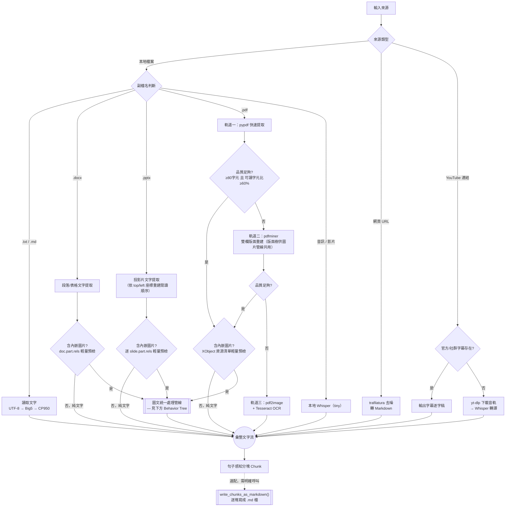
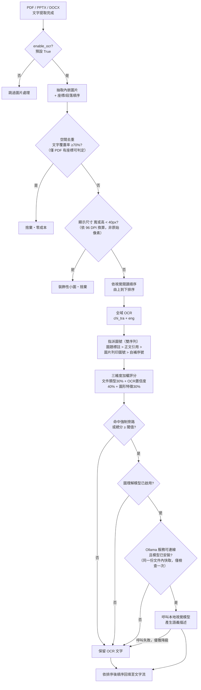

# 獨立文檔與多媒體轉譯器 (Ingestion Parser Engine)

本模組為一獨立、隨插即用的多源文檔轉譯引擎，負責將多種格式的原始輸入（PDF, DOCX, PPTX, MD, TXT, 音訊, 影片, 網頁 URL, YouTube 連結）解析為結構化的純文字，並內建句子感知分塊（Sentence-aware chunking）與表格語意還原能力。

---

## 🎓 學術文獻支撐 (Literature Support)

為了確保在論文中的學術可追溯性，本模組的設計與以下領域的奠基性學術研究進行對焦，以下提供論文寫作的標準 APA 格式引用：

1. **文件版面理解 (Document Layout Understanding)**:
   * **APA 引用**：*Li, M., Xu, Y., Lei, P., Cui, X., Wei, F., & Zhou, M. (2020). LayoutLM: Pre-training of text and layout for document image understanding. In Proceedings of the 26th ACM SIGKDD International Conference on Knowledge Discovery & Data Mining (pp. 3159-3167).*
   * **論文定位**：作為本模組設計「版面解析與閱讀順序還原（Reading Order Recovery）」的理論依據。傳統文字提取流會打亂雙欄排版，而 LayoutLM 證實了結合 2D 空間佈局與文字語意對於理解複雜排版文檔的必要性。
   
2. **版面標註與目標檢測 (Layout Detection)**:
   * **APA 引用**：*Zhong, X., Tang, J., & Yepes, A. J. (2019). PubLayNet: largest dataset for document layout analysis. In Proceedings of the 2019 International Conference on Document Analysis and Recognition (pp. 1015-1022).*
   * **論文定位**：用以支撐本模組將文檔切分為 `Text` (段落), `Title` (標題) 與 `Table` (表格) 等獨立語意區塊的合理性。

3. **表格結構識別 (Table Structure Recognition, TSR)**:
   * **APA 引用**：*Smock, B., Pesala, R., & Robin, G. (2022). PubTables-1M: Towards comprehensive table extraction from images. In Proceedings of the IEEE/CVF Conference on Computer Vision and Pattern Recognition (pp. 4624-4633).*
   * **論文定位**：支撐本模組將 Word 表格解析並重組為 Markdown Grid 語法，以保留行列語意一致性的合理性。

4. **語音識別與弱監督預訓練 (Robust Speech Recognition)**:
   * **APA 引用**：*Radford, A., Kim, J. W., Xu, T., Brockman, G., McLeavey, C., & Sutskever, I. (2023). Robust speech recognition via large-scale weak supervision. Proceedings of the 40th International Conference on Machine Learning, PMLR 202, 28492-28518.*
   * **論文定位**：作為本模組支援音訊、影片檔案及 YouTube 音軌轉譯的理論基礎。驗證了在大規模弱監督音訊數據上訓練的 Sequence-to-Sequence 模型（Whisper）在零樣本（Zero-shot）多語系識別上的強健性。

5. **網頁去噪與主體提取 (Web Scraping & Boilerplate Removal)**:
   * **APA 引用**：*Barbaresi, A. (2021). Trafilatura: A web scraping library and command-line tool for text discovery and extraction. In Proceedings of the Joint Conference of the 59th Annual Meeting of the Association for Computational Linguistics and the 11th International Joint Conference on Natural Language Processing: System Demonstrations (pp. 122-131). Association for Computational Linguistics.*
   * **論文定位**：作為網頁連結轉譯的依據。論證了相較於傳統粗暴的 HTML2Text 轉換，利用特定的排版啟發式規則與標籤比率，能有效去除導航欄、廣告及版權資訊等「噪音（Boilerplate）」，僅保留核心正文，從而提高下游 RAG 檢索的信噪比。

6. **光學字元辨識 (Optical Character Recognition, OCR)**:
   * **APA 引用**：*Smith, R. (2007). An overview of the Tesseract OCR engine. In Proceedings of the Ninth International Conference on Document Analysis and Recognition (ICDAR 2007) (Vol. 2, pp. 629-633). IEEE.*
   * **論文定位**：作為本模組全域 OCR 能力（PDF 軌道三整頁辨識、圖文管線所有內嵌圖片文字擷取）的理論與工程依據。Tesseract 引擎本身即是本模組實際採用的 OCR 實作，此文獻支撐「OCR 為核心基礎能力、獨立於任何圖理解模型」的設計原則。

7. **視覺語言模型 (Vision-Language Model)**:
   * **APA 引用**：*Qwen Team, Alibaba Group. (2025). Qwen2.5-VL technical report. arXiv preprint arXiv:2502.13923.*
   * **論文定位**：作為圖文統一處理管線中「本地圖理解模型」的直接依據。本模組實際部署的視覺模型即為 Qwen2.5-VL（`qwen2.5vl:7b`），此技術報告說明其在高解析度視覺感知、文件/圖表理解與多語言（含繁體中文）任務上的架構設計，支撐「OCR 無法捕捉圖片結構關係（如流程圖箭頭指向、方框層級）時，需仰賴視覺語言模型補足語義」的核心論點。

8. **文檔視覺問答與圖表理解 (Document Visual Question Answering & Chart Understanding)**:
   * **APA 引用**：
     - *Mathew, M., Karatzas, D., & Jawahar, C. V. (2021). DocVQA: A dataset for VQA on document images. In Proceedings of the IEEE/CVF Winter Conference on Applications of Computer Vision (WACV) (pp. 2200-2209).*
     - *Masry, A., Long, D. X., Tan, J. Q., Joty, S., & Hoque, E. (2022). ChartQA: A benchmark for question answering about charts with visual and logical reasoning. In Findings of the Association for Computational Linguistics: ACL 2022 (pp. 2263-2279).*
   * **論文定位**：共同支撐本模組「純文字擷取／OCR 無法完整表達圖表與流程圖語義」的核心假設。這兩篇文獻分別驗證了文檔影像與圖表問答任務需要結合視覺與邏輯推理能力，而非僅依賴文字辨識，是本模組導入圖理解模型、而非僅擴充 OCR 語言包的理論依據。

9. **效率導向的大型模型推論策略 (Cost-Efficient LLM Inference / Model Cascade)**:
   * **APA 引用**：*Chen, L., Zaharia, M., & Zou, J. (2023). FrugalGPT: How to use large language models while reducing cost and improving performance. arXiv preprint arXiv:2305.05176.*
   * **論文定位**：作為本模組「三維度加權評分決定是否升級圖理解模型」（算力分層設計）的理論依據。FrugalGPT 提出以較低成本的模型/方法優先處理，僅在必要時才升級呼叫昂貴的大型模型，此一級聯（cascade）策略與本模組「輕量前置判斷（空間去重→OCR→評分）優先，重型視覺模型僅在評分達標或命中強制旁路規則時才觸發」的設計原則高度一致。

10. **邊緣偵測 (Edge Detection)**:
    * **APA 引用**：*Canny, J. (1986). A computational approach to edge detection. IEEE Transactions on Pattern Analysis and Machine Intelligence, PAMI-8(6), 679-698.*
    * **論文定位**：作為圖形特徵評分（`_graphic_feature_score`）中邊緣密度計算的理論淵源。本模組基於效能與依賴輕量化考量，未直接實作完整 Canny 演算法，改以 PIL 的邊緣濾波搭配 numpy 統計量做輕量近似，但「邊緣密度可作為圖像結構複雜度指標，用以估計流程圖/架構圖機率」此一核心概念源自本文獻。

---

## 🔧 工業級競品與對標專案 (Open Source Projects)

本模組的工程架構借鏡並對標了以下開源專案，並在設計上進行了特化優化：

1. [**Unstructured-IO/unstructured**](https://github.com/Unstructured-IO/unstructured) (Apache-2.0, 26k★):
   * **對照分析**：`unstructured` 引進了極為龐大的依賴鏈。本專案對其進行了 **「骨架化收斂（Skeletal Streamlining）」**，將核心代碼收斂至約 300 行，並在體積小於其 10 倍的前題下，利用輕量 `pdfminer.six` 實作了專屬的「混合排版分流演算法」，在零外部重型 Java/C++ 依賴下達到了同等水準的解析精度。
    
2. [**infiniflow/ragflow (DeepDoc)**](https://github.com/infiniflow/ragflow) (Apache-2.0, 84k★):
   * **對照分析**：`RAGFlow` 透過 YOLOv8 目標檢測模型進行雙欄還原。本模組借鏡了其「先欄位分流，後高度融合」的思路，但在實作上改以純 2D 坐標幾何啟發式算法（Heuristic Spatial Partitioning）在 CPU 上完成毫秒級的雙欄還原，大幅降低了本地端延遲。

3. [**openai/whisper**](https://github.com/openai/whisper) (MIT, 65k★):
   * **對照分析**：原生 Whisper 通常需要強大的 GPU 與數 GB 的 PyTorch 環境來載入大模型。本專案將其限制在 `tiny` 級別的語音識別模型，並與 FastAPI 非同步執行緒池整合，實現在普通電腦 CPU 上以秒級速度完成短影音的轉譯，降低了使用門檻。

4. [**yt-dlp/yt-dlp**](https://github.com/yt-dlp/yt-dlp) (Unlicense/GPLv3+, 178k★):
   * **對照分析**：`yt-dlp` 是 `youtube-dl` 停滯後由社群接手的主流分支，維護活躍、抽取邏輯更新快，已被 Ubuntu 官方收錄。本模組僅在 YouTube 官方／社群字幕皆不存在時，才啟用 `yt-dlp` 下載最佳音軌並交由本地 Whisper 轉譯，作為「零字幕」情境下的最後備援，避免對每支影片都預設下載整條音軌造成不必要的頻寬與運算開銷。

---

## 🛠️ 架構與 Fallback 決策流程 (Behavior Tree)

本轉譯引擎採用多源分流決策架構，以完整達到對標 **NotebookLM** 級別的輸入相容性：



> **注意**：上圖為「文字提取」路由決策樹。**PDF / DOCX / PPTX** 三種格式在文字提取完成後，都會先經過一道
> 輕量的「是否含內嵌圖片」預檢——純文字文件（如論文、合約、純文字投影片大綱）直接併入輸出文字流，等同
> TXT/MD 路徑，完全不進入下方較重的圖文統一處理管線。**PPTX 的圖片關聯存在於各張投影片自己的
> `slide.part.rels`，而非簡報層級的 `prs.part.rels`**——這是實測驗證過的 OOXML 結構細節，若誤查簡報層級
> 關聯會導致所有含圖 PPTX 被誤判為純文字，因此預檢必須逐張投影片掃描。
> 音訊/影片、純文本 (TXT/MD)、網頁 URL、YouTube 連結則不涉及內嵌圖片抽取。
> 品質判定 `_is_low_quality_text`：文字長度 <80 字元，或中英文可讀字元比例 <60%，即判定為低品質、觸發下一軌備援。
> `write_chunks_as_markdown()` 為**選配**步驟（虛線），`parse_file()`／`sentence_aware_chunking()`
> 本身仍是無副作用的純函式，預設不寫任何檔案；只有呼叫端明確呼叫這個函式時，切塊結果才會落地存檔，
> 詳見下方「切塊落地存檔」章節。

---

## 📦 切塊落地存檔 (Chunk Persistence)

`parser/chunk_writer.py` 提供 `write_chunks_as_markdown()`，將 `sentence_aware_chunking()` 的輸出
逐一寫成獨立的 `.md` 檔案，檔名與檔案內部的 YAML frontmatter 都明確標示**來源**與**序號**，確保
下游（embedding、SVO 抽取、知識圖譜寫入）隨時可以從單一切塊檔案追溯回原始文件與其相對位置。

此功能刻意獨立於 `core.py` 之外：`parse_file()`／`sentence_aware_chunking()` 本身維持無副作用的
純函式設計，是否要落地存檔、存到哪裡，交由呼叫端透過 `chunk_writer` 明確選擇性呼叫。

```python
from parser.core import DocumentParser, sentence_aware_chunking
from parser.chunk_writer import write_chunks_as_markdown

parser = DocumentParser()
text = parser.parse_file("report.pdf")
chunks = sentence_aware_chunking(text)

paths = write_chunks_as_markdown(chunks, source="report.pdf", output_dir="./chunks")
# ./chunks/report__chunk-001-of-012.md
# ./chunks/report__chunk-002-of-012.md
# ...
```

每個檔案的內容格式：

```markdown
---
source: "report.pdf"
chunk_index: 1
total_chunks: 12
---

（此處為該切塊的文字內容）
```

- **檔名安全化**：`source` 可能是檔案路徑或 URL，`_safe_filename_stem()` 會移除檔名系統不允許的
  字元（`\ / : * ? " < > |`），確保產生的檔名在 Windows/macOS/Linux 上都合法。
- **重跑自動清理**：同一 `source` 重新處理後（例如文件內容更新、分塊數變少），會先清除該來源
  舊有的分塊檔案再寫入新的一批，避免資料夾裡殘留跟目前內容對不上的過期檔案；不影響同資料夾內其他
  來源的分塊檔案。
- **不引入 PyYAML**：frontmatter 以手動字串組裝產生（字串值自動加雙引號並跳脫特殊字元），維持
  模組輕量化定位；此 frontmatter 僅供輸出／人工與下游程式解析，不需要支援回讀。

---

## 🖼️ 圖文統一處理管線 (Image Understanding Pipeline)

除純文字提取外，`parser/image_pipeline.py` 額外實作了 PDF / PPTX / DOCX 內嵌圖片的處理管線，
完整設計依據見 [`文檔轉譯器 最終優化架構總結（可跨模型接續討論）.md`](./文檔轉譯器%20最終優化架構總結（可跨模型接續討論）.md)。

### 圖文統一處理管線 Behavior Tree



> 強制旁路命中條件（由精準到寬鬆）：`force_image_understanding=True` 或 `doc_type` 落在
> `force_visual_parse_doc_types` 清單 / 圖片自身鄰近文字命中「如下圖」「如上圖」等通用關鍵字 /
> 該圖有原文圖號時，正文精確引用該圖號（如「如圖3所示」，避免同頁多圖時誤觸發不相關的圖）/
> 該圖無原文圖號可比對（自補序列）時，退回檢查全文是否有通用旁路關鍵字，作為安全網。
>
> **Ollama 可用性檢查**：第一張需要呼叫圖理解模型的圖片會先打一次輕量的 `/api/tags`
> （列出已安裝模型、不需載入模型進 VRAM，短逾時 `ollama_availability_check_timeout_seconds`
> 預設 5 秒），同時確認服務可連線、且 `ollama_vision_model` 指定的模型已安裝，結果快取供
> 同一份文件後續所有圖片共用。這是為了避免文件內每一張符合評分/強制旁路門檻的圖片都各自重新
> 嘗試連線，各自等到完整的 `ollama_timeout_seconds`（預設 60 秒）逾時才發現服務不可用——
> 最壞情況可能是幾十張圖片各等 60 秒。每次 `parse_file()` 處理新文件時會重置此快取，讓長時間
> 運行的服務仍有機會重新確認 Ollama 狀態（例如使用者在處理上一份文件後才啟動 Ollama）。健康
> 檢查通過後，實際呼叫 `/api/generate` 仍可能因其他原因失敗（如模型載入中），此時僅記錄警告、
> 不影響後續圖片繼續嘗試。

核心原則：

1. **能力解耦**：OCR 文字提取為核心基礎能力，`enable_ocr` 預設 `True`，完全不依賴圖理解模型即可運作；
   圖理解語義模型為選配增強能力，`enable_image_understanding` 預設 `False`，需另行啟動本機 [Ollama](https://ollama.com/) 服務並安裝多模態模型（預設對應 `qwen2.5vl:7b`）才會生效。未安裝/未啟動時自動降級為保留 OCR 結果，不中斷解析流程。
2. **算力分層**：文件級輕量預檢（PDF/DOCX/PPTX 先確認是否含任何內嵌圖片，純文字文件直接略過整套
   圖片管線；PDF 另會快取 pdfminer 版面樹供軌道二與圖片管線共用，避免重複解析）→ 依視覺閱讀順序
   （PDF 依 y 座標、PPTX 依 (top, left) 座標分列重建）排序 → 空間去重（跳過已被原生文字覆蓋 ≥70%
   的裝飾性圖片）→ 全域 OCR → 三維度加權評分（文件類型 30% + OCR 置信度 40% + 輕量圖形特徵 30%，
   預設閾值 60 分）→ 命中強制旁路規則時直接跳過評分 → 分數達標才呼叫本地圖理解模型補足語義。
3. **圖號雙序列**：原文既有圖號（如「圖3」）與系統自動補號（`自補圖-1`、`自補圖-2`）各自獨立遞增，永不互相覆蓋；
   指派順序依視覺閱讀順序而非文件內部發現順序，確保與最終回填順序一致。
4. **圖片不落地**：圖片僅在處理過程中存於記憶體，處理完即釋放，輸出僅保留文字描述（OCR 文字或圖理解語義描述），不寫入磁碟。

### 設定方式

```python
from parser.core import DocumentParser
from parser.image_pipeline import ImagePipelineConfig

config = ImagePipelineConfig(
    enable_image_understanding=True,       # 開啟本地圖理解模型兜底
    ollama_base_url="http://localhost:11434",
    ollama_vision_model="qwen2.5vl:7b",    # 預設值；可換成其他已安裝的視覺模型
    score_threshold=60.0,
    force_visual_parse_doc_types=["pptx"], # 例如：PPT 全域強制圖理解
)
parser = DocumentParser(image_config=config)
text = parser.parse_file("report.pdf")
```

若不提供 `image_config`，則沿用預設值（OCR 開啟、圖理解模型關閉），行為與升級前完全相容。

> **模型選型備註**：預設採用 `qwen2.5vl:7b` 而非社群常見的 `llava`，因其對繁體中文與流程圖／架構圖等結構化圖表的
> OCR、版面理解能力明顯較佳，7B 量化後約 6GB，可在 8GB VRAM 等級的消費級 GPU（如 RTX 4060/4070 Laptop）上順暢運行。
> 若本機 VRAM 較小（如 4-6GB），可改用更輕量的 `minicpm-v` 或 `llava-phi3`；VRAM 充足時可升級至 `qwen2.5vl:32b` 等更大模型以取得更精確的圖表理解品質。

### 已知限制 (Known Limitations)

1. **`_detect_double_column` 為既有未使用方法**：此輔助函式存在於 `core.py` 但目前沒有任何呼叫點
   （早於本次圖文管線改動即存在），與圖文管線無關，暫不清理以維持變更範圍最小化。
2. **整頁掃描件（軌道三 OCR fallback）目前只做純文字 OCR，不會對頁面中可能存在的圖表/流程圖
   做圖理解**：`_parse_pdf` 在 `used_ocr_fallback=True` 時會完全跳過圖文管線，理由是效能考量
   （避免對同一份掃描影像重複解析）加上技術限制（圖文管線目前基於 pdfminer 找頁面中「獨立內嵌
   小圖」，而整頁掃描件本質上是一張跟頁面同大的圖，不是「文字段落＋幾張小圖」的組合，套用現有邏輯
   意義不大）。**但這代表若掃描頁裡本身有一張手繪流程圖或圖表，圖片的結構/關係資訊（而非純文字）
   會被遺漏**——OCR 只能讀出圖裡印刷的文字，讀不出箭頭指向、方框層級這類空間關係。
   `ImagePipelineConfig.doc_type_base_score` 裡的 `"pdf_scanned": 55.0` 分類即是為此情境預留，
   但目前完全沒有路徑會用到它。已評估過修正方案（重用軌道三 `convert_from_path()` 產生的整頁圖，
   直接餵給 `ImagePipeline.process_image()` 走一樣的評分/圖理解流程），但刻意選擇暫不實作，維持
   「整頁掃描件先以純 OCR 為主」的簡化策略。

#### 已解決的歷史限制

以下項目曾記錄為已知限制，已於後續迭代解決：

- **同頁多圖過度觸發強制旁路** → `check_forced_bypass` 現在採三層判斷：(1) 圖片自身鄰近文字命中
  通用旁路關鍵字；(2) 該圖有原文圖號時，要求正文精確引用該圖號（如「如圖3所示」）才觸發，避免同頁
  其他不相關圖片被連帶誤觸發；(3) 該圖沒有原文圖號可比對（自補序列）時，才退回檢查全文通用旁路
  關鍵字作為安全網，避免「單一無編號圖片＋泛用引用語句」的情境完全漏判。
- **DOCX 圖片與標題分屬不同段落時圖說偵測失效** → `_process_docx_paragraph_images` 現在會在圖片
  所在段落本身無文字時，優先向下、其次向上搜尋一個符合圖號標註格式的鄰近段落作為圖說候選，對應
  Word「插入標題」慣例（圖片自成一段、標題另起一段）。
- **PDF 圖片管線與軌道二重複呼叫 `extract_pages()`** → 新增 `_load_pdf_layout` 快取機制，軌道二
  與圖片管線共用同一份已載入的版面樹狀結構（`pages_layout`），同一份 PDF 不再被 pdfminer 解析兩次。
- **裝飾性小圖過濾誤判**：原本 `min_image_dimension_px` 檢查的是解碼後圖片檔案的原始像素尺寸，
  跟圖片在頁面/投影片上「實際顯示」多大是兩件事——高解析度照片可能被縮小顯示成裝飾小圖示（誤放行、
  浪費算力），低解析度截圖也可能被放大顯示成有意義的大小（誤判為裝飾圖而濾除）。現在改為優先使用
  `process_image(display_size_px=...)` 傳入的實際顯示尺寸（PDF 用 bbox point、PPTX 用
  `shape.width/height` EMU、DOCX 用 `a:blip` 對應的 `wp:extent` EMU，統一換算成 96 DPI 基準像素），
  取不到時才退回原始像素尺寸判斷。

## 📦 系統依賴說明 (System Prerequisites)

由於部分提取軌道涉及影像處理與音訊重組，請確保本機已安裝以下工具並加入系統環境變數 PATH 中：

1. **Poppler** (用於 `pdf2image` 渲染 PDF 頁面)：
   * *Windows (Scoop)*: `scoop install poppler`
   * *Windows (Chocolatey)*: `choco install poppler`
   * *macOS (Homebrew)*: `brew install poppler`

2. **Tesseract-OCR** (用於光學字元識別)：
   * *Windows (Winget)*: `winget install UB-Mannheim.TesseractOCR`
   * *macOS (Homebrew)*: `brew install tesseract`

3. **FFmpeg** (用於 `whisper` 進行音訊編碼與切分)：
   * *Windows (Scoop)*: `scoop install ffmpeg`
   * *Windows (Chocolatey)*: `choco install ffmpeg`
   * *macOS (Homebrew)*: `brew install ffmpeg`

4. **Ollama**（選配，僅在啟用 `enable_image_understanding=True` 時需要，用於本地圖理解模型兜底）：
   * *Windows (Winget)*: `winget install Ollama.Ollama`
   * *macOS/Linux*: 參考 [ollama.com/download](https://ollama.com/download)
   * 下載預設視覺模型：`ollama pull qwen2.5vl:7b`（或其他支援視覺輸入的模型，並對應設定 `ollama_vision_model`）
   * 未安裝或服務未啟動時，圖片管線會自動降級為僅保留 OCR 結果，不影響其餘解析流程
