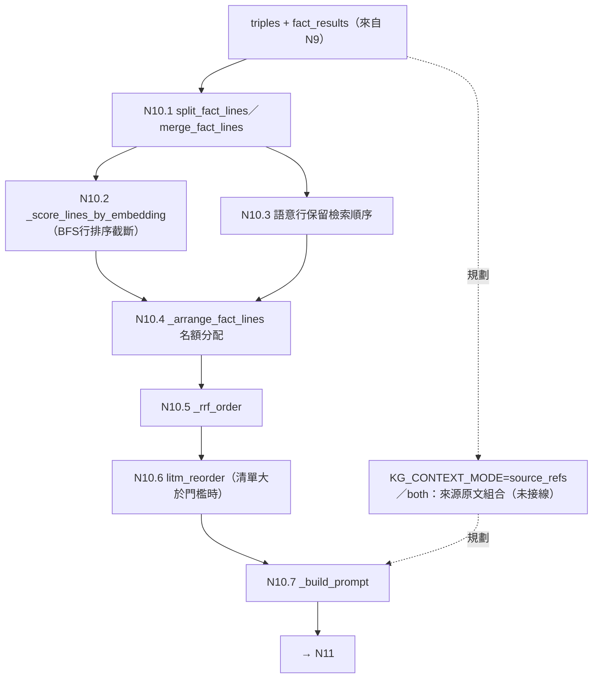

# N10 上下文組裝——節點卡

> **基準**：`worktree-sdd-retrieval-comparison` @ `80077e6`（2026-09-30 核對；程式碼相對 `4f6ae52` 零變更）。
> **性質**：節點卡格式的第一批試作（報告155 T1；草案 [§6.1](../../docs/報告/BT_SM節點化結構設計草案_v0.1.md)）。
> **書寫規則**：只寫經程式碼核對的事實；設計中的內容一律標「**規劃**」；沒核對的標「**未核對**」。
> **重要**：本資料夾（`services/context/`）目前有 `fact_lines.py`（N10.1 與 N10.6 的純函式、事實行渲染）與 `telemetry.py`（檢索遙測與來源序列化）。N10.2–N10.5、N10.7（名額分配、RRF、prompt 組裝）**仍在** `routers/agent.py`，本卡逐一標明實際位置。

## 1. 目的與規劃狀態

把 N9 取回的事實排成 LLM 容易使用的清單：去重、控制長度、最相關的放在注意力強的位置，並組出 prompt。狀態：**✅ 已上線**（報告95 §12）。

- 沒有獨立進入函式；`routers/agent.py::_build_prompt`（`:816`）是 prompt 組裝入口，`chat()` 經 `_generate_from_context_lines`（`:996`）等路徑呼叫它。
- **規劃**：來源 Chunk 回提／雙軌上下文（SDD-57），目前**只有零件**，未接進 `chat()`（見 §5）。

## 2. 節點約定表（草案 §2.1）

| 欄位 | 內容 |
| --- | --- |
| 輸入 | `triples: list[SVOTriple]`（BFS）、`fact_results: list[dict]`（Fact 向量檢索）、`question`、可選 `question_vector`、`history`、`KGConfig` |
| 輸出 | 排好的事實行 `list[str]`（`_arrange_fact_lines`）；`_build_prompt` 回傳完整 prompt 字串。另有檢索遙測 `dict` 與來源序列化 `dict`（`services/context/telemetry.py`）。**尚無獨立的輸出型別**（規劃：contract）。 |
| 副作用 | `_score_lines_by_embedding` 呼叫 embedding provider（`encode_batch`；`lines` 為空時提前回傳、不觸碰 provider，`routers/agent.py:507-545`）。`services/context/*` 的純函式無 I/O（模組 docstring 明載）。`_fetch_document_map`（`routers/agent.py:372`）查 Neo4j `Document` 節點，屬來源序列化的資料準備，**歸屬（N10 或 N12 呈現）未核對**。 |
| 失敗行為 | `_arrange_fact_lines` 在無事實時直接回空清單（`_build_prompt` 內 `if has_context else []`，`:842`）。其餘**未核對**。 |
| 事件 | 無（不擁有 SM） |

## 3. 葉節點與實際位置

編號沿用報告95 §12。**「現在位置」欄是本卡的可檢查主張**（T2 腳本以 AST 核對函式存在與檔案）。

| 葉節點 | 目的 | 現在位置 | 狀態 |
| --- | --- | --- | --- |
| N10.1 事實行拆分 | 邊與 Fact 分成 BFS 行／語意行兩份清單 | `services/context/fact_lines.py::split_fact_lines`（`:57`） | 已搬移（報告141）；`routers/agent.py` 以 `_split_fact_lines` 重新匯出 |
| N10.1 合併 | 邊與 Fact 合成一份清單 | `services/context/fact_lines.py::merge_fact_lines`（`:147`） | 已搬移（報告141）；以 `_merge_fact_lines` 重新匯出 |
| N10.1 殘缺行過濾 | 判斷是否為有內容的行 | `services/context/fact_lines.py::is_contentful_line`（`:39`） | 已搬移（報告139）；以 `_is_contentful_line` 重新匯出 |
| N10.1 型別標記清除 | 輸出前清除殘留的型別標記 | `services/context/fact_lines.py::strip_type_markers`（`:35`） | 已搬移（報告139）；以 `_strip_type_markers` 重新匯出 |
| N10.2 BFS 行排序（輔助） | 以 embedding cosine 對問題排序 BFS 行 | `routers/agent.py::_score_lines_by_embedding`（`:507`） | 仍在原處 |
| N10.2–N10.4 名額分配 | 語意行優先佔位、BFS 保底、截斷 | `routers/agent.py::_arrange_fact_lines`（`:572`） | 仍在原處 |
| N10.5 RRF | 融合兩個排名 | `routers/agent.py::_rrf_order`（`:548`） | 仍在原處 |
| N10.6 zigzag | 緩解 Lost-in-the-Middle | `services/context/fact_lines.py::litm_reorder`（`:156`） | 已搬移（報告139）；以 `_litm_reorder` 重新匯出 |
| N10.7 prompt 組裝 | 加入領域指令與生成指示 | `routers/agent.py::_build_prompt`（`:816`） | 仍在原處 |
| （周邊）檢索遙測 | 檢索量體（字元數、筆數、延遲） | `services/context/telemetry.py::build_retrieval_telemetry`（`:24`） | 已搬移（報告143）；以 `_build_retrieval_telemetry` 重新匯出 |
| （周邊）檢索 trace | 記錄候選與實際入 prompt 的事實 | `services/context/telemetry.py::build_retrieval_trace`（`:46`） | 已搬移（報告143）；以 `_build_retrieval_trace` 重新匯出 |
| （周邊）來源序列化 | 回答 `sources` 事件內容 | `services/context/telemetry.py::serialize_sources`（`:105`）、`serialize_document`（`:13`） | 已搬移（報告143）；以 `_serialize_sources`、`_serialize_document` 重新匯出 |

> 「（周邊）」列在報告95 §12 的 N10.1–N10.7 **之外**（P2 第三刀將它們放進 `services/context/`）；其節點歸屬**未定案**，本卡僅登記位置。

**呼叫關係（已核對）**：`_build_prompt`（`context_lines is None` 時）→ `_split_fact_lines` → `_arrange_fact_lines`（內部：`_score_lines_by_embedding` → 名額分配 → `_rrf_order` →〔清單大於門檻時〕`_litm_reorder`）。`_build_prompt(context_lines=…)` 走另一分支，**跳過** `_split_fact_lines`／`_arrange_fact_lines`（供 harness 的 baseline 臂使用，`routers/agent.py:828-830,845-847`）。`_arrange_fact_lines` 另有呼叫點在 `:780`（子問題／定向修訂路徑）與 `:959`（限制式 prompt）。

## 4. 結構圖

實線＝現有程式呼叫；虛線＝規劃中（未實作）。

## 5. 決策槽（**規劃／登記**）

| 槽名（規劃） | 候選（草案） | 現況（已核對） |
| --- | --- | --- |
| `KG_CONTEXT_MODE`（N9／N10 共有） | `source_refs`（預設）／`fact_chain`（現有 K）／`both` | 程式碼中**無此槽名**（`.py` 零命中）。現行行為＝`fact_chain`：`_build_prompt` 把事實行放進 prompt（`:849-850`，前綴「以下是從知識圖譜檢索到、可能與問題相關的事實」）。`source_refs` 只有零件 `services/retrieval_service.py::_read_chunk_text`（`:85`），**未接進** `chat()`／`_build_prompt`；報告82 原型沒有測到本模式。**規劃**；行為變更屬 M3，需先有召回探測結果（報告155 T5）。 |

其餘 N10 內部的「策略」（名額 `bfs_keep_max`／`truncate_k`／`reorder_threshold_k`／`min_bfs_slots`／`rrf_k`）目前是 `cfg.factlist.*` 設定值而非決策槽（已核對 `_arrange_fact_lines` 讀 `_cfg.factlist.*`，`routers/agent.py:614-629`）。

## 6. 擁有的 SM

**無**。

## 7. ports 與設定

| 項目 | 現況（已核對） |
| --- | --- |
| Embedding | `_score_lines_by_embedding` 接收 `embedding_provider: EmbeddingProvider \| None` 與可選 `question_vector`；型別來自 `core.providers.base`。`services/context/*` 內**沒有** embedding 呼叫。 |
| 設定 | `_arrange_fact_lines`、`_build_prompt` 接收 `cfg: KGConfig \| None`，`None` 時用 `KGConfig()` 預設；`_build_prompt` 讀 `cfg.domain.system_context` 作 prompt 前綴（`:905`）。 |
| 依賴限制 | `services/context/fact_lines.py` 只依賴 `re`、`core.constants`（`ENTITY_TYPES`）與 `models.knowledge_graph`；`telemetry.py` 只依賴 `models.knowledge_graph`、`models.law_document` 與同層 `fact_lines`（各模組 docstring 明載；測試以 AST 強制，見 §9）。**不讀** `core.config`。 |

## 8. 論文章節與報告

| 對象 | 出處 |
| --- | --- |
| 論文 | 03 §3.6、§3.9；04 §4.7.3（`docs/論文/`）；來源回提零件見 03 §3.2 §g／04 §4.7.4／07 §7.4 |
| 節點說明 | [報告95 §12](../../docs/報告/95_專案節點流程總覽與設計說明.md) |
| P2 搬移 | 第一、二刀 [報告139](../../docs/報告/139_M2_P2第一刀_context_fact_lines抽出SDD任務書.md)／[141](../../docs/報告/141_M2_P2第二刀_split_merge_fact_lines抽出SDD任務書.md)；第三刀 [報告143](../../docs/報告/143_M2_P2第三刀_遙測群telemetry抽出SDD任務書.md)；累計快照 [報告148](../../docs/報告/148_P2累計K臂快照結果.md) |
| 拆分盤點 | [報告138](../../docs/報告/138_agent_py拆分盤點結果.md) |
| 來源回提原型 | [報告82](../../docs/報告/82_GAP_S3_01上下文組裝離線消融原型SDD任務書.md) |
| 設計 | [BT_SM節點化結構設計草案](../../docs/報告/BT_SM節點化結構設計草案_v0.1.md) §3.2、§3.6 |

## 9. 測試

| 測試 | 位置 | 說明 |
| --- | --- | --- |
| `fact_lines.py` 單元測試與反向依賴 AST 測試 | `tests/services/test_context_fact_lines.py` | AST 檢查從 `:81` 起 |
| `telemetry.py` 單元測試與反向依賴 AST 測試 | `tests/services/test_context_telemetry.py` | AST 檢查從 `:299` 起 |
| 端到端（仍在 `routers/agent.py` 的葉節點） | `tests/routers/test_agent.py` | 涵蓋 `_arrange_fact_lines`、`_build_prompt`、`_score_lines_by_embedding` |
| `_arrange_fact_lines` 另見 | `tests/services/test_svo_service.py` | 該檔內有引用 |
| `_rrf_order` | 無以名稱直接引用的測試 | 僅經 `_arrange_fact_lines` 間接覆蓋（`tests/` 內 `.py` 檔以名稱搜尋零命中） |
| 抽離測試（草案 §5.1） | **未做** | N10.2–N10.5、N10.7 仍在 `routers/agent.py`，且 `_arrange_fact_lines` 依賴 `KGConfig` 與 `EmbeddingProvider` |

> 測試補丁提醒：已搬移的函式在 `routers/agent.py` 以底線私有名重新匯出；`patch("routers.agent._merge_fact_lines")` 這類形式仍有效，直接 patch `services.context.fact_lines.…` 不會影響 `routers.agent` 已綁定的名稱。

## 10. 已知缺口（沿用報告95 §12 登記；未逐項重新驗證其狀態）

| 項目 | 類型 | 說明 |
| --- | --- | --- |
| 來源 Chunk 回提／雙軌上下文（SDD-57） | 📐 | 只有 `retrieval_service._read_chunk_text` 零件；報告82 小樣本原型（3/10）不支持投入完整工程 |
| 名額與截斷參數校準 | 🟡 | 參數已可配置，未校準；截斷門檻非單調（報告62 §10） |
| 上下文組裝沒有獨立輸出型別／contract | 規劃 | |
| `_build_prompt` 內含大量生成指示（區間查表、分段回答、前後一致等） | 現況 | 與 N11 的界線**未定案**（報告95 將 `_build_prompt` 歸 N10.7）；搬移前需先決定 |
