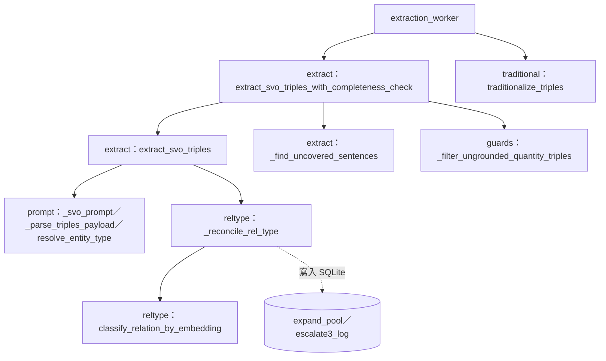

# N4 SVO 抽取——節點卡

> **基準**：`worktree-sdd-retrieval-comparison`（報告160 U1 切法3 完成後）。書寫規則同 [N9 卡](../retrieval/NODE.md)：只寫經程式碼核對的事實，設計中的標「規劃」，沒核對的標「未核對」。
> **重要**：N4 的 62 個符號已由 `services/svo_service.py` 整組搬入本資料夾（**行為不變**，逐字搬移，唯一例外是資料檔路徑定位）；`svo_service.py` 以重新匯出保留舊名稱（同一物件）。

## 1. 目的與規劃狀態

把一個 chunk 的文字交給 LLM 抽成受控關係的 SVO 三元組，並做事後驗證：型別／關係型別仲裁（SIM／COMPARE／ESCALATE3）、完整性自我核對（未涵蓋句子補抽）、數值／類別／子句忠實性守衛、選擇性轉繁。狀態：**✅ 已上線**（報告97 §6.4）。入口：`services/extraction/extract.py::extract_svo_triples_with_completeness_check`（呼叫者：`services/extraction_worker.py`）。

## 2. 節點約定表

| 欄位 | 內容 |
| --- | --- |
| 輸入 | `text: str`、`original_sentences`、`llm_provider`、`embedding_provider`（皆可為 `None`＝靜默降級，見 §7）、`cfg: KGConfig \| None`、`kg_id`、`calibration_db_path` |
| 輸出 | `list[SVOTriple]`（N4→N5 共用資料型別，`models/knowledge_graph.py`） |
| **副作用（現況）** | **只有 `_reconcile_rel_type` 兩處寫 SQLite**：ESCALATE3 判定「兩者皆非」時 `expand_governance_service.add_candidate(...)`（先呼叫一次 `embedding_provider.encode(verb)`）與每次走到 ESCALATE3 時 `sim_calibration_service.log_escalation(...)`；僅在 `kg_id` 與 `calibration_db_path` 皆非 `None` 時發生（見 `services/extraction/reltype.py::_reconcile_rel_type`，`:55` 起）。另有行程內快取（`lru_cache`×7、`_TYPE_DESCRIPTION_EMBEDDING_CACHE`）、讀檔（`data/schema_org_entity_types.json`、KG 資料夾 `*/original.md`）與 logging。**不碰 Neo4j**。 |
| 失敗行為 | 例外向上拋（LLM／embedding／SQLite 錯誤皆會讓整個 chunk 抽取失敗，由 `extraction_worker._process_one` 標 `failed`）；細節見報告158 §6（E2、E5） |
| 事件 | 無（不擁有 SM）；**規劃**：把上述兩處寫入改成回傳事件，語意（E1–E5）尚待裁示，本次搬移**未改** |

## 3. 符號與實際位置

62 個符號（40 函式＋22 常數）。**「現在位置」欄是可檢查主張**（`check_node_cards.py` 以 AST 核對）。

| 模組 | 現在位置 | 狀態 |
| --- | --- | --- |
| prompt.py｜提示詞、實體／關係型別詞彙與 LLM 輸出解析 | 函式 8：`services/extraction/prompt.py::_strip_json_fence`（`:14`）、`services/extraction/prompt.py::_parse_triples_payload`（`:20`）、`services/extraction/prompt.py::_normalize_type_key`（`:50`）、`services/extraction/prompt.py::_load_extended_entity_type_lookup`（`:60`）、`services/extraction/prompt.py::resolve_entity_type`（`:72`）、`services/extraction/prompt.py::_effective_rel_types`（`:96`）、`services/extraction/prompt.py::_effective_rel_type_descriptions`（`:102`）、`services/extraction/prompt.py::_svo_prompt`（`:111`）；常數 3 | 已搬移（報告160 U1）；`svo_service.py` 重新匯出 |
| reltype.py｜關係型別 embedding 比對與 COMPARE／ESCALATE3 仲裁 | 函式 3：`services/extraction/reltype.py::_type_description_embeddings`（`:20`）、`services/extraction/reltype.py::classify_relation_by_embedding`（`:35`）、`services/extraction/reltype.py::_reconcile_rel_type`（`:55`）；常數 1 | 已搬移（報告160 U1）；`svo_service.py` 重新匯出 |
| extract.py｜SVO 抽取與完整性自我核對 | 函式 3：`services/extraction/extract.py::extract_svo_triples`（`:26`）、`services/extraction/extract.py::_find_uncovered_sentences`（`:105`）、`services/extraction/extract.py::extract_svo_triples_with_completeness_check`（`:149`）；常數 1 | 已搬移（報告160 U1）；`svo_service.py` 重新匯出 |
| guards.py｜數值／類別／子句守衛（含被實體去重共用的樣式建構） | 函式 20：`services/extraction/guards.py::_regex_token_alternation`（`:48`）、`services/extraction/guards.py::_compile_measure_pattern`（`:58`）、`services/extraction/guards.py::_build_measure_pattern`（`:65`）、`services/extraction/guards.py::_compile_range_comparator_pattern`（`:88`）、`services/extraction/guards.py::_build_range_comparator_pattern`（`:102`）、`services/extraction/guards.py::_compile_enum_guard_pattern`（`:120`）、`services/extraction/guards.py::_build_enum_guard_pattern`（`:131`）、`services/extraction/guards.py::_compile_scope_modifier_pattern`（`:142`）、`services/extraction/guards.py::_build_scope_modifier_pattern`（`:146`）、`services/extraction/guards.py::_has_scope_modifier`（`:159`）、`services/extraction/guards.py::_contains_ungrounded_quantity`（`:163`）、`services/extraction/guards.py::_rival_family_term`（`:200`）、`services/extraction/guards.py::_contains_ungrounded_family_term`（`:209`）、`services/extraction/guards.py::_split_into_clauses`（`:245`）、`services/extraction/guards.py::_normalize_for_binding`（`:250`）、`services/extraction/guards.py::_quantity_unit`（`:262`）、`services/extraction/guards.py::_rival_quantity`（`:271`）、`services/extraction/guards.py::_quantity_mis_bound_to_clause`（`:284`）、`services/extraction/guards.py::_risk_category_misbound_to_clause`（`:349`）、`services/extraction/guards.py::_filter_ungrounded_quantity_triples`（`:401`）；常數 16 | 已搬移（報告160 U1）；`svo_service.py` 重新匯出 |
| traditional.py｜選擇性轉繁（含被維護函式與 routers.agent 共用者） | 函式 6：`services/extraction/traditional.py::_opencc_s2tw`（`:10`）、`services/extraction/traditional.py::_to_traditional`（`:19`）、`services/extraction/traditional.py::_to_traditional_selective`（`:34`）、`services/extraction/traditional.py::_kg_source_charset`（`:50`）、`services/extraction/traditional.py::_fix_known_simplified_compounds`（`:82`）、`services/extraction/traditional.py::traditionalize_triples`（`:90`）；常數 1 | 已搬移（報告160 U1）；`svo_service.py` 重新匯出 |
| （相鄰，不屬 N4）N9.7 查詢端關係型別解析；使用本節點的 `classify_relation_by_embedding`、`_effective_rel_type_descriptions` | `services/svo_service.py::resolve_query_relation_type`（`:216`） | 仍在原處 |

## 4. 結構圖

模組相依（無循環）：`extract → {guards, prompt, reltype}`、`reltype → prompt`、`guards → traditional`。**本資料夾不得 import `svo_service`**（`tests/services/test_n4_move.py` 以 AST 強制）。

## 5. 決策槽（規劃／登記）

| 槽名 | 現況 |
| --- | --- |
| `REL_TYPE_ARBITRATION`（草案 §3.2） | 已是 Fallback 串接：embedding 判定 → COMPARE（`compare_cosine_threshold`）→ ESCALATE3（LLM）；**無決策紀錄機制**（規劃）。 |

## 6. 擁有的 SM

無。

## 7. ports 與設定

| 項目 | 現況（已核對） |
| --- | --- |
| LLM | `LLMProvider.generate`、`generate_json`（`core/providers/base.py`）；`None` 時 `extract_svo_triples` 回空清單、`_reconcile_rel_type` 直接採信 LLM 自報型別（**靜默降級**，草案附錄 A.2 #2） |
| Embedding | `EmbeddingProvider.encode`、`encode_batch`；`None` 時略過 SIM／COMPARE／ESCALATE3 與完整性核對 |
| 設定 | 全由 `cfg=` 傳入：`cfg.domain.{rel_type_extensions,svo_fewshots}`、`cfg.reltype.compare_cosine_threshold`、`cfg.extraction.uncovered_sentence_threshold`、`GuardConfig.*`；**不讀** `core.config`。私有相依：`core.kg_config.model._DEFAULT_SVO_FEWSHOTS`（`prompt.py`） |
| 依賴 | 依賴 `services.expand_governance_service`、`services.sim_calibration_service`（SQLite 寫入，見 §2）、`services.classify_service.cosine_similarity` |
| 位置相依 | `prompt：_EXTENDED_ENTITY_TYPES_PATH` 以 walk-up 找 `data/schema_org_entity_types.json`（不依賴目錄深度；報告160 U1 修正，原寫法搬深一層會靜默失效）；`tests/services/test_n4_move.py` 斷言查表載入後非空（≥900） |

## 8. 論文章節與報告

| 對象 | 出處 |
| --- | --- |
| 論文 | 03 §3.1.3、§3.1.3 §a（EXPAND／SIM）；04 §4.4（`docs/論文/`；搬移後的位置**尚未同步**，見報告152 對映表） |
| 設計與盤點 | [報告97 §6.4](../../docs/報告/97_專案目標與BT_SM工作流設計.md)、[報告158](../../docs/報告/158_N4依賴與副作用只讀盤點結果.md)、[報告160](../../docs/報告/160_下一階段任務規劃_N4獨立化準備與來源回取再探測.md)、[草案附錄 A](../../docs/報告/BT_SM節點化結構設計草案_v0.1.md) |

## 9. 測試

| 測試 | 位置 | 說明 |
| --- | --- | --- |
| 搬移驗收 | `tests/services/test_n4_move.py` | 62 符號逐字比對（搬移前基準 `tests/services/fixtures/n4_symbol_source_baseline.json`）、重新匯出身分、`svo_service` 不再定義、本資料夾不 import `svo_service`、資料檔查表非空、補丁陷阱文件化 |
| 差分測試 | `tests/services/test_n4_differential.py` | 1536 案，golden 由**搬移前**實作產生（輸出、例外型別與訊息、`add_candidate`／`log_escalation` 呼叫序列、logger 記錄）；案例產生器 `tests/services/n4_differential_harness.py` |
| 既有單元測試 | `tests/services/test_svo_service.py`、`test_svo_service_cfg_wiring.py` | 補丁目標已改為指向呼叫者所在的新模組（報告160 U1 切法3） |
| 抽離測試（草案 §5.1） | **未做** | 尚未接假 ports 獨立驗證；本節點仍依賴 SQLite 服務模組 |

> **補丁提醒**：舊名稱雖可經 `svo_service` 取得（同一物件），但**補丁 `svo_service.X` 只會改到 `svo_service` 的綁定**，不影響已搬走的呼叫者。要替換 N4 內部呼叫（例如 `extract_svo_triples` 內的 `_reconcile_rel_type`），補丁必須指向 `services.extraction.extract` 等呼叫者所在的模組。

## 10. 已知缺口與債務

| 項目 | 類型 | 說明 |
| --- | --- | --- |
| **共用輔助的節點歸屬** | 債務（**不裁定**） | 11 個符號被 N5／N9／N11／維護函式共用（守衛樣式建構 `_build_*_pattern`、`_has_scope_modifier`、`_to_traditional*`、`_kg_source_charset`、`_effective_rel_types`、`_effective_rel_type_descriptions`、`classify_relation_by_embedding`，報告158 §5.2）。為避免循環匯入一併搬入本資料夾，歸屬（屬 N4 或共用層）待裁示 |
| EXPAND／ESCALATE3 寫入的事件契約 | 規劃 | 需先決定 E1–E5（報告158 §6）；其中 E3、E4 需實測 |
| `svo_service.py` 仍有其餘 N5／N9／維護符號 | 現況 | P3 的其餘部分未做 |
| 論文位置同步 | 待辦 | 論文 03／04 引用的 `svo_service.py` 位置需另批次同步（本階段不改論文） |
