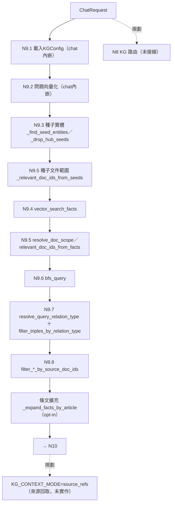

# N9 KG 內檢索——節點卡

> **基準**：`worktree-sdd-retrieval-comparison` @ `80077e6`（2026-09-30 核對；程式碼相對 `4f6ae52` 零變更）。
> **性質**：節點卡格式的第一批試作（報告155 T1；草案 [§6.1](../../docs/報告/BT_SM節點化結構設計草案_v0.1.md)）。
> **書寫規則**：只寫經程式碼核對的事實；設計中的內容一律標「**規劃**」；沒核對的標「**未核對**」。
> **重要**：本資料夾（`services/retrieval/`）目前有 `scope.py`（N9.5、N9.8 的純函式）、`fact_candidates.py`（Fact 候選純處理，報告168 W1 切法1）與 `bfs.py`（BFS 純輔助與 2 個預設值常數，報告168 W1 切法2）。N9 的其餘葉節點（`vector_search_facts`、`vector_search_entities`、`bfs_query`、`resolve_query_relation_type`、`routers/agent.py` 內的成員、`chat()` 內嵌的 N9.1／N9.2）**仍在**原處，本卡逐一標明實際位置，**不得**因為資料夾叫 `retrieval` 就當成整個 N9 已搬入。

## 1. 目的與規劃狀態

在選定的單一 KG 內，結合具名實體錨點、Fact 語意相似度與圖鄰接取回相關事實，並控制圖遍歷的扇出與延遲。狀態：**✅ 已上線**（RQ1、RQ6 查詢端；報告95 §11）。輸出交給 N10。

- 入口：`routers/agent.py::chat`（`async def chat`，`routers/agent.py:1194`）。N9 沒有獨立進入函式；各葉節點由 `chat()` 內 `if payload.use_svo:` 區塊（`routers/agent.py:1296` 起）依序呼叫。
- **KG 路由（N8）未接線**：`chat()` 要求呼叫端指定 `kg_id`（報告95 §10），本節點之前沒有內部路由。

## 2. 節點約定表（草案 §2.1）

| 欄位 | 內容 |
| --- | --- |
| 輸入 | `ChatRequest`：`kg_id`、`question`、`top_k`（預設 20，`models/document.py:54`）、`svo_hops`（預設 1，`:65`）、`retrieval_mode`（`both`／`bfs_only`／`fact_only`，`:70`）、`scope_doc_ids`（`:84`）、`article_expand`（`:58`） |
| 輸出 | `triples: list[SVOTriple]`（BFS）與 `fact_results: list[dict]`（Fact 向量檢索）＋ `resolved_rel_type`；皆為 `chat()` 的區域變數（`routers/agent.py:1285-1287`），**尚無獨立的輸出型別**（規劃：contract） |
| 副作用 | 讀 Neo4j（Fact 向量索引、圖遍歷、`HAS_ENTITY`）；讀 `KGRepository.get`（取 `domain_pack`）；讀 KG 設定檔（`ConfigLoader(FileConfigSource(settings.kg_config_dir))`）。**未核對**：`resolve_query_relation_type` 是否可能呼叫 LLM（`llm_provider` 由 `chat()` 傳入，見 `routers/agent.py:1366-1368`），需另行閱讀該函式。 |
| 失敗行為 | **未核對**（`chat()` 對檢索例外的處理需逐段閱讀，本卡不推測） |
| 事件 | 無（不擁有 SM；問答回合已降級為 trace，草案 §4.2） |

## 3. 葉節點與實際位置

編號沿用報告95 §11。**「現在位置」欄是本卡的可檢查主張**（T2 腳本以 AST 核對函式存在與檔案）。

| 葉節點 | 目的 | 現在位置 | 狀態 |
| --- | --- | --- | --- |
| N9.1 載入 KGConfig | 取得 per-KG 設定 | `routers/agent.py::chat`（區塊內，`:1265-1274`：`KGRepository(driver).get` → `ConfigLoader(...).load(kg_id, domain_pack=...)`） | 仍在原處（`chat()` 內嵌，無獨立函式） |
| N9.2 問題向量化 | 問題轉向量 | `routers/agent.py::chat`（`:1297-1298`：`get_embedding_provider()`、`encode`） | 仍在原處（`chat()` 內嵌） |
| N9.3 種子實體 | BFS 起點：字面比對優先，找不到才用語意 | `routers/agent.py::_find_seed_entities`（`:123`） | 仍在原處 |
| N9.3 樞紐剔除 | 剔除度數超過上限的種子 | `routers/agent.py::_drop_hub_seeds`（`:167`）；實際門檻讀 `cfg.bfs.seed_max_degree`；模組常數 `_SEED_MAX_DEGREE`（`:97`）是 `KGConfig` 預設值的錨點 | 仍在原處 |
| N9.4 Fact 向量檢索 | 語意層級補足字面比對 | `services/svo_service.py::vector_search_facts`（`:2383`） | 仍在原處 |
| N9.5 文件範圍（種子） | 種子實體出現的文件（`HAS_ENTITY`） | `routers/agent.py::_relevant_doc_ids_from_seeds`（`:198`） | 仍在原處 |
| N9.5 文件範圍（語意） | 由 Fact 結果推導文件集合 | `services/retrieval/scope.py::relevant_doc_ids_from_facts`（`:12`） | 已搬移（報告145）；`routers/agent.py` 以 `_relevant_doc_ids_from_facts` 重新匯出 |
| N9.5 範圍合併 | 種子優先、語意 fallback、與 `scope_doc_ids` 取交集 | `services/retrieval/scope.py::resolve_doc_scope`（`:71`）、`intersect_doc_scopes`（`:48`） | 已搬移；以 `_resolve_doc_scope`、`_intersect_doc_scopes` 重新匯出 |
| N9.6 BFS（L0/L1） | 沿圖取回相鄰事實 | `services/svo_service.py::bfs_query`（`:3754`） | 仍在原處 |
| N9.4 輔助（Fact 候選處理，G1） | RRF 融合、來源範圍過濾、同來源上限、去重（`vector_search_facts` 使用） | `services/retrieval/fact_candidates.py::_rrf_fuse_fact_ids`（`:8`）、`_filter_fact_candidates_by_source_scope`（`:24`）、`_apply_source_doc_cap`（`:43`）、`_dedupe_facts_by_key`（`:82`） | 已搬移（報告168 W1）；`svo_service.py` 重新匯出 |
| N9.6 輔助（BFS 純輔助，G2） | Cypher 字串組裝、記錄轉三元組（`bfs_query` 使用）；另有預設值常數 `_BFS_EXPAND_WHEN_BELOW`（`bfs.py:15`）、`_BFS_PRIZE_TOP_K`（`bfs.py:23`），為 `KGConfig` golden test 錨點 | `services/retrieval/bfs.py::_bfs_pass_cypher`（`:26`）、`_bfs_records_to_triples`（`:65`） | 已搬移（報告168 W1）；`svo_service.py` 重新匯出 |
| N9.7 關係型別後篩（解析） | 由整句問題解析關係型別 | `services/svo_service.py::resolve_query_relation_type`（`:315`） | 仍在原處 |
| N9.7 關係型別後篩（過濾） | 依關係型別過濾三元組 | `services/retrieval/scope.py::filter_triples_by_relation_type`（`:153`） | 已搬移；以 `_filter_triples_by_relation_type` 重新匯出 |
| N9.8 範圍兜底 | Cypher fallback 時仍擋離題結果 | `services/retrieval/scope.py::filter_triples_by_source_doc_ids`（`:120`）、`filter_facts_by_source_doc_ids`（`:131`）、`scope_by_source_doc_ids`（`:99`） | 已搬移；以 `_filter_*` 名稱重新匯出 |
| 條文擴充（N9 成員；opt-in，位於 N9.8 之後、N10 之前） | 補同條文的兄弟 Fact | `routers/agent.py::_expand_facts_by_article`（`:231`） | 仍在原處；**歸屬 N9**（報告155 §10.1 裁示；報告95 §11 的 N9.1–N9.8 未列，卡內編為 N9 成員，未另編號）|

**呼叫順序（`chat()` 內，`routers/agent.py:1296-1396`）**：`get_embedding_provider`／`encode` → 〔`run_bfs` 時〕`_find_seed_entities`、`_relevant_doc_ids_from_seeds` → 〔`run_facts` 時〕`_resolve_doc_scope`＋`vector_search_facts` → `_relevant_doc_ids_from_facts`、`_resolve_doc_scope` → 〔`run_bfs` 時〕`bfs_query` → 〔非 `bfs_only`〕`resolve_query_relation_type`、`_filter_triples_by_relation_type` → `_filter_triples_by_source_doc_ids`、`_filter_facts_by_source_doc_ids` → 〔`article_expand` 時〕`_expand_facts_by_article`。

## 4. 結構圖

實線＝現有程式呼叫；虛線＝規劃中（未實作）。

`retrieval_mode`：`fact_only` 跳過 BFS 與種子（不跑 N9.3、N9.5 種子、N9.6）；`bfs_only` 跳過 Fact 向量檢索並不解析關係型別（`routers/agent.py:1302-1303,1365-1374`）。

## 5. 決策槽（**規劃／登記**；現況欄依程式碼核對）

以下槽名**皆未出現在程式碼中**（以 `grep` 核對過 `KG_CONTEXT_MODE`、`KG_RETRIEVAL_DEPTH`、`GRAPH_PRUNING`、`FACT_RETRIEVAL_MODE`、`ARTICLE_EXPANSION`，`.py` 檔零命中）。它們是草案 [§3.2](../../docs/報告/BT_SM節點化結構設計草案_v0.1.md) 的登記項，目前由參數或 opt-in 旗標隱性決定；**規劃**，未有決策紀錄機制。

| 槽名（規劃） | 候選（草案） | 現況（已核對） |
| --- | --- | --- |
| `GRAPH_PRUNING` | 無剪枝／L1 剔除樞紐／L2 向量引導 | L1 為現行（`_drop_hub_seeds`）；L2 由 `bfs_query(prize_top_k=…, question_vector=…, embedding_provider=…)` 三參數齊備才啟用，預設關（`services/svo_service.py:3763-3765`）。上線須評測閘控（草案）。 |
| `FACT_RETRIEVAL_MODE` | 純向量／`hybrid`／`source_doc_cap` | `vector_search_facts(hybrid=False, source_doc_cap=None)` 兩個參數預設關（`:2390-2391`）；`chat()` 呼叫處**未傳**這兩個參數。草案註記 n=3 消融中 `hybrid` 使品質下降，故登記、預設固定純向量，暫不寫自動規則。 |
| `ARTICLE_EXPANSION` | 不擴充／`_expand_facts_by_article` | opt-in：`payload.article_expand`，未指定時讀 `cfg.factlist.article_expand`（`routers/agent.py:1385-1389`）。 |
| `KG_RETRIEVAL_DEPTH` | 單跳（預設）／多跳遍歷 | 單跳＝現有 BFS；`svo_hops`（預設 1，最大 3）被當「最大允許跳數」，先跑 1-hop、不足再擴展（`models/document.py:61-65`）。**多跳遍歷（沿關係走到下一份文件）為規劃**，需另行設計。 |
| `KG_CONTEXT_MODE`（N9／N10 共有） | `source_refs`（預設）／`fact_chain`（現有 K）／`both` | 只有 `fact_chain` 存在。`source_refs` 只有零件 `services/retrieval_service.py::_read_chunk_text`（`:85`，由該檔 `:72` 呼叫）；報告82 原型未測到本模式。**規劃**；行為變更屬 M3，需先有召回探測結果（報告155 T5）。 |

## 6. 擁有的 SM

**無**。N9 是查詢端唯讀節點，不擁有狀態機（草案 §4.2：SM-6 問答回合已降級為 trace）。

## 7. ports 與設定

| 項目 | 現況（已核對） |
| --- | --- |
| Embedding | `chat()` 內 `get_embedding_provider()`（`core.providers.factory`）取得並傳入各葉節點的 `embedding_provider`／`question_vector` 參數。 |
| LLM | `resolve_query_relation_type(..., llm_provider=...)` 有接收；用途**未核對**。 |
| 圖儲存 | 各函式接收 `driver: AsyncDriver`（`neo4j`），型別綁定 Neo4j；Cypher 寫在 `svo_service.py`。**`GraphStorePort` 不存在**（規劃；形態未定，草案 §10.2a #10）。 |
| 設定 | `KGConfig`（`core.kg_config`），由 `chat()` 載入後以 `cfg=` 傳入；下列已核對經 `cfg` 讀取：`cfg.bfs.doc_scope_top_n_facts`、`cfg.bfs.per_seed_limit`、`cfg.factlist.article_expand`、`cfg.factlist.article_expand_sibling_limit`。`services/retrieval/scope.py` **不讀** `core.config`。 |
| 依賴限制 | `services/retrieval/scope.py` 只 import `uuid` 與 `models.knowledge_graph`（模組 docstring 明載；測試以 AST 強制，見 §9）。 |

## 8. 論文章節與報告

| 對象 | 出處 |
| --- | --- |
| 論文 | 03 §3.2 §b（檢索順序）、§3.5 補註、§3.7；04 §4.7.1（`docs/論文/`） |
| 節點說明 | [報告95 §11](../../docs/報告/95_專案節點流程總覽與設計說明.md) |
| P2 搬移 | [報告145](../../docs/報告/145_M2_P2第四刀_scope_filter群抽出SDD任務書.md)、[報告146](../../docs/報告/146_P2第四刀結果.md)、累計快照 [報告148](../../docs/報告/148_P2累計K臂快照結果.md) |
| 拆分盤點 | [報告138](../../docs/報告/138_agent_py拆分盤點結果.md) |
| 設計 | [BT_SM節點化結構設計草案](../../docs/報告/BT_SM節點化結構設計草案_v0.1.md) §3.2、§3.6、§5 |

## 9. 測試

| 測試 | 位置 | 說明 |
| --- | --- | --- |
| `scope.py` 單元測試與反向依賴 AST 測試 | `tests/services/test_retrieval_scope.py` | 內含以 `ast` 檢查 `scope.py` 的 import（`:135` 起） |
| 端到端（仍在 `routers/agent.py` 的葉節點） | `tests/routers/test_agent.py` | 涵蓋 `_find_seed_entities`、`_drop_hub_seeds`、`_relevant_doc_ids_from_seeds`、`_expand_facts_by_article` 等 |
| `svo_service` 內的葉節點 | `tests/services/test_svo_service.py` | 含 `vector_search_facts`、`bfs_query`、`resolve_query_relation_type` 的測試（`_find_seed_entities` 在該檔只出現於註解，種子實體本身的測試在 `tests/routers/test_agent.py`） |
| 抽離測試（草案 §5.1） | **未做** | 節點尚未可整包搬走：N9.3–N9.7 仍在 `routers/agent.py`／`svo_service.py`，且無 `GraphStorePort` |

> 測試補丁提醒：`scope.py` 的函式在 `routers/agent.py` 以底線私有名重新匯出；`patch("routers.agent._filter_…")` 這類形式仍有效，但直接 patch `services.retrieval.scope.…` 不會影響 `routers.agent` 已綁定的名稱。

## 10. 已知缺口（沿用報告95 §11 登記；未逐項重新驗證其狀態）

| 項目 | 類型 | 說明 |
| --- | --- | --- |
| L2 向量引導剪枝（RQ6） | 🟡 | 已實作、預設關；需接線、k 校準、消融 |
| 自適應檢索行為樹 | 🟡 | `services/query_classifier.py`、`services/adaptive_retrieval_service.py` 存在；報告95 記為**未接線**，Type-C 規則對題庫過擬合 |
| `hybrid`／`source_doc_cap` | 🟡 | 參數已有、預設關；有負面證據 |
| 條文擴充 | 🟡 | opt-in；報告62 T3／72：S2 無淨增 |
| 檢索結果沒有獨立輸出型別／contract | 規劃 | `triples`／`fact_results` 為 `chat()` 區域變數 |
| `GraphStorePort` | 規劃 | 未有；形態未定（T3 盤點提供資料，不做決定） |
| N9.1／N9.2 無獨立函式 | 現況 | 內嵌於 `chat()`；搬移時需先決定是否拆出 |
| **N9 檢索路徑含冪等 DDL** | 事實（報告166 §1、§8） | `vector_search_facts` **每次查詢都先呼叫 `create_fact_vector_index`**（`CREATE VECTOR INDEX … IF NOT EXISTS`，維度取 `len(query_vector)`）；`hybrid=True` 時另在 try 區塊內呼叫 `create_fact_fulltext_index`。含義：N9 並非純讀取；對 KG 唯讀帳號會失敗（**未實測**）；與 `GraphStorePort` P-A 有相依（`create_fact_*_index` 屬 DDL／索引群）。本節點的「不得改變行為」搬移需連同此行為一併保留。 |
